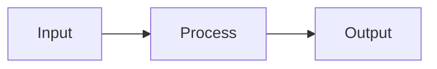

# Documentation Content Writer

## When to Use

- Ready to write content to docs
- Integrating finalized research/findings
- Creating new documentation files
- Merging content into existing docs

## Prerequisites

Before using this skill, ensure:

1. Duplicate check completed (use docs-duplicate-checker)
2. Placement decided (use docs-placement-advisor)
3. Content is finalized and relevant to project

## Project Context to Load

```text
mkdocs.yml                        # For nav updates
docs/zh/design/00-glossary.md     # Use consistent terms
.markdownlint.json                # Formatting rules
```

## Writing Conventions

### File Structure

```markdown
# Page Title

> One-line description (optional)

## Section 1

Content here...

## Section 2

Content here...

---

**Related Documents**

- [Related Doc 1](../path/to/doc.md)
- [Related Doc 2](../path/to/doc.md)

**Last Updated**: YYYY-MM-DD
```

### Markdown Rules (from .markdownlint.json)

- Code blocks MUST have language specifier: ` ```python ` not ` ``` `
- Use ` ```text ` for ASCII diagrams
- No trailing spaces
- Blank lines before/after code blocks
- HTML is allowed if needed
- No line length limit

### Diagram Conventions (Zensical)

**Use Mermaid for these (native support):**



| Type | Works | Use For |
|------|-------|---------|
| Flowchart | ✅ | System flows, pipelines |
| Sequence | ✅ | API calls, user interactions |
| State/Class/ER | ✅ | Technical diagrams |
| Quadrant/Pie/Gantt | ❌ | Don't use - version incompatible |

**For charts that don't work, use ASCII + admonition:**

```markdown
!!! info "Chart Title"
    ```text
    ┌───────────────────────┐
    │  ASCII diagram here   │
    └───────────────────────┘
    ```
```

### Glossary Terms

Use terms from `00-glossary.md` consistently:

- IMU = 惯性测量单元
- EMG = 肌电图/肌肉传感器
- FSR = 力敏电阻
- BLE = 低功耗蓝牙
- ONNX = 开放神经网络交换格式

### Cross-References

```markdown
<!-- Link to related docs -->
详见 [文档标题](../relative/path.md)

<!-- Link to specific section -->
参考 [章节名](../path.md#section-anchor)

<!-- Link to ADR -->
基于 [ADR-0002](../design/decisions/0002-lsm6dsv16x-imu.md) 的决策
```

## Workflow

### For NEW Files

1. **Create file** at recommended path

2. **Use section template**:
   - product/ → business-focused, market context
   - design/ → technical architecture, diagrams
   - design/research/ → research findings, citations
   - components/ → specs tables, supplier info
   - platform/ → implementation details, code examples

3. **Update mkdocs.yml nav**:

   ```yaml
   nav:
     - Section:
       - New Page: path/to/new-file.md  # Add here
   ```

4. **Update section index.md**:

   ```markdown
   | [New Doc](new-file.md) | Brief description |
   ```

5. **Add cross-references** to related docs

### For MERGING into Existing

1. **Find appropriate section** in target file
2. **Maintain existing structure** - don't reorganize
3. **Add content** under relevant heading
4. **Update any related links** if needed
5. **Don't duplicate** - extend, don't repeat

## Output Checklist

```markdown
## Content Written: "{title}"

### File Operations

- [ ] File created/updated: `{path}`
- [ ] mkdocs.yml nav updated: {yes/no}
- [ ] Section index.md updated: {yes/no}

### Quality Checks

- [ ] Code blocks have language specifiers
- [ ] Glossary terms used consistently
- [ ] Cross-references added
- [ ] No content duplication
- [ ] Follows section conventions

### Cross-References Added

- `{file}` → links to this doc
- This doc → links to `{file}`

### Next Steps

{Any follow-up actions needed}
```

## Rules

1. **Never duplicate content** - link instead
2. **Always update nav** for new files
3. **Use relative paths** for internal links
4. **reference/ gets URLs only** - no prose content
5. **Index files are navigation** - brief summaries, not details
6. **Commit message format**: `docs(scope): description`
