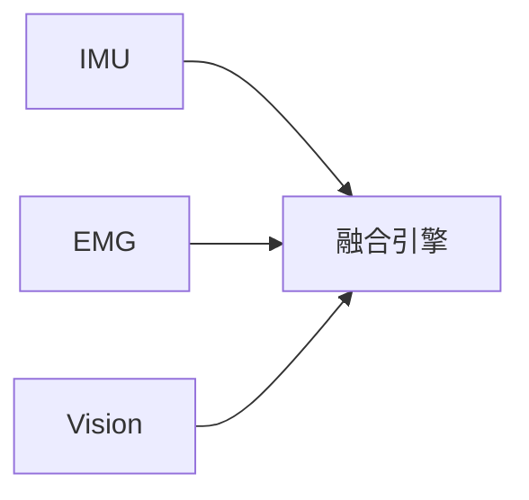

# CLAUDE.md

This file provides guidance to Claude Code (claude.ai/code) when working with code in this repository.

## Project Overview

Movement Chain AI documentation site - built with **Zensical** (MIT-licensed static site generator by Material for MkDocs team) for a golf swing analyzer project combining IMU sensors, EMG, and computer vision.

**Multi-repo structure** (see ADR-0001): This is the docs repo. Related repos: `movement-chain-firmware` (ESP32), `movement-chain-ml` (Python), `movement-chain-mobile` (Flutter), `movement-chain-hardware` (KiCad).

## Commands

```bash
# Prerequisites (first time setup)
pip install zensical
npm install

# Serve documentation locally (default port 8000)
zensical serve

# Build documentation
zensical build

# Lint markdown files
npm run lint:md

# Check links in documentation
npm run lint:links

# Test build (used by pre-push hook)
# IMPORTANT: Run this before pushing to catch broken links
npm run test:build
```

## Git Hooks

The repository uses husky with strict commit standards:

- **pre-commit**: Runs `lint-staged` (markdownlint + markdown-link-check on staged .md files)
- **commit-msg**: Enforces Conventional Commits format
- **pre-push**: Runs `zensical build` and full link check

**Commit format**: `<type>(<scope>): <subject>`
Types: `docs`, `feat`, `fix`, `chore`, `style`, `refactor`, `test`, `ci`, `perf`, `revert`

**Bypassing hooks** (use sparingly):

- `git commit --no-verify` - skip pre-commit/commit-msg
- `git push --no-verify` - skip pre-push

## Documentation Structure

```text
docs/zh/                    # Documentation root (Chinese, single-language)
├── product/                # WHY - Market value, competitive analysis, MVP spec
├── design/                 # WHAT - System architecture, ADRs, algorithms
├── components/             # HARDWARE - IMU, EMG, Vision, MCU specs
├── platform/               # HOW - Mobile dev, ML training, prototype code
├── reference/              # LINKS - External URLs only (no content)
└── archive/                # Historical materials (not in nav)
```

### Folder Purpose Quick Reference

| Folder | Purpose | Audience | Key Files |
|--------|---------|----------|-----------|
| `product/` | Business case, market validation | Investors, PMs | MVP spec, competitive analysis |
| `design/` | Technical architecture | Engineers | system-design.md, ADRs |
| `components/` | Hardware specifications | HW engineers | IMU/EMG datasheets, suppliers |
| `platform/` | Software implementation | SW developers | Flutter guide, prototype code |
| `reference/` | External links only | Everyone | URLs to papers, datasets |

### design/ Structure (Simplified)

```text
design/
├── system-design.md      # Core MVP pipeline (THE main doc)
├── getting-started.md    # Test without hardware
├── decisions-summary.md  # ADR quick reference
├── research/             # Biomechanics glossary, benchmarks, specs
└── decisions/            # Full ADR documents
```

## Language Configuration

- Single-language site (Chinese with some English mixed in)
- All content lives in `docs/zh/` as specified by `docs_dir` in `mkdocs.yml`
- No i18n plugin - Zensical doesn't support it yet
- If multi-language needed in future, maintain separate sites

## Markdown Requirements

- Code blocks require language specifier (MD040): use ` ```text ` for ASCII diagrams
- Blank line required before/after fenced code blocks (MD031)
- Blank line required around lists in blockquotes (MD032)
- No trailing spaces (MD009)
- HTML is allowed (MD033 disabled)
- Line length unlimited (MD013 disabled)

## Diagrams in Zensical

Zensical has **native Mermaid support** via `pymdownx.superfences` (no plugin needed).

### What Works ✅

| Diagram Type | Status | Example Use |
|--------------|--------|-------------|
| Flowchart | ✅ Official | System flows, data pipelines |
| Sequence | ✅ Official | API interactions, user flows |
| State | ✅ Official | State machines |
| Class | ✅ Official | OOP diagrams |
| ER Diagram | ✅ Official | Database schemas |



### What Doesn't Work ❌

| Diagram Type | Issue |
|--------------|-------|
| Quadrant Chart | Requires Mermaid 10.2.0+ (Zensical bundles older) |
| Pie Chart | Unofficial, poor mobile support |
| Gantt | Unofficial, poor mobile support |

### For Unsupported Charts: Use ASCII + Admonition

```markdown
!!! info "市场定位图"
    ```text
    ┌─────────────────────────────────┐
    │  Your ASCII diagram here        │
    └─────────────────────────────────┘
    ```
```

This renders as a styled callout box with the ASCII diagram inside.

## Navigation Configuration

The `nav` section in `mkdocs.yml` controls site navigation. When adding/moving documentation:

1. Create the `.md` file in the appropriate `docs/zh/` subdirectory
2. Add the entry to `nav` in `mkdocs.yml` (Chinese labels)
3. Files not in `nav` are still built but won't appear in navigation

## Key Technical Decisions (ADRs)

Located in `docs/zh/design/decisions/`. Use sequential numbering (ADR-0007, etc.):

- **ADR-0002**: LSM6DSV16X IMU (45+ min drift stability)
- **ADR-0003**: Flutter for cross-platform mobile
- **ADR-0004**: 4-module architecture (Assessment → Diagnosis → Correction → Tracking)
- **ADR-0005**: ESP32-S3 microcontroller
- **ADR-0006**: ONNX Runtime for on-device ML

## Known Issues

- ST.com documentation links (datasheets, MEMS Studio) return Status 0 in automated link checks but are valid - they block automated requests
- Some pre-existing research files in `archive/` have dead external links; use `--no-verify` when pushing if unrelated to your changes
- Link checker config in `.markdown-link-check.json`: 20s timeout, retry on 429, localhost URLs ignored

## Parallel Execution Strategy

**Before starting tasks involving 10+ files or multiple directories, STOP and ask:**

> Should I use parallel subagents?

| Task Type | Approach |
|-----------|----------|
| Audit/scan multiple sections | **Parallel** - spawn Explore agent per section |
| Search across codebase | **Parallel** - use Task tool with `subagent_type=Explore` |
| Fix interdependent files | Sequential - changes affect each other |
| Single file/focused edit | Direct - no subagent needed |

**Trigger words requiring parallel consideration:**
`audit`, `cleanup`, `scan all`, `check everything`, `comprehensive`, `health check`, `find all`

**Pattern for docs tasks:**

```text
# Launch in SINGLE message (parallel):
Task(Explore): "Audit docs/zh/product/ - find orphans, duplicates, broken links"
Task(Explore): "Audit docs/zh/design/ - find orphans, duplicates, broken links"
Task(Explore): "Audit docs/zh/components/ - find orphans, duplicates, broken links"
Task(Explore): "Audit docs/zh/platform/ - find orphans, duplicates, broken links"

# Wait for all results, then:
# 1. Consolidate findings
# 2. Create fix plan
# 3. Execute fixes sequentially (with approval)
```
