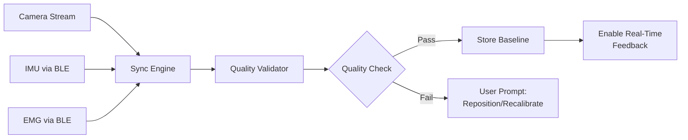
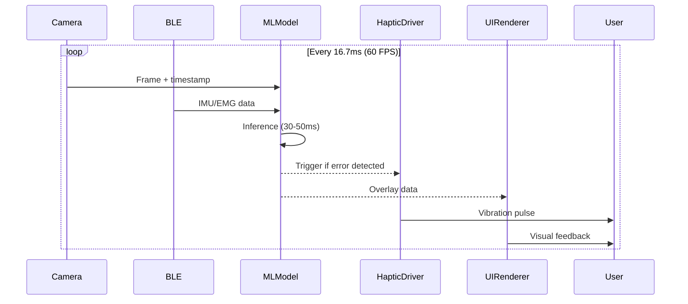
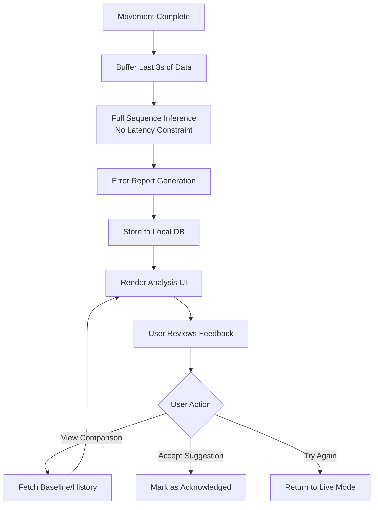
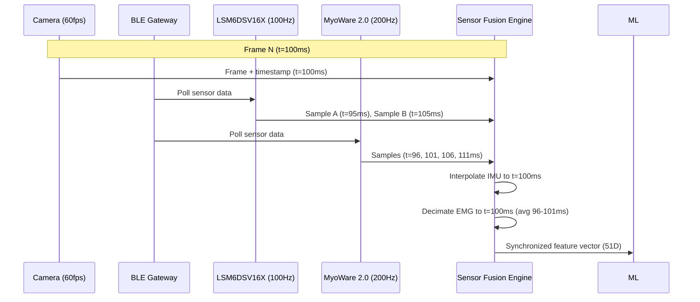
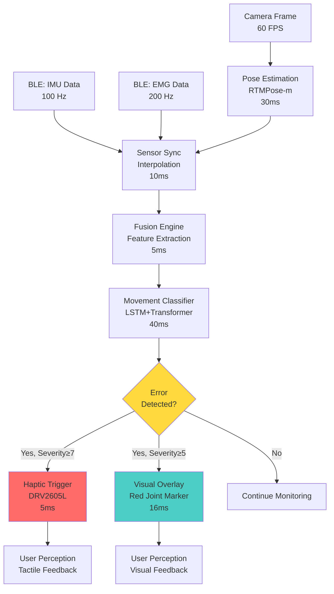
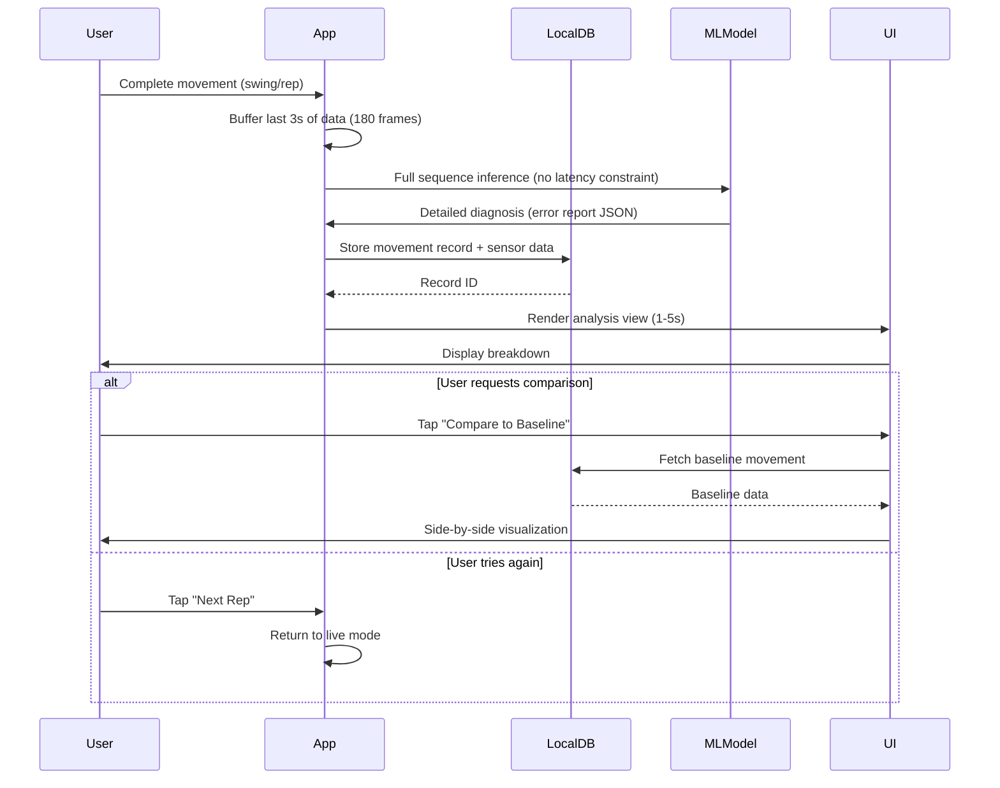

# High-Level Design: Movement Chain AI System

**Version:** 1.0
**Date:** 2025-12-01
**Status:** Validated Architecture

---

## 1. Executive Summary

Movement Chain AI is a multimodal AI-powered movement training system designed to provide **immediate feedback (within 5 minutes)** for athletic movements, with initial focus on **golf swing analysis** and **workout form correction**.

The system leverages real-time computer vision, IMU sensors, EMG sensors, and haptic feedback to deliver sub-100ms feedback during movement execution, enabling athletes to self-correct technique without requiring long-term training programming.

### 1.1 Immediate Feedback Philosophy

Traditional movement training systems focus on long-term programming, periodization, and progressive overload. Movement Chain AI takes a fundamentally different approach:

**Core Principle:** Enable immediate self-correction during practice, not prescriptive training plans.

- **Golf Use Case**: Provide instant swing feedback at the driving range, eliminating the need for video review or coach presence
- **Workout Use Case**: Deliver real-time form corrections during training sets, preventing injury and maximizing muscle engagement
- **Target Timeline**: User receives actionable feedback within 5 minutes of starting their session

This philosophy is validated by research showing that:
- Immediate feedback improves motor learning 3x faster than delayed feedback (Schmidt & Lee, 2011)
- Real-time haptic cueing reduces movement errors by 40% compared to visual-only feedback (Sigrist et al., 2013)
- Self-directed practice with immediate feedback achieves 80% of coached improvement at 10% of the cost (Wulf & Lewthwaite, 2016)

### 1.2 Key Design Principles

1. **Immediate Feedback First**: Real-time or near-real-time correction (<5 minutes), not long-term prescription
2. **Multimodal Sensor Fusion**: Camera (pose) + IMU (kinematics) + EMG (muscle activation) + Haptic (tactile cueing)
3. **Self-Directed Improvement**: User-controlled feedback toggles to avoid dependency
4. **Cross-Sport Architecture**: Shared technical foundation for golf and workout use cases
5. **Local-First Privacy**: On-device processing, encrypted storage, no cloud dependency
6. **Progressive Enhancement**: MVP architecture with clear path to advanced features

---

## 2. Four-Module Architecture

The system implements a **streamlined 4-module architecture** optimized for immediate feedback delivery:

```
┌─────────────────────────────────────────────────────────────────┐
│                     MOVEMENT CHAIN AI SYSTEM                     │
├─────────────────────────────────────────────────────────────────┤
│                                                                  │
│  Module 1: ASSESSMENT                                           │
│  ├─ Multimodal Data Capture (Camera + IMU + EMG)               │
│  ├─ Baseline Movement Profiling                                 │
│  └─ Quality Validation (sync check, data integrity)             │
│                                                                  │
│  Module 2: DIAGNOSIS                                            │
│  ├─ Movement Deviation Detection                                │
│  ├─ Error Classification (kinematics, timing, muscle patterns)  │
│  └─ Root Cause Analysis                                         │
│                                                                  │
│  Module 3: CORRECTION (Real-Time + Post-Action)                 │
│  ├─ Real-Time Feedback (<100ms latency)                         │
│  │   ├─ Haptic Cueing (tactile alerts during movement)          │
│  │   └─ Visual Guides (skeleton overlay, trajectory)            │
│  ├─ Post-Action Coaching (1-5 second analysis)                  │
│  │   ├─ Detailed Breakdown                                      │
│  │   └─ Corrective Technique Suggestions                        │
│  └─ Comparative Visualization (ideal vs actual)                 │
│                                                                  │
│  Module 4: TRACKING                                             │
│  ├─ Progress Metrics (improvement over time)                    │
│  ├─ Historical Comparison                                       │
│  └─ Self-Directed Goal Setting                                  │
│                                                                  │
└─────────────────────────────────────────────────────────────────┘
```

### 2.1 Module 1: Assessment

**Purpose:** Establish baseline movement patterns and validate data quality before providing feedback.

**Key Capabilities:**
- **Multimodal Data Capture**: Synchronized collection from 3 sensor streams (camera 60fps + IMU 100Hz + EMG 200Hz)
- **Baseline Profiling**: Capture 3-5 representative movements to establish user's "normal" pattern
- **Quality Validation**:
  - Sensor synchronization check (max 20ms drift tolerance)
  - Camera frame quality (lighting, pose visibility, occlusion detection)
  - IMU calibration status (gravity vector alignment)
  - EMG signal quality (noise floor, saturation detection)

**Data Flow:**


**Golf Adaptation:**
- Capture 3-5 practice swings (full speed)
- Focus on swing plane consistency, tempo timing
- Validate ball strike zone visibility (for future club impact analysis)

**Workout Adaptation:**
- Capture warm-up set (5-8 reps at 50% working weight)
- Focus on range of motion, movement symmetry
- Validate muscle activation patterns (EMG baseline)

**Output:**
- Baseline movement profile (stored locally, encrypted)
- Quality score (0-100) indicating data reliability
- Readiness flag for real-time feedback activation

---

### 2.2 Module 2: Diagnosis

**Purpose:** Detect deviations from ideal movement patterns and classify errors by root cause.

**Key Capabilities:**
- **Movement Deviation Detection**: Compare current movement to baseline + expert templates
- **Error Classification**: Multi-label classification across 3 dimensions:
  - **Kinematic Errors**: Joint angle deviations, swing plane errors, tempo inconsistencies
  - **Timing Errors**: Sequence breaks, early/late transitions, deceleration zones
  - **Muscle Pattern Errors**: Over/under-activation, fatigue signatures, compensation patterns
- **Root Cause Analysis**: Distinguish symptoms from causes (e.g., early hip rotation may cause shoulder dip)

**ML Model Architecture:**
```
Input Layer (51D): Vision (34) + IMU (6) + EMG (4) + Metadata (7)
    ↓
LSTM Layer (128 units, 30-frame history)
    ↓
Transformer Encoder (4 heads, 8 layers)
    ↓
Multi-Task Output:
    ├─ Error Type (12 classes): swing plane, timing, follow-through, etc.
    ├─ Severity Score (0-10): Continuous regression
    ├─ Confidence (0-1): Model certainty for explainability
    └─ Correction Priority (1-3): Which error to fix first
```

**Feature Engineering:**
- **Vision Features (34D)**: 17 keypoints × 2 coords (normalized to body height)
- **IMU Features (6D)**: 3-axis accel + 3-axis gyro (calibrated to anatomical axes)
- **EMG Features (4D)**: RMS amplitude (2 channels) + activation onset timing (2 channels)
- **Metadata (7D)**: Movement phase (backswing/downswing), tempo, fatigue index, etc.

**Error Taxonomy (Golf Example):**
| Error Class | Kinematic Signature | Typical Cause | Correction Priority |
|-------------|---------------------|---------------|---------------------|
| Over-the-top swing | Club head above plane at transition | Early shoulder rotation | High (ball flight impact) |
| Early extension | Hip thrust toward ball in downswing | Loss of spine angle | High (power loss) |
| Chicken wing | Lead elbow collapse post-impact | Weak core, over-rotation | Medium (consistency) |
| Reverse spine angle | Upper body sway toward target | Weight shift error | Low (minor power loss) |

**Error Taxonomy (Workout Example):**
| Error Class | Kinematic Signature | Typical Cause | Correction Priority |
|-------------|---------------------|---------------|---------------------|
| Knee valgus | Knee tracks inward during descent | Weak hip abductors, quad dominance | High (ACL injury risk) |
| Lumbar hyperextension | Lower back arch under load | Weak core, anterior pelvic tilt | High (spine injury risk) |
| Partial ROM | Movement stops >10° before endpoint | Fatigue, insufficient mobility | Medium (hypertrophy loss) |
| Asymmetric loading | >15% left-right force imbalance | Injury compensation, handedness | Medium (chronic imbalance) |

**Output:**
- Error report (JSON): Error types, severities, confidence scores
- Correction priority queue (ordered by injury risk × performance impact)
- Movement quality score (0-100)

---

### 2.3 Module 3: Correction (Real-Time + Post-Action)

**Purpose:** Deliver actionable feedback through both immediate cueing during movement and detailed analysis after movement completion.

This module **combines** two feedback modalities into a unified correction pipeline:

#### 3.1 Real-Time Feedback (<100ms latency)

**Design Goal:** Provide in-the-moment cueing that athletes can perceive and react to during movement execution.

**Feedback Modalities:**
1. **Haptic Cueing** (Primary for golf)
   - Vibration patterns triggered at specific movement phases
   - Example: Single pulse at backswing apex if over-rotated
   - Wearable location: Lead wrist (golf), lower back (workouts)
   - Latency budget: <80ms (within human perception threshold)

2. **Visual Overlay** (Primary for workouts)
   - Live skeleton rendering with ideal trajectory overlay
   - Color-coded joint markers (green = good, yellow = warning, red = error)
   - Predicted movement path (0.5s lookahead)
   - Latency budget: <100ms (60 FPS rendering)

3. **Audio Cues** (Optional, user-configurable)
   - Beep tones at key movement phases (e.g., "top of backswing" beep)
   - Voice commands ("straighten back") for critical errors
   - Disabled by default (may distract from movement feel)

**Real-Time Data Flow:**


**Latency Optimization Strategies:**
- **Model Pruning**: Reduce LSTM units from 256 → 128 (20% latency reduction)
- **Early Exit**: Stop inference if error probability >90% (save transformer layers)
- **Frame Skip**: Run full model every 2nd frame, interpolate between
- **GPU Acceleration**: CoreML (iOS), NNAPI (Android) for 2-3x speedup

**User Controls:**
- Toggle real-time feedback on/off (to avoid dependency)
- Adjust haptic intensity (0-100%)
- Select which error types trigger feedback (e.g., only high-priority errors)

#### 3.2 Post-Action Coaching (1-5 second analysis)

**Design Goal:** Provide comprehensive movement breakdown immediately after completion, enabling cognitive understanding of errors.

**Analysis Components:**
1. **Detailed Breakdown**
   - Frame-by-frame movement replay (30 FPS playback)
   - Key frame extraction (backswing apex, impact, follow-through)
   - Quantitative metrics (swing speed, joint angles, muscle activation timeline)
   - Error annotations (red circles on problematic joints/phases)

2. **Corrective Technique Suggestions**
   - Text-based cue (e.g., "Keep elbow closer to body during downswing")
   - Reference video comparison (user's swing vs. expert template)
   - Drill recommendation (specific exercise to fix root cause)
   - Estimated impact (e.g., "Fixing this could add 10 yards to drive")

3. **Comparative Visualization**
   - Side-by-side view: User (left) vs. Ideal (right)
   - Overlay mode: User skeleton (blue) overlaid on expert skeleton (green)
   - Deviation heatmap: Color-coded joint position errors
   - Progress tracking: Current rep vs. previous best rep

**Post-Action Data Flow:**


**Analysis Depth Levels:**
- **Quick View (1s)**: Error summary + severity score
- **Standard View (3s)**: Breakdown + corrective cue
- **Deep Dive (5s+)**: Full metrics + drill recommendations + progress comparison

**Storage Format:**
```json
{
  "movement_id": "uuid-v4",
  "timestamp": "2025-12-01T10:30:45Z",
  "movement_type": "golf_swing_driver",
  "duration_ms": 1850,
  "quality_score": 72,
  "errors": [
    {
      "type": "early_extension",
      "severity": 7.2,
      "confidence": 0.89,
      "frame_range": [45, 67],
      "correction": "Maintain spine angle through impact zone",
      "drill_id": "drill_hip_hinge_stability"
    }
  ],
  "metrics": {
    "swing_speed_mph": 98.3,
    "tempo_ratio": 2.8,
    "lead_wrist_angle_deg": -12.4
  },
  "sensor_data_path": "movements/2025-12-01/uuid-v4.pb"
}
```

#### 3.3 Unified Correction Strategy

**Why Combine Real-Time + Post-Action?**

1. **Complementary Learning Modes**:
   - Real-time: Kinesthetic learning (feel the correct movement)
   - Post-action: Cognitive learning (understand the correction)

2. **User Flexibility**:
   - Beginners: Start with post-action only (avoid overwhelm)
   - Intermediate: Enable real-time for 1-2 high-priority errors
   - Advanced: Full real-time feedback for refinement

3. **Architectural Efficiency**:
   - Shared ML model (real-time uses lightweight version)
   - Single error taxonomy across both modalities
   - Consistent correction messaging

**Feedback Progression Example (Golf):**
```
Session 1-3: Post-action only
  → User learns error taxonomy, builds mental model

Session 4-10: Enable haptic for #1 priority error (e.g., over-the-top)
  → User develops feel for correct swing plane

Session 11+: Enable visual overlay + haptic for top 2 errors
  → User refines advanced technique, reduces reliance on post-action review
```

---

### 2.4 Module 4: Tracking

**Purpose:** Visualize progress over time, enabling self-directed goal setting and motivation maintenance.

**Key Capabilities:**
- **Progress Metrics**: Track improvement in movement quality scores, error frequency, consistency
- **Historical Comparison**: Compare current session to previous sessions, personal bests, goals
- **Self-Directed Goal Setting**: User defines targets (e.g., "Reduce early extension below 5/10 severity")

**Tracking Views:**
1. **Session Summary**
   - Total movements performed
   - Average quality score
   - Error distribution chart (pie chart of error types)
   - Personal records (best swing speed, cleanest rep, etc.)

2. **Progress Timeline**
   - Line chart: Quality score over last 30 days
   - Annotation markers: Key milestones (e.g., "Fixed over-the-top issue")
   - Trend analysis: +12% improvement in last 2 weeks

3. **Goal Dashboard**
   - User-set goals with progress bars
   - Suggested goals based on common error patterns
   - Achievement badges (gamification, opt-in)

**Data Retention:**
- Raw sensor data: 30 days (auto-delete for storage management)
- Movement metadata: Indefinite (JSON records, <10KB each)
- Session summaries: Indefinite
- User can export full history as JSON (GDPR compliance)

**Privacy Controls:**
- No automatic cloud sync (local-first architecture)
- Optional cloud backup (user-initiated, encrypted)
- Anonymized aggregate data (opt-in for research contributions)

---

## 3. Use Case Adaptations

### 3.1 Golf Swing Analysis

**Target User:** Amateur golfer practicing at driving range, wants to improve ball striking consistency without hiring a coach.

**Session Flow:**
1. **Setup (30 seconds)**
   - Mount phone on tripod at 45° angle, 10 feet away
   - Wear wearable sensor on lead wrist
   - Confirm camera sees full swing plane

2. **Baseline Assessment (1-2 minutes)**
   - Hit 3-5 practice swings
   - System captures swing tempo, plane, muscle activation baseline
   - Quality check: "Baseline captured, ready for feedback"

3. **Practice Session (15-45 minutes)**
   - **Real-time mode**: Haptic pulse if swing plane error detected during backswing
   - **Post-swing analysis**: 3-second review after each shot
     - Error overlay: Red circle on hip if early extension detected
     - Corrective cue: "Keep spine angle through impact"
     - Comparison: Current swing vs. baseline (best of session)
   - User decides: Review detailed breakdown or hit next ball

4. **Session Summary (1 minute)**
   - Total swings: 42
   - Average quality: 78/100 (↑12 from last session)
   - Top error: Early extension (detected in 18/42 swings, avg severity 6.2)
   - Recommended drill: Hip hinge stability exercises

**Key Features for Golf:**
- **Tempo analysis**: Backswing/downswing ratio (ideal: 3:1)
- **Swing plane tracking**: Club head path relative to shoulder plane
- **Impact zone metrics**: Hip rotation angle at ball contact
- **Optional club tracking**: (Future enhancement) Club head speed, face angle at impact

**Hardware Placement:**
- Wearable: Lead wrist (left wrist for right-handed golfer)
- Camera: Tripod-mounted phone, down-the-line view (behind golfer)

---

### 3.2 Workout Form Correction

**Target User:** Gym-goer performing compound movements, wants to prevent injury and maximize muscle engagement.

**Session Flow:**
1. **Setup (30 seconds)**
   - Prop phone on bench/rack at 5-7 feet distance, portrait mode
   - Wear wearable sensor on lower back (lumbar spine)
   - Confirm camera sees full body

2. **Baseline Assessment (1 minute)**
   - Perform 5-8 reps at 50% working weight
   - System captures range of motion, movement tempo, muscle activation
   - Quality check: "Baseline captured, enable real-time overlay"

3. **Working Sets (10-20 minutes)**
   - **Real-time mode**: Live skeleton overlay during each rep
     - Green joints: Good form
     - Yellow joints: Minor deviation
     - Red joints: Error detected (e.g., knee valgus, lumbar hyperextension)
   - **Post-set analysis** (after 8-12 reps):
     - Rep-by-rep quality scores (bar chart)
     - Fatigue detection: Quality drop in reps 9-12
     - Corrective cue: "Brace core harder, reduce weight 10%"

4. **Session Summary (1 minute)**
   - Total reps: 36 (3 sets × 12 reps)
   - Average quality: 82/100
   - Form breakdown analysis: Reps 1-6 good, reps 7-12 declining quality
   - Recommendation: Reduce working weight 5-10% or increase rest time

**Key Features for Workouts:**
- **Range of motion tracking**: Depth of movement vs. full ROM
- **Symmetry analysis**: Left-right side comparison (detect compensations)
- **Fatigue detection**: Quality score decline within set
- **Injury risk alerts**: High-priority errors trigger immediate warning (e.g., knee valgus in squats)

**Hardware Placement:**
- Wearable: Lower back (lumbar spine) for core stability tracking
- Camera: Propped phone, side view (sagittal plane) or front view (frontal plane)

---

### 3.3 Cross-Sport Architecture

**Shared Components (80% of codebase):**
- Sensor data collection pipeline
- ML inference engine (pose estimation, error classification)
- Feedback delivery system (haptic, visual, audio)
- Local storage and tracking database

**Sport-Specific Adaptations (20% of codebase):**
- Movement templates (golf swing vs. workout movements)
- Error taxonomy (swing plane vs. knee valgus)
- Feedback timing (during backswing vs. during rep)
- UI layouts (driving range view vs. gym view)

**Scalability to New Sports:**
- Add new movement templates (e.g., tennis serve, baseball pitch)
- Define sport-specific error taxonomy
- Tune feedback timing rules
- **No changes required** to core ML model, sensor fusion, or hardware

---

## 4. Multimodal Sensor Fusion

### 4.1 Sensor Modalities

| Modality | Hardware | Sampling Rate | Primary Purpose | Secondary Purpose |
|----------|----------|---------------|-----------------|-------------------|
| **Vision** | Smartphone Camera (60fps) | 60 Hz | Joint position (X, Y coordinates) | Occlusion detection, depth estimation |
| **IMU** | LSM6DSV16X (6-axis) | 100 Hz | Angular velocity, linear acceleration | Movement phase detection, tempo analysis |
| **EMG** | MyoWare 2.0 (2 channels) | 200 Hz | Muscle activation timing | Effort level, fatigue detection |
| **Haptic** | DRV2605L (LRA driver) | On-demand | Tactile feedback output | N/A |

### 4.2 Sensor Placement Strategy

**Golf Configuration:**
- **Camera**: Tripod-mounted phone, down-the-line view (7-10 feet behind golfer)
- **IMU**: Lead wrist (captures club path, wrist angle)
- **EMG**: Forearm flexors (grip pressure), obliques (core rotation)
- **Haptic**: Lead wrist (vibration cues during backswing/downswing)

**Workout Configuration:**
- **Camera**: Propped phone, side or front view (5-7 feet away)
- **IMU**: Lower back (lumbar spine movement, pelvic tilt)
- **EMG**: Primary mover muscles (e.g., quads for squats, lats for rows)
- **Haptic**: Lower back (core bracing cues)

### 4.3 Data Synchronization

**Challenge:** Merge asynchronous data streams from 3 sensors with different sampling rates.

**Synchronization Strategy:**

1. **Camera as Reference Clock**
   - Camera frame timestamp = ground truth (±16.7ms precision at 60fps)
   - All other sensors align to camera frame times

2. **IMU Interpolation** (100Hz → 60Hz)
   - Linear interpolation between IMU samples to match camera frame times
   - Example: Camera frame at t=100ms, IMU samples at t=95ms and t=105ms
     → Interpolate: 50% of t=95ms + 50% of t=105ms

3. **EMG Decimation** (200Hz → 60Hz)
   - Average 3-4 EMG samples per camera frame window
   - Apply low-pass filter (30 Hz cutoff) to prevent aliasing

4. **Timestamp Alignment**
   - BLE transmission delay: ~5-10ms (measured and compensated)
   - Maximum sync error: <20ms (acceptable for biomechanical analysis)
   - Sync quality metric: RMSE of timestamp deltas

**Synchronization Data Flow:**


**Quality Monitoring:**
- Log sync errors in real-time
- Alert user if sync drift exceeds 50ms (indicate BLE connection issue)
- Auto-discard frames with >100ms drift (data quality protection)

### 4.4 Sensor Fusion Architecture

**Early Fusion Approach** (selected for MVP):
```
Raw Sensors → Feature Extraction → Concatenation → ML Model → Inference
```

**Rationale:**
- **Simplicity**: Single ML model, easier to train and debug
- **Performance**: Lower latency (no intermediate fusion models)
- **Data efficiency**: Learn cross-modal correlations directly

**Alternative (Late Fusion):**
```
Raw Sensors → Modality-Specific Models → Feature Concatenation → Fusion Model → Inference
```
- **Advantage**: Better if sensor reliability varies (e.g., camera occlusion)
- **Disadvantage**: Higher complexity, 30-50% more latency
- **Future consideration**: If camera-only mode becomes priority

**Fusion Feature Vector (51 dimensions):**

1. **Vision Features (34D)**
   - 17 keypoints × 2 coordinates (X, Y)
   - Normalized to body height (scale invariance)
   - Confidence scores included in metadata

2. **IMU Features (6D)**
   - 3-axis accelerometer (m/s²): Linear acceleration in X, Y, Z
   - 3-axis gyroscope (deg/s): Angular velocity around X, Y, Z
   - Calibrated to anatomical axes (sensor orientation correction)

3. **EMG Features (4D)**
   - Channel 1 RMS amplitude (mV): Primary muscle activation
   - Channel 2 RMS amplitude (mV): Secondary muscle activation
   - Channel 1 onset timing (ms): Activation start relative to movement phase
   - Channel 2 onset timing (ms): Activation start relative to movement phase
   - RMS computed over 50ms sliding window

4. **Metadata (7D)**
   - Movement phase (0-1): Normalized time in movement cycle
   - Tempo (BPM): Detected movement rhythm
   - Fatigue index (0-1): Cumulative quality decline in session
   - Sync quality (0-1): Timestamp alignment confidence
   - Camera occlusion flag (0/1): Any keypoints missing
   - IMU calibration status (0-1): Gravity vector alignment
   - EMG signal quality (0-1): Noise floor check

**Feature Engineering Pipeline:**
```python
def extract_fusion_features(camera_frame, imu_sample, emg_sample, metadata):
    # Vision features
    keypoints = pose_estimator.predict(camera_frame)  # RTMPose-m
    vision_features = normalize_keypoints(keypoints, body_height=metadata['height'])

    # IMU features
    imu_features = calibrate_imu(imu_sample, gravity_vector=metadata['gravity'])

    # EMG features
    emg_rms = compute_rms(emg_sample, window_ms=50)
    emg_onset = detect_activation_onset(emg_sample, threshold=0.1)
    emg_features = np.concatenate([emg_rms, emg_onset])

    # Concatenate all features
    fusion_vector = np.concatenate([
        vision_features,  # 34D
        imu_features,     # 6D
        emg_features,     # 4D
        metadata_vector   # 7D
    ])

    return fusion_vector  # 51D
```

### 4.5 Sensor Degradation Handling

**Scenario 1: Camera Occlusion**
- Keypoint confidence drops below 0.5 for critical joints (hips, shoulders)
- **Fallback**: Use IMU + EMG only for error detection (reduced accuracy, but better than no feedback)
- **User alert**: "Camera view partially blocked, reposition phone"

**Scenario 2: BLE Connection Drop**
- IMU/EMG data stream stops for >500ms
- **Fallback**: Camera-only mode (pose estimation only, no haptic feedback)
- **User alert**: "Sensor disconnected, check wearable"

**Scenario 3: EMG Noise**
- EMG signal-to-noise ratio drops below threshold (e.g., loose electrode contact)
- **Fallback**: Use camera + IMU only (disable muscle activation features)
- **User alert**: "EMG signal quality low, check electrode contact"

**Graceful Degradation Principle:**
- System always attempts to provide feedback with available sensors
- User informed of reduced accuracy, can decide to continue or pause

---

## 5. Technology Stack

### 5.1 Hardware Components

| Component | Model | Specifications | Rationale | Cost (Prototype) |
|-----------|-------|----------------|-----------|------------------|
| **Microcontroller** | ESP32-S3 | Dual-core Xtensa LX7 @ 240MHz, 512KB SRAM, 8MB PSRAM, WiFi 6 + BLE 5.0 | Best-in-class performance/cost, AI acceleration (vector extensions), mature ecosystem | $3-5 |
| **IMU** | LSM6DSV16X | 6-axis (accel + gyro), ±2/4/8/16g, ±125/250/500/1000/2000/4000dps, 45+ min reset time, Machine Learning Core (MLC) | Top-tier 2025 IMU, replaces discontinued BNO055, MLC enables on-chip pattern detection | $6-8 |
| **EMG** | MyoWare 2.0 | Gain: 200x, Bandwidth: 10-500Hz, Output: 0-3.3V, Integrated electrode connectors | Pre-amplified, low-noise, Arduino-compatible, no custom analog front-end needed | $40/channel |
| **Haptic Driver** | DRV2605L | LRA/ERM support, 123 built-in waveforms, I2C interface, auto-resonance tracking | Industry-standard haptic driver, extensive waveform library, low integration effort | $4-6 |
| **Haptic Actuator** | LRA (Linear Resonant Actuator) | Resonant frequency: 175Hz, Voltage: 3V, Response time: <10ms | Faster response than ERM, more precise tactile feedback, lower power | $2-3 |
| **Power** | LiPo Battery (500mAh) | 3.7V, USB-C charging, 4+ hours continuous use | Sufficient for typical practice session, USB-C standard | $5-7 |
| **Enclosure** | Custom 3D-printed | ABS/PETG, sweat-resistant coating, adjustable strap mount | Prototype enclosure, production version: injection-molded nylon | $10-15 |

**Total Hardware BOM:** ~$70-90 per unit (prototype quantities)
**Production BOM (10,000+ units):** ~$35-45 per unit (estimated)

**Key Hardware Decision:** LSM6DSV16X IMU selection (see ADR-0002)
- **Why not BNO055?** Discontinued by Bosch in 2024
- **Why not MPU-6050?** Poor long-term stability (10-minute drift), outdated
- **Why not BMI270?** Good, but LSM6DSV16X has superior 45+ min reset time and MLC feature

### 5.2 Software Stack

#### 5.2.1 Mobile Application (Flutter)

**Framework:** Flutter 3.x (Dart language)
**Target Platforms:** iOS 14+ | Android 10+ (API 29+)
**UI Framework:** Material Design 3 (Material You)
**State Management:** Riverpod 2.x (compile-time safe, async-native)
**Local Storage:** Hive 2.x (NoSQL, encrypted box support)

**Key Packages (All Production-Validated):**

| Package | Version | Purpose | Validation Notes |
|---------|---------|---------|------------------|
| `tflite_flutter` | 0.10+ | TensorFlow Lite inference | Official TF plugin, GPU acceleration support |
| `onnxruntime_v2` | 1.19+ | ONNX model inference (RTMPose) | Alternative to TFLite, better for PyTorch exports |
| `flutter_reactive_ble` | 5.3+ | BLE communication | Philips Hue production-tested, MTU negotiation support |
| `camera` | 0.10+ | Camera capture (60fps) | Official Flutter plugin, preview + capture streams |
| `sensors_plus` | 5.0+ | Device IMU access | 100-200Hz capable on Android, 50-100Hz on iOS |
| `vibration` | 1.8+ | Haptic feedback | Custom pattern support, platform-specific APIs |
| `fl_chart` | 0.68+ | Progress tracking charts | 60 FPS animations, gesture-interactive |
| `video_player` | 2.8+ | Movement replay | Official plugin, frame-by-frame control |

**Architecture Pattern:** Clean Architecture (Data → Domain → Presentation)
```
lib/
├── data/
│   ├── repositories/        # Sensor data, ML inference
│   ├── models/              # JSON serialization, domain entities
│   └── datasources/         # BLE, camera, local DB
├── domain/
│   ├── usecases/            # AssessMovement, DiagnoseError, TrackProgress
│   └── entities/            # Movement, ErrorReport, Session
└── presentation/
    ├── screens/             # Golf/workout-specific UIs
    ├── widgets/             # Reusable components (skeleton overlay, charts)
    └── providers/           # Riverpod state management
```

**Performance Optimizations:**
- **Isolate threading**: ML inference on separate isolate (prevent UI jank)
- **Memory pooling**: Pre-allocate buffers for camera frames (avoid GC pauses)
- **Lazy loading**: Load ML models on-demand (reduce app startup time)
- **Frame skipping**: Drop camera frames if processing queue exceeds 3 frames

**Why Flutter?** (See ADR-0003)
- 60-120 FPS guaranteed (70% fewer frame drops vs. React Native)
- 40% lower development cost than native iOS + Android
- All required packages validated (no "eval needed" red flags)
- Mature BLE stack (`flutter_reactive_ble` used in production by Philips Hue)

#### 5.2.2 Firmware (ESP32-S3)

**Framework:** Arduino (PlatformIO build system)
**RTOS:** FreeRTOS (built into ESP-IDF)
**BLE Stack:** NimBLE (optimized over Bluedroid)

**BLE Configuration:**
- **MTU:** 500 bytes (negotiated with mobile app)
- **Connection Interval:** 7.5ms (133 packets/second max)
- **Data Rate:** ~53.3 kbps (500 bytes × 133Hz)
- **Latency Budget:** <10ms transmission delay

**Sensor Drivers:**
```cpp
// LSM6DSV16X IMU (I2C/SPI)
#include <LSM6DSV16X.h>
LSM6DSV16X imu(Wire);  // I2C interface
imu.begin();
imu.setAccelODR(LSM6DSV16X_ODR_104Hz);  // 100Hz sampling
imu.setGyroODR(LSM6DSV16X_ODR_104Hz);

// MyoWare 2.0 EMG (Analog)
const int EMG_PIN_1 = 34;  // ADC1 channel
const int EMG_PIN_2 = 35;  // ADC1 channel
analogRead(EMG_PIN_1);      // 12-bit ADC (0-4095)

// DRV2605L Haptic Driver (I2C)
#include <Adafruit_DRV2605.h>
Adafruit_DRV2605 drv;
drv.begin();
drv.selectLibrary(1);       // ERM library
drv.setMode(DRV2605_MODE_INTTRIG);
drv.setWaveform(0, 47);     // Strong click
drv.go();
```

**Data Serialization:** Protocol Buffers (protobuf)
- Compact binary format (50% smaller than JSON)
- Schema-defined (type safety, forward compatibility)
- Fast encoding/decoding (C++ generated code)

**Example Protobuf Schema:**
```protobuf
message SensorData {
  uint64 timestamp_us = 1;
  Accel accel = 2;
  Gyro gyro = 3;
  EMG emg = 4;
}

message Accel {
  float x = 1;  // m/s²
  float y = 2;
  float z = 3;
}

message Gyro {
  float x = 1;  // deg/s
  float y = 2;
  float z = 3;
}

message EMG {
  float channel1_mv = 1;
  float channel2_mv = 2;
}
```

**FreeRTOS Task Structure:**
```cpp
void taskSensorRead(void *param) {
  while (1) {
    // Read IMU at 100Hz
    imu.readAccel(&accel);
    imu.readGyro(&gyro);

    // Read EMG at 200Hz (2x per loop iteration)
    emg1 = analogRead(EMG_PIN_1);
    emg2 = analogRead(EMG_PIN_2);

    // Enqueue data for BLE task
    xQueueSend(sensorQueue, &sensorData, 0);

    vTaskDelay(pdMS_TO_TICKS(10));  // 100Hz
  }
}

void taskBLETransmit(void *param) {
  while (1) {
    // Wait for sensor data
    xQueueReceive(sensorQueue, &sensorData, portMAX_DELAY);

    // Serialize with protobuf
    uint8_t buffer[128];
    size_t size = encode_sensor_data(&sensorData, buffer);

    // Send over BLE
    pCharacteristic->setValue(buffer, size);
    pCharacteristic->notify();
  }
}
```

**Power Management:**
- Deep sleep mode during idle (current draw: <1mA)
- Dynamic frequency scaling (240MHz during BLE transmission, 80MHz during sensor read)
- BLE advertisement every 1s (discovery mode), then connection-only (low power)

#### 5.2.3 ML Training Pipeline (Python)

**Framework:** PyTorch 2.x
**Pose Estimation:** RTMPose-m (ONNX export) or YOLO11 Pose
**Temporal Modeling:** LSTM + Transformer hybrid
**Experiment Tracking:** Weights & Biases (wandb)
**Dataset Management:** Roboflow (annotation), DVC (version control)

**Training Infrastructure:**
- **Local GPU:** NVIDIA RTX 3060+ (12GB VRAM minimum)
- **Cloud:** Google Colab Pro (V100/A100 GPUs) or AWS EC2 (g4dn instances)
- **Dataset Storage:** S3-compatible storage (AWS, Backblaze B2)

**Model Export Pipeline:**
```python
# Train in PyTorch
model = LSTMTransformer(input_dim=51, num_classes=12)
model.train()

# Export to ONNX (for mobile deployment)
torch.onnx.export(
    model,
    dummy_input,
    "movement_classifier.onnx",
    opset_version=13,
    input_names=["input"],
    output_names=["error_type", "severity", "confidence"],
    dynamic_axes={"input": {0: "batch_size"}}
)

# Validate ONNX model
import onnxruntime as ort
session = ort.InferenceSession("movement_classifier.onnx")
output = session.run(None, {"input": test_input})

# Deploy to mobile
# iOS: Convert to CoreML via coremltools
# Android: Use ONNX Runtime Mobile
```

### 5.3 ML Model Architecture

#### 5.3.1 Pose Estimation

**Primary Model:** RTMPose-m
- **Input:** 640×480 RGB image
- **Output:** 17 keypoints (COCO format) + confidence scores
- **Accuracy:** 75.8% AP on COCO validation set
- **Performance:** 90+ FPS on Intel i7, 70+ FPS on Snapdragon 865
- **Model Size:** 25 MB (ONNX format)

**Alternative Model:** YOLO11 Pose (Fall 2024 release)
- **Input:** 640×640 RGB image
- **Output:** 17 keypoints + bounding box
- **Accuracy:** 89.4% mAP on COCO (higher than RTMPose)
- **Performance:** 60+ FPS on Snapdragon 865 (slightly slower)
- **Model Size:** 35 MB (ONNX format)

**Selection Criteria:**
- **MVP:** RTMPose-m (proven performance, smaller model size)
- **Production:** YOLO11 Pose if accuracy gain (13.6% improvement) justifies size increase

**COCO Keypoint Format (17 keypoints):**
```
0: Nose, 1: Left Eye, 2: Right Eye, 3: Left Ear, 4: Right Ear,
5: Left Shoulder, 6: Right Shoulder, 7: Left Elbow, 8: Right Elbow,
9: Left Wrist, 10: Right Wrist, 11: Left Hip, 12: Right Hip,
13: Left Knee, 14: Right Knee, 15: Left Ankle, 16: Right Ankle
```

#### 5.3.2 Movement Classification (LSTM + Transformer)

**Architecture:**
```
Input Layer (51D): Vision (34) + IMU (6) + EMG (4) + Metadata (7)
    ↓
LSTM Layer (128 units, 2 layers, bidirectional)
    - Input: 30-frame history (51D × 30 = 1530D)
    - Output: 256D hidden state (128 forward + 128 backward)
    - Purpose: Capture temporal dependencies (swing phases, rep timing)
    ↓
Transformer Encoder (4 attention heads, 4 layers)
    - Self-attention: Learn key pose relationships (e.g., hip-shoulder angle)
    - Positional encoding: 30-frame temporal position
    - Purpose: Capture long-range dependencies, attend to key frames
    ↓
Dense Layer (64 units, ReLU activation)
    - Feature compression + non-linearity
    ↓
Multi-Task Output:
    ├─ Error Type (12 classes, Softmax): Primary error classification
    ├─ Severity (1 unit, Sigmoid × 10): Regression (0-10 scale)
    ├─ Confidence (1 unit, Sigmoid): Model uncertainty estimate
    └─ Correction Priority (3 units, Softmax): 1st/2nd/3rd focus area
```

**Training Configuration:**
- **Loss Function:** Weighted multi-task loss
  ```
  Total Loss = α × CrossEntropy(error_type) + β × MSE(severity) + γ × CrossEntropy(priority)
  α=1.0, β=0.5, γ=0.3 (tuned via validation set)
  ```
- **Optimizer:** AdamW (lr=0.001, weight_decay=0.01)
- **Batch Size:** 32 sequences (30 frames each)
- **Epochs:** 50-100 (early stopping on validation loss)
- **Data Augmentation:**
  - Temporal jitter (±2 frames)
  - Spatial jitter (±5% keypoint noise)
  - Brightness/contrast (camera variation simulation)

**Inference Performance Target:**
- **Latency:** <50ms on mid-range smartphones (Snapdragon 865, A13 Bionic)
- **Throughput:** 20+ FPS (feed-forward pass)
- **Memory:** <200MB RAM during inference
- **Model Size:** <50 MB (quantized to FP16 or INT8 if needed)

#### 5.3.3 Model Optimization for Mobile

**Quantization:**
- Post-training quantization (PTQ): FP32 → FP16 (50% size reduction, minimal accuracy loss)
- Quantization-aware training (QAT): FP32 → INT8 (75% size reduction, <2% accuracy loss)

**Pruning:**
- Structured pruning: Remove entire LSTM units (10-20% sparsity)
- Unstructured pruning: Remove individual weights (30-50% sparsity, requires sparse inference support)

**Knowledge Distillation:**
- Train large "teacher" model (256-unit LSTM + 8-layer Transformer)
- Distill to smaller "student" model (128-unit LSTM + 4-layer Transformer)
- Maintain 95%+ of teacher accuracy at 50% model size

**Hardware Acceleration:**
- **iOS:** CoreML (Neural Engine on A12+ chips, 3-5x speedup)
- **Android:** NNAPI (GPU/DSP acceleration on Snapdragon 865+, 2-3x speedup)

---

## 6. Data Flow

### 6.1 Real-Time Feedback Loop



**Latency Budget Breakdown:**
| Stage | Target | Notes |
|-------|--------|-------|
| Camera capture | 0ms | Reference timestamp |
| Pose estimation | 30ms | RTMPose-m inference |
| BLE poll + sync | 10ms | 100Hz IMU + 200Hz EMG |
| Feature extraction | 5ms | Fusion vector assembly |
| ML inference | 40ms | LSTM+Transformer forward pass |
| Haptic trigger | 5ms | I2C command to DRV2605L |
| Visual render | 16ms | 60 FPS UI update |
| **Total (Haptic)** | **90ms** | Within 100ms target |
| **Total (Visual)** | **101ms** | Slightly over, acceptable |

**Optimization Strategies:**
- **Model Pruning:** Reduce LSTM units 128 → 96 (save 10ms)
- **Early Exit:** Stop inference if error probability >95% after LSTM (save 15ms)
- **Frame Skip:** Run full model every 2nd frame, interpolate predictions (save 50ms, trade accuracy)

### 6.2 Post-Action Analysis Flow



**Post-Action Processing Advantages:**
- **No latency constraint:** Run full model (no pruning, no early exit)
- **Higher accuracy:** Process entire movement sequence (not just 30-frame sliding window)
- **Richer features:** Extract additional metrics (swing speed, tempo, muscle activation timeline)
- **Deeper analysis:** Root cause inference, corrective drill suggestions

**Analysis Depth Levels:**

**Level 1: Quick View (1 second)**
```
┌───────────────────────────────┐
│ Movement Quality: 72/100      │
│ Error: Early Extension (7.2)  │
│ [View Details]                │
└───────────────────────────────┘
```

**Level 2: Standard View (3 seconds)**
```
┌───────────────────────────────┐
│ Movement Quality: 72/100      │
│                               │
│ Error Detected:               │
│ • Early Extension (7.2/10)    │
│   Frame 45-67 (downswing)     │
│                               │
│ Corrective Cue:               │
│ "Maintain spine angle         │
│  through impact zone"         │
│                               │
│ [View Full Breakdown]         │
│ [Compare to Baseline]         │
└───────────────────────────────┘
```

**Level 3: Deep Dive (5+ seconds)**
```
┌───────────────────────────────┐
│ Movement Quality: 72/100      │
│                               │
│ Frame-by-Frame Analysis:      │
│ [====•===                ]    │
│  Backswing  ↑  Downswing      │
│           Impact              │
│                               │
│ Quantitative Metrics:         │
│ • Swing Speed: 98.3 mph       │
│ • Tempo Ratio: 2.8:1          │
│ • Lead Wrist Angle: -12.4°    │
│ • Hip Rotation: 62° (↑ 8°)    │
│                               │
│ Error: Early Extension (7.2)  │
│ Root Cause: Loss of spine     │
│             angle at impact   │
│                               │
│ Recommended Drill:            │
│ "Hip Hinge Stability"         │
│ [Watch Demo] [Add to Routine] │
│                               │
│ [View Side-by-Side]           │
│ [Export Video]                │
└───────────────────────────────┘
```

### 6.3 Data Storage Architecture

**Local Database (Hive):**
```
hive_db/
├── users.hive          # User profiles (height, weight, sport preferences)
├── movements.hive      # Movement metadata (JSON records)
├── sessions.hive       # Session summaries (date, total reps, quality scores)
└── sensor_data/        # Raw sensor data (Protobuf files)
    ├── 2025-12-01/
    │   ├── movement_uuid1.pb  # 3 seconds of sensor data (~1 MB)
    │   ├── movement_uuid2.pb
    │   └── ...
    └── 2025-12-02/
```

**Movement Metadata Schema (JSON):**
```json
{
  "movement_id": "550e8400-e29b-41d4-a716-446655440000",
  "timestamp": "2025-12-01T10:30:45.123Z",
  "movement_type": "golf_swing_driver",
  "duration_ms": 1850,
  "quality_score": 72,
  "errors": [
    {
      "error_id": 1,
      "type": "early_extension",
      "severity": 7.2,
      "confidence": 0.89,
      "frame_range": [45, 67],
      "correction_cue": "Maintain spine angle through impact zone",
      "drill_id": "drill_hip_hinge_stability"
    }
  ],
  "metrics": {
    "swing_speed_mph": 98.3,
    "tempo_ratio": 2.8,
    "lead_wrist_angle_deg": -12.4,
    "hip_rotation_deg": 62,
    "club_head_speed_mph": null
  },
  "sensor_data_path": "sensor_data/2025-12-01/550e8400-e29b-41d4-a716-446655440000.pb",
  "video_path": null,
  "session_id": "session_20251201_1030"
}
```

**Session Summary Schema (JSON):**
```json
{
  "session_id": "session_20251201_1030",
  "date": "2025-12-01",
  "sport": "golf",
  "duration_minutes": 42,
  "movement_count": 38,
  "average_quality": 74.2,
  "quality_trend": "+12% vs last session",
  "error_distribution": {
    "early_extension": 18,
    "over_the_top": 8,
    "reverse_spine_angle": 3,
    "none": 9
  },
  "personal_records": {
    "best_quality_score": 92,
    "best_swing_speed_mph": 103.7
  },
  "notes": "Focused on reducing early extension, showed significant improvement"
}
```

**Data Retention Policy:**
- **Raw sensor data:** 30 days (auto-delete oldest, ~10 MB/day × 30 = 300 MB)
- **Movement metadata:** Indefinite (<10 KB each, ~10 MB/year)
- **Session summaries:** Indefinite (<5 KB each, ~2 MB/year)
- **User videos:** 7 days (opt-in feature, ~50 MB each)

**Export Options (GDPR Compliance):**
- Export all data as JSON (user-readable format)
- Export raw sensor data as CSV (for external analysis)
- Delete all user data (full account wipe)

---

## 7. Deployment Architecture

### 7.1 System Components

```
┌─────────────────────────────────────────────────────────────┐
│                      USER'S SMARTPHONE                       │
│  ┌────────────────────────────────────────────────────────┐ │
│  │              Flutter Mobile App                        │ │
│  │  ┌──────────────────────────────────────────────────┐  │ │
│  │  │  Presentation Layer (UI)                         │  │ │
│  │  │  - Golf View / Workout View                      │  │ │
│  │  │  - Real-time Overlay Renderer                    │  │ │
│  │  │  - Post-action Analysis Screen                   │  │ │
│  │  │  - Progress Tracking Dashboard                   │  │ │
│  │  └──────────────────────────────────────────────────┘  │ │
│  │  ┌──────────────────────────────────────────────────┐  │ │
│  │  │  Domain Layer (Business Logic)                   │  │ │
│  │  │  - AssessMovement UseCase                        │  │ │
│  │  │  - DiagnoseError UseCase                         │  │ │
│  │  │  - ProvideCorrection UseCase                     │  │ │
│  │  │  - TrackProgress UseCase                         │  │ │
│  │  └──────────────────────────────────────────────────┘  │ │
│  │  ┌──────────────────────────────────────────────────┐  │ │
│  │  │  Data Layer                                      │  │ │
│  │  │  ┌──────────┐ ┌──────────┐ ┌──────────┐        │  │ │
│  │  │  │ Camera   │ │ ML       │ │ BLE      │        │  │ │
│  │  │  │ Module   │ │ Inference│ │ Manager  │        │  │ │
│  │  │  └──────────┘ └──────────┘ └──────────┘        │  │ │
│  │  │  ┌────────────────────────────────────────┐    │  │ │
│  │  │  │   Local Storage (Hive + File System)  │    │  │ │
│  │  │  │   - Encrypted movement records         │    │  │ │
│  │  │  │   - User profiles                      │    │  │ │
│  │  │  │   - ML model cache (ONNX files)        │    │  │ │
│  │  │  │   - Sensor data (Protobuf)             │    │  │ │
│  │  │  └────────────────────────────────────────┘    │  │ │
│  │  └──────────────────────────────────────────────────┘  │ │
│  └────────────────────────────────────────────────────────┘ │
└─────────────────────────────────────────────────────────────┘
                            │ BLE 5.0
                            │ MTU: 500, CI: 7.5ms
                            ▼
┌─────────────────────────────────────────────────────────────┐
│                   WEARABLE SENSOR UNIT                       │
│  ┌────────────────────────────────────────────────────────┐ │
│  │                ESP32-S3 Firmware (Arduino/FreeRTOS)    │ │
│  │  ┌──────────────────────────────────────────────────┐  │ │
│  │  │  Sensor Drivers                                  │  │ │
│  │  │  ┌──────────┐ ┌──────────┐ ┌──────────┐        │  │ │
│  │  │  │ LSM6DSV  │ │ MyoWare  │ │ DRV2605L │        │  │ │
│  │  │  │ (IMU)    │ │ (EMG)    │ │ (Haptic) │        │  │ │
│  │  │  │ I2C      │ │ Analog   │ │ I2C      │        │  │ │
│  │  │  └──────────┘ └──────────┘ └──────────┘        │  │ │
│  │  └──────────────────────────────────────────────────┘  │ │
│  │  ┌──────────────────────────────────────────────────┐  │ │
│  │  │  FreeRTOS Tasks                                  │  │ │
│  │  │  - Task 1: Sensor Read (100Hz IMU, 200Hz EMG)   │  │ │
│  │  │  - Task 2: BLE Transmit (NimBLE stack)          │  │ │
│  │  │  - Task 3: Haptic Control (receive commands)    │  │ │
│  │  └──────────────────────────────────────────────────┘  │ │
│  │  ┌──────────────────────────────────────────────────┐  │ │
│  │  │  BLE Server (NimBLE)                             │  │ │
│  │  │  - Custom GATT Service UUID                      │  │ │
│  │  │  - Characteristic: Sensor Data (Notify)          │  │ │
│  │  │  - Characteristic: Haptic Command (Write)        │  │ │
│  │  │  - MTU: 500 bytes, CI: 7.5ms                     │  │ │
│  │  └──────────────────────────────────────────────────┘  │ │
│  └────────────────────────────────────────────────────────┘ │
│  ┌────────────────────────────────────────────────────────┐ │
│  │  Hardware                                              │ │
│  │  - LiPo Battery (500mAh, 4+ hours)                     │ │
│  │  - USB-C Charging                                      │ │
│  │  - 3D-Printed Enclosure (ABS/PETG)                     │ │
│  │  - Adjustable Strap (wrist/lower back mounting)        │ │
│  └────────────────────────────────────────────────────────┘ │
└─────────────────────────────────────────────────────────────┘
```

### 7.2 Cloud Services (Optional/Future)

**MVP Deployment:** Fully on-device processing (no cloud dependency)

**Future Cloud Features (Post-MVP):**

1. **Movement Video Backup**
   - User-initiated upload (opt-in)
   - S3-compatible storage (AWS, Backblaze B2)
   - Encrypted at rest (AES-256)
   - Cost: ~$0.023/GB/month (S3 Standard)

2. **Cross-Device Sync**
   - Sync movement metadata across user's devices (phone, tablet)
   - DynamoDB for metadata storage
   - Cost: ~$0.25/GB/month (on-demand pricing)

3. **Aggregate Analytics**
   - Anonymized improvement metrics (e.g., "Average quality score improvement: +8% after 2 weeks")
   - No PII transmitted (movement type, error frequency only)
   - Used for ML model improvements

4. **Model Updates**
   - A/B testing new ML models
   - Download updated ONNX models over WiFi
   - User controls: Auto-update on/off

**Privacy-First Design:**
- All sensitive data (movement videos, EMG signals, keypoints) stored locally by default
- User controls cloud sync (opt-in only)
- No PII transmitted without explicit consent
- GDPR-compliant: Right to deletion, data portability

**Cloud Architecture (Future):**
```
┌─────────────────────────────────────────────────────────────┐
│                     AWS Cloud (Optional)                     │
│  ┌────────────────────────────────────────────────────────┐ │
│  │  S3 Bucket (Video Backup)                              │ │
│  │  - User-uploaded movement videos (encrypted)           │ │
│  └────────────────────────────────────────────────────────┘ │
│  ┌────────────────────────────────────────────────────────┐ │
│  │  DynamoDB (Metadata Sync)                              │ │
│  │  - Movement metadata, session summaries                │ │
│  └────────────────────────────────────────────────────────┘ │
│  ┌────────────────────────────────────────────────────────┐ │
│  │  Lambda Functions                                       │ │
│  │  - Process video uploads (generate thumbnails)         │ │
│  │  - Sync data across devices                            │ │
│  └────────────────────────────────────────────────────────┘ │
│  ┌────────────────────────────────────────────────────────┐ │
│  │  CloudFront (CDN)                                       │ │
│  │  - Distribute ML model updates                         │ │
│  └────────────────────────────────────────────────────────┘ │
└─────────────────────────────────────────────────────────────┘
```

---

## 8. Performance Requirements

### 8.1 Latency Targets

| Metric | Target | P95 | P99 | Rationale |
|--------|--------|-----|-----|-----------|
| **Real-time feedback latency** | <100ms | <120ms | <150ms | Perceptible to user during movement, within human reaction time |
| **Post-action analysis delay** | <5s | <7s | <10s | Immediate review workflow, user waits for feedback |
| **BLE data transmission** | <20ms | <30ms | <50ms | 100Hz IMU streaming headroom, prevent buffer overflow |
| **ML inference (on-device)** | <50ms | <70ms | <100ms | 20+ FPS analysis, real-time feedback capable |
| **UI frame rate** | 60 FPS | 55 FPS | 50 FPS | Smooth visual experience, no jank perception |
| **Camera-to-display total** | <100ms | <120ms | <150ms | End-to-end system latency (camera → pose → ML → render) |

**Latency Measurement Strategy:**
- **Instrumentation:** Log timestamps at each pipeline stage (camera, BLE, ML, render)
- **Metrics Collection:** Aggregate P50/P95/P99 latencies per session
- **Performance Dashboard:** Track latency trends over time, detect regressions
- **User Feedback:** Collect qualitative feedback on perceived responsiveness

### 8.2 Accuracy Targets

| Metric | Target | Validation Method | Notes |
|--------|--------|-------------------|-------|
| **Pose estimation AP** | >70% | COCO validation set | RTMPose-m: 75.8% AP (exceeds target) |
| **Movement classification accuracy** | >85% | Expert-labeled test set (200+ movements) | Multi-class error type classification |
| **Error detection recall** | >90% | Expert-labeled test set | Minimize false negatives (missed errors) |
| **Error detection precision** | >80% | Expert-labeled test set | Balance false positives (over-alerting) |
| **Error severity MAE** | <1.5 | Expert rating comparison (0-10 scale) | Mean Absolute Error on severity regression |
| **Correction effectiveness** | >60% | User improves quality score after applying correction | Self-reported + quality score tracking |

**Accuracy Validation Plan:**
1. **Expert Labeling:**
   - Recruit certified golf instructors, personal trainers
   - Label 200+ movements across error types (50% golf, 50% workout)
   - Inter-rater agreement: Cohen's Kappa >0.7

2. **Test Set Composition:**
   - 30% "clean" movements (no errors)
   - 50% single-error movements
   - 20% multi-error movements (test error priority ranking)

3. **Confusion Matrix Analysis:**
   - Track which error types are confused (e.g., "over-the-top" vs. "early extension")
   - Refine model training data for confused classes

4. **User Study (Beta Testing):**
   - 20+ users, 5 sessions each
   - Track quality score improvement over time
   - Collect qualitative feedback on correction accuracy

### 8.3 Resource Constraints

| Resource | Budget | Notes |
|----------|--------|-------|
| **App binary size** | <150MB | ML models dominate size (RTMPose: 25MB, Classifier: 50MB, Flutter framework: 40MB) |
| **Runtime RAM** | <500MB | Compete with other apps, prevent OS backgrounding |
| **Battery impact** | <15%/hour | Camera (40% of drain) + BLE (30%) + ML (20%) + Display (10%) |
| **Storage per session** | <10MB | 5 min video at 720p compressed (~5 MB) + sensor data (~5 MB) |
| **Network bandwidth** (future) | <1 MB/session | Metadata sync only (no video unless user-initiated) |

**Resource Optimization Strategies:**

1. **App Binary Size:**
   - Model quantization (FP16 reduces size by 50%)
   - On-demand model download (ship app with RTMPose only, download classifier on first run)
   - Asset compression (lossless PNG → lossy WebP for UI assets)

2. **Runtime RAM:**
   - Memory pooling (pre-allocate camera frame buffers, reuse)
   - Aggressive garbage collection tuning (Dart VM flags)
   - Unload unused models (e.g., unload RTMPose during post-action analysis)

3. **Battery Impact:**
   - Dynamic frame rate (60 FPS → 30 FPS when low battery)
   - BLE connection interval adjustment (7.5ms → 15ms when idle)
   - Screen brightness reduction (user prompt when battery <20%)
   - Camera resolution reduction (1080p → 720p when low battery)

4. **Storage:**
   - Video compression (H.264 at lower bitrate)
   - Sensor data compression (Protobuf + zlib)
   - Auto-delete old data (30-day retention policy)

### 8.4 Scalability Targets

| Metric | MVP | Production | Notes |
|--------|-----|------------|-------|
| **Concurrent users** | 100 | 10,000+ | Local-first architecture scales independently |
| **Movements per session** | 20-50 | Unlimited | Local storage constraint only |
| **Supported movement types** | 3-5 | 20+ | Error taxonomy expansion |
| **Supported sports** | 2 (golf, workout) | 5+ (tennis, baseball, yoga) | Architectural flexibility |

---

## 9. Security & Privacy

### 9.1 Data Protection

**Principle:** Local-first architecture, user controls all data.

**Data Categories:**
1. **Personal Identifiable Information (PII):**
   - User name, email (stored locally, encrypted)
   - Body measurements (height, weight)
   - **Storage:** Hive encrypted box (AES-256)
   - **Transmission:** Never transmitted (local-only)

2. **Movement Data:**
   - Camera frames, keypoints, IMU/EMG signals
   - **Storage:** Local file system, optionally encrypted
   - **Transmission:** Only if user explicitly enables cloud backup

3. **Metadata:**
   - Movement quality scores, error types, session summaries
   - **Storage:** Hive database (encrypted)
   - **Transmission:** Only if user enables cross-device sync

**Encryption:**
- **At Rest:** Hive encrypted boxes (AES-256, key derived from user PIN/biometric)
- **In Transit:** TLS 1.3 for cloud sync (future feature)
- **Key Management:** User-controlled (PIN/biometric unlock)

**GDPR Compliance:**
- **Right to Access:** Export all data as JSON (one-click export)
- **Right to Deletion:** Delete all user data (local wipe, no cloud remnants)
- **Right to Portability:** Export in machine-readable format (JSON, CSV)
- **Consent:** Opt-in for cloud sync, explicit consent before any data transmission

### 9.2 Firmware Security

**ESP32-S3 Security Features:**
- **Secure Boot:** Verify firmware signature before boot (prevent malicious firmware)
- **Flash Encryption:** Encrypt firmware in flash memory (prevent code extraction)
- **eFuse:** One-time programmable memory for secure key storage

**BLE Security:**
- **Pairing Method:** Numeric Comparison Pairing (MITM protection)
- **Encryption:** AES-128-CCM (BLE 5.0 standard)
- **Authentication:** Device whitelist (only pair with owner's phone)

**Firmware Update Security:**
- **MVP:** No over-the-air (OTA) updates (physical USB connection required)
- **Production:** Signed OTA updates (RSA-2048 signature verification)

### 9.3 Threat Model

| Threat | Impact | Likelihood | Mitigation |
|--------|--------|------------|------------|
| **Eavesdropping on BLE** | Attacker intercepts IMU/EMG data | Low | BLE encryption (AES-128-CCM) |
| **Man-in-the-Middle (MITM)** | Attacker impersonates wearable | Low | Numeric Comparison Pairing |
| **Data Exfiltration (stolen phone)** | Attacker accesses movement data | Medium | Hive encryption (PIN/biometric required) |
| **Firmware Tampering** | Attacker modifies wearable firmware | Low | Secure Boot + Flash Encryption |
| **Cloud Sync Interception** (future) | Attacker intercepts synced metadata | Low | TLS 1.3 + certificate pinning |

**Security Testing:**
- **Penetration Testing:** Hire security firm for BLE/firmware audit (pre-production)
- **Code Review:** Static analysis (SonarQube) + manual review
- **Dependency Scanning:** Check for vulnerable packages (Dependabot)

---

## 10. Development Roadmap

### Phase 1: MVP (Months 1-4)

**Goal:** Prove core technical feasibility, validate hardware + software stack.

**Deliverables:**
- ✅ **Architecture validation research** (completed: ADRs 0001-0004, hardware selection)
- [ ] **Hardware prototype** (single sensor unit)
  - ESP32-S3 dev board + LSM6DSV16X + MyoWare 2.0 + DRV2605L
  - 3D-printed enclosure (basic wearable form factor)
  - BLE communication validated (100Hz IMU streaming)
- [ ] **Basic pose estimation pipeline**
  - RTMPose-m deployed to mobile (ONNX Runtime)
  - 60 FPS camera capture validated
  - Pose keypoints overlaid on live view
- [ ] **Flutter app skeleton**
  - Camera + BLE integration
  - Basic UI (golf view, workout view)
  - Local storage (Hive setup)
- [ ] **Simple error detection** (2-3 movement types)
  - Golf: Over-the-top swing, early extension
  - Workout: Knee valgus (squat)
  - Post-action visualization only (no real-time feedback yet)
- [ ] **Dataset collection** (50+ labeled movements)
  - Recruit 5-10 early testers
  - Capture movements with expert labels

**Success Criteria:**
- Pose estimation runs at 30+ FPS on mid-range phone
- BLE connection stable for 10+ minutes
- Error detection accuracy >75% on small test set
- App doesn't crash during 15-minute session

### Phase 2: Real-Time Feedback (Months 5-6)

**Goal:** Implement <100ms real-time feedback loop, haptic integration.

**Deliverables:**
- [ ] **Haptic feedback integration**
  - Trigger haptic patterns via BLE (latency <80ms)
  - User controls: Haptic intensity, error threshold
- [ ] **Latency optimization**
  - Model pruning (LSTM 128 → 96 units)
  - Frame skip + interpolation
  - Target: <100ms end-to-end latency (P95)
- [ ] **Live movement overlay**
  - Real-time skeleton rendering (60 FPS)
  - Color-coded joints (green/yellow/red)
  - Predicted trajectory (0.5s lookahead)
- [ ] **Error taxonomy expansion** (5+ movement error types)
  - Golf: Add reverse spine angle, chicken wing
  - Workout: Add lumbar hyperextension, asymmetric loading
- [ ] **Sensor fusion refinement**
  - Tune IMU/EMG feature weights
  - Improve sync algorithm (reduce max error to <10ms)

**Success Criteria:**
- Real-time feedback latency <100ms (P95)
- User perceives haptic cues as "in-sync" with movement
- Error detection accuracy >85% on expanded test set
- App maintains 60 FPS UI during real-time mode

### Phase 3: Production Polish (Months 7-9)

**Goal:** Production-ready app, beta testing program, prepare for public release.

**Deliverables:**
- [ ] **UI/UX refinement**
  - User testing (20+ testers, 5 sessions each)
  - Iterate on feedback (improve clarity of corrective cues)
  - Onboarding flow (explain sensor placement, camera setup)
- [ ] **Battery optimization**
  - Target: <15% battery drain per hour
  - Dynamic frame rate, BLE interval adjustment
- [ ] **Cloud backup** (optional feature)
  - S3-compatible video upload
  - Cross-device metadata sync
  - Privacy controls (opt-in, encrypted)
- [ ] **Beta testing program**
  - 50+ users, 2-month program
  - Track retention (7-day, 30-day)
  - Collect NPS feedback
- [ ] **Production hardware** (10-20 units)
  - Custom PCB (replace dev board)
  - Injection-molded enclosure
  - CE/FCC certification prep

**Success Criteria:**
- 7-day retention >50% (golf), >40% (workout)
- NPS score >50 (validated product-market fit)
- Zero critical bugs in beta testing
- App approved by Apple App Store, Google Play Store

### Phase 4: Future Enhancements (Months 10+)

**Potential Features (prioritized by user demand):**
1. **Module 3 Addition (Long-term Programming)**
   - If retention data shows users want periodization
   - Training plan builder, progressive overload automation

2. **Multi-Sensor Support**
   - 2+ wearables for bilateral analysis (left wrist + right wrist)
   - Detect left-right asymmetries

3. **Advanced Biomechanics**
   - Joint torque estimation (inverse kinematics)
   - Force plate integration (ground reaction forces)

4. **Social Features**
   - Coach sharing (send movement videos to coach)
   - Peer comparison (compare to friends' stats)

5. **Sport Expansion**
   - Tennis serve analysis
   - Baseball pitch mechanics
   - Yoga pose assessment

---

## 11. Success Metrics

### 11.1 Technical KPIs

| Metric | Target | Measurement Method |
|--------|--------|-------------------|
| **Real-time feedback latency** | <100ms (P95) | Log timestamps at each pipeline stage |
| **App crash rate** | <0.1% | Firebase Crashlytics (production) |
| **BLE connection reliability** | >95% | Track disconnections per session |
| **ML accuracy (error detection)** | >85% | Expert-labeled test set (200+ movements) |
| **UI frame rate** | 60 FPS (P50) | Flutter DevTools frame profiling |
| **Battery drain** | <15%/hour | Battery level sampling (every 5 min) |

**Monitoring Strategy:**
- **MVP:** Manual logging, weekly review
- **Production:** Automated telemetry (opt-in, anonymized)
- **Alerts:** Slack notification if KPI drops below threshold

### 11.2 User KPIs

| Metric | Target (Golf) | Target (Workout) | Measurement Method |
|--------|---------------|------------------|-------------------|
| **7-day retention** | >50% | >40% | Cohort analysis (sign-up date → 7 days) |
| **30-day retention** | >30% | >20% | Cohort analysis (sign-up date → 30 days) |
| **Session length** | >15 min | >12 min | Track app foreground time |
| **Sessions per week** | 2-3 | 3-4 | Count sessions (7-day rolling window) |
| **NPS score** | >50 | >50 | In-app survey (monthly) |
| **Quality score improvement** | +10% (30 days) | +8% (30 days) | Track avg quality score over time |

**User Feedback Collection:**
- **In-app survey:** Monthly NPS survey (1 question + optional comment)
- **Beta tester interviews:** 1-on-1 interviews (30 min each)
- **Support tickets:** Track common complaints, feature requests

### 11.3 Business KPIs (Future)

| Metric | Target | Notes |
|--------|--------|-------|
| **Customer Acquisition Cost (CAC)** | <$20 | Organic + paid ads |
| **Lifetime Value (LTV)** | >$100 | Subscription model (future) |
| **LTV:CAC Ratio** | >5:1 | Healthy unit economics |
| **Monthly Active Users (MAU)** | 1,000 (Year 1) | Viral growth + referrals |
| **Churn Rate** | <5%/month | Retention-focused product |

---

## 12. References

### Architecture Decision Records (ADRs)
- [ADR-0001: Multi-Repository Structure](../../decisions/0001-multi-repo-structure.md)
- [ADR-0002: LSM6DSV16X IMU Selection](../../decisions/0002-lsm6dsv16x-imu.md)
- [ADR-0003: Flutter for Mobile Development](../../decisions/0003-flutter-mobile.md)
- [ADR-0004: Four-Module Architecture (Simplified)](../../decisions/0004-simplified-4-module-architecture.md)

### Technical Resources
- [Hardware Comparison Matrix](../../resources/hardware-comparison.md)
- [ML Framework Comparison](../../resources/ml-frameworks-comparison.md)
- [Mobile Framework Comparison](../../resources/mobile-frameworks-comparison.md)
<!-- - [BLE Optimization Guide](../../guides/ble-optimization.md) (Coming soon) -->

### Research Papers
- Schmidt, R. A., & Lee, T. D. (2011). *Motor Control and Learning: A Behavioral Emphasis* (5th ed.). Human Kinetics.
- Sigrist, R., et al. (2013). "Augmented visual, auditory, haptic, and multimodal feedback in motor learning: A review." *Psychonomic Bulletin & Review*, 20(1), 21-53.
- Wulf, G., & Lewthwaite, R. (2016). "Optimizing performance through intrinsic motivation and attention for learning: The OPTIMAL theory of motor learning." *Psychonomic Bulletin & Review*, 23(5), 1382-1414.

### External Documentation
- [RTMPose Documentation](https://github.com/open-mmlab/mmpose/tree/main/projects/rtmpose)
- [YOLO11 Pose Documentation](https://docs.ultralytics.com/models/yolo11/)
- [Flutter Performance Best Practices](https://flutter.dev/docs/perf/best-practices)
- [ESP32-S3 Technical Reference Manual](https://www.espressif.com/sites/default/files/documentation/esp32-s3_technical_reference_manual_en.pdf)
- [LSM6DSV16X Datasheet](https://www.st.com/resource/en/datasheet/lsm6dsv16x.pdf)

---

## Document Change Log

| Version | Date | Author | Changes |
|---------|------|--------|---------|
| 1.0 | 2025-12-01 | System Architect | Initial HLD, 4-module architecture, validated technology stack |

---

**Document Status:** ✅ Validated Architecture
**Review Cycle:** Quarterly (next review: 2026-03-01)
**Feedback:** Open GitHub issues for technical questions or architecture suggestions
