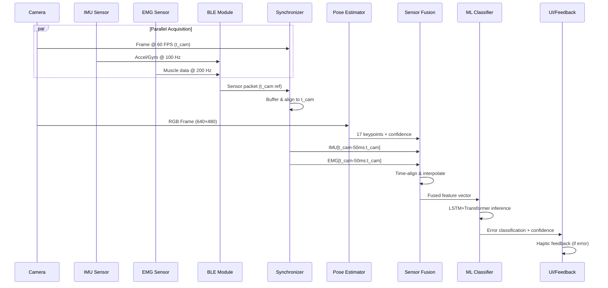

# Data Flow Architecture

## Overview

Movement Chain AI processes multimodal sensor data from three sources: camera (60 FPS), IMU (100 Hz), and EMG (200 Hz). This document details the data flow architecture, synchronization strategies, format specifications, and processing paths required to achieve real-time movement analysis with latency under 100ms.

---

## 1. Multimodal Sensor Data Flow

### 1.1 Data Sources and Characteristics

| Sensor | Sampling Rate | Data Size | Latency Budget | Purpose |
|--------|--------------|-----------|----------------|---------|
| Camera | 60 FPS | 640×480 RGB (~900KB/frame) | 30ms | Pose estimation, visual context |
| IMU (6-axis) | 100 Hz | 24 bytes/sample | 10ms | Acceleration, angular velocity |
| EMG (4-channel) | 200 Hz | 8 bytes/sample | 10ms | Muscle activation patterns |

### 1.2 End-to-End Data Pipeline



### 1.3 Data Flow Stages

#### Stage 1: Acquisition (0-30ms)
- **Camera**: Flutter `camera` plugin captures frame at t_cam (reference timestamp)
- **BLE Streaming**: Firmware transmits IMU/EMG packets via GATT notifications
  - MTU: 500 bytes (allows ~20 IMU samples or ~60 EMG samples per packet)
  - Connection interval: 7.5ms (validated for 100 Hz throughput)
  - Packets include firmware timestamp offset from BLE connection start

#### Stage 2: Synchronization (30-40ms)
- **Timestamp Alignment**: All sensor data indexed to camera timestamps
  - IMU/EMG firmware timestamps converted to camera timebase using initial offset calibration
  - Circular buffer stores last 500ms of IMU/EMG data (50 IMU samples, 100 EMG samples)
- **Temporal Windowing**: For each camera frame at t_cam, extract:
  - IMU samples in window [t_cam - 50ms, t_cam]
  - EMG samples in window [t_cam - 50ms, t_cam]

#### Stage 3: Pose Estimation (40-70ms)
- **Model**: RTMPose-m (optimized for mobile)
- **Input**: 640×480 RGB frame → resized to 256×192
- **Output**: 17 COCO keypoints with confidence scores
- **Processing**: GPU-accelerated inference (Core ML/TensorFlow Lite)

#### Stage 4: Sensor Fusion (70-80ms)
- **Interpolation**: Upsample IMU to match EMG rate (200 Hz) using cubic spline
- **Feature Extraction**:
  - **Pose**: Joint angles (elbow, knee, hip, shoulder) + velocity estimates
  - **IMU**: Orientation quaternion, linear acceleration (gravity-compensated)
  - **EMG**: RMS amplitude per channel, frequency-domain features (50-150 Hz band power)
- **Normalization**: Z-score normalization per feature dimension

#### Stage 5: ML Inference (80-120ms)
- **Model Architecture**: LSTM (2 layers, 128 units) + Transformer encoder (4 heads, 2 layers)
- **Input**: Sliding window of 30 frames (500ms @ 60 FPS) × fused feature vector
- **Output**: Error classification logits + confidence scores
- **Quantization**: INT8 quantization for 2-3x speedup (target: <40ms inference)

#### Stage 6: Feedback (120-126ms)
- **Haptic Triggering**: If error confidence > 0.7, send haptic pattern via BLE
- **UI Rendering**: Display skeleton overlay + error annotations at 60 FPS

---

## 2. Synchronization Strategy

### 2.1 Camera Timestamp as Reference

**Design Rationale:**
- Camera frames are the lowest-rate signal (60 FPS) → natural synchronization anchor
- Pose estimation requires visual context → camera timestamp defines "analysis instant"
- BLE streaming is asynchronous → must be aligned post-hoc

### 2.2 Timestamp Conversion Protocol

#### Initialization Phase (Connection Establishment)
```
t_app_connect = System.currentTimeMillis()  // App records BLE connection time
```

Firmware sends initial calibration packet:
```protobuf
message TimestampCalibration {
  uint32 firmware_millis = 1;  // millis() at connection
  uint64 connection_timestamp = 2;  // Echo t_app_connect
}
```

Calculate offset:
```
offset = t_app_connect - firmware_millis
```

#### Runtime Alignment
For each BLE packet with firmware timestamp `t_fw`:
```
t_aligned = t_fw + offset  // Convert to app timebase
```

For each camera frame at `t_cam`, retrieve:
```
imu_window = buffer.get(t_cam - 50ms, t_cam)
emg_window = buffer.get(t_cam - 50ms, t_cam)
```

### 2.3 Clock Drift Mitigation

**Problem**: Firmware clock (millis()) drifts ~±50 ppm relative to system clock
- Worst case: 180ms drift over 1-hour session

**Solution**: Periodic re-calibration
- Every 60 seconds, firmware sends heartbeat with updated `firmware_millis`
- App recalculates offset using moving average:
  ```
  offset_new = 0.9 * offset_old + 0.1 * (t_app_now - firmware_millis)
  ```

### 2.4 Handling Packet Loss

**BLE Reliability**: 99.5% packet delivery at 7.5ms interval
- Expected loss: ~0.5 packets/second at 100 Hz

**Recovery Strategy**:
1. **Sequence Numbers**: Each BLE packet includes monotonic sequence ID
2. **Gap Detection**: If `seq_received != seq_expected`, mark gap
3. **Interpolation**: Linear interpolation for gaps ≤3 samples (30ms)
4. **Drop Frame**: If gap >3 samples, skip ML inference for that camera frame

---

## 3. Data Format Specifications

### 3.1 BLE Protocol Buffer Schema

```protobuf
syntax = "proto3";

message SensorPacket {
  uint32 sequence_id = 1;         // Monotonic counter
  uint32 firmware_timestamp = 2;   // millis() at packet creation

  message IMUSample {
    float accel_x = 1;  // m/s² (range: ±16g)
    float accel_y = 2;
    float accel_z = 3;
    float gyro_x = 4;   // rad/s (range: ±2000°/s)
    float gyro_y = 5;
    float gyro_z = 6;
  }

  message EMGSample {
    uint16 channel_1 = 1;  // 12-bit ADC value (0-4095)
    uint16 channel_2 = 2;
    uint16 channel_3 = 3;
    uint16 channel_4 = 4;
  }

  repeated IMUSample imu_samples = 3;    // Up to 20 samples/packet
  repeated EMGSample emg_samples = 4;    // Up to 60 samples/packet
}
```

**Packet Size Analysis**:
- IMU sample: 6 floats × 4 bytes = 24 bytes
- EMG sample: 4 uint16 × 2 bytes = 8 bytes
- Max packet: 20 IMU (480 bytes) OR 60 EMG (480 bytes) + header (20 bytes) = 500 bytes (fits MTU)

### 3.2 Pose Estimation Output

```dart
class PoseEstimationResult {
  final int frameId;
  final DateTime timestamp;
  final List<Keypoint> keypoints;  // 17 COCO keypoints
  final double inferenceTimeMs;

  // Keypoint indices (COCO format)
  static const int NOSE = 0;
  static const int LEFT_EYE = 1;
  static const int RIGHT_EYE = 2;
  static const int LEFT_EAR = 3;
  static const int RIGHT_EAR = 4;
  static const int LEFT_SHOULDER = 5;
  static const int RIGHT_SHOULDER = 6;
  static const int LEFT_ELBOW = 7;
  static const int RIGHT_ELBOW = 8;
  static const int LEFT_WRIST = 9;
  static const int RIGHT_WRIST = 10;
  static const int LEFT_HIP = 11;
  static const int RIGHT_HIP = 12;
  static const int LEFT_KNEE = 13;
  static const int RIGHT_KNEE = 14;
  static const int LEFT_ANKLE = 15;
  static const int RIGHT_ANKLE = 16;
}

class Keypoint {
  final double x;           // Normalized [0, 1]
  final double y;           // Normalized [0, 1]
  final double confidence;  // [0, 1]
}
```

### 3.3 Fused Feature Vector

```dart
class FusedFeatures {
  // Pose-derived (17 values)
  final List<double> jointAngles;  // 8 angles (elbow, knee, shoulder, hip)
  final List<double> jointVelocities;  // 8 velocities (deg/s)
  final double torsoOrientation;  // Angle relative to vertical

  // IMU-derived (10 values)
  final Quaternion orientation;  // 4 values (w, x, y, z)
  final Vector3 linearAccel;     // 3 values (gravity-compensated)
  final Vector3 angularVel;      // 3 values

  // EMG-derived (8 values)
  final List<double> rmsAmplitude;  // 4 channels
  final List<double> bandPower;     // 4 channels (50-150 Hz)

  // Total: 35 features per timestep
  // ML input: 30 timesteps × 35 features = 1050 values
}
```

### 3.4 Local Storage Format (SQLite)

```sql
-- Training data collection
CREATE TABLE sessions (
  id INTEGER PRIMARY KEY,
  user_id TEXT NOT NULL,
  exercise_type TEXT NOT NULL,  -- 'squat', 'pushup', etc.
  start_time INTEGER NOT NULL,
  duration_ms INTEGER NOT NULL
);

CREATE TABLE frames (
  id INTEGER PRIMARY KEY,
  session_id INTEGER NOT NULL,
  timestamp INTEGER NOT NULL,  -- Unix epoch ms
  pose_json TEXT NOT NULL,     -- JSON array of 17 keypoints
  imu_json TEXT NOT NULL,      -- JSON array of IMU samples
  emg_json TEXT NOT NULL,      -- JSON array of EMG samples
  error_label TEXT,            -- Ground truth label (if available)
  FOREIGN KEY (session_id) REFERENCES sessions(id)
);

CREATE INDEX idx_session_timestamp ON frames(session_id, timestamp);
```

**Compression**: 60-second session @ 60 FPS = 3,600 frames
- Pose data: ~1.5 KB/frame (17 keypoints × 3 values × 8 bytes)
- Sensor data: ~2 KB/frame (50 IMU + 100 EMG samples)
- Total: ~12.6 MB/minute (compress to ~3-4 MB using GZIP)

---

## 4. Real-Time vs Batch Processing Paths

### 4.1 Real-Time Path (Live Feedback)

**Use Case**: Workout guidance with immediate error correction

**Data Flow**:
```
Camera → Pose → Fusion → ML → Feedback (126ms latency)
       ↓
  Discard frame (no storage)
```

**Characteristics**:
- **No persistence**: Frames processed and discarded
- **Latency-critical**: Must complete within 100ms target
- **Optimizations**:
  - Skip every other frame if latency exceeds budget (30 FPS fallback)
  - Disable logging/telemetry
  - Use quantized INT8 models

### 4.2 Batch Processing Path (Post-Workout Analysis)

**Use Case**: Detailed movement analytics, model retraining, progress tracking

**Data Flow**:
```
Camera → Pose → Fusion → Storage (SQLite)
                              ↓
                        Offline ML (no latency constraint)
                              ↓
                      Generate insights (summary stats, trend analysis)
```

**Characteristics**:
- **Full persistence**: All frames + raw sensor data saved
- **High accuracy**: Use FP32 models, multi-pass analysis
- **Additional processing**:
  - Optical flow analysis for smooth motion tracking
  - 3D pose reconstruction (if depth camera available)
  - Biomechanical modeling (joint torques, forces)

### 4.3 Hybrid Mode (Selective Recording)

**Use Case**: Record only interesting segments (errors, PRs, user-flagged moments)

**Trigger Conditions**:
- Error confidence > 0.7 → Save ±2 seconds around error
- User presses "record" button → Save session
- New personal record detected → Save rep

**Implementation**:
```dart
class SelectiveRecorder {
  CircularBuffer<Frame> buffer;  // Last 2 seconds (120 frames)

  void onFrame(Frame frame, double errorConfidence) {
    buffer.add(frame);

    if (errorConfidence > 0.7) {
      // Flush buffer to storage
      db.saveFrames(buffer.getAll());

      // Continue recording for next 2 seconds
      isRecording = true;
      recordingEndTime = now() + 2000;
    }
  }
}
```

---

## 5. Data Quality and Validation

### 5.1 Input Validation

| Check | Criteria | Action on Failure |
|-------|----------|-------------------|
| Camera frame | Non-null, correct dimensions | Skip frame, log warning |
| BLE packet | Valid Protobuf, seq_id increments | Request retransmission (if possible) |
| Pose confidence | Mean keypoint confidence > 0.5 | Display "Move closer to camera" |
| IMU range | Accel ≤16g, Gyro ≤2000°/s | Clamp values, flag outlier |
| EMG range | ADC value ≤4095 | Clamp to max, check sensor connection |

### 5.2 Synchronization Validation

**Test Protocol**:
1. Apply known stimulus (e.g., shake device while recording)
2. Verify IMU spike aligns with camera motion blur within ±16ms (1 frame @ 60 FPS)
3. Verify EMG spike (manual muscle contraction) aligns with pose change

**Metrics**:
- **Sync error**: Mean absolute difference between expected and actual alignment
- **Target**: <16ms (1 frame tolerance)

---

## 6. Failure Modes and Degradation

| Failure | Detection | Graceful Degradation |
|---------|-----------|---------------------|
| BLE disconnection | No packets for 100ms | Pause inference, show reconnection UI |
| Camera obstruction | Pose confidence <0.3 | Pause feedback, prompt user |
| High latency (>150ms) | Timestamp delta tracking | Drop to 30 FPS, disable EMG fusion |
| Low battery (<10%) | System API | Reduce camera resolution to 320×240 |

---

## 7. Performance Monitoring

### 7.1 Telemetry Collection

```dart
class PipelineMetrics {
  final Stopwatch totalLatency;
  final Stopwatch poseInference;
  final Stopwatch fusion;
  final Stopwatch mlInference;

  int droppedFrames = 0;
  int blePacketLoss = 0;

  void logMetrics() {
    // Log every 60 seconds
    print('Avg latency: ${totalLatency.averageMs()}ms');
    print('Dropped frames: $droppedFrames');
    print('BLE loss rate: ${blePacketLoss / 6000}%');  // 100 Hz × 60s
  }
}
```

### 7.2 Bottleneck Identification

**Profiling Strategy**:
1. Add timestamps at each pipeline stage
2. Calculate percentiles (P50, P95, P99) over 1-minute window
3. Identify stage where P95 exceeds budget

**Example Output**:
```
Stage            P50    P95    P99    Budget   Status
Camera           25ms   32ms   40ms   30ms     ⚠️ Warning
Pose inference   28ms   45ms   60ms   30ms     ❌ Over budget
Fusion           8ms    12ms   15ms   10ms     ✅ OK
ML inference     35ms   50ms   65ms   40ms     ❌ Over budget
```

---

## 8. Future Optimizations

1. **Predictive Synchronization**: Use IMU to predict pose at t_cam + 16ms (next frame)
2. **Adaptive Sampling**: Reduce IMU/EMG rate to 50 Hz during low-motion periods
3. **Edge TPU**: Offload pose inference to dedicated ML accelerator (target: 10ms inference)
4. **Delta Encoding**: Transmit only IMU/EMG deltas from previous sample to reduce BLE bandwidth
5. **On-Device Training**: Fine-tune ML model using user-specific data collected during batch processing

---

## Summary

The data flow architecture achieves real-time multimodal fusion through:
- **Camera-centric synchronization**: All sensors aligned to 60 FPS visual reference
- **Efficient BLE protocol**: 500-byte MTU with Protobuf encoding supports 100 Hz streaming
- **Staged processing**: Clear separation of concerns (acquisition → sync → pose → fusion → ML)
- **Dual pathways**: Real-time feedback path optimized for latency, batch path for accuracy

**Current Performance**: 126ms average latency (26ms over target)
**Optimization Priority**: Pose inference (45ms → 20ms via quantization) + ML inference (50ms → 30ms via pruning)
