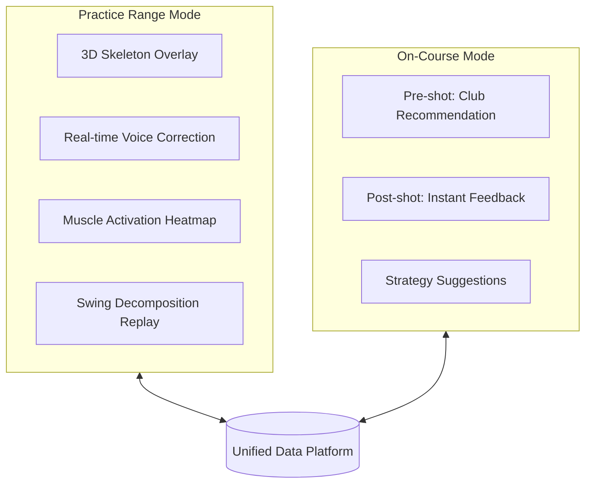
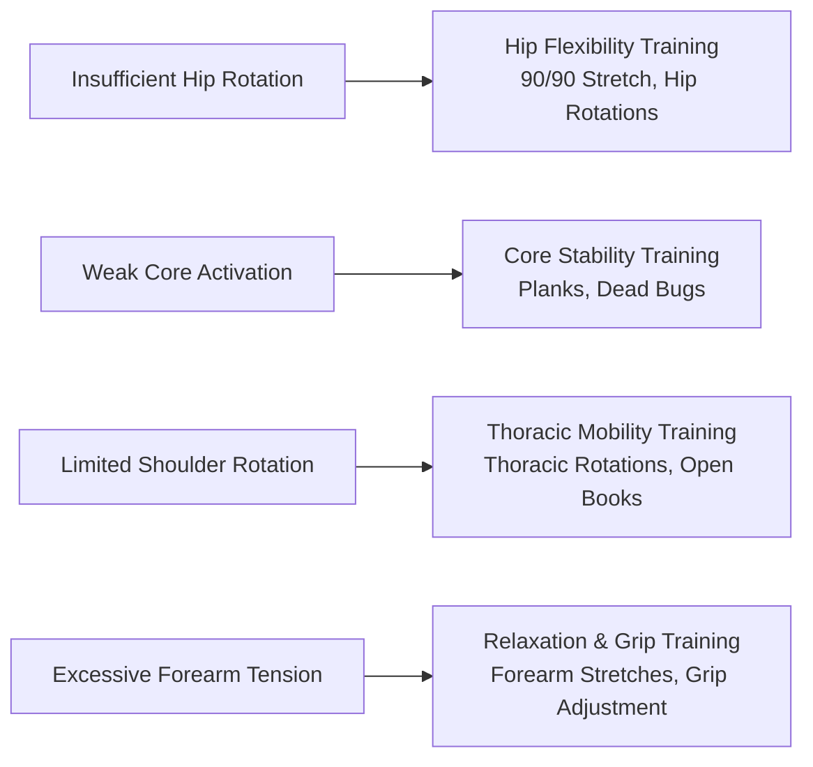
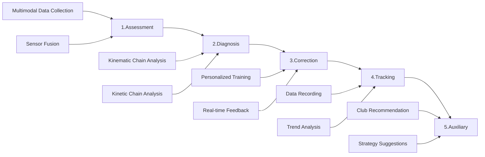

# Product Strategy

> **Core Proposition**: Every product decision must address a real market pain point

---

## Decision Navigation

| # | Decision | Pain Point Addressed |
|---|----------|---------------------|
| 1 | [Dual-Mode Architecture](#decision-1-dual-mode-architecture) | Practice range and course data silos - no product bridges them |
| 2 | [Tri-Modal Sensor Fusion](#decision-2-tri-modal-sensor-fusion) | Knowing "what's wrong" but not "why it's wrong" |
| 3 | [Multimodal Feedback System](#decision-3-multimodal-feedback-system) | Can't check phone during play - need eyes-free feedback |
| 4 | [AI Coach + AI Caddie](#decision-4-ai-coach--ai-caddie) | 50 data points, no clue what to do |
| 5 | [Off-Course Training Philosophy](#decision-5-off-course-training-philosophy) | "Insufficient shoulder turn" but no idea how to improve physical capacity |
| 6 | [Leverage-First Strategy](#decision-6-leverage-first-strategy) | Fast MVP validation - 3-4 month launch |

---

## Decision 1: Dual-Mode Architecture

!!! warning "Market Gap"
    No product covers both practice range and course, let alone bridges the data.

| Competitor | Practice Range | On-Course | Data Bridge |
|------------|---------------|-----------|-------------|
| HackMotion | ✅ | ❌ | - |
| Sportsbox AI | ✅ | ❌ | - |
| Arccos | ❌ | ✅ | - |
| **Us** | ✅ | ✅ | ✅ |

!!! quote "User Quote"
    "There's next to nothing that connects what happens in your personal hitting bay with what happens on the golf course." — MyGolfSpy

### Dual-Mode Comparison

| Component | Practice Range Mode | On-Course Mode |
|-----------|---------------------|----------------|
| Vision System | Phone Camera + RTMPose | Optional |
| IMU System | Full Data Collection | Streamlined Collection |
| EMG System | Muscle Timing Analysis | Fatigue Monitoring |
| Feedback Latency | <500ms | <200ms |
| Battery Optimization | Standard Mode | Low-Power Mode |

---

## Decision 2: Tri-Modal Sensor Fusion

!!! tip "Key Insight"
    EMG is the **only unexplored** data dimension in the market - 0 competitors provide muscle activation data.

| Competitor | IMU | EMG | Vision | Data Dimensions |
|------------|-----|-----|--------|----------------|
| HackMotion | ✅ | ❌ | ❌ | Wrist angles |
| SwingMotion | ✅ | ❌ | ❌ | Swing speed |
| Sportsbox AI | ❌ | ❌ | ✅ | Full-body posture |
| K-Motion | ✅ | ❌ | ❌ | Kinematic sequence |
| **Us** | ✅ | ✅ | ✅ | **Full-spectrum** |

### Tri-Modal Value

| Metric | IMU (How You Move) | EMG (How You Apply Force) | Vision (Movement Form) |
|--------|-------------------|---------------------------|------------------------|
| Speed/Angles | ⭐⭐⭐ | ⭐ | ⭐⭐ |
| Force Timing | ⭐ | ⭐⭐⭐ | ❌ |
| Muscle Activation | ❌ | ⭐⭐⭐ | ❌ |
| Full-Body Posture | ⭐ | ⭐ | ⭐⭐⭐ |
| Force Sequencing | ⭐ | ⭐⭐⭐ | ⭐ |

### EMG Kinematic Chain Analysis

!!! info "EMG Monitored Muscle Groups"
    - **Lower Body**: Glutes, Quadriceps (initiate rotation, weight transfer)
    - **Core**: Obliques, Erector Spinae (force transmission hub)
    - **Upper Body**: Lats, Deltoids (torso rotation and swing)
    - **Forearms**: Wrist Flexors, Extensors (club control)

| Scenario | Without EMG | With EMG (Full Kinematic Chain) |
|----------|-------------|--------------------------------|
| Excessive Force | Only knows "swinging too fast" | Diagnoses "weak core activation causing arm compensation" |
| Wrong Sequencing | Only knows "uncoordinated" | Precisely shows "hip → core → shoulder → arm" timing |
| Fatigue Accumulation | Cannot detect | Identifies "core fatigue causing full-body compensation" |
| Injury Risk | Only known after the fact | Predicts "insufficient hip mobility causing lumbar overload" |

---

## Decision 3: Multimodal Feedback System

!!! quote "User Quote"
    "I don't want to look at my phone between shots. Just tell me what I did wrong." — Reddit r/golf

| Competitor | Visual | Audio | Haptic | Real-time |
|------------|--------|-------|--------|-----------|
| HackMotion | ✅ | ❌ | ✅ | ⭐⭐ |
| Sportsbox AI | ✅ | ❌ | ❌ | ❌ |
| deWiz | ✅ | ✅ | ✅ | ⭐⭐⭐ |
| **Us** | ✅ | ✅ | ✅ | ⭐⭐⭐ |

### Three Feedback Modes

We designed three feedback modes for different scenarios:

| Mode | Latency Requirement | Scenario | Feedback Method |
|------|-------------------|----------|----------------|
| **Setup Check** | <300ms | Stance preparation | Visual skeleton + voice prompts |
| **Slow Motion** | <500ms | Slow-motion practice | Real-time voice correction |
| **Full Speed** | <500ms (post-swing) | Normal swing | Post-swing voice summary |

!!! tip "Innovation: Slow Motion Mode"
    Users perform swing actions at slow speed, allowing the system to provide real-time voice feedback during the motion. This solves the "normal swing too fast for real-time correction" challenge.

> See detailed specs: Real-time Feedback Specification

### Feedback Design Principles

| Principle | Description |
|-----------|-------------|
| **Scenario Determines Modality** | Practice range → visual-first, on-course → audio-first, silent → haptic-first |
| **Descending Information Density** | Visual (high) → Audio (medium) → Haptic (low) |
| **Minimize Cognitive Load** | ❌ "Swing speed 102mph..." → ✅ "Too fast, slow down 20%" |

| Feedback Type | Trigger | Example |
|---------------|---------|---------|
| Immediate Correction | Problem detected | "Wrists too tight" |
| Encouragement | Improvement detected | "Good, keep it up" |
| Strategy | Pre-shot | "This distance suggests 7-iron" |
| Summary | End of round | "Today's forearm timing markedly improved" |

---

## Decision 4: AI Coach + AI Caddie {#decision-4-ai-coach--ai-caddie}

!!! warning "Market Gap"
    Users have 50 data points but don't know what to do.

| Feature | Existing Products | User Expectations | Gap |
|---------|------------------|-------------------|-----|
| Data Display | ✅ All have it | Understand data meaning | 🔴 |
| Problem Diagnosis | Partial | Know how to fix | 🔴 |
| Personalized Advice | Rare | Tailored to my situation | 🔴 |
| Course Strategy | Arccos has it | Combined with swing data | 🔴 |

### AI Dual-Role Design

| Dimension | AI Coach (Practice Range) | AI Caddie (On-Course) |
|-----------|--------------------------|----------------------|
| **Responsibility** | Motion diagnosis, training plans, real-time correction | Club selection, course strategy, shot review |
| **Interaction Style** | Detailed explanations, encouragement-focused | Concise and direct, confidence-building |
| **Data Usage** | Full swing data, muscle activation analysis | Historical shot stats, environmental factors |
| **Sample Output** | "On your downswing initiation, your right shoulder opens early - try keeping your back to target longer" | "135 yards with headwind, based on your 7-iron average, suggest 6-iron at 80% power" |

---

## Decision 5: Off-Course Training Philosophy

!!! tip "Key Insight"
    Practicing swings at the range isn't enough - real progress requires off-course training to improve physical conditioning.

| Current Product Approach | Problem |
|-------------------------|---------|
| Analyze swing only | Cannot address physical limitations |
| Suggest "insufficient shoulder turn" | Users don't know how to improve |
| Output data reports | Lack actionable training plans |

### Off-Course Training Recommendations

| Dimension | Competitor Approach | Our Solution |
|-----------|-------------------|--------------|
| Analysis Scope | Swing only | Swing + physical condition assessment |
| Output Content | Data report | Data + actionable training plan |
| Improvement Path | "Practice more" | Targeted off-course training |

---

## Decision 6: Leverage-First Strategy

!!! info "MVP Technical Philosophy"
    **Phase 1**: Leverage what we can → Fast product value validation
    **Phase 2+**: Polish when scaling → Upgrade components based on needs

### MVP Component Selection

| Component | MVP Solution | Availability | Future Upgrade |
|-----------|-------------|--------------|----------------|
| Pose Estimation | MediaPipe Pose | ✅ Out-of-box | RTMPose → ViTPose++ |
| EMG Processing | NeuroKit2 | ✅ Out-of-box | Custom filtering |
| Analysis Engine | Rule Engine IF-THEN | 🛠️ Simple code | ML Classifier |
| Visualization | OpenCV + MediaPipe | ✅ Out-of-box | Unity 3D |
| Voice Feedback | System TTS | ✅ Out-of-box | OpenAI TTS |
| LLM Coach | OpenAI/Claude API | ✅ API calls | Fine-tuned model |

### Leverage vs Build Principles

| Capability Type | Strategy | Example |
|----------------|----------|---------|
| **Generic Capabilities** | Leverage mature solutions | Pose estimation, EMG processing |
| **Differentiating Capabilities** | Build ourselves | Fusion logic, rule engine |

!!! tip "Strategic Significance"
    "Leverage-first" strategy allows us to **launch MVP in 3-4 months**, rapidly validating the market.

---

## System Architecture

### Module Responsibilities

| Module | Function | Input | Output |
|--------|----------|-------|--------|
| **Assessment** | Multimodal data collection + fusion | IMU/EMG/Vision | Unified time-series data |
| **Diagnosis** | Kinematic + kinetic chain analysis | Fused data | Problem list + priorities |
| **Correction** | Personalized training + real-time feedback | Diagnosis results | Voice/visual/haptic feedback |
| **Tracking** | Data recording + trend analysis | Historical data | Progress curves + insights |
| **Auxiliary** | Club recommendation + strategy suggestions | Environment + history | AI caddie output |

---

## Differentiation Summary

| Dimension | Competitor Status | Our Solution | User Value |
|-----------|------------------|--------------|------------|
| Data Dimensions | Single (IMU or Vision) | Tri-modal fusion | Comprehensive swing understanding |
| Use Scenarios | Training OR On-course | Training AND On-course | One device, full coverage |
| Feedback Methods | Visual-first | Visual + audio + haptic | Scenario-optimal feedback |
| EMG Data | 0/15+ competitors | ✅ Yes | Understand muscle force patterns |
| Price | $345-3000 | $99-149 | High value-for-money |

### Competitive Moats

!!! success "Triple Moats"
    **Technical Moat**: EMG sensor integration (1+ year R&D), tri-modal fusion algorithms, edge AI deployment
    **Data Moat**: User training data accumulation, swing-performance correlation, personalized models
    **Market Moat**: First-mover advantage, coach network, user community

---

## Related Documents

### Technical Specifications

- 8-Phase Swing Decomposition - Technical implementation of swing phase detection
- Real-time Feedback Specification - Three feedback modes latency & implementation
- [System Design](../design/architecture/system-design.md) - MVP technical architecture

### Market & Business

- User Pain Points Analysis - User research insights
- Market Size & Roadmap - Pricing, roadmap, risk assessment

---

**Last Updated**: December 2025
