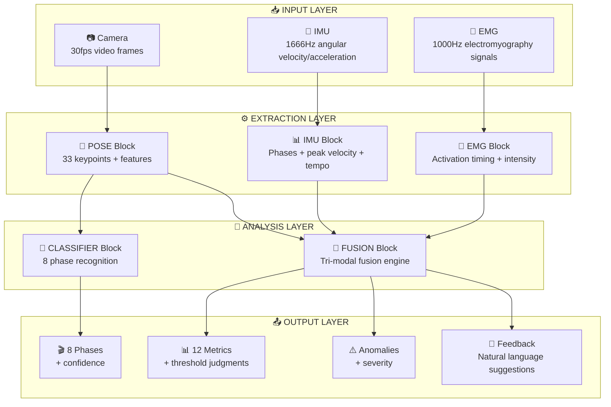
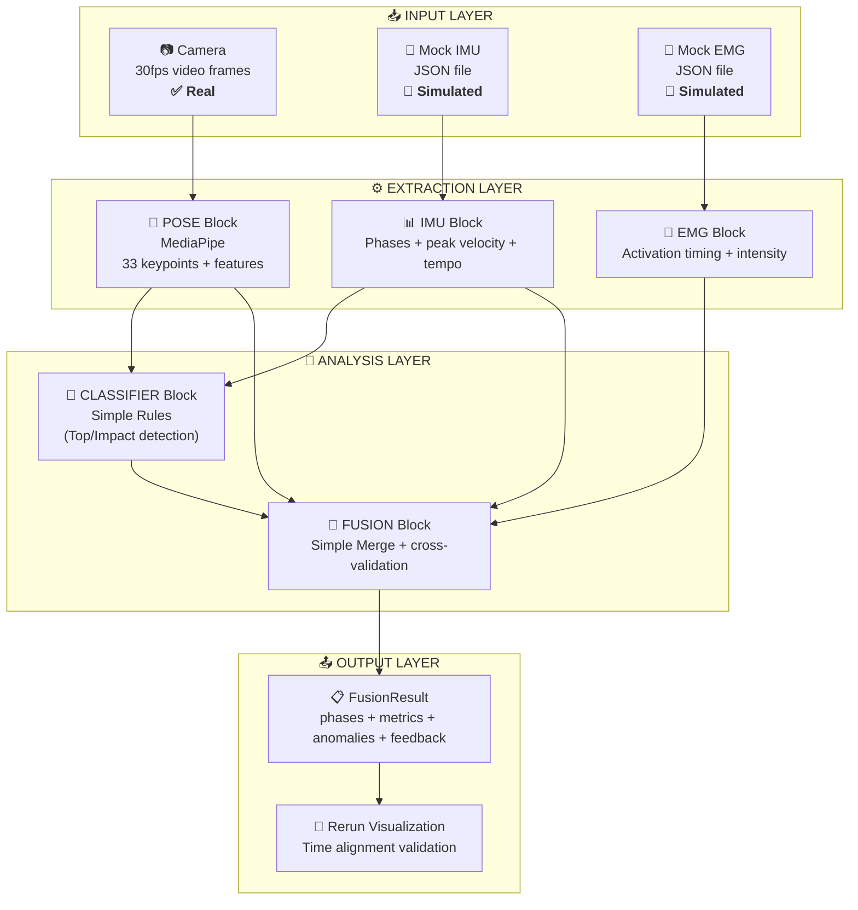

# Modular Architecture Design

> **Document Purpose**: Define Movement Chain AI's LEGO block-style modular architecture
>
> **Core Philosophy**: Each component is independently replaceable, MVP validates quickly, progressive upgrades
>
> **Reading time**: 25 minutes

---

## 1. LEGO Philosophy

### 1.1 Competitive Moat: What/When/Why Value Hierarchy

!!! abstract "Core Insight: Why Tri-modal Fusion is the Moat"

    ```text
    ┌─────────────────────────────────────────────────────────────────────────────┐
    │                    TRI-MODAL SYSTEM VALUE HIERARCHY                          │
    ├─────────────────────────────────────────────────────────────────────────────┤
    │                                                                             │
    │   Competitors (Vision-only):      "Your X-Factor is 22°"                    │
    │                                   → User knows WHAT is wrong                │
    │                                                                             │
    │   Competitors (Vision+IMU):       "Your X-Factor is 22°, timing is off too" │
    │                                   → User knows WHAT and WHEN                │
    │                                                                             │
    │   Your System (Vision+IMU+EMG):                                             │
    │                                   "Your X-Factor is 22° because your core   │
    │                                    activated 40ms after your arms. Focus on │
    │                                    tightening your abs before downswing."   │
    │                                   → User knows WHAT, WHEN, and WHY          │
    │                                                                             │
    │   ═══════════════════════════════════════════════════════════════════════  │
    │                                                                             │
    │   Vision = WHAT (Spatial Position — Where is the body)                     │
    │   IMU    = WHEN (Precise Timing — ±0.6ms accuracy)                         │
    │   EMG    = WHY  (Muscle Activation — Why does it move this way)            │
    │                                                                             │
    │   ⚡ KEY: Only tri-modal fusion can detect "False Coil"                     │
    │      — X-Factor looks normal (45°), but EMG shows core never activated     │
    │      — This is a problem competitors can NEVER detect                      │
    │                                                                             │
    └─────────────────────────────────────────────────────────────────────────────┘
    ```

### 1.2 Scientific Validation: Why This Approach is Correct

Our architecture choices are validated by latest research:

!!! success "CaddieSet Study (CVPR 2025) — Key Findings"

    **Conclusion**: For golf swing analysis, feature engineering + simple models **outperform** end-to-end deep learning

    | Model | Ball Speed MSE | Method |
    |------|-------------|------|
    | Random Forest | **8.80** | Pose → Feature Engineering → Traditional ML |
    | XGBoost | 10.15 | Pose → Feature Engineering → Traditional ML |
    | Vision Transformer | 28.41 | Raw Images → Deep Learning |
    | MobileNet V3 | 32.32 | Raw Images → Deep Learning |

    **Implications for Our Architecture**:

    - ✅ MediaPipe → Feature Extraction (X-Factor, Tempo) → Classifier = **Scientifically validated correct path**
    - ✅ No need for complex Video Transformers
    - ✅ Golf is a **biomechanically constrained** sport — domain features outperform pixels
    - ✅ Interpretable features → Interpretable feedback (users can understand why)

### 1.3 LEGO Core Principles

1. **Modularity** — Each module is an independent "LEGO block", can be replaced individually, interfaces remain stable
2. **Fast Validation** — MVP uses simplest blocks to build quickly, validate complete pipeline and user value
3. **Delayed Decisions** — Don't design "end state" upfront, decide upgrade direction based on real user data
4. **Data-Driven** — Complexity comes from training data, not code (AI can write code, but data needs accumulation)
5. **Fusion First** — Single-sensor accuracy less important than cross-sensor validation
6. **Hexagonal Architecture** — Ports & Adapters pattern, hardware dependencies isolated through interfaces

### 1.4 Technology Uncertainty Management

We face multiple technology uncertainties:

| Uncertainty | Options | MVP Strategy | Upgrade Trigger |
|---------|------|---------|-------------|
| **Classifier Choice** | Simple Rules vs SwingNet vs BiGRU | Simple Rules (IMU peaks/zero-crossings) | When full 8-phase detection needed |
| **Pose Estimation** | MediaPipe vs RTMPose vs Custom | MediaPipe (easiest integration) | Upgrade when accuracy insufficient |
| **Sensor Data** | Real vs Simulated IMU/EMG | Simulated (validate pipeline) | Replace when hardware ready |
| **Fusion Method** | Simple vs Rule-based vs ML | Simple Merge | Upgrade when sufficient fusion data |

!!! tip "Solution"
    Encapsulate these uncertainties as **replaceable LEGO blocks**, minimize replacement cost by defining clear interface contracts.

---

## 2. Architecture Overview

### 2.1 System Architecture Diagram



### 2.2 Architecture Layer Description

| Layer | Responsibility | Building Blocks | Key Output |
|-----|------|--------|---------|
| **📥 Input Layer** | Data acquisition | Camera, IMU, EMG (real or simulated) | Raw sensor streams |
| **⚙️ Extraction Layer** | Feature extraction | [POSE](#31-pose-block), [IMU](#32-imu-block), [EMG](#33-emg-block) | Structured features |
| **🧠 Analysis Layer** | Intelligent analysis | [CLASSIFIER](#41-classifier-block), [FUSION](#42-fusion-block) | Phases + Metrics + Anomalies |
| **📤 Output Layer** | Result output | 8 phases, 12 metrics, anomaly markers, natural language feedback | User-understandable suggestions |

### 2.3 Video-Only Mode Capability Boundaries

!!! warning "Important: Limitations of Video-Only Mode"

    Without hardware, system can only provide partial capabilities:

    | Capability | Video-Only | With Hardware (IMU+EMG) | Reason for Difference |
    |------|------------|-----------------|---------|
    | **Precise Impact Moment** | ❌ ±33ms | ✅ ±0.6ms | Camera frame rate limitation |
    | **Clubhead Speed** | ❌ Cannot measure | ⚠️ Indirect inference | High-speed motion blur |
    | **Muscle Activation Sequence** | ❌ **Impossible** | ✅ Direct measurement | Requires EMG |
    | **Force Chain Causality Analysis** | ❌ **Impossible** | ✅ Direct validation | Requires EMG |
    | **Fatigue Detection** | ❌ **Impossible** | ✅ Amplitude decay | Requires EMG |
    | **False Coil Detection** | ❌ **Impossible** | ✅ Vision+EMG cross-check | Requires EMG |
    | X-Factor | ✅ ±3° | ✅ ±3° | Vision sufficient |
    | Swing Tempo | ⚠️ ±2 frames | ✅ <10ms | IMU more precise |
    | Body Posture Angles | ✅ ±5° | ✅ ±5° | Vision sufficient |

    **Conclusion**: Video-Only is **entry-level experience**, full value requires hardware support.

### 2.4 Time Synchronization Strategy

The **foundation** of tri-modal fusion is precise time alignment:

```text
┌─────────────────────────────────────────────────────────────────────────────┐
│                         TIME SYNCHRONIZATION STRATEGY                        │
├─────────────────────────────────────────────────────────────────────────────┤
│                                                                             │
│   Why IMU is MASTER CLOCK:                                                  │
│   ─────────────────────────────────────                                     │
│   • IMU: 1666Hz = 0.6ms resolution (highest)                               │
│   • EMG: 1000Hz = 1.0ms resolution                                          │
│   • Vision: 30Hz = 33.3ms resolution (lowest)                               │
│                                                                             │
│   Alignment Strategy:                                                        │
│   ─────────────────────────────────────                                     │
│   • Vision 30fps → Linear interpolation to 1666Hz (fill inter-frame gaps)  │
│   • EMG 1000Hz → Cubic spline upsampling to 1666Hz                          │
│   • IMU 1666Hz → Master reference axis (no transformation)                  │
│                                                                             │
│   ⚠️ Critical Requirement:                                                  │
│   ─────────────────────────────────────                                     │
│   • Time sync error MUST < 10ms                                             │
│   • If > 10ms, cross-validation loses meaning                               │
│   • Phase detection timestamps will be unreliable                           │
│                                                                             │
│   Implementation:                                                            │
│   ─────────────────────────────────────                                     │
│   • ESP32-S3 uses unified clock source (micros())                           │
│   • BLE transmission includes send timestamp                                │
│   • Phone calculates network latency and compensates                        │
│                                                                             │
└─────────────────────────────────────────────────────────────────────────────┘
```

!!! tip "🔧 Debug Tool: Rerun Timeline Validation"

    **Problem**: How to verify three sensors are truly aligned to <10ms?

    **Rerun Solution**:
    ```text
    ┌─────────────────────────────────────────────────────────────┐
    │  Rerun Timeline View                                        │
    ├─────────────────────────────────────────────────────────────┤
    │  📷 Vision:  [Frame45] ─────────────●──────── (Top detect)  │
    │  🔄 IMU:     ─────────────────●────────── (gyro_z zero-cross)│
    │  💪 EMG:     ───────────────●──────────── (core onset)      │
    │                             ↑                               │
    │                      If three ● not on same vertical line  │
    │                      → sync problem                         │
    └─────────────────────────────────────────────────────────────┘
    ```

    Drag timeline to Impact moment, three sensor event points should align.
    Offset >10ms indicates time sync needs adjustment.

    > See [Visualization Tools Evaluation](../research/visualization-tools-evaluation.md)

#### 2.4.1 Time Synchronization Implementation

!!! warning "MVP Phase Note"

    Using **Mock data**, time sync is automatic (all data generated by same code, shares clock).
    This section applies to **real hardware integration phase**.

!!! warning "BLE Transmission Jitter"
    BLE connection interval jitter ±15-30ms, timestamps MUST be generated at ESP32 source, not affected by transmission delay.

##### Recommended: NTP Pre-sync + Impact Validation

This is industry standard method, used by most sports analysis apps. About 40-50 lines of code, no extra hardware needed.

```text
┌─────────────────────────────────────────────────────────────────────────────┐
│                    TIME SYNC IMPLEMENTATION: NTP + IMPACT VALIDATION         │
├─────────────────────────────────────────────────────────────────────────────┤
│                                                                             │
│   STEP 1: NTP Pre-sync (Before Recording)                                   │
│   ────────────────────────────                                              │
│   • Phone auto-syncs time from NTP server (iOS/Android built-in)            │
│   • ESP32 gets current time from phone via BLE and sets internal clock      │
│   • All devices share same time reference                                   │
│   • Accuracy: ~1-10ms                                                       │
│                                                                             │
│   STEP 2: Sensor-side Timestamps (During Recording)                         │
│   ─────────────────────────────                                             │
│   • IMU/EMG: ESP32 uses micros() to timestamp immediately at data capture   │
│   • Vision: Phone camera uses system clock (already NTP-synced)             │
│   • ⚠️ KEY: Timestamps generated at sensor side, BLE delay doesn't affect  │
│                                                                             │
│   STEP 3: Impact Validation (After Recording)                               │
│   ───────────────────────────                                               │
│   • IMU: Detect peak angular velocity → impact_imu (±5ms accuracy)          │
│   • Vision: Detect ball leaving moment → impact_vision                      │
│   • Calculate offset: offset = impact_imu - impact_vision                   │
│   • Correct: video.timestamps += offset                                     │
│   • If |offset| > 20ms → flag for review                                    │
│                                                                             │
└─────────────────────────────────────────────────────────────────────────────┘
```

##### Why EMG Doesn't Participate in Time Alignment

```text
Electromechanical Delay (EMD)
────────────────────────────────────────────

EMG signal ─→ Neural command ─→ Calcium release ─→ Muscle contraction ─→ Motion
            ↑                                                           ↑
            EMG detected                                                IMU/Vision detected

Time gap: 30-100ms

Conclusion: EMG is diagnostic data, not a sync reference. Use IMU to establish timeline, then analyze EMG.
```

##### Alternative Solutions Comparison

| Solution | Accuracy | Complexity | Applicability | Notes |
|------|------|--------|--------|------|
| **NTP + Impact Validation** | <10ms | Low (~50 lines code) | ✅ MVP Recommended | Zero extra hardware, phone has built-in NTP |
| Hardware TTL Trigger | <150µs | High | ❌ | Needs sync box, wired connection, not portable |
| BLE Timestamp Exchange | <1ms | Medium | ⏳ V2 | Needs firmware dev, higher accuracy |
| Chrony | <1ms | - | ❌ Uncontrollable | Mobile can't choose clock protocol |

!!! warning "Note: NTP Clock Jumps"

    NTP correction may cause clock to **jump backward** (e.g., 100ms → 95ms).

    **Solution**: Use monotonic clock for relative time:

    ```python
    # Python
    import time
    duration = time.monotonic() - start_monotonic  # Always non-negative

    # ESP32
    uint32_t duration = micros() - start_micros;  // Use delta, avoid jump impact
    ```

##### Reference Implementation (Hardware Integration Phase)

```python
class TimeAlignmentManager:
    """Time alignment manager - for hardware integration phase"""

    def find_imu_impact(self, gyro_z: np.ndarray, timestamps: np.ndarray) -> float:
        """Detect impact moment from IMU gyroscope data"""
        peak_idx = np.argmax(np.abs(gyro_z))
        return timestamps[peak_idx]

    def find_video_impact(self, frames: list, fps: float) -> float:
        """Detect impact moment from video (ball leaving or clubhead lowest point)"""
        # Simplified: Use motion detection to find max change frame
        motion_scores = [self._compute_motion(frames[i], frames[i+1])
                        for i in range(len(frames)-1)]
        impact_frame = np.argmax(motion_scores)
        return impact_frame / fps

    def validate_and_correct(self, imu_data: dict, video_data: dict) -> dict:
        """Validate and correct time alignment"""
        imu_impact = self.find_imu_impact(imu_data['gyro_z'], imu_data['timestamps'])
        video_impact = self.find_video_impact(video_data['frames'], video_data['fps'])

        offset = imu_impact - video_impact

        result = {
            'offset_ms': offset * 1000,
            'aligned': abs(offset) <= 0.020,  # <20ms considered aligned
            'action': 'none' if abs(offset) <= 0.010 else 'corrected'
        }

        if abs(offset) > 0.010:  # >10ms needs correction
            video_data['timestamps'] = [t + offset for t in video_data['timestamps']]

        return result
```

> **Research Sources**:
>
> - [BLE Multi-channel Biosignal Sync (PMC10144216)](https://pmc.ncbi.nlm.nih.gov/articles/PMC10144216/) - Achieves <1ms accuracy
> - [Twist-n-Sync Gyroscope Sync (PMC7795013)](https://pmc.ncbi.nlm.nih.gov/articles/PMC7795013/) - 16µs accuracy, Google Research
> - [Golf Swing IMU Segmentation (PMC7472298)](https://pmc.ncbi.nlm.nih.gov/articles/PMC7472298/) - Impact detection ±5-16ms accuracy

#### 2.4.2 Sensor Hub Architecture (2025-12 Recommended)

!!! success "Same Body Part Shares Clock — Microsecond-level Sync"

    **Core Principle**: IMU + EMG on the same body part use the same ESP32 as Sensor Hub, share microsecond-level clock, eliminate BLE jitter impact.

    ```text
    ┌───────────────────────┐     ┌───────────────────────┐
    │     ESP32 #1          │     │      ESP32 #2         │
    │  (Arm Sensor Hub)     │     │   (Core Sensor Hub)   │
    │ ┌─────────┬─────────┐ │     │ ┌─────────┬─────────┐ │
    │ │Wrist IMU│Forearm  │ │     │ │Core EMG │ Pelvis  │ │
    │ │ (I2C)   │EMG (ADC)│ │     │ │ (ADC)   │ IMU(I2C)│ │
    │ └────┬────┴────┬────┘ │     │ └────┬────┴────┬────┘ │
    │      └─────────┘      │     │      └─────────┘      │
    │   esp_timer_get_time()│     │   esp_timer_get_time()│
    │   (µs-level sync ✅)  │     │   (µs-level sync ✅)  │
    └───────────┬───────────┘     └───────────┬───────────┘
                │ BLE                         │ BLE
                │ (±15-30ms jitter)           │ (±15-30ms jitter)
                └────────┬────────────────────┘
                         ▼
                    [ Phone App ]
                    Impact alignment eliminates jitter
    ```

    **Advantages**:
    - ✅ Same-part sensors share ESP32 clock → µs-level sync
    - ✅ Cross-part use Impact event alignment → eliminate BLE jitter (±15-30ms)
    - ✅ Reduce BLE device count → more stable connection

    > See [Key Decisions 2025-12 §7.8](./architecture-decisions-2025-12-23.md#78-video-sensor-sync-solution)

### 2.5 Fusion Engine: Three Mechanisms

!!! info "Fusion is not simple addition, but synergy of three mechanisms"

#### Mechanism 1: Complementarity

Each sensor measures what others **cannot measure**:

```text
┌──────────────┐   ┌──────────────┐   ┌──────────────┐
│    Vision    │   │     IMU      │   │     EMG      │
├──────────────┤   ├──────────────┤   ├──────────────┤
│ X-Factor    ✅│   │ X-Factor    ❌│   │ X-Factor    ❌│
│ Body Pose   ✅│   │ Body Pose   ❌│   │ Body Pose   ❌│
│ Spatial Pos ✅│   │ Spatial Pos ❌│   │ Spatial Pos ❌│
│             │   │              │   │              │
│ Impact Time ❌│   │ Impact Time ✅│   │ Impact Time ❌│
│ Peak Velocity❌│   │ Peak Velocity✅│   │ Peak Velocity❌│
│ 3D Rotation  ❌│   │ 3D Rotation ✅│   │ 3D Rotation ❌│
│             │   │              │   │              │
│ Muscle Activ❌│   │ Muscle Activ❌│   │ Muscle Activ✅│
│ Fatigue Detect❌│  │ Fatigue Detect❌│  │ Fatigue Detect✅│
│ Force Chain ❌│   │ Force Chain ❌│   │ Force Chain ✅│
└──────────────┘   └──────────────┘   └──────────────┘

→ Fusion = Complete picture, not partial views
```

#### Mechanism 2: Double/Triple Validation (Cross-Validation)

Same event measured by multiple sensors → capture errors:

```text
Example: Detecting "Top of Backswing"

  Vision says: Frame 45 (±2 frames = ±66ms)
  IMU says:    T = 1.523s (gyro_z zero-crossing, ±0.6ms)

  If |vision_time - imu_time| > 100ms → flag as detection error
  If both consistent → high confidence timestamp

  ┌─────────────────────────────────────────────────────────────┐
  │  Ground Truth = IMU (more precise)                          │
  │  Vision = Completeness check (does body "look" like Top?)   │
  │  EMG = Causality check (muscles activated correctly?)       │
  └─────────────────────────────────────────────────────────────┘
```

!!! tip "🔧 Debug Tool: Visualize Cross-Validation"

    **Problem**: How to confirm Vision and IMU phase detection agree?

    **Rerun Solution**:

    | Channel | Display | Validation Point |
    |-----|---------|-------|
    | Video channel | Skeleton overlay + phase label | Does body "look" like Top? |
    | IMU curve | gyro_z waveform + zero-crossing markers | Angular velocity crosses zero? |
    | Confidence curve | Fusion confidence 0-1 | Confidence drops when inconsistent |

    When Vision says "Top" but IMU still moving → confidence curve drops → problem visible at a glance

#### Mechanism 3: Anomaly Detection

**Contradictions** between sensors reveal hidden issues:

```text
┌─────────────────────────────────────────────────────────────────────────────┐
│                         ANOMALY DETECTION SCENARIOS                          │
├─────────────────────────────────────────────────────────────────────────────┤
│                                                                             │
│   Scenario 1: FALSE COIL — Competitors can't detect!                        │
│   ─────────────────────────────────────────────────────                     │
│   IF: Vision shows normal X-Factor (45°)                                    │
│   BUT: EMG shows core activation < 50%                                      │
│   THEN: "False Coil" — Looks right but muscles not engaged                 │
│   → User feedback: "Turn looks good but core isn't engaged. Focus on       │
│        tightening abs."                                                     │
│                                                                             │
│   Scenario 2: COMPENSATION                                                  │
│   ─────────────────────────────────────────────────────                     │
│   IF: IMU shows fast rotation (high angular velocity)                       │
│   BUT: EMG shows core not activated, forearm before core                    │
│   THEN: "Compensation" — Speed from wrong power source                     │
│   → User feedback: "Speed comes from arms, lacking core power. Let body    │
│        lead, don't swing with hands."                                       │
│                                                                             │
│   Scenario 3: Sensor Failure                                                │
│   ─────────────────────────────────────────────────────                     │
│   IF: Vision shows large motion                                             │
│   BUT: IMU shows static                                                     │
│   THEN: Sensor may be detached or malfunctioning                            │
│   → System feedback: "Please check if IMU sensor is properly worn"          │
│                                                                             │
│   ⚡ Key Insight:                                                           │
│   Without fusion, you'd think swing is "good" based on single metric        │
│   With fusion, you can capture hidden problems                              │
│                                                                             │
└─────────────────────────────────────────────────────────────────────────────┘
```

### 2.6 Building Block Interface Contracts

Each building block has clear input/output contracts ensuring replaceability:

```text
┌─────────────────────────────────────────────────────────────────────────────┐
│                         BLOCK INTERFACE CONTRACTS                            │
├─────────────────────────────────────────────────────────────────────────────┤
│                                                                             │
│   [POSE Block]                                                              │
│   ─────────────────────────────────────────────────────                     │
│   Input:  VideoFrame { rgb: [H, W, 3], timestamp_ms: int }                 │
│   Output: PoseResult {                                                      │
│       keypoints: [33 × {x: float, y: float, z: float, visibility: float}], │
│       timestamp_ms: int,                                                    │
│       features: {                                                           │
│           x_factor: float,      // Shoulder-hip separation angle (degrees)  │
│           s_factor: float,      // Shoulder tilt angle (degrees)            │
│           o_factor: float,      // Pelvis tilt angle (degrees)              │
│           sway: float,          // Hip lateral shift (normalized)           │
│           lift: float           // Hip lift (normalized)                    │
│       }                                                                     │
│   }                                                                         │
│                                                                             │
│   [IMU Block]                                                               │
│   ─────────────────────────────────────────────────────                     │
│   Input:  RawIMU { gyro: [x,y,z] °/s, accel: [x,y,z] g, timestamp_us: int }│
│   Output: IMUFeatures {                                                     │
│       phase: string,            // Detected phase (Address/Top/Impact/...)  │
│       phase_confidence: float,  // Phase confidence [0-1]                   │
│       peak_velocity: float,     // Peak angular velocity (°/s)              │
│       tempo_ratio: float,       // Backswing/downswing time ratio           │
│       timestamp_ms: int                                                     │
│   }                                                                         │
│                                                                             │
│   [EMG Block]                                                               │
│   ─────────────────────────────────────────────────────                     │
│   Input:  RawEMG { channels: {core: [mV], forearm: [mV]}, timestamp_ms: int}│
│   Output: EMGFeatures {                                                     │
│       onset_times: {core_ms: int, forearm_ms: int},                        │
│       activation_pct: {core: float, forearm: float},  // [0-1]             │
│       timing_gap_ms: int,       // forearm_onset - core_onset              │
│       fatigue_ratio: float,     // Current/initial activation intensity     │
│       timestamp_ms: int                                                     │
│   }                                                                         │
│                                                                             │
│   [CLASSIFIER Block]                                                        │
│   ─────────────────────────────────────────────────────                     │
│   Input:  PoseSequence [N × PoseResult]                                    │
│   Output: ClassifierResult {                                                │
│       phases: [N × {label: int, confidence: float}],  // 0-7 per frame     │
│       phase_boundaries: [{phase: int, start_ms: int, end_ms: int}]         │
│   }                                                                         │
│                                                                             │
│   [FUSION Block]                                                            │
│   ─────────────────────────────────────────────────────                     │
│   Input:  {                                                                 │
│       pose: PoseResult[],                                                   │
│       imu: IMUFeatures,                                                     │
│       emg: EMGFeatures,                                                     │
│       classifier: ClassifierResult                                          │
│   }                                                                         │
│   Output: FusionResult {                                                    │
│       phases: [{label: str, start_ms: int, end_ms: int, confidence: float}],│
│       metrics: {x_factor, tempo_ratio, core_forearm_gap, peak_velocity, ...}│
│       anomalies: [{type: str, severity: str, description: str}],           │
│       overall_confidence: float,                                            │
│       feedback: [{rule: str, message_cn: str, message_en: str}]            │
│   }                                                                         │
│                                                                             │
└─────────────────────────────────────────────────────────────────────────────┘
```

### 2.7 Confidence Calculation Logic

Core algorithm for how fusion improves confidence:

| Validation Condition | Confidence Change | Result Example |
|---------|-----------|---------|
| **Baseline** | 0.5 | Single sensor |
| Vision-IMU phase consistent | +0.25 | Double validation |
| Vision-IMU phase inconsistent | -0.15 | Needs manual check |
| EMG sequence correct | +0.25 | Triple validation |
| EMG no data | +0.0 | Keep |
| EMG sequence abnormal | -0.10 | Flag issue |

**Confidence Examples**:

- Vision=Top, IMU=Top, EMG=Correct → **1.0** (highest)
- Vision=Top, IMU=Top, EMG=None → **0.75**
- Vision=Top, IMU=Mid, EMG=None → **0.35** (needs check)

!!! tip "Algorithm Implementation"
    Complete Python code see [Sensor Metric Mapping §7](./sensor-metric-mapping.md#7-fusion-confidence)

### 2.8 User Feedback Translation Layer

Raw data → Rule engine → Natural language feedback:

```text
┌─────────────────────────────────────────────────────────────────────────────┐
│                    FEEDBACK TRANSLATION LAYER                                │
├─────────────────────────────────────────────────────────────────────────────┤
│                                                                             │
│   Raw Data → Rule Trigger → Natural Language → TTS/UI                       │
│                                                                             │
│   Example 1: Kinematic Chain Reversal                                       │
│   ─────────────────────────────────────────────────────                     │
│   Data: emg_core_forearm_gap = -40ms                                        │
│   Rule: ARMS_BEFORE_CORE (P0 critical)                                      │
│   CN: "Let body lead, don't swing with arms"                               │
│   EN: "Let your body lead, don't swing with your arms"                     │
│                                                                             │
│   Example 2: Insufficient X-Factor                                          │
│   ─────────────────────────────────────────────────────                     │
│   Data: x_factor = 22° (below 35° threshold)                                │
│   Rule: LOW_X_FACTOR (P1 important)                                         │
│   CN: "Turn shoulders more, your back hasn't coiled yet"                   │
│   EN: "Turn your shoulders more - you haven't coiled your back yet"        │
│                                                                             │
│   Example 3: False Coil (Only tri-modal can detect!)                        │
│   ─────────────────────────────────────────────────────                     │
│   Data: x_factor = 45° (normal) + emg_core_activation = 0.3 (below 0.5)    │
│   Rule: FALSE_COIL (P0 critical)                                            │
│   CN: "Looks good turn-wise, but core not engaged. Focus on tightening     │
│        abs before downswing."                                               │
│   EN: "Your turn looks good but your core isn't engaged. Focus on          │
│        tightening your abs before starting the downswing."                 │
│                                                                             │
│   Example 4: Fatigue Warning                                                │
│   ─────────────────────────────────────────────────────                     │
│   Data: emg_fatigue_ratio = 0.65 (below 0.7 threshold)                     │
│   Rule: FATIGUE_WARNING (P1 important)                                      │
│   CN: "You're tired, take a break to prevent injury"                       │
│   EN: "You're fatigued. Take a break to prevent injury."                   │
│                                                                             │
└─────────────────────────────────────────────────────────────────────────────┘
```

!!! tip "🔧 Debug Tool: Validate Feedback Timing"

    **Problem**: Is feedback triggered at the right moment?

    **Rerun Debug Flow**:

    1. Record one swing to `.rrd` file
    2. Mark on timeline:
        - Rule trigger moment (e.g., `ARMS_BEFORE_CORE` triggered at T=720ms)
        - Corresponding EMG activation moments (Core=640ms, Forearm=580ms)
    3. Verify rule logic is correct
    4. Replay same recording repeatedly, tune thresholds until feedback timing reasonable

### 2.9 Research-Validated Threshold References

All thresholds from literature research, see [Biomechanics Benchmarks](../foundations/biomechanics-benchmarks.md):

| Metric | Threshold/Range | Source | Usage |
|------|----------|------|------|
| **X-Factor** | 35-55° (pros) | TPI Research | LOW_X_FACTOR rule |
| **X-Factor Stretch** | >10° increment | Literature | Coil quality assessment |
| **Tempo Ratio** | 2.5-3.5:1 | Research | TEMPO rule |
| **Core-Forearm Gap** | >20ms | EMG Studies | ARMS_BEFORE_CORE rule |
| **Peak Angular Velocity** | 800-1500°/s | Pro Range | Explosive power assessment |
| **Fatigue Threshold** | <70% initial activation | EMG Research | FATIGUE_WARNING rule |
| **EMG Core Activation** | >50% MVC | Research | FALSE_COIL rule |

### 2.10 Competitor Comparison & System Capability Matrix

!!! abstract "Detailed content moved to single source"
    To avoid duplicate maintenance, detailed competitor comparison and capability matrix consolidated to:

    - **[Sensor Metric Mapping §1](./sensor-metric-mapping.md#1-system-capability-matrix)** — System capability matrix
    - **[Sensor Metric Mapping §2](./sensor-metric-mapping.md#2-competitor-comparison)** — Competitor capability comparison

**Quick Differentiation Overview**:

| Capability Dimension | Vision Systems | IMU Systems | Your System (Vision+IMU+EMG) |
|---------|-----------|---------|--------------------------|
| **See What (What)** | ✅✅ Strongest | ⚠️ Need multi-sensor | ✅✅ Strongest |
| **Measure Speed (How Fast)** | ❌ Low frequency | ✅✅ Strongest | ✅✅ Strongest |
| **Explain Why (Why)** | ❌ Can't explain | ⚠️ Indirect inference | ✅✅ **Direct muscle observation** |

**Unique Capabilities (UNIQUE)**: Muscle activation timing, muscle activation intensity, force chain sequence validation, fatigue detection — all impossible for competitors.

---

## 3. ⚙️ EXTRACTION LAYER

Extract structured features from raw sensor data. Each Block handles one data source.

### 3.1 POSE Block

**Responsibility**: Extract 33 human body keypoint coordinates from video frames

**MVP Choice**: MediaPipe BlazePose

| Attribute | Value |
|-----|-----|
| Accuracy | AP 65% |
| Speed | 30 FPS |
| Training Data | 0 (pre-trained) |
| Platform | iOS / Android native support |

**Selection Rationale**:

- Out-of-the-box, ThinkSys Flutter plugin already wrapped
- 33 keypoints sufficient to calculate X-Factor, shoulder rotation, hip rotation
- No training data required

!!! tip "🔧 Debug Tool: MediaPipe Skeleton Visualization"

    Rerun official provides [human_pose_tracking](https://rerun.io/examples/video-image/human_pose_tracking) example:

    ```bash
    pip install rerun-sdk
    python -m rerun_demos.human_pose_tracking
    ```

    Can verify:

    - All 33 keypoints detected
    - Keypoint visibility sufficient (occlusion issues)
    - Feature calculations (X-Factor etc.) correct (overlay angle lines)

!!! note "Alternative Options"

    | Option | Accuracy | Speed | When to Consider |
    |-----|------|------|---------|
    | RTMPose | AP 75.8% | 25 FPS | Need higher accuracy |
    | ViTPose++ | AP 81% | 15 FPS | Accuracy priority, speed acceptable |
    | Custom Model | TBD | TBD | After accumulating large golf dataset |

#### 3.1.1 Computable Features

| Feature | Calculation | Keypoints | Usage |
|-----|---------|--------|------|
| **X-Factor** | Shoulder line angle - Pelvis line angle | 11,12,23,24 | Coil assessment |
| **X-Factor Stretch** | Max X-Factor during downswing - X-Factor at Top | Same | Coil quality |
| **S-Factor** | Shoulder tilt angle | 11,12 | Posture assessment |
| **O-Factor** | Pelvis tilt angle | 23,24 | Lower body stability |
| **Sway/Lift** | Hip center displacement vs Address | 23,24 | Weight shift control |

!!! tip "Detailed Algorithm Implementation"
    Calculation code see [Sensor Metric Mapping §3.1](./sensor-metric-mapping.md#31-vision-detection-mediapipe-33-landmarks)

### 3.2 IMU Block

**Responsibility**: Extract angular velocity, acceleration and temporal features from Inertial Measurement Unit

**MVP Choice**: Simulated Data (Simulated JSON)

| Attribute | Value |
|-----|-----|
| Data Source | JSON file (based on research papers) or generated from Pose data |
| Sampling Rate | 100Hz (simulated) / 1666Hz (real) |
| Usage | Dev debugging, validate complete pipeline, no need to wait for hardware |

**Simulated Data Design**:

- Peak angular velocity: 800-1500°/s (pro range)
- Tempo ratio: 2.5-3.5:1 (ideal range)
- Noise model: Gaussian noise + drift simulation

!!! tip "🔧 Debug Tool: IMU Curve & Phase Alignment"

    **Problem**: Are peak/zero-crossing points in simulated IMU data correct?

    **Rerun Solution**:

    ```text
    gyro_z (°/s)
         │
    1200 ┤                    ●─── Impact peak
         │                   ╱│
     600 ┤                  ╱ │
         │                 ╱  │
       0 ┤────────────●───╱───┴──── Top (zero-crossing)
         │   Address   ╲ ╱
    -600 ┤              V
         └────────────────────────────→ time
    ```

    Rerun curve view can auto-detect peaks and zero-crossings, sync-validate with video frames

#### 3.2.1 Simulated IMU Data Generation

**Principle**: Use MediaPipe keypoint sequence **derivatives** to approximate IMU angular velocity

| Function | Input | Output |
|-----|------|------|
| `simulate_imu_from_pose()` | MediaPipe 33 keypoint sequence | `List[SimulatedIMUFrame]` |

**Data Structure**:

```python
@dataclass
class SimulatedIMUFrame:
    timestamp_ms: int        # Timestamp
    gyro_z: float            # Main axis angular velocity (°/s)
    gyro_magnitude: float    # Composite angular velocity
    accel_magnitude: float   # Composite acceleration
    phase_hint: str          # Expected phase (TOP/IMPACT/...)
```

!!! tip "Complete Algorithm Implementation"
    Detailed code and test scenarios see [Sensor Metric Mapping §8.1](./sensor-metric-mapping.md#81-generate-simulated-imu-from-pose-data)

!!! note "Real Hardware Options (Phase 2+)"

    **Recommended Hardware**: Adafruit LSM6DSV16X (ADA-5783) — 45+ minute drift stability

    | Option | Accuracy | Hardware | When to Introduce |
    |-----|------|------|---------|
    | Single Wrist IMU | ±9-15ms | LSM6DSV16X | Hardware prototype complete |
    | Dual IMU | ±5ms | Wrist + Pelvis | Kinematic chain analysis |
    | Multi-point (4+) | ±2ms | Full wearable | Complete kinematic chain |

    ⚠️ **WitMotion WT901 Warning**: MUST disable its BLE, connect to ESP32 via I2C

#### 3.2.3 Real IMU Detection Capabilities

| Feature | Description | Threshold Reference | Usage |
|-----|------|---------|------|
| **Peak Angular Velocity** | Max clubhead angular velocity | Pro: 800-1500°/s | Explosive power assessment |
| **Kinematic Sequence** | Kinematic chain timing | Pelvis→Torso→Arm→Club | Power transfer validation |
| **Tempo Ratio** | Backswing/downswing time ratio | Ideal: 2.5-3.5:1 | Tempo assessment |
| **Transition Timing** | Transition point precision | ±0.6ms detectable | Power burst point |

!!! tip "Detailed Algorithm Implementation"
    Peak detection, kinematic chain validation code see [Sensor Metric Mapping §3.2](./sensor-metric-mapping.md#32-imu-detection-lsm6dsv16x-1666hz)

### 3.3 EMG Block

**Responsibility**: Extract muscle activation timing and intensity from electromyography sensors

**MVP Choice**: Simulated Data (Simulated JSON)

| Attribute | Value |
|-----|-----|
| Data Source | JSON file (based on research papers) or generated based on phase timestamps |
| Channels | 2 (Core + Forearm) |
| Sampling Rate | 500Hz (simulated) / 1000Hz (real) |

**Simulated Data Design**:

- Correct pattern: Core activates before Forearm (>20ms)
- Error pattern: Forearm before Core (simulates "arms-first" problem)
- Envelope processing: RMS smoothing then normalized to 0-100%

!!! tip "🔧 Debug Tool: EMG Activation Timing Visualization"

    **Problem**: How to verify Core truly activates before Forearm?

    **Rerun Solution**:

    ```text
    EMG Envelope (normalized)
      1.0│      Core (red)     Forearm (blue)
         │        ┌──╮           ┌──╮
      0.5│       ╱    ╲         ╱    ╲
         │      ╱      ╲       ╱      ╲
      0.0├─────●────────╲─────●────────╲────→ time
              ↑ Core     ╲    ↑ Forearm
              onset       ╲   onset
              (570ms)      ╲  (720ms)
                            ╲
                         gap = 150ms ✓
    ```

    Two EMG curves overlaid, onset markers clear at a glance

#### 3.3.1 Simulated EMG Data Generation

**Principle**: Generate EMG signals **matching real patterns** based on known biomechanical timing

| Pattern | Description | Timing Feature |
|------|------|---------|
| `CORRECT` | Correct kinematic chain | Core before Forearm >20ms |
| `ARMS_FIRST` | Error — Arms move first | Forearm before Core |
| `FALSE_COIL` | False coil | Timing correct, Core <50% |
| `FATIGUED` | Fatigue pattern | Overall activation decay |

**Core Function**: `simulate_emg_from_phases(phase_timestamps, pattern) → SimulatedEMGResult`

!!! warning "False Coil is Competitive Moat"
    False Coil is **only detectable with tri-modal fusion**:

    - Vision sees: X-Factor = 45° ✅ (normal)
    - IMU sees: Normal rotation timing ✅
    - EMG sees: Core activation = 30% ❌ (too low)

    Conclusion: Player "fakes" correct posture, but core muscles not truly engaged.
    This is a problem Vision-only competitors can NEVER detect.

!!! tip "Complete Algorithm Implementation"
    Detailed code and test scenarios see [Sensor Metric Mapping §8.2](./sensor-metric-mapping.md#82-generate-simulated-emg-from-phase-timestamps)

!!! note "Real Hardware Options (Phase 2+)"

    🔴 **CRITICAL**: MyoWare 2.0 has no solder pads, only Snap connectors. Link Shield (DEV-18425) is **REQUIRED**!

    **Recommended Kit** (per body part):
    - 1x MyoWare 2.0 Muscle Sensor (~$40)
    - 1x MyoWare 2.0 Link Shield ($4.50) ← Required!

    ⚠️ **Warning**: DFRobot SEN0240 has cable noise issues, only suitable for static measurement, not high-speed swings.

    | Option | Channels | Muscle Groups | When to Introduce |
    |-----|------|-------|---------|
    | 2-channel | 2 | Core + Forearm | Hardware prototype |
    | 4-channel | 4 | + Gluteus, Adductors | Lower body analysis |
    | 6-channel | 6 | + Lats, Deltoids | Full upper body |

#### 3.3.2 EMG Electrode Layout Planning

MVP phase uses 2 channels (Core + Forearm), progressively expand later:

| Phase | Channels | Muscle Coverage | Detectable Capabilities |
|-----|------|---------|-----------|
| **Phase 1** | 2 | Rectus Abdominis + Forearm Flexors | False Coil, core activation timing |
| **Phase 2** | 4 | + Gluteus Maximus, Adductors | Lower body drive, hip stability |
| **Phase 3** | 6 | + Latissimus Dorsi, Deltoids | Complete force chain validation |

!!! tip "Detailed Layout Diagram"
    Electrode placement positions, selection rationale see [Sensor Metric Mapping §6](./sensor-metric-mapping.md#6-emg-sensor-placement-plan)

#### 3.3.4 Real EMG Detection Capabilities

| Feature | Description | Signal Processing | Usage |
|-----|------|---------|------|
| **Muscle Onset** | Muscle activation start time | Threshold detection (10% MVC) | Kinematic chain timing |
| **Peak Activation** | Max EMG amplitude | RMS envelope | Power output assessment |
| **Fatigue Detection** | Muscle fatigue indicator | Spectrum median decline | Training load monitoring |
| **Co-activation** | Antagonist simultaneous activation | Dual-channel comparison | Movement efficiency analysis |

!!! tip "Detailed Algorithm Implementation"
    Signal processing, feature extraction code see [Sensor Metric Mapping §3.3](./sensor-metric-mapping.md#33-emg-detection-unique-capability)

---

## 4. 🧠 ANALYSIS LAYER

Intelligently analyze extracted features, recognize swing phases and fuse multi-modal data.

### 4.1 CLASSIFIER Block

**Responsibility**: Recognize swing's 8 phases based on keypoint sequence

**MVP Choice**: Simple Rules (based on IMU signals)

| Attribute | Value |
|-----|-----|
| Method | IMU gyro_z signal analysis |
| Top Detection | gyro_z zero-crossing point (direction reversal) |
| Impact Detection | gyro_z peak point (max angular velocity) |
| Training Data | 0 (pure rules) |
| Accuracy | ±0.6ms (IMU native accuracy) |

**Selection Rationale**:

- **No training data needed** — Pure physical signal analysis
- **Higher accuracy** — IMU 1666Hz vs Vision 30Hz
- **Strong interpretability** — Zero-crossings and peaks have clear physical meaning
- **Simple debugging** — Peaks and zero-crossings visible at a glance in Rerun

```text
Phase Detection Principle (Simple Rules):
───────────────────────────────
gyro_z (°/s)
     │
1200 ┤                    ●─── Impact (peak point)
     │                   ╱│
 600 ┤                  ╱ │
     │                 ╱  │
   0 ┤────────────●───╱───┴──── Top (zero-crossing)
     │   Address   ╲ ╱
-600 ┤              V
     └────────────────────────────→ time

Top = gyro_z negative→positive zero-crossing (backswing ends, downswing begins)
Impact = gyro_z positive peak (max rotation speed)
```

!!! note "Alternative Options (Phase 2+)"

    | Option | Accuracy | Training Data | Speed | When to Consider |
    |-----|-------|---------|------|---------|
    | **SwingNet** | 71.5% | 0 (pre-trained) | 5ms | When full 8-phase detection needed |
    | Random Forest | ~65% | ~500 videos | <1ms | Quick baseline |
    | BiGRU | ~80% | ~1000 videos | 3ms | After accumulating 1000 videos |
    | Transformer | ~88% | ~10000+ | 10ms | After large dataset |

    **Research Finding (CaddieSet CVPR 2025)**: Joint features + temporal models (MSE 8.80) outperform pure Vision Transformer (MSE 32.32)

### 4.2 FUSION Block

**Responsibility**: Fuse Vision + IMU + EMG tri-modal data, cross-validate and detect anomalies

**MVP Choice**: Simple Merge

| Attribute | Value |
|-----|-----|
| Method | Simple merge of each sensor's features |
| Complexity | Low |
| Usage | Quick pipeline validation |

**Fusion Three Principles**:

1. **Complementarity** — Vision (spatial pose) + IMU (precise timing) + EMG (muscle state)
2. **Cross-Validation** — Vision "Top" + IMU zero-crossing → confirm; inconsistent → lower confidence
3. **Anomaly Detection** — Sensor contradictions → flag anomaly (wearing issue/sensor failure)

#### 4.2.1 Core Diagnostic Algorithms

FUSION Block's core value lies in **diagnostic algorithms** — only achievable with tri-modal fusion.

> **Implementation Code**: See [Sensor Metric Mapping §9 Fusion Diagnostic Algorithms](./sensor-metric-mapping.md#9-fusion-diagnostic-algorithms)

| Algorithm | Function Name | Detection | Required Sensors |
|-----|-------|---------|-----------|
| Kinematic Sequence Validation | `validate_kinematic_sequence()` | Core activates before Forearm | EMG |
| False Coil Detection | `detect_false_coil()` | High X-Factor but core muscles not activated | Vision + EMG |
| Force Chain Validation | `verify_force_chain()` | Tri-modal data consistency | Vision + IMU + EMG |
| Diagnostic Entry | `run_fusion_diagnostics()` | Integrate all diagnostics, return main feedback | All |

!!! tip "🔧 Debug Tool: Diagnostic Rule Validation"

    **Problem**: Do rules trigger under correct conditions?

    **Rerun Debug Flow**:

    1. Record an "ARMS_BEFORE_CORE" problem swing
    2. Mark in Rerun:
        - EMG Core onset: 640ms
        - EMG Forearm onset: 580ms
        - Rule trigger moment: 720ms
    3. Verify: `timing_gap = 580 - 640 = -60ms < 0` → rule should trigger ✓
    4. If rule doesn't trigger → check threshold settings

    Save `.rrd` file as regression test case

**Diagnostic Severity Levels**:

| Level | Meaning | Example |
|-----|-----|------|
| P0_CRITICAL | Must fix, affects swing effectiveness | `ARMS_BEFORE_CORE`, `FALSE_COIL` |
| P1_IMPORTANT | Recommended fix, affects consistency | `LOW_X_FACTOR`, `WEAK_CORE_LEAD` |
| P2_MINOR | Optional optimization | `PHASE_MISMATCH` |
| INFO | Reference only | Correct sequence confirmation |

#### 4.2.2 Diagnostic Rules Quick Reference

| Rule ID | Severity | Trigger Condition | Required Sensors |
|--------|--------|---------|-------------|
| `ARMS_BEFORE_CORE` | P0 | Forearm before Core activation | EMG |
| `FALSE_COIL` | P0 | X-Factor ≥35° but Core <50% | Vision + EMG |
| `COMPENSATION_DETECTED` | P0 | High peak velocity but low Core activation | IMU + EMG |
| `LOW_X_FACTOR` | P1 | X-Factor <35° | Vision |
| `WEAK_CORE_LEAD` | P1 | Core leads Forearm <20ms | EMG |
| `PHASE_MISMATCH` | P2 | Vision and IMU phases inconsistent | Vision + IMU |

!!! success "Tri-modal Unique Capability"
    Among above rules, **all three P0-level rules require EMG data**.
    This means:

    - Vision-only competitors can only detect `LOW_X_FACTOR` (P1)
    - Vision+IMU competitors can detect `PHASE_MISMATCH` (P2)
    - **Only Vision+IMU+EMG can detect all P0 problems**

!!! note "Alternative Fusion Methods"

    | Option | Complexity | When to Consider |
    |-----|-------|---------|
    | Rule-based | Medium | After clarifying sensor priorities |
    | Weighted Average | Medium | When sensor reliability known |
    | Kalman Filter | High | Need real-time smoothing |
    | ML Fusion | High | Sufficient fusion training data |

---

## 5. MVP Strategy

### 5.1 MVP Core Output: Time-Aligned Fusion Data

!!! abstract "🎯 MVP Core Value: Time-Aligned FusionResult"

    **MVP's most important output is not "perfect analysis results", but validating whether tri-modal data can be precisely aligned.**

    ```text
    ┌─────────────────────────────────────────────────────────────────────────────┐
    │                    MVP CORE OUTPUT: TIME-ALIGNED FusionResult                │
    ├─────────────────────────────────────────────────────────────────────────────┤
    │                                                                             │
    │   Display in Rerun timeline in sync:                                         │
    │                                                                             │
    │   📷 MediaPipe: ──●──●──●──●──●──●──●──●──●──●── (30fps skeleton)           │
    │                           ↓ Top              ↓ Impact                       │
    │   🔄 Mock IMU:  ─────────────●───────────────●──── (peaks/zero-crossings)   │
    │                           ↓                  ↓                              │
    │   💪 Mock EMG:  ─────────●─────────────────●────── (Core/Forearm onset)     │
    │                         ↓                                                   │
    │                    Core onset should be before Top                           │
    │                                                                             │
    │   ═══════════════════════════════════════════════════════════════════════  │
    │                                                                             │
    │   ✅ MVP Validation Goals:                                                  │
    │   1. Can three data streams align to <10ms?                                 │
    │   2. Does IMU peak correspond to Impact frame in video?                     │
    │   3. Is EMG Core onset before Top?                                          │
    │   4. Does calculated X-Factor match skeleton angle?                         │
    │                                                                             │
    │   These questions can only be intuitively validated in Rerun!               │
    │                                                                             │
    └─────────────────────────────────────────────────────────────────────────────┘
    ```

### 5.2 MVP Mode Focus: Mode 3 (Full Speed)

!!! info "MVP only implements Mode 3, other modes to Phase 2/3"

    | Mode | Name | Real-time | MVP | Reason |
    |-----|------|--------|-----|------|
    | **Mode 3** | Full Speed | ❌ Post-processing | ✅ MVP | No real-time constraint, easiest to debug |
    | Mode 1 | Setup Check | ⚠️ Quasi real-time | Phase 2 | Needs static posture detection |
    | Mode 2 | Slow Motion | ✅ Real-time | Phase 3 | Real-time processing complex |

    **Why Mode 3 first?**

    1. **No real-time constraint** — Can replay same recording repeatedly, debug frame-by-frame
    2. **Complete data** — Data complete after recording, no dropped frames
    3. **Rerun friendly** — Record .rrd files, share with team for collaboration
    4. **Prioritize validating core value** — Time alignment correctness more important than real-time

### 5.3 MVP Architecture Diagram

MVP uses **complete 4-layer architecture**, only replaces real hardware with simulated data sources:



**FusionResult Output Structure** (see [§2.6 Interface Contracts](#26-building-block-interface-contracts)):

```text
FusionResult {
    phases: [{label, start_ms, end_ms, confidence}],   // Top/Impact time boundaries
    metrics: {x_factor, tempo_ratio, peak_velocity, ...}, // 12 metrics
    anomalies: [{type, severity, description}],        // Anomaly detection
    overall_confidence: float,                         // Fusion confidence
    feedback: [{rule, message_cn, message_en}]         // Natural language suggestions
}
```

!!! success "MVP Core Principle: Architecture unchanged, data sources swappable"

    | Layer | MVP Implementation | Future Upgrade |
    |-----|---------|---------|
    | **Input Layer** | Camera real + Mock IMU/EMG JSON | → Real LSM6DSV16X + DFRobot EMG |
    | **Extraction Layer** | 3 Block interfaces unchanged | Internal implementation replaceable |
    | **Analysis Layer** | Simple Rules + Simple Merge | → SwingNet/BiGRU + Kalman Filter |
    | **Output Layer** | FusionResult → Rerun visualization | → App UI + TTS |

### 5.4 Simulated Data Validates Full Pipeline

**Core Idea**: Real MediaPipe + Simulated IMU/EMG = Complete pipeline validation

```text
Why use simulated data?
────────────────
1. Hardware not ready yet, but software pipeline can be developed first
2. Simulated data can control "correct/error" patterns, test rule engine
3. When real hardware arrives, just replace IMU/EMG building blocks
4. Reduce parallel development coupling (software doesn't wait for hardware)
```

### 5.5 Progressive Upgrade Path

```text
Phase 1: MVP (Mode 3 Only)
──────────────────────────
Camera → MediaPipe ─┬→ Simple Rules → Top/Impact detection
Mock IMU JSON ──────┤  (IMU peaks/zero-crossings)
Mock EMG JSON ──────┼→ Simple Fusion → FusionResult
                    └→ Rerun visualization → Time alignment validation

Training data: 0
Hardware: Phone camera
Core validation: Can tri-modal data align to <10ms?

Phase 2: Real IMU + Mode 1
──────────────────────────
Camera → MediaPipe ─┬→ Simple Rules → Top/Impact (more precise)
Real IMU ───────────┤  (Real 1666Hz signal)
Mock EMG JSON ──────┼→ Rule Fusion → 12 Metrics + 6 Rules
                    └→ Cross-Validation → Anomaly Detection

Training data: 0
Hardware: Phone + LSM6DSV16X
New: Mode 1 (Setup Check) static posture detection

Phase 3: Real EMG + Mode 2
──────────────────────────
Camera → MediaPipe ─┬→ Simple Rules → Top/Impact
Real IMU ───────────┤
Real EMG ───────────┼→ Rule Fusion → 12 Metrics + 6 Rules
                    └→ Cross-Validation → Anomaly Detection

Training data: 0
Hardware: Phone + LSM6DSV16X + MyoWare 2.0 + Link Shield
Architecture: Sensor Hub (same-part sensors share ESP32 clock)
New: Mode 2 (Slow Motion) real-time feedback

Phase 4+: Advanced ML
─────────────────────
Camera → MediaPipe ─┬→ SwingNet/BiGRU → 8 Phases (complete phases)
Real IMU ───────────┤
Real EMG ───────────┼→ Weighted Fusion → Advanced Diagnostics
                    └→ TAPIR → Club tracking (optional)

Training data: ~1000 videos (for BiGRU)
Hardware: Complete wearable device
New: Full 8-phase detection, club tracking
```

!!! info "💡 Rerun Integration Timing Recommendation"

    Based on [system-design.md §3](./system-design.md#3-build-order) build order:

    | Development Phase | Weeks | Rerun Use Case | Priority |
    |---------|-----|---------------|--------|
    | **Phase 1: Vision Pipeline** | Week 1-2 | Validate MediaPipe skeleton overlay, X-Factor calculation | ⭐ Must |
    | **Phase 2: Mock Sensor** | Week 3 | Visualize IMU/EMG simulated data time alignment with video | ⭐ Must |
    | **Phase 3: Rule Engine** | Week 4 | Tune rule thresholds, record problem scenarios repeatedly | ⭐ Must |
    | **Phase 4: Feedback** | Week 5 | Validate feedback trigger timing syncs with motion phases | 🔵 Recommended |
    | **Phase 5: Mobile App** | Week 6-7 | Compare mobile vs desktop detection results | 🔵 Recommended |
    | **Phase 6: User Testing** | Week 8 | Record user testing issues, share .rrd for debugging | 🔵 Recommended |

    **Recommendation**: Integrate Rerun from Phase 1 Day 1, don't wait for problems

---

## 6. Building Block Replacement Examples

### 6.1 Replace CLASSIFIER Block

```text
Current (MVP):
Camera → MediaPipe → [SwingNet] → 8 Phases

After Replacement (v2):
Camera → MediaPipe → [BiGRU] → 8 Phases

What to do:
1. Collect ~1000 annotated videos
2. Train BiGRU model (~4 hours)
3. Export to ONNX format
4. Replace classifier.onnx file
5. Other code unchanged
```

### 6.2 Replace IMU Block

```text
Current (MVP):
Mock IMU JSON → [Simulated IMU Block] → 6 Features

After Replacement (Phase 2):
Real LSM6DSV16X → [Real IMU Block] → 6 Features

What to do:
1. Complete hardware prototype (ESP32-S3 + LSM6DSV16X)
2. Implement BLE data transmission
3. Replace data source (JSON → BLE Stream)
4. Feature extraction logic unchanged
```

### 6.3 Replace FUSION Block

```text
Current (MVP):
Vision + Mock IMU + Mock EMG → [Simple Merge] → Output

After Replacement (v3):
Vision + Real IMU + Real EMG → [Kalman Filter] → Output

What to do:
1. Confirm sensor data quality
2. Calibrate sensor noise model
3. Implement Kalman Filter
4. Adjust fusion weights
```

---

## 7. Rerun Debugging Tools Summary

This document references [Rerun](https://rerun.io/) as multi-modal data debugging tool multiple times. This section summarizes all debugging scenarios.

### 7.1 Quick Start

```bash
# Install
pip install rerun-sdk

# Verify MediaPipe pose visualization (official example)
python -m rerun_demos.human_pose_tracking

# Use in your code
import rerun as rr
rr.init("movement-chain", spawn=True)
rr.log("video/frame", rr.Image(frame))
rr.log("imu/gyro_z", rr.Scalar(gyro_z))
rr.log("emg/core", rr.Scalar(core_activation))
```

### 7.2 Debugging Scenario Quick Reference

| Scenario | Related Section | Rerun Feature | Problem Solved |
|------|---------|-----------|-----------|
| **Time Sync Validation** | [§2.4](#24-time-synchronization-strategy) | Timeline view + multi-channel alignment | Verify Vision/IMU/EMG <10ms aligned |
| **Cross-Validation Visualization** | [§2.5](#mechanism-2-doubletriple-validation-cross-validation) | Curve overlay + confidence channel | Verify Vision and IMU phase detection consistency |
| **Feedback Timing Validation** | [§2.8](#28-user-feedback-translation-layer) | Record .rrd + replay repeatedly | Verify rule trigger timing correct |
| **MediaPipe Skeleton** | [§3.1](#31-pose-block) | Official human_pose_tracking | Verify 33 keypoint detection and feature calculation |
| **IMU Curve Analysis** | [§3.2](#32-imu-block) | Peak/zero-crossing auto-detect | Verify simulated/real IMU data quality |
| **EMG Activation Timing** | [§3.3](#33-emg-block) | Dual-curve overlay + onset markers | Verify Core activates before Forearm |
| **Diagnostic Rule Debug** | [§4.2.1](#421-core-diagnostic-algorithms) | Mark trigger points + regression tests | Verify ARMS_BEFORE_CORE etc. rule logic |

### 7.3 Development Phase Usage Recommendations

```text
Phase 1 (Week 1-2): Vision Pipeline
├── Must: Validate MediaPipe skeleton overlay
├── Must: Validate X-Factor etc. feature calculations
└── Recommended: Establish first batch .rrd test cases

Phase 2 (Week 3): Mock Sensor
├── Must: Visualize IMU/EMG simulated data aligned with video
└── Must: Verify time sync <10ms

Phase 3 (Week 4): Rule Engine
├── Must: Tune rule thresholds
├── Must: Record "correct" and "error" swing comparison
└── Recommended: Save problem scenario .rrd files

Phase 4+ (Week 5-8): Integration & Testing
├── Recommended: Verify mobile vs desktop detection consistency
└── Recommended: Share .rrd with team members for collaborative debug
```

### 7.4 Detailed Evaluation

For complete technical evaluation of Rerun, competitor comparison, future TAPIR club tracking plans, see:

- **[Visualization Tools Evaluation](../research/visualization-tools-evaluation.md)** — Why choose Rerun over Foxglove/PlotJuggler
- **[system-design.md §7](./system-design.md#7-future-plans)** — Project overall technical roadmap

---

## 8. Related Documents

### Core Documents

| Document | Content | Relationship |
|------|------|------|
| [System Design](./system-design.md) | MVP 4-module architecture | Parent of this document |
| [Sensor Metric Mapping](./sensor-metric-mapping.md) | Algorithm implementation code | Detailed implementation of §3.1-3.3 |
| [Swing Phases](../specs/swing-phases.md) | 8-phase detection | CLASSIFIER Block output |
| [Biomechanics Glossary](../foundations/biomechanics-glossary.md) | Terminology definitions | Golf professional terms |

### Technical Decisions (ADRs)

| Decision | Content | Related Block |
|------|------|-----------|
| [ADR-0002](../decisions/0002-lsm6dsv16x-imu.md) | LSM6DSV16X selection | IMU Block |
| [ADR-0004](../decisions/0004-simplified-4-module-architecture.md) | 4-module simplification | Overall architecture |
| [ADR-0006](../decisions/0006-onnx-runtime-deployment.md) | ONNX deployment | CLASSIFIER Block |

### Implementation Guides

| Document | Content | Suitable For |
|------|------|------|
| [ML Basics](../guides/ml-basics.md) | ML concept introduction | Non-ML background readers |
| [Real-time Feedback](../specs/real-time-feedback.md) | Feedback system design | OUTPUT Block implementation |

---

## 9. Version History

| Version | Date | Changes |
|------|------|----------|
| 2.6 | 2025-12-23 | Hardware & architecture updates (based on architecture-decisions-2025-12-23.md) |
| | | • §1.3: Added principle #6 "Hexagonal Architecture" — Ports & Adapters pattern |
| | | • §2.4.1: Added BLE transmission jitter warning (±15-30ms) |
| | | • §2.4.2: Added Sensor Hub architecture — Same-part sensors share ESP32 clock |
| | | • §3.2: Updated IMU hardware recommendation — Adafruit LSM6DSV16X (ADA-5783) + WitMotion warning |
| | | • §3.3: Updated EMG hardware recommendation — MyoWare 2.0 + Link Shield required + DFRobot warning |
| | | • §5.5: Phase 3 description updated — Architecture changed to Sensor Hub mode |
| 2.5 | 2025-12-19 | MVP strategy major adjustment |
| | | • §4.1: CLASSIFIER Block MVP changed to Simple Rules (IMU peaks/zero-crossings), removed SwingNet |
| | | • §5.1: Added "MVP Core Output: Time-Aligned Fusion Data" — Emphasize Rerun visualization validation |
| | | • §5.2: Added "MVP Mode Focus: Mode 3" — Mode 1/2 to Phase 2/3 |
| | | • §5.3: Architecture diagram updated — CLASSIFIER changed to Simple Rules, added Rerun visualization node |
| | | • §5.5: Progressive upgrade path rewritten — Align Mode 1/2/3 development order |
| | | • §1.4: Updated technology uncertainty table — Classifier options corrected |
| 2.4 | 2025-12-19 | §5.1 changed to Mermaid diagram |
| | | • §5.1: Changed from ASCII to Mermaid, consistent with §2.1 format |
| | | • Input layer nodes marked ✅Real / 📄Simulated to distinguish data sources |
| | | • FusionResult structure shown separately, linked to §2.6 interface contracts |
| 2.3 | 2025-12-19 | Architecture consistency cleanup |
| | | • §5.1: Rewrote MVP architecture diagram, fully consistent with §2.1 (4-layer + FusionResult output) |
| | | • Deleted old §6 (Pipeline Modes) — Duplicates §5 |
| | | • Deleted old §7 (Data Requirements) — Already covered in §4.1 |
| | | • Deleted old §9 (Technology Rationale) — Already covered in §3.1-§4.1 |
| | | • Sections renumbered: 9 chapters total (from 12) |
| 2.2 | 2025-12-19 | Rerun debugging tools integration |
| | | • §2.4, §2.5, §2.8: Added Rerun debug tips for time sync, cross-validation, feedback validation |
| | | • §3.1, §3.2, §3.3: Added Rerun visualization tips for POSE/IMU/EMG Blocks |
| | | • §4.2.1: Added diagnostic rule debug flow |
| | | • §5.3: Added development phase Rerun integration timing table |
| | | • §7 (formerly §10): Rerun debugging tools summary section |
| 2.1 | 2025-12-19 | Completeness update |
| | | • §2.10: Added competitor capability comparison table (OnForm, Sportsbox, K-VEST, GEARS) |
| | | • §3.1.1: Vision computable features table + link to sensor-metric-mapping |
| | | • §3.2.3: IMU real detection capabilities table + link |
| | | • §3.3.3: EMG electrode layout planning table + link |
| | | • §3.3.4: EMG real detection capabilities table + link |
| 2.0 | 2025-12-19 | Major update: Deep integration based on AI discussion |
| | | • §1: Added competitive moat (What/When/Why), CaddieSet research validation |
| | | • §2: Added Video-Only limitations, time sync strategy, fusion three mechanisms |
| | | • §2: Added building block interface contracts, confidence algorithm, feedback translation layer |
| | | • §3.2: Added IMU simulated data generation code (simulate_imu_from_pose) |
| | | • §3.3: Added EMG simulated data generation code (simulate_emg_from_phases) |
| | | • §4.2: Added core diagnostic algorithms (kinematic chain validation, false coil detection, force chain triple validation) |
| 1.0 | 2025-12-19 | Initial version, define LEGO block-style architecture |

---

**Last Updated**: 2025-12-23
**Maintainer**: Movement Chain AI Team
