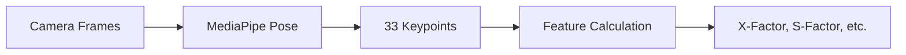
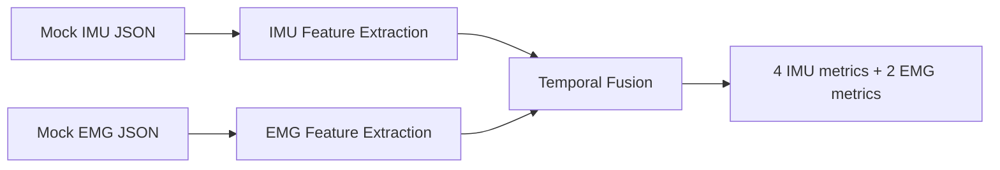
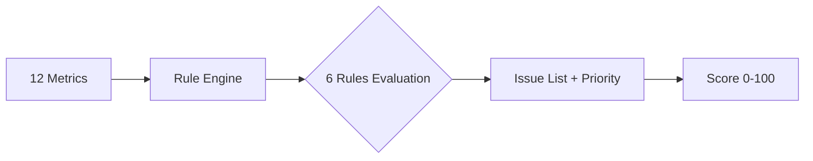
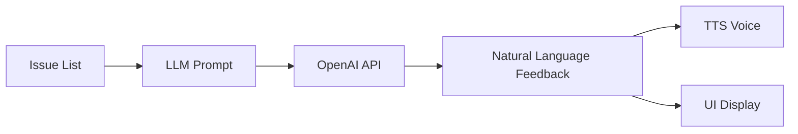

# System Design

> **Document Role**: Hub - Core system design document, entry point for all detailed specification documents
>
> **Target Audience**: Technical leads, new team members, investors
>
> **Reading Time**: 25 minutes

---

## 0. Background Knowledge (Prerequisites)

Before diving into system design, we recommend understanding golf biomechanics fundamentals:

| Document | Content | Reading Time |
|----------|---------|--------------|
| **[📖 Biomechanics 101](../../prerequisites/foundations/biomechanics-101.md)** | 7 chapters learning golf biomechanics from scratch | ~90 minutes |
| **📚 Biomechanics Glossary** | 140+ professional term definitions, team communication standard | As needed |
| **📊 Biomechanics Benchmarks** | Research-validated benchmark data for pros/amateurs | ~15 minutes |

> 💡 **Quick Start**: If time is limited, at least read chapters 1-3 of [Biomechanics 101](../../prerequisites/foundations/biomechanics-101.md).

---

## 1. MVP Definition

### 1.1 Product Vision

**One-liner**: Vision + IMU + EMG tri-modal fusion golf swing analysis system providing actionable improvement suggestions via AI coaching.

**Core Differentiation**: EMG muscle activation detection — competitors can only tell you "what's wrong", we tell you "why it's wrong".

### 1.2 MVP Scope

> **Development Plan**: See Section 2 for MVP development plan and acceptance criteria.

| Feature | MVP Phase 1 | Phase 2 | Phase 3 | Notes |
|---------|:-----------:|:-------:|:-------:|-------|
| **Mode 1: Setup Check** | ✅ | - | - | Stance detection, <300ms |
| **Mode 2: Slow Motion** | ✅ | - | - | Slow motion real-time feedback |
| **Mode 3: Full Speed** | ✅ | - | - | Post-swing analysis |
| MediaPipe Skeleton Overlay | ✅ | - | - | 33 keypoints |
| 8-Phase Swing Detection | ✅ | - | - | GolfDB standard |
| 6 Core Rules | ✅ | - | - | P0-P1 priority |
| Mock IMU Data | ✅ | - | - | Simulate 100Hz |
| Mock EMG Data (Core+Forearm) | ✅ | - | - | Simulate 500Hz, 2 channels |
| LLM Feedback Generation | ✅ | - | - | OpenAI API |
| TTS Voice Feedback | ✅ | - | - | System TTS |
| Ghost Overlay (Static) | ⚠️ | ✅ | - | Simplified version |
| Ghost Overlay (Dynamic) | - | ✅ | - | Needs DTW alignment |
| Real IMU Hardware | - | ✅ | - | LSM6DSV16X |
| Real EMG Hardware (Core+Forearm) | - | ✅ | - | 2-channel DFRobot |
| Pelvis IMU | - | ✅ | - | Complete kinematic chain analysis |
| Gluteus EMG | - | ✅ | - | Downswing initiation, hip rotation |
| Adductors EMG | - | ✅ | - | Lower body stability, weight transfer |
| Lats EMG | - | - | ✅ | Shoulder rotation, pulling motion |
| Deltoids EMG | - | - | ✅ | Arm raise, top position |

### 1.3 Success Criteria

| Metric | Target | Measurement Method |
|--------|--------|-------------------|
| 8-phase detection accuracy | >70% | GolfDB video test |
| Phase detection error | <100ms | Compare with annotations |
| End-to-end latency | <500ms | From frame capture to feedback |
| Rule engine accuracy | >80% | Coach manual validation |
| User-understandable feedback | >80% satisfaction | User testing |

### 1.4 Target Users

**MVP First Users**: Amateur golfers with 15-25 handicap, willing to use technology to improve swing, age 25-55.

**Non-target Users**: Professional golfers (requirements too specialized), complete beginners (need more basic instruction).

---

## 2. Core Metrics List

### 2.1 MVP Measured Metrics (12)

Based on [Sensor-Metric Mapping](./sensor-metric-mapping.md) and Biomechanics Benchmarks.

> 🔍 **Competitor Comparison**: Metric differences vs OnForm/Sportsbox see Competitor Metrics Comparison

#### Vision Metrics (MediaPipe 33 Keypoints)

| Metric | Detection Method | Threshold | Source |
|--------|-----------------|-----------|--------|
| **X-Factor** | Shoulder-hip angle difference | >35° good | TPI |
| **X-Factor Stretch** | Downswing increment | >5% | Meister |
| **Shoulder Turn** | Side-view skeleton | 85-100° | TPI |
| **Hip Turn** | Side-view skeleton | 40-55° | TPI |
| **S-Factor** | Shoulder tilt | 30-40° | Meister |
| **Sway/Lift** | 3D trajectory | <3" lateral | Research |

#### Mock IMU Metrics

| Metric | Detection Method | Threshold | Source |
|--------|-----------------|-----------|--------|
| **Peak Angular Velocity** | Direct measurement | >800°/s | Research |
| **Tempo Ratio** | Timing calculation | 2.5-3.5 (3:1) | Novosel |
| **Backswing Duration** | Event detection | 0.70-0.85s | Tour avg |
| **Downswing Duration** | Event detection | 0.25-0.30s | Tour avg |

#### Mock EMG Metrics (Differentiating Capability)

| Metric | Detection Method | Threshold | Source |
|--------|-----------------|-----------|--------|
| **Core Activation %** | RMS envelope | >50% MVC | Research |
| **Core-Forearm Timing** | onset difference | >20ms (core first) | Cheetham |

### 2.2 MVP Rule Engine (6 Rules)

> 📋 **Detailed Specs**: Complete trigger logic, feedback modes, latency requirements see Real-time Feedback Spec

#### P0 - Critical Issues (Must Fix)

| # | Rule | Condition | Feedback Example |
|---|------|-----------|-----------------|
| 1 | **Reverse Kinematic Chain** | EMG: Forearm before core (gap < -20ms) | "Your arms moved before your body, try letting your body lead" |
| 2 | **Excessive Arm Swing** | EMG: Forearm/Core ratio > 1.3 | "Feel the core powering the swing, not the arms" |

#### P1 - Important Improvements (Moderate Impact)

| # | Rule | Condition | Feedback Example |
|---|------|-----------|-----------------|
| 3 | **Low X-Factor** | Vision: X-Factor < 20° | "Turn your shoulders more, feel left shoulder to chin" |
| 4 | **Fast Tempo** | IMU: Downswing < 0.20s | "Slow down your backswing, count '1-2-3'" |
| 5 | **Slow Tempo** | IMU: Downswing > 0.40s | "Be more decisive on the downswing" |
| 6 | **Early Release** | IMU: Wrist release < 40% downswing | "Hold wrist angle until impact" |

---

## 3. Build Order {#3-build-order}

> **Related Documents**:
>
> - 8-Phase Swing Detection - Phase segmentation algorithm & code implementation
> - Swing Comparison Strategy - 4 comparison methods (Pro/Personal Best/Statistical/Learned)
> - Real-time Feedback Spec - 3 feedback modes detailed specs
> - Mobile Development - Flutter development & testing guide

### 3.1 Phase 1: Vision Pipeline (Week 1-2)



**Task List**:

- [ ] MediaPipe integration (ThinkSys Flutter plugin)
- [ ] 33 keypoints extraction → 6 Vision metrics calculation
- [ ] 8-phase detection algorithm implementation
- [ ] GolfDB video testing (accuracy >70%)

**Acceptance Criteria**: Able to detect 8 phases on GolfDB videos with <100ms error.

### 3.2 Phase 2: Mock Sensor Integration (Week 3)



**Task List**:

- [ ] Mock IMU data generation (based on research data)
- [ ] Mock EMG data generation (based on research data)
- [ ] IMU feature extraction: peak angular velocity, tempo ratio, duration
- [ ] EMG feature extraction: core activation %, timing difference
- [ ] Time synchronization alignment

**Acceptance Criteria**: Mock data produces reasonable 12 metric values.

### 3.3 Phase 3: Rule Engine + Scoring (Week 4)



**Task List**:

- [ ] 6 rules implementation (IF-THEN)
- [ ] Priority sorting (P0 > P1)
- [ ] Scoring algorithm (based on rule violation severity)
- [ ] Coach manual validation (accuracy >80%)

**Acceptance Criteria**: Rule engine output matches coach judgment >80%.

### 3.4 Phase 4: Feedback System (Week 5)



**Task List**:

- [ ] LLM Prompt template design (rule judgment → natural language)
- [ ] OpenAI API integration
- [ ] TTS integration (flutter_tts)
- [ ] Feedback language user testing

**Acceptance Criteria**: Users understand and accept feedback content >80%.

### 3.5 Phase 5: Mobile App Shell (Week 6-7)

**Task List**:

- [ ] Camera real-time preview + skeleton overlay
- [ ] 3 feedback mode UI switching
- [ ] History record storage
- [ ] BLE framework (prepare for hardware)

**Acceptance Criteria**: 60 FPS skeleton overlay, memory <500MB.

### 3.6 Phase 6: User Testing (Week 8)

**Task List**:

- [ ] Recruit 5-10 target users
- [ ] Define test scenarios
- [ ] Collect feedback
- [ ] Iterate fixes

---

## 4. Technology Stack

> **Related Documents**:
>
> - SDK Selection - MediaPipe/NeuroKit2/imufusion SDK comparison
> - Machine Learning Basics - Swing analysis ML models introduction

### 4.1 Confirmed Technology Choices

| Layer | Technology | Decision Basis |
|-------|-----------|---------------|
| **Project Structure** | Multi-repo (5 repos) | ADR-0001 |
| **Mobile** | Swift iOS (Native) | ADR-0007 |
| **Pose Estimation** | MediaPipe iOS SDK (MediaPipeTasksVision) | Official Google SDK, 33 keypoints |
| **MCU** | XIAO ESP32S3 | Seeed 113991114, Sensor Hub architecture |
| **IMU** | Adafruit LSM6DSV16X | ADA-5783, better Arduino library |
| **EMG** | MyoWare 2.0 + Link Shield | SparkFun DEV-21265 + DEV-18425 |
| **ML Inference** | TFLite (MediaPipe built-in) | Out-of-box, no additional inference engine needed |
| **LLM** | OpenAI GPT-4o-mini | Low cost, fast |
| **TTS** | AVSpeechSynthesizer (iOS) | Native iOS, free |

### 4.2 MVP Simplification Strategy

> 📐 **Detailed Design**: LEGO-style modular architecture detailed in [Modular Architecture Design](./modular-architecture.md)

| Component | MVP Solution | Future Upgrade |
|-----------|-------------|----------------|
| Pose Estimation | MediaPipe Pose | RTMPose → ViTPose++ |
| Phase Classification | SwingNet (pretrained) | BiGRU → Transformer |
| EMG Processing | NeuroKit2 | Custom filtering |
| Analysis Engine | Rule Engine IF-THEN | ML classifier |
| Sensor Fusion | Simple Merge | Kalman Filter → ML Fusion |
| Visualization | OpenCV + MediaPipe | Unity 3D |
| Voice Feedback | System TTS | OpenAI TTS |

### 4.3 Sensor Hub Architecture (Key Innovation)

> 📐 **Time Sync Strategy**: Detailed specs see [Data Pipeline & AI](./data-pipeline-and-ai.md) §1.2

**Core Problem**: BLE protocol has 15-30ms jitter (validated 2025-12), cannot be completely eliminated by software.

**Solution**: IMU + EMG on same body part share the same ESP32 clock source

```text
┌─────────────────────────────────────────────────────────────────┐
│                    Sensor Hub Architecture                       │
├─────────────────────────────────────────────────────────────────┤
│                                                                 │
│   ✅ Correct Architecture:                                       │
│   ┌───────────────────────┐     ┌───────────────────────┐       │
│   │     ESP32 #1          │     │      ESP32 #2         │       │
│   │  (Arm Sensor Hub)     │     │   (Core Sensor Hub)   │       │
│   │ ┌─────────┬─────────┐ │     │ ┌─────────┬─────────┐ │       │
│   │ │Wrist IMU│Forearm  │ │     │ │Core EMG │Waist IMU│ │       │
│   │ │ (I2C)   │EMG(ADC) │ │     │ │ (ADC)   │ (I2C)   │ │       │
│   │ └─────────┴─────────┘ │     │ └─────────┴─────────┘ │       │
│   │   Same clock ✅        │     │   Same clock ✅        │       │
│   └───────────┬───────────┘     └───────────┬───────────┘       │
│               └─────────────┬───────────────┘                   │
│                             ↓ BLE                               │
│                         ┌────────┐                              │
│                         │ iPhone │                              │
│                         └────────┘                              │
│                                                                 │
└─────────────────────────────────────────────────────────────────┘
```

**Sync Accuracy**:

| Scenario | Target Accuracy | Achievable | Method |
|----------|----------------|-----------|--------|
| Same ESP32 (IMU+EMG) | <100 μs | <10 μs | esp_timer_get_time() |
| Cross ESP32 (Arm↔Core) | <1 ms | 69-477 μs | Impact event alignment |
| Cross Device (ESP32↔Vision) | <10 ms | <5 ms | Impact frame alignment |

**Key Advantages**:

- Use ESP32 source-side microsecond timestamps (not phone receive time)
- Different Sensor Hubs eliminate BLE jitter via Impact event alignment
- Avoid clock drift from each sensor having independent BLE connection

> Details see [Key Decisions 2025-12](./architecture-decisions-2025-12-23.md#43-hardware-shopping-list--2025-12-23-verified)

---

## 5. Testing Strategy

### 5.1 Unit Tests

| Module | Test Content | Tool |
|--------|-------------|------|
| Feature Calculation | X-Factor calculation correctness | pytest |
| Phase Detection | 8-phase boundary identification | pytest + GolfDB |
| Rule Engine | Each rule trigger condition | pytest |

### 5.2 Integration Tests

| Scenario | Input | Expected Output |
|----------|-------|-----------------|
| Normal Swing | GolfDB video | 8 phases + score |
| Problem Swing | Simulated problem data | Correct diagnosis + feedback |

### 5.3 User Validation

| Stage | Participants | Validation Content |
|-------|-------------|-------------------|
| Alpha | 3 internal | Feature completeness |
| Beta | 5-10 users | Feedback understandability |
| Golf Advisor | 1-2 coaches | Rule threshold accuracy |

### 5.4 Benchmark Data

- **GolfDB**: 1400 annotated swing videos
- **Research Data**: Pro/amateur benchmark values (see Biomechanics Benchmarks)

---

## 6. Documentation Index

### Recommended Reading Order

#### Step 1: Understand Overall Architecture

- **[This Document]** system-design.md ← You are here

#### Step 2: Understand Core Algorithms

- **[Modular Architecture](./modular-architecture.md)** - LEGO block design, module upgrade paths
- **[Data Pipeline & AI](./data-pipeline-and-ai.md)** - Data flow, sensor fusion, time sync strategy
- **[Sensor Mapping](./sensor-metric-mapping.md)** - Which sensor measures what
- **[2025 December Key Decisions](./architecture-decisions-2025-12-23.md)** - Sensor Hub architecture, hardware selection, time sync strategy
- 8-Phase Detection - Swing phase identification algorithm with code
- Swing Comparison - 4 comparison methods, DTW algorithm
- Real-time Feedback - 3 feedback mode specs

#### Step 3: Understand Data Sources

- Biomechanics Benchmarks - Threshold data sources
- Biomechanics Glossary - 140+ term definitions

---

## 7. Future Roadmap (Phase 2+) {#7-future-plans}

Technical reserves and expansion directions after MVP completion:

| Direction | Document | Content |
|-----------|---------|---------|
| **Personalization** | Personalization Spec | Adjust thresholds by gender/age/body type |
| **Debug Visualization** | Visualization Tools Evaluation | Rerun multimodal debugging, TAPIR club tracking |

> 💡 **Highlights**: [Rerun.io](https://rerun.io) supports Vision+IMU+EMG same-timeline visualization, our first choice debugging tool. [TAPIR](https://github.com/google-deepmind/tapnet) enables clubhead tracking, replacing $5000+ Trackman radar with software.

---

## 8. Open Issues

### 8.1 Hypotheses to Validate

| Hypothesis | Validation Method | Owner |
|-----------|------------------|-------|
| MediaPipe 33 keypoints sufficient for X-Factor | GolfDB test | Software Engineer |
| Mock EMG data represents real patterns | Compare with research data | Software Engineer |
| Users understand LLM-generated feedback | User testing | Product |
| 6 rules cover main issues | Coach review | Golf Advisor |

### 8.2 Decisions to Make

| Decision | Options | Deadline |
|----------|---------|----------|
| Ghost Overlay in MVP | Yes (simplified) / No | Week 2 |
| LLM Provider | OpenAI / Claude / Local | Week 4 |
| Support recording & saving | Yes / No | Week 5 |

### 8.3 Known Risks

| Risk | Impact | Mitigation |
|------|--------|-----------|
| MediaPipe iOS performance insufficient | Low frame rate | Reduce resolution, use GPU |
| EMG real data differs from Mock | Rules need retuning | Phase 2 validation |
| Users reject wearable devices | Product positioning fails | First validate pure Vision version |
| BLE jitter 15-30ms | Time sync error | Sensor Hub + Impact alignment solution |
| MyoWare 2.0 Link Shield | Cannot solder | DEV-18425 is required |
| DFRobot EMG cable noise | Signal quality | Only suitable for static measurement |
| WitMotion IMU BLE | Time sync | Must connect via I2C to ESP32 |

---

## 9. Version History

| Version | Date | Changes |
|---------|------|---------|
| 1.0 | 2025-12-18 | Initial version, integrated all detailed specs |
| 1.1 | 2025-12-23 | Added Sensor Hub architecture, updated hardware selection, clarified BLE time sync strategy |

---

**Last Updated**: 2025-12-23
**Maintainer**: Movement Chain AI Team
