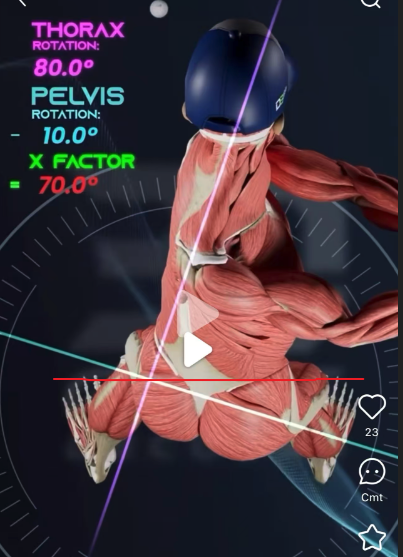
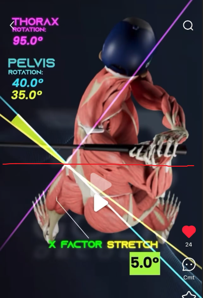
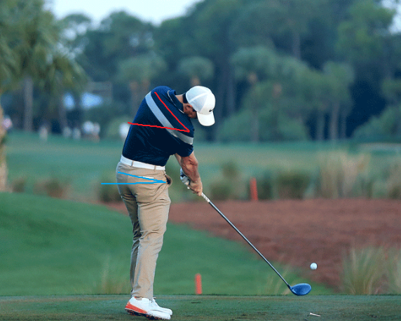
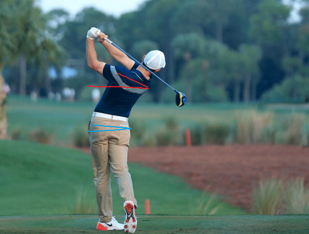
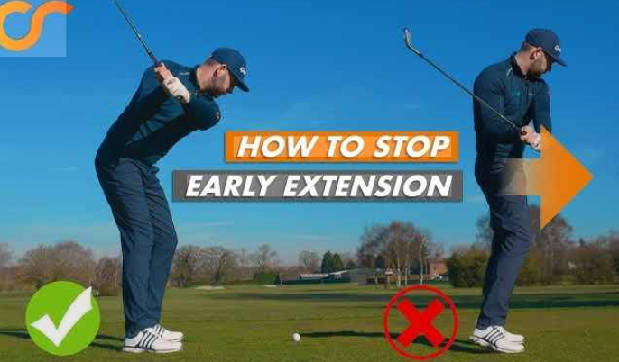
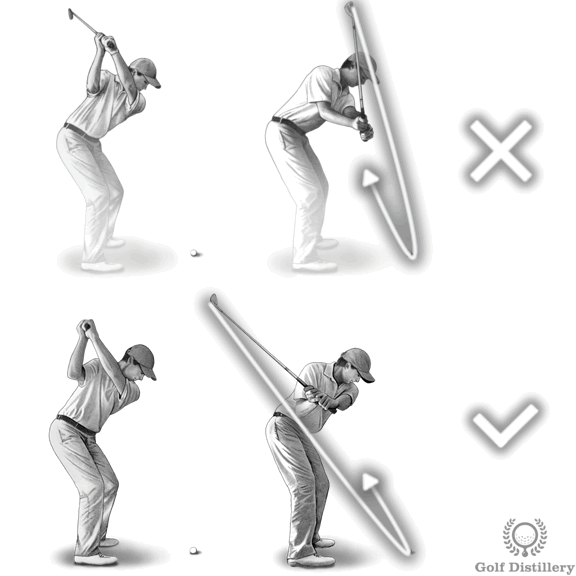
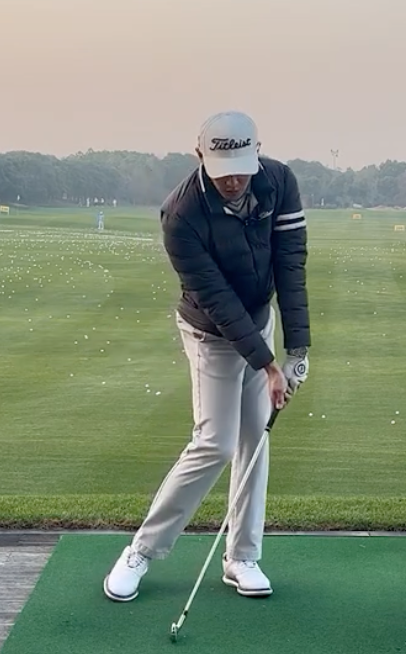

# Golf Biomechanics 101

---

## Why Learn This?

Imagine two golfers:

- **Golfer A**: 185cm tall, 90kg, gym regular
- **Golfer B**: 170cm tall, 65kg, office worker

Who can hit the ball farther?

The answer may surprise you: **not necessarily the stronger one**.

Power in golf doesn't come from brute force—it comes from **coordinated movement of body parts generating energy transfer**. Professional golfers can transfer ground reaction force through pelvis, torso, arms, and club, amplifying it layer by layer to reach 180+ km/h clubhead speed at impact.

This guide will help you understand every step of this process.

---

## Chapter 1: The Body Machine

---

## 1.1 Three Core Body Parts

The golf swing can be simplified to the coordinated movement of **three key body parts**:

```text
┌─────────────────────────────────────────────────────────────────────────────┐
│                         Body Segmentation Diagram                            │
├─────────────────────────────────────────────────────────────────────────────┤
│                                                                              │
│                        ┌─────────┐                                           │
│                        │  HEAD   │  Head (Stays stable)                      │
│                        └────┬────┘                                           │
│                             │                                                │
│                    ┌────────┴────────┐                                       │
│                    │     THORAX      │  Chest/Upper Torso                    │
│                    │   (Shoulders)   │  ← Primary rotation unit              │
│                    └────────┬────────┘                                       │
│                             │                                                │
│                    ┌────────┴────────┐                                       │
│                    │      CORE       │  Core Muscles                         │
│                    │   (Obliques)    │  ← Connects upper & lower body        │
│                    └────────┬────────┘                                       │
│                             │                                                │
│                    ┌────────┴────────┐                                       │
│                    │     PELVIS      │  Pelvis                               │
│                    │     (Hips)      │  ← Power engine                       │
│                    └────────┬────────┘                                       │
│                             │                                                │
│                    ┌────────┴────────┐                                       │
│                    │      LEGS       │  Legs                                 │
│                    │    (Ground)     │  ← Ground reaction force source       │
│                    └─────────────────┘                                       │
│                                                                              │
└─────────────────────────────────────────────────────────────────────────────┘
```

### Pelvis

**Definition**: Hip bone structure connecting torso and lower limbs

**Simplified explanation**: Your "hips," including the left and right hip joints. When standing, the pelvis is the "base" for your entire upper body.

**Role in the swing**:

- The **First Mover** of the downswing
- The **transfer station** for power from ground to upper body
- Professional golfers' pelvis rotation can reach **477°/s**

### Thorax

**Definition**: Upper torso area from shoulders to mid-back

**Simplified explanation**: Simply put, your "upper body," including chest, shoulders, and upper back. When we say "shoulder turn," it's actually the entire thorax rotating.

**Role in the swing**:

- The **primary rotation unit** of the swing
- Rotates backward during backswing to store energy
- Releases energy during downswing, reaching speeds of **552°/s**

### Core

**Definition**: Abdominal and lower back muscle groups, including obliques, rectus abdominis, and erector spinae

**Simplified explanation**: The "bridge" connecting upper and lower body. The core isn't just "abs"—it also includes deep stabilizing muscles in the side abdomen and lower back.

**Role in the swing**:

- **Connects** pelvic and thoracic rotation
- **Transfers** power from lower to upper limbs
- **Stabilizes** the spine to prevent injury

---

## 1.2 The Kinetic Chain

This is one of the most important concepts in this document.

**The Kinetic Chain** refers to the system where body parts are **connected in sequence**, transferring energy from proximal (body center) to distal (limb extremities).

```text
┌─────────────────────────────────────────────────────────────────────────────┐
│                         Kinetic Chain Energy Transfer                        │
├─────────────────────────────────────────────────────────────────────────────┤
│                                                                              │
│   Ground → Legs → Pelvis → Torso → Arms → Club → Ball                       │
│                                                                              │
│   ════════════════════════════════════════════════════════════════          │
│   Energy direction: From center outward, from bottom up                     │
│   Speed variation: Each segment increases speed by ~1.5x                    │
│   ════════════════════════════════════════════════════════════════          │
│                                                                              │
│   Example speed progression:                                                │
│   Pelvis 477°/s → Torso 552°/s → Arms 1200°/s → Club 2500°/s               │
│                                                                              │
└─────────────────────────────────────────────────────────────────────────────┘
```

**Why is the kinetic chain so important?**

Imagine cracking a whip:

1. Your arm moves first (proximal)
2. The whip body follows
3. The whip tip moves last but fastest (distal)

The golf swing works exactly the same way. If you swing the club directly with your arms (skipping body rotation), it's like cracking a whip with only your wrist—you'll never reach maximum speed.

**Correct kinetic chain** = Each segment starts in sequence; when one segment decelerates, energy transfers to the next

**Incorrect kinetic chain** = Arms start before the body, or multiple parts start simultaneously

---

## 1.3 The Eight Swing Phases

A complete golf swing can be divided into eight phases:

<figure markdown="span">
  { width="100%" }
  <figcaption>P Classification System: 10 key positions defining complete swing (Image source: <a href="https://hackmotion.com/golf-swing-positions/">HackMotion</a>)</figcaption>
</figure>

!!! info "Relationship Between P1-P10 and Eight Phases"
    Two classification systems are commonly used in golf instruction:

    - **P Classification System (P1-P10)**: **Position-oriented**, defining 10 key geometric checkpoints
    - **Eight-Phase System**: **Time-oriented**, describing 8 continuous motion phases

    Both systems essentially describe the same swing motion from different perspectives. The P system has 10 positions while the eight-phase has only 8 because:

    - **P3** (mid-backswing) is a checkpoint within Phase 3 backswing
    - **P6** (mid-downswing) is a checkpoint within Phase 6 downswing
    - **P8, P9, P10** are all within Phase 8 follow-through, subdividing the finish motion

```text
┌──────────────────────────────────────────────────────────────────────────────────────────────┐
│                              Eight Swing Phases Timeline                                      │
├──────────────────────────────────────────────────────────────────────────────────────────────┤
│                                                                                               │
│   Timeline (Professional Driver)                                                              │
│   ├──────────────────────────────────────────────────────────────────────────────────────┤   │
│   0s       0.1s              0.75s    0.80s   0.85s           1.0s                  1.3s     │
│   │         │                  │        │       │               │                     │      │
│   ▼         ▼                  ▼        ▼       ▼               ▼                     ▼      │
│                                                                                               │
│   ┌────┐ ┌─────┐ ┌───────────────┐ ┌────┐ ┌─────┐ ┌─────────┐ ┌──────┐ ┌───────────────┐    │
│   │ 1  │→│  2  │→│      3        │→│ 4  │→│  5  │→│    6    │→│  7   │→│      8        │    │
│   │Addr│ │Take-│ │  Backswing    │ │Top │ │Trans│ │Downswing│ │Impact│ │Follow-through │    │
│   │ess │ │away │ │               │ │    │ │ition│ │         │ │      │ │               │    │
│   └────┘ └─────┘ └───────────────┘ └────┘ └─────┘ └─────────┘ └──────┘ └───────────────┘    │
│                                                                                               │
│   Static  0.10-   0.60-0.70s       Instant 0.05-   0.23-0.28s    ~5ms     0.30-0.50s         │
│          0.15s                              0.10s                                             │
│                                                                                               │
│   ◀─────── Backswing 0.70-0.80s ──────────▶◀────── Downswing 0.23-0.28s ──────▶             │
│                                                                                               │
│                              ⚠️ Transition is the most critical phase                        │
│                                                                                               │
└──────────────────────────────────────────────────────────────────────────────────────────────┘
```

### Phase Details (P System + Eight Phases Combined)

| Phase | P Position | English | Duration | Position Definition | Key Actions |
|:----:|:------:|------|:----:|----------|----------|
| **1** | **P1** | Address | Static | Setup posture | Grip, stance, body posture |
| **2** | **P2** | Takeaway | 0.10-0.15s | Shaft parallel to ground | Club leaves ball, triangle stays intact |
| **3** | P3 | Backswing | 0.60-0.70s | Lead arm parallel to ground | Mid-backswing, wrist hinge begins |
| **4** | **P4** | Top | Instant | Top of backswing | Full shoulder turn, ideal wrist position, shaft parallel |
| **5** | P5 | Transition | 0.05-0.10s | Lead arm parallel on downswing | ⚠️ **Most critical**: Lower body leads, wrists start to unhinge |
| **6** | P6 | Downswing | 0.23-0.28s | Shaft parallel on downswing | Delayed release (lag), torso rotation accelerates |
| **7** | **P7** | Impact | ~5ms | Ball contact moment | Square clubface, weight forward, hands ahead of ball |
| **8** | P8 | Follow-through | 0.30-0.50s | Shaft parallel on follow | Arms fully extended, trail wrist flips |
| 8 | P9 | Follow-through | ↑ | Lead arm parallel on follow | Mid-finish, maintain balance |
| 8 | **P10** | Finish | ↑ | Finish position | Full rotation, weight forward, club on shoulder |

!!! tip "Reading Guide"
    - **Bold P positions** (P1, P2, P4, P7, P10) = Key positions corresponding one-to-one with eight phases
    - Regular P positions (P3, P5, P6, P8, P9) = Checkpoints within phases
    - P8, P9, P10 all belong to Phase 8 follow-through, sharing the 0.30-0.50s duration

## 1.4 Tempo Ratio {#tempo-ratio}

Professional golfers' **[tempo ratio](../../reference/golf-glossary.md#2-节奏比-tempo-ratio)** is typically 3:1:

$$
\text{Tempo Ratio} = \frac{\text{Backswing Time}}{\text{Downswing Time}} = \frac{0.75\,\text{s}}{0.25\,\text{s}} = 3{:}1
$$

This means backswing takes 3 times longer than downswing. This ratio is remarkably consistent, whether Tiger Woods or Rory McIlroy.

!!! tip "Key Understanding"
    Tempo ratio is a **diagnostic tool**, not a training target. Everyone has their own natural tempo; consistency is key. See [Golf Glossary - Tempo Ratio](../../reference/golf-glossary.md#2-节奏比-tempo-ratio).

---

## 1.5 Lead Side & Trail Side {#lead-side-trail-side}

In golf, we don't say "left/right"—we say "lead side" and "trail side":

| Term | Right-handed | Left-handed | Function |
|------|----------|----------|------|
| **Lead Side** | Left | Right | Faces target, absorbs impact force |
| **Trail Side** | Right | Left | Faces away from target, provides rotation power |

This naming convention avoids confusion between right and left-handed golfers.

!!! tip "Significance for Sensor Project"
    1. **IMU Naming Convention**: Sensor positions should use lead/trail not left/right
    2. **Algorithm Reusability**: Motion analysis needs only one logic set, switching left/right mode via configuration
    3. **Data Universality**: Labeling and metric reporting are universal for both golfer types, no need to maintain two terminology sets

    See [Golf Glossary - Lead & Trail Side](../../reference/golf-glossary.md#3-引导侧与后侧-lead-trail-side).

---

## Chapter 2: The Story of Rotation

---

## 2.1 Two Key Rotations

Power in the golf swing primarily comes from **two types of rotation**:

### Shoulder Turn (Torso Turn)

**Definition**: Rotation angle of the thorax around the vertical axis

**Explanation**: Simply "shoulder turn." Imagine your shoulder line is a compass needle—how many degrees did this compass turn during backswing?

**Professional standard**:

- Top of backswing: **90-110°** (relative to address)
- Amateur golfers typically only 70-85°

### Hip Turn (Pelvis Turn)

**Definition**: Rotation angle of the pelvis around the vertical axis

**Explanation**: Simply "hip turn." Hip rotation range is typically less than shoulder because the lower body must maintain stability.

**Professional standard**:

- Top of backswing: **45-55°**
- Amateur golfers typically 30-40°

---

## 2.2 X-Factor (Shoulder-Hip Separation)

This is **one of the most important concepts** in golf biomechanics.

### What is X-Factor?

**X-Factor** = Shoulder Rotation Angle − Hip Rotation Angle

<figure markdown="span">
  { width="300" }
  <figcaption>Top view showing shoulder-hip angle difference forming X shape</figcaption>
</figure>

### Why is X-Factor Important?

X-Factor represents how much your torso is **"coiled"** at the top of your backswing.

Imagine a twisted towel:

- Upper body turns backward (shoulders)
- Lower body relatively fixed (hips)
- Core muscles in between are **stretched to store energy**

When you release (downswing), these stretched muscles **elastically recoil**, producing tremendous rotational power.

### X-Factor Benchmarks

| Level | X-Factor | Interpretation |
|------|----------|------|
| Beginner | <25° | Insufficient body rotation, mainly using arms |
| Amateur | 25-35° | Some separation, but room for improvement |
| Advanced | 35-45° | Good shoulder-hip separation |
| **Professional** | **42-55°** | Optimal range, balance of power and control |
| Excessive | >60° | May cause lower back injury |

**Research finding**: X-Factor correlation with clubhead speed r = 0.90 (extremely strong)

---

## 2.3 X-Factor Stretch {#x-factor-stretch}

This is **one of the key indicators** distinguishing professionals from amateurs. See [Golf Glossary - X-Factor Stretch](../../reference/golf-glossary.md#5-x-factor-stretch).

### What is X-Factor Stretch?

During transition:

1. Pelvis has already started rotating toward the target (downswing initiated)
2. But shoulders are still completing backswing (continuing backward or staying still)
3. This causes X-Factor to **increase further**

**Simple understanding**: Pelvis moves first, shoulders later—this time lag creates additional "coiling."

```text
┌─────────────────────────────────────────────────────────────────────────────┐
│                    X-Factor Stretch Timeline                                 │
├─────────────────────────────────────────────────────────────────────────────┤
│                                                                             │
│   X-Factor                                                                  │
│      ↑                                                                      │
│   55°│                    ●←── X-Factor Stretch Peak                        │
│      │                   / \                                                │
│   45°│            ●─────●   \                                               │
│      │           / Top       \                                              │
│      │          /             \                                             │
│   35°│         /               \                                            │
│      │        /                 \                                           │
│      │       /                   \                                          │
│    0°│──────●─────────────────────●                                         │
│      └──────┼─────────┼───────────┼────────→ Time                           │
│           Address    Top    Transition   Impact                             │
│                                                                             │
│                                                                             │
└─────────────────────────────────────────────────────────────────────────────┘
```

**X-Factor Stretch** = **Increase** in X-Factor during transition

!!! info "X-Factor vs X-Factor Stretch"
    | Concept | Definition | Type |
    |------|------|------|
    | **X-Factor** | Shoulder Rotation − Hip Rotation | Instantaneous value (angle difference at a moment) |
    | **X-Factor Stretch** | Transition X-Factor − Top X-Factor | Change amount (difference between two moments) |

    **Numerical example:**
    ```text
    Moment           Shoulder   Hip    X-Factor
    ──────────────────────────────────────────────────
    Top                90°      45°      45°  ← X-Factor at Top
    Transition Peak    92°      37°      55°  ← X-Factor Peak
    ```
    - **X-Factor (at Top)** = `Shoulder Rotation − Hip Rotation` at top = 45°

    - **X-Factor Stretch** = Transition peak − Top value = `55° − 45° = 10°`

| X-Factor Rotation | X-Factor Stretch |
|:--:|:--:|
| { width="300" } | { width="300" } |

### X-Factor Stretch Benchmarks

| Level | X-Factor Stretch | Interpretation |
|------|------------------|------|
| Beginner | <3° or none | No "loading" action |
| Amateur | 3-6° | Some stretch, but not obvious |
| Advanced | 6-10° | Good transition movement |
| **Professional** | **8-15°** | Obvious shoulder-hip separation increase |

---

## 2.4 S-Factor and O-Factor (Tilt Angles)

Besides horizontal rotation, we also need to monitor **tilt angles**:

### S-Factor (Shoulder Tilt)

**Definition**: Shoulder line tilt angle relative to horizontal plane (side bend)

**Explanation**: During backswing, trail shoulder will be lower than lead shoulder; during downswing to impact, the situation reverses.

!!! tip "Visual Reference"
    📊 [GEARS: Body Metrics](https://www.gearssports.com/articles/gears-golf-body-metrics/) explains the 3D definition of Side Bend, same concept as S-Factor.

### O-Factor (Pelvis Tilt)

**Definition**: Pelvis tilt angle relative to horizontal plane

**Explanation**: Pelvis tilt should remain relatively stable (5-10°); excessive variation affects stability.

### Tilt Angle Benchmarks

| Metric | Top of Backswing | Impact | Notes |
|------|----------|----------|----------|
| S-Factor | 30-40° right tilt | 25-35° left tilt | Tilt direction reverses before impact |
| O-Factor | 5-10° | 5-10° | Should remain stable |

<div class="grid cards" markdown>

- 

    **Top of Backswing**

- 

    **Impact**

- 

    **Mid Follow-through**

- 

    **Finish**

</div>

> Red line = S-Factor (shoulder tilt), Blue line = O-Factor (pelvis tilt). Note the blue line (O-Factor) remains relatively stable throughout the swing.

---

## 2.5 Rotation Metrics Summary

```text
┌─────────────────────────────────────────────────────────────────────────────┐
│                         Rotation Metrics Quick Reference                     │
├─────────────────────────────────────────────────────────────────────────────┤
│                                                                             │
│   Metric               Formula                   Professional Standard       │
│   ───────────────────────────────────────────────────────────────────────── │
│   Shoulder Rotation    Thorax around vertical    90-110°                    │
│   Hip Rotation         Pelvis around vertical    45-55°                     │
│   X-Factor             Shoulder − Hip            42-55°                     │
│   X-Factor Stretch     Transition XF − Top XF    8-15°                      │
│   S-Factor             Shoulder side tilt        30-40° → 25-35°            │
│   O-Factor             Pelvis side tilt          5-10° (stable)             │
│                                                                             │
└─────────────────────────────────────────────────────────────────────────────┘
```

---

## Chapter 3: The Secret of Timing

---

## 3.1 Why is Timing More Important Than Strength?

A surprising fact:

> **Professional golfers have ~15-20% more muscle strength than amateurs**
> **But clubhead speed difference can reach 30-40%**

Where does this difference come from? **Timing**.

Correct timing allows energy to **amplify layer by layer**; incorrect timing causes energy to **leak prematurely**.

---

## 3.2 Kinematic Sequence

This is the core concept of this chapter.

**Kinematic Sequence** describes the **sequence of acceleration and deceleration** of body parts during downswing:

```text
┌─────────────────────────────────────────────────────────────────┐
│                  Kinematic Sequence Timeline                     │
├─────────────────────────────────────────────────────────────────┤
│                                                                 │
│  Peak angular    ①       ②       ③       ④                     │
│  velocity order: Pelvis → Torso → Arms  → Club                  │
│                  ↓        ↓        ↓        ↓                   │
│  Timeline:     ──●────────●────────●────────●───→ Impact        │
│             Decel first Receives  Receives  Final burst         │
│                         energy    energy                        │
│                                                                 │
│  Energy transfer: Pelvis decels → Torso gains energy → Accels  │
│                   Torso decels → Arms gain energy → Accel      │
│                   Arms decel → Club gains energy → Accel (peak)│
│                                                                 │
└─────────────────────────────────────────────────────────────────┘
```

!!! tip "Visual Reference"
    📊 [GEARS: Kinematic Sequence](https://www.gearssports.com/articles/sports-kinetic-kinematic-sequence/) shows actual 4-curve graphs.

### Proximal-to-Distal Principle

This is a fundamental biomechanics principle: **energy flows from the body center (proximal) to limb extremities (distal)**.

- **Proximal**: Near body center (pelvis, torso)
- **Distal**: Away from body center (arms, club)

Correct sequence: Pelvis → Torso → Arms → Club

---

## 3.3 Transition: The Magic Moment

**Transition** is the **first 50-100 milliseconds** of the downswing, also the **most critical moment** in the entire swing.

### What Happens During Transition?

```text
┌─────────────────────────────────────────────────────────────────┐
│                   Transition (50-100ms)                          │
├─────────────────────────────────────────────────────────────────┤
│                                                                 │
│  This is the most critical moment of the swing, where something │
│  "counter-intuitive" happens:                                   │
│                                                                 │
│       Pelvis        │        Shoulders                          │
│    ─────────────────────────────────                            │
│    Already          │     Still turning                         │
│    turning toward → │     ← backward or                         │
│    target           │       staying still                       │
│                                                                 │
│          ↑ This "opposing motion" creates X-Factor Stretch      │
│                                                                 │
│  Timing: Pelvis leads (0ms) → Torso follows (~40ms) →          │
│          Arms follow (~80ms)                                    │
│                                                                 │
└─────────────────────────────────────────────────────────────────┘
```

### Importance of Transition

During these brief 50-100ms:

1. **Pelvis leads**: Lower body starts turning toward target
2. **Shoulders lag**: Upper body still completing backswing or staying still
3. **X-Factor increases**: Shoulder-hip separation widens further
4. **Energy stored**: Core muscles stretched to maximum

Professional golfers can **make pelvis lead shoulders by 30-50ms** during transition; amateur golfers typically cannot achieve this.

---

## 3.4 Peak Timing and Time Between Peaks (TBP)

Each body part has a **peak angular velocity**; the **timing** of these peaks must be arranged in sequence.

### Peak Timing for Each Part (0ms = transition start)

| Body Part | Time to Peak | Peak Speed | Interval from Previous |
|----------|----------|----------|----------------|
| **Pelvis** | 50-70ms | 477°/s (pro) | - (first) |
| **Torso** | 70-90ms | 552°/s (pro) | 20-30ms |
| **Arms** | 100-120ms | 1200°/s | 20-30ms |
| **Club** | 130-150ms | 2500°/s | 20-30ms |

### Time Between Peaks

**TBP** is the time difference between adjacent parts reaching peak velocity.

**Optimal range**: 20-50ms

- **<10ms**: Interval too small, insufficient energy transfer ("synchronization" error)
- **>60ms**: Interval too large, energy leakage ("delay" error)

---

## 3.5 Muscle Activation and Kinetic Chain

**Key understanding**: Muscle activation is the **cause**, peak angular velocity is the **effect**.

### Muscle Activation Sequence vs Peak Angular Velocity Sequence

| Order | Muscle Activation (EMG measured) | Corresponding Peak (IMU measured) | Time Difference |
|------|---------------------|---------------------|--------|
| 1️⃣ | Core muscle activation | Pelvis peak angular velocity | Activation precedes peak ~30-50ms |
| 2️⃣ | Oblique activation | Torso peak angular velocity | Activation precedes peak ~30-50ms |
| 3️⃣ | Forearm activation | Arm peak angular velocity | Activation precedes peak ~20-30ms |

**Correct pattern**:

```text
Muscle activation order:  Core → Obliques → Forearm
Peak angular velocity order: Pelvis →  Torso  → Arms → Club
```

### Muscle Activation Interval vs Peak Interval (TBP)

| Metric | Definition | Optimal Range |
|------|------|----------|
| **Muscle Activation Interval** | Time difference between adjacent muscle groups starting activation | 30-60ms |
| **Peak Interval (TBP)** | Time difference between adjacent parts reaching peak | 20-50ms |

**Relationship**: Muscle activation interval is slightly larger than peak interval because it takes time from activation to reaching peak.

---

## 3.6 Common Timing Errors & EMG Diagnosis

!!! tip "IMU + EMG Combined Diagnosis"
    IMU finds "what problem," EMG explains "why the problem"

### Error 1: Sequence Reversal

**Problem**: Arms reach peak speed before pelvis

| Detection Method | Manifestation |
|----------|------|
| **IMU** | Arms → Torso → Pelvis (completely reversed) |
| **EMG** | Forearm activates first → Core activates later |

```text
Consequences:
- Lose 20-30% clubhead speed
- Typical "arm swing" characteristic
- Common in 30% of amateur golfers

Diagnosis: Typical "arm swing"
Recommendation: Train core initiation awareness, activate core before moving arms
```

### Error 2: Simultaneous Peaks

**Problem**: Two or more parts reach peak simultaneously

| Detection Method | Manifestation |
|----------|------|
| **IMU** | Pelvis ≈ Torso peak simultaneously (TBP < 10ms) |
| **EMG** | Core and obliques activate almost simultaneously |

```text
Consequences:
- Lose 10-20% clubhead speed
- Energy cannot transfer effectively
- Common in 25% of amateur golfers

Diagnosis: Insufficient energy transfer, all segments "move together"
Recommendation: Train delayed start rhythm, feel "hips then shoulders"
```

### Error 3: Delayed Transfer

**Problem**: Intervals between parts reaching peak too large (>60ms)

| Detection Method | Manifestation |
|----------|------|
| **IMU** | Torso peaks 80ms after pelvis peaks (TBP > 60ms) |
| **EMG** | Obliques activate 100ms after core activates |

```text
Consequences:
- Lose 5-15% clubhead speed
- Energy leaks during transfer
- Common in 20% of amateur golfers

Diagnosis: Motion not fluid, connection broken
Recommendation: Train quick connection, shorten start interval
```

### Error 4: Double Peak

**Problem**: A body part's speed curve shows two peaks

| Detection Method | Manifestation |
|----------|------|
| **IMU** | Pelvis speed rises then falls, then rises and falls again |
| **EMG** | Muscle activation shows two peaks |

```text
Consequences:
- Indicates energy leakage followed by re-acceleration
- Shows motion is not continuous
- Usually accompanied by other timing issues

Diagnosis: Kinetic chain broken then attempted recovery
Recommendation: Rebuild entire motion, emphasize one-time power application
```

### EMG Diagnostic Decision Tree

```text
┌─────────────────────────────────────────────────────────┐
│                    Diagnostic Decision Tree              │
├─────────────────────────────────────────────────────────┤
│                                                          │
│  IMU detects peak sequence error?                       │
│       ↓                                                  │
│      Yes → EMG checks activation order → Find root cause│
│                                                          │
│  IMU detects abnormal TBP?                              │
│       ↓                                                  │
│      Yes → EMG checks activation interval →             │
│            Determine if start or connection problem      │
│                                                          │
│  EMG's value: From "finding problem" to                 │
│              "explaining problem"                        │
└─────────────────────────────────────────────────────────┘
```

---

## 3.7 Professional vs Amateur: Timing Comparison

```text
┌─────────────────────────────────────────────────────────────────┐
│                  Pro vs Amateur Kinetic Chain Comparison         │
├─────────────────────────────────────────────────────────────────┤
│                                                                  │
│  【Professional Golfers】75% show correct pattern                │
│                                                                  │
│  Peak order:  ① Pelvis → ② Torso → ③ Arms → ④ Club             │
│  Time intervals:  ~40ms     ~40ms     ~20ms                     │
│  Feature: Clear "stepped" transfer, each segment decels as next │
│           accels                                                 │
│                                                                  │
│  ════════════════════════════════════════════════════════════   │
│                                                                  │
│  【Amateur Golfers】Common error patterns                        │
│                                                                  │
│  Error A: ① Pelvis → ②③ Torso+Arms together → ④ Club           │
│          (Torso and arms "move together," energy transfer       │
│           broken)                                                │
│                                                                  │
│  Error B: ②① Torso before Pelvis → ③ Arms → ④ Club             │
│          ("Upper body dominant," aka over the top)               │
│                                                                  │
│  Error C: ①②③④ Nearly simultaneous peaks                       │
│          (No sequence, "swinging with hands")                    │
│                                                                  │
└─────────────────────────────────────────────────────────────────┘
```

| Comparison Dimension | Professional | Amateur |
|----------|----------|----------|
| Sequence correctness | 89% | ~50% |
| Pelvis peak speed | 477°/s | 395°/s |
| Peak interval TBP | 20-40ms | <10ms or >60ms |
| Clubhead speed | 110-125 mph | 85-95 mph |

---

## Chapter 4: Speed Transfer

---

## 4.1 What is Angular Velocity?

**[Angular velocity](../../reference/physics-glossary.md#1-角速度-angular-velocity)** = How fast something rotates, unit is **degrees/second (°/s)**

### Formula

$$
\omega = \frac{\Delta\theta}{\Delta t}
$$

- **ω** (omega): Angular velocity
- **Δθ**: Angle rotated
- **Δt**: Time taken

Simple analogy:

- [Linear velocity](../../reference/physics-glossary.md#2-线速度-linear-velocity) tells you "how fast you move" (m/s)
- [Angular velocity](../../reference/physics-glossary.md#1-角速度-angular-velocity) tells you "how fast you spin" (°/s)

An object rotating 360° per second = rotating once per second

### Relationship Between [Angular Velocity](../../reference/physics-glossary.md#1-角速度-angular-velocity) and [Linear Velocity](../../reference/physics-glossary.md#2-线速度-linear-velocity)


The diagram shows the motion relationship when the body rotates around point O (head/spine):

- **A (right shoulder), B (left shoulder), C (hand)** all rotate around point O
- Rotation angle **θ = 30°** (same for all points)
- **Blue arcs** = Distance each point travels (arc length)

**Key formula**:

$$
v = \omega \times r
$$

- **v**: [Linear velocity](../../reference/physics-glossary.md#2-线速度-linear-velocity) (m/s)
- **ω**: [Angular velocity](../../reference/physics-glossary.md#1-角速度-angular-velocity) (same)
- **r**: Distance to rotation center

**Core conclusion**:

| Body Part | Distance to O (r) | Angular Velocity (ω) | Linear Velocity (v) |
|------|----------------|------------|------------|
| Shoulders (A, B) | Small | Same | Small |
| Hand (C) | Large | Same | Large |
| Clubhead | Largest | Same | **Largest** |

> **This is why clubhead speed is fastest**: Although all body parts have the same [angular velocity](../../reference/physics-glossary.md#1-角速度-angular-velocity), the clubhead is farthest from the rotation center (r is largest), so [linear velocity](../../reference/physics-glossary.md#2-线速度-linear-velocity) is greatest.

---

## 4.2 Speed Progression Pattern

A magical property of the golf swing: **Each segment's peak angular velocity is faster than the previous**.

```text
┌─────────────────────────────────────────────────────────────────────────────┐
│                         Speed Progression Cascade                            │
├─────────────────────────────────────────────────────────────────────────────┤
│                                                                              │
│   Angular Velocity (°/s)                                                     │
│                                                                              │
│   2500 │                                              ████  Club             │
│        │                                              ████                   │
│   2000 │                                              ████                   │
│        │                                              ████                   │
│   1500 │                                              ████                   │
│        │                                      ████    ████                   │
│   1200 │                                      ████    ████  Arms             │
│        │                                      ████    ████                   │
│    800 │                              ████    ████    ████                   │
│        │                              ████    ████    ████                   │
│    552 │                      ████    ████    ████    ████  Torso            │
│    477 │              ████    ████    ████    ████    ████  Pelvis           │
│        │              ████    ████    ████    ████    ████                   │
│      0 │──────────────────────────────────────────────────────              │
│                Pelvis   Torso   Arms    Club                                 │
│                                                                              │
│   Progression multiplier: 1.0x → 1.15x → 2.2x → 2.1x                        │
│   Cumulative multiplier: 1.0x → 1.15x → 2.5x → 5.2x                         │
│                                                                              │
└─────────────────────────────────────────────────────────────────────────────┘
```

### 1.5x Progression Rule

A simplified rule of thumb: **Each segment's speed is ~1.5 times the previous**

Actual data:

| Segment | Pro Peak | Ratio to Pelvis | Ratio to Previous |
|------|----------|------------|----------------|
| Pelvis | 477°/s | 1.00x | - |
| Torso | 552°/s | 1.16x | 1.16x |
| Arms | 1200°/s | 2.52x | 2.17x |
| Club | 2500°/s | 5.24x | 2.08x |

From pelvis to club, speed amplifies by **over 5 times**!

---

## 4.2 Speed Benchmarks by Body Part

### Pelvis Rotation Speed

| Level | Peak Angular Velocity | Clubhead Speed Correlation |
|------|------------|----------------|
| Beginner | <350°/s | Poor |
| Amateur | 350-450°/s | Medium |
| Advanced | 450-550°/s | Good |
| **Professional** | **477-550°/s** | Excellent |

**Research data**: Professional average 477±53°/s, amateur average 395±53°/s, difference 82°/s (17%)

### Torso Rotation Speed

| Level | Peak Angular Velocity | Notes |
|------|------------|------|
| Amateur | 430±50°/s | ~78% of professional |
| **Professional** | **552±48°/s** | Benchmark |

### Arm Rotation Speed

| Level | Peak Angular Velocity | Notes |
|------|------------|------|
| Amateur | 800-1000°/s | Large gap |
| **Professional** | **1200-1500°/s** | Benchmark |

### Clubhead Speed (Linear Velocity) {#clubhead-speed}

Clubhead speed is the final output, typically expressed in **mph** or **km/h**. See [Golf Glossary - Clubhead Speed](../../reference/golf-glossary.md#4-杆头速度-clubhead-speed).

| Club | Professional | Amateur | Difference |
|------|------|------|------|
| Driver | 113 mph (182 km/h) | 93 mph (150 km/h) | -18% |
| 7-Iron | 90 mph (145 km/h) | 75 mph (121 km/h) | -17% |
| PW | 85 mph (137 km/h) | 70 mph (113 km/h) | -18% |

---

## 4.4 Correlation of Factors with Clubhead Speed

From Meister et al. (2011) research:

| Metric | English | Correlation with Clubhead Speed (r) | Strength |
|------|------|----------------------|------|
| Peak Free Moment | Peak Free Moment | 0.943 | Extremely Strong |
| X-Factor at Impact | X-Factor at Impact | 0.943 | Extremely Strong |
| Peak X-Factor | Peak X-Factor | 0.900 | Extremely Strong |
| Peak Thorax Rotation | Peak Thorax Rotation | 0.900 | Extremely Strong |
| Peak Pelvis Rotation | Peak Pelvis Rotation | 0.850 | Strong |
| Kinematic Sequence | Kinematic Sequence | +15-25% | Extremely Strong |

**Key finding**: Correct kinematic sequence can improve clubhead speed by **15-25%** (equivalent to 10-15 mph)

---

## 4.5 Insights

Based on the above data, priorities for increasing clubhead speed:

```text
┌─────────────────────────────────────────────────────────────────────────────┐
│                      Clubhead Speed Improvement Priority                     │
├─────────────────────────────────────────────────────────────────────────────┤
│                                                                              │
│   1️⃣ Priority: Fix Kinematic Sequence                                       │
│      → Potential gain: 15-25%                                               │
│      → Doesn't require stronger muscles, just correct timing                │
│                                                                              │
│   2️⃣ Increase X-Factor                                                      │
│      → Potential gain: 5-10%                                                │
│      → Requires flexibility and core stability                              │
│                                                                              │
│   3️⃣ Improve Pelvis Rotation Speed                                          │
│      → Potential gain: 5-8%                                                 │
│      → Requires lower body and core strength                                │
│                                                                              │
│   4️⃣ Improve Torso Rotation Speed                                           │
│      → Potential gain: 3-5%                                                 │
│      → Requires torso rotational strength                                   │
│                                                                              │
└─────────────────────────────────────────────────────────────────────────────┘
```

**Conclusion**: Timing before strength. Fix sequence first, then increase speed.

---

## 4.6 Why Angular and Linear Velocity Increase — Physics of the Kinetic Chain

We've learned about the "speed progression" phenomenon, but **why** does this happen? This requires physical analysis.

### Core Formula

$$L = I \times \omega = m \times r^2 \times \omega$$

| Symbol | Meaning | Unit |
|------|------|------|
| L | Angular momentum | kg·m²/s |
| I | Moment of inertia | kg·m² |
| m | Mass | kg |
| r | Effective radius (distance from center of mass to rotation axis) | m |
| ω | Angular velocity | rad/s |

> See detailed physics concepts: [Physics Glossary](../../reference/physics-glossary.md)

---

### Physical Parameters by Segment

| Segment | Mass m | Effective Radius r | I = mr² | Characteristics |
|------|--------|------------|---------|------|
| Pelvis | ~15 kg | ~0.1 m | 0.15 kg·m² | Large mass, small radius |
| Torso | ~30 kg | ~0.2 m | 1.2 kg·m² | Largest mass |
| Arms | ~8 kg | ~0.5 m | 2.0 kg·m² | **Largest I** |
| Club | ~0.3 kg | ~1.5 m | 0.68 kg·m² | Mass drops sharply, I actually smaller |

**Key finding**: Moment of inertia I **is NOT monotonically decreasing**! Arms have largest I (2.0), club's I is actually smaller (0.68).

---

### Why is Club's I Smaller?

| Segment Comparison | Mass Change | Radius Change | I Change |
|----------|----------|----------|--------|
| Pelvis→Torso | ×2 | ×2 | ×8 ↑ |
| Torso→Arms | ×0.27 | ×2.5 | ×1.7 ↑ |
| Arms→Club | **×0.04** | ×3 | **×0.34 ↓** |

Club radius is 3x larger (r² = 9), but mass is only 4% of arms:

$$I_{club} = 0.3 \times 1.5^2 = 0.68$$
$$I_{arm} = 8 \times 0.5^2 = 2.0$$

**The drastic mass decrease** overwhelms **the radius increase**, causing club's I to actually be smaller.

---

### Comparing Two Scenarios

#### Scenario 1: Only Own Angular Momentum (No Transfer)

Assume each segment rotates independently, doesn't receive upstream angular momentum, and angular velocity is same (ω = 10 rad/s):

| Segment | I | L = Iω | r | v = ωr |
|------|---|--------|---|--------|
| Pelvis | 0.15 | 1.5 | 0.1 m | 1 m/s |
| Torso | 1.2 | 12 | 0.2 m | 2 m/s |
| Arms | 2.0 | 20 | 0.5 m | 5 m/s |
| Club | 0.68 | 6.8 | 1.5 m | 15 m/s |

**Conclusion**:

- With same angular velocity, larger radius → larger linear velocity
- But club's own angular momentum (6.8) isn't the largest
- With only own angular momentum, clubhead speed only **15 m/s**, far below professional 50+ m/s

#### Scenario 2: Accumulating Upstream Angular Momentum (Reality)

When upstream segments decelerate, angular momentum transfers layer by layer:

| Segment | Own L | Received ΔL | Total L | I | ω = L/I | r | v = ωr |
|------|--------|---------|------|---|---------|---|--------|
| Pelvis | 1.5 | 0 | 1.5 | 0.15 | 10 | 0.1 | 1 m/s |
| Torso | 12 | +1.5 | 13.5 | 1.2 | 11.3 | 0.2 | 2.3 m/s |
| Arms | 20 | +13.5 | 33.5 | 2.0 | 16.8 | 0.5 | 8.4 m/s |
| Club | 6.8 | +33.5 | **40.3** | 0.68 | **59.3** | 1.5 | **89 m/s** |

**Conclusion**: Club receives accumulated 33.5 angular momentum from upstream, plus own 6.8, total 40.3. With I only 0.68, angular velocity shoots up to 59.3 rad/s, linear velocity reaches 89 m/s.

---

### Complete Picture of Angular Momentum Transfer

```text
Ground reaction force → Generates initial angular momentum
        ↓
Pelvis: L₁ = 0.15 × ω₁
        ↓ Pelvis decels, transfers angular momentum
Torso:  L₂ = 1.2 × ω₂ + ΔL₁
        ↓ Torso decels, transfers angular momentum
Arms:   L₃ = 2.0 × ω₃ + ΔL₂   ← Largest I, accumulates large angular momentum
        ↓ Arms decel, transfer angular momentum
Club:   L₄ = 0.68 × ω₄ + ΔL₃  ← I drops sharply, ω explodes!
```

---

### Core Conclusions

| Factor | Club's Situation | Contribution to Speed |
|------|-----------|--------------|
| Own angular momentum | Small (6.8) | Low |
| Effective radius r | Large (1.5 m) | Amplifies linear velocity (v = ωr) |
| Received upstream angular momentum | **Large (33.5)** | **Key factor** |
| Moment of inertia I | Small (0.68) | Amplifies angular velocity (ω = L/I) |

**True reasons** for maximum clubhead speed:

1. ❌ **Not large own angular momentum** — Own L only 6.8
2. ✅ **Inherits accumulated upstream angular momentum** — Receives 33.5
3. ✅ **Small I** — Same L converts to larger ω
4. ✅ **Large r** — Same ω converts to larger v

This is the **physical essence of the whip effect**: **Energy and angular momentum accumulate in high-I segments, release in low-I segments**.

---

### Training Insights

Understanding physics principles makes training direction clearer:

| Goal | Physical Basis | Training Method |
|------|----------|----------|
| Generate more initial angular momentum | L comes from ground reaction force | Train lower body well, learn to "push off ground" |
| Efficiently transfer angular momentum | Proximal decel → Distal accel | Correct power timing |
| Reduce transfer loss | Muscle tension blocks transfer | Relax non-working muscle groups |
| Input energy at right time | Muscle work increases system energy | Strength training + timing training |

**Key understanding**: Muscles **don't produce angular momentum** (that only comes from ground), but muscles **control transfer timing** and **input energy**.

> See: [Physics Glossary - Source of Angular Momentum](../../reference/physics-glossary.md#44-角动量的来源地面反作用力)

---

## Chapter 5: The Story of Muscles

---

## 5.1 Why Understand Muscles?

So far, we've learned:

- **Where** body parts are (position, angles)
- **When** body parts move (timing)
- **How fast** body parts move (velocity)

But we haven't answered a key question:

> **Why does the body move this way? Which muscles are driving it?**

This is what **EMG (electromyography)** can tell us.

---

## 5.2 What is EMG?

**EMG (Electromyography)** = Technology for measuring muscle electrical activity

### Basic Principle

When muscles contract, they produce weak electrical signals (millivolt level). EMG sensors placed on skin surface can detect these signals.

```text
┌─────────────────────────────────────────────────────────────────────────────┐
│                         EMG Signal Illustration                              │
├─────────────────────────────────────────────────────────────────────────────┤
│                                                                              │
│   EMG Signal (mV)                                                            │
│        ↑                                                                     │
│    0.5 │      ╱╲    ╱╲                                                       │
│        │     ╱  ╲  ╱  ╲     ← Muscle contraction: high amplitude, high freq │
│    0.0 │────╱────╲╱────╲─────────────────────────                            │
│        │                  ╲    ╱╲    ╱                                       │
│   -0.5 │                   ╲╱  ╲╱    ← Raw EMG signal                        │
│        └──────────────────────────────→ Time                                 │
│                                                                              │
│   Processed (RMS envelope)                                                   │
│        ↑                                                                     │
│    1.0 │          ████████                                                   │
│        │        ██        ██                                                 │
│    0.5 │      ██            ██                                               │
│        │    ██                ██      ← Envelope shows activation trend      │
│    0.0 │────────────────────────────→ Time                                   │
│                                                                              │
└─────────────────────────────────────────────────────────────────────────────┘
```

### What Can EMG Tell Us?

| EMG Metric | Meaning | Application |
|----------|------|------|
| **Activation Intensity** | How much force muscle used | Assess power pattern |
| **Activation Timing** | When muscle starts working | Verify kinetic chain sequence |
| **Activation Duration** | How long muscle worked | Assess efficiency |
| **Activation Sequence** | Which muscle works first | Discover compensation patterns |

---

## 5.3 Key Muscles in Golf Swing

Golf is a full-body sport, primarily relying on posterior chain muscles (glutes, hamstrings, back) for power and stability, and requiring coordinated core muscles (abdomen), shoulders, and arms (especially forearms) to complete fluid and powerful swing motion.

### Core Muscles

| Muscle | English | Location | Role in Swing |
|------|------|------|----------------|
| **External Oblique** | External Oblique | Outer side abdomen | Rotate torso during backswing |
| **Internal Oblique** | Internal Oblique | Inner side abdomen | Rotate torso during downswing |
| **Rectus Abdominis** | Rectus Abdominis | Front abdomen | Stabilize spine |
| **Erector Spinae** | Erector Spinae | Back | Maintain spine posture |

### Upper Limb Muscles

| Muscle | English | Location | Role in Swing |
|------|------|------|----------------|
| **Deltoid** | Deltoid | Shoulder | Lift arms during backswing, accelerate arms during downswing |
| **Pectoralis Major** | Pectoralis Major | Chest | Internal rotation and arm acceleration during downswing |
| **Latissimus Dorsi** | Latissimus Dorsi | Back | Pull arms downward during downswing |
| **Flexor Carpi Radialis** | FCR | Inner forearm | Wrist joint control |
| **Flexor Carpi Ulnaris** | FCU | Inner forearm | Wrist joint control |
| **Brachioradialis** | Brachioradialis | Outer forearm | Grip and release |

### Lower Limb Muscles

| Muscle | English | Location | Role in Swing |
|------|------|------|----------------|
| **Gluteus Maximus** | Gluteus Maximus | Glutes | Hip extension and rotation |
| **Quadriceps** | Quadriceps | Front thigh | Knee joint stability |

---

## 5.4 Correct Muscle Activation Sequence

Research-validated correct activation sequence:

```text
┌─────────────────────────────────────────────────────────────────────────────┐
│                    Correct Muscle Activation Sequence                        │
├─────────────────────────────────────────────────────────────────────────────┤
│                                                                             │
│   Timeline (downswing start = 0ms)                                          │
│   ───────────────────────────────────────────────────────────────────────── │
│   0ms         10-20ms      30-40ms      50-60ms      70-80ms                 │
│   │             │            │            │            │                     │
│   ▼             ▼            ▼            ▼            ▼                     │
│                                                                             │
│   ┌─────────┐  ┌────────┐  ┌────────┐  ┌────────┐  ┌────────┐              │
│   │Lower    │→ │ Glutes │ →│Obliques│→ │ Torso  │ →│Forearm │              │
│   │Back/Core│  │        │  │        │  │        │  │        │              │
│   │Initiate │  │Initiate│  │Initiate│  │Initiate│  │Initiate│              │
│   └─────────┘  └────────┘  └────────┘  └────────┘  └────────┘              │
│                                                                             │
│   ═══════════════════════════════════════════════════════════════════════   │
│                                                                             │
│   Key timing requirements:                                                  │
│   • Core muscles must activate before forearms                             │
│   • Core → Forearm interval should be 30-60ms                              │
│   • If forearm activates before core = "arm swing" error                   │
│                                                                             │
└─────────────────────────────────────────────────────────────────────────────┘
```

### Core-to-Forearm Timing Gap

This is **one of the most important metrics** in EMG analysis:

> Core-Forearm Timing Gap = Forearm activation time - Core activation time

| Timing Gap | Assessment | Notes |
|--------|------|------|
| **<0ms (negative)** | ❌ Serious problem | Forearm before core, "arm swing" |
| **0-20ms** | ⚠️ Acceptable | Timing tight, room for improvement |
| **20-50ms** | ✅ Good | Correct activation sequence |
| **30-60ms** | ✅✅ Professional level | Optimal timing |

---

## 5.5 Compensation Patterns

**Compensation** = Wrong muscles substituting for correct muscles

### Why Does Compensation Occur?

1. **Insufficient core strength**: Cannot produce enough rotational force
2. **Poor neuromuscular coordination**: Brain sends wrong activation signals
3. **Habitual movement patterns**: Muscle memory from long-term incorrect practice

### Common Compensation Patterns

| Compensation Pattern | EMG Characteristics | Consequences |
|----------|----------|------|
| **Forearm compensates for core** | Forearm activation > 70%, core < 30% | Arm swing, lose body rotation power |
| **Lower back compensates for glutes** | Excessive lower back activation, insufficient glute activation | Increased lower back pain risk |
| **Shoulder compensates for torso** | Premature shoulder muscle activation | Over-the-Top error |

### How Does EMG Discover Compensation?

```text
┌─────────────────────────────────────────────────────────────────┐
│                    Normal vs Compensation EMG Comparison         │
├─────────────────────────────────────────────────────────────────┤
│                                                                 │
│  【Normal Pattern】Core-dominant ✅                              │
│                                                                 │
│  Activation order:   Core → Forearm                            │
│  Activation intensity:   Core 70%    Forearm 30%               │
│  Feature: Power transfers from torso to arms, forearm only     │
│           "holds on"                                            │
│                                                                 │
│  ════════════════════════════════════════════════════════════   │
│                                                                 │
│  【Compensation Pattern】Forearm-dominant ❌                    │
│                                                                 │
│  Activation order:   Forearm → Core (or core barely involved)  │
│  Activation intensity:   Core 30%    Forearm 70%               │
│  Feature: "Swinging with hands," forearm overtense, easy       │
│           fatigue and injury                                    │
│                                                                 │
└─────────────────────────────────────────────────────────────────┘
```

---

## 5.6 Fatigue Detection

EMG can also detect **muscle fatigue**, which other sensors cannot do.

### EMG Signals of Fatigue

When muscles fatigue:

1. **Activation intensity decreases**: Same action, smaller EMG amplitude
2. **Frequency changes**: Signal frequency components shift toward lower frequencies
3. **Activation time lengthens**: Muscles need longer to reach same activation level

### Applications of Fatigue Detection

```text
┌─────────────────────────────────────────────────────────────────────────────┐
│                         Fatigue Detection Example                            │
├─────────────────────────────────────────────────────────────────────────────┤
│                                                                              │
│   EMG Peak Intensity (% MVC)                                                 │
│        ↑                                                                     │
│   100% │  ●                                                                  │
│        │    ●                                                                │
│    80% │      ●  ●                                                           │
│        │          ●  ●                                                       │
│    60% │              ●  ●  ●                                                │
│        │                      ●  ●  ← Activation intensity continuously      │
│    40% │                            ●    decreasing                          │
│        └────────────────────────────────→                                    │
│          1   5   10  15  20  25  30  35  Swing Count                         │
│                                                                              │
│   Fatigue determination:                                                     │
│   • Intensity decrease >30% (ratio <0.7) = Fatigue detected                 │
│   • Recommendation: Rest to prevent injury and form deterioration            │
│                                                                              │
└─────────────────────────────────────────────────────────────────────────────┘
```

### Value of Fatigue Detection

1. **Injury prevention**: Alert to rest before excessive fatigue
2. **Training optimization**: Understand optimal practice count
3. **Motion quality**: Form deteriorates when fatigued; timely stop avoids practicing wrong motions

---

## 5.7 EMG's Unique Value

This is our system's **core competitive advantage**:

```text
┌─────────────────────────────────────────────────────────────────────────────┐
│                    EMG Unique Capabilities Summary                           │
├─────────────────────────────────────────────────────────────────────────────┤
│                                                                             │
│   Capability                    EMG    Vision   IMU    Competitor Has?      │
│   ───────────────────────────────────────────────────────────────────────── │
│   Verify muscle activation      ✅      ❌      ❌      ❌ No competitor     │
│   Detect compensation           ✅      ❌      ❌      ❌ No competitor     │
│   Fatigue detection             ✅      ❌      ❌      ❌ No competitor     │
│   Explain "why" failure         ✅      ❌      ⚠️      ❌ No competitor     │
│   Precise timing (<5ms)         ✅      ❌      ✅      ⚠️ Some competitors  │
│   ───────────────────────────────────────────────────────────────────────── │
│                                                                             │
│   Key difference:                                                           │
│   • Vision/IMU can only see "results" (how body moved)                      │
│   • EMG can see "causes" (which muscle drove the motion)                    │
│                                                                             │
│   Example:                                                                  │
│   ❌ Competitor feedback: "Your arms started before pelvis"                 │
│   ✅ Our feedback: "Your forearms activated 30ms before core, indicating   │
│                     you're using arm power not body rotation. Please focus │
│                     on tightening core first during downswing."             │
│                                                                             │
└─────────────────────────────────────────────────────────────────────────────┘
```

---

## Chapter 6: Common Errors

---

## 6.1 Why Learn About Errors?

Understanding error patterns serves two purposes:

1. **Diagnosis**: Quickly identify problems
2. **Prevention**: Avoid making the same mistakes yourself

Below are four most common swing errors, each with unique biomechanical characteristics.

---

## 6.2 Early Extension

### What is Early Extension?

**Definition**: During downswing, hips move too early toward ball (thrust forward), causing body to "stand up"

{ width="500" }

!!! tip "Visual Reference"
    📊 [TPI: Early Extension](https://www.mytpi.com/improve-my-game/swing-characteristics/early-extension) has detailed video and reference line detection method.

### Biomechanical Characteristics

| Metric | Normal Range | Early Extension |
|------|----------|-----------------|
| **Thrust (anterior-posterior displacement)** | <2 inches | >3 inches |
| **Spine angle change** | Stays stable | Obviously stands up |
| **Hip rotation** | Normal | Limited |
| **O-Factor** | 5-10° stable | Changes >15° |

### Sensor Detection

- **Vision**: Hip keypoint moves forward >3 inches
- **IMU**: Abnormal pelvis forward acceleration
- **EMG**: Excessive lower back muscle activation (compensating for glutes)

### Consequences

- Poor ball striking consistency
- Easy to hit thin or fat
- Increased lower back pain risk

---

## 6.3 Over-the-Top {#over-the-top}

### What is Over-the-Top?

**Definition**: Shoulders start before pelvis during downswing, causing club to cut in from outside

| Over-the-Top Illustration | |
|:--:|:--:|
| { width="350" } | { width="350" } |

!!! tip "Visual Reference"
    📊 [TPI: Over the Top](https://www.mytpi.com/improve-my-game/swing-characteristics/over-the-top) has detailed video and [swing path](../../reference/golf-glossary.md#9-挥杆路径-swing-path) analysis.

### Biomechanical Characteristics

| Metric | Normal Pattern | Over-the-Top |
|------|----------|--------------|
| **Kinematic sequence** | Pelvis → Torso | Torso → Pelvis (reversed) |
| **Torso peak time** | 20-30ms after pelvis | Before or with pelvis |
| **Shoulder start** | 40-60ms after pelvis | Before or with pelvis |

### Sensor Detection

- **Vision**: From above view, club cuts in from outside
- **IMU**: Torso angular velocity peak earlier than pelvis
- **EMG**: Shoulder/upper back muscles activate too early

### Consequences

OTT consequences depend on **[swing path](../../reference/golf-glossary.md#9-挥杆路径-swing-path)** and **[clubface angle](../../reference/golf-glossary.md#8-杆面-clubface)** combination:

#### [Ball Flight](../../reference/golf-glossary.md#10-球路-ball-flight) Impact

| Clubface State | Ball Flight Result | Notes |
|----------|----------|------|
| **Clubface Open** (common) | [Slice](../../reference/golf-glossary.md#10-球路-ball-flight) | Out→In path + Open face = Strong right spin |
| **Clubface Closed** | [Hook](../../reference/golf-glossary.md#10-球路-ball-flight) or Pull-Hook | Out→In path + Closed face = Left spin or left straight |
| **Clubface Square** | Pull (straight left) | Out→In path + Square face = Straight but left |

!!! note "Why OTT Usually Causes Slice?"
    During OTT, body (especially shoulders) opens early, wrists don't have time to release, clubface can't close in time, causing clubface to be open at impact, forming typical slice.

#### Distance Impact

OTT **doesn't necessarily** cause distance loss:

| Situation | Distance Impact | Reason |
|------|:--------:|------|
| OTT + Open face (Slice) | ❌ Large loss | Glancing blow, low energy conversion; high backspin + sidespin |
| OTT + Closed face (Pull-Hook) | ⚠️ May be normal | Direction out of control, but distance okay with solid contact |
| OTT + Square face (Pull) | ✅ May be normal | Direction left, but distance maintained |

!!! info "Professional Exceptions"
    Professional players like Jim Furyk have slight OTT but can still hit consistent [ball flight](../../reference/golf-glossary.md#10-球路-ball-flight) with excellent clubface control. The core OTT problem is **poor controllability** and **poor consistency**, not necessarily distance loss.

#### Other Impacts

- Steeper attack angle, easy to hit fat or thin
- Decreased ball striking consistency
- Common in 30% of amateur golfers

---

## 6.4 Casting (Early Release)

### What is Casting?

**Definition**: Wrist angle releases too early during early downswing, like "casting a fishing rod"

| ❌ Casting (Wrong) | ✅ Correct Release |
|:--:|:--:|
| { width="350" } | { width="350" } |

```text
┌─────────────────────────────────────────────────────────────────────────────┐
│                         Casting Illustration                                 │
├─────────────────────────────────────────────────────────────────────────────┤
│                                                                              │
│   Correct Release                        Casting (Early Release)            │
│                                                                              │
│   Top         Mid-Down    Impact         Top         Mid-Down    Impact     │
│                                                                              │
│      │         │         │                │         │         │             │
│     ╱         ╱          │               ╱         │          │             │
│    ╱         │           │              ╱          │          │             │
│   Club      Club       Club           Club       Club       Club            │
│                                                                              │
│   Wrist: 90°  Holds 80°  Release 30°   Wrist: 90°  Released!  No angle     │
│                                                                              │
│   ✅ Wrist delays until just before     ❌ Wrist releases mid-downswing     │
│      impact to release                                                      │
│                                                                              │
└─────────────────────────────────────────────────────────────────────────────┘
```

!!! tip "Visual Reference"
    📊 [TPI: Casting](https://www.mytpi.com/improve-my-game/swing-characteristics/casting) has detailed video and wrist angle analysis.

### Biomechanical Characteristics

| Metric | Normal Pattern | Casting |
|------|----------|---------|
| **Wrist release point** | 85-95% downswing complete | <50% downswing complete |
| **Wrist angular velocity peak** | Peaks last | Peaks too early |
| **Wrist angle retention** | Holds most of downswing | Lost prematurely |

### Sensor Detection

- **Vision**: Wrist angle straightens mid-downswing
- **IMU**: Wrist angular velocity peak too early (before pelvis peaks)
- **EMG**: Forearm muscles activate too early

### Consequences

- Lose clubhead speed (energy released prematurely)
- Reduced ball striking distance 20-30%
- Clubhead past maximum speed point at impact

---

## 6.5 Reverse Pivot

### What is Reverse Pivot?

**Definition**: Weight shifts toward target during backswing (opposite of correct direction)

{ width="500" }

!!! tip "Visual Reference"
    📊 [TPI: Reverse Spine Angle](https://www.mytpi.com/improve-my-game/swing-characteristics/reverse-spine-angle_v2) has detailed video and weight shift analysis.

### Biomechanical Characteristics

| Metric | Normal Pattern | Reverse Pivot |
|------|----------|---------------|
| **Top weight distribution** | 60% trail foot | >55% lead foot |
| **Hip lateral shift direction** | Toward trail side | Toward target side |
| **Torso lateral shift** | Toward trail side | Toward target or no shift |

### Sensor Detection

- **Vision**: Hips/torso shift toward target during backswing
- **IMU**: Wrong pelvis lateral acceleration direction

### Consequences

- Weight shifts opposite direction during downswing, lose power
- Easy to hit thin
- "Swinging backwards" feeling

---

## 6.6 Error Pattern Summary

```text
┌─────────────────────────────────────────────────────────────────────────────┐
│                         Common Errors Quick Reference                        │
├─────────────────────────────────────────────────────────────────────────────┤
│                                                                             │
│   Error           Key Feature                Main Sensor Detection          │
│   ───────────────────────────────────────────────────────────────────────── │
│   Early Extension Hip thrust >3"             Vision: Thrust                 │
│                   Spine angle change         EMG: Excessive lower back      │
│                                                                             │
│   Over-the-Top    Torso before pelvis        IMU: Torso peaks before pelvis │
│                   Club cuts in from outside  EMG: Shoulder premature        │
│                                                                             │
│   Casting         Early wrist release        IMU: Wrist angular velocity    │
│                   Release point <50%              peaks too early            │
│                                              EMG: Forearm premature          │
│                                                                             │
│   Reverse Pivot   Weight forward on back     Vision: Hips toward target     │
│                   Lead foot >55%             IMU: Pelvis lateral wrong       │
│                                                   direction                  │
│                                                                             │
└─────────────────────────────────────────────────────────────────────────────┘
```

---

## Chapter 7: How We Measure

---

## 7.1 Three-Modal Sensor System

Our system uses three complementary sensors:

```text
┌─────────────────────────────────────────────────────────────────────────────┐
│                      Three-Modal Sensor System                               │
├─────────────────────────────────────────────────────────────────────────────┤
│                                                                              │
│   ┌─────────────┐    ┌─────────────┐    ┌─────────────┐                     │
│   │   VISION    │    │     IMU     │    │     EMG     │                     │
│   │   System    │    │   Inertial  │    │Electromyo-  │                     │
│   │             │    │    Unit     │    │   graphy    │                     │
│   └──────┬──────┘    └──────┬──────┘    └──────┬──────┘                     │
│          │                  │                  │                            │
│          ▼                  ▼                  ▼                            │
│   ┌─────────────┐    ┌─────────────┐    ┌─────────────┐                     │
│   │ What you see│    │ How fast    │    │ Why moving  │                     │
│   │ (WHAT)      │    │ (HOW FAST)  │    │ (WHY)       │                     │
│   │             │    │             │    │             │                     │
│   │ • Position  │    │ • Angular   │    │ • Which     │                     │
│   │ • Joint     │    │   velocity  │    │   muscle    │                     │
│   │   angles    │    │ • Accel     │    │ • When      │                     │
│   │ • Sway/     │    │ • Timing    │    │   activated │                     │
│   │   rotation  │    │             │    │ • Intensity │                     │
│   └─────────────┘    └─────────────┘    └─────────────┘                     │
│                                                                              │
│   [Sampling rate](../../reference/physics-glossary.md#5-采样率-sampling-rate): 30fps       1666Hz           1000Hz                  │
│   Accuracy: ±2°        <10ms             <5ms                               │
│                                                                              │
└─────────────────────────────────────────────────────────────────────────────┘
```

---

## 7.2 Vision System

### How It Works

Uses camera to capture video, detects body keypoints through AI models (e.g., MediaPipe, RTMPose).

### What Can It Measure?

| Metric | Accuracy | Notes |
|------|------|------|
| X-Factor | ✅ Direct measurement | Shoulder-hip angle difference |
| S-Factor | ✅ Direct measurement | Shoulder tilt |
| O-Factor | ✅ Direct measurement | Pelvis tilt |
| Sway | ✅ Direct measurement | Keypoint displacement |
| Rotation angles | ✅ Direct measurement | All body part rotations |
| Angular velocity | ⚠️ Low accuracy | Frame difference calculation, limited by 30fps |
| Muscle activation | ❌ Cannot measure | Can't see muscles |

### Advantages & Limitations

| Advantages | Limitations |
|------|------|
| No wearable devices needed | Low sampling rate (30fps = 33ms) |
| Full body posture at a glance | Cannot measure high-frequency motion |
| Simple setup | Affected by lighting, occlusion |

---

## 7.3 IMU (Inertial Measurement Unit)

### How It Works

Built-in accelerometer and gyroscope measure linear acceleration and angular velocity.

### What Can It Measure?

| Metric | Accuracy | Notes |
|------|------|------|
| Angular velocity | ✅ High precision | Direct measurement, 1666Hz |
| Peak velocity | ✅ High precision | Directly from angular velocity |
| Kinetic chain timing | ✅ High precision | <10ms accuracy |
| Tempo ratio | ✅ High precision | Precise time measurement |
| Body position | ⚠️ Needs multiple | Single IMU only measures locally |
| Muscle activation | ❌ Cannot measure | Different principle |

### Advantages & Limitations

| Advantages | Limitations |
|------|------|
| Extremely high sampling rate (1666Hz) | Single unit can't measure whole body |
| Timing accuracy <10ms | Will drift over long time |
| Not affected by lighting | Requires wearing |

---

## 7.4 EMG System

### How It Works

Electrodes placed on skin surface detect electrical signals produced when muscles contract.

### What Can It Measure?

| Metric | Accuracy | Notes |
|------|------|------|
| Muscle activation timing | ✅ High precision | <5ms |
| Muscle activation intensity | ✅ High precision | mV signal |
| Activation sequence | ✅ Direct measurement | Core → Forearm |
| Fatigue detection | ✅ Unique capability | Amplitude decay |
| Compensation patterns | ✅ Direct verification | Wrong muscle activation |
| Body position | ❌ Cannot measure | Different principle |
| Angular velocity | ❌ Cannot measure | Different principle |

### Advantages & Limitations

| Advantages | Limitations |
|------|------|
| Only method to measure muscle activation | Requires skin contact |
| Answers "why" | Affected by sweat, hair |
| Fatigue & compensation detection | Requires calibration |

---

## 7.5 Sensor Fusion

Three sensors each have pros and cons; **fusion** gives complete picture.

```text
┌─────────────────────────────────────────────────────────────────────────────┐
│                         Sensor Fusion Strategy                               │
├─────────────────────────────────────────────────────────────────────────────┤
│                                                                              │
│   Question                    Best Sensor Combination                        │
│   ─────────────────────────────────────────────────────────────────────────  │
│                                                                              │
│   "What's the X-Factor?"      Vision                                         │
│                               → Calculate directly from shoulder-hip angles  │
│                                                                              │
│   "How fast downswing?"       IMU                                            │
│                               → High-frequency angular velocity              │
│                                                                              │
│   "Is kinematic sequence      IMU + EMG                                      │
│    correct?"                  → IMU: Body part start times                   │
│                               → EMG: Muscle activation times (double verify) │
│                                                                              │
│   "Why is sequence wrong?"    EMG                                            │
│                               → Did forearm activate before core?            │
│                                                                              │
│   "Am I fatigued?"            EMG                                            │
│                               → Has activation intensity decreased?          │
│                                                                              │
│   "Early Extension?"          Vision + IMU                                   │
│                               → Vision: Hip forward displacement             │
│                               → IMU: Forward acceleration                    │
│                                                                              │
└─────────────────────────────────────────────────────────────────────────────┘
```

### Time Synchronization

Three sensors have different [sampling rates](../../reference/physics-glossary.md#5-采样率-sampling-rate), need to align to same timeline:

| Sensor | Original Sampling Rate | Alignment Strategy |
|--------|------------|----------|
| Vision | 30 fps | Interpolate to high freq |
| **IMU** | **1666 Hz** | **Reference clock** |
| EMG | 1000 Hz | Resample |

---

## 7.6 Best Measurement Method for Each Metric

| Metric | Vision | IMU | EMG | Best Choice |
|:-----|:------:|:---:|:---:|:---------|
| X-Factor | ✅ | ❌ | ❌ | Vision |
| X-Factor Stretch | ✅ | ❌ | ❌ | Vision |
| S-Factor / O-Factor | ✅ | ❌ | ❌ | Vision |
| Sway | ✅ | ⚠️ | ❌ | Vision |
| Rotation angles | ✅ | ✅ | ❌ | Vision (position) + IMU (speed) |
| Peak angular velocity | ⚠️ | ✅ | ❌ | IMU |
| Tempo ratio | ⚠️ | ✅ | ❌ | IMU |
| Kinetic chain timing | ⚠️ | ✅ | ✅ | IMU + EMG (double verify) |
| Muscle activation sequence | ❌ | ❌ | ✅ | EMG |
| Muscle activation intensity | ❌ | ❌ | ✅ | EMG |
| Fatigue detection | ❌ | ❌ | ✅ | EMG |
| Compensation patterns | ❌ | ❌ | ✅ | EMG |

---

## Core Concepts Review

```text
┌─────────────────────────────────────────────────────────────────────────────┐
│                         Core Concepts Quick Reference                        │
├─────────────────────────────────────────────────────────────────────────────┤
│                                                                              │
│   Chapter 1: The Body Machine                                               │
│   • Three core parts: Pelvis, Thorax, Core                                  │
│   • Kinetic chain: Energy transfers from center to limbs                    │
│   • Eight swing phases, transition most critical                            │
│                                                                              │
│   Chapter 2: The Story of Rotation                                          │
│   • X-Factor = Shoulder Rotation - Hip Rotation (Pro 42-55°)                │
│   • X-Factor Stretch = Increase during transition (Pro 15-25%)              │
│   • S-Factor and O-Factor are tilt angles                                   │
│                                                                              │
│   Chapter 3: The Secret of Timing                                           │
│   • Kinematic sequence: Pelvis → Torso → Arms → Club                        │
│   • Proximal-to-distal principle                                            │
│   • Peak interval TBP should be 20-50ms                                     │
│                                                                              │
│   Chapter 4: Speed Transfer                                                 │
│   • Each segment ~1.5-2x speed of previous                                  │
│   • Pelvis 477°/s → Torso 552°/s → Arms 1200°/s → Club 2500°/s             │
│   • Correct timing can improve 15-25% clubhead speed                        │
│                                                                              │
│   Chapter 5: The Story of Muscles                                           │
│   • Correct activation: Core → Glutes → Obliques → Torso → Forearm         │
│   • Core-forearm timing gap should be 30-60ms                               │
│   • EMG can detect compensation and fatigue                                 │
│                                                                              │
│   Chapter 6: Common Errors                                                  │
│   • Early Extension: Hip thrust forward                                     │
│   • Over-the-Top: Torso before pelvis                                       │
│   • Casting: Early wrist release                                            │
│   • Reverse Pivot: Weight forward during backswing                          │
│                                                                              │
│   Chapter 7: How We Measure                                                 │
│   • Vision: Position and angles                                             │
│   • IMU: Speed and timing                                                   │
│   • EMG: Muscle activation (unique advantage)                               │
│                                                                              │
└─────────────────────────────────────────────────────────────────────────────┘
```

## Key Numbers Quick Reference

| Metric | Professional Standard | Amateur Average |
|------|----------|----------|
| X-Factor | 42-55° | 25-35° |
| X-Factor Stretch | 15-25% | <5% |
| Tempo ratio | 3:1 | Unstable |
| Pelvis peak speed | 477°/s | 395°/s |
| Kinetic sequence correctness | 89% | ~50% |
| Core-forearm timing gap | 30-60ms | <20ms or negative |

## Next Steps

1. **Deep learning**: Consult [Glossary](biomechanics-glossary.md) for more professional terms
2. **See benchmarks**: Reference [Benchmark Values](biomechanics-benchmarks.md) for complete data
3. **Understand system**: Read [Sensor Mapping](../architecture/sensor-data-processing.md) to understand our measurement capabilities

---

## Further Reading

If you want to deeply research golf biomechanics, here are curated high-quality external resources.

---

## 🎓 Academic Research

### Systematic Reviews (Must Read)

| Resource | Content | Rating |
|------|------|--------|
| **[PMC: Golf Swing Biomechanics Systematic Review (2022)](https://pmc.ncbi.nlm.nih.gov/articles/PMC9227529/)** | Meta-analysis of 92 papers, covering X-Factor, kinetic chain, joint angles | ⭐⭐⭐ |
| **[Frontiers: Swing Performance Index (SPI)](https://pmc.ncbi.nlm.nih.gov/articles/PMC9816382/)** | Using IMU to develop single scoring metric to assess swing quality | ⭐⭐⭐ |
| **[PubMed: X-Factor Calculation Methods](https://pubmed.ncbi.nlm.nih.gov/23463985/)** | Comparing differences in X-Factor calculation methods | ⭐⭐ |

### EMG Muscle Studies

| Resource | Content | Rating |
|------|------|--------|
| **[PMC: EMG Activation Sequence Profiling](https://pmc.ncbi.nlm.nih.gov/articles/PMC4851105/)** | 8-channel EMG analyzing swing muscle activation sequence, discovering "avalanche effect" | ⭐⭐⭐ |
| **[BMC: Forearm Muscle Activity Study (2024)](https://bmcmusculoskeletdisord.biomedcentral.com/articles/10.1186/s12891-024-07774-7)** | 30 amateur/professional golfers forearm EMG comparison | ⭐⭐ |

### Important Original Papers

| Resource | Author | Content |
|------|------|------|
| **[X-Factor Stretch Original Paper (PDF)](https://www.philcheetham.com/wp-content/uploads/2011/11/Stretching-the-X-Factor-Paper.pdf)** | Cheetham et al. | Original proposal of X-Factor Stretch concept |
| **[Rotational Biomechanics of Elite Golf Swing (PDF)](https://waddengolfacademy.com/biomechanics/Rotational%20Biomechanics%20Meister%20Ladd.pdf)** | Meister et al. | Source of 477°/s, 552°/s data cited in this document |

---

## 📚 TPI Official Resources (Industry Standard)

[TPI (Titleist Performance Institute)](https://www.mytpi.com) is the industry standard certification body for golf biomechanics.

### Core Concept Articles

| Resource | Content | Rating |
|------|------|--------|
| **[TPI: X-Factor vs X-Factor Stretch](https://www.mytpi.com/articles/biomechanics/the-difference-between-x-factor-and-x-factor-stretch)** | Official explanation of the difference, professional averages | ⭐⭐⭐ |
| **[TPI: X-Factor Essentials Training Methods](https://www.mytpi.com/articles/fitness/x-factor_essentials_what_it_is_and_how_to_train_it)** | How to train to improve X-Factor | ⭐⭐ |

### Exercise Library

| Resource | Content |
|------|------|
| **[TPI: 14 Exercises for Separation](https://www.mytpi.com/articles/fitness/14_exercises_for_generating_impulse_and_separation_-_a_key_to_increased_clubhead_velocity)** | 14 exercises to improve shoulder-hip separation |
| **[TPI: Shoulder Mobility Exercises](https://www.mytpi.com/articles/fitness/8-exercises-to-improve-your-scapula-stability-and-shoulder-mobility-for-golf?search=biomechanics)** | 8 exercises to improve shoulder mobility |

---

## 🎯 High-Quality Blogs & Tutorials

| Resource | Content | Audience |
|------|------|----------|
| **[Fit for Golf: X-Factor Series](https://fitforgolf.blog/power-essentials-part-2-x-factor/)** | 3-part series deep dive into X-Factor | Want deep understanding |
| **[Sean Cochran: Biomechanical Analysis](https://seancochran.com/biomechanical-analysis-modern-golf-swing/)** | Modern swing biomechanics analysis | Coach perspective |
| **[Dr. Chris Miller: X-Factor Series](https://www.chrismillerdc.com/x-factor-series/)** | Spine specialist perspective on X-Factor | Focus on injury prevention |
| **[GEARS: Body Metrics Explanation](https://www.gearssports.com/articles/gears-golf-body-metrics/)** | 3D visualization definitions of Side Bend, Lateral Tilt, X-Factor | Want to understand 3D motion capture metrics |

---

## 💡 Key Research Findings Summary

Below are core findings from above research highly relevant to this document:

### 1. EMG "Avalanche Effect"

> "Effective swing muscle activation sequence: Right rhomboid → Right trapezius → Left rhomboid"
>
> — [PMC: EMG Activation Sequence Profiling](https://pmc.ncbi.nlm.nih.gov/articles/PMC4851105/)

This aligns with Chapter 3 "Kinematic Sequence" and Chapter 5 "Muscle Activation Sequence" concepts.

### 2. Professional vs Amateur Forearm Activation Difference

> "Amateur golfers' forearm muscle activation during backswing and downswing **significantly higher than** professionals"
>
> — [BMC: Forearm Muscle Activity Study](https://bmcmusculoskeletdisord.biomedcentral.com/articles/10.1186/s12891-024-07774-7)

This validates Chapter 5 "Excessive forearm activation = arm swing" viewpoint.

### 3. X-Factor Stretch More Important Than X-Factor

> "X-Factor Stretch in high-level golfers **significantly larger than** low-level golfers, while X-Factor itself has no significant difference"
>
> — [TPI: X-Factor Stretch](https://www.mytpi.com/articles/biomechanics/the-difference-between-x-factor-and-x-factor-stretch)

This reinforces Chapter 2's emphasis on X-Factor Stretch.

### 4. Kinematic Sequence Can Improve 15-25% Speed

> "Correct kinematic timing (pelvis → torso → arms → club) can improve clubhead speed 15-25%"
>
> — [PMC: Systematic Review](https://pmc.ncbi.nlm.nih.gov/articles/PMC9227529/)

This is the source of core argument in Chapters 3 and 4.

---

## 📖 Recommended Reading Order

If you want to go deeper, suggested reading order:

```text
┌─────────────────────────────────────────────────────────────────────────────┐
│                         Recommended Reading Path                             │
├─────────────────────────────────────────────────────────────────────────────┤
│                                                                              │
│   Level 1: Introduction (Completed this document)                           │
│   ├── ✅ This document: biomechanics-101.md                                 │
│   └── → TPI: X-Factor vs X-Factor Stretch                                   │
│                                                                              │
│   Level 2: Deep Concepts                                                    │
│   ├── TPI: X-Factor Essentials                                              │
│   ├── Fit for Golf: X-Factor Series (3 articles)                            │
│   └── Sean Cochran: Biomechanical Analysis                                  │
│                                                                              │
│   Level 3: Academic Research                                                │
│   ├── PMC: Systematic Review (2022) ← Most comprehensive                    │
│   ├── Meister et al. PDF ← Speed data source                                │
│   └── Cheetham X-Factor Stretch PDF ← Original research                     │
│                                                                              │
│   Level 4: EMG Focus (Product Core)                                         │
│   ├── PMC: EMG Activation Sequence ← Muscle activation sequence             │
│   └── BMC: Forearm Muscle Activity ← Forearm comparison study               │
│                                                                              │
└─────────────────────────────────────────────────────────────────────────────┘
```

---

**Last Updated**: 2025-12-18
**Maintainer**: Movement Chain AI Team
