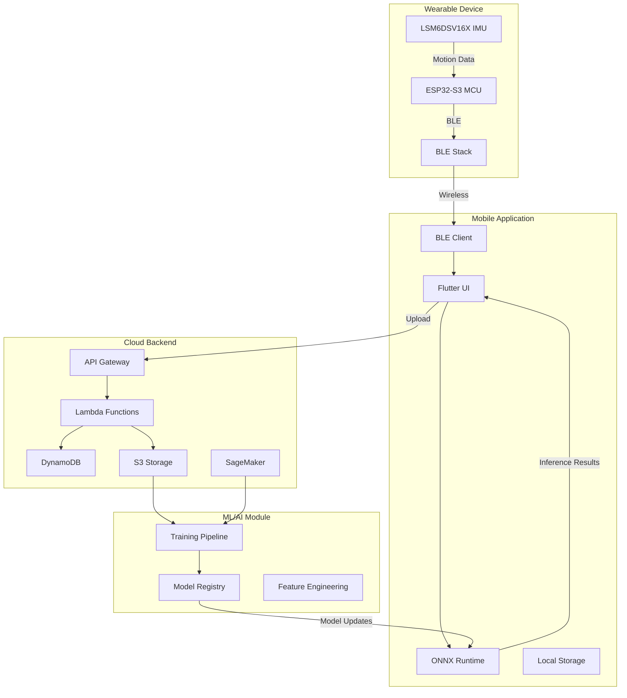

# Welcome to Movement Chain AI Documentation

## System Vision

Movement Chain AI is a comprehensive multimodal movement training system designed to provide real-time, intelligent feedback for athletic movements. Initially targeting golf swing analysis and workout form correction, the system combines cutting-edge wearable sensor technology with advanced machine learning to deliver immediate, actionable insights that help users improve their technique and performance.

### Core Capabilities

- **Real-time Movement Analysis**: Instant feedback on movement patterns with <100ms latency
- **Multimodal AI Processing**: Combines IMU sensor data with video and audio inputs
- **Personalized Training**: Adaptive ML models that learn from individual movement patterns
- **Cross-Platform Experience**: Seamless mobile app integration on iOS and Android
- **Scalable Architecture**: Cloud-native design supporting thousands of concurrent users

---

## System Architecture Overview

Movement Chain AI follows a **4-module architecture** designed for scalability, maintainability, and performance:

### Module Breakdown

#### 1. Wearable Device Module
**Purpose**: Capture high-frequency motion data with minimal latency

- **MCU**: ESP32-S3 (dual-core, BLE 5.0)
- **IMU Sensor**: LSM6DSV16X (6-axis, up to 8kHz sampling)
- **Communication**: Bluetooth Low Energy 5.0
- **Battery Life**: 8+ hours continuous use
- **Form Factor**: Wrist-worn device (<50g)

[View Hardware Decision Records →](decisions/0002-lsm6dsv16x-imu.md)

#### 2. Mobile Application Module
**Purpose**: Provide intuitive user interface and edge AI inference

- **Framework**: Flutter (cross-platform iOS/Android)
- **ML Runtime**: ONNX Runtime Mobile
- **Features**: Real-time visualization, offline mode, workout tracking
- **Inference**: On-device ML for <100ms feedback latency
- **Storage**: Local SQLite + cloud sync

[View Mobile Framework Decision →](decisions/0003-flutter-mobile.md)

#### 3. Cloud Backend Module
**Purpose**: Scalable data processing and long-term storage

- **Architecture**: AWS Serverless (API Gateway + Lambda + DynamoDB)
- **Storage**: S3 for raw sensor data, DynamoDB for metadata
- **API**: REST + GraphQL for flexible data access
- **Auth**: Cognito for user management
- **Scale**: Auto-scaling to handle 10k+ concurrent users

[View Integration Patterns →](architecture/hld/03-integration-patterns.md)

#### 4. ML/AI Module
**Purpose**: Train and optimize movement analysis models

- **Training**: AWS SageMaker for distributed training
- **Framework**: PyTorch → ONNX export pipeline
- **Models**: Transformer-based sequence models + CNNs
- **Registry**: Centralized model versioning and A/B testing
- **Pipeline**: Automated retraining on new labeled data

[View ONNX Runtime Decision →](decisions/0006-onnx-runtime-deployment.md)

---

## Navigation Guide

### For System Architects
Start with the **Architecture** section to understand the overall system design:

- [System Overview](architecture/hld/01-system-overview.md) - Component interactions and responsibilities
- [Data Flow](architecture/hld/02-data-flow.md) - How data moves through the system
- [Performance Targets](architecture/hld/04-performance-targets.md) - SLAs and scalability goals

### For Developers
Review the **Decisions** section to understand key technical choices:

- [ADR-0004: 4-Module Architecture](decisions/0004-simplified-4-module-architecture.md) - Why we chose this structure
- [ADR-0001: Multi-Repo Structure](decisions/0001-multi-repo-structure.md) - Code organization strategy
- [ADR-0006: ONNX Runtime](decisions/0006-onnx-runtime-deployment.md) - ML deployment approach

### For Hardware Engineers
Explore the **Resources** section for detailed comparisons:

- [Hardware Comparison](resources/hardware-comparison.md) - MCU and IMU evaluation
- [Performance Benchmarks](resources/hardware-comparison.md#performance-metrics) - Real-world testing results

### For ML Engineers
Focus on ML-specific architecture and decisions:

- [ML/AI Module Design](architecture/hld/01-system-overview.md#mlai-module) - Training and inference pipeline
- [Model Deployment Strategy](decisions/0006-onnx-runtime-deployment.md) - Why ONNX Runtime

---

## Quick Links

### Key Architecture Documents
- [System Overview](architecture/hld/01-system-overview.md)
- [Data Flow Diagrams](architecture/hld/02-data-flow.md)
- [Integration Patterns](architecture/hld/03-integration-patterns.md)

### Critical Design Decisions
- [4-Module Architecture Rationale](decisions/0004-simplified-4-module-architecture.md)
- [ESP32-S3 Selection](decisions/0005-esp32-s3-microcontroller.md)
- [Flutter Mobile Framework](decisions/0003-flutter-mobile.md)

### Technical Comparisons
- [MCU Comparison Matrix](resources/hardware-comparison.md)
- [ML Framework Analysis](resources/ml-frameworks-comparison.md)
- [Mobile Framework Evaluation](resources/mobile-frameworks-comparison.md)

---

## Project Status

!!! info "Documentation Status"
    This documentation is actively maintained and reflects the current system architecture as of December 2025.

**Current Phase**: Architecture Design & Documentation

**Completed Milestones**:

- [x] High-level system architecture
- [x] Hardware component selection
- [x] Mobile framework evaluation
- [x] ML deployment strategy
- [x] Cloud infrastructure design

**In Progress**:

- [ ] Detailed API specifications
- [ ] Security and compliance documentation
- [ ] Deployment runbooks
- [ ] Performance benchmarking

**Upcoming**:

- [ ] Developer onboarding guides
- [ ] API reference documentation
- [ ] Troubleshooting guides

---

## Contributing

We welcome contributions to improve this documentation. See the repository README for contribution guidelines.

**Quick contribution checklist**:

1. Fork the repository
2. Create a feature branch
3. Test locally with `mkdocs serve`
4. Submit a pull request with clear description

---

## Support

If you have questions about the architecture or documentation:

- Review existing [Architectural Decision Records](decisions/index.md)
- Check the [FAQ section](resources/hardware-comparison.md) (coming soon)

---

**Movement Chain AI** | [GitHub](https://github.com/movement-chain-ai)

*Building the future of intelligent movement training*

