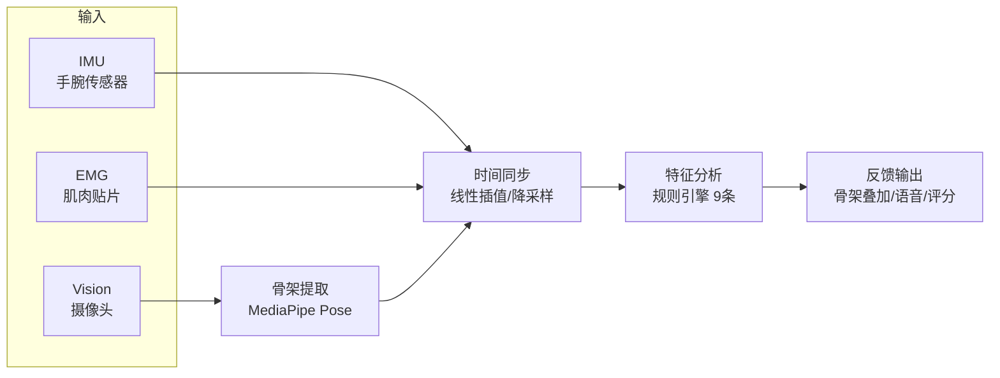
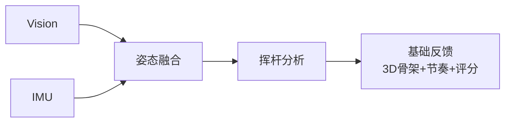
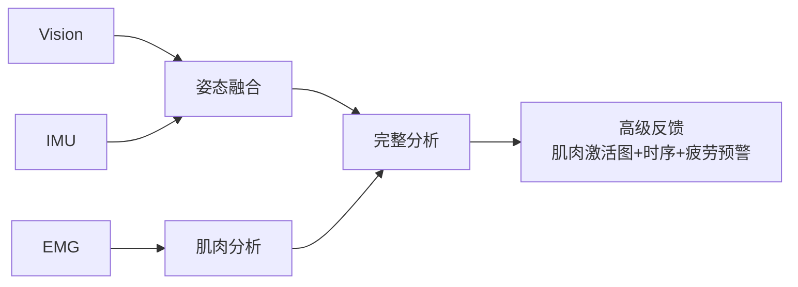

# 系统设计 System Design

> **文档目的**: 定义 MVP 核心管道的完整数据流与技术实现
>
> **阅读对象**: 算法工程师、产品经理、技术投资人
>
> **核心原则**: AI 服务于产品目标，帮助用户改善高尔夫挥杆

---

## 文档阅读指南

!!! tip "构建 MVP 的阅读顺序"

    按以下顺序阅读，获取完整的 MVP 构建知识:

    | 顺序 | 文档 | 内容 |
    |:----:|------|------|
    | 1️⃣ | **本文档** (system-design.md) | 架构总览、数据流、规则引擎 |
    | 2️⃣ | [8阶段挥杆分解](../design/specs/swing-phases.md) | 挥杆相位检测方法与代码 |
    | 3️⃣ | [实时反馈规范](../design/specs/real-time-feedback.md) | 三种反馈模式与延迟要求 |
    | 4️⃣ | [ML 基础入门](../design/guides/ml-basics.md) | 什么需要 ML、什么用物理公式 |
    | 5️⃣ | [SDK 选型指南](../design/guides/sdk-selection.md) | 所有库的安装命令、Stars |
    | 6️⃣ | MVP 原型代码 (见移动开发文档) | 无需硬件即可测试，Mock 数据 |

    **快速参考**:

    - [ADR 决策记录](../design/decisions/index.md) - 所有 ADR 一页速查
    - [挥杆对比策略](../design/specs/swing-comparison.md) - 如何对比两次挥杆
    - [生物力学基准值](../reference/foundations/biomechanics-benchmarks.md) - 阈值来源

---

## MVP 核心管道



---

## 第一层: 数据采集

### 三模态传感器: 互补而非冗余

```text
┌─────────────────────────────────────────────────────────────────────────────┐
│                    三模态传感器架构                                            │
├─────────────────────────────────────────────────────────────────────────────┤
│                                                                              │
│   ┌───────────────────┐  ┌───────────────────┐  ┌───────────────────┐      │
│   │    Vision 视觉     │  │     IMU 惯性      │  │     EMG 肌电      │      │
│   │    (摄像头)        │  │    (手腕传感器)    │  │    (肌肉贴片)     │      │
│   ├───────────────────┤  ├───────────────────┤  ├───────────────────┤      │
│   │ 采样率: 30 fps     │  │ 采样率: 100-200Hz │  │ 采样率: 200-1000Hz│      │
│   │ 延迟: ~33ms       │  │ 延迟: <10ms       │  │ 延迟: <5ms        │      │
│   ├───────────────────┤  ├───────────────────┤  ├───────────────────┤      │
│   │ 测量内容:          │  │ 测量内容:          │  │ 测量内容:          │      │
│   │ • 全身姿态         │  │ • 手腕角速度       │  │ • 肌肉激活程度     │      │
│   │ • 33个关节点       │  │ • 加速度           │  │ • 发力时序        │      │
│   │ • 挥杆平面         │  │ • 精确击球时机     │  │ • 疲劳状态        │      │
│   ├───────────────────┤  ├───────────────────┤  ├───────────────────┤      │
│   │ 优势:             │  │ 优势:             │  │ 优势:             │      │
│   │ ✅ 全身可见        │  │ ✅ 高时间精度      │  │ ✅ 内部状态可见    │      │
│   │ ✅ 用户无感        │  │ ✅ 不受光照影响    │  │ ✅ 独特差异化      │      │
│   ├───────────────────┤  ├───────────────────┤  ├───────────────────┤      │
│   │ 劣势:             │  │ 劣势:             │  │ 劣势:             │      │
│   │ ❌ 遮挡问题        │  │ ❌ 单点数据        │  │ ❌ 需要接触皮肤    │      │
│   │ ❌ 帧率限制        │  │ ❌ 累积漂移        │  │ ❌ 信噪比挑战      │      │
│   └───────────────────┘  └───────────────────┘  └───────────────────┘      │
│                                                                              │
│   🔑 关键洞察: 单模态准确率 ~70-85%，三模态融合后可达 95%+                      │
│                                                                              │
└─────────────────────────────────────────────────────────────────────────────┘
```

### 能力矩阵对比 (Capability Matrix)

| 能力 | Vision (MediaPipe) | IMU | EMG |
|-----|:------------------:|:---:|:---:|
| **角速度测量** (°/s) | ❌ | ✅ | ❌ |
| **加速度测量** (m/s²) | ❌ | ✅ | ❌ |
| **高速瞬间捕捉** (impact) | ❌ 帧率限制 | ✅ 1000Hz+ | ✅ |
| **遮挡情况稳定性** | ❌ | ✅ | ✅ |
| **时间精度** | ⚠️ ~33ms | ✅ <10ms | ✅ <5ms |
| **全身姿态可见** | ✅ 33关节点 | ❌ 单点 | ❌ 局部肌群 |
| **肌肉激活检测** | ❌ | ❌ | ✅ |
| **发力时序分析** | ❌ | ⚠️ 间接推断 | ✅ |
| **无需穿戴** | ✅ | ❌ | ❌ |
| **不受光照影响** | ❌ | ✅ | ✅ |

### 技术选型

| 模态 | 硬件/SDK | 状态 | 决策文档 |
|-----|---------|------|---------|
| Vision | 手机摄像头 + MediaPipe | ✅ 可用 | - |
| IMU | LSM6DSV16X | ✅ 选型完成 | [ADR-0002](../design/decisions/0002-lsm6dsv16x-imu.md) |
| EMG | NeuroKit2 处理 | 🔧 Phase 2 | - |

> **全身传感器部署**: MediaPipe 33 关键点分组、IMU 多位置放置策略、EMG 肌群选择及力量链设计见 [挥杆对比策略 - 全身数据采集](../design/specs/swing-comparison.md#全身数据采集-full-body-data-collection)

---

## 第二层: 骨架提取 (Pose Estimation)

### MediaPipe Pose

MediaPipe Pose 输出 33 个关节点，3行代码即可完成骨架提取:

```python
import mediapipe as mp
pose = mp.solutions.pose.Pose()
results = pose.process(rgb_frame)
landmarks = results.pose_landmarks.landmark  # 33个点
```

**输出格式**:

```json
{
  "frame_id": 1,
  "timestamp_ms": 33.3,
  "landmarks": [
    {"id": 0, "name": "nose", "x": 0.512, "y": 0.285, "z": 0.001, "visibility": 0.99},
    {"id": 11, "name": "left_shoulder", "x": 0.421, "y": 0.412, "z": -0.052, "visibility": 0.97}
  ]
}
```

### 模型选择

| 状态 | 模型 | 准确率 | 速度 | 部署难度 |
|-----|------|-------|------|---------|
| ✅ **当前方案** | MediaPipe Pose | ~70% AP | 30fps+ 实时 | `pip install mediapipe` |
| 🔄 备选 | RTMPose | ~76% AP | 25fps | 需配置 mmpose |
| 🔄 备选 | ViTPose++ | 81.1% AP (SOTA) | 需GPU | 服务器部署 |

> MediaPipe 精度足够 MVP 验证。如用户反馈"精度不够"，再评估升级。

---

## 第三层: 时间同步

### 为什么时间同步至关重要?

三种传感器采样率不同。如果不对齐，"击球瞬间"在三种数据中指向不同的时间点，导致分析错误。

**具体问题示例:**

```text
假设击球发生在 t=0.500秒:

Vision:  帧15 = 0.500秒 (正好)
IMU:     样本50 = 0.500秒 (正好)
EMG:     样本100 = 0.500秒 (正好)

如果不同步，系统可能认为:
- "击球时肩膀角度是95°" (来自Vision帧15)
- "击球时角速度是1200°/s" (来自IMU样本48，实际是0.480秒)
- "击球时前臂激活72%" (来自EMG样本105，实际是0.525秒)

三个数据描述的不是同一瞬间！分析结论会有偏差。
```

### 同步策略

```text
原始数据流:
Vision:  |---F1---F2---F3---F4---F5---|  (30 fps, 每33ms)
IMU:     |*-*-*-*-*-*-*-*-*-*-*-*-*-*|  (100 Hz, 每10ms)
EMG:     |********************...*****|  (200 Hz, 每5ms)

同步后 (对齐到 Vision 时间轴):
Vision:     F1    F2    F3    F4    F5   (原生帧)
IMU:        I1    I2    I3    I4    I5   (线性插值)
EMG:        E1    E2    E3    E4    E5   (降采样+RMS包络)
```

### 实现代码

```python
import numpy as np

def sync_to_vision_timeline(vision_timestamps, imu_data, emg_data):
    """将 IMU 和 EMG 数据对齐到 Vision 时间轴"""

    # IMU 线性插值到 Vision 时间点
    imu_synced = {
        'accel_x': np.interp(vision_timestamps, imu_data['timestamps'], imu_data['accel_x']),
        'accel_y': np.interp(vision_timestamps, imu_data['timestamps'], imu_data['accel_y']),
        'gyro_z': np.interp(vision_timestamps, imu_data['timestamps'], imu_data['gyro_z']),
    }

    # EMG 降采样 + RMS 包络
    emg_synced = {}
    for channel_name, channel_data in emg_data['channels'].items():
        emg_synced[channel_name] = np.interp(
            vision_timestamps,
            emg_data['timestamps'],
            channel_data['rms_envelope']
        )

    return imu_synced, emg_synced
```

---

## 第四层: 特征提取

### Vision 特征

| 特征 | 计算方法 | 阈值 |
|-----|---------|-----|
| 肩膀旋转 | atan2(右肩z - 左肩z, 右肩x - 左肩x) | >85° |
| 髋部旋转 | atan2(右髋z - 左髋z, 右髋x - 左髋x) | >40° |
| X-因子 | 肩膀旋转 - 髋部旋转 | >35° |
| 左肘角度 | 三点夹角(肩-肘-腕) | >160° |

```python
import math

def extract_vision_features(landmarks):
    """从 MediaPipe 骨架提取高尔夫相关特征"""
    LEFT_SHOULDER, RIGHT_SHOULDER = 11, 12
    LEFT_HIP, RIGHT_HIP = 23, 24

    # 肩膀旋转角度
    shoulder_angle = math.degrees(math.atan2(
        landmarks[RIGHT_SHOULDER].z - landmarks[LEFT_SHOULDER].z,
        landmarks[RIGHT_SHOULDER].x - landmarks[LEFT_SHOULDER].x
    ))

    # 髋部旋转角度
    hip_angle = math.degrees(math.atan2(
        landmarks[RIGHT_HIP].z - landmarks[LEFT_HIP].z,
        landmarks[RIGHT_HIP].x - landmarks[LEFT_HIP].x
    ))

    # X-因子 (肩-髋分离角)
    x_factor = abs(shoulder_angle) - abs(hip_angle)

    return {
        'shoulder_rotation': abs(shoulder_angle),
        'hip_rotation': abs(hip_angle),
        'x_factor': x_factor
    }
```

### IMU 特征

| 特征 | 计算方法 | 理想值 |
|-----|---------|-------|
| 峰值角速度 | max(abs(gyro_z)) | >1200°/s |
| 节奏比 | 上杆时间 / 下杆时间 | 3:1 |
| 上杆顶点 | gyro_z 由负转正的点 | - |

```python
def extract_imu_features(imu_data):
    """从 IMU 数据提取挥杆节奏特征"""
    gyro_z = imu_data['gyro_z']
    timestamps = imu_data['timestamps']

    # 峰值角速度
    peak_velocity = np.max(np.abs(gyro_z))
    peak_idx = np.argmax(np.abs(gyro_z))
    peak_time = timestamps[peak_idx]

    # 上杆顶点 (角速度由负转正)
    zero_crossings = np.where(np.diff(np.sign(gyro_z)))[0]
    if len(zero_crossings) > 0:
        top_time = timestamps[zero_crossings[0]]
        backswing_duration = top_time - timestamps[0]
        downswing_duration = peak_time - top_time
        tempo_ratio = backswing_duration / downswing_duration if downswing_duration > 0 else 0
    else:
        tempo_ratio = 0

    return {
        'peak_angular_velocity': peak_velocity,
        'tempo_ratio': tempo_ratio,
        'peak_time': peak_time
    }
```

### EMG 特征 (差异化)

| 特征 | 计算方法 | 阈值 |
|-----|---------|-----|
| 核心激活 | 下杆阶段平均RMS | >50% |
| 前臂激活 | 下杆阶段平均RMS | <60% |
| 激活时序 | 核心onset < 前臂onset | 正确 |

```python
def extract_emg_features(emg_data, swing_phases):
    """从 EMG 数据提取肌肉激活特征"""
    forearm = emg_data['forearm_flexor']
    core = emg_data['core_rectus']

    downswing_start = swing_phases['downswing_start']
    impact = swing_phases['impact']

    # 下杆阶段平均激活
    forearm_activation = np.mean(forearm[downswing_start:impact])
    core_activation = np.mean(core[downswing_start:impact])

    # 激活时序 (核心应先于前臂)
    forearm_onset = np.argmax(forearm > np.max(forearm) * 0.5)
    core_onset = np.argmax(core > np.max(core) * 0.5)
    activation_sequence_correct = core_onset < forearm_onset

    return {
        'forearm_activation': forearm_activation,
        'core_activation': core_activation,
        'activation_sequence_correct': activation_sequence_correct
    }
```

---

## 第五层: 规则引擎

### 规则引擎 vs ML 分类器

| 项目 | 规则引擎 (MVP) ✅ | ML 分类器 (Phase 2-3) |
|-----|------------------|---------------------|
| 实现方式 | IF-THEN 硬编码 | 训练数据 → 模型 → 预测 |
| 优点 | 快速开发、无需数据、完全可解释 | 更准确、可处理边界情况 |
| 缺点 | 阈值需手动调整、无法个性化 | 需500-1000标注样本 |
| 工作量 | 1-2 周 | 需数据收集+训练 |

**推荐路径**: MVP 用规则引擎验证产品，同时收集数据，Phase 2 训练 ML 分类器

### 9 条核心规则

| # | 规则 | 条件 | 扣分 | 来源 |
|---|-----|------|-----|------|
| 1 | 转肩不足 | shoulder < 85° | -15 | Vision |
| 2 | 髋部受限 | hip < 40° | -10 | Vision |
| 3 | X因子过小 | x_factor < 35° | -10 | Vision |
| 4 | 左肘弯曲 | elbow < 160° | -10 | Vision |
| 5 | 节奏过快 | tempo < 2.5 | -10 | IMU |
| 6 | 节奏过慢 | tempo > 4.0 | -5 | IMU |
| 7 | 速度不足 | peak < 800°/s | -5 | IMU |
| **8** | **核心代偿** | core<50% AND forearm>60% | **-20** | **EMG** |
| **9** | **时序错误** | forearm先于core | **-15** | **EMG** |

> **规则 8、9 是 EMG 独特价值，竞品无法提供**

### 实现代码

```python
def analyze_swing(vision, imu, emg):
    """基于规则引擎分析挥杆"""
    score = 100
    problems = []

    # Vision 规则
    if vision['shoulder_rotation'] < 85:
        score -= 15
        problems.append("转肩不足")

    if vision['hip_rotation'] < 40:
        score -= 10
        problems.append("髋部受限")

    if vision['x_factor'] < 35:
        score -= 10
        problems.append("X因子过小")

    # IMU 规则
    if imu['tempo_ratio'] < 2.5:
        score -= 10
        problems.append("节奏过快")
    elif imu['tempo_ratio'] > 4.0:
        score -= 5
        problems.append("节奏过慢")

    if imu['peak_angular_velocity'] < 800:
        score -= 5
        problems.append("速度不足")

    # EMG 规则 (差异化)
    if emg['core_activation'] < 50 and emg['forearm_activation'] > 60:
        score -= 20
        problems.append("核心代偿，手臂发力过多")

    if not emg['activation_sequence_correct']:
        score -= 15
        problems.append("发力时序错误")

    return {'score': max(0, score), 'problems': problems}
```

---

## 第六层: 反馈输出

### 第三人称 vs 第一人称反馈

| 项目 | 第三人称骨架叠加 (MVP) | 第一人称 AR 指导 (未来) |
|-----|------------------------|----------------------|
| **视角** | 外部相机看用户 | 用户自己的视角 (AR眼镜) |
| **目的** | 分析 — "我做了什么" | 指导 — "我该怎么做" |
| **显示内容** | 骨架线条叠加在视频上 | 幽灵路径、目标区域、偏差箭头 |
| **反馈时机** | 事后回放分析 | 实时提示纠正 |
| **技术复杂度** | ⭐⭐ | ⭐⭐⭐⭐⭐ |
| **阶段** | MVP | Phase 4 |

### MVP 输出模式

| 模式 | 描述 | 延迟要求 | 阶段 |
|-----|------|---------|-----|
| 骨架叠加 | 第三人称视角，骨架线条叠加视频 | <100ms | MVP |
| 评分显示 | 0-100分 + 问题列表 | <500ms | MVP |
| 语音反馈 | TTS 播报主要问题 | <500ms | MVP |
| Ghost对比 | 理想挥杆半透明叠加 | - | Phase 2 |

### 视觉反馈界面

```text
┌───────────────────────────────────────────────────────────┐
│                                                            │
│         ○ ← 头部追踪                                       │
│        /│\                                                 │
│       / │ \ ← 肩线角度: 95° ✅                             │
│      🟢 │ 🟢 ← 绿色=正确位置                               │
│         │                                                  │
│        ┌┴┐ ← 髋部旋转: 45°                                 │
│       /   \                                                │
│      🟢   🟢                                               │
│                                                            │
│  [摄像头实时画面作为背景]                                   │
│                                                            │
│  ┌──────────────────────────────────────────────────────┐ │
│  │ 速度: 95mph │ 节奏: 3:1 │ 评分: 82 │ 🔴 核心不足检测 │ │
│  └──────────────────────────────────────────────────────┘ │
└───────────────────────────────────────────────────────────┘
```

### 语音反馈触发时机

| 场景 | 语音内容示例 | 延迟要求 |
|-----|-------------|---------|
| 挥杆完成 | "82分，节奏很好" | <500ms |
| 检测到问题 | "下杆时注意从内侧下杆" | <300ms |
| 连续改善 | "进步了！比上次快5英里" | <1s |
| EMG异常 | "核心发力不足，注意收紧腹部" | <500ms |
| 疲劳预警 | "已练习30分钟，肌肉疲劳，建议休息" | 非实时 |

### Ghost 理想挥杆

Ghost 是用户最想要的功能之一: 生成一个"理想的灰色图形"，让用户跟着轨迹模仿。

**Ghost 数据来源**:

| 方案 | 描述 | 推荐阶段 |
|-----|------|---------|
| 职业球员缩放 | 从 GolfDB 提取职业挥杆骨架，按用户身高比例缩放 | MVP |
| 用户最佳挥杆 | 系统筛选用户评分最高的挥杆作为个人模板 | Phase 2 |
| 教练定制 | 教练演示一次，系统记录作为学员目标 | B2B |

> **详细对比策略**: 四种参考模型方法 (职业参考、个人最佳、统计参考、神经网络嵌入) 及 DTW 算法见 [挥杆对比策略](../design/specs/swing-comparison.md)

---

## SDK/API 可用性总览

| 组件 | 工具 | 状态 |
|-----|------|-----|
| 姿态估计 | MediaPipe Pose | ✅ 开箱即用 |
| EMG处理 | NeuroKit2 | ✅ 开箱即用 |
| 时间同步 | numpy.interp() | ✅ 标准库 |
| 特征提取 | 自定义 Python | 🛠️ 需开发 |
| 规则引擎 | 自定义 Python | 🛠️ 需开发 |
| 可视化 | OpenCV | ✅ 现成 |
| 语音反馈 | flutter_tts | ✅ 现成 |

**图例:** ✅ 开箱即用 | 🛠️ 需开发

> **详细选型**: 各 SDK/库的对比分析、升级路径、版本锁定见 [SDK/库选型指南](../design/guides/sdk-selection.md)

---

## AI 整合路线

```text
┌─────────────────────────────────────────────────────────────────────────────┐
│                         AI 整合路线图                                         │
├─────────────────────────────────────────────────────────────────────────────┤
│                                                                              │
│   Phase 1: MVP (1-2月)                          AI 占比: ~20%                │
│   ┌───────────────────────────────────────────────────────────────────────┐ │
│   │ • 姿态估计: MediaPipe Pose (开箱即用)                                  │ │
│   │ • 分析引擎: 规则引擎 IF-THEN (自己写)                                  │ │
│   │ • 融合方式: Early Fusion 特征拼接 (numpy)                              │ │
│   │ • 输出: 骨架叠加 + 评分 + 基础语音 (OpenCV + TTS)                      │ │
│   │                                                                        │ │
│   │ 验证点: MediaPipe 能否稳定提取高尔夫骨架？规则反馈是否有意义？           │ │
│   └───────────────────────────────────────────────────────────────────────┘ │
│                                      ↓                                      │
│   Phase 2: AI 增强 (3-6月)                      AI 占比: ~50%                │
│   ┌───────────────────────────────────────────────────────────────────────┐ │
│   │ • LLM 教练: GPT-4/Claude API 个性化反馈 (~$0.01/次)                    │ │
│   │ • Ghost: 职业骨架缩放 + 用户最佳挥杆                                   │ │
│   │ • 疲劳检测: EMG 统计分析 (scipy)                                      │ │
│   │ • 数据收集: 为 Phase 3 准备标注数据                                    │ │
│   └───────────────────────────────────────────────────────────────────────┘ │
│                                      ↓                                      │
│   Phase 3: 深度 AI (6-12月)                     AI 占比: ~80%                │
│   ┌───────────────────────────────────────────────────────────────────────┐ │
│   │ • 动作分类器: 训练自定义 CNN/Transformer (pytorch)                     │ │
│   │ • 姿态升级: RTMPose/ViTPose (mmpose)                                  │ │
│   │ • 异常检测: LSTM Autoencoder 时序分析                                 │ │
│   │                                                                        │ │
│   │ 数据需求: 500-1000 个教练标注的挥杆样本                                 │ │
│   └───────────────────────────────────────────────────────────────────────┘ │
│                                                                              │
└─────────────────────────────────────────────────────────────────────────────┘
```

---

## 融合策略

### MVP: 并行开发，渐进融合

#### 阶段 A: Vision + IMU (可独立发布)



#### 阶段 B: 加入 EMG (差异化完成)



### 融合策略选择

| 方法 | 描述 | 推荐阶段 |
|-----|------|---------|
| Early Fusion | 原始特征拼接成一个向量，单一模型处理 | MVP ✅ |
| Late Fusion | 各模态独立分类，最后投票/加权 | Phase 2 |
| Hybrid Fusion | 部分共享+部分独立，Transformer Cross-Attention | Phase 3 |

---

## 相关文档

- [ADR决策记录](../design/decisions/index.md) - 关键ADR概览
- [术语表](../reference/foundations/biomechanics-glossary.md) - IMU、EMG 等术语定义
- 代码示例将在 ML 仓库中提供

---

**最后更新**: 2025年12月12日
