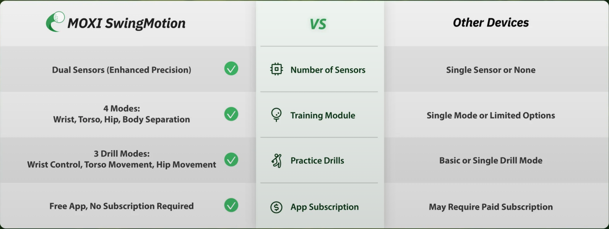

# IMU 方案竞品分析

基于惯性测量单元 (IMU) 的高尔夫挥杆分析产品竞品研究。

---

## 市场概况

!!! info "IMU 方案是主流"
    市场上 70%+ 的高尔夫挥杆分析产品采用纯 IMU 方案

### 优势

- ✅ 便携、轻量
- ✅ 实时反馈
- ✅ 无需摄像头
- ✅ 成本可控

### 劣势

- ❌ 无法测量肌肉激活
- ❌ 位置累积漂移
- ❌ 无法获取身体姿态全貌

---

## 主要竞品

### SwingMotion ⭐⭐⭐⭐

!!! success "消费级代表"

| 参数 | 规格 |
|-----|------|
| **价格** | $358 |
| **传感器** | 9 轴 IMU |
| **佩戴位置** | 手套夹持 |
| **数据** | 挥杆速度、轨迹、节奏 |
| **App** | iOS / Android |

**核心功能**:

- 挥杆速度测量
- 挥杆平面分析
- 节奏和节拍
- 历史对比

**官网**: [swingmotion.app](https://swingmotion.app)

**技术分析**:

```text
传感器: 可能使用 ICM-20948 或类似 9 轴 IMU
采样率: ~100 Hz
BLE: 4.2/5.0
算法: 四元数融合 + 挥杆检测
```

**用户评价**:

- 优点: 设置简单、数据直观
- 缺点: 偶尔漂移、手腕角度精度有限

---

### MOXI (Swing Motion 多传感器版) ⭐⭐⭐⭐

!!! info "SwingMotion 的专业升级版"
    双 IMU 传感器系统，提供躯干运动分析


| 参数 | 规格 |
|-----|------|
| **价格** | $499+ |
| **传感器** | 2 × 9 轴 IMU |
| **佩戴位置** | 胸部背心 + 腰部绑带 |
| **数据** | 躯干旋转、侧弯、前倾 |
| **App** | iOS / Android |


**核心功能**:

- 躯干旋转 (Rotation) 测量
- 侧弯 (Side Bend) 分析
- 前倾 (Forward Bend) 监测
- AI Tips 智能建议
- 挥杆阶段分析 (Address / Top / Impact)

**官网**: [swingmotion.app/moxi](https://swingmotion.app)

**技术分析**:

```text
传感器: 2 × 9 轴 IMU
同步: 蓝牙无线同步
佩戴: 背心式设计，舒适稳定
算法: 躯干运动学解算
```

**竞争优势**:

- 比单 IMU 方案更全面的躯干数据
- 背心设计佩戴稳定
- 价格比 K-Motion 低很多

**MOXI vs 其他设备对比**:



| 对比维度 | MOXI | 其他设备 |
|---------|------|---------|
| **传感器数量** | 双传感器 (Enhanced Precision) | 单传感器或无 |
| **训练模块** | 4 种模式: Wrist, Torso, Hip, Body Separation | 单一模式或有限选项 |
| **练习模式** | 3 种: Wrist Control, Torso Movement, Hip Movement | 基础或单一模式 |
| **App 订阅** | 免费，无需订阅 | 可能需要付费订阅 |

**我们的差异**:

- MOXI 无法测量肌肉激活
- 无 EMG 数据，无法分析发力时序
- 无视觉数据，无法获取全身姿态

---

### HackMotion ⭐⭐⭐⭐⭐

!!! info "手腕角度专家"
    最专注于手腕运动学分析

| 产品 | 价格 | 特点 |
|-----|------|-----|
| **HackMotion Core** | $345 | 基础版 |
| **HackMotion Plus** | $445 | + 教练功能 |
| **HackMotion Pro** | $995 | + 专业数据 |

**核心指标**:

| 指标 | 说明 |
|-----|------|
| **腕屈/腕伸 (Flexion/Extension)** | 手腕上下弯曲 |
| **桡偏/尺偏 (Radial/Ulnar)** | 手腕左右偏转 |
| **旋前/旋后 (Pronation/Supination)** | 前臂旋转 |

**官网**: [hackmotion.com](https://hackmotion.com)

**技术分析**:

```text
传感器: 高精度 9 轴 IMU (可能 LSM9DS1 或类似)
佩戴: 手背贴合设计
算法: 专注手腕运动学解算
精度: 声称 ±1° 手腕角度
```

**竞争优势**:

- 手腕角度测量最专业
- PGA 教练广泛使用
- 丰富的教学视频

**我们的差异**:

- HackMotion 无法测量肌肉力量
- 无法了解"如何"控制手腕
- EMG 可提供力量时序信息

---

### deWiz ⭐⭐⭐⭐

| 参数 | 规格 |
|-----|------|
| **价格** | $499 |
| **传感器** | 双 IMU (手 + 杆) |
| **特色** | 长度差分析 |

**核心指标**:

| 指标 | 说明 |
|-----|------|
| **Length of Swing** | 挥杆长度 |
| **Transition** | 过渡时机 |
| **Tempo** | 节奏比例 |

**官网**: [dewizgolf.com](https://dewizgolf.com)

**竞争优势**:

- 双传感器协同
- 独特的"长度"分析视角

---

### K-Motion ⭐⭐⭐

!!! warning "专业级 - 高价"

| 参数 | 规格 |
|-----|------|
| **价格** | $3,000+ |
| **传感器** | 4 个 IMU (全身) |
| **佩戴位置** | 骨盆、胸部、手臂 |
| **定位** | 专业教练/球员 |

**核心功能**:

- 全身运动链分析
- 3D 运动可视化
- 力量传递分析
- 实时生物反馈

**官网**: [k-motion.com](https://k-motion.com)

**技术分析**:

```text
传感器: 4 × 9 轴 IMU
同步: 无线同步
软件: 专业分析软件
目标: PGA 教练、康复专家
```

**竞争优势**:

- 最全面的运动链数据
- 专业级精度
- 深度定制服务

**劣势**:

- 价格过高
- 设置复杂
- 需要专业知识

---

## 技术对比

### 传感器配置

| 产品 | IMU 数量 | 位置 | 同步 |
|-----|---------|------|-----|
| SwingMotion | 1 | 手套 | - |
| HackMotion | 1 | 手背 | - |
| deWiz | 2 | 手 + 杆 | 有线/无线 |
| K-Motion | 4 | 全身 | 无线 |
| **我们** | 1-2 | 手/臂 | 无线 |

### 数据指标

| 指标 | SwingMotion | HackMotion | deWiz | K-Motion | **我们** |
|-----|-------------|------------|-------|----------|---------|
| 挥杆速度 | ✅ | ✅ | ✅ | ✅ | ✅ |
| 手腕角度 | ⭐ | ⭐⭐⭐ | ⭐ | ⭐⭐ | ⭐⭐ |
| 全身姿态 | ❌ | ❌ | ❌ | ⭐⭐ | ⭐⭐⭐ |
| 肌肉激活 | ❌ | ❌ | ❌ | ❌ | ⭐⭐⭐ |
| 节奏分析 | ⭐⭐ | ⭐⭐ | ⭐⭐⭐ | ⭐⭐ | ⭐⭐ |

### BOM 成本估算

| 产品 | 估计 BOM | 售价 | 毛利率 |
|-----|---------|------|-------|
| SwingMotion | $35-50 | $358 | ~85% |
| HackMotion | $40-60 | $345 | ~83% |
| deWiz | $60-80 | $499 | ~85% |
| K-Motion | $200-300 | $3,000 | ~90% |
| **我们** | $35-54 | $300-400 | ~85% |

---

## 用户评价汇总

### SwingMotion

> "Easy to use, data is clear. Sometimes drifts after many swings."
> — Amazon 4.2/5

### HackMotion

> "Best wrist tracker on the market. Really helped fix my flip."
> — Golf Digest

### deWiz

> "Unique approach with the length metric. Learning curve is steep."
> — MyGolfSpy

### K-Motion

> "Professional-grade but overkill for most amateurs. Price is prohibitive."
> — GolfWRX

---

## 我们的机会

### 差异化切入点

| 竞品缺失 | 我们的方案 |
|---------|-----------|
| **肌肉数据** | EMG 提供力量时序 |
| **身体姿态** | Vision 提供全身骨骼 |
| **数据融合** | 三模态协同分析 |
| **中国市场** | 本土化 + 中文 |

### 定价策略

| 对标 | 价格 | 我们的定位 |
|-----|------|-----------|
| SwingMotion | $358 | 同价位区间 |
| HackMotion | $345 | 功能更丰富 |
| K-Motion | $3,000 | 1/10 价格 |

---

## 相关资源

- [IMU 传感器技术](../../../components/imu/hardware.md)
- [IMU 供应商](../../../components/imu/hardware.md)
- [视觉方案竞品](vision-based.md)
- [多传感器方案](multi-sensor.md)

---

**最后更新**: 2025 年 12 月 7 日
