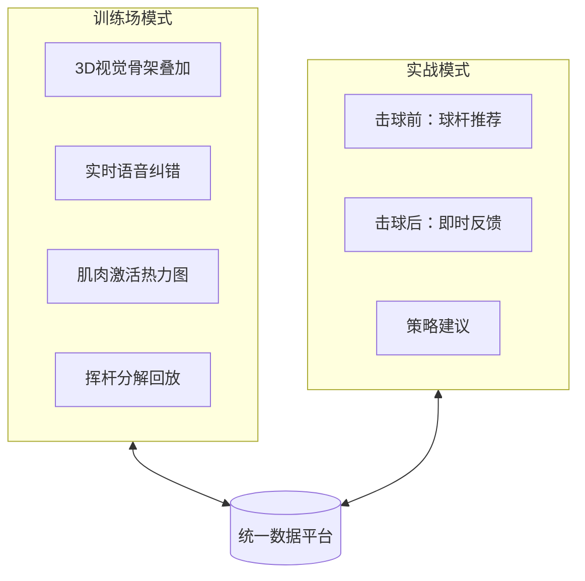
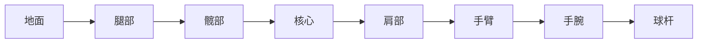
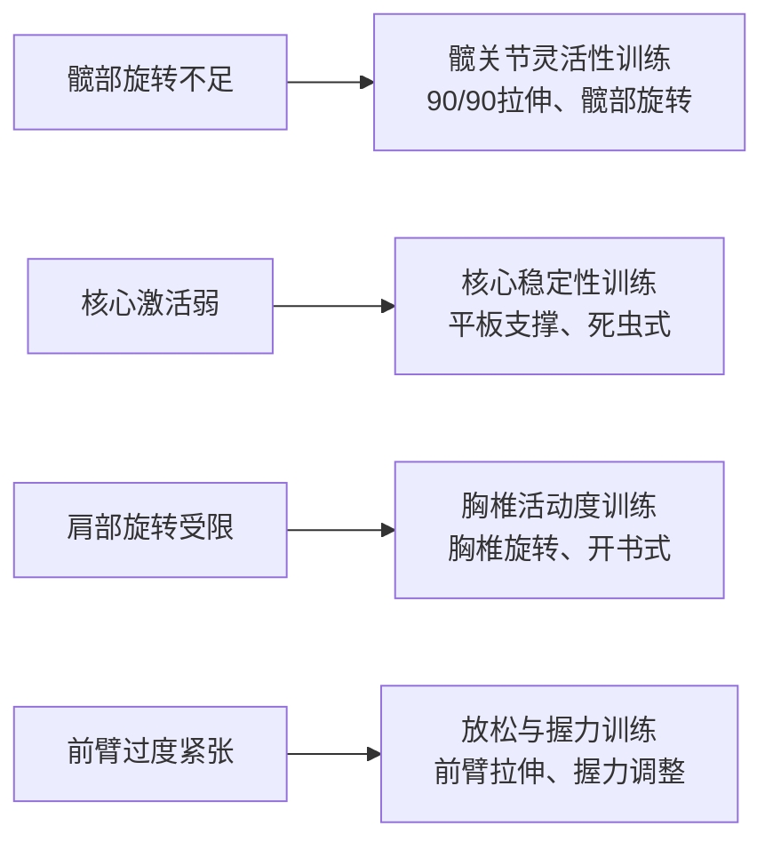
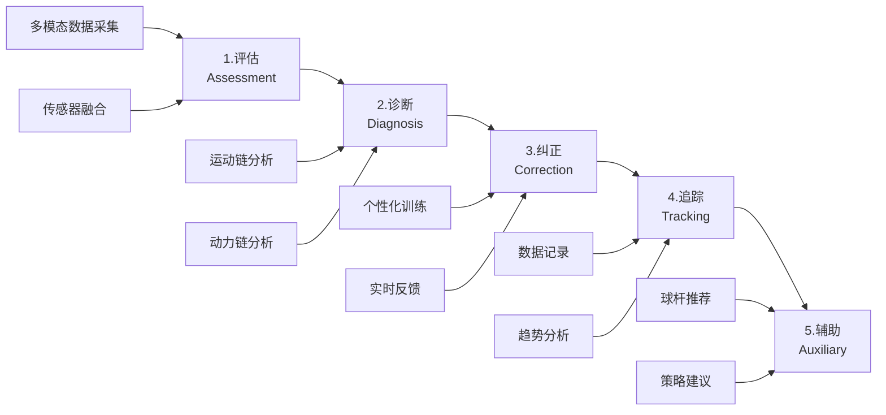

# 产品战略

> **核心命题**: 每一个产品决策都必须对应一个真实的市场痛点

---

## 决策导航

| # | 决策 | 解决痛点 |
|---|------|----------|
| 1 | [双模式架构](#决策1双模式架构) | 练习场和球场数据孤岛，无产品能打通两者 |
| 2 | [三模态传感融合](#决策2三模态传感融合) | 只知道"错了"，不知道"为什么错" |
| 3 | [多模态反馈系统](#决策3多模态反馈系统) | 实战时无法看手机，需要免视觉反馈 |
| 4 | [AI教练 + AI球童](#决策4ai教练--ai球童) | 50个数据点看不懂，需要可执行建议 |
| 5 | [场下训练理念](#决策5场下训练理念) | "转肩不够"但不知道如何改善身体条件 |
| 6 | [借用优先策略](#决策6借用优先策略) | MVP快速验证，3-4个月上线 |

---

## 决策1：双模式架构 {#决策1双模式架构}

!!! warning "市场缺口"
    没有产品能同时覆盖训练场和球场，更没有数据打通。

| 竞品 | 训练场 | 实战 | 数据打通 |
|------|--------|------|----------|
| HackMotion | ✅ | ❌ | - |
| Sportsbox AI | ✅ | ❌ | - |
| Arccos | ❌ | ✅ | - |
| **我们** | ✅ | ✅ | ✅ |

!!! quote "用户原话"
    "There's next to nothing that connects what happens in your personal hitting bay with what happens on the golf course." — MyGolfSpy

### 双模式对比

| 组件 | 训练场模式 | 实战模式 |
|------|------------|----------|
| 视觉系统 | 手机摄像头 + RTMPose | 可选 |
| IMU系统 | 全量数据采集 | 精简采集 |
| EMG系统 | 肌肉时序分析 | 疲劳监测 |
| 反馈延迟 | <500ms | <200ms |
| 电池优化 | 标准模式 | 低功耗模式 |

---

## 决策2：三模态传感融合 {#决策2三模态传感融合}

!!! tip "关键洞察"
    EMG 是市场上**唯一未被开发**的数据维度，0家竞品提供肌肉激活数据。

| 竞品 | IMU | EMG | Vision | 数据维度 |
|------|-----|-----|--------|----------|
| HackMotion | ✅ | ❌ | ❌ | 手腕角度 |
| SwingMotion | ✅ | ❌ | ❌ | 挥杆速度 |
| Sportsbox AI | ❌ | ❌ | ✅ | 全身姿态 |
| K-Motion | ✅ | ❌ | ❌ | 运动链 |
| **我们** | ✅ | ✅ | ✅ | **全维度** |

### 三模态价值

| 指标 | IMU (怎么动) | EMG (怎么用力) | Vision (动作形态) |
|------|--------------|----------------|-------------------|
| 速度/角度 | ⭐⭐⭐ | ⭐ | ⭐⭐ |
| 力量时序 | ⭐ | ⭐⭐⭐ | ❌ |
| 肌肉激活 | ❌ | ⭐⭐⭐ | ❌ |
| 全身姿态 | ⭐ | ⭐ | ⭐⭐⭐ |
| 发力顺序 | ⭐ | ⭐⭐⭐ | ⭐ |

### EMG 运动链分析

!!! info "EMG 监测肌群"
    - **下肢**: 臀大肌、股四头肌 (启动旋转、重心转移)
    - **核心**: 腹斜肌、竖脊肌 (力量传递枢纽)
    - **上肢**: 背阔肌、三角肌 (转体和挥杆)
    - **前臂**: 屈腕肌群、伸腕肌群 (球杆控制)

| 场景 | 无EMG | 有EMG (全身运动链) |
|------|-------|-------------------|
| 力量过大 | 只知道"挥太快" | 诊断"核心激活弱导致手臂代偿" |
| 发力顺序错 | 只知道"不协调" | 精确显示"髋→核心→肩→臂"时序 |
| 疲劳累积 | 无法检测 | 识别"核心疲劳导致全身代偿" |
| 受伤风险 | 事后才知道 | 预测"髋部活动度不足导致腰部过载" |

---

## 决策3：多模态反馈系统 {#决策3多模态反馈系统}

!!! quote "用户原话"
    "I don't want to look at my phone between shots. Just tell me what I did wrong." — Reddit r/golf

| 竞品 | 视觉 | 语音 | 触觉 | 实时性 |
|------|------|------|------|--------|
| HackMotion | ✅ | ❌ | ✅ | ⭐⭐ |
| Sportsbox AI | ✅ | ❌ | ❌ | ❌ |
| deWiz | ✅ | ✅ | ✅ | ⭐⭐⭐ |
| **我们** | ✅ | ✅ | ✅ | ⭐⭐⭐ |

### 三种反馈模式

我们设计了三种针对不同场景的反馈模式：

| 模式 | 延迟要求 | 场景 | 反馈方式 |
|------|----------|------|----------|
| **Setup Check** | <300ms | 站位准备 | 视觉骨架 + 语音提示 |
| **Slow Motion** | <500ms | 慢动作练习 | 实时语音纠正 |
| **Full Speed** | <500ms (挥杆后) | 正常挥杆 | 挥杆后语音总结 |

!!! tip "创新点：慢动作模式"
    用户以慢速执行挥杆动作，系统可在动作过程中提供实时语音反馈。这解决了"正常挥杆太快无法实时纠正"的难题。

> 详细技术规格见: [实时反馈规范](../../design/specs/real-time-feedback.md)

### 反馈设计原则

| 原则 | 说明 |
|------|------|
| **场景决定模态** | 训练场→视觉为主，实战→语音为主，静默→触觉为主 |
| **信息密度递减** | 视觉(高) → 语音(中) → 触觉(低) |
| **认知负荷最小化** | ❌ "挥杆速度102mph..." → ✅ "太快了，放慢20%" |

| 反馈类型 | 触发时机 | 示例 |
|----------|----------|------|
| 即时纠正 | 检测到问题 | "手腕太紧了" |
| 鼓励 | 动作改善时 | "很好，保持" |
| 策略 | 击球前 | "这个距离建议7号铁" |
| 总结 | 回合结束 | "今天前臂发力时机改善明显" |

---

## 决策4：AI教练 + AI球童 {#决策4ai教练--ai球童}

!!! warning "市场缺口"
    用户有50个数据点，但不知道该怎么办。

| 功能 | 现有产品 | 用户期望 | 缺口 |
|------|----------|----------|------|
| 数据展示 | ✅ 都有 | 理解数据含义 | 🔴 |
| 问题诊断 | 部分有 | 知道如何改正 | 🔴 |
| 个性化建议 | 很少 | 针对我的情况 | 🔴 |
| 球场策略 | Arccos有 | 结合挥杆数据 | 🔴 |

### AI 双角色设计

| 维度 | AI 教练 (训练场) | AI 球童 (实战) |
|------|------------------|----------------|
| **职责** | 动作诊断、训练计划、实时纠正 | 球杆选择、场地策略、击球复盘 |
| **交互风格** | 详细解释、鼓励为主 | 简洁直接、信心建设 |
| **数据使用** | 完整挥杆数据、肌肉激活分析 | 历史击球统计、环境因素 |
| **示例输出** | "你的下杆启动时，右肩提前打开，试试保持背对目标更久一点" | "135码逆风，根据你的7铁均距，建议打6铁80%力量" |

---

## 决策5：场下训练理念 {#决策5场下训练理念}

!!! tip "关键洞察"
    在练习场挥杆练习是不够的，要真正进步需要场下训练来改善身体条件。

| 现有产品做法 | 问题 |
|--------------|------|
| 只分析挥杆动作 | 无法解决身体限制问题 |
| 建议"转肩不够" | 用户不知道如何改善 |
| 输出数据报告 | 缺乏可执行的训练计划 |

### 场下训练推荐

| 维度 | 竞品做法 | 我们的方案 |
|------|----------|------------|
| 分析范围 | 只看挥杆 | 挥杆 + 身体条件评估 |
| 输出内容 | 数据报告 | 数据 + 可执行训练计划 |
| 改进路径 | "多练习" | 针对性场下训练 |

---

## 决策6：借用优先策略 {#决策6借用优先策略}

!!! info "MVP 技术哲学"
    **Phase 1**: 能借用的就借用 → 快速验证产品价值
    **Phase 2+**: 做精的时候替换 → 根据需求升级组件

### MVP 组件选型

| 组件 | MVP 方案 | 可用性 | 后期升级 |
|------|----------|--------|----------|
| 姿态估计 | MediaPipe Pose | ✅ 开箱即用 | RTMPose → ViTPose++ |
| EMG 处理 | NeuroKit2 | ✅ 开箱即用 | 自定义滤波 |
| 分析引擎 | 规则引擎 IF-THEN | 🛠️ 简单代码 | ML 分类器 |
| 可视化 | OpenCV + MediaPipe | ✅ 开箱即用 | Unity 3D |
| 语音反馈 | 系统 TTS | ✅ 开箱即用 | OpenAI TTS |
| LLM 教练 | OpenAI/Claude API | ✅ API 调用 | 微调模型 |

### 借用 vs 自建原则

| 能力类型 | 策略 | 示例 |
|----------|------|------|
| **通用能力** | 借用成熟方案 | 姿态估计、EMG处理 |
| **差异化能力** | 自己开发 | 融合逻辑、规则引擎 |

!!! tip "战略意义"
    "借用优先" 策略让我们可以在 **3-4 个月内发布 MVP**，快速验证市场。

---

## 系统架构

### 模块职责

| 模块 | 功能 | 输入 | 输出 |
|------|------|------|------|
| **评估** | 多模态数据采集+融合 | IMU/EMG/Vision | 统一时序数据 |
| **诊断** | 运动链+动力链分析 | 融合数据 | 问题列表+优先级 |
| **纠正** | 个性化训练+实时反馈 | 诊断结果 | 语音/视觉/触觉反馈 |
| **追踪** | 数据记录+趋势分析 | 历史数据 | 进步曲线+洞察 |
| **辅助** | 球杆推荐+策略建议 | 环境+历史 | AI球童输出 |

---

## 差异化总结

| 维度 | 竞品现状 | 我们的方案 | 用户价值 |
|------|----------|------------|----------|
| 数据维度 | 单一 (IMU或Vision) | 三模态融合 | 全面了解挥杆 |
| 使用场景 | 训练 OR 实战 | 训练 AND 实战 | 一个设备全覆盖 |
| 反馈方式 | 视觉为主 | 视觉+语音+触觉 | 场景最优反馈 |
| EMG数据 | 0家有 | ✅ 有 | 了解肌肉发力 |
| 价格 | $345-3000 | $99-149 | 高性价比 |

### 竞争壁垒

!!! success "三重壁垒"
    **技术壁垒**: EMG传感器集成 (1年+研发)、三模态融合算法、边缘AI部署
    **数据壁垒**: 用户训练数据积累、挥杆-成绩关联、个性化模型
    **市场壁垒**: 先发优势、教练网络、用户社区

---

## 相关文档

### 技术规格

- [8阶段挥杆分解](../../design/specs/swing-phases.md) - 挥杆相位检测的技术实现
- [实时反馈规范](../../design/specs/real-time-feedback.md) - 三种反馈模式的延迟与实现
- [系统设计](../../design/architecture/system-design.md) - MVP技术架构

### 市场与商业

- [用户痛点分析](../market-insights/pain-points.md) - 用户研究洞察
- [市场规模与路线图](../market-insights/market-analysis.md) - 定价、路线图、风险评估

---

**最后更新**: 2025年12月17日
