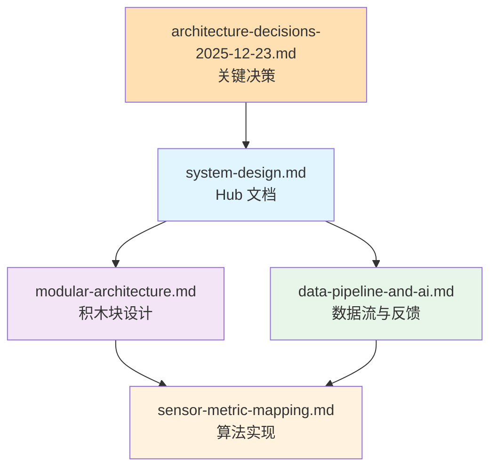

# 核心架构

> **阅读时间**: 2-3 小时 | **前置知识**: [生物力学基础](../../prerequisites/foundations/) | **目标**: 理解 MVP 系统设计

---

## 本节定位

这里是 Movement Chain AI 的技术核心 — 4 份必读文档，定义了从传感器数据到用户反馈的完整流程。

---

## 阅读顺序

```text
┌─────────────────────────────────────────────────────────────────────┐
│  0. architecture-decisions-2025-12-23.md (30分钟) ─── 关键决策汇总              │
│     └── 2025年12月技术决策：Sensor Hub、BLE抖动、六边形架构          │
│                                                                     │
│  1. system-design.md (25分钟) ─── Hub 文档                         │
│     └── MVP 全貌：4模块架构、12指标、6规则、技术栈                    │
│                                                                     │
│  2. modular-architecture.md (25分钟) ─── 结构设计                  │
│     └── LEGO 积木块：Input→Extraction→Analysis→Output              │
│                                                                     │
│  3. data-pipeline-and-ai.md (20分钟) ─── 数据流设计                │
│     └── 时间对齐、Kinematic Prompts、反馈生成                        │
│                                                                     │
│  4. sensor-metric-mapping.md (参考) ─── 算法实现                   │
│     └── Python 代码：特征计算、融合诊断、模拟数据生成                 │
└─────────────────────────────────────────────────────────────────────┘
```

---

## 文档关系图



---

## 文档概览

### [关键决策 2025-12](architecture-decisions-2025-12-23.md)

**阅读时间**: ~30 分钟 | **决策汇总** | **必读**

2025年12月的关键技术决策汇总：

- **Sensor Hub 架构**: 同一部位传感器共享 ESP32 时钟,实现微秒级同步
- **BLE 时间抖动**: 15-30ms 抖动问题及解决方案 (ESP32 源端时间戳)
- **硬件购买清单**: MyoWare 2.0 + Link Shield + Adafruit LSM6DSV16X
- **六边形架构**: Ports & Adapters 模式确认
- **时间同步精度**: 同 ESP32 <10μs, 跨设备 69-477μs

### [系统设计](system-design.md)

**阅读时间**: ~25 分钟 | **Hub 文档** | **必读**

MVP 的单一事实来源：

- **MVP 定义**: 三阶段范围（Phase 1/2/3）
- **12 核心指标**: Vision 6 + IMU 4 + EMG 2
- **6 规则引擎**: P0 关键规则、P1 重要规则
- **构建顺序**: 6 周 MVP 实现路线图
- **技术栈**: Flutter、MediaPipe、ESP32-S3、ONNX

### [模块化架构](modular-architecture.md)

**阅读时间**: ~25 分钟 | **结构设计** | **必读**

LEGO 积木块架构：

- **4 层设计**: Input → Extraction → Analysis → Output
- **竞争壁垒**: What/When/Why 价值层级
- **传感器融合**: 互补性、交叉验证、异常检测
- **MVP 策略**: Simple Rules 分类器、Mode 3 聚焦
- **升级路径**: Phase 1-4 渐进式开发

### [数据流与反馈架构](data-pipeline-and-ai.md)

**阅读时间**: ~20 分钟 | **行为设计** | **必读**

数据如何变成反馈：

- **时间对齐**: IMU 主时钟、<10ms 同步容差
- **Kinematic Prompts**: 传感器数据 → LLM 可理解的结构化文本
- **反馈生成**: Plan A/B/C 架构对比
- **阈值来源**: TPI、Meister、Cheetham 论文

### [传感器指标映射](sensor-metric-mapping.md)

**阅读时间**: 按需查阅 | **实现参考**

完整 Python 实现代码：

- **§1-2**: 系统能力矩阵、竞品对比
- **§3**: 特征提取（Vision、IMU、EMG）
- **§6**: EMG 电极布局规划
- **§7-9**: 融合置信度、诊断算法
- **§8**: 模拟数据生成（Mock IMU、Mock EMG）

---

## 关键概念速查

| 概念 | 定义 | 文档位置 |
|------|------|---------|
| Sensor Hub | 同一部位传感器共享 ESP32 时钟 | architecture-decisions-2025-12-23.md |
| Impact 对齐 | 使用击球瞬间作为 T=0 参考点 | architecture-decisions-2025-12-23.md |
| BLE 抖动 | 15-30ms 连接间隔随机延迟 | architecture-decisions-2025-12-23.md |
| X-Factor | 肩-髋分离角 | system-design.md §2 |
| Kinematic Prompts | 传感器→LLM 的桥梁 | data-pipeline-and-ai.md §2 |
| False Coil | X-Factor 正常但核心未激活 | modular-architecture.md §4.2.2 |
| Mode 3 | 全速挥杆后处理模式 | data-pipeline-and-ai.md §2 |
| LEGO 原则 | 模块独立、接口稳定 | modular-architecture.md §1.3 |

---

## 下一步

- 需要详细规格？请看 [详细规格](../specs/)
- 需要角色入口？请看 [角色指南](../briefs/)
- 需要技术决策背景？请看 [关键决策](architecture-decisions-2025-12-23.md) 和 [ADR](../decisions/)
