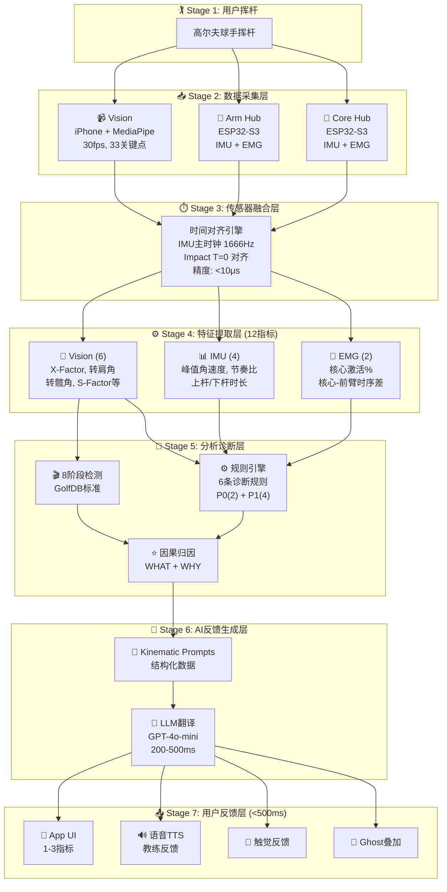
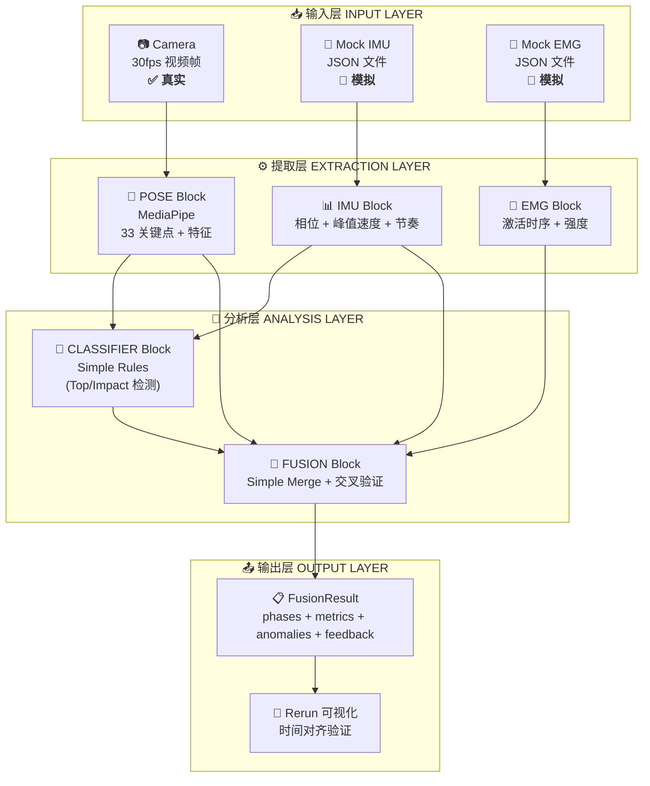

# 模块化架构设计 Modular Architecture

> **文档目的**: 定义 Movement Chain AI 的 LEGO 积木式模块化架构
>
> **核心理念**: 每个组件独立可替换，MVP 快速验证，渐进式升级
>
> **阅读时间**: 25 分钟

---

## 1. LEGO 哲学 Philosophy

### 1.1 LEGO 核心原则

1. **模块独立** — 每个模块是独立的"积木块"，可以单独替换，接口保持稳定
2. **快速验证** — MVP 用最简单的积木快速搭建，验证完整管道和用户价值
3. **延迟决策** — 不提前设计"终态"，根据真实用户数据决定升级方向
4. **数据驱动** — 复杂度来自训练数据，不来自代码 (AI 能写代码，但数据需要积累)
5. **融合优先** — 单传感器准确性不如跨传感器验证重要
6. **六边形架构** — Ports & Adapters 模式，硬件依赖通过接口隔离

### 1.2 技术不确定性管理

我们面临多个技术不确定性:

| 不确定性 | 选项 | MVP 策略 | 升级触发条件 |
|---------|------|---------|-------------|
| **分类器选择** | Simple Rules vs SwingNet vs BiGRU | Simple Rules (IMU 峰值/零交叉) | 需要完整 8 阶段划分时 |
| **姿态估计** | MediaPipe vs RTMPose vs Custom | MediaPipe (最易集成) | 精度不足时升级 |
| **传感器数据** | 真实 vs 模拟 IMU/EMG | 模拟 (验证管道) | 硬件就绪后替换 |
| **融合方法** | Simple vs Rule-based vs ML | Simple Merge | 有足够融合数据后升级 |

!!! tip "解决方案"
    把这些不确定性封装成**可替换的积木块**，通过定义清晰的接口契约，让替换成本最小化。

---

## 2. 架构总览 Architecture Overview

### 2.1 系统架构图



**核心价值链** (Stage 1 → Stage 7):

| Stage | 层级 | 功能 | 关键技术 | 价值 |
|-------|------|------|----------|------|
| 1 | 用户挥杆 | 输入事件 | - | 触发数据采集 |
| 2 | 数据采集层 | 三模态数据采集 | ESP32 Sensor Hub + MediaPipe | WHAT + WHEN + WHY |
| 3 | 传感器融合层 | 时间对齐 <10μs | IMU 主时钟 + Impact T=0 | 因果推断基础 |
| 4 | 特征提取层 | 12 个生物力学指标 | MediaPipe + NeuroKit2 | 结构化特征 |
| 5 | 分析诊断层 | 规则引擎 + 因果归因 | 8阶段检测、6条规则 | **核心差异化** |
| 6 | AI反馈层 | Kinematic Prompts → LLM | GPT-4o-mini | 教练级反馈 |
| 7 | 用户反馈层 | 多模态反馈 <500ms | TTS、触觉、Ghost | 可执行建议 |

### 2.2 架构层级说明

> 上图的 7 阶段对应本文档后续章节的积木块：

| Stage | 层级 | 对应积木块 | 关键输出 |
|-------|------|-----------|---------|
| 1-2 | 用户挥杆 + 数据采集 | Camera, [IMU](#32-imu-block), [EMG](#33-emg-block) | 原始传感器流 |
| 3 | 传感器融合层 | 时间对齐引擎 (见 [§2.3](#23-时间同步策略)) | 统一时间轴数据 |
| 4 | 特征提取层 | [POSE](#31-pose-block), [IMU](#32-imu-block), [EMG](#33-emg-block) | 12 个结构化指标 |
| 5 | 分析诊断层 | [CLASSIFIER](#41-classifier-block), [FUSION](#42-fusion-block) | 8阶段 + 6规则诊断 |
| 6-7 | AI反馈 + 用户反馈 | LLM翻译、TTS、Ghost | 教练级可执行建议 |

### 2.3 时间同步策略 {#23-时间同步策略}

三模态融合的**基础**是精确的时间对齐:

```text
┌─────────────────────────────────────────────────────────────────────────────┐
│                         时间同步策略 TIME SYNCHRONIZATION                    │
├─────────────────────────────────────────────────────────────────────────────┤
│                                                                             │
│   为什么 IMU 是主时钟 (MASTER CLOCK):                                        │
│   ─────────────────────────────────────                                     │
│   • IMU: 1666Hz = 0.6ms 分辨率 (最高)                                       │
│   • EMG: 1000Hz = 1.0ms 分辨率                                              │
│   • Vision: 30Hz = 33.3ms 分辨率 (最低)                                     │
│                                                                             │
│   对齐策略:                                                                  │
│   ─────────────────────────────────────                                     │
│   • Vision 30fps → 线性插值到 1666Hz (填补帧间空白)                          │
│   • EMG 1000Hz → 三次样条插值上采样到 1666Hz                                 │
│   • IMU 1666Hz → 主参考轴 (不变换)                                          │
│                                                                             │
│   ⚠️ 关键要求:                                                              │
│   ─────────────────────────────────────                                     │
│   • 时间同步误差 MUST < 10ms                                                │
│   • 如果 > 10ms，交叉验证失去意义                                           │
│   • 相位检测时间戳将不可靠                                                   │
│                                                                             │
│   实现方式:                                                                  │
│   ─────────────────────────────────────                                     │
│   • ESP32-S3 使用统一时钟源 (micros())                                      │
│   • BLE 传输包含发送时间戳                                                   │
│   • 手机端计算网络延迟并补偿                                                 │
│                                                                             │
└─────────────────────────────────────────────────────────────────────────────┘
```

!!! tip "🔧 调试工具: Rerun 时间轴验证"

    **问题**: 如何验证三个传感器是否真的对齐到 <10ms?

    **Rerun 解决方案**:
    ```text
    ┌─────────────────────────────────────────────────────────────┐
    │  Rerun 时间轴视图                                           │
    ├─────────────────────────────────────────────────────────────┤
    │  📷 Vision:  [帧45] ─────────────●──────── (Top 检测)       │
    │  🔄 IMU:     ─────────────────●────────── (gyro_z 零交叉)  │
    │  💪 EMG:     ───────────────●──────────── (核心激活起始)    │
    │                             ↑                               │
    │                      如果三个●不在同一垂直线 → 同步有问题    │
    └─────────────────────────────────────────────────────────────┘
    ```

    拖动时间轴到 Impact 时刻，三个传感器的事件点应该对齐。
    偏差 >10ms 说明时间同步需要调整。

    > 详见 [可视化工具评估](../decisions/visualization-tools-evaluation.md)

#### 2.3.1 时间同步实现方案 {#231-时间同步实现方案}

!!! warning "MVP 阶段说明"

    使用 **Mock 数据**时，时间同步自动完成（所有数据由同一代码生成，共享时钟）。
    本节内容适用于**真实硬件集成阶段**。

!!! warning "BLE 传输抖动"
    BLE 连接间隔抖动 ±15-30ms，时间戳必须在 ESP32 源端生成，不受传输延迟影响。

##### 推荐方案: NTP 预同步 + Impact 验证

这是行业标准方法，被大多数运动分析应用采用。代码量约 40-50 行，无需额外硬件。

```text
┌─────────────────────────────────────────────────────────────────────────────┐
│                    时间同步实现: NTP + IMPACT 验证                             │
├─────────────────────────────────────────────────────────────────────────────┤
│                                                                             │
│   STEP 1: NTP 预同步 (录制前)                                                 │
│   ────────────────────────────                                              │
│   • 手机自动从 NTP 服务器同步时间 (iOS/Android 内置)                             │
│   • ESP32 通过 BLE 从手机获取当前时间并设置内部时钟                               │
│   • 所有设备共享同一时间基准                                                    │
│   • 精度: ~1-10ms                                                            │
│                                                                             │
│   STEP 2: 传感器端时间戳 (录制中)                                               │
│   ─────────────────────────────                                             │
│   • IMU/EMG: ESP32 使用 micros() 在数据采集时立即打时间戳                        │
│   • Vision: 手机摄像头使用系统时钟 (已 NTP 同步)                                 │
│   • ⚠️ 关键: 时间戳在传感器端生成，BLE 传输延迟不影响时间戳准确性                    │
│                                                                             │
│   STEP 3: Impact 验证 (录制后)                                                │
│   ───────────────────────────                                               │
│   • IMU: 检测峰值角速度 → impact_imu (精度 ±5ms)                               │
│   • Vision: 检测球离开瞬间 → impact_vision                                    │
│   • 计算偏移: offset = impact_imu - impact_vision                            │
│   • 校正: video.timestamps += offset                                        │
│   • 若 |offset| > 20ms → 标记需检查                                           │
│                                                                             │
└─────────────────────────────────────────────────────────────────────────────┘
```

##### 为什么 EMG 不参与时间对齐

```text
肌电机械延迟 (Electromechanical Delay, EMD)
────────────────────────────────────────────

EMG 信号 ─→ 神经指令 ─→ 钙离子释放 ─→ 肌纤维收缩 ─→ 动作发生
            ↑                                        ↑
            EMG 检测                                 IMU/Vision 检测

时间差: 30-100ms

结论: EMG 是诊断数据，不是同步参考。使用 IMU 建立时间轴后，再分析 EMG。
```

##### 替代方案对比

| 方案 | 精度 | 复杂度 | 适用性 | 说明 |
|------|------|--------|--------|------|
| **NTP + Impact 验证** | <10ms | 低 (~50行代码) | ✅ MVP 推荐 | 零额外硬件，手机内置 NTP |
| 硬件 TTL 触发 | <150µs | 高 | ❌ | 需同步盒、有线连接，不便携 |
| BLE 时间戳对交换 | <1ms | 中 | ⏳ V2 | 需固件开发，精度更高 |
| Chrony | <1ms | - | ❌ 不可控 | 移动端无法选择时钟协议 |

!!! warning "注意: NTP 时钟跳变"

    NTP 校正可能导致时钟**向后跳** (例如 100ms → 95ms)。

    **解决方案**: 使用单调时钟计算相对时间:

    ```python
    # Python
    import time
    duration = time.monotonic() - start_monotonic  # 永远非负

    # ESP32
    uint32_t duration = micros() - start_micros;  // 使用差值，避免跳变影响
    ```

##### 参考实现 (硬件集成阶段)

```python
class TimeAlignmentManager:
    """时间对齐管理器 - 硬件集成阶段使用"""

    def find_imu_impact(self, gyro_z: np.ndarray, timestamps: np.ndarray) -> float:
        """从 IMU 陀螺仪数据检测击球时刻"""
        peak_idx = np.argmax(np.abs(gyro_z))
        return timestamps[peak_idx]

    def find_video_impact(self, frames: list, fps: float) -> float:
        """从视频检测击球时刻 (球离开或杆头最低点)"""
        # 简化实现: 使用运动检测找到最大变化帧
        motion_scores = [self._compute_motion(frames[i], frames[i+1])
                        for i in range(len(frames)-1)]
        impact_frame = np.argmax(motion_scores)
        return impact_frame / fps

    def validate_and_correct(self, imu_data: dict, video_data: dict) -> dict:
        """验证并校正时间对齐"""
        imu_impact = self.find_imu_impact(imu_data['gyro_z'], imu_data['timestamps'])
        video_impact = self.find_video_impact(video_data['frames'], video_data['fps'])

        offset = imu_impact - video_impact

        result = {
            'offset_ms': offset * 1000,
            'aligned': abs(offset) <= 0.020,  # <20ms 视为对齐
            'action': 'none' if abs(offset) <= 0.010 else 'corrected'
        }

        if abs(offset) > 0.010:  # >10ms 需要校正
            video_data['timestamps'] = [t + offset for t in video_data['timestamps']]

        return result
```

> **研究来源**:
>
> - [BLE 多通道生物信号同步 (PMC10144216)](https://pmc.ncbi.nlm.nih.gov/articles/PMC10144216/) - 实现 <1ms 精度
> - [Twist-n-Sync 陀螺仪同步 (PMC7795013)](https://pmc.ncbi.nlm.nih.gov/articles/PMC7795013/) - 16µs 精度，Google Research
> - [Golf Swing IMU 分段 (PMC7472298)](https://pmc.ncbi.nlm.nih.gov/articles/PMC7472298/) - Impact 检测精度 ±5-16ms

#### 2.3.2 Sensor Hub 架构 (2025-12 推荐) {#sensor-hub-architecture}

!!! success "单一权威来源 — 所有 Sensor Hub 相关文档引用此处"

**核心原则**: 同一身体部位的 IMU + EMG 使用同一个 ESP32 作为 Sensor Hub，共享微秒级时钟，消除 BLE 抖动影响。

##### 完整 3 单元架构 (目标实现)

```text
┌─────────────────────────────────────────────────────────────────────────────┐
│                    Sensor Hub 架构 (同一部位共享时钟)                          │
├─────────────────────────────────────────────────────────────────────────────┤
│                                                                             │
│   ┌─────────────────┐   ┌─────────────────┐   ┌─────────────────┐           │
│   │    ESP32 #1     │   │    ESP32 #2     │   │    ESP32 #3     │           │
│   │   手臂 (Arm)     │   │   核心 (Core)   │   │    腿部 (Leg)    │           │
│   │ ┌─────┬───────┐ │   │ ┌─────┬───────┐ │   │ ┌─────┬───────┐ │           │
│   │ │ IMU │  EMG  │ │   │ │ IMU │  EMG  │ │   │ │ IMU │  EMG  │ │           │
│   │ │(I2C)│ (ADC) │ │   │ │(I2C)│ (ADC) │ │   │ │(I2C)│ (ADC) │ │           │
│   │ └─────┴───────┘ │   │ └─────┴───────┘ │   │ └─────┴───────┘ │           │
│   │ esp_timer_get   │   │ esp_timer_get   │   │ esp_timer_get   │           │
│   │ _time() 微秒 ✅  │   │ _time() 微秒 ✅ │   │ _time() 微秒 ✅  │           │
│   └────────┬────────┘   └────────┬────────┘   └────────┬────────┘           │
│            │                     │                     │                    │
│            └──────────── BLE ────┴──────────── BLE ────┘                    │
│                        (±15-30ms 抖动)                                       │
│                                  ↓                                          │
│                            ┌──────────┐                                     │
│                            │  iPhone  │                                     │
│                            │  Camera  │                                     │
│                            └──────────┘                                     │
│                                                                             │
└─────────────────────────────────────────────────────────────────────────────┘
```

##### 为什么每个单元都必须有 IMU？

```text
┌─────────────────────────────────────────────────────────────────────────────┐
│   🔑 关键洞察: Impact 振动传遍全身，每个 IMU 都能检测到!                          │
├─────────────────────────────────────────────────────────────────────────────┤
│                                                                             │
│        [击球瞬间 Impact]                                                     │
│              ↓                                                              │
│        ┌─────────────────────────────────────────┐                          │
│        │           振动传遍身体                    │                          │
│        │  手臂 ←──── 核心 ←──── 腿部               │                          │
│        │   ↓          ↓          ↓               │                          │
│        │  IMU#1     IMU#2      IMU#3             │                          │
│        │  检测到    检测到     检测到               │                          │
│        │  振动峰值   振动峰值   振动峰值             │                          │
│        └─────────────────────────────────────────┘                          │
│                                                                             │
│   每个 IMU 都能检测到同一个 Impact 事件 → 这就是 T=0 参考点!                      │
│                                                                             │
│   ❌ 如果某个单元只有 EMG 没有 IMU → 无法检测 Impact → 无法与其他单元对齐!          │
│                                                                             │
└─────────────────────────────────────────────────────────────────────────────┘
```

##### 优势

- ✅ 同一部位传感器共享 ESP32 时钟 → 微秒级同步
- ✅ 每个单元都有 IMU → 可检测 Impact 事件做跨单元同步
- ✅ 不同部位用 Impact 瞬间对齐 → 消除 BLE 抖动 (±15-30ms)
- ✅ 减少 BLE 设备数量 → 更稳定的连接

##### 同步精度

> 📐 **详细时间同步规格**: 见 [数据管道与AI §1.2](./data-pipeline-and-ai.md#sensor-hub-架构-2025-12-推荐)

| 场景 | 目标精度 | 实际可达 | 方法 |
|------|---------|---------|------|
| 同一 ESP32 (IMU+EMG) | <100 μs | <10 μs | esp_timer_get_time() |
| 跨 ESP32 (手臂↔核心) | <1 ms | 69-477 μs | Impact 事件对齐 |
| 跨设备 (ESP32↔Vision) | <10 ms | <5 ms | Impact 帧对齐 |

> **硬件购买清单**: 见 [关键决策 2025-12 §4.3](../decisions/architecture-decisions-2025-12-23.md#43-硬件购买清单)

### 2.4 融合引擎: 三大机制

!!! info "融合不是简单叠加，而是三种机制的协同"

#### 机制 1: 互补性 (Complementarity)

每个传感器测量其他传感器**无法测量**的内容:

```text
┌──────────────┐   ┌──────────────┐   ┌──────────────┐
│    Vision    │   │     IMU      │   │     EMG      │
├──────────────┤   ├──────────────┤   ├──────────────┤
│ X-Factor   ✅│   │ X-Factor   ❌│   │ X-Factor   ❌│
│ 身体姿态    ✅│   │ 身体姿态    ❌│    │ 身体姿态    ❌│
│ 空间位置    ✅│   │ 空间位置    ❌│    │ 空间位置    ❌│
│              │   │              │    │             │
│ 击球时刻    ❌│   │ 击球时刻    ✅│    │ 击球时刻    ❌│
│ 峰值速度    ❌│   │ 峰值速度    ✅│    │ 峰值速度    ❌│
│ 3D 旋转    ❌│    │ 3D 旋转   ✅│     │ 3D 旋转    ❌│
│             │    │             │     │             │
│ 肌肉激活    ❌│   │ 肌肉激活    ❌│    │ 肌肉激活    ✅│
│ 疲劳检测    ❌│   │ 疲劳检测    ❌│    │ 疲劳检测    ✅│
│ 力链因果    ❌│   │ 力链因果    ❌│    │ 力链因果    ✅│
└──────────────┘   └──────────────┘   └──────────────┘

→ 融合 = 完整画面，不是部分视图
```

#### 机制 2: 双重/三重验证 (Cross-Validation) {#机制-2-双重三重验证-cross-validation}

同一事件被多个传感器测量 → 捕获错误:

```text
示例: 检测 "Top of Backswing"

  Vision 说: Frame 45 (±2帧 = ±66ms)
  IMU 说:    T = 1.523s (gyro_z 零交叉, ±0.6ms)

  如果 |vision_time - imu_time| > 100ms → 标记为检测错误
  如果两者一致 → 高置信度时间戳

  ┌─────────────────────────────────────────────────────────────┐
  │  Ground Truth = IMU (更精确)                                │
  │  Vision = 完整性检查 (身体是否"看起来"像 Top?)               │
  │  EMG = 因果检查 (肌肉是否正确激活?)                         │
  └─────────────────────────────────────────────────────────────┘
```

!!! tip "🔧 调试工具: 可视化交叉验证"

    **问题**: 如何确认 Vision 和 IMU 的阶段检测是否一致?

    **Rerun 解决方案**:

    | 通道 | 显示内容 | 验证点 |
    |-----|---------|-------|
    | 视频通道 | 骨架叠加 + 阶段标签 | 身体"看起来"像 Top 吗? |
    | IMU 曲线 | gyro_z 波形 + 零交叉标记 | 角速度是否过零? |
    | 置信度曲线 | 融合置信度 0-1 | 不一致时置信度会下降 |

    当 Vision 说 "Top" 但 IMU 还在运动 → 置信度曲线会下降 → 一眼看出问题

#### 机制 3: 异常检测 (Anomaly Detection)

传感器间的**矛盾**揭示隐藏问题:

```text
┌─────────────────────────────────────────────────────────────────────────────┐
│                         异常检测场景 ANOMALY SCENARIOS                       │
├─────────────────────────────────────────────────────────────────────────────┤
│                                                                             │
│   场景 1: 假性蓄力 (FALSE COIL) — 竞品无法检测!                              │
│   ─────────────────────────────────────────────────────                     │
│   IF: Vision 显示正常 X-Factor (45°)                                        │
│   BUT: EMG 显示核心激活 < 50%                                               │
│   THEN: "假性蓄力" — 看起来对但肌肉没参与                                   │
│   → 用户反馈: "转肩看起来够了，但核心没发力。专注于收紧腹肌。"               │
│                                                                             │
│   场景 2: 代偿动作 (COMPENSATION)                                           │
│   ─────────────────────────────────────────────────────                     │
│   IF: IMU 显示快速旋转 (高角速度)                                           │
│   BUT: EMG 显示核心未激活，前臂先于核心激活                                  │
│   THEN: "代偿" — 速度来自错误的力量源                                       │
│   → 用户反馈: "速度来自手臂，缺乏核心力量。让身体带动，别用手打。"           │
│                                                                             │
│   场景 3: 传感器故障                                                        │
│   ─────────────────────────────────────────────────────                     │
│   IF: Vision 显示大幅运动                                                   │
│   BUT: IMU 显示静止                                                         │
│   THEN: 传感器可能脱落或故障                                                │
│   → 系统反馈: "请检查 IMU 传感器是否正确佩戴"                               │
│                                                                             │
│   ⚡ 关键洞察:                                                              │
│   没有融合，你会认为挥杆基于单一指标是"好的"                                 │
│   有了融合，你能捕获隐藏问题                                                 │
│                                                                             │
└─────────────────────────────────────────────────────────────────────────────┘
```

### 2.5 积木块接口契约 {#25-积木块接口契约}

每个积木块有明确的输入/输出契约，确保可替换性:

```text
┌─────────────────────────────────────────────────────────────────────────────┐
│                         积木块接口契约 BLOCK INTERFACE CONTRACTS             │
├─────────────────────────────────────────────────────────────────────────────┤
│                                                                             │
│   [POSE Block]                                                              │
│   ─────────────────────────────────────────────────────                     │
│   Input:  VideoFrame { rgb: [H, W, 3], timestamp_ms: int }                 │
│   Output: PoseResult {                                                      │
│       keypoints: [33 × {x: float, y: float, z: float, visibility: float}], │
│       timestamp_ms: int,                                                    │
│       features: {                                                           │
│           x_factor: float,      // 肩髋分离角 (度)                          │
│           s_factor: float,      // 肩部倾斜角 (度)                          │
│           o_factor: float,      // 骨盆倾斜角 (度)                          │
│           sway: float,          // 髋部侧移 (归一化)                        │
│           lift: float           // 髋部抬升 (归一化)                        │
│       }                                                                     │
│   }                                                                         │
│                                                                             │
│   [IMU Block]                                                               │
│   ─────────────────────────────────────────────────────                     │
│   Input:  RawIMU { gyro: [x,y,z] °/s, accel: [x,y,z] g, timestamp_us: int }│
│   Output: IMUFeatures {                                                     │
│       phase: string,            // 当前检测到的阶段 (Address/Top/Impact/...)│
│       phase_confidence: float,  // 阶段置信度 [0-1]                         │
│       peak_velocity: float,     // 峰值角速度 (°/s)                         │
│       tempo_ratio: float,       // 上杆/下杆时间比                          │
│       timestamp_ms: int                                                     │
│   }                                                                         │
│                                                                             │
│   [EMG Block]                                                               │
│   ─────────────────────────────────────────────────────                     │
│   Input:  RawEMG { channels: {core: [mV], forearm: [mV]}, timestamp_ms: int}│
│   Output: EMGFeatures {                                                     │
│       onset_times: {core_ms: int, forearm_ms: int},                        │
│       activation_pct: {core: float, forearm: float},  // [0-1]             │
│       timing_gap_ms: int,       // forearm_onset - core_onset              │
│       fatigue_ratio: float,     // 当前/初始激活强度比                      │
│       timestamp_ms: int                                                     │
│   }                                                                         │
│                                                                             │
│   [CLASSIFIER Block]                                                        │
│   ─────────────────────────────────────────────────────                     │
│   Input:  PoseSequence [N × PoseResult]                                    │
│   Output: ClassifierResult {                                                │
│       phases: [N × {label: int, confidence: float}],  // 0-7 每帧          │
│       phase_boundaries: [{phase: int, start_ms: int, end_ms: int}]         │
│   }                                                                         │
│                                                                             │
│   [FUSION Block]                                                            │
│   ─────────────────────────────────────────────────────                     │
│   Input:  {                                                                 │
│       pose: PoseResult[],                                                   │
│       imu: IMUFeatures,                                                     │
│       emg: EMGFeatures,                                                     │
│       classifier: ClassifierResult                                          │
│   }                                                                         │
│   Output: FusionResult {                                                    │
│       phases: [{label: str, start_ms: int, end_ms: int, confidence: float}],│
│       metrics: {x_factor, tempo_ratio, core_forearm_gap, peak_velocity, ...}│
│       anomalies: [{type: str, severity: str, description: str}],           │
│       overall_confidence: float,                                            │
│       feedback: [{rule: str, message_cn: str, message_en: str}]            │
│   }                                                                         │
│                                                                             │
└─────────────────────────────────────────────────────────────────────────────┘
```

### 2.6 置信度计算逻辑

融合提升置信度的核心算法:

| 验证条件 | 置信度变化 | 结果示例 |
|---------|-----------|---------|
| **基准** | 0.5 | 单传感器 |
| Vision-IMU 阶段一致 | +0.25 | 双重验证 |
| Vision-IMU 阶段不一致 | -0.15 | 需人工检查 |
| EMG 序列正确 | +0.25 | 三重验证 |
| EMG 无数据 | +0.0 | 保持 |
| EMG 序列异常 | -0.10 | 标记问题 |

**置信度示例**:

- Vision=Top, IMU=Top, EMG=Correct → **1.0** (最高)
- Vision=Top, IMU=Top, EMG=None → **0.75**
- Vision=Top, IMU=Mid, EMG=None → **0.35** (需检查)

!!! tip "算法实现"
    完整 Python 代码见 [传感器指标映射 §7](./sensor-metric-mapping.md#7-融合置信度计算-fusion-confidence)

### 2.7 用户反馈翻译层 {#27-用户反馈翻译层}

原始数据 → 规则引擎 → 自然语言反馈:

```text
┌─────────────────────────────────────────────────────────────────────────────┐
│                    用户反馈翻译层 FEEDBACK TRANSLATION                       │
├─────────────────────────────────────────────────────────────────────────────┤
│                                                                             │
│   原始数据 → 规则触发 → 自然语言 → TTS/UI                                   │
│                                                                             │
│   示例 1: 运动链倒序                                                        │
│   ─────────────────────────────────────────────────────                     │
│   数据: emg_core_forearm_gap = -40ms                                        │
│   规则: ARMS_BEFORE_CORE (P0 严重)                                          │
│   CN: "让身体带动，别用手打"                                                │
│   EN: "Let your body lead, don't swing with your arms"                     │
│                                                                             │
│   示例 2: X-Factor 不足                                                     │
│   ─────────────────────────────────────────────────────                     │
│   数据: x_factor = 22° (低于 35° 阈值)                                      │
│   规则: LOW_X_FACTOR (P1 重要)                                              │
│   CN: "肩膀多转一点，你的背还没拧紧"                                        │
│   EN: "Turn your shoulders more - you haven't coiled your back yet"        │
│                                                                             │
│   示例 3: 假性蓄力 (只有三模态能检测!)                                       │
│   ─────────────────────────────────────────────────────                     │
│   数据: x_factor = 45° (正常) + emg_core_activation = 0.3 (低于 0.5)        │
│   规则: FALSE_COIL (P0 严重)                                                │
│   CN: "看起来转够了，但核心没发力。专注于收紧腹肌再下杆。"                   │
│   EN: "Your turn looks good but your core isn't engaged. Focus on          │
│        tightening your abs before starting the downswing."                 │
│                                                                             │
│   示例 4: 疲劳预警                                                          │
│   ─────────────────────────────────────────────────────                     │
│   数据: emg_fatigue_ratio = 0.65 (低于 0.7 阈值)                            │
│   规则: FATIGUE_WARNING (P1 重要)                                           │
│   CN: "你累了，休息一下再练，避免受伤"                                      │
│   EN: "You're fatigued. Take a break to prevent injury."                   │
│                                                                             │
└─────────────────────────────────────────────────────────────────────────────┘
```

!!! tip "🔧 调试工具: 验证反馈时机"

    **问题**: 反馈是否在正确的时刻触发?

    **Rerun 调试流程**:

    1. 录制一次挥杆到 `.rrd` 文件
    2. 在时间轴上标记:
        - 规则触发时刻 (如 `ARMS_BEFORE_CORE` 在 T=720ms 触发)
        - 对应的 EMG 激活时刻 (Core=640ms, Forearm=580ms)
    3. 验证规则逻辑是否正确
    4. 反复回放同一录制，调优阈值直到反馈时机合理

### 2.8 研究验证的阈值参考

!!! abstract "详细内容已移至单一来源"
    为避免重复维护，所有生物力学阈值数据已整合到:

    **[生物力学基准值](../../prerequisites/foundations/biomechanics-benchmarks.md)** — 包含 Vision、IMU、EMG 所有指标的研究验证阈值

### 2.9 竞品能力对比 & 系统能力矩阵

!!! abstract "详细内容已移至单一来源"
    为避免重复维护，详细的竞品对比和能力矩阵表已整合到:

    - **[传感器指标映射 §1](./sensor-metric-mapping.md#1-系统能力矩阵-capability-matrix)** — 系统能力矩阵
    - **[传感器指标映射 §2](./sensor-metric-mapping.md#2-竞品能力对比-competitor-comparison)** — 竞品能力对比

**核心差异化速览**:

| 能力维度 | Vision系统 | IMU系统 | 你的系统 (Vision+IMU+EMG) |
|---------|-----------|---------|--------------------------|
| **看到什么 (What)** | ✅✅ 最强 | ⚠️ 需多传感器 | ✅✅ 最强 |
| **测量速度 (How Fast)** | ❌ 低频 | ✅✅ 最强 | ✅✅ 最强 |
| **解释原因 (Why)** | ❌ 无法解释 | ⚠️ 间接推断 | ✅✅ **直接观测肌肉激活** |

**独特能力 (UNIQUE)**: 肌肉激活时序、肌肉激活强度、力链序列验证、疲劳检测 — 竞品均无法实现。

---

## 3. ⚙️ 提取层 EXTRACTION LAYER

从原始传感器数据中提取结构化特征。每个 Block 负责一种数据源。

### 3.1 POSE Block

**职责**: 从视频帧提取人体 33 个关键点坐标

**MVP 选择**: MediaPipe BlazePose

| 属性 | 值 |
|-----|-----|
| 精度 | AP 65% |
| 速度 | 30 FPS |
| 训练数据 | 0 (预训练) |
| 平台 | iOS / Android 原生支持 |

**选择理由**:

- 开箱即用，MediaPipeTasksVision iOS SDK 官方支持
- 33 关键点足够计算 X-Factor、肩转、髋转
- 不需要任何训练数据

!!! tip "🔧 调试工具: MediaPipe 骨架可视化"

    Rerun 官方提供 [human_pose_tracking](https://rerun.io/examples/video-image/human_pose_tracking) 示例:

    ```bash
    pip install rerun-sdk
    python -m rerun_demos.human_pose_tracking
    ```

    可验证:

    - 33 关键点是否完整检测
    - 关键点 visibility 是否足够 (遮挡问题)
    - X-Factor 等特征计算是否正确 (叠加角度线)

!!! note "备选方案"

    | 方案 | 精度 | 速度 | 何时考虑 |
    |-----|------|------|---------|
    | RTMPose | AP 75.8% | 25 FPS | 需要更高精度 |
    | ViTPose++ | AP 81% | 15 FPS | 精度优先，速度可接受 |
    | Custom Model | 待定 | 待定 | 积累大量高尔夫数据后 |

#### 3.1.1 可计算的特征

| 特征 | 计算方法 | 关键点 | 用途 |
|-----|---------|--------|------|
| **X-Factor** | 肩部连线角 - 骨盆连线角 | 11,12,23,24 | 蓄力评估 |
| **X-Factor Stretch** | 下杆期最大 X-Factor - Top 时 X-Factor | 同上 | 蓄力质量 |
| **S-Factor** | 肩部倾斜角 | 11,12 | 姿态评估 |
| **O-Factor** | 骨盆倾斜角 | 23,24 | 下盘稳定 |
| **Sway/Lift** | 髋部中心位移 vs Address | 23,24 | 重心控制 |

!!! tip "详细算法实现"
    计算代码见 [传感器指标映射 §3.1](./sensor-metric-mapping.md#31-vision-检测-mediapipe-33-landmarks)

### 3.2 IMU Block

**职责**: 从惯性测量单元提取角速度、加速度等时序特征

**MVP 选择**: 模拟数据 (Simulated JSON)

| 属性 | 值 |
|-----|-----|
| 数据源 | JSON 文件 (基于研究论文) 或从 Pose 数据生成 |
| 采样率 | 100Hz (模拟) / 1666Hz (真实) |
| 用途 | 开发调试，验证完整管道，无需等待硬件 |

**模拟数据设计**:

- 峰值角速度: 800-1500°/s (职业范围)
- 节奏比: 2.5-3.5:1 (理想范围)
- 噪声模型: 高斯噪声 + 漂移模拟

!!! tip "🔧 调试工具: IMU 曲线与阶段对齐"

    **问题**: 模拟 IMU 数据的峰值/零交叉点是否正确?

    **Rerun 解决方案**:

    ```text
    gyro_z (°/s)
         │
    1200 ┤                    ●─── Impact 峰值
         │                   ╱│
     600 ┤                  ╱ │
         │                 ╱  │
       0 ┤────────────●───╱───┴──── Top (零交叉)
         │   Address   ╲ ╱
    -600 ┤              V
         └────────────────────────────→ time
    ```

    Rerun 曲线视图可以自动检测峰值和零交叉，与视频帧同步验证

#### 3.2.1 模拟 IMU 数据生成

**原理**: 用 MediaPipe 关键点序列**导数**近似 IMU 角速度

| 函数 | 输入 | 输出 |
|-----|------|------|
| `simulate_imu_from_pose()` | MediaPipe 33 关键点序列 | `List[SimulatedIMUFrame]` |

**数据结构**:

```python
@dataclass
class SimulatedIMUFrame:
    timestamp_ms: int        # 时间戳
    gyro_z: float            # 主轴角速度 (°/s)
    gyro_magnitude: float    # 合成角速度
    accel_magnitude: float   # 合成加速度
    phase_hint: str          # 预期阶段 (TOP/IMPACT/...)
```

!!! tip "完整算法实现"
    详细代码和测试场景见 [传感器指标映射 §8.1](./sensor-metric-mapping.md#81-从-pose-数据生成模拟-imu)

!!! note "真实硬件选项 (Phase 2+)"

    **推荐硬件**: Adafruit LSM6DSV16X (ADA-5783) — 45+ 分钟漂移稳定性

    | 方案 | 精度 | 硬件 | 何时引入 |
    |-----|------|------|---------|
    | Single Wrist IMU | ±9-15ms | LSM6DSV16X | 硬件原型完成 |
    | Dual IMU | ±5ms | Wrist + Pelvis | 运动链分析 |
    | Multi-point (4+) | ±2ms | 完整穿戴 | 完整运动链 |

    ⚠️ **WitMotion WT901 警告**: 必须禁用其 BLE，通过 I2C 连接 ESP32 使用

#### 3.2.3 真实 IMU 检测能力

| 特征 | 描述 | 阈值参考 | 用途 |
|-----|------|---------|------|
| **Peak Angular Velocity** | 杆头最大角速度 | Pro: 800-1500°/s | 爆发力评估 |
| **Kinematic Sequence** | 运动链时序 | Pelvis→Torso→Arm→Club | 动力传递验证 |
| **Tempo Ratio** | 上杆/下杆时间比 | 理想: 2.5-3.5:1 | 节奏评估 |
| **Transition Timing** | 转换点精度 | ±0.6ms 可检测 | 力量爆发点 |

!!! tip "详细算法实现"
    峰值检测、运动链验证代码见 [传感器指标映射 §3.2](./sensor-metric-mapping.md#32-imu-检测-lsm6dsv16x--1666hz)

### 3.3 EMG Block

**职责**: 从肌电传感器提取肌肉激活时序和强度

**MVP 选择**: 模拟数据 (Simulated JSON)

| 属性 | 值 |
|-----|-----|
| 数据源 | JSON 文件 (基于研究论文) 或根据阶段时间戳生成 |
| 通道数 | 2 (Core + Forearm) |
| 采样率 | 500Hz (模拟) / 1000Hz (真实) |

**模拟数据设计**:

- 正确模式: Core 先于 Forearm 激活 (>20ms)
- 错误模式: Forearm 先于 Core (模拟"手臂先动"问题)
- 包络处理: RMS 平滑后归一化到 0-100%

!!! tip "🔧 调试工具: EMG 激活时序可视化"

    **问题**: 如何验证 Core 真的比 Forearm 先激活?

    **Rerun 解决方案**:

    ```text
    EMG 包络 (归一化)
      1.0│      Core (红)     Forearm (蓝)
         │        ┌──╮           ┌──╮
      0.5│       ╱    ╲         ╱    ╲
         │      ╱      ╲       ╱      ╲
      0.0├─────●────────╲─────●────────╲────→ time
              ↑ Core     ╲    ↑ Forearm
              onset       ╲   onset
              (570ms)      ╲  (720ms)
                            ╲
                         gap = 150ms ✓
    ```

    两条 EMG 曲线叠加显示，onset 标记一目了然

#### 3.3.1 模拟 EMG 数据生成

**原理**: 根据已知生物力学时序生成**符合真实模式**的 EMG 信号

| 模式 | 描述 | 时序特征 |
|------|------|---------|
| `CORRECT` | 正确运动链 | Core 先于 Forearm >20ms |
| `ARMS_FIRST` | 错误 — 手臂先动 | Forearm 先于 Core |
| `FALSE_COIL` | 假性蓄力 | 时序正确，Core <50% |
| `FATIGUED` | 疲劳模式 | 整体激活衰减 |

**核心函数**: `simulate_emg_from_phases(phase_timestamps, pattern) → SimulatedEMGResult`

!!! warning "False Coil 是竞争护城河"
    假性蓄力 (False Coil) 是**只有三模态融合才能检测**的问题:

    - Vision 看到: X-Factor = 45° ✅ (正常)
    - IMU 看到: 正常旋转时序 ✅
    - EMG 看到: Core activation = 30% ❌ (过低)

    结论: 球员"装"出了正确的姿势，但核心肌群没有真正参与。
    这是 Vision-only 竞品永远无法检测的问题。

!!! tip "完整算法实现"
    详细代码和测试场景见 [传感器指标映射 §8.2](./sensor-metric-mapping.md#82-从阶段时间戳生成模拟-emg)

!!! note "真实硬件选项 (Phase 2+)"

    🔴 **CRITICAL**: MyoWare 2.0 没有焊孔，只有 Snap 扣。Link Shield (DEV-18425) 是**必需品**！

    **推荐套装** (每个身体部位):
    - 1x MyoWare 2.0 Muscle Sensor (~$40)
    - 1x MyoWare 2.0 Link Shield ($4.50) ← 必需！

    ⚠️ **警告**: DFRobot SEN0240 有线缆噪声问题，仅适用静态测量，不适合高速挥杆。

    | 方案 | 通道 | 肌肉群 | 何时引入 |
    |-----|------|-------|---------|
    | 2-channel | 2 | Core + Forearm | 硬件原型 |
    | 4-channel | 4 | + Gluteus, Adductors | 下肢分析 |
    | 6-channel | 6 | + Lats, Deltoids | 完整上身 |

#### 3.3.2 EMG 电极布局规划

MVP 阶段使用 2 通道 (Core + Forearm)，后续渐进扩展：

| 阶段 | 通道 | 肌群覆盖 | 可检测能力 |
|-----|------|---------|-----------|
| **Phase 1** | 2 | 腹直肌 + 前臂屈肌 | False Coil, 核心激活时序 |
| **Phase 2** | 4 | + 臀大肌, 内收肌 | 下肢驱动, 髋部稳定 |
| **Phase 3** | 6 | + 背阔肌, 三角肌 | 完整力链验证 |

!!! tip "详细布局图"
    电极放置位置、选择依据见 [传感器指标映射 §6](./sensor-metric-mapping.md#6-emg-传感器布局规划-emg-sensor-placement-plan)

#### 3.3.4 真实 EMG 检测能力

| 特征 | 描述 | 信号处理 | 用途 |
|-----|------|---------|------|
| **Muscle Onset** | 肌肉激活起始时间 | 阈值检测 (10% MVC) | 运动链时序 |
| **Peak Activation** | 最大肌电幅值 | RMS 包络 | 力量输出评估 |
| **Fatigue Detection** | 肌肉疲劳指标 | 频谱中值下降 | 训练负荷监控 |
| **Co-activation** | 拮抗肌同时激活 | 双通道比较 | 动作效率分析 |

!!! tip "详细算法实现"
    信号处理、特征提取代码见 [传感器指标映射 §3.3](./sensor-metric-mapping.md#33-emg-检测-unique-capability)

---

## 4. 🧠 分析层 ANALYSIS LAYER

对提取的特征进行智能分析，识别挥杆阶段并融合多模态数据。

### 4.1 CLASSIFIER Block

**职责**: 根据关键点序列识别挥杆的 8 个阶段

**MVP 选择**: Simple Rules (基于 IMU 信号)

| 属性 | 值 |
|-----|-----|
| 方法 | IMU gyro_z 信号分析 |
| Top 检测 | gyro_z 零交叉点 (方向反转) |
| Impact 检测 | gyro_z 峰值点 (最大角速度) |
| 训练数据 | 0 (纯规则) |
| 精度 | ±0.6ms (IMU 原生精度) |

**选择理由**:

- **无需训练数据** — 纯物理信号分析
- **更高精度** — IMU 1666Hz vs Vision 30Hz
- **可解释性强** — 零交叉和峰值点有明确物理意义
- **调试简单** — Rerun 中一眼可见峰值和零交叉

```text
Phase 检测原理 (Simple Rules):
───────────────────────────────
gyro_z (°/s)
     │
1200 ┤                    ●─── Impact (峰值点)
     │                   ╱│
 600 ┤                  ╱ │
     │                 ╱  │
   0 ┤────────────●───╱───┴──── Top (零交叉点)
     │   Address   ╲ ╱
-600 ┤              V
     └────────────────────────────→ time

Top = gyro_z 从负→正 零交叉 (上杆结束，下杆开始)
Impact = gyro_z 正向峰值 (最大旋转速度)
```

!!! note "备选方案 (Phase 2+)"

    | 方案 | 准确率 | 训练数据 | 速度 | 何时考虑 |
    |-----|-------|---------|------|---------|
    | **SwingNet** | 71.5% | 0 (预训练) | 5ms | 需要完整 8 阶段划分时 |
    | Random Forest | ~65% | ~500 videos | <1ms | 快速 baseline |
    | BiGRU | ~80% | ~1000 videos | 3ms | 积累 1000 视频后 |
    | Transformer | ~88% | ~10000+ | 10ms | 大量数据后 |

    **研究发现 (CaddieSet CVPR 2025)**: 关节特征 + 时序模型 (MSE 8.80) 优于纯视觉 Transformer (MSE 32.32)

### 4.2 FUSION Block

**职责**: 融合 Vision + IMU + EMG 三模态数据，交叉验证并检测异常

**MVP 选择**: Simple Merge

| 属性 | 值 |
|-----|-----|
| 方法 | 简单合并各传感器特征 |
| 复杂度 | 低 |
| 用途 | 快速验证管道 |

**融合三原则**:

1. **互补性** — Vision (空间姿态) + IMU (精确时序) + EMG (肌肉状态)
2. **交叉验证** — Vision "Top" + IMU zero-crossing → 确认; 不一致 → 降低置信度
3. **异常检测** — 传感器间矛盾 → 标记异常 (穿戴问题/传感器故障)

#### 4.2.1 核心诊断算法 {#421-核心诊断算法}

FUSION Block 的核心价值在于**诊断算法** — 这些算法只有三模态融合才能实现。

> **实现代码**: 见 [传感器指标映射 §9 融合诊断算法](./sensor-metric-mapping.md#9-融合诊断算法-fusion-diagnostic-algorithms)

| 算法 | 函数名 | 检测内容 | 所需传感器 |
|-----|-------|---------|-----------|
| 运动链序列验证 | `validate_kinematic_sequence()` | Core 是否先于 Forearm 激活 | EMG |
| 假蓄力检测 | `detect_false_coil()` | X-Factor 高但核心肌群未激活 | Vision + EMG |
| 力量链验证 | `verify_force_chain()` | 三模态数据一致性验证 | Vision + IMU + EMG |
| 诊断入口 | `run_fusion_diagnostics()` | 整合所有诊断，返回主要反馈 | All |

!!! tip "🔧 调试工具: 诊断规则验证"

    **问题**: 规则是否在正确的条件下触发?

    **Rerun 调试流程**:

    1. 录制一个 "ARMS_BEFORE_CORE" 问题挥杆
    2. 在 Rerun 中标记:
        - EMG Core onset: 640ms
        - EMG Forearm onset: 580ms
        - 规则触发时刻: 720ms
    3. 验证: `timing_gap = 580 - 640 = -60ms < 0` → 规则应该触发 ✓
    4. 如果规则没触发 → 检查阈值设置

    保存 `.rrd` 文件作为回归测试用例

**诊断严重度分级**:

| 级别 | 含义 | 示例 |
|-----|-----|------|
| P0_CRITICAL | 必须修正，影响挥杆效果 | `ARMS_BEFORE_CORE`, `FALSE_COIL` |
| P1_IMPORTANT | 建议修正，影响一致性 | `LOW_X_FACTOR`, `WEAK_CORE_LEAD` |
| P2_MINOR | 可选优化 | `PHASE_MISMATCH` |
| INFO | 仅供参考 | 正确序列确认 |

#### 4.2.2 诊断规则速查表

| 规则 ID | 严重度 | 触发条件 | 需要的传感器 |
|--------|--------|---------|-------------|
| `ARMS_BEFORE_CORE` | P0 | Forearm 先于 Core 激活 | EMG |
| `FALSE_COIL` | P0 | X-Factor ≥35° 但 Core <50% | Vision + EMG |
| `COMPENSATION_DETECTED` | P0 | 峰值速度高但 Core 激活低 | IMU + EMG |
| `LOW_X_FACTOR` | P1 | X-Factor <35° | Vision |
| `WEAK_CORE_LEAD` | P1 | Core 领先 Forearm <20ms | EMG |
| `PHASE_MISMATCH` | P2 | Vision 和 IMU 阶段不一致 | Vision + IMU |

!!! success "三模态独有能力"
    以上规则中，**P0 级别的三个规则都需要 EMG 数据**。
    这意味着:

    - Vision-only 竞品只能检测 `LOW_X_FACTOR` (P1)
    - Vision+IMU 竞品可以检测 `PHASE_MISMATCH` (P2)
    - **只有 Vision+IMU+EMG 能检测全部 P0 问题**

!!! note "备选融合方法"

    | 方案 | 复杂度 | 何时考虑 |
    |-----|-------|---------|
    | Rule-based | 中 | 明确传感器优先级后 |
    | Weighted Average | 中 | 已知各传感器可靠性 |
    | Kalman Filter | 高 | 需要实时平滑 |
    | ML Fusion | 高 | 有足够融合训练数据 |

---

## 5. MVP 策略 MVP Strategy

### 5.1 MVP 核心输出: 时间对齐的融合数据

!!! abstract "🎯 MVP 的核心价值: Time-Aligned FusionResult"

    **MVP 的最重要输出不是"完美的分析结果"，而是验证三模态数据能否精确对齐。**

    ```text
    ┌─────────────────────────────────────────────────────────────────────────────┐
    │                    MVP 核心输出: 时间对齐的 FusionResult                      │
    ├─────────────────────────────────────────────────────────────────────────────┤
    │                                                                             │
    │   在 Rerun 时间轴上同步显示:                                                 │
    │                                                                             │
    │   📷 MediaPipe: ──●──●──●──●──●──●──●──●──●──●── (30fps 骨架)              │
    │                           ↓ Top              ↓ Impact                       │
    │   🔄 Mock IMU:  ─────────────●───────────────●──── (峰值/零交叉)            │
    │                           ↓                  ↓                              │
    │   💪 Mock EMG:  ─────────●─────────────────●────── (Core/Forearm onset)     │
    │                         ↓                                                   │
    │                    Core onset 应该在 Top 之前                                │
    │                                                                             │
    │   ═══════════════════════════════════════════════════════════════════════  │
    │                                                                             │
    │   ✅ MVP 验证目标:                                                          │
    │   1. 三条数据流能否对齐到 <10ms?                                            │
    │   2. IMU 峰值是否对应视频中的 Impact 帧?                                    │
    │   3. EMG Core onset 是否在 Top 之前?                                        │
    │   4. 计算的 X-Factor 是否与骨架角度一致?                                    │
    │                                                                             │
    │   这些问题只有在 Rerun 中才能直观验证！                                      │
    │                                                                             │
    └─────────────────────────────────────────────────────────────────────────────┘
    ```

### 5.2 MVP 模式聚焦: Mode 3 (Full Speed)

!!! info "MVP 只实现 Mode 3，其他模式放到 Phase 2/3"

    | 模式 | 名称 | 实时性 | MVP | 原因 |
    |-----|------|--------|-----|------|
    | **Mode 3** | Full Speed | ❌ 后处理 | ✅ MVP | 无实时约束，最易调试 |
    | Mode 1 | Setup Check | ⚠️ 准实时 | Phase 2 | 需要静态姿态检测 |
    | Mode 2 | Slow Motion | ✅ 实时 | Phase 3 | 实时处理复杂度高 |

    **为什么先做 Mode 3?**

    1. **无实时约束** — 可以反复回放同一录制，逐帧调试
    2. **完整数据** — 录制完成后数据完整，不会丢帧
    3. **Rerun 友好** — 录制 .rrd 文件分享给团队协作
    4. **优先验证核心价值** — 时间对齐是否正确比实时性更重要

### 5.3 MVP 架构图

MVP 使用**完整的 4 层架构**，只是将真实硬件替换为模拟数据源：



**FusionResult 输出结构** (见 [§2.5 接口契约](#25-积木块接口契约)):

```text
FusionResult {
    phases: [{label, start_ms, end_ms, confidence}],   // Top/Impact 时间边界
    metrics: {x_factor, tempo_ratio, peak_velocity, ...}, // 12 指标
    anomalies: [{type, severity, description}],        // 异常检测
    overall_confidence: float,                         // 融合置信度
    feedback: [{rule, message_cn, message_en}]         // 自然语言建议
}
```

!!! success "MVP 核心原则: 架构不变，数据源可换"

    | 层级 | MVP 实现 | 后续升级 |
    |-----|---------|---------|
    | **输入层** | Camera 真实 + Mock IMU/EMG JSON | → 真实 LSM6DSV16X + DFRobot EMG |
    | **提取层** | 3 个 Block 接口不变 | 内部实现可替换 |
    | **分析层** | Simple Rules + Simple Merge | → SwingNet/BiGRU + Kalman Filter |
    | **输出层** | FusionResult → Rerun 可视化 | → App UI + TTS |

### 5.4 模拟数据验证全管道

**核心思路**: 真实 MediaPipe + 模拟 IMU/EMG = 完整管道验证

```text
为什么用模拟数据？
────────────────
1. 硬件还没准备好，但软件管道可以先开发
2. 模拟数据可以控制"正确/错误"模式，测试规则引擎
3. 真实硬件到位后，只需替换 IMU/EMG 积木块
4. 降低并行开发的耦合度 (软件不等硬件)
```

### 5.5 渐进式升级路径

```text
Phase 1: MVP (Mode 3 Only)
──────────────────────────
Camera → MediaPipe ─┬→ Simple Rules → Top/Impact 检测
Mock IMU JSON ──────┤  (IMU 峰值/零交叉)
Mock EMG JSON ──────┼→ Simple Fusion → FusionResult
                    └→ Rerun 可视化 → 时间对齐验证

训练数据: 0
硬件: 手机摄像头
核心验证: 三模态数据能否对齐到 <10ms?

Phase 2: Real IMU + Mode 1
──────────────────────────
Camera → MediaPipe ─┬→ Simple Rules → Top/Impact (更精确)
Real IMU ───────────┤  (真实 1666Hz 信号)
Mock EMG JSON ──────┼→ Rule Fusion → 12 Metrics + 6 Rules
                    └→ Cross-Validation → Anomaly Detection

训练数据: 0
硬件: 手机 + LSM6DSV16X
新增: Mode 1 (Setup Check) 静态姿态检测

Phase 3: Real EMG + Mode 2
──────────────────────────
Camera → MediaPipe ─┬→ Simple Rules → Top/Impact
Real IMU ───────────┤
Real EMG ───────────┼→ Rule Fusion → 12 Metrics + 6 Rules
                    └→ Cross-Validation → Anomaly Detection

训练数据: 0
硬件: 手机 + LSM6DSV16X + MyoWare 2.0 + Link Shield
架构: Sensor Hub (同一部位传感器共享 ESP32 时钟)
新增: Mode 2 (Slow Motion) 实时反馈

Phase 4+: Advanced ML
─────────────────────
Camera → MediaPipe ─┬→ SwingNet/BiGRU → 8 Phases (完整阶段)
Real IMU ───────────┤
Real EMG ───────────┼→ Weighted Fusion → Advanced Diagnostics
                    └→ TAPIR → 球杆追踪 (可选)

训练数据: ~1000 videos (for BiGRU)
硬件: 完整穿戴设备
新增: 完整 8 阶段划分, 球杆追踪
```

!!! info "💡 Rerun 集成时机建议"

    基于 [system-design.md §2](./system-design.md#2-mvp-开发计划) 的开发计划:

    | 开发阶段 | 周数 | Rerun 使用场景 | 优先级 |
    |---------|-----|---------------|--------|
    | **Phase 1: Vision Pipeline** | Week 1-2 | 验证 MediaPipe 骨架叠加、X-Factor 计算 | ⭐ 必须 |
    | **Phase 2: Mock Sensor** | Week 3 | 可视化 IMU/EMG 模拟数据与视频的时间对齐 | ⭐ 必须 |
    | **Phase 3: Rule Engine** | Week 4 | 调优规则阈值、录制问题场景反复回放 | ⭐ 必须 |
    | **Phase 4: Feedback** | Week 5 | 验证反馈触发时机与动作阶段同步 | 🔵 推荐 |
    | **Phase 5: Mobile App** | Week 6-7 | 对比移动端 vs 桌面端的检测结果 | 🔵 推荐 |
    | **Phase 6: User Testing** | Week 8 | 录制用户测试问题 .rrd 分享调试 | 🔵 推荐 |

    **建议**: 从 Phase 1 第一天就集成 Rerun，不要等到出问题再加

---

## 6. 积木替换示例 Block Replacement

### 6.1 替换 CLASSIFIER Block

```text
当前 (MVP):
Camera → MediaPipe → [SwingNet] → 8 Phases

替换后 (v2):
Camera → MediaPipe → [BiGRU] → 8 Phases

需要做的事:
1. 收集 ~1000 个标注视频
2. 训练 BiGRU 模型 (~4小时)
3. 导出 ONNX 格式
4. 替换 classifier.onnx 文件
5. 其他代码不变
```

### 6.2 替换 IMU Block

```text
当前 (MVP):
Mock IMU JSON → [Simulated IMU Block] → 6 Features

替换后 (Phase 2):
Real LSM6DSV16X → [Real IMU Block] → 6 Features

需要做的事:
1. 完成硬件原型 (ESP32-S3 + LSM6DSV16X)
2. 实现 BLE 数据传输
3. 替换数据源 (JSON → BLE Stream)
4. 特征提取逻辑不变
```

### 6.3 替换 FUSION Block

```text
当前 (MVP):
Vision + Mock IMU + Mock EMG → [Simple Merge] → Output

替换后 (v3):
Vision + Real IMU + Real EMG → [Kalman Filter] → Output

需要做的事:
1. 确认传感器数据质量
2. 标定传感器噪声模型
3. 实现 Kalman Filter
4. 调整融合权重
```

---

## 7. Rerun 调试工具汇总 Debugging Tools Summary

本文档多处提到 [Rerun](https://rerun.io/) 作为多模态数据调试工具。本节汇总所有调试场景。

### 7.1 快速开始

```bash
# 安装
pip install rerun-sdk

# 验证 MediaPipe 姿态可视化 (官方示例)
python -m rerun_demos.human_pose_tracking

# 在你的代码中使用
import rerun as rr
rr.init("movement-chain", spawn=True)
rr.log("video/frame", rr.Image(frame))
rr.log("imu/gyro_z", rr.Scalar(gyro_z))
rr.log("emg/core", rr.Scalar(core_activation))
```

### 7.2 调试场景速查表

| 场景 | 相关章节 | Rerun 功能 | 解决的问题 |
|------|---------|-----------|-----------|
| **时间同步验证** | [§2.3](#23-时间同步策略) | 时间轴视图 + 多通道对齐 | 验证 Vision/IMU/EMG 是否 <10ms 对齐 |
| **交叉验证可视化** | [§2.5](#机制-2-双重三重验证-cross-validation) | 曲线叠加 + 置信度通道 | 验证 Vision 和 IMU 阶段检测一致性 |
| **反馈时机验证** | [§2.7](#27-用户反馈翻译层) | 录制 .rrd + 反复回放 | 验证规则触发时机是否正确 |
| **MediaPipe 骨架** | [§3.1](#31-pose-block) | 官方 human_pose_tracking | 验证 33 关键点检测和特征计算 |
| **IMU 曲线分析** | [§3.2](#32-imu-block) | 峰值/零交叉自动检测 | 验证模拟/真实 IMU 数据质量 |
| **EMG 激活时序** | [§3.3](#33-emg-block) | 双曲线叠加 + onset 标记 | 验证 Core 是否先于 Forearm 激活 |
| **诊断规则调试** | [§4.2.1](#421-核心诊断算法) | 标记触发点 + 回归测试 | 验证 ARMS_BEFORE_CORE 等规则逻辑 |

### 7.3 开发阶段使用建议

```text
Phase 1 (Week 1-2): Vision Pipeline
├── 必须: 验证 MediaPipe 骨架叠加
├── 必须: 验证 X-Factor 等特征计算
└── 建议: 建立第一批 .rrd 测试用例

Phase 2 (Week 3): Mock Sensor
├── 必须: 可视化 IMU/EMG 模拟数据与视频对齐
└── 必须: 验证时间同步 <10ms

Phase 3 (Week 4): Rule Engine
├── 必须: 调优规则阈值
├── 必须: 录制"正确"和"错误"挥杆对比
└── 建议: 保存问题场景 .rrd 文件

Phase 4+ (Week 5-8): Integration & Testing
├── 推荐: 验证移动端 vs 桌面端检测一致性
└── 推荐: 分享 .rrd 给团队成员协作调试
```

### 7.4 详细评估

关于 Rerun 的完整技术评估、竞品对比、未来 TAPIR 球杆追踪规划，详见:

- **[可视化工具评估](../decisions/visualization-tools-evaluation.md)** — 为什么选择 Rerun 而非 Foxglove/PlotJuggler
- **[system-design.md §6](./system-design.md#6-未来路线图-phase-2)** — 项目整体技术路线图

---

## 8. 相关文档 Related Documents

### 核心文档

| 文档 | 内容 | 关系 |
|------|------|------|
| [系统设计](./system-design.md) | MVP 4 模块架构 | 本文档的父文档 |
| [传感器指标映射](./sensor-metric-mapping.md) | 算法实现代码 | §3.1-3.3 的详细实现 |
| [挥杆阶段](../specs/swing-phases.md) | 8 阶段检测 | CLASSIFIER Block 输出 |
| [生物力学术语表](../../prerequisites/foundations/biomechanics-glossary.md) | 术语定义 | 高尔夫专业术语 |

### 技术决策 (ADRs)

| 决策 | 内容 | 相关 Block |
|------|------|-----------|
| [ADR-0002](../decisions/0002-lsm6dsv16x-imu.md) | LSM6DSV16X 选型 | IMU Block |
| [ADR-0005](../decisions/0005-esp32-s3-microcontroller.md) | ESP32-S3 选型 | Sensor Hub |
| [ADR-0007](../decisions/0007-swift-ios-native.md) | Swift iOS 开发 | Mobile App |

### 实现指南

| 文档 | 内容 | 适合 |
|------|------|------|
| [ML 基础](../../prerequisites/ml-basics.md) | ML 概念入门 | 无 ML 背景读者 |
| [实时反馈](../specs/real-time-feedback.md) | 反馈系统设计 | OUTPUT Block 实现 |

---

## 9. 版本历史

| 版本 | 日期 | 修改内容 |
|------|------|----------|
| 2.6 | 2025-12-23 | 硬件与架构更新 (基于 architecture-decisions-2025-12-23.md) |
| | | • §1.3: 新增原则 #6 "六边形架构" — Ports & Adapters 模式 |
| | | • §2.4.1: 新增 BLE 传输抖动警告 (±15-30ms) |
| | | • §2.4.2: 新增 Sensor Hub 架构 — 同一部位传感器共享 ESP32 时钟 |
| | | • §3.2: 更新 IMU 硬件推荐 — Adafruit LSM6DSV16X (ADA-5783) + WitMotion 警告 |
| | | • §3.3: 更新 EMG 硬件推荐 — MyoWare 2.0 + Link Shield 必需品 + DFRobot 警告 |
| | | • §5.5: Phase 3 描述更新 — 架构变更为 Sensor Hub 模式 |
| 2.5 | 2025-12-19 | MVP 策略重大调整 |
| | | • §4.1: CLASSIFIER Block MVP 改用 Simple Rules (IMU 峰值/零交叉)，移除 SwingNet |
| | | • §5.1: 新增 "MVP 核心输出: 时间对齐的融合数据" — 强调 Rerun 可视化验证 |
| | | • §5.2: 新增 "MVP 模式聚焦: Mode 3" — Mode 1/2 移至 Phase 2/3 |
| | | • §5.3: 架构图更新 — CLASSIFIER 改为 Simple Rules，新增 Rerun 可视化节点 |
| | | • §5.5: 渐进式升级路径重写 — 对齐 Mode 1/2/3 开发顺序 |
| | | • §1.4: 更新技术不确定性表 — 分类器选项修正 |
| 2.4 | 2025-12-19 | §5.1 改用 Mermaid 图 |
| | | • §5.1: 从 ASCII 改为 Mermaid，与 §2.1 格式一致 |
| | | • 输入层节点标注 ✅真实 / 📄模拟 区分数据源 |
| | | • FusionResult 结构单独展示，链接到 §2.6 接口契约 |
| 2.3 | 2025-12-19 | 架构一致性清理 |
| | | • §5.1: 重写 MVP 架构图，与 §2.1 完全一致 (4层架构 + FusionResult 输出) |
| | | • 删除旧 §6 (Pipeline Modes) — 与 §5 重复 |
| | | • 删除旧 §7 (Data Requirements) — 已在 §4.1 覆盖 |
| | | • 删除旧 §9 (Technology Rationale) — 已在 §3.1-§4.1 覆盖 |
| | | • 章节重新编号: 共 9 章 (原 12 章) |
| 2.2 | 2025-12-19 | Rerun 调试工具集成 |
| | | • §2.4, §2.5, §2.8: 新增时间同步、交叉验证、反馈验证的 Rerun 调试 tip |
| | | • §3.1, §3.2, §3.3: 新增 POSE/IMU/EMG Block 的 Rerun 可视化 tip |
| | | • §4.2.1: 新增诊断规则调试流程 |
| | | • §5.3: 新增开发阶段 Rerun 集成时机表 |
| | | • §7 (原 §10): Rerun 调试工具汇总章节 |
| 2.1 | 2025-12-19 | 补充完整性更新 |
| | | • §2.10: 新增竞品能力对比表 (OnForm, Sportsbox, K-VEST, GEARS) |
| | | • §3.1.1: Vision 可计算特征表 + 链接 sensor-metric-mapping |
| | | • §3.2.3: IMU 真实检测能力表 + 链接 |
| | | • §3.3.3: EMG 电极布局规划表 + 链接 |
| | | • §3.3.4: EMG 真实检测能力表 + 链接 |
| 2.0 | 2025-12-19 | 重大更新: 基于 AI 讨论深度整合 |
| | | • §1: 新增竞争壁垒 (What/When/Why), CaddieSet 研究验证 |
| | | • §2: 新增 Video-Only 局限性, 时间同步策略, 融合三机制 |
| | | • §2: 新增积木块接口契约, 置信度算法, 反馈翻译层 |
| | | • §3.2: 新增 IMU 模拟数据生成代码 (simulate_imu_from_pose) |
| | | • §3.3: 新增 EMG 模拟数据生成代码 (simulate_emg_from_phases) |
| | | • §4.2: 新增核心诊断算法 (运动链验证, 假性蓄力检测, 力链三重验证) |
| 1.0 | 2025-12-19 | 初始版本，定义 LEGO 积木式架构 |

---

**最后更新**: 2025-12-23
**维护者**: Movement Chain AI Team
