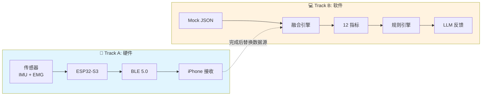
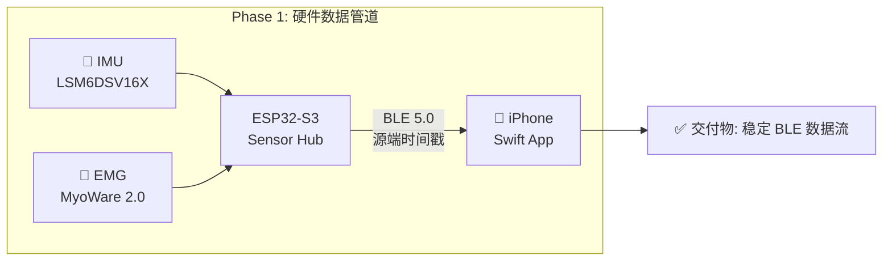
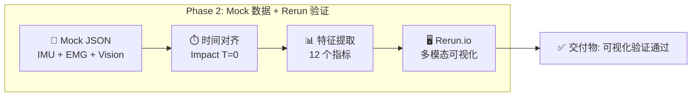
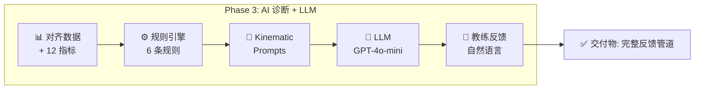
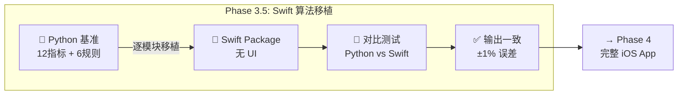
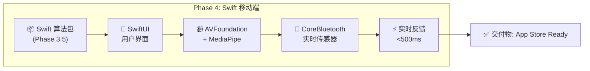

# MVP 开发计划 MVP Development Plan

> **文档角色**: 开发规划 - MVP 阶段的详细开发计划、验收标准和路线图
>
> **目标读者**: 开发团队、项目经理
>
> **阅读时间**: 20分钟
>
> **状态**: 活跃开发中 (MVP 完成后归档)

---

## 1. MVP 概述

### 1.1 MVP 目标

**一句话**: 验证三模态数据 (Vision + IMU + EMG) 能否精确对齐，并产生有意义的教练反馈。

!!! warning "MVP 测试的是管道集成，不是算法精度"
    这是最重要的范围边界。理解这一点可以避免过度工程。

### 1.2 相关文档

> **详细规格文档** (本文档仅提供开发计划，详细规格见以下文档):
>
> - [系统设计](./system-design.md) — 产品愿景、完整架构、技术栈
> - [数据管道与AI](./data-pipeline-and-ai.md) — 时间同步、Kinematic Prompts、诊断规则
> - [传感器指标映射](./sensor-metric-mapping.md) — 12个指标的完整定义与算法
> - [2025年12月关键决策](../decisions/architecture-decisions-2025-12-23.md) — 硬件选型、Sensor Hub 架构
> - [移动开发指南](../../development/mobile/development.md) — Swift iOS 开发

---

## 2. 并行开发策略

**核心思路**: 硬件开发周期长（PCB打样、固件调试），软件不应等待。通过 Mock Data 解耦，硬件和软件可以并行推进。



**合流时机**: Track A 完成稳定 BLE 传输后，将 Mock Data 替换为 Real Data，代码层面几乎不需要改动。

---

## 3. MVP 验证范围

### 3.1 正在测试 (Pipeline Integration)

| 测试项 | 验证标准 | 数据来源 |
|--------|----------|----------|
| MediaPipe 处理视频帧 | 30fps 无崩溃 | 真实视频 |
| BLE 接收 ESP32 数据 | 数据包完整 | 真实硬件 或 模拟器 |
| 时间戳跨传感器对齐 | ±30ms 容差内 | 混合 (真实+模拟) |
| 融合逻辑产生输出 | 返回有效结构 | 任意输入 |
| UI 渲染反馈 | 用户可见 | Pipeline 输出 |

### 3.2 不测试 (Post-MVP 范围)

| 延后项 | 原因 | 何时测试 |
|--------|------|----------|
| EMG 激活检测精度 (<5ms) | 需要真实肌肉数据 | Post-MVP 硬件就绪 |
| IMU 相位检测鲁棒性 | 需要噪声数据 | Post-MVP 硬件就绪 |
| 阈值校准正确性 | 需要大量样本 | Post-MVP 用户测试 |
| 真实肌肉信号处理 | 需要 MyoWare 硬件 | Post-MVP |

### 3.3 模拟数据策略

MVP 阶段使用**最简单可行**的模拟数据：

| 传感器 | 数据来源 | 复杂度 |
|--------|----------|--------|
| **Vision** | 真实视频 + MediaPipe | 真实数据 |
| **IMU** | 硬编码时间戳 | `{"top_ms": 600, "impact_ms": 850}` |
| **EMG** | 硬编码时间戳 | `{"core_onset_ms": 570, "forearm_onset_ms": 720}` |

```python
# MVP Mock 示例 — 故意简单
mock_emg = {"core_onset_ms": 570, "forearm_onset_ms": 720}
mock_imu = {"top_ms": 600, "impact_ms": 850}

# 真实数据
vision = mediapipe.process(real_video_frame)

# 测试管道是否运行
result = fusion_pipeline(vision, mock_imu, mock_emg)
assert result is not None  # MVP 通过!
```

### 3.4 外部参考数据

可使用 OnForm 等应用的分析结果作为 Vision 管道的参照：

1. 录制挥杆视频
2. 上传到 OnForm → 获取 X-Factor、节奏等计算值
3. 用同一视频运行 MediaPipe → 比较结果
4. 误差在合理范围内 → Vision 管道验证通过

---

## 4. MVP 核心输出

!!! abstract "🎯 MVP 的核心价值: Time-Aligned FusionResult"

    **MVP 的最重要输出不是"完美的分析结果"，而是验证三模态数据能否精确对齐。**

    ```text
    ┌─────────────────────────────────────────────────────────────────────────────┐
    │                    MVP 核心输出: 时间对齐的 FusionResult                      │
    ├─────────────────────────────────────────────────────────────────────────────┤
    │                                                                             │
    │   在 Rerun 时间轴上同步显示:                                                 │
    │                                                                             │
    │   📷 MediaPipe: ──●──●──●──●──●──●──●──●──●──●── (30fps 骨架)              │
    │                           ↓ Top              ↓ Impact                       │
    │   🔄 Mock IMU:  ─────────────●───────────────●──── (峰值/零交叉)            │
    │                           ↓                  ↓                              │
    │   💪 Mock EMG:  ─────────●─────────────────●────── (Core/Forearm onset)     │
    │                         ↓                                                   │
    │                    Core onset 应该在 Top 之前                                │
    │                                                                             │
    │   ═══════════════════════════════════════════════════════════════════════  │
    │                                                                             │
    │   ✅ MVP 验证目标:                                                          │
    │   1. 三条数据流能否对齐到 <10ms?                                            │
    │   2. IMU 峰值是否对应视频中的 Impact 帧?                                    │
    │   3. EMG Core onset 是否在 Top 之前?                                        │
    │   4. 计算的 X-Factor 是否与骨架角度一致?                                    │
    │                                                                             │
    │   这些问题只有在 Rerun 中才能直观验证！                                      │
    │                                                                             │
    └─────────────────────────────────────────────────────────────────────────────┘
    ```

---

## 5. MVP 模式聚焦

!!! info "MVP 只实现 Mode 3，其他模式放到 Post-MVP"

    | 模式 | 名称 | 实时性 | 阶段 | 原因 |
    |-----|------|--------|-----|------|
    | **Mode 3** | Full Speed | ❌ 后处理 | ✅ MVP | 无实时约束，最易调试 |
    | Mode 1 | Setup Check | ⚠️ 准实时 | Post-MVP | 需要静态姿态检测 |
    | Mode 2 | Slow Motion | ✅ 实时 | Post-MVP | 实时处理复杂度高 |

    **为什么先做 Mode 3?**

    1. **无实时约束** — 可以反复回放同一录制，逐帧调试
    2. **完整数据** — 录制完成后数据完整，不会丢帧
    3. **Rerun 友好** — 录制 .rrd 文件分享给团队协作
    4. **优先验证核心价值** — 时间对齐是否正确比实时性更重要

---

## 6. MVP 阶段划分

MVP 分为 **5 个阶段**，每个阶段有明确的交付物和验收标准。

> 📐 **架构决策**: Python Desktop 与 Swift Mobile 的关系见 [ADR-0008 Desktop→Mobile 架构](../decisions/0008-desktop-to-mobile-architecture.md)

### 6.1 Phase 1: 硬件数据管道



| 验收项 | 目标值 |
|--------|--------|
| BLE 延迟 | <30ms |
| 丢包率 | <1% |
| 连续运行 | >30min 无断连 |

> 📐 **详细规格**: [ADR-0002 IMU选型](../decisions/0002-lsm6dsv16x-imu.md) | [ADR-0005 MCU选型](../decisions/0005-esp32-s3-microcontroller.md) | [硬件购买清单](../decisions/architecture-decisions-2025-12-23.md#43-硬件购买清单)

---

### 6.2 Phase 2: Mock 数据管道 + 可视化验证



| 验收项 | 目标值 |
|--------|--------|
| 时间对齐精度 | <10ms |
| 指标提取准确率 | >90% (与标注数据对比) |
| Rerun 可视化 | 人工审核通过 |

> 📐 **详细规格**: [数据管道与AI](./data-pipeline-and-ai.md) | [传感器指标映射](./sensor-metric-mapping.md)

---

### 6.3 Phase 3: AI 诊断 + LLM 反馈



| 验收项 | 目标值 |
|--------|--------|
| 规则准确率 | 100% (已知案例) |
| 反馈可读性 | 用户评分 >4/5 |

> 📐 **详细规格**: [数据管道与AI §4-5](./data-pipeline-and-ai.md#4-诊断规则引擎) | [实时反馈规格](../specs/real-time-feedback.md)

---

### 6.4 Phase 3.5: Swift 算法移植 (Bridge Phase)

> ⚠️ **为什么需要这个阶段**: Phase 1-3 在 Python Desktop 环境验证算法，Phase 4 需要完整 iOS App。
> 此阶段专注于算法移植，不做 UI，确保 Python→Swift 输出一致性。



| 验收项 | 目标值 |
|--------|--------|
| 12 指标计算一致性 | Python vs Swift 输出差异 <1% |
| 6 规则触发一致性 | 相同输入 → 相同触发结果 |
| 单元测试覆盖 | >90% 核心算法 |

**移植清单**:

| Python 模块 | Swift 目标 | 依赖 |
|-------------|-----------|------|
| `sensor_fusion.py` | `SensorFusion.swift` | - |
| `feature_extraction.py` | `FeatureExtraction.swift` | Accelerate framework |
| `rule_engine.py` | `RuleEngine.swift` | - |
| `kinematic_prompts.py` | `KinematicPrompts.swift` | - |

> 📐 **详细规格**: [ADR-0008 Desktop→Mobile](../decisions/0008-desktop-to-mobile-architecture.md) | [SDK选型](../decisions/sdk-selection.md)

---

### 6.5 Phase 4: Swift 移动端集成

> 前置条件: Phase 3.5 完成，Swift 算法包已验证



| 验收项 | 目标值 |
|--------|--------|
| E2E 延迟 | <500ms (采集→反馈) |
| Mock→Real 切换 | 无代码改动，配置切换成功 |
| 回归一致性 | >95% (Mock vs Real) |

> 📐 **详细规格**: [ADR-0007 Swift原生](../decisions/0007-swift-ios-native.md) | [SDK选型](../decisions/sdk-selection.md) | [移动开发指南](../../development/mobile/development.md)

---

## 7. 验收标准总览

| Phase | 关键验收项 | 目标值 | 详细规格 |
|-------|-----------|--------|----------|
| **Phase 1** | BLE 延迟 | <30ms | [硬件决策](../decisions/architecture-decisions-2025-12-23.md) |
| **Phase 1** | 连续运行 | >30min 无断连 | - |
| **Phase 2** | 时间对齐精度 | <10ms | [数据管道](./data-pipeline-and-ai.md) |
| **Phase 2** | Rerun 可视化 | 人工审核通过 | [可视化工具](../decisions/visualization-tools-evaluation.md) |
| **Phase 3** | 规则准确率 | 100% (已知案例) | [规则引擎](./data-pipeline-and-ai.md#4-诊断规则引擎) |
| **Phase 3** | 反馈可读性 | 用户评分 >4/5 | - |
| **Phase 3.5** | Python↔Swift 一致性 | 输出差异 <1% | [ADR-0008](../decisions/0008-desktop-to-mobile-architecture.md) |
| **Phase 3.5** | Swift 单元测试 | >90% 覆盖率 | - |
| **Phase 4** | E2E 延迟 | <500ms | [实时反馈规格](../specs/real-time-feedback.md) |
| **Phase 4** | Mock→Real 切换 | 配置切换成功 | - |

---

## 8. MVP 技术规格

### 8.1 技术规格索引

| 规格类别 | 详细文档 | 核心内容 |
|----------|----------|----------|
| **12 测量指标** | [传感器指标映射](./sensor-metric-mapping.md) | Vision (6) + IMU (4) + EMG (2) |
| **6 诊断规则** | [数据管道与AI §4](./data-pipeline-and-ai.md#4-诊断规则引擎) | P0 (2条) + P1 (4条) |
| **反馈模式** | [实时反馈规格](../specs/real-time-feedback.md) | 3种模式: Setup / Slow Motion / Full Speed |
| **硬件选型** | [ADR-0002](../decisions/0002-lsm6dsv16x-imu.md), [ADR-0005](../decisions/0005-esp32-s3-microcontroller.md) | LSM6DSV16X IMU + ESP32-S3 MCU |
| **SDK 选型** | [SDK选型](../decisions/sdk-selection.md) | MediaPipe + NeuroKit2 + imufusion |
| **移动端架构** | [ADR-0007](../decisions/0007-swift-ios-native.md) | Swift iOS 原生 (非 Flutter) |
| **升级路径** | [模块化架构](./modular-architecture.md) | LEGO block 可替换设计 |

### 8.2 MVP 6 条诊断规则

!!! info "为什么 MVP 选这 6 条规则？"
    MVP 不追求覆盖所有问题，而是精选**最常见、最影响挥杆质量、且能体现 EMG 差异化**的规则：

    - **P0 规则 (2条)**: 必须 EMG 才能检测，竞品无法复制，这是核心差异化
    - **P1 规则 (4条)**: 覆盖节奏、旋转、释放等常见问题，Vision/IMU 可检测

| 优先级 | 规则 | 条件 | 数据源 | 选中原因 |
|--------|------|------|--------|----------|
| P0 | 倒序运动链 | 前臂先于核心激活 (gap < -20ms) | EMG | 最常见业余错误，EMG 独有洞察 |
| P0 | 过度手臂挥杆 | Forearm/Core ratio > 1.3 | EMG | 力量浪费根源，EMG 独有洞察 |
| P1 | X-Factor 不足 | X-Factor < 20° | Vision | 距离不够的核心原因 |
| P1 | 节奏过快 | Downswing < 0.20s | IMU | 稳定性问题，易检测 |
| P1 | 节奏过慢 | Downswing > 0.40s | IMU | 节奏失衡，影响连贯性 |
| P1 | 早释放 | Wrist release < 40% downswing | IMU | 力量传递断裂 |

### 8.3 MVP 核心约束

| 约束 | 目标值 | 验证方式 |
|------|--------|----------|
| E2E 延迟 (采集→反馈) | <500ms | Instruments profiling |
| BLE 丢包率 | <1% | 30min 连续运行测试 |
| 规则准确率 | 100% (已知案例) | 回归测试用例 |
| 时间对齐精度 | <10ms | Mock 数据验证 |

---

## 9. Rerun 集成时机

基于 MVP 阶段划分的 Rerun 使用时机：

| MVP 阶段 | Rerun 使用场景 | 优先级 |
|---------|---------------|--------|
| **Phase 1: 硬件数据管道** | 验证 BLE 数据包完整性、时间戳连续性 | 🔵 推荐 |
| **Phase 2: Mock 数据 + 可视化** | 可视化三模态时间对齐、验证 12 指标计算 | ⭐ 必须 |
| **Phase 3: AI 诊断 + LLM** | 调优规则阈值、录制问题场景反复回放 | ⭐ 必须 |
| **Phase 3.5: Swift 移植** | 对比 Python vs Swift 输出一致性 | 🔵 推荐 |
| **Phase 4: 移动端集成** | 对比移动端 vs 桌面端检测结果 | 🔵 推荐 |

!!! tip "建议: 从 Phase 2 第一天就集成 Rerun，这是验证时间对齐的核心工具"

---

## 10. MVP 验证假设与风险

### 10.1 需要验证的假设

| 假设 | 验证方法 | Phase | 状态 |
|------|----------|-------|------|
| MediaPipe 33关键点足够计算X-Factor | GolfDB测试 | Phase 2 | 🔄 待验证 |
| Mock EMG数据能代表真实模式 | 与研究数据对比 | Phase 3 | 🔄 待验证 |
| 用户能理解LLM生成的反馈 | 用户测试 | Phase 4 | 🔄 待验证 |
| Python↔Swift 算法输出一致 | 对比测试 | Phase 3.5 | 🔄 待验证 |

### 10.2 待定决策

| 决策 | 选项 | 决策时机 |
|------|------|----------|
| Ghost Overlay | 简化版 / 完整版 / 跳过 | Phase 4 设计阶段 |
| 录制保存功能 | 本地 / 云端 / 跳过 | Phase 4 完成后 |
| 数据库选型 | SQLite / Realm / CloudKit | Post-MVP 规划 |

### 10.3 已知风险

| 风险 | 影响 | 缓解措施 | 状态 |
|------|------|----------|------|
| MediaPipe iOS 性能不足 | 帧率低 | 降低分辨率, GPU 加速 | 🔄 Phase 4 验证 |
| EMG 真实数据与 Mock 差异大 | 规则需重调 | Post-MVP 迭代 | 🔄 Phase 3 验证 |
| 用户不接受穿戴设备 | 产品定位失败 | 先验证纯 Vision 版本 | 🔄 用户测试 |

---

## 11. Post-MVP 路线图

MVP (Phase 1 → 2 → 3 → 3.5 → 4) 完成后的扩展方向:

### 11.1 技术扩展

| 方向 | 文档 | 内容 | 依赖 |
|------|------|------|------|
| **个性化调优** | [个性化规格](../specs/personalization.md) | 按性别/年龄/体型调整阈值 | Phase 4 完成 |
| **EMG 扩展** | [传感器映射](./sensor-metric-mapping.md) | 2→4→6 通道 EMG | 硬件验证 |
| **高级模型** | [模块化架构](./modular-architecture.md) | MediaPipe → RTMPose → ViTPose++ | 性能基准 |
| **球杆追踪** | [可视化工具](../decisions/visualization-tools-evaluation.md) | TAPIR 替代 Trackman 雷达 | Post-MVP |
| **Mode 1/2** | [实时反馈规格](../specs/real-time-feedback.md) | Setup Check + Slow Motion | Post-MVP |

### 11.2 产品扩展

| 方向 | 内容 | 决策时机 |
|------|------|----------|
| **云端同步** | 趋势分析、跨设备数据 | Phase 4 完成后 |
| **社交功能** | 挥杆对比、分享 | 用户验证后 |
| **教练端** | 多学员管理、远程指导 | B2B 验证后 |

> 💡 **调试工具**: [Rerun.io](https://rerun.io) 用于 Vision+IMU+EMG 多模态可视化，贯穿所有阶段。

---

## 12. 版本历史

| 版本 | 日期 | 修改内容 |
|------|------|----------|
| 1.0 | 2025-12-27 | 初始版本，从 system-design.md 拆分 MVP 相关内容 |

---

**最后更新**: 2025-12-27
**维护者**: Movement Chain AI Team
