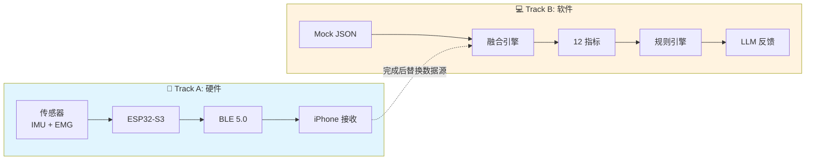
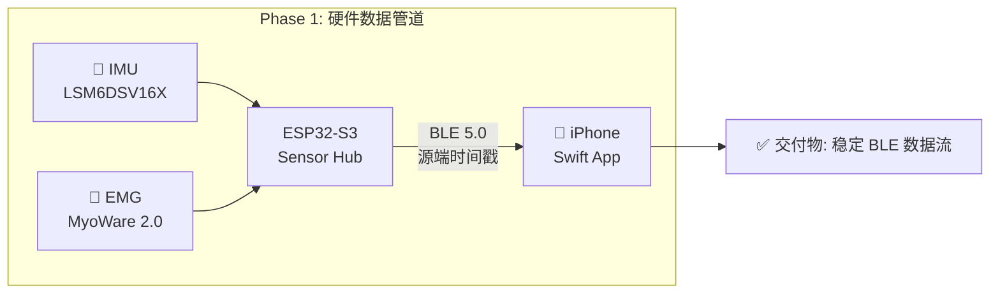
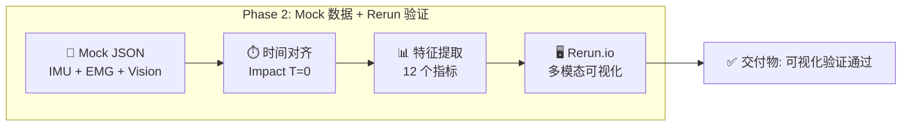
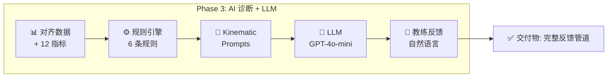
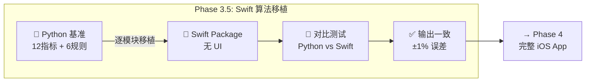
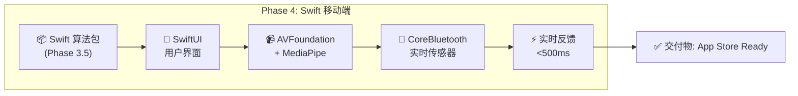

# 系统设计 System Design

> **文档角色**: 总纲 (Hub) - 系统核心设计文档，所有详细规格文档的入口
>
> **目标读者**: 技术负责人、新加入的团队成员、投资者
>
> **阅读时间**: 25分钟

---

## 1. 产品愿景与最终目标

### 1.1 产品愿景

**一句话**: 基于 Vision + IMU + EMG 三模态融合的高尔夫挥杆分析系统，通过 AI 教练提供可执行的改进建议。

**核心差异化**: EMG 肌肉激活检测 — 竞品只能告诉你"什么错了"，我们能告诉你"为什么错了"。

### 1.2 完整系统架构(目标态)

```text
┌─────────────────────────────────────────────────────────────────────────────────────┐
│                     Movement Chain AI — 完整产品数据流                                │
│                     (端到端产品工作原理: 从挥杆到反馈)                                   │
├─────────────────────────────────────────────────────────────────────────────────────┤
│                                                                                     │
│  ╔═══════════════════════════════════════════════════════════════════════════════╗  │
│  ║  STAGE 1: 用户挥杆 (User Swings)                                               ║  │
│  ║                                                                               ║  │
│  ║                        🏌️ 高尔夫球手挥杆                                        ║  │
│  ║                             │                                                 ║  │
│  ║      ┌──────────────────────┼──────────────────────┐                          ║  │
│  ║      │                      │                      │                          ║  │
│  ║      ▼                      ▼                      ▼                          ║  │
│  ║ 📹 iPhone Camera       💪 Wearable Sensors    💪 Wearable Sensors             ║  │
│  ║  (Vision 30fps)         (Arm Hub)             (Core Hub)                      ║  │
│  ╚═══════════════════════════════════════════════════════════════════════════════╝  │
│                                       │                                             │
│  ╔═══════════════════════════════════════════════════════════════════════════════╗  │
│  ║  STAGE 2: 数据采集层 (Data Collection)                                          ║  │
│  ║                                                                                ║  │
│  ║  ┌─────────────────┐     ┌─────────────────────┐    ┌─────────────────────┐     ║  │
│  ║  │  📹 Vision       │    │  🔄 Arm Hub         │    │  🔄 Core Hub        │    ║  │
│  ║  │  ─────────────   │    │  ─────────────────  │    │  ─────────────────  │    ║  │
│  ║  │  • iPhone Camera │    │  • ESP32-S3         │    │  • ESP32-S3         │    ║  │
│  ║  │  • MediaPipe iOS │    │  • LSM6DSV16X (IMU) │    │  • LSM6DSV16X (IMU) │    ║  │
│  ║  │  • 33 keypoints  │    │  • MyoWare 2.0 (EMG)│    │  • MyoWare 2.0 (EMG)│    ║  │
│  ║  │  • 30 fps        │    │  • 共享时钟源         │    │  • 共享时钟源         │    ║  │
│  ║  └────────┬─────────┘    └─────────┬───────────┘    └─────────┬───────────┘    ║  │
│  ║           │                        │                          │               ║  │
│  ║           │                        └───────────┬──────────────┘               ║  │
│  ║           │                                    │                              ║  │
│  ║           │ Native SDK                         │ BLE 5.0                      ║  │
│  ║           │ (No latency)                       │ (源端时间戳，消除抖动)          ║  │
│  ║           │                                    │                              ║  │
│  ║           └──────────────────┬─────────────────┘                              ║  │
│  ║                              ▼                                                ║  │
│  ║                    ┌─────────────────────┐                                    ║  │
│  ║                    │  📱 Swift iOS App    │                                    ║  │
│  ║                    │  • MediaPipeTasksVision                                  ║  │
│  ║                    │  • CoreBluetooth                                         ║  │
│  ║                    │  • 数据接收与缓存                                          ║  │
│  ║                    └─────────┬───────────┘                                    ║  │
│  ║                                                                               ║  │
│  ║  【空间姿态 WHAT】       【运动时序 WHEN】         【肌肉激活 WHY】               ║  │
│  ╚══════════════════════════════│════════════════════════════════════════════════╝  │
│                                 │                                                   │
│  ╔══════════════════════════════│════════════════════════════════════════════════╗  │
│  ║  STAGE 3: 传感器融合层 (Sensor Fusion)                                          ║  │
│  ║                              ▼                                                ║  │
│  ║           ┌────────────────────────────────────────────┐                      ║  │
│  ║           │          ⏱️ 时间对齐引擎                     │                      ║  │
│  ║           │  ─────────────────────────────────         │                      ║  │
│  ║           │  • IMU 作为主时钟 (1666Hz 采样)               │                      ║  │
│  ║           │  • Vision 30fps → 插值对齐到 IMU             │                      ║  │
│  ║           │  • EMG 1000Hz → 三次样条插值对齐              │                      ║  │
│  ║           │  • Impact T=0 事件 → 跨设备同步锚点           │                      ║  │
│  ║           │  • 同步精度: 同Hub <10μs, 跨Hub <500μs       │                      ║  │
│  ║           └─────────────────────┬──────────────────────┘                      ║  │
│  ║                                 │                                             ║  │
│  ║           输出: 三模态时间对齐数据 (统一时间轴)                                     ║  │
│  ╚═════════════════════════════════│═════════════════════════════════════════════╝  │
│                                    │                                                │
│  ╔═════════════════════════════════│═════════════════════════════════════════════╗  │
│  ║  STAGE 4: 特征提取层 (Feature Extraction) — 12 核心指标                          ║  │
│  ║                                 ▼                                             ║  │
│  ║  ┌──────────────────┐    ┌──────────────────┐    ┌──────────────────┐         ║  │
│  ║  │  Vision (6 指标)  │    │  IMU (4 指标)    │    │   EMG (2 指标)    │         ║  │
│  ║  │  ────────────────│    │  ────────────────│    │  ────────────────│         ║  │
│  ║  │  • X-Factor      │    │  • 峰值角速度      │    │  • 核心激活 %     │         ║  │
│  ║  │  • X-Factor延展   │    │  • 节奏比         │    │  • 核心-前臂      │         ║  │
│  ║  │  • 转肩角         │    │  • 上杆时长       │    │    时序差         │         ║  │
│  ║  │  • 转髋角         │    │  • 下杆时长       │    │                  │         ║  │
│  ║  │  • S-Factor      │    │                  │    │  🌟 核心差异化:   │         ║  │
│  ║  │  • 侧移/抬头      │    │                  │    │   "为什么" 能力    │         ║  │
│  ║  └────────┬─────────┘    └────────┬─────────┘    └────────┬─────────┘         ║  │
│  ║           │                       │                       │                   ║  │
│  ║           │      WHAT: 发生了什么   │   WHEN: 何时发生       │   WHY: 为什么发生  ║  │
│  ║           └───────────────────────┼───────────────────────┘                   ║  │
│  ║                                   │                                           ║  │
│  ║                    【12 个结构化指标】                                          ║  │
│  ╚═══════════════════════════════════│═══════════════════════════════════════════╝  │
│                                      │                                              │
│  ╔═══════════════════════════════════│═══════════════════════════════════════════╗  │
│  ║  STAGE 5: 分析诊断层 (Analysis & Diagnosis)                                    ║  │
│  ║                                   ▼                                           ║  │
│  ║  ┌─────────────────────────────────────────────────────────────────────────┐  ║  │
│  ║  │                        8 阶段挥杆检测 (GolfDB 标准)                        │  ║  │
│  ║  │  Address → Takeaway → Backswing → Top → Downswing → Impact → Follow → Finish │
│  ║  └─────────────────────────────────┬───────────────────────────────────────┘  ║  │
│  ║                                    │                                          ║  │
│  ║                                    ▼                                          ║  │
│  ║  ┌──────────────────────────────────────────────────────────────────────────┐ ║  │
│  ║  │                           规则引擎 (6 条诊断规则)                           │ ║  │
│  ║  │  ═══════════════════════════════════════════════════════════════════════ │ ║  │
│  ║  │  P0 严重问题 (必须修正):                                                   │ ║  │
│  ║  │  ❌ 倒序运动链: EMG 前臂先于核心激活 (gap < -20ms)                          │ ║  │
│  ║  │  ❌ 过度手臂挥杆: Forearm/Core ratio > 1.3                                │ ║  │
│  ║  │  ───────────────────────────────────────────────────────────────────────│ ║  │
│  ║  │  P1 重要改进:                                                             │ ║  │
│  ║  │  ⚠️ 差异角过小: X-Factor < 20°                                            │ ║  │
│  ║  │  ⚠️ 节奏过快: Downswing < 0.20s                                           │ ║  │
│  ║  │  ⚠️ 节奏过慢: Downswing > 0.40s                                           │ ║  │
│  ║  │  ⚠️ 早释放: Wrist release < 40% downswing                                 │ ║  │
│  ║  └──────────────────────────────────┬───────────────────────────────────────┘ ║  │
│  ║                                     │                                         ║  │
│  ║                                     ▼                                         ║  │
│  ║  ┌──────────────────────────────────────────────────────────────────────────┐ ║  │
│  ║  │                    ⭐ 因果归因诊断 (核心差异化能力)                           │ ║  │
│  ║  │  ═══════════════════════════════════════════════════════════════════════  │ ║  │
│  ║  │  竞品 (Vision-only): "你的 X-Factor 不足" (只能说 WHAT)                      │ ║  │
│  ║  │  我们 (三模态融合): "你的核心肌群在下杆时未激活，导致 X-Factor 不足"              │ ║  │
│  ║  │                    → 同时告诉 WHAT + WHY + HOW TO FIX                      │ ║  │
│  ║  └──────────────────────────────────┬───────────────────────────────────────┘ ║  │
│  ║                                     │                                         ║  │
│  ║                    输出: 触发的规则 + 置信度分数 + 根因诊断                        ║  │
│  ╚═════════════════════════════════════│═════════════════════════════════════════╝  │
│                                        │                                            │
│  ╔═════════════════════════════════════│═════════════════════════════════════════╗  │
│  ║  STAGE 6: AI 反馈生成层 (AI Feedback Generation)                                ║  │
│  ║                                     ▼                                         ║  │
│  ║  ┌──────────────────────────────────────────────────────────────────────────┐ ║  │
│  ║  │                    Kinematic Prompts (结构化提示词)                        │ ║  │
│  ║  │  ═══════════════════════════════════════════════════════════════════════ │ ║  │
│  ║  │  将传感器数据结构化为 LLM 可理解格式:                                         │ ║  │
│  ║  │                                                                          │ ║  │
│  ║  │  "X-Factor: 42° ✅ (正常范围 35-55°)                                      │ ║  │
│  ║  │   Core activation: 30% ⚠️ (低于 50% 阈值)                                 │ ║  │
│  ║  │   Timing: 核心先于前臂 150ms ✅                                            │ ║  │
│  ║  │   Triggered rule: FALSE_COIL (P0)"                                       │ ║  │
│  ║  └──────────────────────────────────┬───────────────────────────────────────┘ ║  │
│  ║                                     │                                         ║  │
│  ║                                     ▼                                         ║  │
│  ║  ┌──────────────────────────────────────────────────────────────────────────┐ ║  │
│  ║  │                         LLM 翻译引擎                                      │ ║  │
│  ║  │  ═══════════════════════════════════════════════════════════════════════ │ ║  │
│  ║  │  输入: 结构化 Kinematic Prompts                                            │ ║  │
│  ║  │  处理: GPT-4o-mini / Gemini 2.5 Flash (200-500ms)                         │ ║  │
│  ║  │  输出: 教练级自然语言反馈                                                    │ ║  │
│  ║  │  ─────────────────────────────────────────────────────────────────────── │ ║  │
│  ║  │  示例输出:                                                                │ ║  │
│  ║  │  "看起来转够了 (42°)，但核心没发力 (30%)。                                    │ ║  │
│  ║  │   在下杆前收紧腹肌，让身体带动手臂。"                                          │ ║  │
│  ║  └──────────────────────────────────┬───────────────────────────────────────┘ ║  │
│  ╚═════════════════════════════════════│═════════════════════════════════════════╝  │
│                                        │                                            │
│  ╔═════════════════════════════════════│═════════════════════════════════════════╗  │
│  ║  STAGE 7: 用户反馈层 (User Feedback) — 挥杆后 <500ms 内呈现                       ║  │
│  ║                                     ▼                                         ║  │
│  ║  ┌──────────────┐ ┌──────────────┐ ┌──────────────┐ ┌──────────────┐          ║  │
│  ║  │ 📱 App UI    │ │ 🔊 语音 TTS   │ │ 📳 触觉反馈   │ │ 👻 Ghost     │          ║  │
│  ║  │ ──────────── │ │ ──────────── │ │ ──────────── │ │ ──────────── │          ║  │
│  ║  │ • 简洁指标    │ │ • 教练语音     │ │ • 振动提示    │ │ • 骨架叠加    │          ║  │
│  ║  │   1-3 个     │ │ • 离线可用     │ │ • 即时反馈    │ │ • 动作对比    │          ║  │
│  ║  │ • 颜色编码    │ │ AVSpeech-     │ │ • 方向指引    │ │ • 参考轨迹    │          ║  │
│  ║  │   🟢🟡🔴     │ │  Synthesizer │ │              │ │              │          ║  │
│  ║  └──────────────┘ └──────────────┘ └──────────────┘ └──────────────┘          ║  │
│  ║                                                                               ║  │
│  ║  ┌───────────────────────────────────────────────────────────────────────────┐║  │
│  ║  │                           用户体验保证                                      │║  │
│  ║  │  • 挥杆结束 → 反馈呈现: <500ms (用户无感知延迟)                                │║  │
│  ║  │  • 语音反馈: 1-2 句话，可执行 ("收紧腹肌" vs 抽象建议)                          │║  │
│  ║  │  • 视觉反馈: 最多 3 个指标，避免信息过载                                       │║  │
│  ║  │  • 趋势追踪: 连续多次挥杆的改进/退步趋势                                        │║  │
│  ║  └───────────────────────────────────────────────────────────────────────────┘║  │
│  ╚═══════════════════════════════════════════════════════════════════════════════╝  │
│                                                                                     │
└─────────────────────────────────────────────────────────────────────────────────────┘
```

**核心价值链** (数据流: Stage 1 → Stage 7):

| Stage | 层级 | 功能 | 关键技术 | 价值 |
|-------|------|------|----------|------|
| 1 | 用户挥杆 | 输入事件 | - | 触发数据采集 |
| 2 | 数据采集层 | 三模态数据采集 | ESP32 Sensor Hub + Swift App + MediaPipe | WHAT + WHEN + WHY 完整信息 |
| 3 | 传感器融合层 | 时间对齐 <10μs | IMU 主时钟 + Impact T=0 对齐 | 数据可比性、因果推断基础 |
| 4 | 特征提取层 | 12 个生物力学指标 | MediaPipe + NeuroKit2 + scipy | 从原始数据到可分析指标 |
| 5 | 分析诊断层 | 规则引擎 + 因果归因 | 8阶段检测、6条规则、因果诊断 | **核心差异化**: 告诉用户"为什么" |
| 6 | AI反馈层 | Kinematic Prompts → LLM | GPT-4o-mini / Gemini | 教练级自然语言反馈 |
| 7 | 用户反馈层 | 多模态反馈 <500ms | App UI、TTS、触觉、Ghost | 用户可执行的改进建议 |

---

## 2. MVP 开发计划

> **详细规格文档** (本节仅提供高层视图，详细规格见以下文档):
>
> - [数据管道与AI](./data-pipeline-and-ai.md) — 时间同步、Kinematic Prompts、诊断规则
> - [传感器指标映射](./sensor-metric-mapping.md) — 12个指标的完整定义与算法
> - [2025年12月关键决策](../decisions/architecture-decisions-2025-12-23.md) — 硬件选型、Sensor Hub 架构
> - [移动开发指南](../../development/mobile/development.md) — Swift iOS 开发

### 2.1 并行开发策略

**核心思路**: 硬件开发周期长（PCB打样、固件调试），软件不应等待。通过 Mock Data 解耦，硬件和软件可以并行推进。



**合流时机**: Track A 完成稳定 BLE 传输后，将 Mock Data 替换为 Real Data，代码层面几乎不需要改动。

---

### 2.1.1 MVP 验证范围 (最重要的边界定义)

!!! warning "MVP 测试的是管道集成，不是算法精度"
    这是最重要的范围边界。理解这一点可以避免过度工程。

#### ✅ MVP 正在测试 (Pipeline Integration)

| 测试项 | 验证标准 | 数据来源 |
|--------|----------|----------|
| MediaPipe 处理视频帧 | 30fps 无崩溃 | 真实视频 |
| BLE 接收 ESP32 数据 | 数据包完整 | 真实硬件 或 模拟器 |
| 时间戳跨传感器对齐 | ±30ms 容差内 | 混合 (真实+模拟) |
| 融合逻辑产生输出 | 返回有效结构 | 任意输入 |
| UI 渲染反馈 | 用户可见 | Pipeline 输出 |

#### ❌ MVP 不测试 (Phase 2+ 范围)

| 延后项 | 原因 | 何时测试 |
|--------|------|----------|
| EMG 激活检测精度 (<5ms) | 需要真实肌肉数据 | Phase 2 硬件就绪 |
| IMU 相位检测鲁棒性 | 需要噪声数据 | Phase 2 硬件就绪 |
| 阈值校准正确性 | 需要大量样本 | Phase 2 用户测试 |
| 真实肌肉信号处理 | 需要 MyoWare 硬件 | Phase 2 |

#### 模拟数据策略 Mock Data Strategy

MVP 阶段使用**最简单可行**的模拟数据：

| 传感器 | 数据来源 | 复杂度 |
|--------|----------|--------|
| **Vision** | 真实视频 + MediaPipe | 真实数据 |
| **IMU** | 硬编码时间戳 | `{"top_ms": 600, "impact_ms": 850}` |
| **EMG** | 硬编码时间戳 | `{"core_onset_ms": 570, "forearm_onset_ms": 720}` |

```python
# MVP Mock 示例 — 故意简单
mock_emg = {"core_onset_ms": 570, "forearm_onset_ms": 720}
mock_imu = {"top_ms": 600, "impact_ms": 850}

# 真实数据
vision = mediapipe.process(real_video_frame)

# 测试管道是否运行
result = fusion_pipeline(vision, mock_imu, mock_emg)
assert result is not None  # MVP 通过!
```

#### 外部参考数据 External Reference

可使用 OnForm 等应用的分析结果作为 Vision 管道的参照：

1. 录制挥杆视频
2. 上传到 OnForm → 获取 X-Factor、节奏等计算值
3. 用同一视频运行 MediaPipe → 比较结果
4. 误差在合理范围内 → Vision 管道验证通过

---

### 2.2 MVP 阶段划分

MVP 分为 **5 个阶段**，每个阶段有明确的交付物和验收标准。

> 📐 **架构决策**: Python Desktop 与 Swift Mobile 的关系见 [ADR-0008 Desktop→Mobile 架构](../decisions/0008-desktop-to-mobile-architecture.md)

#### Phase 1: 硬件数据管道



| 验收项 | 目标值 |
|--------|--------|
| BLE 延迟 | <30ms |
| 丢包率 | <1% |
| 连续运行 | >30min 无断连 |

> 📐 **详细规格**: [ADR-0002 IMU选型](../decisions/0002-lsm6dsv16x-imu.md) | [ADR-0005 MCU选型](../decisions/0005-esp32-s3-microcontroller.md) | [硬件购买清单](../decisions/architecture-decisions-2025-12-23.md#43-硬件购买清单)

---

#### Phase 2: Mock 数据管道 + 可视化验证



| 验收项 | 目标值 |
|--------|--------|
| 时间对齐精度 | <10ms |
| 指标提取准确率 | >90% (与标注数据对比) |
| Rerun 可视化 | 人工审核通过 |

> 📐 **详细规格**: [数据管道与AI](./data-pipeline-and-ai.md) | [传感器指标映射](./sensor-metric-mapping.md)

---

#### Phase 3: AI 诊断 + LLM 反馈



| 验收项 | 目标值 |
|--------|--------|
| 规则准确率 | 100% (已知案例) |
| 反馈可读性 | 用户评分 >4/5 |

> 📐 **详细规格**: [数据管道与AI §4-5](./data-pipeline-and-ai.md#4-诊断规则引擎) | [实时反馈规格](../specs/real-time-feedback.md)

---

#### Phase 3.5: Swift 算法移植 (Bridge Phase)

> ⚠️ **为什么需要这个阶段**: Phase 1-3 在 Python Desktop 环境验证算法，Phase 4 需要完整 iOS App。
> 此阶段专注于算法移植，不做 UI，确保 Python→Swift 输出一致性。



| 验收项 | 目标值 |
|--------|--------|
| 12 指标计算一致性 | Python vs Swift 输出差异 <1% |
| 6 规则触发一致性 | 相同输入 → 相同触发结果 |
| 单元测试覆盖 | >90% 核心算法 |

**移植清单**:

| Python 模块 | Swift 目标 | 依赖 |
|-------------|-----------|------|
| `sensor_fusion.py` | `SensorFusion.swift` | - |
| `feature_extraction.py` | `FeatureExtraction.swift` | Accelerate framework |
| `rule_engine.py` | `RuleEngine.swift` | - |
| `kinematic_prompts.py` | `KinematicPrompts.swift` | - |

> 📐 **详细规格**: [ADR-0008 Desktop→Mobile](../decisions/0008-desktop-to-mobile-architecture.md) | [SDK选型](../decisions/sdk-selection.md)

---

#### Phase 4: Swift 移动端集成

> 前置条件: Phase 3.5 完成，Swift 算法包已验证



| 验收项 | 目标值 |
|--------|--------|
| E2E 延迟 | <500ms (采集→反馈) |
| Mock→Real 切换 | 无代码改动，配置切换成功 |
| 回归一致性 | >95% (Mock vs Real) |

> 📐 **详细规格**: [ADR-0007 Swift原生](../decisions/0007-swift-ios-native.md) | [SDK选型](../decisions/sdk-selection.md) | [移动开发指南](../../development/mobile/development.md)

---

### 2.3 验收标准总览

| Phase | 关键验收项 | 目标值 | 详细规格 |
|-------|-----------|--------|----------|
| **Phase 1** | BLE 延迟 | <30ms | [硬件决策](../decisions/architecture-decisions-2025-12-23.md) |
| **Phase 1** | 连续运行 | >30min 无断连 | - |
| **Phase 2** | 时间对齐精度 | <10ms | [数据管道](./data-pipeline-and-ai.md) |
| **Phase 2** | Rerun 可视化 | 人工审核通过 | [可视化工具](../decisions/visualization-tools-evaluation.md) |
| **Phase 3** | 规则准确率 | 100% (已知案例) | [规则引擎](./data-pipeline-and-ai.md#4-诊断规则引擎) |
| **Phase 3** | 反馈可读性 | 用户评分 >4/5 | - |
| **Phase 3.5** | Python↔Swift 一致性 | 输出差异 <1% | [ADR-0008](../decisions/0008-desktop-to-mobile-architecture.md) |
| **Phase 3.5** | Swift 单元测试 | >90% 覆盖率 | - |
| **Phase 4** | E2E 延迟 | <500ms | [实时反馈规格](../specs/real-time-feedback.md) |
| **Phase 4** | Mock→Real 切换 | 配置切换成功 | - |

---

## 3. MVP 技术规格 (Quick Reference)

> 本节为快速参考索引。详细规格见各专题文档，避免重复维护。

### 3.1 技术规格索引

| 规格类别 | 详细文档 | 核心内容 |
|----------|----------|----------|
| **12 测量指标** | [传感器指标映射](./sensor-metric-mapping.md) | Vision (6) + IMU (4) + EMG (2) |
| **6 诊断规则** | [数据管道与AI §4](./data-pipeline-and-ai.md#4-诊断规则引擎) | P0 (2条) + P1 (4条)，见 [§3.2 诊断规则详解](#32-诊断规则详解) |
| **反馈模式** | [实时反馈规格](../specs/real-time-feedback.md) | 3种模式: Setup / Slow Motion / Full Speed |
| **硬件选型** | [ADR-0002](../decisions/0002-lsm6dsv16x-imu.md), [ADR-0005](../decisions/0005-esp32-s3-microcontroller.md) | LSM6DSV16X IMU + ESP32-S3 MCU |
| **SDK 选型** | [SDK选型](../decisions/sdk-selection.md) | MediaPipe + NeuroKit2 + imufusion |
| **移动端架构** | [ADR-0007](../decisions/0007-swift-ios-native.md) | Swift iOS 原生 (非 Flutter) |
| **升级路径** | [模块化架构](./modular-architecture.md) | LEGO block 可替换设计 |
| **竞品对比** | [竞品指标对比](../research/competitor-metrics-comparison.md) | vs OnForm / Sportsbox |

### 3.2 诊断规则详解 {#32-诊断规则详解}

**优先级定义** (详见 [生物力学基准 §10](../../prerequisites/foundations/biomechanics-benchmarks.md#优先级定义)):

| 优先级 | 名称 | 含义 | 反馈策略 |
|--------|------|------|----------|
| **P0** | 严重问题 | 必须修正，严重影响挥杆效果或有受伤风险 | 立即语音提醒，优先于其他反馈 |
| **P1** | 重要改进 | 影响表现，但不紧急 | 挥杆后反馈，按重要性排序 |
| P2 | 优化建议 | 锦上添花，进阶提升 | 可选反馈，留待详细分析 |
| P3 | 参考信息 | 数据展示，无明确建议 | 仅在报告中显示 |

> MVP 只实现 P0 + P1 规则，P2/P3 留待后续版本。

!!! info "为什么 MVP 选这 6 条规则？"
    MVP 不追求覆盖所有问题，而是精选**最常见、最影响挥杆质量、且能体现 EMG 差异化**的规则：

    - **P0 规则 (2条)**: 必须 EMG 才能检测，竞品无法复制，这是核心差异化
    - **P1 规则 (4条)**: 覆盖节奏、旋转、释放等常见问题，Vision/IMU 可检测

**MVP 6 条诊断规则**:

| 优先级 | 规则 | 条件 | 数据源 | 选中原因 |
|--------|------|------|--------|----------|
| P0 | 倒序运动链 | 前臂先于核心激活 (gap < -20ms) | EMG | 最常见业余错误，EMG 独有洞察 |
| P0 | 过度手臂挥杆 | Forearm/Core ratio > 1.3 | EMG | 力量浪费根源，EMG 独有洞察 |
| P1 | X-Factor 不足 | X-Factor < 20° | Vision | 距离不够的核心原因 |
| P1 | 节奏过快 | Downswing < 0.20s | IMU | 稳定性问题，易检测 |
| P1 | 节奏过慢 | Downswing > 0.40s | IMU | 节奏失衡，影响连贯性 |
| P1 | 早释放 | Wrist release < 40% downswing | IMU | 力量传递断裂 |

### 3.3 MVP 核心约束 (不可协商)

| 约束 | 目标值 | 验证方式 |
|------|--------|----------|
| E2E 延迟 (采集→反馈) | <500ms | Instruments profiling |
| BLE 丢包率 | <1% | 30min 连续运行测试 |
| 规则准确率 | 100% (已知案例) | 回归测试用例 |
| 时间对齐精度 | <10ms | Mock 数据验证 |

### 3.4 技术栈速览

```text
┌─────────────────────────────────────────────────────────────────┐
│  移动端: Swift + MediaPipeTasksVision + CoreBluetooth          │
│  后端:   Python 3.11+ + MediaPipe + NeuroKit2 + Polars         │
│  硬件:   ESP32-S3 + LSM6DSV16X (IMU) + MyoWare 2.0 (EMG)       │
│  AI:     GPT-4o-mini (LLM) + TFLite (推理) + AVSpeech (TTS)    │
└─────────────────────────────────────────────────────────────────┘
```

> 📐 **完整技术栈**: 见 [Section 4. 技术栈](#4-技术栈) | **2025年决策**: 见 [架构决策 2025-12](../decisions/architecture-decisions-2025-12-23.md)

---

## 4. 技术栈 (Quick Reference)

> 本节为快速参考。详细规格见各专题文档，避免重复维护。

### 4.1 技术栈索引

| 层级 | 详细文档 | 核心技术 |
|------|----------|----------|
| **移动端 (Swift iOS)** | [ADR-0007](../decisions/0007-swift-ios-native.md), [SDK选型](../decisions/sdk-selection.md) | MediaPipeTasksVision + CoreBluetooth + AVFoundation |
| **开发环境 (Python)** | [SDK选型](../decisions/sdk-selection.md), [架构决策](../decisions/architecture-decisions-2025-12-23.md) | MediaPipe + NeuroKit2 + Polars + Rerun.io |
| **嵌入式 (ESP32)** | [ADR-0002](../decisions/0002-lsm6dsv16x-imu.md), [ADR-0005](../decisions/0005-esp32-s3-microcontroller.md) | ESP-IDF + FreeRTOS + BLE 5.0 |
| **传感器** | [传感器指标映射](./sensor-metric-mapping.md) | LSM6DSV16X (IMU) + MyoWare 2.0 (EMG) |
| **时间同步** | [数据管道](./data-pipeline-and-ai.md#sensor-hub-架构-2025-12-推荐) | Sensor Hub + Impact T=0 对齐 |
| **硬件设计** | [硬件购买清单](../decisions/architecture-decisions-2025-12-23.md#43-硬件购买清单) | KiCad PCB 设计 |

### 4.2 开发 vs 生产架构

> 📐 **架构决策**: 见 [ADR-0008 Desktop→Mobile](../decisions/0008-desktop-to-mobile-architecture.md)

```text
┌─────────────────────────────────────────────────────────────────────────────┐
│                    Development vs Production Architecture                    │
├─────────────────────────────────────────────────────────────────────────────┤
│                                                                             │
│   DEVELOPMENT (Phase 1-3)                 PRODUCTION (Phase 4)              │
│   ───────────────────────                 ────────────────────              │
│                                                                             │
│   ┌─────────────┐                         ┌─────────────┐                   │
│   │  Python     │   Same MediaPipe        │  Swift      │                   │
│   │  Desktop    │   .tflite models   ───► │  iOS App    │                   │
│   │  + Rerun.io │                         │  On-device  │                   │
│   └─────────────┘                         └─────────────┘                   │
│        │                                        │                           │
│        ▼                                        ▼                           │
│   Mock/Real data                           Real sensors                     │
│   Visualization                            Real-time UI                     │
│   Algorithm validation                     User feedback                    │
│                                                                             │
│   PURPOSE: Debug, iterate, validate       PURPOSE: App Store product       │
│                                                                             │
└─────────────────────────────────────────────────────────────────────────────┘
```

### 4.3 混合推理架构 (Hybrid Inference)

基于 2025 最佳实践，采用 On-device + Cloud 混合架构:

| 组件 | 位置 | 延迟要求 | 理由 |
|------|------|----------|------|
| **Pose Estimation** | 📱 On-device | <33ms | 实时、隐私、离线 |
| **Sensor Fusion** | 📱 On-device | <10ms | 低延迟 |
| **Rule Engine** | 📱 On-device | <5ms | 确定性 |
| **LLM Feedback** | ☁️ Cloud API | 200-500ms | 复杂推理，挥杆后可接受 |
| **Data Sync** | ☁️ Cloud (Phase 2+) | N/A | 趋势分析、跨设备 |

> 📐 **详细规格**: [数据管道与AI](./data-pipeline-and-ai.md) | [模块化架构](./modular-architecture.md)

---

## 5. 未来路线图 (Phase 2+)

MVP (Phase 1-4) 完成后的扩展方向:

### 5.1 技术扩展

| 方向 | 文档 | 内容 | 依赖 |
|------|------|------|------|
| **个性化调优** | [个性化规格](../specs/personalization.md) | 按性别/年龄/体型调整阈值 | Phase 4 完成 |
| **EMG 扩展** | [传感器映射](./sensor-metric-mapping.md) | 2→4→6 通道 EMG | 硬件验证 |
| **高级模型** | [模块化架构](./modular-architecture.md) | MediaPipe → RTMPose → ViTPose++ | 性能基准 |
| **球杆追踪** | [可视化工具](../decisions/visualization-tools-evaluation.md) | TAPIR 替代 Trackman 雷达 | Phase 2+ |

### 5.2 产品扩展

| 方向 | 内容 | 决策时机 |
|------|------|----------|
| **云端同步** | 趋势分析、跨设备数据 | Phase 4 完成后 |
| **社交功能** | 挥杆对比、分享 | 用户验证后 |
| **教练端** | 多学员管理、远程指导 | B2B 验证后 |

> 💡 **调试工具**: [Rerun.io](https://rerun.io) 用于 Vision+IMU+EMG 多模态可视化，贯穿 Phase 2-4。

---

## 6. 待解决问题

> ⚠️ 以下问题随项目进展更新。已解决问题移至对应 ADR。

### 6.1 需要验证的假设

| 假设 | 验证方法 | Phase | 状态 |
|------|----------|-------|------|
| MediaPipe 33关键点足够计算X-Factor | GolfDB测试 | Phase 2 | 🔄 待验证 |
| Mock EMG数据能代表真实模式 | 与研究数据对比 | Phase 3 | 🔄 待验证 |
| 用户能理解LLM生成的反馈 | 用户测试 | Phase 4 | 🔄 待验证 |
| Python↔Swift 算法输出一致 | 对比测试 | Phase 3.5 | 🔄 待验证 |

### 6.2 已做决策 (记录于 ADR)

| 决策 | 结果 | ADR |
|------|------|-----|
| 移动端框架 | Swift iOS 原生 | [ADR-0007](../decisions/0007-swift-ios-native.md) |
| LLM Provider | GPT-4o-mini | [架构决策](../decisions/architecture-decisions-2025-12-23.md) |
| IMU 选型 | LSM6DSV16X | [ADR-0002](../decisions/0002-lsm6dsv16x-imu.md) |
| MCU 选型 | ESP32-S3 | [ADR-0005](../decisions/0005-esp32-s3-microcontroller.md) |
| EMG 选型 | MyoWare 2.0 + Link Shield | [架构决策](../decisions/architecture-decisions-2025-12-23.md) |
| 时间同步 | Sensor Hub + Impact 对齐 | [数据管道](./data-pipeline-and-ai.md) |

### 6.3 待定决策

| 决策 | 选项 | 决策时机 |
|------|------|----------|
| Ghost Overlay | 简化版 / 完整版 / 跳过 | Phase 4 设计阶段 |
| 录制保存功能 | 本地 / 云端 / 跳过 | Phase 4 完成后 |
| 数据库选型 | SQLite / Realm / CloudKit | Phase 2+ 规划 |

### 6.4 已知风险

| 风险 | 影响 | 缓解措施 | 状态 |
|------|------|----------|------|
| MediaPipe iOS 性能不足 | 帧率低 | 降低分辨率, GPU 加速 | 🔄 Phase 4 验证 |
| EMG 真实数据与 Mock 差异大 | 规则需重调 | Phase 2+ 迭代 | 🔄 Phase 3 验证 |
| 用户不接受穿戴设备 | 产品定位失败 | 先验证纯 Vision 版本 | 🔄 用户测试 |

---

## 8. 版本历史

| 版本 | 日期 | 修改内容 |
|------|------|----------|
| 1.0 | 2025-12-18 | 初始版本，整合所有详细规格 |
| 1.1 | 2025-12-23 | 增加 Sensor Hub 架构, 更新硬件选型, 澄清 BLE 时间同步策略 |
| 2.0 | 2025-12-25 | **重大重构**: 并行开发策略 (Track A/B)、Mock Data 解耦、测试金字塔、简化章节结构 |
| 2.1 | 2025-12-25 | 新增 Section 2.6 开发阶段 vs 产品阶段、Mermaid 工作流图、2025 移动端最佳实践 |
| 2.2 | 2025-12-25 | 修复 Section 1.2 架构图顺序 (改为 top-to-bottom 数据流) |
| 3.0 | 2025-12-25 | **重大变更**: Flutter → Swift 原生 iOS 开发 (见 [ADR-0007](../decisions/0007-swift-ios-native.md)) |
| 3.1 | 2025-12-25 | **重构 1.2**: 静态层级图 → 7阶段动态数据流图 (从挥杆到反馈的完整端到端流程) |
| 3.2 | 2025-12-25 | **重构 Section 2**: MVP开发计划简化为 Mermaid 流程图 + 4 阶段划分 (Phase 1-4)，移除冗余文字 (~330行 → ~150行) |
| 3.3 | 2025-12-25 | **重构 Section 3**: MVP技术规格从详细表格改为索引表 + 交叉引用，消除与5个文档的重复内容 (~90行 → ~40行) |
| 3.4 | 2025-12-25 | **新增 Phase 3.5**: Swift 算法移植阶段，桥接 Python Desktop → Swift Mobile |
| 3.5 | 2025-12-25 | **重构 Section 4**: 技术栈从详细表格改为索引表 + 混合推理架构图 (~180行 → ~60行) |
| 3.6 | 2025-12-25 | **重构 Section 6-7**: 未来路线图对齐 Phase 结构，待解决问题区分已决策/待定/风险 |
| 3.7 | 2025-12-26 | **恢复 v3.1-3.6**: 从丢失的 commit 1dab832 完整恢复重构内容 (7阶段数据流、Mermaid图、索引表); 新增 Section 2.1.1 MVP 验证范围 |

---

**最后更新**: 2025-12-26
**维护者**: Movement Chain AI Team
