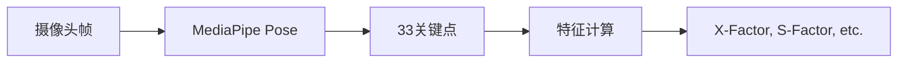
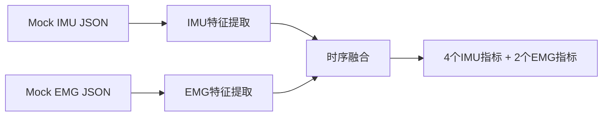
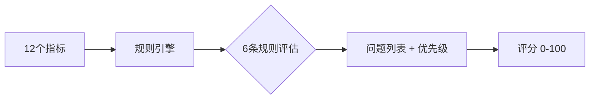
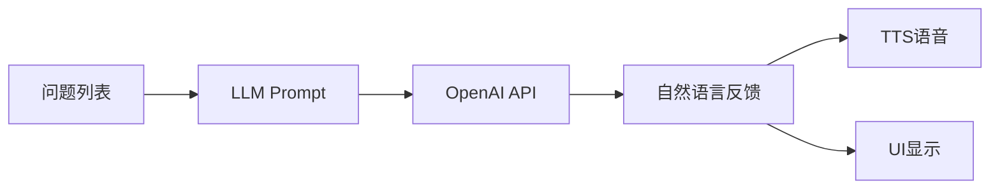

# 系统设计 System Design

> **文档角色**: 总纲 (Hub) - 系统核心设计文档，所有详细规格文档的入口
>
> **目标读者**: 技术负责人、新加入的团队成员、投资者
>
> **阅读时间**: 25分钟

---

## 1. 产品愿景与最终目标

### 1.1 产品愿景

**一句话**: 基于 Vision + IMU + EMG 三模态融合的高尔夫挥杆分析系统，通过 AI 教练提供可执行的改进建议。

**核心差异化**: EMG 肌肉激活检测 — 竞品只能告诉你"什么错了"，我们能告诉你"为什么错了"。

### 1.2 完整系统架构(目标态)

```text
┌─────────────────────────────────────────────────────────────────────────────────┐
│                        Movement Chain AI 完整系统架构                             │
├─────────────────────────────────────────────────────────────────────────────────┤
│                                                                                 │
│  ┌───────────────────────────────────────────────────────────────────────────┐  │
│  │                           用户反馈层 (Output)                               │  │
│  │  ┌─────────────┐    ┌─────────────┐    ┌─────────────┐    ┌────────────┐  │  │
│  │  │  App UI     │    │  语音 TTS    │    │  触觉反馈    │    │  Ghost     │  │  │
│  │  │  数据可视化   │    │  实时语音    │    │  振动提示    │    │  动作叠加    │  │  │
│  │  └─────────────┘    └─────────────┘    └─────────────┘    └────────────┘  │  │
│  └───────────────────────────────────────────────────────────────────────────┘  │
│                                      ▲                                          │
│                                      │                                          │
│  ┌───────────────────────────────────────────────────────────────────────────┐  │
│  │                           AI 反馈生成层                                     │  │
│  │  ┌─────────────────────────────────────────────────────────────────────┐  │  │
│  │  │                    Kinematic Prompts → LLM                          │  │  │
│  │  │  传感器数据结构化 → GPT-4o-mini/Gemini → 教练级自然语言反馈               │  │  │
│  │  └─────────────────────────────────────────────────────────────────────┘  │  │
│  └───────────────────────────────────────────────────────────────────────────┘  │
│                                      ▲                                          │
│                                      │                                          │
│  ┌───────────────────────────────────────────────────────────────────────────┐  │
│  │                           分析诊断层 (Analysis)                             │  │
│  │  ┌──────────────────┐    ┌──────────────────┐    ┌──────────────────┐     │  │
│  │  │   8阶段挥杆检测    │    │   规则引擎(6条)    │    │   因果归因诊断     │     │  │
│  │  │   GolfDB 标准     │    │   P0/P1 优先级    │    │  ⭐ 核心差异化     │    │  │
│  │  └──────────────────┘    └──────────────────┘    └──────────────────┘     │  │
│  │                                                                           │  │
│  │  ┌─────────────────────────────────────────────────────────────────────┐  │  │
│  │  │  因果归因示例:                                                        │  │  │
│  │  │  竞品: "你的 X-Factor 不足" (WHAT)                                    │  │  │
│  │  │  我们: "你的核心肌群在下杆时未激活，导致 X-Factor 不足" (WHY)              │  │  │
│  │  └─────────────────────────────────────────────────────────────────────┘  │  │
│  └───────────────────────────────────────────────────────────────────────────┘  │
│                                      ▲                                          │
│                                      │                                          │
│  ┌───────────────────────────────────────────────────────────────────────────┐  │
│  │                           特征提取层 (Extraction)                           │  │
│  │  ┌──────────────────┐    ┌──────────────────┐    ┌──────────────────┐     │  │
│  │  │   Vision 特征     │    │    IMU 特征      │     │    EMG 特征      │     │  │
│  │  │  ─────────────   │    │  ─────────────   │     │ ─────────────   │     │  │
│  │  │  • 关节角度       │     │  • 角速度        │     │  • 激活时序       │     │  │
│  │  │  • 姿态序列       │     │  • 加速度        │     │  • 激活强度       │     │  │
│  │  │  • 位置轨迹       │     │  • 旋转角        │     │  • 肌群协调       │     │  │
│  │  └──────────────────┘    └──────────────────┘    └──────────────────┘     │  │
│  └───────────────────────────────────────────────────────────────────────────┘  │
│                                      ▲                                          │
│                                      │                                          │
│  ┌───────────────────────────────────────────────────────────────────────────┐  │
│  │                           传感器融合层 (Sensor Fusion)                      │  │
│  │  ┌─────────────────────────────────────────────────────────────────────┐  │  │
│  │  │              时间对齐引擎 (Impact T=0 对齐)                            │  │  │
│  │  │  • IMU 主时钟 (500Hz) → Vision/EMG 对齐                               │  │  │
│  │  │  • 同步容差 <10ms                                                     │  │  │
│  │  │  • Sensor Hub: 同部位传感器共享 ESP32 时钟                              │  │  │
│  │  └─────────────────────────────────────────────────────────────────────┘  │  │
│  └───────────────────────────────────────────────────────────────────────────┘  │
│                                      ▲                                          │
│                                      │                                          │
│  ┌───────────────────────────────────────────────────────────────────────────┐  │
│  │                           数据采集层 (Input)                                │  │
│  │                                                                           │  │
│  │   📹 Vision (30fps)       📡 IMU (500Hz)         💪 EMG (1000Hz)          │  │
│  │   ┌─────────────────┐    ┌─────────────────┐    ┌─────────────────┐       │  │
│  │   │   手机摄像头      │    │   LSM6DSV16X    │    │   DFRobot       │       │  │
│  │   │   MediaPipe     │    │   6轴运动数据     │    │   2通道肌电      │       │  │
│  │   │   33个关键点     │     │                 │    │                 │      │  │
│  │   └────────┬────────┘    └────────┬────────┘    └────────┬────────┘       │  │
│  │            │                      │                      │                │  │
│  │            │              ┌───────┴───────┐              │                │  │
│  │            │              │               │              │                │  │
│  │            ▼              ▼               ▼              ▼                │  │
│  │   ┌─────────────┐    ┌─────────────┐    ┌─────────────┐                   │  │
│  │   │   iPhone    │◄───│  ESP32 #1   │    │  ESP32 #2   │                   │  │
│  │   │   Flutter   │BLE │  手臂Hub    │     │  核心Hub    │                   │  │
│  │   │   App       │◄───│ IMU+EMG同步 │     │ IMU+EMG同步 │                   │  │
│  │   └─────────────┘    └─────────────┘    └─────────────┘                   │  │
│  │                                                                           │  │
│  │   【空间姿态】            【运动时序】            【肌肉激活】                  │  │
│  │   WHAT: 发生了什么        WHEN: 何时发生         WHY: 为什么发生               │  │
│  └───────────────────────────────────────────────────────────────────────────┘  │
│                                                                                 │
└─────────────────────────────────────────────────────────────────────────────────┘
```

**核心价值链**:

| 层级 | 功能 | 关键组件 | 价值 |
|------|------|----------|------|
| 数据采集层 | 三模态数据采集 | Vision + IMU + EMG, ESP32 Sensor Hub, Flutter App | WHAT + WHEN + WHY 完整信息 |
| 传感器融合层 | 时间对齐 <10ms | Impact T=0 对齐, IMU 主时钟 | 数据可比性、因果推断基础 |
| 特征提取层 | 运动学特征计算 | 关节角度、角速度、肌肉激活 | 从原始数据到可分析指标 |
| 分析诊断层 | 规则引擎 + 因果归因 | 8阶段检测、6条规则、因果诊断 | **核心差异化**: 告诉用户"为什么" |
| AI反馈层 | Kinematic Prompts → LLM | GPT-4o-mini/Gemini | 教练级自然语言反馈 |
| 用户反馈层 | 多模态反馈 | App UI、TTS、触觉、Ghost | 用户可执行的改进建议 |

---

## 2. 分阶段实现路线图

> **相关文档**:
>
> - [8阶段挥杆检测](../specs/swing-phases.md) - 阶段划分算法与代码实现
> - [挥杆对比策略](../specs/swing-comparison.md) - 4种对比方法 (Pro/Personal Best/Statistical/Learned)
> - [实时反馈规格](../specs/real-time-feedback.md) - 3种反馈模式详细规格
> - [移动开发](../../development/mobile/development.md) - Flutter 开发与测试指南

### 2.1 MVP (Phase 1): Vision Pipeline (Week 1-2)



**任务清单**:

- [ ] MediaPipe 集成 (ThinkSys Flutter plugin)
- [ ] 33关键点提取 → 6个Vision指标计算
- [ ] 8阶段检测算法实现
- [ ] GolfDB视频测试 (准确率 >70%)

**验收标准**: 能在GolfDB视频上检测8阶段，误差 <100ms。

### 2.2 Phase 2: Mock Sensor Integration (Week 3)



**任务清单**:

- [ ] Mock IMU 数据生成 (基于研究数据)
- [ ] Mock EMG 数据生成 (基于研究数据)
- [ ] IMU 特征提取: 峰值角速度、节奏比、时长
- [ ] EMG 特征提取: 核心激活%、时序差
- [ ] 时间同步对齐

**验收标准**: Mock数据能产生合理的12个指标值。

### 2.3 Phase 3: Rule Engine + Scoring (Week 4)



**任务清单**:

- [ ] 6条规则实现 (IF-THEN)
- [ ] 优先级排序 (P0 > P1)
- [ ] 评分算法 (基于规则违反程度)
- [ ] 教练人工验证 (准确率 >80%)

**验收标准**: 规则引擎输出与教练判断一致率 >80%。

### 2.4 Phase 4: Feedback System (Week 5)



**任务清单**:

- [ ] LLM Prompt 模板设计 (规则判断 → 自然语言)
- [ ] OpenAI API 集成
- [ ] TTS 集成 (flutter_tts)
- [ ] 反馈语言用户测试

**验收标准**: 用户理解并认可反馈内容 >80%。

### 2.5 Phase 5: Mobile App Shell (Week 6-7)

**任务清单**:

- [ ] 摄像头实时预览 + 骨架叠加
- [ ] 3种反馈模式 UI 切换
- [ ] 历史记录存储
- [ ] BLE 框架 (为硬件准备)

**验收标准**: 60 FPS骨架叠加，内存 <500MB。

### 2.6 Phase 6: User Testing (Week 8)

**任务清单**:

- [ ] 招募 5-10 名目标用户
- [ ] 定义测试场景
- [ ] 收集反馈
- [ ] 迭代修复

---

## 3. MVP 详细设计

### 3.1 MVP 范围

> 📐 **架构决策**: 4模块架构设计详见 [ADR-0004](../decisions/0004-simplified-4-module-architecture.md)

| 功能 | MVP Phase 1 | Phase 2 | Phase 3 | 备注 |
|------|:-----------:|:-------:|:-------:|------|
| **Mode 1: Setup Check** | ✅ | - | - | 站位检测，<300ms |
| **Mode 2: Slow Motion** | ✅ | - | - | 慢动作实时反馈 |
| **Mode 3: Full Speed** | ✅ | - | - | 正常挥杆后分析 |
| MediaPipe 骨架叠加 | ✅ | - | - | 33关键点 |
| 8阶段挥杆检测 | ✅ | - | - | GolfDB标准 |
| 6条核心规则 | ✅ | - | - | P0-P1优先级 |
| Mock IMU 数据 | ✅ | - | - | 模拟100Hz |
| Mock EMG 数据 (Core+Forearm) | ✅ | - | - | 模拟500Hz，2通道 |
| LLM 反馈生成 | ✅ | - | - | OpenAI API |
| TTS 语音反馈 | ✅ | - | - | 系统TTS |
| Ghost Overlay (静态) | ⚠️ | ✅ | - | 可简化版 |
| Ghost Overlay (动态) | - | ✅ | - | 需DTW对齐 |
| 真实 IMU 硬件 | - | ✅ | - | LSM6DSV16X |
| 真实 EMG 硬件 (Core+Forearm) | - | ✅ | - | 2通道 DFRobot |
| 骨盆 IMU | - | ✅ | - | 运动链完整分析 |
| 臀肌 EMG (Gluteus) | - | ✅ | - | 下杆启动、髋部旋转 |
| 大腿内侧 EMG (Adductors) | - | ✅ | - | 下盘稳定、重心转移 |
| 背阔肌 EMG (Lats) | - | - | ✅ | 肩部旋转、拉杆动作 |
| 三角肌 EMG (Deltoids) | - | - | ✅ | 手臂举起、顶点位置 |

### 3.2 成功标准

| 指标 | 目标值 | 测量方法 |
|------|--------|----------|
| 8阶段检测准确率 | >70% | GolfDB视频测试 |
| 阶段检测误差 | <100ms | 与标注对比 |
| 端到端延迟 | <500ms | 从帧捕获到反馈 |
| 规则引擎准确率 | >80% | 教练人工验证 |
| 用户可理解反馈 | >80% 满意 | 用户测试 |


### 3.3 MVP 测量指标 (12个)

基于 [传感器指标映射](./sensor-metric-mapping.md) 和 [生物力学基准值](../../prerequisites/foundations/biomechanics-benchmarks.md)。

> 🔍 **竞品对比**: 与 OnForm/Sportsbox 的指标差异见 [竞品指标对比](../research/competitor-metrics-comparison.md)

#### Vision 指标 (MediaPipe 33关键点)

| 指标 | 检测方法 | 阈值 | 来源 |
|------|----------|------|------|
| **X-Factor** | 肩髋角度差 | >35° 良好 | TPI |
| **X-Factor Stretch** | 下杆期增量 | >5% | Meister |
| **Shoulder Turn** | 侧视角骨架 | 85-100° | TPI |
| **Hip Turn** | 侧视角骨架 | 40-55° | TPI |
| **S-Factor** | 肩部倾斜 | 30-40° | Meister |
| **Sway/Lift** | 3D轨迹 | <3" 侧移 | Research |

#### Mock IMU 指标

| 指标 | 检测方法 | 阈值 | 来源 |
|------|----------|------|------|
| **Peak Angular Velocity** | 直接测量 | >800°/s | Research |
| **Tempo Ratio** | 时序计算 | 2.5-3.5 (3:1) | Novosel |
| **Backswing Duration** | 事件检测 | 0.70-0.85s | Tour avg |
| **Downswing Duration** | 事件检测 | 0.25-0.30s | Tour avg |

#### Mock EMG 指标 (差异化能力)

| 指标 | 检测方法 | 阈值 | 来源 |
|------|----------|------|------|
| **Core Activation %** | RMS包络 | >50% MVC | Research |
| **Core-Forearm Timing** | onset差 | >20ms (核心先) | Cheetham |

### 3.4 MVP 规则引擎 (6条)

> 📋 **详细规格**: 规则的完整触发逻辑、反馈模式、延迟要求见 [实时反馈规格](../specs/real-time-feedback.md)

#### P0 - 严重问题 (必须修正)

| # | 规则 | 条件 | 反馈示例 |
|---|------|------|----------|
| 1 | **倒序运动链** | EMG: 前臂先于核心激活 (gap < -20ms) | "你的手臂比身体先动了，试着让身体带动手臂" |
| 2 | **过度手臂挥杆** | EMG: Forearm/Core ratio > 1.3 | "感觉核心在发力，不是手臂在甩" |

#### P1 - 重要改进 (中等影响)

| # | 规则 | 条件 | 反馈示例 |
|---|------|------|----------|
| 3 | **差异角过小** | Vision: X-Factor < 20° | "肩膀再多转一点，感觉左肩对准下巴" |
| 4 | **节奏过快** | IMU: Downswing < 0.20s | "上杆再慢一点，心里数'1-2-3'" |
| 5 | **节奏过慢** | IMU: Downswing > 0.40s | "下杆可以更果断一点" |
| 6 | **早释放** | IMU: Wrist release < 40% downswing | "保持手腕角度到击球瞬间才释放" |

### 3.5 MVP 核心选型

| 层级 | 技术 | 选型理由 | 决策依据 |
|------|------|----------|----------|
| **项目结构** | 多仓库 (5 repos) | 独立部署、独立版本控制 | [ADR-0001](../decisions/0001-multi-repo-structure.md) |
| **移动端** | Flutter 3.x | 一套代码 → iOS + Android，开发效率高 | [ADR-0003](../decisions/0003-flutter-mobile.md) |
| **后端** | Python 3.11+ | ML 生态最强，MediaPipe/scikit-learn 都是 Python | - |
| **姿态估计** | MediaPipe Pose | iOS 可用，33 关键点 | ThinkSys plugin |
| **MCU** | XIAO ESP32S3 | 便宜 ($4)、有 BLE、有 AI 加速、社区成熟 | Seeed 113991114 |
| **IMU** | Adafruit LSM6DSV16X | 专业级 45+ 分钟不漂移，内置 ML 核心 | ADA-5783 |
| **EMG** | MyoWare 2.0 + Link Shield | 消费级 EMG，2 通道够用 | SparkFun DEV-21265 |
| **PCB 设计** | KiCad | 免费开源，功能完整，可用 Git 管理 | - |
| **ML 推理** | TFLite (MediaPipe 内置) | MVP1 开箱即用; Phase 2 升级 ONNX Runtime | [ADR-0006](../decisions/0006-onnx-runtime-deployment.md) |
| **LLM** | OpenAI GPT-4o-mini | 成本低，速度快 | - |
| **TTS** | flutter_tts (系统) | 开箱即用，免费 | - |
| **数据库/部署** | *待定* | - | - |

### 3.6 MVP 简化策略

> 📐 **详细设计**: LEGO 积木式模块化架构详见 [模块化架构设计](./modular-architecture.md)

| 组件 | MVP方案 | 后期升级 |
|------|---------|----------|
| 姿态估计 | MediaPipe Pose | RTMPose → ViTPose++ |
| 阶段分类 | SwingNet (预训练) | BiGRU → Transformer |
| EMG处理 | NeuroKit2 | 自定义滤波 |
| 分析引擎 | 规则引擎 IF-THEN | ML分类器 |
| 传感器融合 | Simple Merge | Kalman Filter → ML Fusion |
| 可视化 | OpenCV + MediaPipe | Unity 3D |
| 语音反馈 | 系统TTS | OpenAI TTS |

---

## 4. 技术栈

> **相关文档**:
>
> - [SDK 选型](../decisions/sdk-selection.md) - MediaPipe/NeuroKit2/imufusion 等 SDK 对比
> - [机器学习基础](../../prerequisites/ml-basics.md) - 挥杆分析 ML 模型入门

### 4.1 技术栈总览 {#51-技术栈总览}

```text
┌─────────────────────────────────────────────────────────────────────────────┐
│                    Movement Chain AI 完整技术栈                               │
├─────────────────────────────────────────────────────────────────────────────┤
│                                                                             │
│   ┌─────────────┐     ┌─────────────┐     ┌─────────────┐                   │
│   │   前端       │     │   后端      │      │   嵌入式    │                    │
│   │  (移动端)    │     │  (ML服务)    │     │ (MCU+传感器)│                    │
│   ├─────────────┤     ├─────────────┤     ├─────────────┤                   │
│   │  Flutter    │     │  Python     │     │  ESP32-S3   │ ← MCU (大脑)       │
│   │  (Dart)     │     │  3.11+      │     │  LSM6DSV16X │ ← IMU (运动)       │
│   │             │     │             │     │  ADS1292    │ ← EMG (肌电)       │
│   └─────────────┘     └─────────────┘     └─────────────┘                   │
│         │                   │                   │                           │
│         ▼                   ▼                   ▼                           │
│   ┌─────────────┐     ┌─────────────┐     ┌─────────────┐                   │
│   │ MLKit Pose  │     │ MediaPipe   │     │ ESP-IDF     │                   │
│   │ flutter_blue│     │ FastAPI     │     │ FreeRTOS    │                   │
│   │ camera      │     │ Polars      │     │ I2C/SPI     │                   │
│   │ riverpod    │     │ scikit-learn│     │ BLE 5.0     │                   │
│   └─────────────┘     └─────────────┘     └─────────────┘                   │
│                                                                             │
└─────────────────────────────────────────────────────────────────────────────┘
```

| 层级 | 技术 | 语言 | 用途 |
|------|------|------|------|
| **前端 (移动端)** | Flutter + google_mlkit + flutter_blue_plus | Dart | iOS/Android 应用、摄像头采集、BLE 连接 |
| **后端 (ML 服务)** | Python + FastAPI + MediaPipe | Python 3.11+ | 姿态估计、特征提取、ML 推理 |
| **数据库** | *待定* | - | 将在后续 ADR 中记录 |
| **部署/DevOps** | *待定* | - | CI/CD 见 [ADR-0001 多仓库结构](../decisions/0001-multi-repo-structure.md) |
| **嵌入式 ([MCU](../../reference/engineering-glossary.md#7-mcu-微控制器))** | ESP32-S3 (微控制器) | C/C++ | 读取传感器、数据处理、BLE 传输 |
| **传感器** | [LSM6DSV16X (IMU)](../../reference/engineering-glossary.md#1-imu-惯性测量单元) + [ADS1292 (EMG)](../../reference/engineering-glossary.md#2-emg-肌电传感器) | - | 运动数据 + 肌电信号采集 |
| **硬件设计** | [KiCad](../../reference/engineering-glossary.md#9-kicad) | - | [PCB](../../reference/engineering-glossary.md#8-pcb-印刷电路板) 设计、原理图 |

#### 整体数据流

```text
用户挥杆 → 三路数据同时采集 → 融合分析 → 实时反馈

     📱 手机摄像头              🎯 可穿戴传感器
          │                         │
          ▼                         ▼
    ┌──────────┐              ┌──────────┐
    │  前端     │◄────BLE────► │  嵌入式   │
    │ Flutter  │              │ ESP32-S3 │
    └────┬─────┘              └──────────┘
         │
         ▼ HTTP/本地
    ┌──────────┐
    │  后端     │
    │ Python   │
    └──────────┘
```

### 4.2 各层技术详解

#### 4.2.1 前端 (移动端)

| 技术 | 作用 |
|------|------|
| **Flutter** | Google 的跨平台框架，一套代码 → iOS + Android |
| **Dart** | Flutter 使用的编程语言 |
| **google_mlkit** | 设备端姿态估计（不用联网） |
| **flutter_blue_plus** | 与传感器蓝牙通信 |
| **camera** | 调用手机摄像头 |
| **riverpod** | 状态管理（类似 React 的 Redux） |

#### 4.2.2 后端 (ML 服务)

| 技术 | 作用 |
|------|------|
| **Python 3.11+** | 主编程语言 |
| **FastAPI** | 高性能 Web API 框架 |
| **MediaPipe** | Google 的姿态估计库（33 个关键点） |
| **Polars** | 高性能数据处理（比 Pandas 快 10x） |
| **scikit-learn** | 传统 ML 模型（Random Forest 等） |

#### 4.2.3 数据库

> ⚠️ **待定**

#### 4.2.4 部署

> ⚠️ **待定** (MVP 完全本地运行)

> 相关决策：
> - CI/CD 策略见 [ADR-0001 多仓库结构](../decisions/0001-multi-repo-structure.md)
> - 部署策略见 [关键决策 2025-12 § 部署策略](../decisions/architecture-decisions-2025-12-23.md#5-部署策略决策)

#### 4.2.5 嵌入式 (MCU + 传感器)

| 组件 | 角色 | 功能 |
|------|------|------|
| **ESP32-S3** | [MCU](../../reference/engineering-glossary.md#7-mcu-微控制器) (大脑) | 读取传感器、处理数据、BLE 传输 |
| **LSM6DSV16X** | [IMU](../../reference/engineering-glossary.md#1-imu-惯性测量单元) (运动) | 测量加速度 + 角速度 (500Hz) |
| **ADS1292** | [EMG](../../reference/engineering-glossary.md#2-emg-肌电传感器) (肌电) | 测量肌肉电信号 (1000Hz) |

嵌入式软件栈：

| 技术 | 作用 |
|------|------|
| **ESP-IDF** | ESP32 官方开发框架 (C/C++) |
| **FreeRTOS** | 实时操作系统（多任务调度） |
| **[I2C/SPI](../../reference/engineering-glossary.md#6-i2c--spi-通信协议)** | MCU 与传感器的通信协议 |
| **BLE 5.0** | 与手机的无线通信 |


```text
┌─────────────────────────────────────────────────────────────┐
│                    三模态传感器融合                           │
├─────────────────────────────────────────────────────────────┤
│                                                             │
│   📹 视频 (30fps)      🔄 IMU (500Hz)     💪 EMG (1000Hz)    │
│        │                    │                   │           │
│        ▼                    ▼                   ▼           │
│   姿态估计             角速度/加速度         肌肉激活        │
│   33个关键点           6轴运动数据          2通道肌电        │
│        │                    │                   │           │
│        └────────────────────┼───────────────────┘           │
│                             ▼                               │
│                    ┌────────────────┐                       │
│                    │  传感器融合引擎  │                       │
│                    │  (Python)      │                       │
│                    └────────┬───────┘                       │
│                             │                               │
│        ┌────────────────────┼────────────────────┐          │
│        ▼                    ▼                    ▼          │
│   挥杆阶段检测          生物力学特征          肌肉时序分析    │
│   (8个阶段)           (X-Factor...)         (发力顺序)      │
│        │                    │                    │          │
│        └────────────────────┼────────────────────┘          │
│                             ▼                               │
│                    ┌────────────────┐                       │
│                    │   ML 预测模型   │                       │
│                    │ (Random Forest)│                       │
│                    └────────┬───────┘                       │
│                             ▼                               │
│                    球速、杆面角度、诊断建议                   │
└─────────────────────────────────────────────────────────────┘
```

| 模态 | 采样率 | 输出 | 作用 |
|------|--------|------|------|
| **视频** | 30 fps | 33 个关键点 | 姿态估计、X-Factor 等生物力学特征 |
| **IMU** | 500 Hz | 6 轴运动数据 | 角速度峰值、节奏比、挥杆阶段检测 |
| **EMG** | 1000 Hz | 2 通道肌电 | 核心激活、发力顺序、运动链验证 |

> 📐 **时间同步**: 三模态数据的时间对齐详见 [数据管道与AI](./data-pipeline-and-ai.md) §1.2

### 4.3 Sensor Hub 架构 (关键创新)

> 📐 **时间同步策略**: 详细规格见 [数据管道与AI](./data-pipeline-and-ai.md) §1.2

**核心问题**: BLE 协议存在 15-30ms [抖动](../../reference/engineering-glossary.md#10-ble-抖动-ble-jitter) (2025-12 研究验证),无法通过软件完全消除。

**解决方案**: 同一身体部位的 IMU + EMG 共享同一个 ESP32 时钟源

```text
┌─────────────────────────────────────────────────────────────────┐
│                    Sensor Hub 架构                               │
├─────────────────────────────────────────────────────────────────┤
│                                                                 │
│   ✅ 正确架构:                                                   │
│   ┌───────────────────────┐     ┌───────────────────────┐       │
│   │     ESP32 #1          │     │      ESP32 #2         │       │
│   │  (手臂 Sensor Hub)    │     │   (核心 Sensor Hub)    │       │
│   │ ┌─────────┬─────────┐ │     │ ┌─────────┬─────────┐ │       │
│   │ │手腕 IMU │前臂 EMG │ │     │ │核心 EMG │腰部 IMU │ │       │
│   │ │ (I2C)   │ (ADC)   │ │     │ │ (ADC)   │ (I2C)   │ │       │
│   │ └─────────┴─────────┘ │     │ └─────────┴─────────┘ │       │
│   │   同一时钟 ✅          │     │   同一时钟 ✅          │       │
│   └───────────┬───────────┘     └───────────┬───────────┘       │
│               └─────────────┬───────────────┘                   │
│                             ↓ BLE                               │
│                         ┌────────┐                              │
│                         │ iPhone │                              │
│                         └────────┘                              │
│                                                                 │
└─────────────────────────────────────────────────────────────────┘
```

**同步精度**:

| 场景 | 目标精度 | 实际可达 | 方法 |
|------|---------|---------|------|
| 同一 ESP32 (IMU+EMG) | <100 μs | <10 μs | esp_timer_get_time() |
| 跨 ESP32 (手臂↔核心) | <1 ms | 69-477 μs | Impact 事件对齐 |
| 跨设备 (ESP32↔Vision) | <10 ms | <5 ms | Impact 帧对齐 |

**关键优势**:

- 使用 ESP32 源端微秒级时间戳 (而非手机接收时间)
- 不同 Sensor Hub 通过 Impact 事件对齐消除 BLE 抖动
- 避免每个传感器独立 BLE 连接导致的时钟漂移

> 详见 [关键决策 2025-12](../decisions/architecture-decisions-2025-12-23.md#43-硬件购买清单)

---

## 5. 测试策略

### 5.1 单元测试

| 模块 | 测试内容 | 工具 |
|------|----------|------|
| 特征计算 | X-Factor计算正确性 | pytest |
| 阶段检测 | 8阶段边界识别 | pytest + GolfDB |
| 规则引擎 | 每条规则触发条件 | pytest |

### 5.2 集成测试

| 场景 | 输入 | 预期输出 |
|------|------|----------|
| 正常挥杆 | GolfDB视频 | 8阶段 + 评分 |
| 问题挥杆 | 模拟问题数据 | 正确诊断 + 反馈 |

### 5.3 用户验证

| 阶段 | 参与者 | 验证内容 |
|------|--------|----------|
| Alpha | 3名内部 | 功能完整性 |
| Beta | 5-10名用户 | 反馈可理解性 |
| Golf Advisor | 1-2名教练 | 规则阈值准确性 |

### 5.4 基准数据

- **GolfDB**: 1400个标注挥杆视频
- **研究数据**: 职业/业余基准值 (见 [biomechanics-benchmarks.md](../../prerequisites/foundations/biomechanics-benchmarks.md))

---

## 6. 文档索引

### 推荐阅读顺序

#### 第一步: 理解总体架构

- **[本文档]** system-design.md ← 你在这里

#### 第二步: 理解核心算法

- **[模块化架构](./modular-architecture.md)** - LEGO 积木式设计，各模块升级路径
- **[数据管道与AI](./data-pipeline-and-ai.md)** - 数据流、传感器融合、时间同步策略
- **[传感器映射](./sensor-metric-mapping.md)** - 哪个传感器测什么
- **[2025年12月关键决策](../decisions/architecture-decisions-2025-12-23.md)** - Sensor Hub架构、硬件选型、时间同步策略
- **[8阶段检测](../specs/swing-phases.md)** - 挥杆阶段识别算法，含代码
- **[挥杆对比](../specs/swing-comparison.md)** - 4种对比方法，DTW算法
- **[实时反馈](../specs/real-time-feedback.md)** - 3种反馈模式规格

#### 第三步: 理解数据来源

- **[生物力学基准](../../prerequisites/foundations/biomechanics-benchmarks.md)** - 阈值数据来源
- **[生物力学术语](../../prerequisites/foundations/biomechanics-glossary.md)** - 140+术语定义

#### 角色专属入口

| 角色 | Brief | 主要任务 |
|------|-------|----------|
| 软件工程师 | [briefs/software-engineer.md](../briefs/software-engineer.md) | 算法管道实现 |
| 移动开发者 | [briefs/mobile-developer.md](../briefs/mobile-developer.md) | Flutter App |
| 硬件工程师 | [briefs/hardware-engineer.md](../briefs/hardware-engineer.md) | 传感器原型 |
| 高尔夫顾问 | [briefs/golf-advisor.md](../briefs/golf-advisor.md) | 规则验证 |

---

## 7. 未来路线图 (Phase 2+) {#7-未来规划}

MVP 完成后的技术储备和扩展方向：

| 方向 | 文档 | 内容 |
|------|------|------|
| **个性化调优** | [个性化规格](../specs/personalization.md) | 按性别/年龄/体型调整阈值 |
| **调试可视化** | [可视化工具评估](../decisions/visualization-tools-evaluation.md) | Rerun 多模态调试、TAPIR 球杆追踪 |

> 💡 **亮点发现**: [Rerun.io](https://rerun.io) 支持 Vision+IMU+EMG 同时间轴可视化，是我们的首选调试工具。[TAPIR](https://github.com/google-deepmind/tapnet) 可实现球杆头追踪，用软件替代 $5000+ 的 Trackman 雷达。

---

## 8. 待解决问题

### 8.1 需要验证的假设

| 假设 | 验证方法 | 负责人 |
|------|----------|--------|
| MediaPipe 33关键点足够计算X-Factor | GolfDB测试 | 软件工程师 |
| Mock EMG数据能代表真实模式 | 与研究数据对比 | 软件工程师 |
| 用户能理解LLM生成的反馈 | 用户测试 | 产品 |
| 6条规则覆盖主要问题 | 教练评审 | 高尔夫顾问 |

### 8.2 需要做的决策

| 决策 | 选项 | 截止日期 |
|------|------|----------|
| Ghost Overlay 是否在MVP | Yes (简化版) / No | Week 2 |
| LLM Provider | OpenAI / Claude / 本地 | Week 4 |
| 是否支持录制保存 | Yes / No | Week 5 |

### 8.3 已知风险

| 风险 | 影响 | 缓解措施 |
|------|------|----------|
| MediaPipe iOS性能不足 | 帧率低 | 降低分辨率,使用GPU |
| EMG真实数据与Mock差异大 | 规则需重调 | Phase 2验证 |
| 用户不接受穿戴设备 | 产品定位失败 | 先验证纯Vision版本 |
| BLE 抖动 15-30ms | 时间同步误差 | Sensor Hub + Impact 对齐方案 |
| MyoWare 2.0 Link Shield | 无法焊接 | DEV-18425 是必需品 |
| DFRobot EMG 线缆噪声 | 信号质量 | 仅适用静态测量 |
| WitMotion IMU BLE | 时间同步 | 必须通过 I2C 连接 ESP32 |

---

## 9. 版本历史

| 版本 | 日期 | 修改内容 |
|------|------|----------|
| 1.0 | 2025-12-18 | 初始版本，整合所有详细规格 |
| 1.1 | 2025-12-23 | 增加 Sensor Hub 架构, 更新硬件选型, 澄清 BLE 时间同步策略 |

---

**最后更新**: 2025-12-23
**维护者**: Movement Chain AI Team
