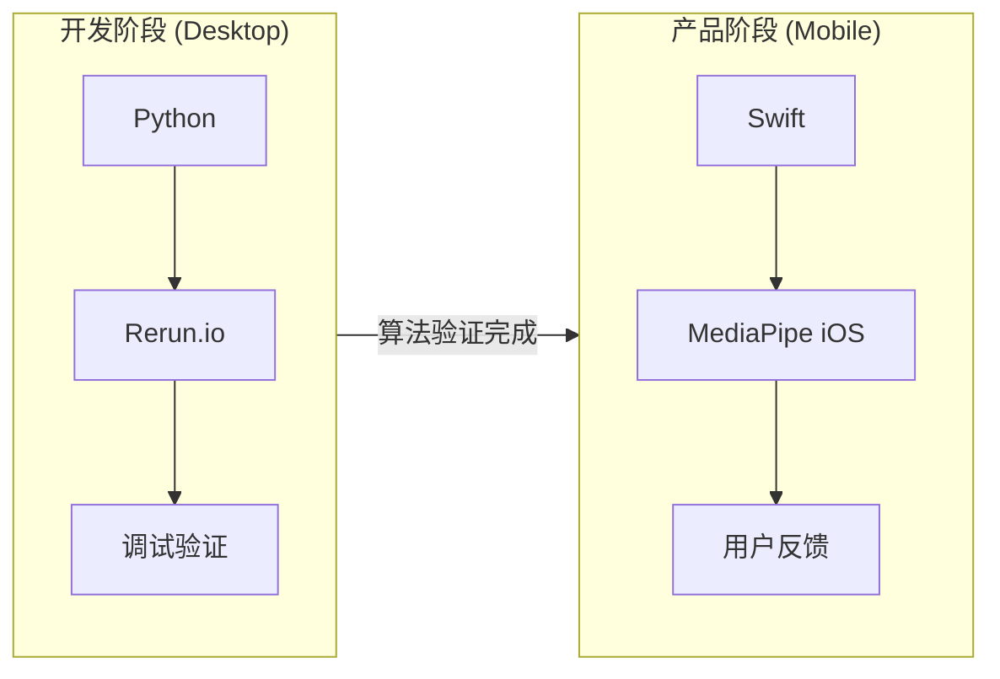

# 系统设计 System Design

> **文档角色**: 总纲 (Hub) - 系统核心设计文档，所有详细规格文档的入口
>
> **目标读者**: 技术负责人、新加入的团队成员、投资者
>
> **阅读时间**: 25分钟

---

## 1. 产品愿景与最终目标

### 1.1 产品愿景

**一句话**: 基于 Vision + IMU + EMG 三模态融合的高尔夫挥杆分析系统，通过 AI 教练提供可执行的改进建议。

**核心差异化**: EMG 肌肉激活检测 — 竞品只能告诉你"什么错了"，我们能告诉你"为什么错了"。

### 1.2 完整系统架构(目标态)

```text
┌─────────────────────────────────────────────────────────────────────────────────┐
│                        Movement Chain AI 完整系统架构                            │
├─────────────────────────────────────────────────────────────────────────────────┤
│                                                                                 │
│  ┌───────────────────────────────────────────────────────────────────────────┐  │
│  │                           数据采集层 (Input)                              │  │
│  │                                                                           │  │
│  │   📹 Vision (30fps)       📡 IMU (500Hz)         💪 EMG (1000Hz)          │  │
│  │   ┌─────────────────┐    ┌─────────────────┐    ┌─────────────────┐      │  │
│  │   │   手机摄像头     │    │   LSM6DSV16X    │    │   DFRobot       │      │  │
│  │   │   MediaPipe      │    │   6轴运动数据    │    │   2通道肌电      │      │  │
│  │   │   33个关键点     │    │                 │    │                 │      │  │
│  │   └────────┬────────┘    └────────┬────────┘    └────────┬────────┘      │  │
│  │            │                      │                      │               │  │
│  │            │              ┌───────┴───────┐              │               │  │
│  │            │              │               │              │               │  │
│  │            ▼              ▼               ▼              ▼               │  │
│  │   ┌─────────────┐    ┌─────────────┐    ┌─────────────┐                  │  │
│  │   │   iPhone    │◄───│  ESP32 #1   │    │  ESP32 #2   │                  │  │
│  │   │   Swift     │BLE │  手臂Hub    │    │  核心Hub    │                  │  │
│  │   │   App       │◄───│ IMU+EMG同步 │    │ IMU+EMG同步 │                  │  │
│  │   └─────────────┘    └─────────────┘    └─────────────┘                  │  │
│  │                                                                           │  │
│  │   【空间姿态】            【运动时序】            【肌肉激活】              │  │
│  │   WHAT: 发生了什么        WHEN: 何时发生         WHY: 为什么发生           │  │
│  └───────────────────────────────────────────────────────────────────────────┘  │
│                                      │                                          │
│                                      ▼                                          │
│  ┌───────────────────────────────────────────────────────────────────────────┐  │
│  │                           传感器融合层 (Sensor Fusion)                    │  │
│  │  ┌─────────────────────────────────────────────────────────────────────┐  │  │
│  │  │              时间对齐引擎 (Impact T=0 对齐)                          │  │  │
│  │  │  • IMU 主时钟 (500Hz) → Vision/EMG 对齐                             │  │  │
│  │  │  • 同步容差 <10ms                                                   │  │  │
│  │  │  • Sensor Hub: 同部位传感器共享 ESP32 时钟                           │  │  │
│  │  └─────────────────────────────────────────────────────────────────────┘  │  │
│  └───────────────────────────────────────────────────────────────────────────┘  │
│                                      │                                          │
│                                      ▼                                          │
│  ┌───────────────────────────────────────────────────────────────────────────┐  │
│  │                           特征提取层 (Extraction)                         │  │
│  │  ┌──────────────────┐    ┌──────────────────┐    ┌──────────────────┐    │  │
│  │  │   Vision 特征    │    │    IMU 特征      │    │    EMG 特征      │    │  │
│  │  │  ─────────────   │    │  ─────────────   │    │  ─────────────   │    │  │
│  │  │  • 关节角度       │    │  • 角速度        │    │  • 激活时序      │    │  │
│  │  │  • 姿态序列       │    │  • 加速度        │    │  • 激活强度      │    │  │
│  │  │  • 位置轨迹       │    │  • 旋转角        │    │  • 肌群协调      │    │  │
│  │  └──────────────────┘    └──────────────────┘    └──────────────────┘    │  │
│  └───────────────────────────────────────────────────────────────────────────┘  │
│                                      │                                          │
│                                      ▼                                          │
│  ┌───────────────────────────────────────────────────────────────────────────┐  │
│  │                           分析诊断层 (Analysis)                           │  │
│  │  ┌──────────────────┐    ┌──────────────────┐    ┌──────────────────┐    │  │
│  │  │   8阶段挥杆检测   │    │   规则引擎(6条)   │    │   因果归因诊断    │    │  │
│  │  │   GolfDB 标准    │    │   P0/P1 优先级   │    │  ⭐ 核心差异化    │    │  │
│  │  └──────────────────┘    └──────────────────┘    └──────────────────┘    │  │
│  │                                                                           │  │
│  │  ┌─────────────────────────────────────────────────────────────────────┐  │  │
│  │  │  因果归因示例:                                                       │  │  │
│  │  │  竞品: "你的 X-Factor 不足" (WHAT)                                   │  │  │
│  │  │  我们: "你的核心肌群在下杆时未激活，导致 X-Factor 不足" (WHY)          │  │  │
│  │  └─────────────────────────────────────────────────────────────────────┘  │  │
│  └───────────────────────────────────────────────────────────────────────────┘  │
│                                      │                                          │
│                                      ▼                                          │
│  ┌───────────────────────────────────────────────────────────────────────────┐  │
│  │                           AI 反馈生成层                                    │  │
│  │  ┌─────────────────────────────────────────────────────────────────────┐  │  │
│  │  │                    Kinematic Prompts → LLM                          │  │  │
│  │  │  传感器数据结构化 → GPT-4o-mini/Gemini → 教练级自然语言反馈           │  │  │
│  │  └─────────────────────────────────────────────────────────────────────┘  │  │
│  └───────────────────────────────────────────────────────────────────────────┘  │
│                                      │                                          │
│                                      ▼                                          │
│  ┌───────────────────────────────────────────────────────────────────────────┐  │
│  │                           用户反馈层 (Output)                              │  │
│  │  ┌─────────────┐    ┌─────────────┐    ┌─────────────┐    ┌────────────┐  │  │
│  │  │  App UI     │    │  语音 TTS   │    │  触觉反馈    │    │  Ghost     │  │  │
│  │  │  数据可视化  │    │  实时语音    │    │  振动提示    │    │  动作叠加   │  │  │
│  │  └─────────────┘    └─────────────┘    └─────────────┘    └────────────┘  │  │
│  └───────────────────────────────────────────────────────────────────────────┘  │
│                                                                                 │
└─────────────────────────────────────────────────────────────────────────────────┘
```

**核心价值链** (数据流: 从上到下):

| # | 层级 | 功能 | 关键组件 | 价值 |
|---|------|------|----------|------|
| 1 | 数据采集层 | 三模态数据采集 | Vision + IMU + EMG, ESP32 Sensor Hub, Swift App | WHAT + WHEN + WHY 完整信息 |
| 2 | 传感器融合层 | 时间对齐 <10ms | Impact T=0 对齐, IMU 主时钟 | 数据可比性、因果推断基础 |
| 3 | 特征提取层 | 运动学特征计算 | 关节角度、角速度、肌肉激活 | 从原始数据到可分析指标 |
| 4 | 分析诊断层 | 规则引擎 + 因果归因 | 8阶段检测、6条规则、因果诊断 | **核心差异化**: 告诉用户"为什么" |
| 5 | AI反馈层 | Kinematic Prompts → LLM | GPT-4o-mini/Gemini | 教练级自然语言反馈 |
| 6 | 用户反馈层 | 多模态反馈 | App UI、TTS、触觉、Ghost | 用户可执行的改进建议 |

---

## 2. MVP 开发计划 {#2-mvp-开发计划}

> **相关文档**:
>
> - [数据管道与AI](./data-pipeline-and-ai.md) - 时间同步、Kinematic Prompts、诊断规则详细规格
> - [传感器指标映射](./sensor-metric-mapping.md) - 12个MVP指标的完整定义与算法
> - [8阶段挥杆检测](../specs/swing-phases.md) - 阶段划分算法与代码实现
> - [移动开发](../../development/mobile/development.md) - Swift iOS 开发指南

### 2.1 并行开发策略

**核心思路**: 硬件开发周期长（PCB打样、固件调试），软件不应等待。通过 Mock Data 解耦，两条开发线可以并行推进。

```text
┌─────────────────────────────────────────────────────────────────────┐
│                        Track A (硬件)                                │
│                        ══════════════                                │
│   传感器 → ESP32 → BLE → iPhone                                      │
│                                                                      │
│   【交付物】Real Data Stream                                         │
└──────────────────────────────┬──────────────────────────────────────┘
                               │
                               │ 完成后：数据源替换 (Mock → Real)
                               ▼
┌─────────────────────────────────────────────────────────────────────┐
│                        Track B (软件)                                │
│                        ══════════════                                │
│                                                                      │
│   ┌─────────────┐    ┌─────────────┐    ┌─────────────┐             │
│   │ Mock Data   │───▶│ 融合 + 提取  │───▶│ Rerun.io   │             │
│   │ (JSON)      │    │ 12个指标     │    │ 可视化验证  │             │
│   └─────────────┘    └─────────────┘    └──────┬──────┘             │
│                                                 │                    │
│                      ┌──────────────────────────┘                    │
│                      ▼                                               │
│               ┌─────────────┐    ┌─────────────┐    ┌─────────────┐ │
│               │ 诊断规则    │───▶│ Kinematic   │───▶│ LLM 翻译    │ │
│               │ (6条)       │    │ Prompts     │    │ 教练反馈    │ │
│               └─────────────┘    └─────────────┘    └─────────────┘ │
│                                                                      │
│   【交付物】完整教练反馈系统（先用 Mock 验证，后用 Real 数据）         │
└─────────────────────────────────────────────────────────────────────┘
```

**合流时机**: Track A 完成稳定 BLE 传输后，将 Mock Data 替换为 Real Data，代码层面几乎不需要改动。

### 2.1.1 MVP 验证范围 (最重要的边界定义)

!!! warning "MVP 测试的是管道集成，不是算法精度"
    这是最重要的范围边界。理解这一点可以避免过度工程。

#### ✅ MVP 正在测试 (Pipeline Integration)

| 测试项 | 验证标准 | 数据来源 |
|--------|----------|----------|
| MediaPipe 处理视频帧 | 30fps 无崩溃 | 真实视频 |
| BLE 接收 ESP32 数据 | 数据包完整 | 真实硬件 或 模拟器 |
| 时间戳跨传感器对齐 | ±30ms 容差内 | 混合 (真实+模拟) |
| 融合逻辑产生输出 | 返回有效结构 | 任意输入 |
| UI 渲染反馈 | 用户可见 | Pipeline 输出 |

#### ❌ MVP 不测试 (Phase 2+ 范围)

| 延后项 | 原因 | 何时测试 |
|--------|------|----------|
| EMG 激活检测精度 (<5ms) | 需要真实肌肉数据 | Phase 2 硬件就绪 |
| IMU 相位检测鲁棒性 | 需要噪声数据 | Phase 2 硬件就绪 |
| 阈值校准正确性 | 需要大量样本 | Phase 2 用户测试 |
| 真实肌肉信号处理 | 需要 MyoWare 硬件 | Phase 2 |

#### 模拟数据策略 Mock Data Strategy

MVP 阶段使用**最简单可行**的模拟数据：

| 传感器 | 数据来源 | 复杂度 |
|--------|----------|--------|
| **Vision** | 真实视频 + MediaPipe | 真实数据 |
| **IMU** | 硬编码时间戳 | `{"top_ms": 600, "impact_ms": 850}` |
| **EMG** | 硬编码时间戳 | `{"core_onset_ms": 570, "forearm_onset_ms": 720}` |

```python
# MVP Mock 示例 — 故意简单
mock_emg = {"core_onset_ms": 570, "forearm_onset_ms": 720}
mock_imu = {"top_ms": 600, "impact_ms": 850}

# 真实数据
vision = mediapipe.process(real_video_frame)

# 测试管道是否运行
result = fusion_pipeline(vision, mock_imu, mock_emg)
assert result is not None  # MVP 通过!
```

#### 外部参考数据 External Reference

可使用 OnForm 等应用的分析结果作为 Vision 管道的参照：

1. 录制挥杆视频
2. 上传到 OnForm → 获取 X-Factor、节奏等计算值
3. 用同一视频运行 MediaPipe → 比较结果
4. 误差在合理范围内 → Vision 管道验证通过

### 2.2 Track A — 硬件数据采集

> 📐 **硬件选型决策**: 详见 [ADR-0002 IMU选型](../decisions/0002-lsm6dsv16x-imu.md)、[ADR-0005 MCU选型](../decisions/0005-esp32-s3-microcontroller.md)

**目标**: 实现传感器 → ESP32 → BLE → iPhone 的稳定数据传输

| 组件 | 规格 | 说明 |
|------|------|------|
| MCU | XIAO ESP32-S3 | $4，BLE 5.0，I2C/SPI |
| IMU | LSM6DSV16X (Adafruit) | 500Hz，45+分钟不漂移 |
| EMG | DFRobot Gravity | 1000Hz，2通道 |

**BLE 数据包格式规范**:

```text
┌────────────┬────────────┬────────────┬────────────┐
│ Timestamp  │ IMU Data   │ EMG Data   │ Checksum   │
│ (4 bytes)  │ (12 bytes) │ (4 bytes)  │ (2 bytes)  │
└────────────┴────────────┴────────────┴────────────┘
Timestamp: ESP32 源端微秒级时间戳 (esp_timer_get_time)
```

**交付物**: 实时数据流稳定传输到 iPhone Swift App

**验收标准**:

| 指标 | 目标值 | 测试方法 |
|------|--------|----------|
| BLE 延迟 | <30ms | 时间戳差值统计 |
| 丢包率 | <1% | 序列号检测 |
| 连续运行 | >30min 无断连 | 压力测试 |

### 2.3 Track B — 完整软件管线（可用 Mock 独立开发）

Track B 是完整的端到端软件管线，使用 Mock 数据即可完成全部开发和测试。

#### 2.3.1 数据融合层

> 📐 **时间同步详细规格**: 详见 [数据管道与AI](./data-pipeline-and-ai.md) §3

**Mock Data 格式规范 (JSON)**:

```json
{
  "session_id": "uuid",
  "swing_id": 1,
  "timestamps_ms": [0, 2, 4, 6, ...],
  "imu": {
    "gyro_x": [...], "gyro_y": [...], "gyro_z": [...],
    "acc_x": [...], "acc_y": [...], "acc_z": [...]
  },
  "emg": {
    "core": [...],
    "forearm": [...]
  },
  "vision": {
    "keypoints_33": [[...], [...], ...]
  }
}
```

**时间同步引擎**:

- IMU 主时钟 (500Hz) → Vision/EMG 对齐
- 同步容差 <10ms
- Impact T=0 事件对齐

**验收标准**: <10ms 对齐精度，通过已知事件校验

#### 2.3.2 特征提取层

> 📐 **12个指标完整定义**: 详见 [传感器指标映射](./sensor-metric-mapping.md)

| 来源 | 指标数 | 指标列表 |
|------|--------|----------|
| Vision | 6 | X-Factor, X-Factor Stretch, Shoulder Turn, Hip Turn, S-Factor, Sway/Lift |
| IMU | 4 | Peak Angular Velocity, Tempo Ratio, Backswing Duration, Downswing Duration |
| EMG | 2 | Core Activation %, Core-Forearm Timing |

**验收标准**: 提取准确率 >90%（与标注数据集对比）

#### 2.3.3 可视化验证

使用 [Rerun.io](https://rerun.io) 进行多模态数据可视化验证：

- Vision 骨架 + IMU 波形 + EMG 激活同时间轴显示
- 时间对齐正确性检查
- 异常数据检测

**验收标准**: Rerun 可视化通过人工审核

#### 2.3.4 AI 反馈层

> 📐 **诊断规则与 Kinematic Prompts**: 详见 [数据管道与AI](./data-pipeline-and-ai.md) §4-5

**6条诊断规则**:

| 优先级 | 规则 | 条件 |
|--------|------|------|
| P0 | 倒序运动链 | EMG: 前臂先于核心激活 (gap < -20ms) |
| P0 | 过度手臂挥杆 | EMG: Forearm/Core ratio > 1.3 |
| P1 | 差异角过小 | Vision: X-Factor < 20° |
| P1 | 节奏过快 | IMU: Downswing < 0.20s |
| P1 | 节奏过慢 | IMU: Downswing > 0.40s |
| P1 | 早释放 | IMU: Wrist release < 40% downswing |

**LLM 翻译策略**: 规则引擎输出结构化问题 → Kinematic Prompts → LLM 生成自然语言教练反馈

**验收标准**: 反馈可读性用户测试通过，评分 >4/5

### 2.4 测试策略

#### 2.4.1 单元测试（各组件独立验证）

**Track A 单元测试**:

| 组件 | 测试内容 | 通过标准 |
|------|----------|----------|
| IMU 传感器 | 原始数据读取、采样率 | 500Hz ± 1% |
| EMG 传感器 | 信号质量、噪声水平 | SNR > 20dB |
| ESP32 固件 | 数据打包、队列管理 | 无内存泄漏 |
| BLE 传输 | 包完整性、重传机制 | CRC 校验通过 |

**Track B 单元测试**:

| 组件 | 测试内容 | 通过标准 |
|------|----------|----------|
| Mock Data 解析 | JSON schema 验证 | 100% 格式正确 |
| 时间同步引擎 | 多源对齐精度 | <10ms 偏差 |
| 指标提取 (x12) | 各算法输出验证 | 与标注数据 >90% 一致 |
| 诊断规则 (x6) | 规则触发逻辑 | 已知案例 100% 正确 |
| LLM 翻译 | 输出格式、可读性 | 人工评审通过 |

#### 2.4.2 集成测试（Track 内端到端）

**Track A 集成测试**:

```text
传感器 → ESP32 → BLE → iPhone App
```

- 连续运行 30 分钟无断连
- 数据完整性校验通过

**Track B 集成测试**:

```text
Mock Data → 融合 → 提取 → 规则 → Prompts → LLM → 反馈
```

- 10 个标准挥杆案例全流程通过
- Rerun.io 可视化无异常

#### 2.4.3 端到端测试（合流后）

| 测试类型 | 内容 | 通过标准 |
|----------|------|----------|
| 数据源替换 | Mock → Real 切换 | 无代码改动，配置切换成功 |
| 回归测试 | Real 数据跑 Track B 全流程 | 与 Mock 结果一致性 >95% |
| 性能测试 | 真实场景延迟 | 采集→反馈 <500ms |
| 用户验收 | 真实用户测试 | 反馈可理解、可操作 |

### 2.5 验收标准汇总

| 阶段 | 验收项 | 目标值 | 测试方法 |
|------|--------|--------|----------|
| Track A | BLE 延迟 | <30ms | 时间戳差值统计 |
| Track A | 丢包率 | <1% | 序列号检测 |
| Track A | 连续运行 | >30min 无断连 | 压力测试 |
| Track B | 时间对齐 | <10ms | 已知事件校验 |
| Track B | 指标准确率 | >90% | 标注数据集对比 |
| Track B | 规则准确率 | 100% (已知案例) | 测试案例集 |
| Track B | 反馈可读性 | 用户评分 >4/5 | 问卷调查 |
| 合流后 | E2E 延迟 | <500ms | 端到端计时 |
| 合流后 | 回归一致性 | >95% | Mock vs Real 对比 |

### 2.6 开发阶段 vs 产品阶段

开发调试与最终产品使用不同的工具链和运行环境。



#### 为什么分离开发与产品环境？

| 阶段 | 运行环境 | 工具 | 目的 |
|------|----------|------|------|
| **开发调试** | Desktop (Mac/Linux) | Python + Rerun.io | 算法验证、参数调优、多模态同步分析 |
| **产品发布** | Mobile (iOS) | Swift + MediaPipe iOS SDK | 用户体验、实时反馈、离线运行 |

#### 开发阶段工作流

```text
┌─────────────────────────────────────────────────────────────────────┐
│                     开发阶段 (Desktop)                               │
├─────────────────────────────────────────────────────────────────────┤
│                                                                      │
│   录制挥杆视频                                                        │
│        │                                                             │
│        ▼                                                             │
│   Python 脚本                                                        │
│   ┌─────────────────────────────────────────────────────────┐       │
│   │  MediaPipe → 33 关键点                                   │       │
│   │  Mock IMU JSON → 角速度                                  │       │
│   │  Mock EMG JSON → 肌肉激活                                │       │
│   └─────────────────────────────────────────────────────────┘       │
│        │                                                             │
│        ▼                                                             │
│   Rerun.io 可视化                                                    │
│   ┌─────────────────────────────────────────────────────────┐       │
│   │  • 视频帧 + 骨架叠加                                      │       │
│   │  • IMU 曲线 (同一时间轴)                                  │       │
│   │  • EMG 曲线 (同一时间轴)                                  │       │
│   │  • 拖动时间轴 = 所有数据同步                              │       │
│   └─────────────────────────────────────────────────────────┘       │
│        │                                                             │
│        ▼                                                             │
│   调优规则阈值 → 保存 .rrd 文件 → 分享给团队                          │
│                                                                      │
└─────────────────────────────────────────────────────────────────────┘
```

> 📖 **Rerun 技术细节**: 见 [可视化工具评估](../decisions/visualization-tools-evaluation.md)

#### 产品阶段工作流

```text
┌─────────────────────────────────────────────────────────────────────┐
│                     产品阶段 (Mobile)                                │
├─────────────────────────────────────────────────────────────────────┤
│                                                                      │
│   用户打开 App → 录制挥杆                                             │
│        │                                                             │
│        ▼                                                             │
│   Swift App (iOS)                                                     │
│   ┌─────────────────────────────────────────────────────────┐       │
│   │  Camera API → 视频流                                     │       │
│   │  BLE → 实时传感器数据                                    │       │
│   │  MediaPipe iOS SDK → 本地推理                            │       │
│   └─────────────────────────────────────────────────────────┘       │
│        │                                                             │
│        ▼                                                             │
│   诊断规则 → LLM 翻译 → 语音/文字反馈                                 │
│                                                                      │
│   【用户体验】: 挥杆后 <500ms 内收到教练反馈                          │
│                                                                      │
└─────────────────────────────────────────────────────────────────────┘
```

#### 2025 移动端最佳实践

> 🔍 **技术选型参考**: 见 [SDK 选型指南](../decisions/sdk-selection.md)

| 方案 | 适用场景 | MVP 选择 |
|------|----------|----------|
| **Swift (iOS 原生)** | 需要最佳姿态检测性能 | ✅ 选择 |
| **Flutter + Dart** | 跨平台、快速迭代 | ❌ 不选 (Platform Channel 延迟) |
| **React Native** | 已有 React 团队 | ❌ 不选 |

!!! info "为什么选择 Swift 而非 Flutter"
    MediaPipe 没有官方 Dart/Flutter SDK。Flutter 的 `google_mlkit_pose_detection` 需要通过 Platform Channel 桥接，官方文档明确指出存在 "notable latency" (显著延迟)。对于 60 FPS 实时姿态检测，这种延迟不可接受。

    详见 [ADR-0007 Swift 原生 iOS 开发](../decisions/0007-swift-ios-native.md)

**2025 年趋势**:

- Swift 原生开发在 ML 性能上仍是 iOS 最佳选择
- MediaPipe iOS SDK (MediaPipeTasksVision) 提供官方支持
- CoreML 与 Swift 无缝集成，适合未来 ML 模型扩展

---

## 3. MVP 技术规格

> **开发计划与验收标准**: 见 [Section 2. MVP 开发计划](#2-mvp-开发计划)

本节提供 MVP 技术规格的详细参考，包括指标定义、规则引擎、技术选型和简化策略。

### 3.1 MVP 测量指标 (12个)

基于 [传感器指标映射](./sensor-metric-mapping.md) 和 [生物力学基准值](../../prerequisites/foundations/biomechanics-benchmarks.md)。

> 🔍 **竞品对比**: 与 OnForm/Sportsbox 的指标差异见 [竞品指标对比](../research/competitor-metrics-comparison.md)

#### Vision 指标 (MediaPipe 33关键点)

| 指标 | 检测方法 | 阈值 | 来源 |
|------|----------|------|------|
| **X-Factor** | 肩髋角度差 | >35° 良好 | TPI |
| **X-Factor Stretch** | 下杆期增量 | >5% | Meister |
| **Shoulder Turn** | 侧视角骨架 | 85-100° | TPI |
| **Hip Turn** | 侧视角骨架 | 40-55° | TPI |
| **S-Factor** | 肩部倾斜 | 30-40° | Meister |
| **Sway/Lift** | 3D轨迹 | <3" 侧移 | Research |

#### Mock IMU 指标

| 指标 | 检测方法 | 阈值 | 来源 |
|------|----------|------|------|
| **Peak Angular Velocity** | 直接测量 | >800°/s | Research |
| **Tempo Ratio** | 时序计算 | 2.5-3.5 (3:1) | Novosel |
| **Backswing Duration** | 事件检测 | 0.70-0.85s | Tour avg |
| **Downswing Duration** | 事件检测 | 0.25-0.30s | Tour avg |

#### Mock EMG 指标 (差异化能力)

| 指标 | 检测方法 | 阈值 | 来源 |
|------|----------|------|------|
| **Core Activation %** | RMS包络 | >50% MVC | Research |
| **Core-Forearm Timing** | onset差 | >20ms (核心先) | Cheetham |

### 3.2 MVP 规则引擎 (6条)

> 📋 **详细规格**: 规则的完整触发逻辑、反馈模式、延迟要求见 [实时反馈规格](../specs/real-time-feedback.md)

#### P0 - 严重问题 (必须修正)

| # | 规则 | 条件 | 反馈示例 |
|---|------|------|----------|
| 1 | **倒序运动链** | EMG: 前臂先于核心激活 (gap < -20ms) | "你的手臂比身体先动了，试着让身体带动手臂" |
| 2 | **过度手臂挥杆** | EMG: Forearm/Core ratio > 1.3 | "感觉核心在发力，不是手臂在甩" |

#### P1 - 重要改进 (中等影响)

| # | 规则 | 条件 | 反馈示例 |
|---|------|------|----------|
| 3 | **差异角过小** | Vision: X-Factor < 20° | "肩膀再多转一点，感觉左肩对准下巴" |
| 4 | **节奏过快** | IMU: Downswing < 0.20s | "上杆再慢一点，心里数'1-2-3'" |
| 5 | **节奏过慢** | IMU: Downswing > 0.40s | "下杆可以更果断一点" |
| 6 | **早释放** | IMU: Wrist release < 40% downswing | "保持手腕角度到击球瞬间才释放" |

### 3.3 MVP 核心选型

| 层级 | 技术 | 选型理由 | 决策依据 |
|------|------|----------|----------|
| **项目结构** | 多仓库 (5 repos) | 独立部署、独立版本控制 | [ADR-0001](../decisions/0001-multi-repo-structure.md) |
| **移动端** | Swift (iOS 原生) | MediaPipe 官方 SDK，无 Platform Channel 延迟 | [ADR-0007](../decisions/0007-swift-ios-native.md) |
| **后端** | Python 3.11+ | ML 生态最强，MediaPipe/scikit-learn 都是 Python | - |
| **姿态估计** | MediaPipe Pose | iOS 可用，33 关键点 | ThinkSys plugin |
| **MCU** | XIAO ESP32S3 | 便宜 ($4)、有 BLE、有 AI 加速、社区成熟 | Seeed 113991114 |
| **IMU** | Adafruit LSM6DSV16X | 专业级 45+ 分钟不漂移，内置 ML 核心 | ADA-5783 |
| **EMG** | MyoWare 2.0 + Link Shield | 消费级 EMG，2 通道够用 | SparkFun DEV-21265 |
| **PCB 设计** | KiCad | 免费开源，功能完整，可用 Git 管理 | - |
| **ML 推理** | TFLite (MediaPipe 内置) | 开箱即用，无需额外推理引擎 | - |
| **LLM** | OpenAI GPT-4o-mini | 成本低，速度快 | - |
| **TTS** | AVSpeechSynthesizer (iOS) | 系统原生，免费 | - |
| **数据库/部署** | *待定* | - | - |

### 3.4 MVP 简化策略

> 📐 **详细设计**: LEGO 积木式模块化架构详见 [模块化架构设计](./modular-architecture.md)

| 组件 | MVP方案 | 后期升级 |
|------|---------|----------|
| 姿态估计 | MediaPipe Pose | RTMPose → ViTPose++ |
| 阶段分类 | SwingNet (预训练) | BiGRU → Transformer |
| EMG处理 | NeuroKit2 | 自定义滤波 |
| 分析引擎 | 规则引擎 IF-THEN | ML分类器 |
| 传感器融合 | Simple Merge | Kalman Filter → ML Fusion |
| 可视化 | OpenCV + MediaPipe | Unity 3D |
| 语音反馈 | 系统TTS | OpenAI TTS |

---

## 4. 技术栈

> **相关文档**:
>
> - [SDK 选型](../decisions/sdk-selection.md) - MediaPipe/NeuroKit2/imufusion 等 SDK 对比
> - [机器学习基础](../../prerequisites/ml-basics.md) - 挥杆分析 ML 模型入门

### 4.1 技术栈总览 {#51-技术栈总览}

```text
┌─────────────────────────────────────────────────────────────────────────────┐
│                    Movement Chain AI 完整技术栈                               │
├─────────────────────────────────────────────────────────────────────────────┤
│                                                                             │
│   ┌─────────────┐     ┌─────────────┐     ┌─────────────┐                   │
│   │   前端       │     │   后端      │      │   嵌入式    │                    │
│   │  (移动端)    │     │  (ML服务)    │     │ (MCU+传感器)│                    │
│   ├─────────────┤     ├─────────────┤     ├─────────────┤                   │
│   │  Swift      │     │  Python     │     │  ESP32-S3   │ ← MCU (大脑)       │
│   │  (iOS)      │     │  3.11+      │     │  LSM6DSV16X │ ← IMU (运动)       │
│   │             │     │             │     │  ADS1292    │ ← EMG (肌电)       │
│   └─────────────┘     └─────────────┘     └─────────────┘                   │
│         │                   │                   │                           │
│         ▼                   ▼                   ▼                           │
│   ┌─────────────┐     ┌─────────────┐     ┌─────────────┐                   │
│   │ MediaPipe   │     │ MediaPipe   │     │ ESP-IDF     │                   │
│   │ TasksVision │     │ FastAPI     │     │ FreeRTOS    │                   │
│   │ CoreBluetoo │     │ Polars      │     │ I2C/SPI     │                   │
│   │ AVFoundation│     │ scikit-learn│     │ BLE 5.0     │                   │
│   └─────────────┘     └─────────────┘     └─────────────┘                   │
│                                                                             │
└─────────────────────────────────────────────────────────────────────────────┘
```

| 层级 | 技术 | 语言 | 用途 |
|------|------|------|------|
| **前端 (移动端)** | Swift + MediaPipeTasksVision + CoreBluetooth | Swift | iOS 应用、摄像头采集、BLE 连接 |
| **后端 (ML 服务)** | Python + FastAPI + MediaPipe | Python 3.11+ | 姿态估计、特征提取、ML 推理 |
| **数据库** | *待定* | - | 将在后续 ADR 中记录 |
| **部署/DevOps** | *待定* | - | CI/CD 见 [ADR-0001 多仓库结构](../decisions/0001-multi-repo-structure.md) |
| **嵌入式 ([MCU](../../reference/engineering-glossary.md#7-mcu-微控制器))** | ESP32-S3 (微控制器) | C/C++ | 读取传感器、数据处理、BLE 传输 |
| **传感器** | [LSM6DSV16X (IMU)](../../reference/engineering-glossary.md#1-imu-惯性测量单元) + [ADS1292 (EMG)](../../reference/engineering-glossary.md#2-emg-肌电传感器) | - | 运动数据 + 肌电信号采集 |
| **硬件设计** | [KiCad](../../reference/engineering-glossary.md#9-kicad) | - | [PCB](../../reference/engineering-glossary.md#8-pcb-印刷电路板) 设计、原理图 |

#### 整体数据流

```text
用户挥杆 → 三路数据同时采集 → 融合分析 → 实时反馈

     📱 手机摄像头              🎯 可穿戴传感器
          │                         │
          ▼                         ▼
    ┌──────────┐              ┌──────────┐
    │  前端     │◄────BLE────► │  嵌入式   │
    │  Swift   │              │ ESP32-S3 │
    └────┬─────┘              └──────────┘
         │
         ▼ HTTP/本地
    ┌──────────┐
    │  后端     │
    │ Python   │
    └──────────┘
```

### 4.2 各层技术详解

#### 4.2.1 前端 (移动端)

| 技术 | 作用 |
|------|------|
| **Swift** | Apple 官方 iOS 开发语言 |
| **MediaPipeTasksVision** | 官方 MediaPipe iOS SDK，设备端姿态估计 (33 关键点) |
| **CoreBluetooth** | iOS 原生 BLE 框架，与传感器蓝牙通信 |
| **AVFoundation** | iOS 原生相机框架，60 FPS 视频捕获 |
| **Combine** | 响应式编程框架（类似 RxSwift） |

#### 4.2.2 后端 (ML 服务)

| 技术 | 作用 |
|------|------|
| **Python 3.11+** | 主编程语言 |
| **FastAPI** | 高性能 Web API 框架 |
| **MediaPipe** | Google 的姿态估计库（33 个关键点） |
| **Polars** | 高性能数据处理（比 Pandas 快 10x） |
| **scikit-learn** | 传统 ML 模型（Random Forest 等） |

#### 4.2.3 数据库

> ⚠️ **待定**

#### 4.2.4 部署

> ⚠️ **待定** (MVP 完全本地运行)

> 相关决策：
> - CI/CD 策略见 [ADR-0001 多仓库结构](../decisions/0001-multi-repo-structure.md)
> - 部署策略见 [关键决策 2025-12 § 部署策略](../decisions/architecture-decisions-2025-12-23.md#deployment-strategy)

#### 4.2.5 嵌入式 (MCU + 传感器)

| 组件 | 角色 | 功能 |
|------|------|------|
| **ESP32-S3** | [MCU](../../reference/engineering-glossary.md#7-mcu-微控制器) (大脑) | 读取传感器、处理数据、BLE 传输 |
| **LSM6DSV16X** | [IMU](../../reference/engineering-glossary.md#1-imu-惯性测量单元) (运动) | 测量加速度 + 角速度 (500Hz) |
| **ADS1292** | [EMG](../../reference/engineering-glossary.md#2-emg-肌电传感器) (肌电) | 测量肌肉电信号 (1000Hz) |

嵌入式软件栈：

| 技术 | 作用 |
|------|------|
| **ESP-IDF** | ESP32 官方开发框架 (C/C++) |
| **FreeRTOS** | 实时操作系统（多任务调度） |
| **[I2C/SPI](../../reference/engineering-glossary.md#6-i2c--spi-通信协议)** | MCU 与传感器的通信协议 |
| **BLE 5.0** | 与手机的无线通信 |


```text
┌─────────────────────────────────────────────────────────────┐
│                    三模态传感器融合                           │
├─────────────────────────────────────────────────────────────┤
│                                                             │
│   📹 视频 (30fps)      🔄 IMU (500Hz)     💪 EMG (1000Hz)    │
│        │                    │                   │           │
│        ▼                    ▼                   ▼           │
│   姿态估计             角速度/加速度         肌肉激活        │
│   33个关键点           6轴运动数据          2通道肌电        │
│        │                    │                   │           │
│        └────────────────────┼───────────────────┘           │
│                             ▼                               │
│                    ┌────────────────┐                       │
│                    │  传感器融合引擎  │                       │
│                    │  (Python)      │                       │
│                    └────────┬───────┘                       │
│                             │                               │
│        ┌────────────────────┼────────────────────┐          │
│        ▼                    ▼                    ▼          │
│   挥杆阶段检测          生物力学特征          肌肉时序分析    │
│   (8个阶段)           (X-Factor...)         (发力顺序)      │
│        │                    │                    │          │
│        └────────────────────┼────────────────────┘          │
│                             ▼                               │
│                    ┌────────────────┐                       │
│                    │   ML 预测模型   │                       │
│                    │ (Random Forest)│                       │
│                    └────────┬───────┘                       │
│                             ▼                               │
│                    球速、杆面角度、诊断建议                   │
└─────────────────────────────────────────────────────────────┘
```

| 模态 | 采样率 | 输出 | 作用 |
|------|--------|------|------|
| **视频** | 30 fps | 33 个关键点 | 姿态估计、X-Factor 等生物力学特征 |
| **IMU** | 500 Hz | 6 轴运动数据 | 角速度峰值、节奏比、挥杆阶段检测 |
| **EMG** | 1000 Hz | 2 通道肌电 | 核心激活、发力顺序、运动链验证 |

> 📐 **时间同步**: 三模态数据的时间对齐详见 [数据管道与AI](./data-pipeline-and-ai.md) §1.2

### 4.3 Sensor Hub 架构 (关键创新)

> 📐 **完整架构图与原理**: 见 [模块化架构 §2.4.2](./modular-architecture.md#sensor-hub-architecture) (单一权威来源)
>
> 📐 **时间同步规格**: 见 [数据管道与AI §1.2](./data-pipeline-and-ai.md#sensor-hub-架构-2025-12-推荐)

**核心问题**: BLE 协议存在 15-30ms [抖动](../../reference/engineering-glossary.md#10-ble-抖动-ble-jitter) (2025-12 研究验证)，无法通过软件完全消除。

**解决方案**: 同一身体部位的 IMU + EMG 共享同一个 ESP32 时钟源，使用 `esp_timer_get_time()` 提供微秒级同步。跨 Sensor Hub 通过 Impact 事件对齐。

**关键优势**:

- ✅ 同一部位传感器共享 ESP32 时钟 → 微秒级同步
- ✅ 每个单元都有 IMU → 可检测 Impact 事件做跨单元同步
- ✅ 不同部位用 Impact 瞬间对齐 → 消除 BLE 抖动 (±15-30ms)
- ✅ 减少 BLE 设备数量 → 更稳定的连接

> 详见 [关键决策 2025-12 §4.3](../decisions/architecture-decisions-2025-12-23.md#43-硬件购买清单) 硬件购买清单

---

## 5. 文档索引

### 推荐阅读顺序

#### 第一步: 理解总体架构

- **[本文档]** system-design.md ← 你在这里

#### 第二步: 理解核心算法

- **[模块化架构](./modular-architecture.md)** - LEGO 积木式设计，各模块升级路径
- **[数据管道与AI](./data-pipeline-and-ai.md)** - 数据流、传感器融合、时间同步策略
- **[传感器映射](./sensor-metric-mapping.md)** - 哪个传感器测什么
- **[2025年12月关键决策](../decisions/architecture-decisions-2025-12-23.md)** - Sensor Hub架构、硬件选型、时间同步策略
- **[8阶段检测](../specs/swing-phases.md)** - 挥杆阶段识别算法，含代码
- **[挥杆对比](../specs/swing-comparison.md)** - 4种对比方法，DTW算法
- **[实时反馈](../specs/real-time-feedback.md)** - 3种反馈模式规格

#### 第三步: 理解数据来源

- **[生物力学基准](../../prerequisites/foundations/biomechanics-benchmarks.md)** - 阈值数据来源
- **[生物力学术语](../../prerequisites/foundations/biomechanics-glossary.md)** - 140+术语定义

---

## 6. 未来路线图 (Phase 2+) {#6-未来路线图-phase-2}

MVP 完成后的技术储备和扩展方向：

| 方向 | 文档 | 内容 |
|------|------|------|
| **个性化调优** | [个性化规格](../specs/personalization.md) | 按性别/年龄/体型调整阈值 |
| **调试可视化** | [可视化工具评估](../decisions/visualization-tools-evaluation.md) | Rerun 多模态调试、TAPIR 球杆追踪 |

> 💡 **亮点发现**: [Rerun.io](https://rerun.io) 支持 Vision+IMU+EMG 同时间轴可视化，是我们的首选调试工具。[TAPIR](https://github.com/google-deepmind/tapnet) 可实现球杆头追踪，用软件替代 $5000+ 的 Trackman 雷达。

---

## 7. 待解决问题

### 7.1 需要验证的假设

| 假设 | 验证方法 | 负责人 |
|------|----------|--------|
| MediaPipe 33关键点足够计算X-Factor | GolfDB测试 | 软件工程师 |
| Mock EMG数据能代表真实模式 | 与研究数据对比 | 软件工程师 |
| 用户能理解LLM生成的反馈 | 用户测试 | 产品 |
| 6条规则覆盖主要问题 | 教练评审 | 高尔夫顾问 |

### 7.2 需要做的决策

| 决策 | 选项 | 截止日期 |
|------|------|----------|
| Ghost Overlay 是否在MVP | Yes (简化版) / No | Week 2 |
| LLM Provider | OpenAI / Claude / 本地 | Week 4 |
| 是否支持录制保存 | Yes / No | Week 5 |

### 7.3 已知风险

| 风险 | 影响 | 缓解措施 |
|------|------|----------|
| MediaPipe iOS性能不足 | 帧率低 | 降低分辨率,使用GPU |
| EMG真实数据与Mock差异大 | 规则需重调 | Phase 2验证 |
| 用户不接受穿戴设备 | 产品定位失败 | 先验证纯Vision版本 |
| BLE 抖动 15-30ms | 时间同步误差 | Sensor Hub + Impact 对齐方案 |
| MyoWare 2.0 Link Shield | 无法焊接 | DEV-18425 是必需品 |
| DFRobot EMG 线缆噪声 | 信号质量 | 仅适用静态测量 |
| WitMotion IMU BLE | 时间同步 | 必须通过 I2C 连接 ESP32 |

---

## 8. 版本历史

| 版本 | 日期 | 修改内容 |
|------|------|----------|
| 1.0 | 2025-12-18 | 初始版本，整合所有详细规格 |
| 1.1 | 2025-12-23 | 增加 Sensor Hub 架构, 更新硬件选型, 澄清 BLE 时间同步策略 |
| 2.0 | 2025-12-25 | **重大重构**: 并行开发策略 (Track A/B)、Mock Data 解耦、测试金字塔、简化章节结构 |
| 2.1 | 2025-12-25 | 新增 Section 2.6 开发阶段 vs 产品阶段、Mermaid 工作流图、2025 移动端最佳实践 |
| 2.2 | 2025-12-25 | 修复 Section 1.2 架构图顺序 (改为 top-to-bottom 数据流) |
| 3.0 | 2025-12-25 | **重大变更**: Flutter → Swift 原生 iOS 开发 (见 [ADR-0007](../decisions/0007-swift-ios-native.md)) |
| 3.1 | 2025-12-26 | 新增 Section 2.1.1 MVP 验证范围 — 明确 MVP 测试管道集成而非算法精度，定义 Mock 数据策略 |

---

**最后更新**: 2025-12-26
**维护者**: Movement Chain AI Team
