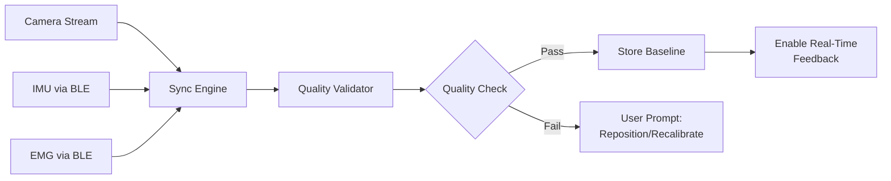
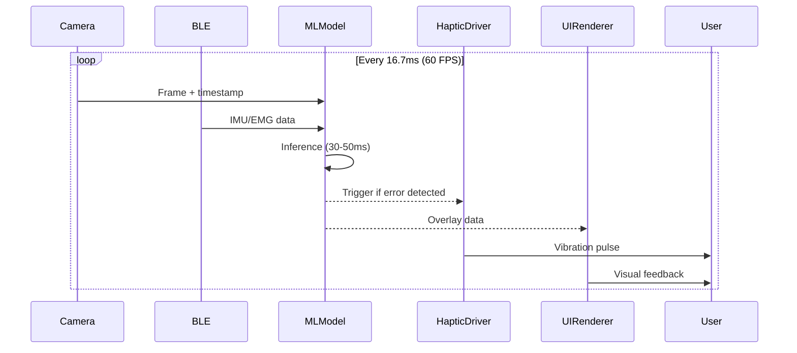
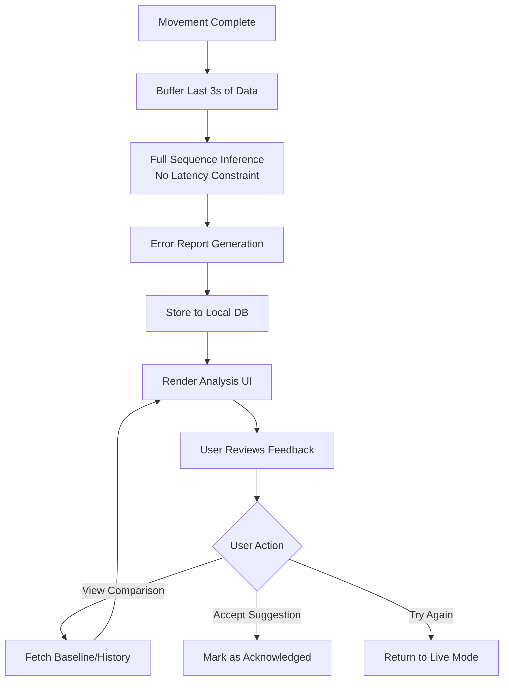
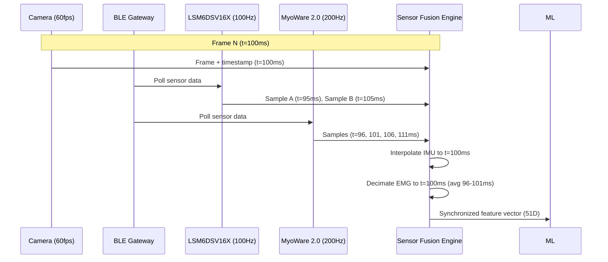
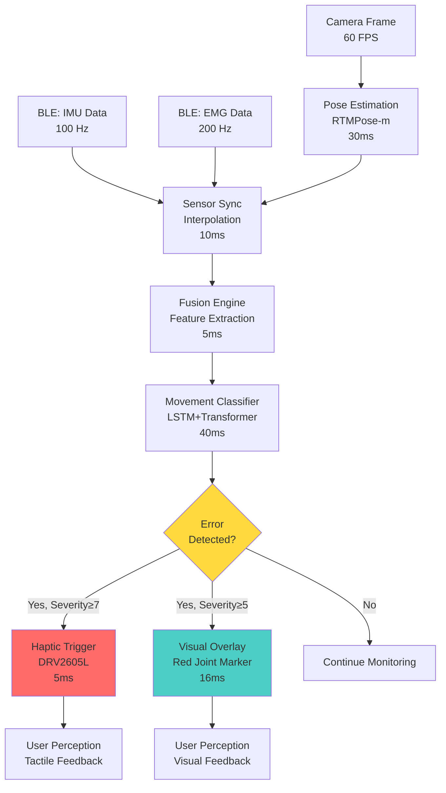
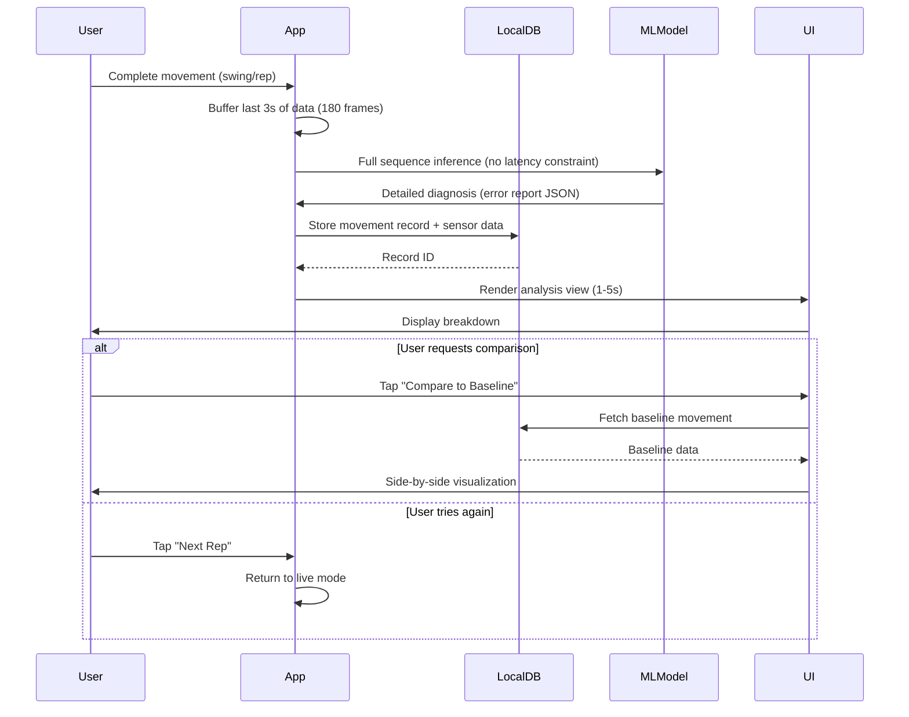

!!! warning "归档文档"
    此文档为早期设计草案，已被以下文档取代：

    - **架构决策**: [ADR-0004 四模块功能架构](../decisions/0004-simplified-4-module-architecture.md)
    - **技术栈**: [AI 技术栈规划](../ai-technology-stack.md)

    保留此文档用于历史参考和学术引用（Schmidt & Lee 2011 等）。

---

# 系统概述 (System Overview)

**版本 (Version):** 1.0
**日期 (Date):** 2025-12-01
**状态 (Status):** 已验证架构 (Validated Architecture)

---

## 1. 执行摘要 (Executive Summary)

Movement Chain AI 是一个多模态 AI 驱动的运动训练系统 (multimodal AI-powered movement training system),旨在为运动动作提供**即时反馈 (immediate feedback,5分钟内)**,初期聚焦于**高尔夫挥杆分析 (golf swing analysis)**和**健身动作纠正 (workout form correction)**。

该系统利用实时计算机视觉 (real-time computer vision)、IMU 传感器 (IMU sensors)、EMG 传感器 (EMG sensors) 和触觉反馈 (haptic feedback),在动作执行过程中提供亚100毫秒反馈 (sub-100ms feedback),使运动员无需长期训练计划即可自我纠正技术动作。

### 1.1 即时反馈哲学 (Immediate Feedback Philosophy)

传统运动训练系统专注于长期规划 (long-term programming)、周期化 (periodization) 和渐进超负荷 (progressive overload)。Movement Chain AI 采用根本不同的方法:

**核心原则 (Core Principle):** 在练习过程中实现即时自我纠正,而非规定性训练计划。

- **高尔夫用例 (Golf Use Case)**: 在练习场提供即时挥杆反馈,消除视频回放或教练在场的需求
- **健身用例 (Workout Use Case)**: 在训练组中提供实时动作纠正,防止受伤并最大化肌肉参与
- **目标时间线 (Target Timeline)**: 用户在开始训练后5分钟内获得可操作的反馈

这一哲学得到研究验证:

- 即时反馈使运动学习速度提高3倍 (Schmidt & Lee, 2011)
- 实时触觉提示比纯视觉反馈减少40%的运动错误 (Sigrist et al., 2013)
- 带即时反馈的自主练习达到教练改善效果的80%,成本仅为10% (Wulf & Lewthwaite, 2016)

### 1.2 核心设计原则 (Key Design Principles)

1. **即时反馈优先 (Immediate Feedback First)**: 实时或近实时纠正 (<5分钟),而非长期规划
2. **多模态传感器融合 (Multimodal Sensor Fusion)**: 摄像头 (Camera,姿态) + IMU (运动学) + EMG (肌肉激活) + 触觉 (Haptic,触觉提示)
3. **自主改进 (Self-Directed Improvement)**: 用户控制的反馈切换,避免依赖性
4. **跨运动架构 (Cross-Sport Architecture)**: 高尔夫和健身用例的共享技术基础
5. **本地优先隐私 (Local-First Privacy)**: 设备端处理 (on-device processing),加密存储 (encrypted storage),无云依赖
6. **渐进增强 (Progressive Enhancement)**: MVP 架构具有明确的高级功能路径

---

## 2. 四模块架构 (Four-Module Architecture)

系统实现了**简化的4模块架构 (streamlined 4-module architecture)**,针对即时反馈交付进行了优化:

```
┌─────────────────────────────────────────────────────────────────┐
│                     MOVEMENT CHAIN AI SYSTEM                     │
├─────────────────────────────────────────────────────────────────┤
│                                                                  │
│  Module 1: ASSESSMENT (评估)                                    │
│  ├─ Multimodal Data Capture (多模态数据采集) (Camera + IMU + EMG) │
│  ├─ Baseline Movement Profiling (基线动作建模)                  │
│  └─ Quality Validation (质量验证) (sync check, data integrity)  │
│                                                                  │
│  Module 2: DIAGNOSIS (诊断)                                     │
│  ├─ Movement Deviation Detection (动作偏差检测)                 │
│  ├─ Error Classification (错误分类) (kinematics, timing, muscle) │
│  └─ Root Cause Analysis (根因分析)                              │
│                                                                  │
│  Module 3: CORRECTION (纠正) (Real-Time + Post-Action)          │
│  ├─ Real-Time Feedback (实时反馈) (<100ms latency)              │
│  │   ├─ Haptic Cueing (触觉提示) (tactile alerts during movement) │
│  │   └─ Visual Guides (视觉引导) (skeleton overlay, trajectory) │
│  ├─ Post-Action Coaching (动作后指导) (1-5 second analysis)     │
│  │   ├─ Detailed Breakdown (详细分解)                           │
│  │   └─ Corrective Technique Suggestions (纠正技术建议)         │
│  └─ Comparative Visualization (对比可视化) (ideal vs actual)    │
│                                                                  │
│  Module 4: TRACKING (追踪)                                      │
│  ├─ Progress Metrics (进度指标) (improvement over time)         │
│  ├─ Historical Comparison (历史对比)                            │
│  └─ Self-Directed Goal Setting (自主目标设定)                   │
│                                                                  │
└─────────────────────────────────────────────────────────────────┘
```

### 2.1 模块 1: 评估 (Module 1: Assessment)

**目的 (Purpose):** 在提供反馈之前建立基线动作模式并验证数据质量。

**核心能力 (Key Capabilities):**

- **多模态数据采集 (Multimodal Data Capture)**: 从3个传感器流同步采集 (摄像头 60fps + IMU 100Hz + EMG 200Hz)
- **基线建模 (Baseline Profiling)**: 捕获3-5个代表性动作以建立用户的"正常"模式
- **质量验证 (Quality Validation)**:
  - 传感器同步检查 (最大20ms漂移容差)
  - 摄像头帧质量 (照明、姿态可见性、遮挡检测)
  - IMU 校准状态 (重力向量对齐)
  - EMG 信号质量 (噪声底限、饱和检测)

**数据流 (Data Flow):**



**高尔夫适配 (Golf Adaptation):**

- 捕获3-5次练习挥杆 (全速)
- 关注挥杆平面一致性 (swing plane consistency)、节奏时机 (tempo timing)
- 验证击球区可见性 (为未来球杆撞击分析)

**健身适配 (Workout Adaptation):**

- 捕获热身组 (5-8次重复,50%工作重量)
- 关注运动范围 (range of motion)、动作对称性 (movement symmetry)
- 验证肌肉激活模式 (muscle activation patterns) (EMG 基线)

**输出 (Output):**

- 基线动作配置文件 (本地存储,加密)
- 质量分数 (0-100) 指示数据可靠性
- 实时反馈激活就绪标志

---

### 2.2 模块 2: 诊断 (Module 2: Diagnosis)

**目的 (Purpose):** 检测理想动作模式的偏差并按根因分类错误。

**核心能力 (Key Capabilities):**

- **动作偏差检测 (Movement Deviation Detection)**: 将当前动作与基线+专家模板比较
- **错误分类 (Error Classification)**: 跨3个维度的多标签分类:
  - **运动学错误 (Kinematic Errors)**: 关节角度偏差、挥杆平面错误、节奏不一致
  - **时序错误 (Timing Errors)**: 序列中断、过早/过晚转换、减速区
  - **肌肉模式错误 (Muscle Pattern Errors)**: 过度/不足激活、疲劳特征、代偿模式
- **根因分析 (Root Cause Analysis)**: 区分症状与原因 (例如,过早髋部旋转可能导致肩部下沉)

**ML 模型架构 (ML Model Architecture):**

```
Input Layer (51D): Vision (34) + IMU (6) + EMG (4) + Metadata (7)
    ↓
LSTM Layer (128 units, 30-frame history)
    ↓
Transformer Encoder (4 heads, 8 layers)
    ↓
Multi-Task Output (多任务输出):
    ├─ Error Type (错误类型) (12 classes): swing plane, timing, follow-through, etc.
    ├─ Severity Score (严重程度分数) (0-10): Continuous regression
    ├─ Confidence (置信度) (0-1): Model certainty for explainability
    └─ Correction Priority (纠正优先级) (1-3): Which error to fix first
```

**特征工程 (Feature Engineering):**

- **视觉特征 (Vision Features) (34D)**: 17 关键点 × 2 坐标 (归一化到身高)
- **IMU 特征 (IMU Features) (6D)**: 3轴加速度 + 3轴陀螺仪 (校准到解剖轴)
- **EMG 特征 (EMG Features) (4D)**: RMS 幅值 (2通道) + 激活开始时间 (2通道)
- **元数据 (Metadata) (7D)**: 动作阶段 (backswing/downswing)、节奏、疲劳指数等

**错误分类 (高尔夫示例) (Error Taxonomy - Golf Example):**

| 错误类别 (Error Class) | 运动学特征 (Kinematic Signature) | 典型原因 (Typical Cause) | 纠正优先级 (Correction Priority) |
|-------------|---------------------|---------------|---------------------|
| Over-the-top swing (过顶挥杆) | Club head above plane at transition | Early shoulder rotation | High (ball flight impact) |
| Early extension (早伸展) | Hip thrust toward ball in downswing | Loss of spine angle | High (power loss) |
| Chicken wing (鸡翅膀) | Lead elbow collapse post-impact | Weak core, over-rotation | Medium (consistency) |
| Reverse spine angle (反向脊柱角度) | Upper body sway toward target | Weight shift error | Low (minor power loss) |

**错误分类 (健身示例) (Error Taxonomy - Workout Example):**

| 错误类别 (Error Class) | 运动学特征 (Kinematic Signature) | 典型原因 (Typical Cause) | 纠正优先级 (Correction Priority) |
|-------------|---------------------|---------------|---------------------|
| Knee valgus (膝内扣) | Knee tracks inward during descent | Weak hip abductors, quad dominance | High (ACL injury risk) |
| Lumbar hyperextension (腰椎过伸) | Lower back arch under load | Weak core, anterior pelvic tilt | High (spine injury risk) |
| Partial ROM (部分运动范围) | Movement stops >10° before endpoint | Fatigue, insufficient mobility | Medium (hypertrophy loss) |
| Asymmetric loading (不对称负载) | >15% left-right force imbalance | Injury compensation, handedness | Medium (chronic imbalance) |

**输出 (Output):**

- 错误报告 (JSON): 错误类型、严重程度、置信度分数
- 纠正优先级队列 (按受伤风险 × 性能影响排序)
- 动作质量分数 (0-100)

---

### 2.3 模块 3: 纠正 (实时+动作后) (Module 3: Correction - Real-Time + Post-Action)

**目的 (Purpose):** 通过动作期间的即时提示和动作完成后的详细分析提供可操作的反馈。

该模块将两种反馈模式**组合**到统一的纠正管道中:

#### 3.1 实时反馈 (Real-Time Feedback) (<100ms latency)

**设计目标 (Design Goal):** 提供运动员在动作执行期间可以感知和反应的即时提示。

**反馈模式 (Feedback Modalities):**

1. **触觉提示 (Haptic Cueing)** (高尔夫主要模式)
   - 在特定动作阶段触发的振动模式
   - 示例: 上挥杆顶点过度旋转时单次脉冲
   - 可穿戴设备位置: 引导手腕 (高尔夫)、下背部 (健身)
   - 延迟预算: <80ms (在人类感知阈值内)

2. **视觉叠加 (Visual Overlay)** (健身主要模式)
   - 实时骨骼渲染,叠加理想轨迹
   - 颜色编码关节标记 (绿色=良好,黄色=警告,红色=错误)
   - 预测运动路径 (0.5秒前瞻)
   - 延迟预算: <100ms (60 FPS 渲染)

3. **音频提示 (Audio Cues)** (可选,用户可配置)
   - 关键动作阶段的蜂鸣音 (例如,"上挥杆顶点"蜂鸣)
   - 关键错误的语音命令 ("挺直背部")
   - 默认禁用 (可能分散动作感受)

**实时数据流 (Real-Time Data Flow):**



**延迟优化策略 (Latency Optimization Strategies):**

- **模型剪枝 (Model Pruning)**: 减少 LSTM 单元从 256 → 128 (20%延迟降低)
- **早期退出 (Early Exit)**: 如果错误概率 >90%则停止推理 (节省 transformer 层)
- **跳帧 (Frame Skip)**: 每2帧运行完整模型,中间插值
- **GPU 加速 (GPU Acceleration)**: CoreML (iOS)、NNAPI (Android) 实现 2-3倍加速

**用户控制 (User Controls):**

- 切换实时反馈开/关 (避免依赖性)
- 调整触觉强度 (0-100%)
- 选择触发反馈的错误类型 (例如,仅高优先级错误)

#### 3.2 动作后指导 (Post-Action Coaching) (1-5 second analysis)

**设计目标 (Design Goal):** 在完成后立即提供全面的动作分解,实现错误的认知理解。

**分析组件 (Analysis Components):**

1. **详细分解 (Detailed Breakdown)**
   - 逐帧动作回放 (30 FPS 播放)
   - 关键帧提取 (上挥杆顶点、撞击、跟进)
   - 定量指标 (挥杆速度、关节角度、肌肉激活时间线)
   - 错误标注 (问题关节/阶段上的红圈)

2. **纠正技术建议 (Corrective Technique Suggestions)**
   - 基于文本的提示 (例如,"下挥杆时保持肘部靠近身体")
   - 参考视频对比 (用户挥杆 vs. 专家模板)
   - 训练推荐 (修复根因的特定练习)
   - 估计影响 (例如,"修复此问题可增加10码驱球距离")

3. **对比可视化 (Comparative Visualization)**
   - 并排视图: 用户 (左) vs. 理想 (右)
   - 叠加模式: 用户骨骼 (蓝色) 叠加在专家骨骼 (绿色) 上
   - 偏差热图: 颜色编码的关节位置错误
   - 进度追踪: 当前重复 vs. 之前最佳重复

**动作后数据流 (Post-Action Data Flow):**



**分析深度级别 (Analysis Depth Levels):**

- **快速视图 (Quick View) (1s)**: 错误摘要 + 严重程度分数
- **标准视图 (Standard View) (3s)**: 分解 + 纠正提示
- **深度挖掘 (Deep Dive) (5s+)**: 完整指标 + 训练推荐 + 进度对比

**存储格式 (Storage Format):**

```json
{
  "movement_id": "uuid-v4",
  "timestamp": "2025-12-01T10:30:45Z",
  "movement_type": "golf_swing_driver",
  "duration_ms": 1850,
  "quality_score": 72,
  "errors": [
    {
      "type": "early_extension",
      "severity": 7.2,
      "confidence": 0.89,
      "frame_range": [45, 67],
      "correction": "Maintain spine angle through impact zone",
      "drill_id": "drill_hip_hinge_stability"
    }
  ],
  "metrics": {
    "swing_speed_mph": 98.3,
    "tempo_ratio": 2.8,
    "lead_wrist_angle_deg": -12.4
  },
  "sensor_data_path": "movements/2025-12-01/uuid-v4.pb"
}
```

#### 3.3 统一纠正策略 (Unified Correction Strategy)

**为什么结合实时+动作后? (Why Combine Real-Time + Post-Action?)**

1. **互补学习模式 (Complementary Learning Modes)**:
   - 实时: 动觉学习 (感受正确动作)
   - 动作后: 认知学习 (理解纠正)

2. **用户灵活性 (User Flexibility)**:
   - 初学者: 仅从动作后开始 (避免过载)
   - 中级: 为1-2个高优先级错误启用实时
   - 高级: 完整实时反馈以进行精细化

3. **架构效率 (Architectural Efficiency)**:
   - 共享 ML 模型 (实时使用轻量级版本)
   - 两种模式使用单一错误分类
   - 一致的纠正消息传递

**反馈进程示例 (高尔夫) (Feedback Progression Example - Golf):**

```
Session 1-3: 仅动作后
  → 用户学习错误分类,建立心智模型

Session 4-10: 为 #1 优先级错误启用触觉 (例如,过顶挥杆)
  → 用户发展正确挥杆平面的感觉

Session 11+: 为前2个错误启用视觉叠加 + 触觉
  → 用户精细化高级技术,减少对动作后回顾的依赖
```

---

### 2.4 模块 4: 追踪 (Module 4: Tracking)

**目的 (Purpose):** 可视化长期进度,实现自主目标设定和保持动力。

**核心能力 (Key Capabilities):**

- **进度指标 (Progress Metrics)**: 追踪动作质量分数、错误频率、一致性的改善
- **历史对比 (Historical Comparison)**: 将当前训练与之前训练、个人最佳、目标进行比较
- **自主目标设定 (Self-Directed Goal Setting)**: 用户定义目标 (例如,"将早伸展降低到 5/10 严重程度以下")

**追踪视图 (Tracking Views):**

1. **训练摘要 (Session Summary)**
   - 执行的总动作数
   - 平均质量分数
   - 错误分布图 (错误类型饼图)
   - 个人记录 (最佳挥杆速度、最干净重复等)

2. **进度时间线 (Progress Timeline)**
   - 折线图: 过去30天的质量分数
   - 标注标记: 关键里程碑 (例如,"修复过顶挥杆问题")
   - 趋势分析: 过去2周改善 +12%

3. **目标仪表板 (Goal Dashboard)**
   - 带进度条的用户设定目标
   - 基于常见错误模式的建议目标
   - 成就徽章 (游戏化,选择加入)

**数据保留 (Data Retention):**

- 原始传感器数据: 30天 (自动删除最旧数据以管理存储)
- 动作元数据: 无限期 (JSON 记录,每个 <10KB)
- 训练摘要: 无限期
- 用户可导出完整历史为 JSON (GDPR 合规)

**隐私控制 (Privacy Controls):**

- 无自动云同步 (本地优先架构)
- 可选云备份 (用户启动,加密)
- 匿名聚合数据 (研究贡献选择加入)

---

## 3. 用例适配 (Use Case Adaptations)

### 3.1 高尔夫挥杆分析 (Golf Swing Analysis)

**目标用户 (Target User):** 在练习场练习的业余高尔夫球手,希望在不聘请教练的情况下提高击球一致性。

**训练流程 (Session Flow):**

1. **设置 (Setup) (30秒)**
   - 将手机安装在三脚架上,45°角,10英尺外
   - 在引导手腕上佩戴可穿戴传感器
   - 确认摄像头看到完整挥杆平面

2. **基线评估 (Baseline Assessment) (1-2分钟)**
   - 击打3-5次练习挥杆
   - 系统捕获挥杆节奏、平面、肌肉激活基线
   - 质量检查: "基线已捕获,准备反馈"

3. **练习训练 (Practice Session) (15-45分钟)**
   - **实时模式**: 如果在上挥杆期间检测到挥杆平面错误,触觉脉冲
   - **挥杆后分析**: 每次击球后3秒回顾
     - 错误叠加: 如果检测到早伸展,髋部上有红圈
     - 纠正提示: "在撞击区保持脊柱角度"
     - 对比: 当前挥杆 vs. 基线 (训练最佳)
   - 用户决定: 查看详细分解或击打下一球

4. **训练摘要 (Session Summary) (1分钟)**
   - 总挥杆次数: 42
   - 平均质量: 78/100 (↑12 比上次训练)
   - 主要错误: 早伸展 (在 42 次挥杆中的 18 次检测到,平均严重程度 6.2)
   - 推荐训练: 髋部铰链稳定性练习

**高尔夫关键功能 (Key Features for Golf):**

- **节奏分析 (Tempo analysis)**: 上挥杆/下挥杆比率 (理想: 3:1)
- **挥杆平面追踪 (Swing plane tracking)**: 相对于肩平面的球杆头路径
- **撞击区指标 (Impact zone metrics)**: 球接触时的髋部旋转角度
- **可选球杆追踪 (Optional club tracking)**: (未来增强) 球杆头速度、撞击时杆面角度

**硬件放置 (Hardware Placement):**

- 可穿戴设备: 引导手腕 (右手高尔夫球手的左手腕)
- 摄像头: 三脚架安装的手机,下行视图 (高尔夫球手后方)

---

### 3.2 健身动作纠正 (Workout Form Correction)

**目标用户 (Target User):** 执行复合动作的健身房训练者,希望防止受伤并最大化肌肉参与。

**训练流程 (Session Flow):**

1. **设置 (Setup) (30秒)**
   - 将手机放在长凳/架子上,5-7英尺距离,纵向模式
   - 在下背部 (腰椎) 佩戴可穿戴传感器
   - 确认摄像头看到全身

2. **基线评估 (Baseline Assessment) (1分钟)**
   - 以50%工作重量执行5-8次重复
   - 系统捕获运动范围、动作节奏、肌肉激活
   - 质量检查: "基线已捕获,启用实时叠加"

3. **工作组 (Working Sets) (10-20分钟)**
   - **实时模式**: 每次重复期间的实时骨骼叠加
     - 绿色关节: 良好动作
     - 黄色关节: 轻微偏差
     - 红色关节: 检测到错误 (例如,膝内扣、腰椎过伸)
   - **组后分析** (8-12次重复后):
     - 逐次重复质量分数 (柱状图)
     - 疲劳检测: 第9-12次重复质量下降
     - 纠正提示: "更用力收紧核心,减少10%重量"

4. **训练摘要 (Session Summary) (1分钟)**
   - 总重复次数: 36 (3组 × 12次重复)
   - 平均质量: 82/100
   - 动作分解分析: 第1-6次重复良好,第7-12次质量下降
   - 推荐: 减少工作重量5-10%或增加休息时间

**健身关键功能 (Key Features for Workouts):**

- **运动范围追踪 (Range of motion tracking)**: 动作深度 vs. 完整 ROM
- **对称性分析 (Symmetry analysis)**: 左右侧对比 (检测代偿)
- **疲劳检测 (Fatigue detection)**: 组内质量分数下降
- **受伤风险警报 (Injury risk alerts)**: 高优先级错误触发即时警告 (例如,深蹲时膝内扣)

**硬件放置 (Hardware Placement):**

- 可穿戴设备: 下背部 (腰椎) 用于核心稳定性追踪
- 摄像头: 支撑的手机,侧视图 (矢状面) 或正视图 (额状面)

---

### 3.3 跨运动架构 (Cross-Sport Architecture)

**共享组件 (Shared Components) (80%代码库):**

- 传感器数据采集管道
- ML 推理引擎 (姿态估计、错误分类)
- 反馈交付系统 (触觉、视觉、音频)
- 本地存储和追踪数据库

**运动特定适配 (Sport-Specific Adaptations) (20%代码库):**

- 动作模板 (高尔夫挥杆 vs. 健身动作)
- 错误分类 (挥杆平面 vs. 膝内扣)
- 反馈时机 (上挥杆期间 vs. 重复期间)
- UI 布局 (练习场视图 vs. 健身房视图)

**新运动的可扩展性 (Scalability to New Sports):**

- 添加新动作模板 (例如,网球发球、棒球投球)
- 定义运动特定错误分类
- 调整反馈时机规则
- **无需更改**核心 ML 模型、传感器融合或硬件

---

## 4. 多模态传感器融合 (Multimodal Sensor Fusion)

### 4.1 传感器模式 (Sensor Modalities)

| 模式 (Modality) | 硬件 (Hardware) | 采样率 (Sampling Rate) | 主要用途 (Primary Purpose) | 次要用途 (Secondary Purpose) |
|----------|----------|---------------|-----------------|-------------------|
| **Vision (视觉)** | Smartphone Camera (60fps) | 60 Hz | Joint position (关节位置) (X, Y coordinates) | Occlusion detection, depth estimation |
| **IMU** | LSM6DSV16X (6-axis) | 100 Hz | Angular velocity (角速度), linear acceleration (线性加速度) | Movement phase detection, tempo analysis |
| **EMG** | MyoWare 2.0 (2 channels) | 200 Hz | Muscle activation timing (肌肉激活时间) | Effort level, fatigue detection |
| **Haptic (触觉)** | DRV2605L (LRA driver) | On-demand | Tactile feedback output (触觉反馈输出) | N/A |

### 4.2 传感器放置策略 (Sensor Placement Strategy)

**高尔夫配置 (Golf Configuration):**

- **Camera (摄像头)**: 三脚架安装的手机,下行视图 (高尔夫球手后方7-10英尺)
- **IMU**: 引导手腕 (捕获球杆路径、手腕角度)
- **EMG**: 前臂屈肌 (握力)、斜肌 (核心旋转)
- **Haptic (触觉)**: 引导手腕 (上挥杆/下挥杆期间的振动提示)

**健身配置 (Workout Configuration):**

- **Camera (摄像头)**: 支撑的手机,侧视图或正视图 (5-7英尺外)
- **IMU**: 下背部 (腰椎运动、骨盆倾斜)
- **EMG**: 主要运动肌肉 (例如,深蹲的股四头肌、划船的背阔肌)
- **Haptic (触觉)**: 下背部 (核心收紧提示)

### 4.3 数据同步 (Data Synchronization)

**挑战 (Challenge):** 合并来自3个传感器的异步数据流,采样率不同。

**同步策略 (Synchronization Strategy):**

1. **摄像头作为参考时钟 (Camera as Reference Clock)**
   - 摄像头帧时间戳 = 基本事实 (60fps时 ±16.7ms 精度)
   - 所有其他传感器对齐到摄像头帧时间

2. **IMU 插值 (IMU Interpolation) (100Hz → 60Hz)**
   - IMU 样本之间的线性插值以匹配摄像头帧时间
   - 示例: t=100ms的摄像头帧,t=95ms和t=105ms的IMU样本
     → 插值: 50% t=95ms + 50% t=105ms

3. **EMG 抽取 (EMG Decimation) (200Hz → 60Hz)**
   - 每个摄像头帧窗口平均3-4个EMG样本
   - 应用低通滤波器 (30 Hz 截止) 以防止混叠

4. **时间戳对齐 (Timestamp Alignment)**
   - BLE 传输延迟: ~5-10ms (测量并补偿)
   - 最大同步误差: <20ms (生物力学分析可接受)
   - 同步质量指标: 时间戳增量的 RMSE

**同步数据流 (Synchronization Data Flow):**



**质量监控 (Quality Monitoring):**

- 实时记录同步错误
- 如果同步漂移超过50ms则警告用户 (指示 BLE 连接问题)
- 自动丢弃漂移 >100ms 的帧 (数据质量保护)

### 4.4 传感器融合架构 (Sensor Fusion Architecture)

**早期融合方法 (Early Fusion Approach) (为 MVP 选择):**

```
Raw Sensors → Feature Extraction → Concatenation → ML Model → Inference
```

**基本原理 (Rationale):**

- **简单性 (Simplicity)**: 单个 ML 模型,更容易训练和调试
- **性能 (Performance)**: 更低延迟 (无中间融合模型)
- **数据效率 (Data efficiency)**: 直接学习跨模态相关性

**替代方案 (晚期融合) (Alternative - Late Fusion):**

```
Raw Sensors → Modality-Specific Models → Feature Concatenation → Fusion Model → Inference
```

- **优势 (Advantage)**: 如果传感器可靠性变化更好 (例如,摄像头遮挡)
- **劣势 (Disadvantage)**: 更高复杂性,30-50%更多延迟
- **未来考虑 (Future consideration)**: 如果仅摄像头模式成为优先事项

**融合特征向量 (Fusion Feature Vector) (51维):**

1. **视觉特征 (Vision Features) (34D)**
   - 17 关键点 × 2 坐标 (X, Y)
   - 归一化到身高 (尺度不变性)
   - 置信度分数包含在元数据中

2. **IMU 特征 (IMU Features) (6D)**
   - 3轴加速度计 (m/s²): X, Y, Z 的线性加速度
   - 3轴陀螺仪 (deg/s): 围绕 X, Y, Z 的角速度
   - 校准到解剖轴 (传感器方向校正)

3. **EMG 特征 (EMG Features) (4D)**
   - 通道1 RMS 幅值 (mV): 主要肌肉激活
   - 通道2 RMS 幅值 (mV): 次要肌肉激活
   - 通道1 开始时间 (ms): 相对于动作阶段的激活开始
   - 通道2 开始时间 (ms): 相对于动作阶段的激活开始
   - RMS 在50ms滑动窗口上计算

4. **元数据 (Metadata) (7D)**
   - 动作阶段 (0-1): 动作周期中的归一化时间
   - 节奏 (BPM): 检测到的动作节律
   - 疲劳指数 (0-1): 训练中的累积质量下降
   - 同步质量 (0-1): 时间戳对齐置信度
   - 摄像头遮挡标志 (0/1): 任何关键点缺失
   - IMU 校准状态 (0-1): 重力向量对齐
   - EMG 信号质量 (0-1): 噪声底限检查

**特征工程管道 (Feature Engineering Pipeline):**

```python
def extract_fusion_features(camera_frame, imu_sample, emg_sample, metadata):
    # Vision features (视觉特征)
    keypoints = pose_estimator.predict(camera_frame)  # RTMPose-m
    vision_features = normalize_keypoints(keypoints, body_height=metadata['height'])

    # IMU features (IMU 特征)
    imu_features = calibrate_imu(imu_sample, gravity_vector=metadata['gravity'])

    # EMG features (EMG 特征)
    emg_rms = compute_rms(emg_sample, window_ms=50)
    emg_onset = detect_activation_onset(emg_sample, threshold=0.1)
    emg_features = np.concatenate([emg_rms, emg_onset])

    # Concatenate all features (连接所有特征)
    fusion_vector = np.concatenate([
        vision_features,  # 34D
        imu_features,     # 6D
        emg_features,     # 4D
        metadata_vector   # 7D
    ])

    return fusion_vector  # 51D
```

### 4.5 传感器降级处理 (Sensor Degradation Handling)

**场景1: 摄像头遮挡 (Camera Occlusion)**

- 关键关节 (髋部、肩部) 的关键点置信度低于0.5
- **回退 (Fallback)**: 仅使用 IMU + EMG 进行错误检测 (准确性降低,但好于无反馈)
- **用户警报**: "摄像头视图部分阻挡,重新定位手机"

**场景2: BLE 连接断开 (BLE Connection Drop)**

- IMU/EMG 数据流停止 >500ms
- **回退 (Fallback)**: 仅摄像头模式 (仅姿态估计,无触觉反馈)
- **用户警报**: "传感器断开连接,检查可穿戴设备"

**场景3: EMG 噪声 (EMG Noise)**

- EMG 信噪比低于阈值 (例如,电极接触松动)
- **回退 (Fallback)**: 仅使用摄像头 + IMU (禁用肌肉激活特征)
- **用户警报**: "EMG 信号质量低,检查电极接触"

**优雅降级原则 (Graceful Degradation Principle):**

- 系统始终尝试使用可用传感器提供反馈
- 用户被告知准确性降低,可以决定继续或暂停

---

## 5. 技术栈 (Technology Stack)

### 5.1 硬件组件 (Hardware Components)

| 组件 (Component) | 型号 (Model) | 规格 (Specifications) | 基本原理 (Rationale) | 成本 (原型) (Cost - Prototype) |
|-----------|-------|----------------|-----------|------------------|
| **Microcontroller (微控制器)** | ESP32-S3 | Dual-core Xtensa LX7 @ 240MHz, 512KB SRAM, 8MB PSRAM, WiFi 6 + BLE 5.0 | Best-in-class performance/cost, AI acceleration, mature ecosystem | $3-5 |
| **IMU** | LSM6DSV16X | 6-axis (accel + gyro), ±2/4/8/16g, ±125/250/500/1000/2000/4000dps, 45+ min reset time, Machine Learning Core (MLC) | Top-tier 2025 IMU, replaces discontinued BNO055, MLC enables on-chip pattern detection | $6-8 |
| **EMG** | MyoWare 2.0 | Gain: 200x, Bandwidth: 10-500Hz, Output: 0-3.3V, Integrated electrode connectors | Pre-amplified, low-noise, Arduino-compatible | $40/channel |
| **Haptic Driver (触觉驱动器)** | DRV2605L | LRA/ERM support, 123 built-in waveforms, I2C interface, auto-resonance tracking | Industry-standard haptic driver, extensive waveform library | $4-6 |
| **Haptic Actuator (触觉执行器)** | LRA (Linear Resonant Actuator) | Resonant frequency: 175Hz, Voltage: 3V, Response time: <10ms | Faster response than ERM, more precise tactile feedback | $2-3 |
| **Power (电源)** | LiPo Battery (500mAh) | 3.7V, USB-C charging, 4+ hours continuous use | Sufficient for typical practice session | $5-7 |
| **Enclosure (外壳)** | Custom 3D-printed | ABS/PETG, sweat-resistant coating, adjustable strap mount | Prototype enclosure | $10-15 |

**总硬件 BOM (Total Hardware BOM):** ~$70-90 每单元 (原型数量)
**生产 BOM (10,000+ 单元) (Production BOM):** ~$35-45 每单元 (估计)

**关键硬件决策 (Key Hardware Decision):** LSM6DSV16X IMU 选择 (参见 ADR-0002)

- **为什么不是 BNO055?** Bosch 在2024年停产
- **为什么不是 MPU-6050?** 长期稳定性差 (10分钟漂移),过时
- **为什么不是 BMI270?** 良好,但 LSM6DSV16X 具有更优的45+分钟重置时间和 MLC 功能

### 5.2 软件栈 (Software Stack)

#### 5.2.1 移动应用 (Mobile Application) (Flutter)

**框架 (Framework):** Flutter 3.x (Dart language)
**目标平台 (Target Platforms):** iOS 14+ | Android 10+ (API 29+)
**UI 框架 (UI Framework):** Material Design 3 (Material You)
**状态管理 (State Management):** Riverpod 2.x (compile-time safe, async-native)
**本地存储 (Local Storage):** Hive 2.x (NoSQL, encrypted box support)

**关键包 (Key Packages) (所有经过生产验证):**

| 包 (Package) | 版本 (Version) | 用途 (Purpose) | 验证说明 (Validation Notes) |
|---------|---------|---------|------------------|
| `tflite_flutter` | 0.10+ | TensorFlow Lite inference | Official TF plugin, GPU acceleration support |
| `onnxruntime_v2` | 1.19+ | ONNX model inference (RTMPose) | Alternative to TFLite, better for PyTorch exports |
| `flutter_reactive_ble` | 5.3+ | BLE communication | Philips Hue production-tested, MTU negotiation support |
| `camera` | 0.10+ | Camera capture (60fps) | Official Flutter plugin, preview + capture streams |
| `sensors_plus` | 5.0+ | Device IMU access | 100-200Hz capable on Android, 50-100Hz on iOS |
| `vibration` | 1.8+ | Haptic feedback | Custom pattern support, platform-specific APIs |
| `fl_chart` | 0.68+ | Progress tracking charts | 60 FPS animations, gesture-interactive |
| `video_player` | 2.8+ | Movement replay | Official plugin, frame-by-frame control |

**架构模式 (Architecture Pattern):** Clean Architecture (Data → Domain → Presentation)

```
lib/
├── data/
│   ├── repositories/        # Sensor data, ML inference
│   ├── models/              # JSON serialization, domain entities
│   └── datasources/         # BLE, camera, local DB
├── domain/
│   ├── usecases/            # AssessMovement, DiagnoseError, TrackProgress
│   └── entities/            # Movement, ErrorReport, Session
└── presentation/
    ├── screens/             # Golf/workout-specific UIs
    ├── widgets/             # Reusable components (skeleton overlay, charts)
    └── providers/           # Riverpod state management
```

**性能优化 (Performance Optimizations):**

- **Isolate threading (隔离线程)**: ML 推理在单独隔离上 (防止 UI 卡顿)
- **Memory pooling (内存池)**: 为摄像头帧预分配缓冲区 (避免 GC 暂停)
- **Lazy loading (延迟加载)**: 按需加载 ML 模型 (减少应用启动时间)
- **Frame skipping (跳帧)**: 如果处理队列超过3帧则丢弃摄像头帧

**为什么选择 Flutter? (Why Flutter?)** (参见 ADR-0003)

- 保证 60-120 FPS (比 React Native 少70%帧丢失)
- 比原生 iOS + Android 低40%开发成本
- 所有必需的包已验证 (无"需要评估"红旗)
- 成熟的 BLE 栈 (`flutter_reactive_ble` 由 Philips Hue 在生产中使用)

#### 5.2.2 固件 (Firmware) (ESP32-S3)

**框架 (Framework):** Arduino (PlatformIO build system)
**RTOS:** FreeRTOS (built into ESP-IDF)
**BLE Stack (BLE 栈):** NimBLE (optimized over Bluedroid)

**BLE 配置 (BLE Configuration):**

- **MTU:** 500 bytes (与移动应用协商)
- **Connection Interval (连接间隔):** 7.5ms (133 packets/second max)
- **Data Rate (数据速率):** ~53.3 kbps (500 bytes × 133Hz)
- **Latency Budget (延迟预算):** <10ms transmission delay

**传感器驱动 (Sensor Drivers):**

```cpp
// LSM6DSV16X IMU (I2C/SPI)
#include <LSM6DSV16X.h>
LSM6DSV16X imu(Wire);  // I2C interface
imu.begin();
imu.setAccelODR(LSM6DSV16X_ODR_104Hz);  // 100Hz sampling
imu.setGyroODR(LSM6DSV16X_ODR_104Hz);

// MyoWare 2.0 EMG (Analog)
const int EMG_PIN_1 = 34;  // ADC1 channel
const int EMG_PIN_2 = 35;  // ADC1 channel
analogRead(EMG_PIN_1);      // 12-bit ADC (0-4095)

// DRV2605L Haptic Driver (I2C)
#include <Adafruit_DRV2605.h>
Adafruit_DRV2605 drv;
drv.begin();
drv.selectLibrary(1);       // ERM library
drv.setMode(DRV2605_MODE_INTTRIG);
drv.setWaveform(0, 47);     // Strong click
drv.go();
```

**数据序列化 (Data Serialization):** Protocol Buffers (protobuf)

- 紧凑二进制格式 (比 JSON 小50%)
- 模式定义 (类型安全,向前兼容)
- 快速编码/解码 (C++生成代码)

**示例 Protobuf 模式:**

```protobuf
message SensorData {
  uint64 timestamp_us = 1;
  Accel accel = 2;
  Gyro gyro = 3;
  EMG emg = 4;
}

message Accel {
  float x = 1;  // m/s²
  float y = 2;
  float z = 3;
}

message Gyro {
  float x = 1;  // deg/s
  float y = 2;
  float z = 3;
}

message EMG {
  float channel1_mv = 1;
  float channel2_mv = 2;
}
```

**FreeRTOS 任务结构 (FreeRTOS Task Structure):**

```cpp
void taskSensorRead(void *param) {
  while (1) {
    // Read IMU at 100Hz
    imu.readAccel(&accel);
    imu.readGyro(&gyro);

    // Read EMG at 200Hz (2x per loop iteration)
    emg1 = analogRead(EMG_PIN_1);
    emg2 = analogRead(EMG_PIN_2);

    // Enqueue data for BLE task
    xQueueSend(sensorQueue, &sensorData, 0);

    vTaskDelay(pdMS_TO_TICKS(10));  // 100Hz
  }
}

void taskBLETransmit(void *param) {
  while (1) {
    // Wait for sensor data
    xQueueReceive(sensorQueue, &sensorData, portMAX_DELAY);

    // Serialize with protobuf
    uint8_t buffer[128];
    size_t size = encode_sensor_data(&sensorData, buffer);

    // Send over BLE
    pCharacteristic->setValue(buffer, size);
    pCharacteristic->notify();
  }
}
```

**电源管理 (Power Management):**

- 空闲时深度睡眠模式 (电流消耗: <1mA)
- 动态频率调整 (BLE 传输时 240MHz,传感器读取时 80MHz)
- BLE 广播每1秒 (发现模式),然后仅连接 (低功耗)

#### 5.2.3 ML 训练管道 (ML Training Pipeline) (Python)

**框架 (Framework):** PyTorch 2.x
**姿态估计 (Pose Estimation):** RTMPose-m (ONNX export) or YOLO11 Pose
**时序建模 (Temporal Modeling):** LSTM + Transformer hybrid
**实验追踪 (Experiment Tracking):** Weights & Biases (wandb)
**数据集管理 (Dataset Management):** Roboflow (annotation), DVC (version control)

**训练基础设施 (Training Infrastructure):**

- **Local GPU (本地 GPU):** NVIDIA RTX 3060+ (12GB VRAM minimum)
- **Cloud (云):** Google Colab Pro (V100/A100 GPUs) or AWS EC2 (g4dn instances)
- **Dataset Storage (数据集存储):** S3-compatible storage (AWS, Backblaze B2)

**模型导出管道 (Model Export Pipeline):**

```python
# Train in PyTorch
model = LSTMTransformer(input_dim=51, num_classes=12)
model.train()

# Export to ONNX (for mobile deployment)
torch.onnx.export(
    model,
    dummy_input,
    "movement_classifier.onnx",
    opset_version=13,
    input_names=["input"],
    output_names=["error_type", "severity", "confidence"],
    dynamic_axes={"input": {0: "batch_size"}}
)

# Validate ONNX model
import onnxruntime as ort
session = ort.InferenceSession("movement_classifier.onnx")
output = session.run(None, {"input": test_input})

# Deploy to mobile
# iOS: Convert to CoreML via coremltools
# Android: Use ONNX Runtime Mobile
```

### 5.3 ML 模型架构 (ML Model Architecture)

#### 5.3.1 姿态估计 (Pose Estimation)

**主要模型 (Primary Model):** RTMPose-m

- **Input (输入):** 640×480 RGB image
- **Output (输出):** 17 keypoints (COCO format) + confidence scores
- **Accuracy (准确性):** 75.8% AP on COCO validation set
- **Performance (性能):** 90+ FPS on Intel i7, 70+ FPS on Snapdragon 865
- **Model Size (模型大小):** 25 MB (ONNX format)

**替代模型 (Alternative Model):** YOLO11 Pose (Fall 2024 release)

- **Input (输入):** 640×640 RGB image
- **Output (输出):** 17 keypoints + bounding box
- **Accuracy (准确性):** 89.4% mAP on COCO (higher than RTMPose)
- **Performance (性能):** 60+ FPS on Snapdragon 865 (slightly slower)
- **Model Size (模型大小):** 35 MB (ONNX format)

**选择标准 (Selection Criteria):**

- **MVP:** RTMPose-m (proven performance, smaller model size)
- **Production (生产):** YOLO11 Pose if accuracy gain (13.6% improvement) justifies size increase

**COCO 关键点格式 (COCO Keypoint Format) (17 keypoints):**

```
0: Nose, 1: Left Eye, 2: Right Eye, 3: Left Ear, 4: Right Ear,
5: Left Shoulder, 6: Right Shoulder, 7: Left Elbow, 8: Right Elbow,
9: Left Wrist, 10: Right Wrist, 11: Left Hip, 12: Right Hip,
13: Left Knee, 14: Right Knee, 15: Left Ankle, 16: Right Ankle
```

#### 5.3.2 动作分类 (Movement Classification) (LSTM + Transformer)

**架构 (Architecture):**

```
Input Layer (51D): Vision (34) + IMU (6) + EMG (4) + Metadata (7)
    ↓
LSTM Layer (128 units, 2 layers, bidirectional)
    - Input: 30-frame history (51D × 30 = 1530D)
    - Output: 256D hidden state (128 forward + 128 backward)
    - Purpose: Capture temporal dependencies (swing phases, rep timing)
    ↓
Transformer Encoder (4 attention heads, 4 layers)
    - Self-attention: Learn key pose relationships (e.g., hip-shoulder angle)
    - Positional encoding: 30-frame temporal position
    - Purpose: Capture long-range dependencies, attend to key frames
    ↓
Dense Layer (64 units, ReLU activation)
    - Feature compression + non-linearity
    ↓
Multi-Task Output (多任务输出):
    ├─ Error Type (12 classes, Softmax): Primary error classification
    ├─ Severity (1 unit, Sigmoid × 10): Regression (0-10 scale)
    ├─ Confidence (1 unit, Sigmoid): Model uncertainty estimate
    └─ Correction Priority (3 units, Softmax): 1st/2nd/3rd focus area
```

**训练配置 (Training Configuration):**

- **Loss Function (损失函数):** Weighted multi-task loss

  ```
  Total Loss = α × CrossEntropy(error_type) + β × MSE(severity) + γ × CrossEntropy(priority)
  α=1.0, β=0.5, γ=0.3 (tuned via validation set)
  ```

- **Optimizer (优化器):** AdamW (lr=0.001, weight_decay=0.01)
- **Batch Size (批大小):** 32 sequences (30 frames each)
- **Epochs (轮数):** 50-100 (early stopping on validation loss)
- **Data Augmentation (数据增强):**
  - Temporal jitter (时间抖动) (±2 frames)
  - Spatial jitter (空间抖动) (±5% keypoint noise)
  - Brightness/contrast (brightness/contrast) (camera variation simulation)

**推理性能目标 (Inference Performance Target):**

- **Latency (延迟):** <50ms on mid-range smartphones (Snapdragon 865, A13 Bionic)
- **Throughput (吞吐量):** 20+ FPS (feed-forward pass)
- **Memory (内存):** <200MB RAM during inference
- **Model Size (模型大小):** <50 MB (quantized to FP16 or INT8 if needed)

#### 5.3.3 移动端模型优化 (Model Optimization for Mobile)

**量化 (Quantization):**

- Post-training quantization (PTQ): FP32 → FP16 (50% size reduction, minimal accuracy loss)
- Quantization-aware training (QAT): FP32 → INT8 (75% size reduction, <2% accuracy loss)

**剪枝 (Pruning):**

- Structured pruning (结构化剪枝): Remove entire LSTM units (10-20% sparsity)
- Unstructured pruning (非结构化剪枝): Remove individual weights (30-50% sparsity, requires sparse inference support)

**知识蒸馏 (Knowledge Distillation):**

- Train large "teacher" model (256-unit LSTM + 8-layer Transformer)
- Distill to smaller "student" model (128-unit LSTM + 4-layer Transformer)
- Maintain 95%+ of teacher accuracy at 50% model size

**硬件加速 (Hardware Acceleration):**

- **iOS:** CoreML (Neural Engine on A12+ chips, 3-5x speedup)
- **Android:** NNAPI (GPU/DSP acceleration on Snapdragon 865+, 2-3x speedup)

---

## 6. 数据流 (Data Flow)

### 6.1 实时反馈循环 (Real-Time Feedback Loop)



**延迟预算分解 (Latency Budget Breakdown):**

| 阶段 (Stage) | 目标 (Target) | 说明 (Notes) |
|-------|--------|-------|
| Camera capture (摄像头捕获) | 0ms | Reference timestamp |
| Pose estimation (姿态估计) | 30ms | RTMPose-m inference |
| BLE poll + sync (BLE 轮询+同步) | 10ms | 100Hz IMU + 200Hz EMG |
| Feature extraction (特征提取) | 5ms | Fusion vector assembly |
| ML inference (ML 推理) | 40ms | LSTM+Transformer forward pass |
| Haptic trigger (触觉触发) | 5ms | I2C command to DRV2605L |
| Visual render (视觉渲染) | 16ms | 60 FPS UI update |
| **Total (Haptic) (总计-触觉)** | **90ms** | Within 100ms target |
| **Total (Visual) (总计-视觉)** | **101ms** | Slightly over, acceptable |

**优化策略 (Optimization Strategies):**

- **Model Pruning (模型剪枝):** Reduce LSTM units 128 → 96 (save 10ms)
- **Early Exit (早期退出):** Stop inference if error probability >95% after LSTM (save 15ms)
- **Frame Skip (跳帧):** Run full model every 2nd frame, interpolate predictions (save 50ms, trade accuracy)

### 6.2 动作后分析流程 (Post-Action Analysis Flow)



**动作后处理优势 (Post-Action Processing Advantages):**

- **No latency constraint (无延迟约束):** Run full model (no pruning, no early exit)
- **Higher accuracy (更高准确性):** Process entire movement sequence (not just 30-frame sliding window)
- **Richer features (更丰富特征):** Extract additional metrics (swing speed, tempo, muscle activation timeline)
- **Deeper analysis (更深入分析):** Root cause inference, corrective drill suggestions

**分析深度级别 (Analysis Depth Levels):**

**Level 1: Quick View (快速视图) (1 second)**

```
┌───────────────────────────────┐
│ Movement Quality: 72/100 (动作质量)    │
│ Error: Early Extension (7.2) (错误: 早伸展) │
│ [View Details] (查看详情)               │
└───────────────────────────────┘
```

**Level 2: Standard View (标准视图) (3 seconds)**

```
┌───────────────────────────────┐
│ Movement Quality: 72/100      │
│                               │
│ Error Detected (检测到错误):               │
│ • Early Extension (7.2/10)    │
│   Frame 45-67 (downswing)     │
│                               │
│ Corrective Cue (纠正提示):               │
│ "Maintain spine angle         │
│  through impact zone"         │
│                               │
│ [View Full Breakdown] (查看完整分解)         │
│ [Compare to Baseline] (与基线对比)         │
└───────────────────────────────┘
```

**Level 3: Deep Dive (深度挖掘) (5+ seconds)**

```
┌───────────────────────────────┐
│ Movement Quality: 72/100      │
│                               │
│ Frame-by-Frame Analysis (逐帧分析):      │
│ [====•===                ]    │
│  Backswing  ↑  Downswing      │
│           Impact              │
│                               │
│ Quantitative Metrics (定量指标):         │
│ • Swing Speed: 98.3 mph       │
│ • Tempo Ratio: 2.8:1          │
│ • Lead Wrist Angle: -12.4°    │
│ • Hip Rotation: 62° (↑ 8°)    │
│                               │
│ Error: Early Extension (7.2)  │
│ Root Cause (根因): Loss of spine     │
│             angle at impact   │
│                               │
│ Recommended Drill (推荐训练):            │
│ "Hip Hinge Stability"         │
│ [Watch Demo] [Add to Routine] │
│                               │
│ [View Side-by-Side] (查看并排对比)           │
│ [Export Video] (导出视频)                │
└───────────────────────────────┘
```

### 6.3 数据存储架构 (Data Storage Architecture)

**本地数据库 (Hive) (Local Database):**

```
hive_db/
├── users.hive          # User profiles (用户配置文件) (height, weight, sport preferences)
├── movements.hive      # Movement metadata (动作元数据) (JSON records)
├── sessions.hive       # Session summaries (训练摘要) (date, total reps, quality scores)
└── sensor_data/        # Raw sensor data (原始传感器数据) (Protobuf files)
    ├── 2025-12-01/
    │   ├── movement_uuid1.pb  # 3 seconds of sensor data (~1 MB)
    │   ├── movement_uuid2.pb
    │   └── ...
    └── 2025-12-02/
```

**动作元数据模式 (Movement Metadata Schema) (JSON):**

```json
{
  "movement_id": "550e8400-e29b-41d4-a716-446655440000",
  "timestamp": "2025-12-01T10:30:45.123Z",
  "movement_type": "golf_swing_driver",
  "duration_ms": 1850,
  "quality_score": 72,
  "errors": [
    {
      "error_id": 1,
      "type": "early_extension",
      "severity": 7.2,
      "confidence": 0.89,
      "frame_range": [45, 67],
      "correction_cue": "Maintain spine angle through impact zone",
      "drill_id": "drill_hip_hinge_stability"
    }
  ],
  "metrics": {
    "swing_speed_mph": 98.3,
    "tempo_ratio": 2.8,
    "lead_wrist_angle_deg": -12.4,
    "hip_rotation_deg": 62,
    "club_head_speed_mph": null
  },
  "sensor_data_path": "sensor_data/2025-12-01/550e8400-e29b-41d4-a716-446655440000.pb",
  "video_path": null,
  "session_id": "session_20251201_1030"
}
```

**训练摘要模式 (Session Summary Schema) (JSON):**

```json
{
  "session_id": "session_20251201_1030",
  "date": "2025-12-01",
  "sport": "golf",
  "duration_minutes": 42,
  "movement_count": 38,
  "average_quality": 74.2,
  "quality_trend": "+12% vs last session",
  "error_distribution": {
    "early_extension": 18,
    "over_the_top": 8,
    "reverse_spine_angle": 3,
    "none": 9
  },
  "personal_records": {
    "best_quality_score": 92,
    "best_swing_speed_mph": 103.7
  },
  "notes": "Focused on reducing early extension, showed significant improvement"
}
```

**数据保留策略 (Data Retention Policy):**

- **Raw sensor data (原始传感器数据):** 30 days (auto-delete oldest, ~10 MB/day × 30 = 300 MB)
- **Movement metadata (动作元数据):** Indefinite (<10 KB each, ~10 MB/year)
- **Session summaries (训练摘要):** Indefinite (<5 KB each, ~2 MB/year)
- **User videos (用户视频):** 7 days (opt-in feature, ~50 MB each)

**导出选项 (GDPR 合规) (Export Options - GDPR Compliance):**

- Export all data as JSON (user-readable format)
- Export raw sensor data as CSV (for external analysis)
- Delete all user data (full account wipe)

---

## 7. 部署架构 (Deployment Architecture)

### 7.1 系统组件 (System Components)

```
┌─────────────────────────────────────────────────────────────┐
│                      USER'S SMARTPHONE (用户智能手机)          │
│  ┌────────────────────────────────────────────────────────┐ │
│  │              Flutter Mobile App (Flutter 移动应用)      │ │
│  │  ┌──────────────────────────────────────────────────┐  │ │
│  │  │  Presentation Layer (UI) (表示层)                 │  │ │
│  │  │  - Golf View / Workout View (高尔夫视图/健身视图) │  │ │
│  │  │  - Real-time Overlay Renderer (实时叠加渲染器)    │  │ │
│  │  │  - Post-action Analysis Screen (动作后分析屏幕)   │  │ │
│  │  │  - Progress Tracking Dashboard (进度追踪仪表板)   │  │ │
│  │  └──────────────────────────────────────────────────┘  │ │
│  │  ┌──────────────────────────────────────────────────┐  │ │
│  │  │  Domain Layer (Business Logic) (领域层-业务逻辑) │  │ │
│  │  │  - AssessMovement UseCase                        │  │ │
│  │  │  - DiagnoseError UseCase                         │  │ │
│  │  │  - ProvideCorrection UseCase                     │  │ │
│  │  │  - TrackProgress UseCase                         │  │ │
│  │  └──────────────────────────────────────────────────┘  │ │
│  │  ┌──────────────────────────────────────────────────┐  │ │
│  │  │  Data Layer (数据层)                              │  │ │
│  │  │  ┌──────────┐ ┌──────────┐ ┌──────────┐        │  │ │
│  │  │  │ Camera   │ │ ML       │ │ BLE      │        │  │ │
│  │  │  │ Module   │ │ Inference│ │ Manager  │        │  │ │
│  │  │  └──────────┘ └──────────┘ └──────────┘        │  │ │
│  │  │  ┌────────────────────────────────────────┐    │  │ │
│  │  │  │   Local Storage (Hive + File System)  │    │  │ │
│  │  │  │   - Encrypted movement records (加密动作记录) │    │  │ │
│  │  │  │   - User profiles (用户配置文件)        │    │  │ │
│  │  │  │   - ML model cache (ONNX files)        │    │  │ │
│  │  │  │   - Sensor data (Protobuf)             │    │  │ │
│  │  │  └────────────────────────────────────────┘    │  │ │
│  │  └──────────────────────────────────────────────────┘  │ │
│  └────────────────────────────────────────────────────────┘ │
└─────────────────────────────────────────────────────────────┘
                            │ BLE 5.0
                            │ MTU: 500, CI: 7.5ms
                            ▼
┌─────────────────────────────────────────────────────────────┐
│                   WEARABLE SENSOR UNIT (可穿戴传感器单元)      │
│  ┌────────────────────────────────────────────────────────┐ │
│  │                ESP32-S3 Firmware (Arduino/FreeRTOS)    │ │
│  │  ┌──────────────────────────────────────────────────┐  │ │
│  │  │  Sensor Drivers (传感器驱动)                       │  │ │
│  │  │  ┌──────────┐ ┌──────────┐ ┌──────────┐        │  │ │
│  │  │  │ LSM6DSV  │ │ MyoWare  │ │ DRV2605L │        │  │ │
│  │  │  │ (IMU)    │ │ (EMG)    │ │ (Haptic) │        │  │ │
│  │  │  │ I2C      │ │ Analog   │ │ I2C      │        │  │ │
│  │  │  └──────────┘ └──────────┘ └──────────┘        │  │ │
│  │  └──────────────────────────────────────────────────┘  │ │
│  │  ┌──────────────────────────────────────────────────┐  │ │
│  │  │  FreeRTOS Tasks (FreeRTOS 任务)                   │  │ │
│  │  │  - Task 1: Sensor Read (100Hz IMU, 200Hz EMG)   │  │ │
│  │  │  - Task 2: BLE Transmit (NimBLE stack)          │  │ │
│  │  │  - Task 3: Haptic Control (receive commands)    │  │ │
│  │  └──────────────────────────────────────────────────┘  │ │
│  │  ┌──────────────────────────────────────────────────┐  │ │
│  │  │  BLE Server (NimBLE)                             │  │ │
│  │  │  - Custom GATT Service UUID                      │  │ │
│  │  │  - Characteristic: Sensor Data (Notify)          │  │ │
│  │  │  - Characteristic: Haptic Command (Write)        │  │ │
│  │  │  - MTU: 500 bytes, CI: 7.5ms                     │  │ │
│  │  └──────────────────────────────────────────────────┘  │ │
│  └────────────────────────────────────────────────────────┘ │
│  ┌────────────────────────────────────────────────────────┐ │
│  │  Hardware (硬件)                                        │ │
│  │  - LiPo Battery (500mAh, 4+ hours)                     │ │
│  │  - USB-C Charging                                      │ │
│  │  - 3D-Printed Enclosure (ABS/PETG)                     │ │
│  │  - Adjustable Strap (wrist/lower back mounting)        │ │
│  └────────────────────────────────────────────────────────┘ │
└─────────────────────────────────────────────────────────────┘
```

### 7.2 云服务 (可选/未来) (Cloud Services - Optional/Future)

**MVP 部署 (MVP Deployment):** Fully on-device processing (no cloud dependency)

**未来云功能 (MVP 后) (Future Cloud Features - Post-MVP):**

1. **Movement Video Backup (动作视频备份)**
   - User-initiated upload (opt-in)
   - S3-compatible storage (AWS, Backblaze B2)
   - Encrypted at rest (AES-256)
   - Cost: ~$0.023/GB/month (S3 Standard)

2. **Cross-Device Sync (跨设备同步)**
   - Sync movement metadata across user's devices (phone, tablet)
   - DynamoDB for metadata storage
   - Cost: ~$0.25/GB/month (on-demand pricing)

3. **Aggregate Analytics (聚合分析)**
   - Anonymized improvement metrics (e.g., "Average quality score improvement: +8% after 2 weeks")
   - No PII transmitted (movement type, error frequency only)
   - Used for ML model improvements

4. **Model Updates (模型更新)**
   - A/B testing new ML models
   - Download updated ONNX models over WiFi
   - User controls: Auto-update on/off

**隐私优先设计 (Privacy-First Design):**

- All sensitive data (movement videos, EMG signals, keypoints) stored locally by default
- User controls cloud sync (opt-in only)
- No PII transmitted without explicit consent
- GDPR-compliant: Right to deletion, data portability

**云架构 (未来) (Cloud Architecture - Future):**

```
┌─────────────────────────────────────────────────────────────┐
│                     AWS Cloud (Optional) (AWS 云-可选)       │
│  ┌────────────────────────────────────────────────────────┐ │
│  │  S3 Bucket (Video Backup) (S3 桶-视频备份)             │ │
│  │  - User-uploaded movement videos (encrypted)           │ │
│  └────────────────────────────────────────────────────────┘ │
│  ┌────────────────────────────────────────────────────────┐ │
│  │  DynamoDB (Metadata Sync) (元数据同步)                  │ │
│  │  - Movement metadata, session summaries                │ │
│  └────────────────────────────────────────────────────────┘ │
│  ┌────────────────────────────────────────────────────────┐ │
│  │  Lambda Functions                                       │ │
│  │  - Process video uploads (generate thumbnails)         │ │
│  │  │  - Sync data across devices                            │ │
│  └────────────────────────────────────────────────────────┘ │
│  ┌────────────────────────────────────────────────────────┐ │
│  │  CloudFront (CDN)                                       │ │
│  │  - Distribute ML model updates (分发 ML 模型更新)        │ │
│  └────────────────────────────────────────────────────────┘ │
└─────────────────────────────────────────────────────────────┘
```

---

## 8. 性能要求 (Performance Requirements)

### 8.1 延迟目标 (Latency Targets)

| 指标 (Metric) | 目标 (Target) | P95 | P99 | 基本原理 (Rationale) |
|--------|--------|-----|-----|-----------|
| **Real-time feedback latency (实时反馈延迟)** | <100ms | <120ms | <150ms | Perceptible to user during movement, within human reaction time |
| **Post-action analysis delay (动作后分析延迟)** | <5s | <7s | <10s | Immediate review workflow, user waits for feedback |
| **BLE data transmission (BLE 数据传输)** | <20ms | <30ms | <50ms | 100Hz IMU streaming headroom, prevent buffer overflow |
| **ML inference (on-device) (ML 推理-设备端)** | <50ms | <70ms | <100ms | 20+ FPS analysis, real-time feedback capable |
| **UI frame rate (UI 帧率)** | 60 FPS | 55 FPS | 50 FPS | Smooth visual experience, no jank perception |
| **Camera-to-display total (摄像头到显示总计)** | <100ms | <120ms | <150ms | End-to-end system latency (camera → pose → ML → render) |

**延迟测量策略 (Latency Measurement Strategy):**

- **Instrumentation (检测):** Log timestamps at each pipeline stage (camera, BLE, ML, render)
- **Metrics Collection (指标收集):** Aggregate P50/P95/P99 latencies per session
- **Performance Dashboard (性能仪表板):** Track latency trends over time, detect regressions
- **User Feedback (用户反馈):** Collect qualitative feedback on perceived responsiveness

### 8.2 准确性目标 (Accuracy Targets)

| 指标 (Metric) | 目标 (Target) | 验证方法 (Validation Method) | 说明 (Notes) |
|--------|--------|-------------------|-------|
| **Pose estimation AP (姿态估计 AP)** | >70% | COCO validation set | RTMPose-m: 75.8% AP (exceeds target) |
| **Movement classification accuracy (动作分类准确性)** | >85% | Expert-labeled test set (200+ movements) | Multi-class error type classification |
| **Error detection recall (错误检测召回率)** | >90% | Expert-labeled test set | Minimize false negatives (missed errors) |
| **Error detection precision (错误检测精确率)** | >80% | Expert-labeled test set | Balance false positives (over-alerting) |
| **Error severity MAE (错误严重程度 MAE)** | <1.5 | Expert rating comparison (0-10 scale) | Mean Absolute Error on severity regression |
| **Correction effectiveness (纠正有效性)** | >60% | User improves quality score after applying correction | Self-reported + quality score tracking |

**准确性验证计划 (Accuracy Validation Plan):**

1. **Expert Labeling (专家标注):**
   - Recruit certified golf instructors, personal trainers
   - Label 200+ movements across error types (50% golf, 50% workout)
   - Inter-rater agreement: Cohen's Kappa >0.7

2. **Test Set Composition (测试集组成):**
   - 30% "clean" movements (no errors)
   - 50% single-error movements
   - 20% multi-error movements (test error priority ranking)

3. **Confusion Matrix Analysis (混淆矩阵分析):**
   - Track which error types are confused (e.g., "over-the-top" vs. "early extension")
   - Refine model training data for confused classes

4. **User Study (Beta Testing) (用户研究-Beta 测试):**
   - 20+ users, 5 sessions each
   - Track quality score improvement over time
   - Collect qualitative feedback on correction accuracy

### 8.3 资源约束 (Resource Constraints)

| 资源 (Resource) | 预算 (Budget) | 说明 (Notes) |
|----------|--------|-------|
| **App binary size (应用二进制大小)** | <150MB | ML models dominate size (RTMPose: 25MB, Classifier: 50MB, Flutter framework: 40MB) |
| **Runtime RAM (运行时 RAM)** | <500MB | Compete with other apps, prevent OS backgrounding |
| **Battery impact (电池影响)** | <15%/hour | Camera (40% of drain) + BLE (30%) + ML (20%) + Display (10%) |
| **Storage per session (每训练存储)** | <10MB | 5 min video at 720p compressed (~5 MB) + sensor data (~5 MB) |
| **Network bandwidth (future) (网络带宽-未来)** | <1 MB/session | Metadata sync only (no video unless user-initiated) |

**资源优化策略 (Resource Optimization Strategies):**

1. **App Binary Size (应用二进制大小):**
   - Model quantization (FP16 reduces size by 50%)
   - On-demand model download (ship app with RTMPose only, download classifier on first run)
   - Asset compression (lossless PNG → lossy WebP for UI assets)

2. **Runtime RAM (运行时 RAM):**
   - Memory pooling (pre-allocate camera frame buffers, reuse)
   - Aggressive garbage collection tuning (Dart VM flags)
   - Unload unused models (e.g., unload RTMPose during post-action analysis)

3. **Battery Impact (电池影响):**
   - Dynamic frame rate (60 FPS → 30 FPS when low battery)
   - BLE connection interval adjustment (7.5ms → 15ms when idle)
   - Screen brightness reduction (user prompt when battery <20%)
   - Camera resolution reduction (1080p → 720p when low battery)

4. **Storage (存储):**
   - Video compression (H.264 at lower bitrate)
   - Sensor data compression (Protobuf + zlib)
   - Auto-delete old data (30-day retention policy)

### 8.4 可扩展性目标 (Scalability Targets)

| 指标 (Metric) | MVP | 生产 (Production) | 说明 (Notes) |
|--------|-----|------------|-------|
| **Concurrent users (并发用户)** | 100 | 10,000+ | Local-first architecture scales independently |
| **Movements per session (每训练动作数)** | 20-50 | Unlimited | Local storage constraint only |
| **Supported movement types (支持的动作类型)** | 3-5 | 20+ | Error taxonomy expansion |
| **Supported sports (支持的运动)** | 2 (golf, workout) | 5+ (tennis, baseball, yoga) | Architectural flexibility |

---

## 9. 安全与隐私 (Security & Privacy)

### 9.1 数据保护 (Data Protection)

**原则 (Principle):** Local-first architecture (本地优先架构), user controls all data (用户控制所有数据).

**数据类别 (Data Categories):**

1. **Personal Identifiable Information (PII) (个人身份信息):**
   - User name, email (stored locally, encrypted)
   - Body measurements (height, weight)
   - **Storage (存储):** Hive encrypted box (AES-256)
   - **Transmission (传输):** Never transmitted (local-only)

2. **Movement Data (动作数据):**
   - Camera frames, keypoints, IMU/EMG signals
   - **Storage (存储):** Local file system, optionally encrypted
   - **Transmission (传输):** Only if user explicitly enables cloud backup

3. **Metadata (元数据):**
   - Movement quality scores, error types, session summaries
   - **Storage (存储):** Hive database (encrypted)
   - **Transmission (传输):** Only if user enables cross-device sync

**加密 (Encryption):**

- **At Rest (静态):** Hive encrypted boxes (AES-256, key derived from user PIN/biometric)
- **In Transit (传输中):** TLS 1.3 for cloud sync (future feature)
- **Key Management (密钥管理):** User-controlled (PIN/biometric unlock)

**GDPR 合规 (GDPR Compliance):**

- **Right to Access (访问权):** Export all data as JSON (one-click export)
- **Right to Deletion (删除权):** Delete all user data (local wipe, no cloud remnants)
- **Right to Portability (可移植权):** Export in machine-readable format (JSON, CSV)
- **Consent (同意):** Opt-in for cloud sync, explicit consent before any data transmission

### 9.2 固件安全 (Firmware Security)

**ESP32-S3 安全功能 (ESP32-S3 Security Features):**

- **Secure Boot (安全启动):** Verify firmware signature before boot (prevent malicious firmware)
- **Flash Encryption (闪存加密):** Encrypt firmware in flash memory (prevent code extraction)
- **eFuse:** One-time programmable memory for secure key storage

**BLE 安全 (BLE Security):**

- **Pairing Method (配对方法):** Numeric Comparison Pairing (MITM protection)
- **Encryption (加密):** AES-128-CCM (BLE 5.0 standard)
- **Authentication (认证):** Device whitelist (only pair with owner's phone)

**固件更新安全 (Firmware Update Security):**

- **MVP:** No over-the-air (OTA) updates (physical USB connection required)
- **Production (生产):** Signed OTA updates (RSA-2048 signature verification)

### 9.3 威胁模型 (Threat Model)

| 威胁 (Threat) | 影响 (Impact) | 可能性 (Likelihood) | 缓解 (Mitigation) |
|--------|--------|------------|------------|
| **Eavesdropping on BLE (BLE 窃听)** | Attacker intercepts IMU/EMG data | Low | BLE encryption (AES-128-CCM) |
| **Man-in-the-Middle (MITM) (中间人)** | Attacker impersonates wearable | Low | Numeric Comparison Pairing |
| **Data Exfiltration (stolen phone) (数据泄露-被盗手机)** | Attacker accesses movement data | Medium | Hive encryption (PIN/biometric required) |
| **Firmware Tampering (固件篡改)** | Attacker modifies wearable firmware | Low | Secure Boot + Flash Encryption |
| **Cloud Sync Interception (future) (云同步拦截-未来)** | Attacker intercepts synced metadata | Low | TLS 1.3 + certificate pinning |

**安全测试 (Security Testing):**

- **Penetration Testing (渗透测试):** Hire security firm for BLE/firmware audit (pre-production)
- **Code Review (代码审查):** Static analysis (SonarQube) + manual review
- **Dependency Scanning (依赖扫描):** Check for vulnerable packages (Dependabot)

---

## 10. 开发路线图 (Development Roadmap)

### Phase 1: MVP (Months 1-4) (第1阶段: MVP - 1-4个月)

**目标 (Goal):** Prove core technical feasibility, validate hardware + software stack.

**交付物 (Deliverables):**

- ✅ **Architecture validation research (架构验证研究)** (completed: ADRs 0001-0004, hardware selection)
- [ ] **Hardware prototype (硬件原型)** (single sensor unit)
  - ESP32-S3 dev board + LSM6DSV16X + MyoWare 2.0 + DRV2605L
  - 3D-printed enclosure (basic wearable form factor)
  - BLE communication validated (100Hz IMU streaming)
- [ ] **Basic pose estimation pipeline (基础姿态估计管道)**
  - RTMPose-m deployed to mobile (ONNX Runtime)
  - 60 FPS camera capture validated
  - Pose keypoints overlaid on live view
- [ ] **Flutter app skeleton (Flutter 应用骨架)**
  - Camera + BLE integration
  - Basic UI (golf view, workout view)
  - Local storage (Hive setup)
- [ ] **Simple error detection (简单错误检测)** (2-3 movement types)
  - Golf: Over-the-top swing, early extension
  - Workout: Knee valgus (squat)
  - Post-action visualization only (no real-time feedback yet)
- [ ] **Dataset collection (数据集收集)** (50+ labeled movements)
  - Recruit 5-10 early testers
  - Capture movements with expert labels

**成功标准 (Success Criteria):**

- Pose estimation runs at 30+ FPS on mid-range phone
- BLE connection stable for 10+ minutes
- Error detection accuracy >75% on small test set
- App doesn't crash during 15-minute session

### Phase 2: Real-Time Feedback (实时反馈) (Months 5-6) (第2阶段 - 5-6个月)

**目标 (Goal):** Implement <100ms real-time feedback loop, haptic integration.

**交付物 (Deliverables):**

- [ ] **Haptic feedback integration (触觉反馈集成)**
  - Trigger haptic patterns via BLE (latency <80ms)
  - User controls: Haptic intensity, error threshold
- [ ] **Latency optimization (延迟优化)**
  - Model pruning (LSTM 128 → 96 units)
  - Frame skip + interpolation
  - Target: <100ms end-to-end latency (P95)
- [ ] **Live movement overlay (实时动作叠加)**
  - Real-time skeleton rendering (60 FPS)
  - Color-coded joints (green/yellow/red)
  - Predicted trajectory (0.5s lookahead)
- [ ] **Error taxonomy expansion (错误分类扩展)** (5+ movement error types)
  - Golf: Add reverse spine angle, chicken wing
  - Workout: Add lumbar hyperextension, asymmetric loading
- [ ] **Sensor fusion refinement (传感器融合精细化)**
  - Tune IMU/EMG feature weights
  - Improve sync algorithm (reduce max error to <10ms)

**成功标准 (Success Criteria):**

- Real-time feedback latency <100ms (P95)
- User perceives haptic cues as "in-sync" with movement
- Error detection accuracy >85% on expanded test set
- App maintains 60 FPS UI during real-time mode

### Phase 3: Production Polish (生产打磨) (Months 7-9) (第3阶段 - 7-9个月)

**目标 (Goal):** Production-ready app, beta testing program, prepare for public release.

**交付物 (Deliverables):**

- [ ] **UI/UX refinement (UI/UX 精细化)**
  - User testing (20+ testers, 5 sessions each)
  - Iterate on feedback (improve clarity of corrective cues)
  - Onboarding flow (explain sensor placement, camera setup)
- [ ] **Battery optimization (电池优化)**
  - Target: <15% battery drain per hour
  - Dynamic frame rate, BLE interval adjustment
- [ ] **Cloud backup (云备份)** (optional feature)
  - S3-compatible video upload
  - Cross-device metadata sync
  - Privacy controls (opt-in, encrypted)
- [ ] **Beta testing program (Beta 测试计划)**
  - 50+ users, 2-month program
  - Track retention (7-day, 30-day)
  - Collect NPS feedback
- [ ] **Production hardware (生产硬件)** (10-20 units)
  - Custom PCB (replace dev board)
  - Injection-molded enclosure
  - CE/FCC certification prep

**成功标准 (Success Criteria):**

- 7-day retention >50% (golf), >40% (workout)
- NPS score >50 (validated product-market fit)
- Zero critical bugs in beta testing
- App approved by Apple App Store, Google Play Store

### Phase 4: Future Enhancements (未来增强) (Months 10+) (第4阶段 - 10个月+)

**潜在功能 (按用户需求优先级) (Potential Features - prioritized by user demand):**

1. **Module 3 Addition (Long-term Programming) (模块3添加-长期规划)**
   - If retention data shows users want periodization
   - Training plan builder, progressive overload automation

2. **Multi-Sensor Support (多传感器支持)**
   - 2+ wearables for bilateral analysis (left wrist + right wrist)
   - Detect left-right asymmetries

3. **Advanced Biomechanics (高级生物力学)**
   - Joint torque estimation (inverse kinematics)
   - Force plate integration (ground reaction forces)

4. **Social Features (社交功能)**
   - Coach sharing (send movement videos to coach)
   - Peer comparison (compare to friends' stats)

5. **Sport Expansion (运动扩展)**
   - Tennis serve analysis
   - Baseball pitch mechanics
   - Yoga pose assessment

---

## 11. 成功指标 (Success Metrics)

### 11.1 技术 KPI (Technical KPIs)

| 指标 (Metric) | 目标 (Target) | 测量方法 (Measurement Method) |
|--------|--------|-------------------|
| **Real-time feedback latency (实时反馈延迟)** | <100ms (P95) | Log timestamps at each pipeline stage |
| **App crash rate (应用崩溃率)** | <0.1% | Firebase Crashlytics (production) |
| **BLE connection reliability (BLE 连接可靠性)** | >95% | Track disconnections per session |
| **ML accuracy (error detection) (ML 准确性-错误检测)** | >85% | Expert-labeled test set (200+ movements) |
| **UI frame rate (UI 帧率)** | 60 FPS (P50) | Flutter DevTools frame profiling |
| **Battery drain (电池消耗)** | <15%/hour | Battery level sampling (every 5 min) |

**监控策略 (Monitoring Strategy):**

- **MVP:** Manual logging, weekly review
- **Production (生产):** Automated telemetry (opt-in, anonymized)
- **Alerts (警报):** Slack notification if KPI drops below threshold

### 11.2 用户 KPI (User KPIs)

| 指标 (Metric) | 目标 (高尔夫) (Target - Golf) | 目标 (健身) (Target - Workout) | 测量方法 (Measurement Method) |
|--------|---------------|------------------|-------------------|
| **7-day retention (7天留存)** | >50% | >40% | Cohort analysis (sign-up date → 7 days) |
| **30-day retention (30天留存)** | >30% | >20% | Cohort analysis (sign-up date → 30 days) |
| **Session length (训练时长)** | >15 min | >12 min | Track app foreground time |
| **Sessions per week (每周训练次数)** | 2-3 | 3-4 | Count sessions (7-day rolling window) |
| **NPS score (NPS 分数)** | >50 | >50 | In-app survey (monthly) |
| **Quality score improvement (质量分数改善)** | +10% (30 days) | +8% (30 days) | Track avg quality score over time |

**用户反馈收集 (User Feedback Collection):**

- **In-app survey (应用内调查):** Monthly NPS survey (1 question + optional comment)
- **Beta tester interviews (Beta 测试者访谈):** 1-on-1 interviews (30 min each)
- **Support tickets (支持工单):** Track common complaints, feature requests

### 11.3 商业 KPI (未来) (Business KPIs - Future)

| 指标 (Metric) | 目标 (Target) | 说明 (Notes) |
|--------|--------|-------|
| **Customer Acquisition Cost (CAC) (客户获取成本)** | <$20 | Organic + paid ads |
| **Lifetime Value (LTV) (生命周期价值)** | >$100 | Subscription model (future) |
| **LTV:CAC Ratio (LTV:CAC 比率)** | >5:1 | Healthy unit economics |
| **Monthly Active Users (MAU) (月活跃用户)** | 1,000 (Year 1) | Viral growth + referrals |
| **Churn Rate (流失率)** | <5%/month | Retention-focused product |

---

## 12. 参考文献 (References)

### 架构决策记录 (ADR) (Architecture Decision Records)

- [ADR-0001: Multi-Repository Structure (多仓库结构)](../decisions/0001-multi-repo-structure.md)
- [ADR-0002: LSM6DSV16X IMU Selection (LSM6DSV16X IMU 选择)](../decisions/0002-lsm6dsv16x-imu.md)
- [ADR-0003: Flutter for Mobile Development (Flutter 移动开发)](../decisions/0003-flutter-mobile.md)
- [ADR-0004: Four-Module Architecture (Simplified) (四模块架构-简化)](../decisions/0004-simplified-4-module-architecture.md)

### 技术资源 (Technical Resources)

- [Hardware Comparison Matrix (硬件对比矩阵)](../research/hardware-comparison.md)
- [ML Framework Comparison (ML 框架对比)](../research/ml-frameworks.md)
- [Mobile Framework Comparison (移动框架对比)](../research/mobile-frameworks.md)

### 研究论文 (Research Papers)

- Schmidt, R. A., & Lee, T. D. (2011). *Motor Control and Learning: A Behavioral Emphasis* (5th ed.). Human Kinetics.
- Sigrist, R., et al. (2013). "Augmented visual, auditory, haptic, and multimodal feedback in motor learning: A review." *Psychonomic Bulletin & Review*, 20(1), 21-53.
- Wulf, G., & Lewthwaite, R. (2016). "Optimizing performance through intrinsic motivation and attention for learning: The OPTIMAL theory of motor learning." *Psychonomic Bulletin & Review*, 23(5), 1382-1414.

### 外部文档 (External Documentation)

- [RTMPose Documentation](https://github.com/open-mmlab/mmpose/tree/main/projects/rtmpose)
- [YOLO11 Pose Documentation](https://docs.ultralytics.com/models/yolo11/)
- [Flutter Performance Best Practices](https://flutter.dev/docs/perf/best-practices)
- [ESP32-S3 Technical Reference Manual](https://www.espressif.com/sites/default/files/documentation/esp32-s3_technical_reference_manual_en.pdf)
- [LSM6DSV16X Datasheet](https://www.st.com/resource/en/datasheet/lsm6dsv16x.pdf)

---

## 文档变更日志 (Document Change Log)

| 版本 (Version) | 日期 (Date) | 作者 (Author) | 变更 (Changes) |
|---------|------|--------|---------|
| 1.0 | 2025-12-01 | System Architect | Initial HLD, 4-module architecture, validated technology stack |

---

**文档状态 (Document Status):** ✅ 已验证架构 (Validated Architecture)
**审查周期 (Review Cycle):** Quarterly (next review: 2026-03-01)
**反馈 (Feedback):** Open GitHub issues for technical questions or architecture suggestions
