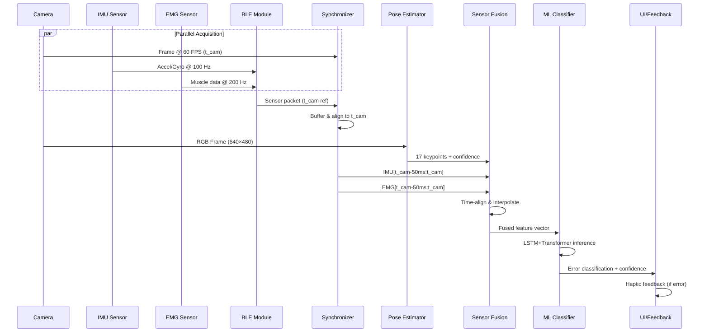

!!! warning "归档文档"
    此文档为早期数据流设计，已被以下文档取代：

    - **融合算法**: [传感器融合算法](../fusion-algorithm.md)
    - **数据格式**: [传感器数据格式规范](../sensor-data-formats.md)

    保留此文档中的时钟漂移缓解策略作为实现参考。

---

# 数据流架构 (Data Flow Architecture)

## 概述 (Overview)

Movement Chain AI 处理来自三个来源的多模态传感器数据 (multimodal sensor data): 摄像头 (camera) (60 FPS)、IMU (100 Hz) 和 EMG (200 Hz)。本文档详细说明数据流架构 (data flow architecture)、同步策略 (synchronization strategies)、格式规范 (format specifications) 以及实现延迟低于100ms的实时运动分析所需的处理路径 (processing paths)。

---

## 1. 多模态传感器数据流 (Multimodal Sensor Data Flow)

### 1.1 数据源和特征 (Data Sources and Characteristics)

| 传感器 (Sensor) | 采样率 (Sampling Rate) | 数据大小 (Data Size) | 延迟预算 (Latency Budget) | 用途 (Purpose) |
|--------|--------------|-----------|----------------|---------|
| Camera (摄像头) | 60 FPS | 640×480 RGB (~900KB/frame) | 30ms | Pose estimation (姿态估计), visual context |
| IMU (6-axis) | 100 Hz | 24 bytes/sample | 10ms | Acceleration (加速度), angular velocity (角速度) |
| EMG (4-channel) | 200 Hz | 8 bytes/sample | 10ms | Muscle activation patterns (肌肉激活模式) |

### 1.2 端到端数据管道 (End-to-End Data Pipeline)



### 1.3 数据流阶段 (Data Flow Stages)

#### 阶段 1: 采集 (Stage 1: Acquisition) (0-30ms)

- **Camera (摄像头)**: Flutter `camera` plugin captures frame at t_cam (reference timestamp)
- **BLE Streaming (BLE 流传输)**: Firmware transmits IMU/EMG packets via GATT notifications
  - MTU: 500 bytes (allows ~20 IMU samples or ~60 EMG samples per packet)
  - Connection interval (连接间隔): 7.5ms (validated for 100 Hz throughput)
  - Packets include firmware timestamp offset from BLE connection start

#### 阶段 2: 同步 (Stage 2: Synchronization) (30-40ms)

- **Timestamp Alignment (时间戳对齐)**: All sensor data indexed to camera timestamps
  - IMU/EMG firmware timestamps converted to camera timebase using initial offset calibration
  - Circular buffer (循环缓冲区) stores last 500ms of IMU/EMG data (50 IMU samples, 100 EMG samples)
- **Temporal Windowing (时间窗口)**: For each camera frame at t_cam, extract:
  - IMU samples in window [t_cam - 50ms, t_cam]
  - EMG samples in window [t_cam - 50ms, t_cam]

#### 阶段 3: 姿态估计 (Stage 3: Pose Estimation) (40-70ms)

- **Model (模型)**: RTMPose-m (optimized for mobile)
- **Input (输入)**: 640×480 RGB frame → resized to 256×192
- **Output (输出)**: 17 COCO keypoints with confidence scores
- **Processing (处理)**: GPU-accelerated inference (Core ML/TensorFlow Lite)

#### 阶段 4: 传感器融合 (Stage 4: Sensor Fusion) (70-80ms)

- **Interpolation (插值)**: Upsample IMU to match EMG rate (200 Hz) using cubic spline
- **Feature Extraction (特征提取)**:
  - **Pose (姿态)**: Joint angles (关节角度) (elbow, knee, hip, shoulder) + velocity estimates
  - **IMU**: Orientation quaternion (方向四元数), linear acceleration (gravity-compensated)
  - **EMG**: RMS amplitude per channel, frequency-domain features (50-150 Hz band power)
- **Normalization (归一化)**: Z-score normalization per feature dimension

#### 阶段 5: ML 推理 (Stage 5: ML Inference) (80-120ms)

- **Model Architecture (模型架构)**: LSTM (2 layers, 128 units) + Transformer encoder (4 heads, 2 layers)
- **Input (输入)**: Sliding window of 30 frames (500ms @ 60 FPS) × fused feature vector
- **Output (输出)**: Error classification logits + confidence scores
- **Quantization (量化)**: INT8 quantization for 2-3x speedup (target: <40ms inference)

#### 阶段 6: 反馈 (Stage 6: Feedback) (120-126ms)

- **Haptic Triggering (触觉触发)**: If error confidence > 0.7, send haptic pattern via BLE
- **UI Rendering (UI 渲染)**: Display skeleton overlay + error annotations at 60 FPS

---

## 2. 同步策略 (Synchronization Strategy)

### 2.1 摄像头时间戳作为参考 (Camera Timestamp as Reference)

**设计理由 (Design Rationale):**

- Camera frames are the lowest-rate signal (60 FPS) → natural synchronization anchor
- Pose estimation requires visual context → camera timestamp defines "analysis instant"
- BLE streaming is asynchronous → must be aligned post-hoc

### 2.2 时间戳转换协议 (Timestamp Conversion Protocol)

#### 初始化阶段 (连接建立) (Initialization Phase - Connection Establishment)

```
t_app_connect = System.currentTimeMillis()  // App records BLE connection time
```

Firmware sends initial calibration packet:

```protobuf
message TimestampCalibration {
  uint32 firmware_millis = 1;  // millis() at connection
  uint64 connection_timestamp = 2;  // Echo t_app_connect
}
```

Calculate offset (计算偏移量):

```
offset = t_app_connect - firmware_millis
```

#### 运行时对齐 (Runtime Alignment)

For each BLE packet with firmware timestamp `t_fw`:

```
t_aligned = t_fw + offset  // Convert to app timebase
```

For each camera frame at `t_cam`, retrieve:

```
imu_window = buffer.get(t_cam - 50ms, t_cam)
emg_window = buffer.get(t_cam - 50ms, t_cam)
```

### 2.3 时钟漂移缓解 (Clock Drift Mitigation)

**问题 (Problem)**: Firmware clock (millis()) drifts ~±50 ppm relative to system clock

- Worst case: 180ms drift over 1-hour session

**解决方案 (Solution)**: Periodic re-calibration (定期重新校准)

- Every 60 seconds, firmware sends heartbeat with updated `firmware_millis`
- App recalculates offset using moving average:

  ```
  offset_new = 0.9 * offset_old + 0.1 * (t_app_now - firmware_millis)
  ```

### 2.4 处理丢包 (Handling Packet Loss)

**BLE Reliability (BLE 可靠性)**: 99.5% packet delivery at 7.5ms interval

- Expected loss (预期丢失): ~0.5 packets/second at 100 Hz

**Recovery Strategy (恢复策略)**:

1. **Sequence Numbers (序列号)**: Each BLE packet includes monotonic sequence ID
2. **Gap Detection (间隙检测)**: If `seq_received != seq_expected`, mark gap
3. **Interpolation (插值)**: Linear interpolation for gaps ≤3 samples (30ms)
4. **Drop Frame (丢帧)**: If gap >3 samples, skip ML inference for that camera frame

---

## 3. 数据格式规范 (Data Format Specifications)

### 3.1 BLE Protocol Buffer 模式 (BLE Protocol Buffer Schema)

```protobuf
syntax = "proto3";

message SensorPacket {
  uint32 sequence_id = 1;         // Monotonic counter
  uint32 firmware_timestamp = 2;   // millis() at packet creation

  message IMUSample {
    float accel_x = 1;  // m/s² (range: ±16g)
    float accel_y = 2;
    float accel_z = 3;
    float gyro_x = 4;   // rad/s (range: ±2000°/s)
    float gyro_y = 5;
    float gyro_z = 6;
  }

  message EMGSample {
    uint16 channel_1 = 1;  // 12-bit ADC value (0-4095)
    uint16 channel_2 = 2;
    uint16 channel_3 = 3;
    uint16 channel_4 = 4;
  }

  repeated IMUSample imu_samples = 3;    // Up to 20 samples/packet
  repeated EMGSample emg_samples = 4;    // Up to 60 samples/packet
}
```

**Packet Size Analysis (数据包大小分析)**:

- IMU sample: 6 floats × 4 bytes = 24 bytes
- EMG sample: 4 uint16 × 2 bytes = 8 bytes
- Max packet: 20 IMU (480 bytes) OR 60 EMG (480 bytes) + header (20 bytes) = 500 bytes (fits MTU)

### 3.2 姿态估计输出 (Pose Estimation Output)

```dart
class PoseEstimationResult {
  final int frameId;
  final DateTime timestamp;
  final List<Keypoint> keypoints;  // 17 COCO keypoints
  final double inferenceTimeMs;

  // Keypoint indices (COCO format)
  static const int NOSE = 0;
  static const int LEFT_EYE = 1;
  static const int RIGHT_EYE = 2;
  static const int LEFT_EAR = 3;
  static const int RIGHT_EAR = 4;
  static const int LEFT_SHOULDER = 5;
  static const int RIGHT_SHOULDER = 6;
  static const int LEFT_ELBOW = 7;
  static const int RIGHT_ELBOW = 8;
  static const int LEFT_WRIST = 9;
  static const int RIGHT_WRIST = 10;
  static const int LEFT_HIP = 11;
  static const int RIGHT_HIP = 12;
  static const int LEFT_KNEE = 13;
  static const int RIGHT_KNEE = 14;
  static const int LEFT_ANKLE = 15;
  static const int RIGHT_ANKLE = 16;
}

class Keypoint {
  final double x;           // Normalized [0, 1]
  final double y;           // Normalized [0, 1]
  final double confidence;  // [0, 1]
}
```

### 3.3 融合特征向量 (Fused Feature Vector)

```dart
class FusedFeatures {
  // Pose-derived (姿态派生) (17 values)
  final List<double> jointAngles;  // 8 angles (elbow, knee, shoulder, hip)
  final List<double> jointVelocities;  // 8 velocities (deg/s)
  final double torsoOrientation;  // Angle relative to vertical

  // IMU-derived (IMU 派生) (10 values)
  final Quaternion orientation;  // 4 values (w, x, y, z)
  final Vector3 linearAccel;     // 3 values (gravity-compensated)
  final Vector3 angularVel;      // 3 values

  // EMG-derived (EMG 派生) (8 values)
  final List<double> rmsAmplitude;  // 4 channels
  final List<double> bandPower;     // 4 channels (50-150 Hz)

  // Total: 35 features per timestep
  // ML input: 30 timesteps × 35 features = 1050 values
}
```

### 3.4 本地存储格式 (SQLite) (Local Storage Format)

```sql
-- Training data collection (训练数据收集)
CREATE TABLE sessions (
  id INTEGER PRIMARY KEY,
  user_id TEXT NOT NULL,
  exercise_type TEXT NOT NULL,  -- 'squat', 'pushup', etc.
  start_time INTEGER NOT NULL,
  duration_ms INTEGER NOT NULL
);

CREATE TABLE frames (
  id INTEGER PRIMARY KEY,
  session_id INTEGER NOT NULL,
  timestamp INTEGER NOT NULL,  -- Unix epoch ms
  pose_json TEXT NOT NULL,     -- JSON array of 17 keypoints
  imu_json TEXT NOT NULL,      -- JSON array of IMU samples
  emg_json TEXT NOT NULL,      -- JSON array of EMG samples
  error_label TEXT,            -- Ground truth label (if available)
  FOREIGN KEY (session_id) REFERENCES sessions(id)
);

CREATE INDEX idx_session_timestamp ON frames(session_id, timestamp);
```

**Compression (压缩)**: 60-second session @ 60 FPS = 3,600 frames

- Pose data: ~1.5 KB/frame (17 keypoints × 3 values × 8 bytes)
- Sensor data: ~2 KB/frame (50 IMU + 100 EMG samples)
- Total: ~12.6 MB/minute (compress to ~3-4 MB using GZIP)

---

## 4. 实时与批处理路径 (Real-Time vs Batch Processing Paths)

### 4.1 实时路径 (实时反馈) (Real-Time Path - Live Feedback)

**Use Case (用例)**: Workout guidance with immediate error correction

**Data Flow (数据流)**:

```
Camera → Pose → Fusion → ML → Feedback (126ms latency)
       ↓
  Discard frame (no storage)
```

**Characteristics (特征)**:

- **No persistence (无持久化)**: Frames processed and discarded
- **Latency-critical (延迟关键)**: Must complete within 100ms target
- **Optimizations (优化)**:
  - Skip every other frame if latency exceeds budget (30 FPS fallback)
  - Disable logging/telemetry
  - Use quantized INT8 models

### 4.2 批处理路径 (训练后分析) (Batch Processing Path - Post-Workout Analysis)

**Use Case (用例)**: Detailed movement analytics, model retraining, progress tracking

**Data Flow (数据流)**:

```
Camera → Pose → Fusion → Storage (SQLite)
                              ↓
                        Offline ML (no latency constraint)
                              ↓
                      Generate insights (summary stats, trend analysis)
```

**Characteristics (特征)**:

- **Full persistence (完全持久化)**: All frames + raw sensor data saved
- **High accuracy (高准确性)**: Use FP32 models, multi-pass analysis
- **Additional processing (额外处理)**:
  - Optical flow analysis for smooth motion tracking
  - 3D pose reconstruction (if depth camera available)
  - Biomechanical modeling (joint torques, forces)

### 4.3 混合模式 (选择性记录) (Hybrid Mode - Selective Recording)

**Use Case (用例)**: Record only interesting segments (errors, PRs, user-flagged moments)

**Trigger Conditions (触发条件)**:

- Error confidence > 0.7 → Save ±2 seconds around error
- User presses "record" button → Save session
- New personal record detected → Save rep

**Implementation (实现)**:

```dart
class SelectiveRecorder {
  CircularBuffer<Frame> buffer;  // Last 2 seconds (120 frames)

  void onFrame(Frame frame, double errorConfidence) {
    buffer.add(frame);

    if (errorConfidence > 0.7) {
      // Flush buffer to storage
      db.saveFrames(buffer.getAll());

      // Continue recording for next 2 seconds
      isRecording = true;
      recordingEndTime = now() + 2000;
    }
  }
}
```

---

## 5. 数据质量和验证 (Data Quality and Validation)

### 5.1 输入验证 (Input Validation)

| 检查 (Check) | 标准 (Criteria) | 失败时操作 (Action on Failure) |
|-------|----------|-------------------|
| Camera frame (摄像头帧) | Non-null, correct dimensions | Skip frame, log warning |
| BLE packet (BLE 数据包) | Valid Protobuf, seq_id increments | Request retransmission (if possible) |
| Pose confidence (姿态置信度) | Mean keypoint confidence > 0.5 | Display "Move closer to camera" |
| IMU range (IMU 范围) | Accel ≤16g, Gyro ≤2000°/s | Clamp values, flag outlier |
| EMG range (EMG 范围) | ADC value ≤4095 | Clamp to max, check sensor connection |

### 5.2 同步验证 (Synchronization Validation)

**Test Protocol (测试协议)**:

1. Apply known stimulus (e.g., shake device while recording)
2. Verify IMU spike aligns with camera motion blur within ±16ms (1 frame @ 60 FPS)
3. Verify EMG spike (manual muscle contraction) aligns with pose change

**Metrics (指标)**:

- **Sync error (同步误差)**: Mean absolute difference between expected and actual alignment
- **Target (目标)**: <16ms (1 frame tolerance)

---

## 6. 故障模式和降级 (Failure Modes and Degradation)

| 故障 (Failure) | 检测 (Detection) | 优雅降级 (Graceful Degradation) |
|---------|-----------|---------------------|
| BLE disconnection (BLE 断开) | No packets for 100ms | Pause inference, show reconnection UI |
| Camera obstruction (摄像头遮挡) | Pose confidence <0.3 | Pause feedback, prompt user |
| High latency (高延迟) (>150ms) | Timestamp delta tracking | Drop to 30 FPS, disable EMG fusion |
| Low battery (低电量) (<10%) | System API | Reduce camera resolution to 320×240 |

---

## 7. 性能监控 (Performance Monitoring)

### 7.1 遥测收集 (Telemetry Collection)

```dart
class PipelineMetrics {
  final Stopwatch totalLatency;
  final Stopwatch poseInference;
  final Stopwatch fusion;
  final Stopwatch mlInference;

  int droppedFrames = 0;
  int blePacketLoss = 0;

  void logMetrics() {
    // Log every 60 seconds
    print('Avg latency: ${totalLatency.averageMs()}ms');
    print('Dropped frames: $droppedFrames');
    print('BLE loss rate: ${blePacketLoss / 6000}%');  // 100 Hz × 60s
  }
}
```

### 7.2 瓶颈识别 (Bottleneck Identification)

**Profiling Strategy (分析策略)**:

1. Add timestamps at each pipeline stage
2. Calculate percentiles (P50, P95, P99) over 1-minute window
3. Identify stage where P95 exceeds budget

**Example Output (示例输出)**:

```
Stage            P50    P95    P99    Budget   Status
Camera           25ms   32ms   40ms   30ms     ⚠️ Warning
Pose inference   28ms   45ms   60ms   30ms     ❌ Over budget
Fusion           8ms    12ms   15ms   10ms     ✅ OK
ML inference     35ms   50ms   65ms   40ms     ❌ Over budget
```

---

## 8. 未来优化 (Future Optimizations)

1. **Predictive Synchronization (预测同步)**: Use IMU to predict pose at t_cam + 16ms (next frame)
2. **Adaptive Sampling (自适应采样)**: Reduce IMU/EMG rate to 50 Hz during low-motion periods
3. **Edge TPU**: Offload pose inference to dedicated ML accelerator (target: 10ms inference)
4. **Delta Encoding (增量编码)**: Transmit only IMU/EMG deltas from previous sample to reduce BLE bandwidth
5. **On-Device Training (设备端训练)**: Fine-tune ML model using user-specific data collected during batch processing

---

## 总结 (Summary)

数据流架构通过以下方式实现实时多模态融合 (real-time multimodal fusion):

- **Camera-centric synchronization (以摄像头为中心的同步)**: All sensors aligned to 60 FPS visual reference
- **Efficient BLE protocol (高效 BLE 协议)**: 500-byte MTU with Protobuf encoding supports 100 Hz streaming
- **Staged processing (分阶段处理)**: Clear separation of concerns (acquisition → sync → pose → fusion → ML)
- **Dual pathways (双路径)**: Real-time feedback path optimized for latency, batch path for accuracy

**Current Performance (当前性能)**: 126ms average latency (26ms over target)
**Optimization Priority (优化优先级)**: Pose inference (45ms → 20ms via quantization) + ML inference (50ms → 30ms via pruning)
