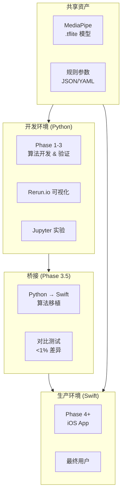
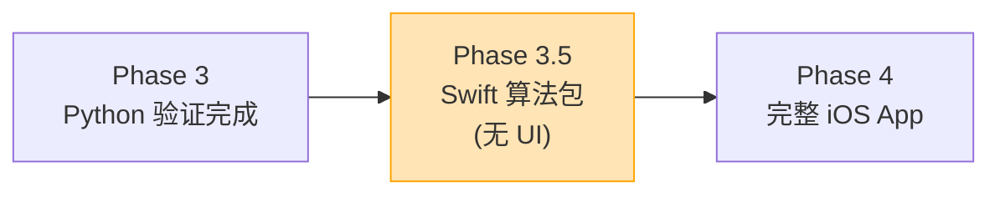

# ADR-0008 桌面到移动架构

**日期:** 2025-12-25
**状态:** 已接受

## 背景

在 [ADR 0007](0007-swift-ios-native.md) 决定使用 Swift 原生 iOS 开发后，产生了一个关键架构问题：

> **Python Desktop (Phase 1-3) 和 Swift Mobile (Phase 4+) 之间是什么关系？是两个独立产品还是同一产品的两个平台？**

2025年行业最佳实践研究表明，这不是"两个产品"的问题，而是**开发环境**与**生产环境**的分离。

### 研究发现

通过对 2025年移动 ML 应用架构的深度研究，发现以下模式：

```text
┌─────────────────────────────────────────────────────────────────────────┐
│                    2025年 ML 应用开发模式                                │
├─────────────────────────────────────────────────────────────────────────┤
│                                                                          │
│   ┌─────────────────────┐         ┌─────────────────────┐               │
│   │  Development Env    │         │  Production Env     │               │
│   │  (Python Desktop)   │         │  (Swift Mobile)     │               │
│   ├─────────────────────┤         ├─────────────────────┤               │
│   │ • Jupyter notebooks │         │ • iOS App           │               │
│   │ • Rerun.io 可视化   │   →     │ • 最终用户          │               │
│   │ • 快速迭代实验     │  移植   │ • 实时反馈          │               │
│   │ • 算法验证         │         │ • 离线使用          │               │
│   └─────────────────────┘         └─────────────────────┘               │
│              │                              │                            │
│              │       ┌──────────────┐       │                            │
│              └──────▶│ .tflite 模型 │◀──────┘                            │
│                      │  (共享资产)  │                                    │
│                      └──────────────┘                                    │
│                                                                          │
│   ✅ 同一套 MediaPipe .tflite 模型在两个环境中运行                       │
│   ✅ Python 用于算法开发和验证，Swift 用于最终产品                       │
│   ✅ 不是两个产品，是开发→生产的工作流                                   │
│                                                                          │
└─────────────────────────────────────────────────────────────────────────┘
```

### 类似产品参考

| 产品 | 开发环境 | 生产环境 | 共享资产 |
|------|----------|----------|----------|
| **Golfshot** | Python 原型 | Swift/Kotlin | ML 模型 |
| **Swing Profile** | MATLAB/Python | iOS 原生 | 算法参数 |
| **Sportsbox AI** | Python/TensorFlow | 移动 SDK | TFLite 模型 |

## 决策

采用 **"Python 开发 → Swift 生产"** 的分层架构，并引入 **Phase 3.5 (算法移植阶段)** 作为桥接。

### 架构概览



### 代码分层

| 层级 | Python (开发) | Swift (生产) | 关系 |
|------|---------------|--------------|------|
| **ML 推理** | MediaPipe Python | MediaPipeTasksVision | 同一 .tflite 模型 |
| **传感器融合** | `sensor_fusion.py` | `SensorFusion.swift` | 需移植 |
| **特征提取** | `feature_extraction.py` | `FeatureExtraction.swift` | 需移植 (用 Accelerate) |
| **规则引擎** | `rule_engine.py` | `RuleEngine.swift` | 需移植 |
| **提示词生成** | `kinematic_prompts.py` | `KinematicPrompts.swift` | 需移植 |
| **LLM 调用** | OpenAI/Claude API | 相同 API | 直接复用 |

## 理由

### 1. 快速迭代 vs 用户体验

```text
Python Desktop 优势:
├── Jupyter notebooks 允许即时实验
├── Rerun.io 提供丰富的 3D 可视化
├── 无需编译，修改立即生效
├── 更容易与研究论文代码对接
└── EMG 信号处理库 (NeuroKit2) 成熟

Swift Mobile 优势:
├── 最终用户直接使用
├── 离线运行，无需网络
├── 低延迟实时反馈
├── 利用 Metal GPU 加速
└── 与 Apple Watch 集成潜力
```

### 2. MediaPipe 跨平台一致性

MediaPipe 的 .tflite 模型格式可在多平台运行：

| 平台 | SDK | 输入 | 输出 |
|------|-----|------|------|
| Python | `mediapipe` | NumPy array | 33 landmarks |
| iOS | `MediaPipeTasksVision` | CMSampleBuffer | 33 landmarks |
| Android | `MediaPipeTasksVision` | Bitmap | 33 landmarks |

**关键洞察**: 姿态检测的 33 个关键点在所有平台上是相同的，确保算法一致性。

### 3. Phase 3.5 的必要性

**问题**: 从 Phase 3 (Python 验证完成) 直接跳到 Phase 4 (完整 iOS App) 跨度太大。

**解决方案**: 引入 Phase 3.5 作为显式的算法移植阶段：



**Phase 3.5 产出**:

- Swift Package (无 UI)
- 单元测试覆盖所有算法
- Python vs Swift 对比测试 (<1% 输出差异)
- 性能基准 (iPhone 15 Pro 目标)

### 4. 混合推理策略

| 组件 | 位置 | 延迟要求 | 理由 |
|------|------|----------|------|
| **姿态检测** | 📱 On-device | <33ms | 隐私、实时、离线 |
| **传感器融合** | 📱 On-device | <10ms | 需要实时同步 |
| **规则引擎** | 📱 On-device | <5ms | 简单计算 |
| **LLM 反馈** | ☁️ Cloud | 200-500ms | 复杂推理，挥杆后可接受 |

## 后果

### 积极影响

- **清晰的开发路径**: Python 实验 → 验证 → Swift 移植 → 产品发布
- **降低风险**: 算法在桌面环境充分验证后再移植
- **代码共享**: ML 模型 100% 共享，算法逻辑 ~80% 可移植
- **专业分工**: Python 团队专注算法，Swift 团队专注 UI/UX

### 消极影响

- **双重实现**: 算法需在 Python 和 Swift 中各实现一次
- **同步成本**: 算法更新需同步到两个平台
- **测试复杂度**: 需要 Python-Swift 一致性测试

### 缓解策略

| 问题 | 缓解措施 |
|------|---------|
| 双重实现 | 使用 JSON/YAML 配置提取可共享参数 |
| 同步成本 | 建立 Phase 3.5 必须通过的一致性测试套件 |
| 测试复杂度 | 自动化对比测试，输出差异 <1% 则通过 |

## 考虑的替代方案

### 1. 单一 Python 后端 + Thin Client

```text
方案: 所有处理在云端 Python 服务器，移动端只显示结果
问题:
├── 延迟: 视频上传→处理→返回 需要 1-3 秒
├── 隐私: 用户视频需上传到服务器
├── 离线: 无法在没有网络时使用
└── 成本: 服务器成本随用户数增长
被拒绝原因: 不满足实时反馈需求
```

### 2. Flutter 跨平台 (一套代码)

```text
方案: 使用 Flutter 同时支持 iOS 和 Android
问题:
├── MediaPipe 延迟: Platform Channel 带来 "notable latency"
└── 已在 ADR-0007 中详细评估并拒绝
被拒绝原因: 见 ADR-0007
```

### 3. 直接从 Swift 开始 (跳过 Python)

```text
方案: 从一开始就用 Swift 开发所有算法
问题:
├── 迭代速度: Swift 编译时间 vs Python 即时执行
├── 可视化: Rerun.io 只支持 Python
├── 库生态: NeuroKit2 (EMG) 没有 Swift 版本
└── 研究对接: 学术论文代码多为 Python
被拒绝原因: 开发效率太低，不适合 MVP 阶段的快速迭代
```

## iOS 开发工具链 (2025)

> 本节面向没有 iOS 开发经验的团队成员，解释各工具的角色分工。

### 工具角色分工

```text
┌─────────────────────────────────────────────────────────────────────┐
│                    iOS 开发工具链                                    │
├─────────────────────────────────────────────────────────────────────┤
│                                                                      │
│  🎨 设计工具 (画出 App 长什么样)                                       │
│  ├── Figma → 画 UI 草图/高保真设计                                    │
│  └── 输出: 图片/设计稿 (不能运行)                                      │
│                                                                      │
│  💻 代码编辑器 (写代码)                                               │
│  ├── VS Code / Cursor → 写 Swift 代码                                │
│  ├── 但是! 它们不能编译/运行 iOS App                                   │
│  └── 只是文本编辑器                                                   │
│                                                                      │
│  🍎 Xcode (Apple 官方 IDE) ← 这是关键!                                │
│  ├── 写代码 ✅                                                        │
│  ├── 实时预览 UI ✅ (SwiftUI Preview)                                 │
│  ├── 编译 App ✅                                                      │
│  ├── 模拟器运行 ✅ (虚拟 iPhone)                                       │
│  ├── 真机部署 ✅ (连接真实 iPhone)                                     │
│  └── 上传 App Store ✅                                                │
│                                                                      │
│  📱 看到 App 在手机上运行的方式:                                        │
│  ├── 方法 1: Xcode → iPhone 模拟器 (电脑上的虚拟手机)                   │
│  ├── 方法 2: Xcode → 真实 iPhone (USB 连接)                           │
│  └── 方法 3: TestFlight → 远程安装测试版                               │
│                                                                      │
└─────────────────────────────────────────────────────────────────────┘
```

### 2025 AI 辅助 UI 开发工作流

推荐使用 Figma + AI 代码生成加速 UI 开发：

```text
┌─────────────────────────────────────────────────────────────────────┐
│                    Figma → SwiftUI 工作流 (2025)                     │
├─────────────────────────────────────────────────────────────────────┤
│                                                                      │
│  Step 1: 在 Figma 设计 UI                                            │
│  ├── 使用 Figma Make (2025.07 GA) 快速生成原型                        │
│  ├── 或手动设计高保真界面                                              │
│  └── 导出: 设计稿 + 组件规格                                          │
│                                                                      │
│  Step 2: AI 生成 SwiftUI 代码                                        │
│  ├── 方式 A: Claude Code / Cursor                                    │
│  │   └── Prompt: "根据这个 Figma 设计生成 SwiftUI 代码"               │
│  ├── 方式 B: Gemini 2.5 Flash                                        │
│  │   └── 上传截图 → 生成代码 (多模态理解)                              │
│  └── 方式 C: Figma 插件 (Visual Copilot 等)                          │
│                                                                      │
│  Step 3: 复制代码到 Xcode                                            │
│  ├── 创建 SwiftUI View 文件                                          │
│  └── 粘贴生成的代码                                                   │
│                                                                      │
│  Step 4: 在 Xcode 预览/运行                                          │
│  ├── SwiftUI Preview 实时查看效果                                     │
│  ├── 模拟器运行完整 App                                               │
│  └── 真机测试 (USB 连接 iPhone)                                       │
│                                                                      │
│  关键: 最终都需要 Xcode 来编译和运行 iOS App                            │
│                                                                      │
└─────────────────────────────────────────────────────────────────────┘
```

### AI 代码生成工具选择

| 工具 | 用途 | 成本 | 推荐场景 |
|------|------|------|----------|
| **Claude Code / Cursor** | Swift 代码生成 + 算法移植 | $20/月 | 日常开发首选 |
| **Gemini 2.5 Flash** | 图片→代码，多模态理解 | $0.075/M tokens | 从截图生成 UI |
| **Kimi K2** | Python→Swift 初始转换 | $0.60/M tokens | 批量移植省钱 |
| **Figma 插件** | 设计稿→代码 | 免费/付费 | 设计师主导流程 |

> **重要**: AI 生成的 UI 代码是"基础代码"，需要手工调整响应式布局、状态管理和性能优化。核心算法代码（如 `SensorFusion.swift`）必须使用工程模式严格移植，不能依赖 AI "凭感觉" 生成。

## 实施指南

### 目录结构

```text
movement-chain-ml/           # Python 开发环境
├── src/
│   ├── algorithms/          # 核心算法 (需移植到 Swift)
│   │   ├── sensor_fusion.py
│   │   ├── feature_extraction.py
│   │   ├── rule_engine.py
│   │   └── kinematic_prompts.py
│   ├── visualization/       # Rerun.io 可视化 (仅 Python)
│   └── experiments/         # Jupyter notebooks (仅 Python)
├── models/
│   └── mediapipe/          # .tflite 模型 (共享)
└── tests/
    └── baseline/           # 基准输出 (用于 Swift 对比)

movement-chain-mobile-ios/   # Swift 生产环境
├── Sources/
│   ├── Algorithms/         # 从 Python 移植
│   │   ├── SensorFusion.swift
│   │   ├── FeatureExtraction.swift
│   │   ├── RuleEngine.swift
│   │   └── KinematicPrompts.swift
│   ├── Features/           # iOS 特有功能
│   └── Core/
├── Resources/
│   └── models/             # .tflite 模型 (从 ml repo 复制)
└── Tests/
    └── ConsistencyTests/   # Python vs Swift 一致性测试
```

### Phase 3.5 验收标准

| 检查项 | 标准 | 验证方法 |
|--------|------|---------|
| **输出一致性** | Python vs Swift <1% 差异 | 100 个测试用例对比 |
| **性能** | iPhone 15 Pro 帧率 ≥30 FPS | Xcode Instruments |
| **单元测试** | 算法覆盖率 >80% | XCTest |
| **无 UI 依赖** | Swift Package 独立编译 | `swift build` |

### 一致性测试示例

```swift
// Tests/ConsistencyTests/SensorFusionTests.swift
import XCTest
@testable import MovementChainAlgorithms

final class SensorFusionConsistencyTests: XCTestCase {

    func testFusionOutputMatchesPython() throws {
        // 加载 Python 生成的基准数据
        let baseline = try loadBaseline("sensor_fusion_baseline.json")

        // 运行 Swift 实现
        let fusion = SensorFusion()
        let result = fusion.process(
            imu: baseline.imuInput,
            emg: baseline.emgInput,
            pose: baseline.poseInput
        )

        // 对比输出
        for (i, metric) in result.metrics.enumerated() {
            let pythonValue = baseline.expectedOutput[i]
            let diff = abs(metric - pythonValue) / pythonValue
            XCTAssertLessThan(diff, 0.01, "Metric \(i) differs by \(diff * 100)%")
        }
    }
}
```

## 与其他 ADR 的关系

| ADR | 关系 |
|-----|------|
| [ADR-0007](0007-swift-ios-native.md) | 本 ADR 解释 Python 和 Swift 如何共存，ADR-0007 解释为什么选 Swift |
| [ADR-0001](0001-multi-repo-structure.md) | 多仓库结构支持 `movement-chain-ml` 和 `movement-chain-mobile-ios` 独立开发 |
| [ADR-0002](0002-lsm6dsv16x-imu.md) | IMU 数据流在两个环境中格式相同 |

## 参考资料

- **2025 Mobile ML Best Practices**: 基于 Web 研究，行业趋势是 Python 开发 + 移动生产
- **MediaPipe 跨平台**: [developers.google.com/mediapipe](https://developers.google.com/mediapipe)
- **Rerun.io**: [rerun.io](https://rerun.io) - Python 优先的多模态可视化

## 审查计划

- **Phase 3 完成时**: 审查算法移植清单是否完整
- **Phase 3.5 完成时**: 验证一致性测试全部通过
- **Phase 4 发布前**: 确认生产性能满足要求

---

## 版本历史

| 版本 | 日期 | 修改内容 |
|------|------|----------|
| 1.0 | 2025-12-25 | 初始版本 |
| 1.1 | 2025-12-26 | 新增 "iOS 开发工具链 (2025)" 章节：工具角色分工、AI 辅助 UI 开发工作流、代码生成工具选择 |

---

**最后更新**: 2025-12-26
