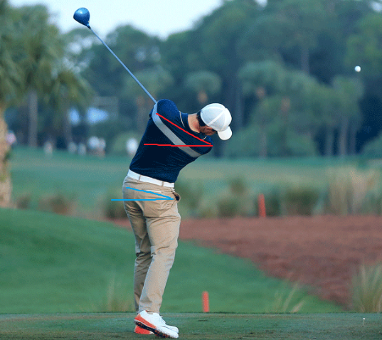
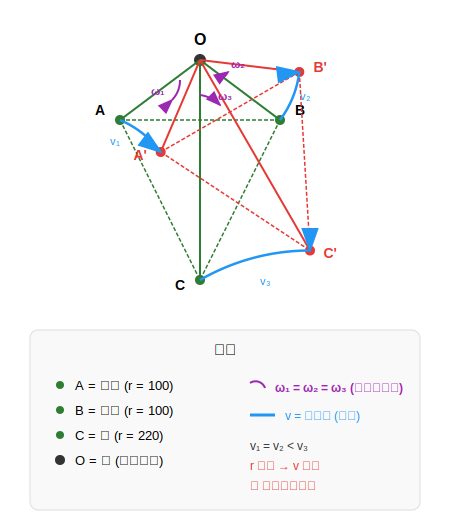

# 高尔夫生物力学入门 Golf Biomechanics 101

---

## 为什么学习这些？

想象两个高尔夫球手：

- **球手 A**: 身高 185cm，体重 90kg，健身房常客
- **球手 B**: 身高 170cm，体重 65kg，普通上班族

谁能把球打得更远？

答案可能出乎你意料：**不一定是更强壮的那个**。

高尔夫挥杆的力量不来自蛮力，而来自**身体各部位协调运动产生的能量传递**。职业球手能够将地面反作用力，通过骨盆、躯干、手臂、球杆，层层放大，最终在击球瞬间达到 180+ km/h 的杆头速度。

这份指南将带你理解这个过程的每一个环节。

---

## 第一章：身体机器

---

## 1.1 三大核心部位

高尔夫挥杆可以简化为**三个关键身体部位**的协调运动：

```text
┌─────────────────────────────────────────────────────────────────────────────┐
│                         身体分段示意图                                        │
├─────────────────────────────────────────────────────────────────────────────┤
│                                                                              │
│                        ┌─────────┐                                           │
│                        │  HEAD   │  头部（保持稳定）                          │
│                        └────┬────┘                                           │
│                             │                                                │
│                    ┌────────┴────────┐                                       │
│                    │     THORAX      │  胸腔/上躯干                           │
│                    │   (Shoulders)   │  ← 主要旋转单元                        │
│                    └────────┬────────┘                                       │
│                             │                                                │
│                    ┌────────┴────────┐                                       │
│                    │      CORE       │  核心肌群                              │
│                    │   (Obliques)    │  ← 连接上下身                          │
│                    └────────┬────────┘                                       │
│                             │                                                │
│                    ┌────────┴────────┐                                       │
│                    │     PELVIS      │  骨盆                                  │
│                    │     (Hips)      │  ← 力量发动机                          │
│                    └────────┬────────┘                                       │
│                             │                                                │
│                    ┌────────┴────────┐                                       │
│                    │      LEGS       │  双腿                                  │
│                    │    (Ground)     │  ← 地面反作用力来源                     │
│                    └─────────────────┘                                       │
│                                                                              │
└─────────────────────────────────────────────────────────────────────────────┘
```

### 骨盆 Pelvis

**定义**: 髋骨结构，连接躯干与下肢

**中文解释**: 就是你的"胯"，包括左右两侧的髋关节。站立时，骨盆是整个上半身的"底座"。

**在挥杆中的作用**:

- 下杆的**第一启动者**（First Mover）
- 力量从地面向上传递的**中转站**
- 职业球手骨盆旋转速度可达 **477°/s**

### 胸腔 Thorax

**定义**: 从肩部到中背的上躯干区域

**中文解释**: 简单说就是"上半身"，包括胸部、肩膀、上背。当我们说"转肩"时，其实是整个胸腔在旋转。

**在挥杆中的作用**:

- 挥杆的**主要旋转单元**
- 上杆时向后旋转储存能量
- 下杆时释放能量，速度可达 **552°/s**

### 核心肌群 Core

**定义**: 腹部和下背的肌肉群，包括腹斜肌、腹直肌、竖脊肌

**中文解释**: 连接上下身的"桥梁"。核心不只是"腹肌"，还包括侧腹和下背的深层稳定肌。

**在挥杆中的作用**:

- **连接**骨盆和胸腔的旋转
- **传递**下肢产生的力量到上肢
- **稳定**脊柱，防止受伤

---

## 1.2 动力链 The Kinetic Chain

这是本文档最重要的概念之一。

**动力链 (Kinetic Chain)** 是指身体各部位**按顺序连接**，将能量从近端（身体中心）传递到远端（四肢末端）的系统。

```text
┌─────────────────────────────────────────────────────────────────────────────┐
│                         动力链能量传递                                        │
├─────────────────────────────────────────────────────────────────────────────┤
│                                                                              │
│   地面 → 双腿 → 骨盆 → 躯干 → 手臂 → 球杆 → 球                                │
│                                                                              │
│   Ground → Legs → Pelvis → Thorax → Arms → Club → Ball                      │
│                                                                              │
│   ════════════════════════════════════════════════════════════════          │
│   能量方向：从中心向外，从下向上                                               │
│   速度变化：每个环节速度递增约 1.5 倍                                          │
│   ════════════════════════════════════════════════════════════════          │
│                                                                              │
│   示例速度递增：                                                              │
│   骨盆 477°/s → 躯干 552°/s → 手臂 1200°/s → 球杆 2500°/s                    │
│                                                                              │
└─────────────────────────────────────────────────────────────────────────────┘
```

**为什么动力链如此重要？**

想象你在甩一条鞭子：

1. 你的手臂先动（近端）
2. 鞭身跟着动
3. 鞭梢最后动，但速度最快（远端）

高尔夫挥杆的原理完全相同。如果你用手臂直接甩球杆（跳过身体旋转），就像只用手腕甩鞭子——永远达不到最大速度。

**正确的动力链** = 每个环节按顺序启动，前一个环节减速时，能量传递给下一个环节

**错误的动力链** = 手臂先于身体启动，或多个部位同时启动

---

## 1.3 挥杆的八个阶段 The Eight Swing Phases

一个完整的高尔夫挥杆可以分为八个阶段：

<figure markdown="span">
  { width="100%" }
  <figcaption>P Classification System: 10 个关键位置定义完整挥杆 (图片来源: <a href="https://hackmotion.com/golf-swing-positions/">HackMotion</a>)</figcaption>
</figure>

!!! info "P1-P10 与八阶段的关系"
    高尔夫教学中常用两套分类体系：

    - **P Classification System (P1-P10)**: **位置导向**，定义 10 个关键几何检查点
    - **八阶段系统**: **时间导向**，描述 8 个连续运动阶段

    两套系统本质上描述同一个挥杆动作，只是视角不同。P 系统有 10 个位置而八阶段只有 8 个的原因是：

    - **P3** (上杆中点) 是 Phase 3 上杆阶段内的一个检查点
    - **P6** (下杆中点) 是 Phase 6 下杆阶段内的一个检查点
    - **P8、P9、P10** 都在 Phase 8 收杆阶段内，细分了收杆动作

```text
┌──────────────────────────────────────────────────────────────────────────────────────────────┐
│                              挥杆八阶段时间线                                                  │
├──────────────────────────────────────────────────────────────────────────────────────────────┤
│                                                                                               │
│   时间轴 (职业球手 Driver)                                                                     │
│   ├──────────────────────────────────────────────────────────────────────────────────────┤   │
│   0s       0.1s              0.75s    0.80s   0.85s           1.0s                  1.3s     │
│   │         │                  │        │       │               │                     │      │
│   ▼         ▼                  ▼        ▼       ▼               ▼                     ▼      │
│                                                                                               │
│   ┌────┐ ┌─────┐ ┌───────────────┐ ┌────┐ ┌─────┐ ┌─────────┐ ┌──────┐ ┌───────────────┐    │
│   │ 1  │→│  2  │→│      3        │→│ 4  │→│  5  │→│    6    │→│  7   │→│      8        │    │
│   │准备│ │起杆 │ │    上  杆     │ │顶点│ │转换 │ │  下 杆  │ │ 击球 │ │    收  杆     │    │
│   └────┘ └─────┘ └───────────────┘ └────┘ └─────┘ └─────────┘ └──────┘ └───────────────┘    │
│                                                                                               │
│   静态   0.10-   0.60-0.70s       瞬间   0.05-   0.23-0.28s    ~5ms     0.30-0.50s           │
│          0.15s                          0.10s                                                 │
│                                                                                               │
│   ◀─────────── 上杆 0.70-0.80s ───────────▶◀─────── 下杆 0.23-0.28s ──────▶                  │
│                                                                                               │
│                              ⚠️ 转换期是最关键的阶段                                           │
│                                                                                               │
└──────────────────────────────────────────────────────────────────────────────────────────────┘
```

### 各阶段详解（P 系统 + 八阶段合并）

| 阶段 | P 位置 | 英文 | 时长 | 位置定义 | 关键动作 |
|:----:|:------:|------|:----:|----------|----------|
| **1** | **P1** | Address | 静态 | 准备站姿 | 握杆、站位、身体姿势 |
| **2** | **P2** | Takeaway | 0.10-0.15s | 杆身平行地面 | 球杆离开球位，三角形保持完整 |
| **3** | P3 | Backswing | 0.60-0.70s | 引导臂平行地面 | 上杆中点，开始上腕 (wrist hinge) |
| **4** | **P4** | Top | 瞬间 | 上杆顶点 | 充分转肩，理想腕位，杆身平行 |
| **5** | P5 | Transition | 0.05-0.10s | 引导臂下杆平行 | ⚠️ **最关键**：下盘先动，手腕开始回正 |
| **6** | P6 | Downswing | 0.23-0.28s | 杆身下杆平行 | 延迟释放 (lag)，躯干旋转加速 |
| **7** | **P7** | Impact | ~5ms | 触球瞬间 | 杆面方正，重心前移，手在球前 |
| **8** | P8 | Follow-through | 0.30-0.50s | 杆身送杆平行 | 手臂完全伸展，后手腕翻转 |
| 8 | P9 | Follow-through | ↑ | 引导臂送杆平行 | 收杆中点，保持平衡 |
| 8 | **P10** | Finish | ↑ | 收杆完成 | 完全转体，重心前移，杆在肩上 |

!!! tip "阅读指南"
    - **粗体 P 位置** (P1, P2, P4, P7, P10) = 与八阶段一一对应的关键位置
    - 普通 P 位置 (P3, P5, P6, P8, P9) = 阶段内的检查点
    - P8、P9、P10 都属于 Phase 8 收杆阶段，时长共享 0.30-0.50s

## 1.4 节奏比 Tempo Ratio {#节奏比-tempo-ratio}

职业球手的**[节奏比](../../reference/golf-glossary.md#2-节奏比-tempo-ratio)**通常为 3:1：

$$
\text{节奏比} = \frac{\text{上杆时间}}{\text{下杆时间}} = \frac{0.75\,\text{s}}{0.25\,\text{s}} = 3{:}1
$$

这意味着上杆用时是下杆的 3 倍。这个比例出奇地一致，无论是 Tiger Woods 还是 Rory McIlroy。

!!! tip "关键认知"
    节奏比是**诊断工具**，不是训练目标。每个人有自己的自然节奏，关键是保持一致。详见 [高尔夫术语表 - 节奏比](../../reference/golf-glossary.md#2-节奏比-tempo-ratio)。

---

## 1.5 引导侧与后侧 Lead Side & Trail Side {#14-引导侧与后侧-lead-side--trail-side}

高尔夫中不说"左右"，而是说"引导侧"和"后侧"：

| 术语 | 右手球员 | 左手球员 | 作用 |
|------|----------|----------|------|
| **引导侧 Lead Side** | 左侧 | 右侧 | 面向目标，承受击球冲击 |
| **后侧 Trail Side** | 右侧 | 左侧 | 背向目标，提供旋转动力 |

这种命名方式避免了左右手球员的混淆。

!!! tip "对传感器项目的意义"
    1. **IMU 命名规范**：传感器位置应使用 lead/trail 而非 left/right
    2. **算法复用**：动作分析只需一套逻辑，通过配置切换左右手模式
    3. **数据通用性**：标注和指标报告对两种球员通用，无需维护两套术语

    详见 [高尔夫术语表 - 引导侧与后侧](../../reference/golf-glossary.md#3-引导侧与后侧-lead-trail-side)。

---

## 第二章：旋转的故事

---

## 2.1 两种关键旋转

高尔夫挥杆的力量主要来自**两种旋转**：

### Shoulder Turn (Torso Turn) 肩部旋转角度 

**定义**: 胸腔绕垂直轴的旋转角度

**解释**: 就是"转肩"。想象你的肩膀连线是一个指南针，上杆时这个指南针转了多少度。

**职业标准**:

- 上杆顶点：**90-110°**（相对于准备站姿）
- 业余球手通常只有 70-85°

### Hip Turn (Pelvis Turn) 髋部旋转角度 

**定义**: 骨盆绕垂直轴的旋转角度

**解释**: 就是"转胯"。髋部旋转幅度通常比肩部小，因为下半身要保持稳定。

**职业标准**:

- 上杆顶点：**45-55°**
- 业余球手通常有 30-40°

---

## 2.2 X-Factor 肩髋分离角

这是高尔夫生物力学中**最重要的概念之一**。

### 什么是 X-Factor？

**X-Factor** = 肩部旋转角度 − 髋部旋转角度

<figure markdown="span">
  { width="300" }
  <figcaption>俯视图显示肩髋角度差形成 X 形 </figcaption>
</figure>

### 为什么 X-Factor 重要？

X-Factor 代表了你在上杆顶点时**躯干被"拧紧"的程度**。

想象一条拧紧的毛巾：

- 上半身向后转（肩膀）
- 下半身相对固定（髋部）
- 中间的核心肌群被**拉伸储能**

当你释放时（下杆），这些被拉伸的肌肉会**弹性回缩**，产生巨大的旋转力量。

### X-Factor 基准值

| 水平 | X-Factor | 解读 |
|------|----------|------|
| 初学者 | <25° | 身体旋转不足，主要靠手臂 |
| 业余 | 25-35° | 有一定分离，但还有提升空间 |
| 进阶 | 35-45° | 良好的肩髋分离 |
| **职业** | **42-55°** | 最佳范围，力量与控制平衡 |
| 过度 | >60° | 可能导致下背受伤 |

**研究发现**: X-Factor 与杆头速度的相关系数 r = 0.90（极强相关）

---

## 2.3 X-Factor Stretch {#23-x-factor-stretch职业球手的秘密武器}

这是区分职业与业余球手的**关键指标之一**。详见 [高尔夫术语表 - X-Factor Stretch](../../reference/golf-glossary.md#5-x-factor-stretch)。

### 什么是 X-Factor Stretch？

在转换期（Transition）：

1. 骨盆已经开始向目标方向旋转（下杆启动）
2. 但肩膀还在完成上杆（继续向后转或保持不动）
3. 这导致 X-Factor **进一步增加**

**简单理解**：骨盆先动，肩膀后动——这个时间差造成了额外的"拧紧"。

```text
┌─────────────────────────────────────────────────────────────────────────────┐
│                    X-Factor Stretch 时间线                                   │
├─────────────────────────────────────────────────────────────────────────────┤
│                                                                             │
│   X-Factor                                                                  │
│      ↑                                                                      │
│   55°│                    ●←── X-Factor Stretch 峰值                         │
│      │                   / \                                                │
│   45°│            ●─────●   \                                               │
│      │           / Top       \                                              │
│      │          /             \                                             │
│   35°│         /               \                                            │
│      │        /                 \                                           │
│      │       /                   \                                          │
│    0°│──────●─────────────────────●                                         │
│      └──────┼─────────┼───────────┼────────→ 时间                            │
│           Address    Top    Transition   Impact                             │
│                                                                             │
│                                                                             │
└─────────────────────────────────────────────────────────────────────────────┘
```

**X-Factor Stretch** = 转换期 X-Factor 的**增量**

!!! info "X-Factor vs X-Factor Stretch"
    | 概念 | 定义 | 类型 |
    |------|------|------|
    | **X-Factor** | 肩膀旋转角度 − 髋部旋转角度 | 瞬时值（某一时刻的角度差） |
    | **X-Factor Stretch** | 转换期 X-Factor − 顶点 X-Factor | 变化量（两个时刻的差值） |

    **数字例子：**
    ```text
    时刻              肩膀旋转   髋部旋转   X-Factor
    ──────────────────────────────────────────────────
    上杆顶点 (Top)     90°        45°        45°  ← X-Factor at Top
    转换期峰值         92°        37°        55°  ← X-Factor 峰值
    ```
    - **X-Factor (at Top)** = 上杆顶点时的 `肩膀旋转 − 髋部旋转` = 45°

    - **X-Factor Stretch** = 转换期峰值 − 顶点值 = `55° − 45° = 10°`

| X-Factor 旋转角度 | X-Factor Stretch |
|:--:|:--:|
| { width="300" } | { width="300" } |


### X-Factor Stretch 基准值

| 水平 | X-Factor Stretch | 解读 |
|------|------------------|------|
| 初学者 | <3° 或无 | 没有"蓄力"动作 |
| 业余 | 3-6° | 有一些伸展，但不明显 |
| 进阶 | 6-10° | 良好的转换期动作 |
| **职业** | **8-15°** | 明显的肩髋分离增量 |

---

## 2.4 S-Factor 和 O-Factor 倾斜角度

除了水平旋转，还有**倾斜角度**需要关注：

### S-Factor (肩部倾斜角度)

**定义**: 肩部连线相对于水平面的倾斜角度（侧弯）

**解释**: 上杆时，后侧肩膀会比引导侧肩膀低；下杆到击球时，情况相反。

!!! tip "可视化参考"
    📊 [GEARS: Body Metrics](https://www.gearssports.com/articles/gears-golf-body-metrics/) 解释了 Side Bend (侧弯) 的 3D 定义，与 S-Factor 概念相同。

### O-Factor (骨盆倾斜角度)

**定义**: 骨盆相对于水平面的倾斜角度

**解释**: 骨盆倾斜应该保持相对稳定（5-10°），过大的变化会影响稳定性。

### 倾斜角度基准值

| 指标 | 上杆顶点 | 击球瞬间 | 注意事项 |
|------|----------|----------|----------|
| S-Factor | 30-40° 右倾 | 25-35° 左倾 | 倾斜方向在击球前反转 |
| O-Factor | 5-10° | 5-10° | 应保持稳定 |

<div class="grid cards" markdown>

-   

    **上杆顶点**

-   

    **击球瞬间**

-   

    **收杆中段**

-   

    **收杆完成**

</div>

> 红色线 = S-Factor（肩部倾斜），蓝色线 = O-Factor（骨盆倾斜）。注意蓝色线（O-Factor）在整个挥杆过程中保持相对稳定。

---

## 2.5 旋转指标总结

```text
┌─────────────────────────────────────────────────────────────────────────────┐
│                         旋转指标速查表                                        │
├─────────────────────────────────────────────────────────────────────────────┤
│                                                                             │
│   指标                   公式                      职业标准                    │
│   ───────────────────────────────────────────────────────────────────────── │
│   肩部旋转角度         胸腔绕垂直轴角度              90-110°                     │
│   髋部旋转角度         骨盆绕垂直轴角度              45-55°                      │
│   X-Factor           肩部旋转 - 髋部旋转           42-55°                      │
│   X-Factor Stretch   转换期XF - 顶点XF            8-15°                       │
│   S-Factor           肩部侧倾角度                 30-40° → 25-35°             │
│   O-Factor           骨盆侧倾角度                 5-10° (稳定)                 │
│                                                                             │
└─────────────────────────────────────────────────────────────────────────────┘
```

---

## 第三章：时机的秘密

---

## 3.1 为什么时机比力量更重要？

一个惊人的事实：

> **职业球手与业余球手的肌肉力量差距约 15-20%**
> **但杆头速度差距可达 30-40%**

这个差距从何而来？**时机 (Timing)**。

正确的时机可以让能量**层层放大**；错误的时机会导致能量**提前泄漏**。

---

## 3.2 运动链顺序 Kinematic Sequence

这是本章的核心概念。

**运动链顺序 (Kinematic Sequence)** 描述了下杆时各身体部位**加速和减速的顺序**：

```text
┌─────────────────────────────────────────────────────────────────┐
│                  Kinematic Sequence 时间线                       │
├─────────────────────────────────────────────────────────────────┤
│                                                                 │
│  角速度峰值    ①       ②       ③       ④                       │
│  到达顺序:    骨盆  →  躯干   →  手臂   → 球杆                      │
│              ↓        ↓        ↓        ↓                       │
│  时间轴:   ───●────────●────────●────────●───→ Impact            │
│           先减速    承接能量  承接能量  最后爆发                     │
│                                                                 │
│  能量传递: 骨盆减速 → 躯干获得能量 → 加速                            │
│           躯干减速 → 手臂获得能量 → 加速                            │
│           手臂减速 → 球杆获得能量 → 加速（峰值最高）                  │
│                                                                 │
└─────────────────────────────────────────────────────────────────┘
```

!!! tip "可视化参考"
    📊 [GEARS: Kinematic Sequence](https://www.gearssports.com/articles/sports-kinetic-kinematic-sequence/) 展示了真实的 4 条曲线图。

### 近端到远端原则 Proximal-to-Distal

这是生物力学的基本原理：**能量从身体中心（近端）流向四肢末端（远端）**。

- **近端 Proximal**: 靠近身体中心（骨盆、躯干）
- **远端 Distal**: 远离身体中心（手臂、球杆）

正确顺序：骨盆 → 躯干 → 手臂 → 球杆

---

## 3.3 转换期：魔法发生的时刻

**转换期 (Transition)** 是下杆开始的**前 50-100 毫秒**，也是整个挥杆中**最关键的时刻**。

### 转换期发生了什么？

```text
┌─────────────────────────────────────────────────────────────────┐
│                   转换期 Transition (50-100ms)                   │
├─────────────────────────────────────────────────────────────────┤
│                                                                 │
│  这是整个挥杆最关键的瞬间，发生了"反直觉"的事：                        │
│                                                                 │
│       骨盆        │        肩膀                                  │
│    ─────────────────────────────────                            │
│    已经开始        │     还在向后转                                │
      向目标转 →     │     ← 或保持不动                              │
│                                                                 │
│          ↑ 这个"反向运动"产生了 X-Factor Stretch                   │
│                                                                 │
│  时序：骨盆先动 (0ms) → 躯干跟上 (~40ms) → 手臂跟上 (~80ms)          │
│                                                                 │
└─────────────────────────────────────────────────────────────────┘
```

### 转换期的重要性

在这短短 50-100ms 内：

1. **骨盆领先**：下半身开始向目标转动
2. **肩膀滞后**：上半身还在完成上杆或保持不动
3. **X-Factor 增加**：肩髋分离进一步拉大
4. **能量储存**：核心肌群被最大程度拉伸

职业球手能够在转换期**让骨盆领先肩膀 30-50ms**；业余球手通常做不到这一点。

---

## 3.4 峰值时机(Peak Timing)和峰值间隔(Time Between Peaks, TBP) 

每个身体部位都有一个**角速度峰值**，这些峰值的**时机**必须按顺序排列。

### 各部位峰值时机 (以转换期开始为 0ms)

| 身体部位 | 达峰时间 | 峰值速度 | 与前一环节间隔 
|----------|----------|----------|----------------|
| **骨盆 Pelvis** | 50-70ms | 477°/s (职业) | - (第一个) |
| **躯干 Thorax** | 70-90ms | 552°/s (职业) | 20-30ms |
| **手臂 Arms** | 100-120ms | 1200°/s | 20-30ms |
| **球杆 Club** | 130-150ms | 2500°/s | 20-30ms |

### 峰值间隔

**TBP** 是相邻两个部位达到峰值的时间差。

**最佳范围**: 20-50ms

- **<10ms**: 间隔太小，能量传递不充分（"同步"错误）
- **>60ms**: 间隔太大，能量泄漏（"延迟"错误）

---

## 3.5 肌肉激活与运动链

**关键理解**：肌肉激活是**因**，峰值角速度是**果**。

### 肌肉激活顺序 vs 峰值角速度顺序

| 顺序 | 肌肉激活（EMG 测量） | 对应峰值（IMU 测量） | 时间差 |
|------|---------------------|---------------------|--------|
| 1️⃣ | 核心肌群激活 | 骨盆峰值角速度 | 激活先于峰值 ~30-50ms |
| 2️⃣ | 腹斜肌激活 | 躯干峰值角速度 | 激活先于峰值 ~30-50ms |
| 3️⃣ | 前臂肌群激活 | 手臂峰值角速度 | 激活先于峰值 ~20-30ms |

**正确模式**：

```text
肌肉激活顺序:  核心 → 腹斜肌 → 前臂
峰值角速度顺序: 骨盆 →  躯干  → 手臂 → 球杆
```

### 肌肉激活间隔 vs 峰值间隔 (TBP)

| 指标 | 定义 | 最佳范围 |
|------|------|----------|
| **肌肉激活间隔** | 相邻肌群开始激活的时间差 | 30-60ms |
| **峰值间隔 (TBP)** | 相邻部位达到峰值的时间差 | 20-50ms |

**关系**：肌肉激活间隔略大于峰值间隔，因为激活到达峰需要时间。

---

## 3.6 常见时机错误与 EMG 诊断

!!! tip "IMU + EMG 联合诊断"
    IMU 发现"什么问题"，EMG 解释"为什么出问题"

### 错误 1：顺序颠倒 Sequence Reversal

**问题**: 手臂在骨盆之前达到峰值速度

| 检测方式 | 表现 |
|----------|------|
| **IMU** | 手臂 → 躯干 → 骨盆 (完全颠倒) |
| **EMG** | 前臂先激活 → 核心后激活 |

```text
后果：
- 失去 20-30% 杆头速度
- "手臂挥杆" 的典型特征
- 常见于 30% 的业余球手

诊断：典型的"手臂挥杆"
建议：训练核心启动意识，先激活核心再动手臂
```

### 错误 2：同步达峰 Simultaneous Peaks

**问题**: 两个或多个部位同时达到峰值

| 检测方式 | 表现 |
|----------|------|
| **IMU** | 骨盆 ≈ 躯干同时达峰 (TBP < 10ms) |
| **EMG** | 核心和腹斜肌几乎同时激活 |

```text
后果：
- 失去 10-20% 杆头速度
- 能量无法有效传递
- 常见于 25% 的业余球手

诊断：能量传递不充分，各环节"一起动"
建议：训练延迟启动节奏，感受"先髋后肩"
```

### 错误 3：延迟传递 Delayed Transfer

**问题**: 各部位达峰间隔过大 (>60ms)

| 检测方式 | 表现 |
|----------|------|
| **IMU** | 骨盆达峰后 80ms 躯干才达峰 (TBP > 60ms) |
| **EMG** | 核心激活后 100ms 腹斜肌才激活 |

```text
后果：
- 失去 5-15% 杆头速度
- 能量在传递过程中泄漏
- 常见于 20% 的业余球手

诊断：动作不连贯，衔接断裂
建议：训练快速衔接，缩短启动间隔
```

### 错误 4：双峰 Double Peak

**问题**: 某个部位的速度曲线出现两个峰值

| 检测方式 | 表现 |
|----------|------|
| **IMU** | 骨盆速度先升后降，再升再降 |
| **EMG** | 肌肉激活出现两次峰值 |

```text
后果：
- 表示能量泄漏后重新加速
- 说明动作不连贯
- 通常伴随其他时机问题

诊断：动力链断裂后尝试补救
建议：整体动作重建，强调一次性发力
```

### EMG 诊断决策树

```text
┌─────────────────────────────────────────────────────────┐
│                    诊断决策树                            │
├─────────────────────────────────────────────────────────┤
│                                                          │
│  IMU 检测到峰值顺序错误？                                 │
│       ↓                                                  │
│      是 → EMG 检查激活顺序 → 找到根本原因                 │
│                                                          │
│  IMU 检测到 TBP 异常？                                   │
│       ↓                                                  │
│      是 → EMG 检查激活间隔 → 确定是启动问题还是衔接问题   │
│                                                          │
│  EMG 的价值：从"发现问题"到"解释问题"                    │
└─────────────────────────────────────────────────────────┘
```

---

## 3.7 职业 vs 业余：时机对比

```text
┌─────────────────────────────────────────────────────────────────┐
│                  职业 vs 业余 运动链对比                          │
├─────────────────────────────────────────────────────────────────┤
│                                                                  │
│  【职业球手】75% 呈现正确模式                                      │
│                                                                  │
│  达峰顺序:  ① 骨盆 → ② 躯干 → ③ 手臂 → ④ 球杆                    │
│  时间间隔:     ~40ms     ~40ms     ~20ms                         │
│  特点: 清晰的"阶梯式"传递，每段减速时下一段加速                     │
│                                                                  │
│  ════════════════════════════════════════════════════════════   │
│                                                                  │
│  【业余球手】常见错误模式                                          │
│                                                                  │
│  错误 A: ① 骨盆 → ②③ 躯干+手臂同时 → ④ 球杆                       │
│          （躯干和手臂"一起动"，能量传递断裂）                       │
│                                                                  │
│  错误 B: ②① 躯干先于骨盆 → ③ 手臂 → ④ 球杆                        │
│          （"上身主导"，俗称 over the top）                         │
│                                                                  │
│  错误 C: ①②③④ 几乎同时达峰                                        │
│          （没有顺序，"用手打球"）                                  │
│                                                                  │
└─────────────────────────────────────────────────────────────────┘
```

| 对比维度 | 职业球手 | 业余球手 |
|----------|----------|----------|
| 顺序正确率 | 89% | ~50% |
| 骨盆峰值速度 | 477°/s | 395°/s |
| 峰值间隔 TBP | 20-40ms | <10ms 或 >60ms |
| 杆头速度 | 110-125 mph | 85-95 mph |

---

## 第四章：速度传递 Speed Transfer

---

## 4.1 什么是角速度？

**角速度 (Angular Velocity)** = 旋转的快慢，单位是 **度/秒 (°/s)**

### 公式

$$
\omega = \frac{\Delta\theta}{\Delta t}
$$

- **ω** (omega)：角速度
- **Δθ**：转过的角度
- **Δt**：所用时间

简单类比：

- 线速度告诉你"走多快"（米/秒）
- 角速度告诉你"转多快"（度/秒）

一个每秒转 360° 的物体 = 每秒转一圈

### 角速度与线速度的关系



上图展示了身体绕 O 点（头/脊柱）旋转时，各部位的运动关系：

- **A（右肩）、B（左肩）、C（手）** 都绕 O 点旋转
- 旋转角度 **θ = 30°**（所有点相同）
- **蓝色弧线** = 各点移动的距离（弧长）

**关键公式**：

$$
v = \omega \times r
$$

- **v**：线速度（m/s）
- **ω**：角速度（相同）
- **r**：到旋转中心的距离

**核心结论**：

| 部位 | 到 O 的距离 (r) | 角速度 (ω) | 线速度 (v) |
|------|----------------|------------|------------|
| 肩膀 (A, B) | 小 | 相同 | 小 |
| 手 (C) | 大 | 相同 | 大 |
| 杆头 | 最大 | 相同 | **最大** |

> **这就是为什么杆头速度最快**：虽然身体各部位的角速度相同，但杆头距离旋转中心最远（r 最大），所以线速度最大。

---

## 4.2 速度递增规律

高尔夫挥杆的一个神奇特性：**每个环节的峰值角速度都比前一个环节快**。

```text
┌─────────────────────────────────────────────────────────────────────────────┐
│                         速度递增级联                                          │
├─────────────────────────────────────────────────────────────────────────────┤
│                                                                              │
│   角速度 (°/s)                                                                 │
│                                                                              │
│   2500 │                                              ████  球杆             │
│        │                                              ████                   │
│   2000 │                                              ████                   │
│        │                                              ████                   │
│   1500 │                                              ████                   │
│        │                                      ████    ████                   │
│   1200 │                                      ████    ████  手臂             │
│        │                                      ████    ████                   │
│    800 │                              ████    ████    ████                   │
│        │                              ████    ████    ████                   │
│    552 │                      ████    ████    ████    ████  躯干             │
│    477 │              ████    ████    ████    ████    ████  骨盆             │
│        │              ████    ████    ████    ████    ████                   │
│      0 │──────────────────────────────────────────────────────              │
│                骨盆    躯干    手臂    球杆                                    │
│                                                                              │
│   递增倍数：1.0x → 1.15x → 2.2x → 2.1x                                       │
│   累计倍数：1.0x → 1.15x → 2.5x → 5.2x                                       │
│                                                                              │
└─────────────────────────────────────────────────────────────────────────────┘
```

### 1.5x 递增规则

一个简化的经验法则：**每个环节速度约为前一个环节的 1.5 倍**

实际数据：

| 环节 | 职业峰值 | 与骨盆比值 | 与前一环节比值 |
|------|----------|------------|----------------|
| 骨盆 | 477°/s | 1.00x | - |
| 躯干 | 552°/s | 1.16x | 1.16x |
| 手臂 | 1200°/s | 2.52x | 2.17x |
| 球杆 | 2500°/s | 5.24x | 2.08x |

从骨盆到球杆，速度放大了 **5 倍以上**！

---

## 4.2 各部位速度基准

### 骨盆旋转速度

| 水平 | 峰值角速度 | 杆头速度相关性 |
|------|------------|----------------|
| 初学者 | <350°/s | 差 |
| 业余 | 350-450°/s | 中 |
| 进阶 | 450-550°/s | 良 |
| **职业** | **477-550°/s** | 优 |

**研究数据**: 职业平均 477±53°/s，业余平均 395±53°/s，差距 82°/s (17%)

### 躯干旋转速度

| 水平 | 峰值角速度 | 说明 |
|------|------------|------|
| 业余 | 430±50°/s | 约为职业的 78% |
| **职业** | **552±48°/s** | 基准值 |

### 手臂旋转速度

| 水平 | 峰值角速度 | 说明 |
|------|------------|------|
| 业余 | 800-1000°/s | 差距较大 |
| **职业** | **1200-1500°/s** | 基准值 |

### 杆头速度 (线速度) {#杆头速度-线速度}

杆头速度是最终输出，通常用 **mph** 或 **km/h** 表示。详见 [高尔夫术语表 - 杆头速度](../../reference/golf-glossary.md#4-杆头速度-clubhead-speed)。

| 球杆 | 职业 | 业余 | 差距 |
|------|------|------|------|
| Driver | 113 mph (182 km/h) | 93 mph (150 km/h) | -18% |
| 7-Iron | 90 mph (145 km/h) | 75 mph (121 km/h) | -17% |
| PW | 85 mph (137 km/h) | 70 mph (113 km/h) | -18% |

---

## 4.4 各因素与杆头速度的相关性

来自 Meister et al. (2011) 的研究结果：

| 指标 | 中文 | 与杆头速度相关性 (r) | 强度 |
|------|------|----------------------|------|
| Peak Free Moment | 峰值自由力矩 | 0.943 | 极强 |
| X-Factor at Impact | 击球时 X-Factor | 0.943 | 极强 |
| Peak X-Factor | 峰值 X-Factor | 0.900 | 极强 |
| Peak Thorax Rotation | 峰值躯干旋转 | 0.900 | 极强 |
| Peak Pelvis Rotation | 峰值骨盆旋转 | 0.850 | 强 |
| Kinematic Sequence | 运动链顺序 | +15-25% | 极强 |

**关键发现**: 运动链顺序正确可以提升 **15-25%** 杆头速度（相当于 10-15 mph）

---

## 4.5 启示

基于上述数据，提升杆头速度的优先级：

```text
┌─────────────────────────────────────────────────────────────────────────────┐
│                      杆头速度提升优先级                                           │
├─────────────────────────────────────────────────────────────────────────────┤
│                                                                              │
│   1️⃣ 优先修复运动链顺序 (Kinematic Sequence)                                  │
│      → 潜在提升: 15-25%                                                      │
│      → 不需要更强的肌肉，只需要正确的时机                                      │
│                                                                              │
│   2️⃣ 增加 X-Factor                                                           │
│      → 潜在提升: 5-10%                                                       │
│      → 需要柔韧性和核心稳定性                                                 │
│                                                                              │
│   3️⃣ 提升骨盆旋转速度                                                         │
│      → 潜在提升: 5-8%                                                        │
│      → 需要下肢和核心力量                                                     │
│                                                                              │
│   4️⃣ 提升躯干旋转速度                                                         │
│      → 潜在提升: 3-5%                                                        │
│      → 需要躯干旋转力量                                                       │
│                                                                              │
└─────────────────────────────────────────────────────────────────────────────┘
```

**结论**: 时机优先于力量。先修复顺序，再增加速度。

---

## 4.6 角速度和线速度递增的原因 — 运动链的物理学

上面我们知道了"速度递增"的现象，但**为什么**会这样？这需要从物理学角度分析。

### 核心公式

$$L = I \times \omega = m \times r^2 \times \omega$$

| 符号 | 含义 | 单位 |
|------|------|------|
| L | 角动量 | kg·m²/s |
| I | 转动惯量 | kg·m² |
| m | 质量 | kg |
| r | 有效半径（质心到旋转轴的距离） | m |
| ω | 角速度 | rad/s |

> 详细物理概念见：[物理学术语表](../../reference/physics-glossary.md)

---

### 各环节的物理参数

| 环节 | 质量 m | 有效半径 r | I = mr² | 特点 |
|------|--------|------------|---------|------|
| 骨盆 | ~15 kg | ~0.1 m | 0.15 kg·m² | 质量大，半径小 |
| 躯干 | ~30 kg | ~0.2 m | 1.2 kg·m² | 质量最大 |
| 手臂 | ~8 kg | ~0.5 m | 2.0 kg·m² | **I 最大** |
| 球杆 | ~0.3 kg | ~1.5 m | 0.68 kg·m² | 质量骤降，I 反而小 |

**关键发现**：转动惯量 I **并非单调递减**！手臂的 I 最大（2.0），球杆的 I 反而较小（0.68）。

---

### 为什么球杆 I 反而小？

| 环节对比 | 质量变化 | 半径变化 | I 变化 |
|----------|----------|----------|--------|
| 骨盆→躯干 | ×2 | ×2 | ×8 ↑ |
| 躯干→手臂 | ×0.27 | ×2.5 | ×1.7 ↑ |
| 手臂→球杆 | **×0.04** | ×3 | **×0.34 ↓** |

球杆虽然半径大 3 倍（r² = 9），但质量只有手臂的 4%：

$$I_{杆} = 0.3 \times 1.5^2 = 0.68$$
$$I_{臂} = 8 \times 0.5^2 = 2.0$$

**质量的剧烈下降**压过了**半径的增加**，导致球杆的 I 反而小。

---

### 两种情况对比分析

#### 情况一：只靠自身角动量（无传递）

假设每个环节独立旋转，不从上游接收角动量，且角速度相同 (ω = 10 rad/s)：

| 环节 | I | L = Iω | r | v = ωr |
|------|---|--------|---|--------|
| 骨盆 | 0.15 | 1.5 | 0.1 m | 1 m/s |
| 躯干 | 1.2 | 12 | 0.2 m | 2 m/s |
| 手臂 | 2.0 | 20 | 0.5 m | 5 m/s |
| 球杆 | 0.68 | 6.8 | 1.5 m | 15 m/s |

**结论**：

- 相同角速度下，半径大 → 线速度大
- 但球杆自身的角动量 (6.8) 并不是最大的
- 只靠自身角动量，杆头速度只有 **15 m/s**，远低于职业球手的 50+ m/s

#### 情况二：累积上游传递的角动量（实际情况）

上游环节减速时，角动量层层传递：

| 环节 | 自身 L | 接收 ΔL | 总 L | I | ω = L/I | r | v = ωr |
|------|--------|---------|------|---|---------|---|--------|
| 骨盆 | 1.5 | 0 | 1.5 | 0.15 | 10 | 0.1 | 1 m/s |
| 躯干 | 12 | +1.5 | 13.5 | 1.2 | 11.3 | 0.2 | 2.3 m/s |
| 手臂 | 20 | +13.5 | 33.5 | 2.0 | 16.8 | 0.5 | 8.4 m/s |
| 球杆 | 6.8 | +33.5 | **40.3** | 0.68 | **59.3** | 1.5 | **89 m/s** |

**结论**：球杆接收了上游累积的 33.5 角动量，加上自身的 6.8，总共 40.3。由于 I 只有 0.68，角速度飙升到 59.3 rad/s，线速度达到 89 m/s。

---

### 角动量传递的完整图景

```text
地面反作用力 → 产生初始角动量
        ↓
骨盆:   L₁ = 0.15 × ω₁
        ↓ 骨盆减速，传递角动量
躯干:   L₂ = 1.2 × ω₂ + ΔL₁
        ↓ 躯干减速，传递角动量
手臂:   L₃ = 2.0 × ω₃ + ΔL₂   ← I 最大，累积大量角动量
        ↓ 手臂减速，传递角动量
球杆:   L₄ = 0.68 × ω₄ + ΔL₃  ← I 骤降，ω 爆发！
```

---

### 核心结论

| 因素 | 球杆的情况 | 对速度的贡献 |
|------|-----------|--------------|
| 自身角动量 | 小 (6.8) | 低 |
| 有效半径 r | 大 (1.5 m) | 放大线速度 (v = ωr) |
| 接收的上游角动量 | **大 (33.5)** | **关键因素** |
| 转动惯量 I | 小 (0.68) | 放大角速度 (ω = L/I) |

杆头速度最大的**真正原因**：

1. ❌ **不是自身角动量大** — 自身 L 只有 6.8
2. ✅ **继承了上游的累积角动量** — 接收 33.5
3. ✅ **I 小** — 同样的 L 转换成更大的 ω
4. ✅ **r 大** — 同样的 ω 转换成更大的 v

这就是**鞭打效应**的物理本质：**能量和角动量在高 I 环节累积，在低 I 环节释放**。

---

### 训练启示

理解物理原理后，训练方向更清晰：

| 目标 | 物理依据 | 训练方法 |
|------|----------|----------|
| 产生更多初始角动量 | L 来自地面反作用力 | 练好下盘，学会"蹬地" |
| 高效传递角动量 | 近端减速 → 远端加速 | 正确的发力时序 |
| 减少传递损耗 | 肌肉紧张阻碍传递 | 放松非工作肌群 |
| 在正确时机输入能量 | 肌肉做功增加系统能量 | 力量训练 + 时机训练 |

**关键认知**：肌肉**不产生角动量**（那只能来自地面），但肌肉**控制传递时机**和**输入能量**。

> 详见：[物理学术语表 - 角动量的来源](../../reference/physics-glossary.md#44-角动量的来源地面反作用力)

---

## 第五章：肌肉的故事

---

## 5.1 为什么需要了解肌肉？

到目前为止，我们学习了：

- 身体各部位**在哪里**（位置、角度）
- 身体各部位**什么时候动**（时序）
- 身体各部位**动多快**（速度）

但我们还没回答一个关键问题：

> **为什么身体会这样动？是哪些肌肉在驱动？**

这就是 **EMG (肌电图)** 能告诉我们的。

---

## 5.2 什么是 EMG？

**EMG (Electromyography, 肌电图)** = 测量肌肉电活动的技术

### 基本原理

当肌肉收缩时，会产生微弱的电信号（毫伏级）。EMG 传感器贴在皮肤表面，可以检测到这些信号。

```text
┌─────────────────────────────────────────────────────────────────────────────┐
│                         EMG 信号示意                                         │
├─────────────────────────────────────────────────────────────────────────────┤
│                                                                              │
│   EMG 信号 (mV)                                                              │
│        ↑                                                                     │
│    0.5 │      ╱╲    ╱╲                                                       │
│        │     ╱  ╲  ╱  ╲     ← 肌肉收缩时：高振幅、高频率                      │
│    0.0 │────╱────╲╱────╲─────────────────────────                            │
│        │                  ╲    ╱╲    ╱                                       │
│   -0.5 │                   ╲╱  ╲╱    ← 原始 EMG 信号                          │
│        └──────────────────────────────→ 时间                                 │
│                                                                              │
│   处理后 (RMS 包络)                                                           │
│        ↑                                                                     │
│    1.0 │          ████████                                                   │
│        │        ██        ██                                                 │
│    0.5 │      ██            ██                                               │
│        │    ██                ██      ← 包络显示激活强度趋势                   │
│    0.0 │────────────────────────────→ 时间                                   │
│                                                                              │
└─────────────────────────────────────────────────────────────────────────────┘
```

### EMG 能告诉我们什么？

| EMG 指标 | 含义 | 应用 |
|----------|------|------|
| **激活强度** | 肌肉用了多大力 | 评估发力模式 |
| **激活时机** | 肌肉什么时候开始工作 | 验证运动链顺序 |
| **激活持续时间** | 肌肉工作了多久 | 评估效率 |
| **激活顺序** | 哪块肌肉先工作 | 发现代偿模式 |

---

## 5.3 高尔夫挥杆中的关键肌肉

高尔夫是一项全身性的运动，主要依赖后链肌群（臀、腿后侧、背部）提供力量和稳定，并需要核心肌群（腹部）、肩部和手臂（尤其是前臂）的协调配合，以完成流畅且有力的挥杆动作。

### 核心肌群 Core Muscles

| 肌肉 | 英文 | 位置 | 在挥杆中的作用 |
|------|------|------|----------------|
| **腹外斜肌** | External Oblique | 侧腹外层 | 上杆时旋转躯干 |
| **腹内斜肌** | Internal Oblique | 侧腹内层 | 下杆时旋转躯干 |
| **腹直肌** | Rectus Abdominis | 腹部正面 | 稳定脊柱 |
| **竖脊肌** | Erector Spinae | 背部 | 维持脊柱姿势 |

### 上肢肌群 Upper Limb Muscles

| 肌肉 | 英文 | 位置 | 在挥杆中的作用 |
|------|------|------|----------------|
| **三角肌** | Deltoid | 肩部 | 上杆时抬臂，下杆时加速手臂 |
| **胸大肌** | Pectoralis Major | 胸部 | 下杆时内旋和加速手臂 |
| **背阔肌** | Latissimus Dorsi | 背部 | 下杆时拉动手臂向下 |
| **桡侧腕屈肌** | FCR | 前臂内侧 | 腕关节控制 |
| **尺侧腕屈肌** | FCU | 前臂内侧 | 腕关节控制 |
| **肱桡肌** | Brachioradialis | 前臂外侧 | 握杆和释放 |

### 下肢肌群 Lower Limb Muscles

| 肌肉 | 英文 | 位置 | 在挥杆中的作用 |
|------|------|------|----------------|
| **臀大肌** | Gluteus Maximus | 臀部 | 髋关节伸展和旋转 |
| **股四头肌** | Quadriceps | 大腿前侧 | 膝关节稳定 |

---

## 5.4 正确的肌肉激活顺序

基于研究验证的正确激活顺序：

```text
┌─────────────────────────────────────────────────────────────────────────────┐
│                    正确的肌肉激活顺序                                          │
├─────────────────────────────────────────────────────────────────────────────┤
│                                                                             │
│   时间轴 (以下杆启动为 0ms)                                                    │
│   ───────────────────────────────────────────────────────────────────────── │
│   0ms         10-20ms      30-40ms      50-60ms      70-80ms                 │
│   │             │            │            │            │                     │
│   ▼             ▼            ▼            ▼            ▼                     │
│                                                                             │
│   ┌────── ─┐  ┌────────┐  ┌────────┐  ┌────────┐  ┌────────┐                │
│   │下背/核心│→ │  臀部   │ →│ 腹斜肌  │→ │  躯干   │ →│  前臂  │                │
│   │启动    │   │ 启动   │   │ 启动   │  │  启动   │  │  启动  │                │
│   └────────┘  └────────┘  └────────┘  └────────┘  └────────┘                │
│                                                                             │
│   ═══════════════════════════════════════════════════════════════════════   │
│                                                                             │
│   关键时序要求：                                                              │
│   • 核心肌群必须在前臂之前激活                                                  │
│   • 核心 → 前臂间隔应为 30-60ms                                               │
│   • 如果前臂先于核心激活 = "手臂挥杆" 错误                                       │
│                                                                             │
└─────────────────────────────────────────────────────────────────────────────┘
```

### Core-to-Forearm Timing Gap

这是 EMG 分析中**最重要的指标之一**：

> 核心-前臂时序差 = 前臂激活时间 - 核心激活时间

| 时序差 | 评估 | 说明 |
|--------|------|------|
| **<0ms (负值)** | ❌ 严重问题 | 前臂先于核心激活，"手臂挥杆" |
| **0-20ms** | ⚠️ 可接受 | 时序较紧，有改进空间 |
| **20-50ms** | ✅ 良好 | 正确的激活顺序 |
| **30-60ms** | ✅✅ 职业水平 | 最佳时序 |

---

## 5.5 代偿模式 Compensation Patterns

**代偿 (Compensation)** = 错误的肌肉代替正确的肌肉工作

### 为什么会出现代偿？

1. **核心肌群力量不足**：无法产生足够的旋转力
2. **神经肌肉协调差**：大脑发送了错误的激活信号
3. **习惯性动作模式**：长期错误练习形成的肌肉记忆

### 常见代偿模式

| 代偿模式 | EMG 特征 | 后果 |
|----------|----------|------|
| **前臂代偿核心** | 前臂激活 > 70%，核心 < 30% | 手臂挥杆，失去身体旋转力量 |
| **下背代偿臀部** | 下背过度激活，臀部激活不足 | 下背疼痛风险增加 |
| **肩部代偿躯干** | 肩部肌肉过早激活 | Over-the-Top 错误 |

### EMG 如何发现代偿？

```text
┌─────────────────────────────────────────────────────────────────┐
│                    正常 vs 代偿 EMG 对比                          │
├─────────────────────────────────────────────────────────────────┤
│                                                                 │
│  【正常模式】核心主导 ✅                                           │
│                                                                 │
│  激活顺序:   核心肌群 ──→ 前臂肌群                                  │
│  激活强度:   核心 70%    前臂 30%                                  │
│  特点: 力量从躯干传递到手臂，前臂只负责"握住"                          │
│                                                                 │
│  ════════════════════════════════════════════════════════════   │
│                                                                 │
│  【代偿模式】前臂主导 ❌                                           │
│                                                                 │
│  激活顺序:   前臂肌群 ──→ 核心肌群（或核心几乎不参与）                  │
│  激活强度:   核心 30%    前臂 70%                                  │
│  特点: "用手打球"，前臂过度紧张，容易疲劳和受伤                        │
│                                                                 │
└─────────────────────────────────────────────────────────────────┘
```

---

## 5.6 疲劳检测 Fatigue Detection

EMG 还可以检测**肌肉疲劳**，这是其他传感器无法做到的。

### 疲劳的 EMG 信号

当肌肉疲劳时：

1. **激活强度下降**：同样的动作，EMG 振幅变小
2. **频率变化**：信号的频率成分向低频移动
3. **激活时间延长**：肌肉需要更长时间达到相同激活水平

### 疲劳检测的应用

```text
┌─────────────────────────────────────────────────────────────────────────────┐
│                         疲劳检测示例                                          │
├─────────────────────────────────────────────────────────────────────────────┤
│                                                                              │
│   EMG 峰值强度 (% MVC)                                                        │
│        ↑                                                                     │
│   100% │  ●                                                                  │
│        │    ●                                                                │
│    80% │      ●  ●                                                           │
│        │          ●  ●                                                       │
│    60% │              ●  ●  ●                                                │
│        │                      ●  ●  ← 激活强度持续下降                        │
│    40% │                            ●                                        │
│        └────────────────────────────────→                                    │
│          1   5   10  15  20  25  30  35  挥杆次数                             │
│                                                                              │
│   疲劳判定：                                                                  │
│   • 强度下降 >30% (比值 <0.7) = 检测到疲劳                                    │
│   • 建议：休息以防止受伤和动作变形                                             │
│                                                                              │
└─────────────────────────────────────────────────────────────────────────────┘
```

### 疲劳检测的价值

1. **伤病预防**：在过度疲劳前提醒休息
2. **训练优化**：了解最佳练习次数
3. **动作质量**：疲劳时动作会变形，及时停止可避免练习错误动作

---

## 5.7 EMG 的独特价值

这是我们系统的**核心竞争优势**：

```text
┌─────────────────────────────────────────────────────────────────────────────┐
│                    EMG 独特能力总结                                           │
├─────────────────────────────────────────────────────────────────────────────┤
│                                                                             │
│   能力                        EMG    Vision   IMU    竞品是否有？              │
│   ───────────────────────────────────────────────────────────────────────── │
│   验证肌肉激活顺序               ✅      ❌      ❌      ❌ 无竞品              │
│   检测代偿模式                  ✅      ❌      ❌      ❌ 无竞品              │
│   疲劳检测                     ✅      ❌      ❌      ❌ 无竞品              │
│   解释"为什么"失败              ✅      ❌      ⚠️      ❌ 无竞品              │
│   精确时序 (<5ms)              ✅      ❌      ✅      ⚠️ 部分竞品            │
│   ───────────────────────────────────────────────────────────────────────── │
│                                                                             │
│   关键差异：                                                                  │
│   • Vision/IMU 只能看到"结果"（身体怎么动了）                                    │
│   • EMG 能看到"原因"（哪块肌肉驱动了动作）                                        │
│                                                                             │
│   示例：                                                                     │
│   ❌ 竞品反馈："你的手臂在骨盆之前启动了"                                         │
│   ✅ 我们反馈："你的前臂在核心之前激活了 30ms，说明你用手臂发力而非身体旋转。          │
│                请专注于在下杆时先收紧腹部核心。"                                  │
│                                                                             │
└─────────────────────────────────────────────────────────────────────────────┘
```

---

## 第六章：常见错误

---

## 6.1 为什么要学习错误？

了解错误模式有两个目的：

1. **诊断**：快速识别问题
2. **预防**：避免自己犯同样的错误

下面是四种最常见的挥杆错误，每种都有独特的生物力学特征。

---

## 6.2 Early Extension 早起/早伸展

### 什么是 Early Extension？

**定义**: 下杆时髋部过早向球方向移动（前推），导致身体"站起来"

{ width="500" }

!!! tip "可视化参考"
    📊 [TPI: Early Extension](https://www.mytpi.com/improve-my-game/swing-characteristics/early-extension) 有详细视频和参考线检测方法。

### 生物力学特征

| 指标 | 正常范围 | Early Extension |
|------|----------|-----------------|
| **Thrust (前后位移)** | <2 英寸 | >3 英寸 |
| **脊柱角度变化** | 保持稳定 | 明显直立 |
| **髋部旋转** | 正常 | 受限 |
| **O-Factor** | 5-10° 稳定 | 变化 >15° |

### 传感器检测

- **Vision**: 髋部关键点前移 >3 英寸
- **IMU**: 骨盆前向加速度异常
- **EMG**: 下背肌肉过度激活（代偿臀部）

### 后果

- 击球一致性差
- 容易打薄或打厚
- 下背疼痛风险增加

---

## 6.3 Over-the-Top 外侧下杆 {#63-over-the-top-外侧下杆}

### 什么是 Over-the-Top？

**定义**: 下杆时肩膀在骨盆之前启动，导致球杆从外向内切入

| Over-the-Top 示意图 | |
|:--:|:--:|
| { width="350" } | { width="350" } |

!!! tip "可视化参考"
    📊 [TPI: Over the Top](https://www.mytpi.com/improve-my-game/swing-characteristics/over-the-top) 有详细视频和挥杆路径分析。

### 生物力学特征

| 指标 | 正常模式 | Over-the-Top |
|------|----------|--------------|
| **运动链顺序** | 骨盆 → 躯干 | 躯干 → 骨盆 (颠倒) |
| **躯干达峰时间** | 骨盆后 20-30ms | 骨盆前或同时 |
| **肩膀启动** | 骨盆后 40-60ms | 骨盆前或同时 |

### 传感器检测

- **Vision**: 从上向下看，球杆从外侧切入
- **IMU**: 躯干角速度峰值早于骨盆
- **EMG**: 肩部/上背肌肉过早激活

### 后果

OTT 的后果取决于**挥杆路径**与**杆面角度**的组合：

#### 球路影响

| 杆面状态 | 球路结果 | 说明 |
|----------|----------|------|
| **杆面开放** (常见) | [右曲球 (Slice)](../../reference/golf-glossary.md#8-球路-ball-flight) | 外→内路径 + 开放杆面 = 强烈右旋 |
| **杆面关闭** | [左曲球 (Hook)](../../reference/golf-glossary.md#8-球路-ball-flight) 或左拉球 | 外→内路径 + 关闭杆面 = 左旋或左直飞 |
| **杆面方正** | 左拉直球 (Pull) | 外→内路径 + 方正杆面 = 直飞但偏左 |

!!! note "为什么 OTT 通常导致 Slice？"
    OTT 时身体（尤其是肩膀）提前打开，手腕来不及释放、杆面无法及时关闭，导致触球瞬间杆面处于开放状态，形成典型的右曲球。

#### 距离影响

OTT **不一定**导致距离损失：

| 情况 | 距离影响 | 原因 |
|------|:--------:|------|
| OTT + 开放杆面 (Slice) | ❌ 损失大 | 切削击球，能量转化效率低；高倒旋+侧旋 |
| OTT + 关闭杆面 (Pull-Hook) | ⚠️ 可能正常 | 方向失控，但击球扎实时距离不减 |
| OTT + 方正杆面 (Pull) | ✅ 可能正常 | 方向偏左，但距离可以保持 |

!!! info "职业球员的例外"
    Jim Furyk 等职业球员有轻微 OTT，但凭借出色的杆面控制仍能打出稳定球路。OTT 的核心问题是**可控性差**和**一致性差**，而非一定失去距离。

#### 其他影响

- 攻角变陡，容易打厚或打薄
- 击球一致性下降
- 常见于 30% 的业余球手

---

## 6.4 Casting 早释放

### 什么是 Casting？

**定义**: 下杆早期手腕角度过早释放，如同"甩鱼竿"

| ❌ Casting (错误) | ✅ 正确释放 |
|:--:|:--:|
| { width="350" } | { width="350" } |

```text
┌─────────────────────────────────────────────────────────────────────────────┐
│                         Casting 示意图                                       │
├─────────────────────────────────────────────────────────────────────────────┤
│                                                                              │
│   正确释放                              Casting (早释放)                      │
│                                                                              │
│   上杆顶点    下杆中期    击球           上杆顶点    下杆中期    击球          │
│                                                                              │
│      │         │         │                │         │         │             │
│     ╱         ╱          │               ╱         │          │             │
│    ╱         │           │              ╱          │          │             │
│   杆        杆          杆             杆         杆         杆              │
│                                                                              │
│   手腕角度: 90°    保持 80°   释放 30°    手腕角度: 90°   已释放!   无角度    │
│                                                                              │
│   ✅ 手腕延迟到击球前释放               ❌ 手腕在下杆中期就释放了             │
│                                                                              │
└─────────────────────────────────────────────────────────────────────────────┘
```

!!! tip "可视化参考"
    📊 [TPI: Casting](https://www.mytpi.com/improve-my-game/swing-characteristics/casting) 有详细视频和手腕角度分析。

### 生物力学特征

| 指标 | 正常模式 | Casting |
|------|----------|---------|
| **手腕释放点** | 85-95% 下杆完成 | <50% 下杆完成 |
| **手腕角速度峰值** | 最后达峰 | 过早达峰 |
| **手腕角度保持** | 下杆大部分时间保持 | 提前丢失 |

### 传感器检测

- **Vision**: 手腕角度在下杆中期就变直
- **IMU**: 手腕角速度峰值过早 (在骨盆达峰前)
- **EMG**: 前臂肌肉过早激活

### 后果

- 失去杆头速度 (能量提前释放)
- 击球距离减少 20-30%
- 杆头在击球时已过了最大速度点

---

## 6.5 Reverse Pivot 反向转移

### 什么是 Reverse Pivot？

**定义**: 上杆时重心向目标方向移动 (与正确方向相反)

{ width="500" }


!!! tip "可视化参考"
    📊 [TPI: Reverse Spine Angle](https://www.mytpi.com/improve-my-game/swing-characteristics/reverse-spine-angle_v2) 有详细视频和重心转移分析。

### 生物力学特征

| 指标 | 正常模式 | Reverse Pivot |
|------|----------|---------------|
| **上杆顶点重心分布** | 60% 后脚 | >55% 前脚 |
| **髋部侧移方向** | 向后侧 | 向目标侧 |
| **躯干侧移** | 向后侧 | 向目标侧或不移 |

### 传感器检测

- **Vision**: 上杆时髋部/躯干向目标方向位移
- **IMU**: 骨盆侧向加速度方向错误

### 后果

- 下杆时重心反向移动，失去力量
- 容易打薄
- "倒着打" 的感觉

---

## 6.6 错误模式总结

```text
┌─────────────────────────────────────────────────────────────────────────────┐
│                         常见错误速查表                                        │
├─────────────────────────────────────────────────────────────────────────────┤
│                                                                             │
│   错误              关键特征                    主要传感器检测                  │
│   ───────────────────────────────────────────────────────────────────────── │
│   Early Extension   髋部前推 >3"               Vision: Thrust                │
│                     脊柱角度变化               EMG: 下背过度激活                │
│                                                                             │
│   Over-the-Top      躯干先于骨盆               IMU: 躯干早于骨盆达峰             │
│                     球杆从外切入               EMG: 肩部过早激活                │
│                                                                             │
│   Casting           手腕早释放                 IMU: 手腕角速度过早达峰           │
│                     释放点 <50%                EMG: 前臂过早激活               │
│                                                                             │
│   Reverse Pivot     上杆重心前移               Vision: 髋部向目标侧移           │
│                     前脚 >55%                  IMU: 骨盆侧移方向错误           │
│                                                                             │
└─────────────────────────────────────────────────────────────────────────────┘
```

---

## 第七章：如何测量 How We Measure

---

## 7.1 三模态传感器系统

我们的系统使用三种互补的传感器：

```text
┌─────────────────────────────────────────────────────────────────────────────┐
│                      三模态传感器系统                                         │
├─────────────────────────────────────────────────────────────────────────────┤
│                                                                              │
│   ┌─────────────┐    ┌─────────────┐    ┌─────────────┐                     │
│   │   VISION    │    │     IMU     │    │     EMG     │                     │
│   │   视觉系统   │    │   惯性单元  │    │   肌电系统   │                     │
│   └──────┬──────┘    └──────┬──────┘    └──────┬──────┘                     │
│          │                  │                  │                            │
│          ▼                  ▼                  ▼                            │
│   ┌─────────────┐    ┌─────────────┐    ┌─────────────┐                     │
│   │ 看到什么     │    │ 动多快      │    │ 为什么动    │                     │
│   │ (WHAT)      │    │ (HOW FAST)  │    │ (WHY)       │                     │
│   │             │    │             │    │             │                     │
│   │ • 身体位置   │    │ • 角速度    │    │ • 哪块肌肉  │                     │
│   │ • 关节角度   │    │ • 加速度    │    │ • 何时激活  │                     │
│   │ • 侧移/旋转  │    │ • 时序      │    │ • 激活强度  │                     │
│   └─────────────┘    └─────────────┘    └─────────────┘                     │
│                                                                              │
│   [采样率](../../reference/physics-glossary.md#5-采样率-sampling-rate): 30fps         采样率: 1666Hz       采样率: 1000Hz                  │
│   精度: ±2°             精度: <10ms          精度: <5ms                      │
│                                                                              │
└─────────────────────────────────────────────────────────────────────────────┘
```

---

## 7.2 Vision 视觉系统

### 工作原理

使用摄像头拍摄视频，通过 AI 模型 (如 MediaPipe, RTMPose) 检测身体关键点。

### 可以测量什么？

| 指标 | 精度 | 说明 |
|------|------|------|
| X-Factor | ✅ 直接测量 | 肩髋角度差 |
| S-Factor | ✅ 直接测量 | 肩部倾斜 |
| O-Factor | ✅ 直接测量 | 骨盆倾斜 |
| 侧移 Sway | ✅ 直接测量 | 关键点位移 |
| 旋转角度 | ✅ 直接测量 | 各部位旋转 |
| 角速度 | ⚠️ 低精度 | 帧差计算，受限于 30fps |
| 肌肉激活 | ❌ 无法测量 | 看不到肌肉 |

### 优势与局限

| 优势 | 局限 |
|------|------|
| 无需穿戴设备 | 采样率低 (30fps = 33ms) |
| 全身姿态一目了然 | 无法测量高频运动 |
| 设置简单 | 受光线、遮挡影响 |

---

## 7.3 IMU 惯性测量单元

### 工作原理

内置加速度计和陀螺仪，测量线性加速度和角速度。

### 可以测量什么？

| 指标 | 精度 | 说明 |
|------|------|------|
| 角速度 | ✅ 高精度 | 直接测量，1666Hz |
| 峰值速度 | ✅ 高精度 | 直接从角速度获取 |
| 运动链时序 | ✅ 高精度 | <10ms 精度 |
| 节奏比 | ✅ 高精度 | 时间测量精确 |
| 身体位置 | ⚠️ 需多个 | 单个 IMU 只能测量局部 |
| 肌肉激活 | ❌ 无法测量 | 不同原理 |

### 优势与局限

| 优势 | 局限 |
|------|------|
| 采样率极高 (1666Hz) | 单个无法测量全身 |
| 时序精度 <10ms | 长时间会漂移 |
| 不受光线影响 | 需要穿戴 |

---

## 7.4 EMG 肌电系统

### 工作原理

贴在皮肤表面的电极检测肌肉收缩时产生的电信号。

### 可以测量什么？

| 指标 | 精度 | 说明 |
|------|------|------|
| 肌肉激活时机 | ✅ 高精度 | <5ms |
| 肌肉激活强度 | ✅ 高精度 | mV 信号 |
| 激活顺序 | ✅ 直接测量 | 核心 → 前臂 |
| 疲劳检测 | ✅ 独特能力 | 振幅衰减 |
| 代偿模式 | ✅ 直接验证 | 错误肌肉激活 |
| 身体位置 | ❌ 无法测量 | 不同原理 |
| 角速度 | ❌ 无法测量 | 不同原理 |

### 优势与局限

| 优势 | 局限 |
|------|------|
| 唯一能测肌肉激活的方法 | 需要皮肤接触 |
| 回答"为什么" | 受汗水、毛发影响 |
| 疲劳和代偿检测 | 需要校准 |

---

## 7.5 传感器融合 Sensor Fusion

三种传感器各有优劣，**融合**后才能获得完整画面。

```text
┌─────────────────────────────────────────────────────────────────────────────┐
│                         传感器融合策略                                        │
├─────────────────────────────────────────────────────────────────────────────┤
│                                                                              │
│   问题                      最佳传感器组合                                    │
│   ─────────────────────────────────────────────────────────────────────────  │
│                                                                              │
│   "X-Factor 是多少？"       Vision                                           │
│                             → 直接从肩髋角度计算                              │
│                                                                              │
│   "下杆速度多快？"          IMU                                               │
│                             → 高频角速度测量                                  │
│                                                                              │
│   "运动链顺序对吗？"        IMU + EMG                                         │
│                             → IMU: 身体部位启动时间                           │
│                             → EMG: 肌肉激活时间 (双重验证)                    │
│                                                                              │
│   "为什么顺序错了？"        EMG                                               │
│                             → 前臂是否先于核心激活？                          │
│                                                                              │
│   "疲劳了吗？"              EMG                                               │
│                             → 激活强度是否下降？                              │
│                                                                              │
│   "Early Extension？"       Vision + IMU                                     │
│                             → Vision: 髋部前移量                              │
│                             → IMU: 前向加速度                                 │
│                                                                              │
└─────────────────────────────────────────────────────────────────────────────┘
```

### 时间同步

三种传感器[采样率](../../reference/physics-glossary.md#5-采样率-sampling-rate)不同，需要对齐到同一时间轴：

| 传感器 | 原始采样率 | 对齐策略 |
|--------|------------|----------|
| Vision | 30 fps | 插值到高频 |
| **IMU** | **1666 Hz** | **基准时钟** |
| EMG | 1000 Hz | 重采样 |

---

## 7.6 各指标最佳测量方式

| 指标 | Vision | IMU | EMG | 最佳选择 |
|:-----|:------:|:---:|:---:|:---------|
| X-Factor | ✅ | ❌ | ❌ | Vision |
| X-Factor Stretch | ✅ | ❌ | ❌ | Vision |
| S-Factor / O-Factor | ✅ | ❌ | ❌ | Vision |
| 侧移 Sway | ✅ | ⚠️ | ❌ | Vision |
| 旋转角度 | ✅ | ✅ | ❌ | Vision (位置) + IMU (速度) |
| 峰值角速度 | ⚠️ | ✅ | ❌ | IMU |
| 节奏比 | ⚠️ | ✅ | ❌ | IMU |
| 运动链时序 | ⚠️ | ✅ | ✅ | IMU + EMG (双重验证) |
| 肌肉激活顺序 | ❌ | ❌ | ✅ | EMG |
| 肌肉激活强度 | ❌ | ❌ | ✅ | EMG |
| 疲劳检测 | ❌ | ❌ | ✅ | EMG |
| 代偿模式 | ❌ | ❌ | ✅ | EMG |

---


## 核心概念回顾

```text
┌─────────────────────────────────────────────────────────────────────────────┐
│                         核心概念速查                                          │
├─────────────────────────────────────────────────────────────────────────────┤
│                                                                              │
│   第一章：身体机器                                                            │
│   • 三大核心部位：骨盆、胸腔、核心                                             │
│   • 动力链：能量从中心向四肢传递                                               │
│   • 八个挥杆阶段，转换期最关键                                                 │
│                                                                              │
│   第二章：旋转的故事                                                          │
│   • X-Factor = 肩部旋转 - 髋部旋转 (职业 42-55°)                              │
│   • X-Factor Stretch = 转换期的增量 (职业 15-25%)                            │
│   • S-Factor 和 O-Factor 是倾斜角度                                          │
│                                                                              │
│   第三章：时机的秘密                                                          │
│   • 运动链顺序：骨盆 → 躯干 → 手臂 → 球杆                                     │
│   • 近端到远端原则                                                            │
│   • 峰值间隔 TBP 应为 20-50ms                                                │
│                                                                              │
│   第四章：速度传递                                                            │
│   • 每环节速度约为前一环节 1.5-2 倍                                           │
│   • 骨盆 477°/s → 躯干 552°/s → 手臂 1200°/s → 球杆 2500°/s                 │
│   • 正确时序可提升 15-25% 杆头速度                                            │
│                                                                              │
│   第五章：肌肉的故事                                                          │
│   • 正确激活顺序：核心 → 臀部 → 腹斜肌 → 躯干 → 前臂                          │
│   • 核心-前臂时序差应为 30-60ms                                               │
│   • EMG 可检测代偿和疲劳                                                      │
│                                                                              │
│   第六章：常见错误                                                            │
│   • Early Extension：髋部前推                                                │
│   • Over-the-Top：躯干先于骨盆                                               │
│   • Casting：手腕早释放                                                      │
│   • Reverse Pivot：上杆重心前移                                              │
│                                                                              │
│   第七章：如何测量                                                            │
│   • Vision：位置和角度                                                        │
│   • IMU：速度和时序                                                           │
│   • EMG：肌肉激活（独特优势）                                                  │
│                                                                              │
└─────────────────────────────────────────────────────────────────────────────┘
```

## 关键数字速记

| 指标 | 职业标准 | 业余平均 |
|------|----------|----------|
| X-Factor | 42-55° | 25-35° |
| X-Factor Stretch | 15-25% | <5% |
| 节奏比 | 3:1 | 不稳定 |
| 骨盆峰值速度 | 477°/s | 395°/s |
| 运动链顺序正确率 | 89% | ~50% |
| 核心-前臂时序差 | 30-60ms | <20ms 或负值 |

## 下一步

1. **深入学习**: 查阅 [术语表](biomechanics-glossary.md) 了解更多专业术语
2. **查看基准**: 参考 [基准值](biomechanics-benchmarks.md) 了解完整数据
3. **了解系统**: 阅读 [传感器映射](../architecture/sensor-metric-mapping.md) 了解我们的测量能力

---

## 延伸阅读 Further Reading

如果你想深入研究高尔夫生物力学，以下是精选的高质量外部资源。

---

## 🎓 学术研究 Academic Research

### 系统性综述 (必读)

| 资源 | 内容 | 推荐度 |
|------|------|--------|
| **[PMC: Golf Swing Biomechanics Systematic Review (2022)](https://pmc.ncbi.nlm.nih.gov/articles/PMC9227529/)** | 92篇论文的元分析，覆盖 X-Factor、运动链、关节角度 | ⭐⭐⭐ |
| **[Frontiers: Swing Performance Index (SPI)](https://pmc.ncbi.nlm.nih.gov/articles/PMC9816382/)** | 用 IMU 开发单一评分指标评估挥杆质量 | ⭐⭐⭐ |
| **[PubMed: X-Factor Calculation Methods](https://pubmed.ncbi.nlm.nih.gov/23463985/)** | 比较不同 X-Factor 计算方法的差异 | ⭐⭐ |

### EMG 肌肉研究

| 资源 | 内容 | 推荐度 |
|------|------|--------|
| **[PMC: EMG Activation Sequence Profiling](https://pmc.ncbi.nlm.nih.gov/articles/PMC4851105/)** | 8通道EMG分析挥杆肌肉激活顺序，发现"雪崩效应" | ⭐⭐⭐ |
| **[BMC: Forearm Muscle Activity Study (2024)](https://bmcmusculoskeletdisord.biomedcentral.com/articles/10.1186/s12891-024-07774-7)** | 30名业余/职业球手前臂EMG对比 | ⭐⭐ |

### 重要原始论文

| 资源 | 作者 | 内容 |
|------|------|------|
| **[X-Factor Stretch 原始论文 (PDF)](https://www.philcheetham.com/wp-content/uploads/2011/11/Stretching-the-X-Factor-Paper.pdf)** | Cheetham et al. | X-Factor Stretch 概念的原始提出 |
| **[Rotational Biomechanics of Elite Golf Swing (PDF)](https://waddengolfacademy.com/biomechanics/Rotational%20Biomechanics%20Meister%20Ladd.pdf)** | Meister et al. | 本文引用的 477°/s、552°/s 数据来源 |

---

## 📚 TPI 官方资源 Industry Standard

[TPI (Titleist Performance Institute)](https://www.mytpi.com) 是高尔夫生物力学的行业标准认证机构。

### 核心概念文章

| 资源 | 内容 | 推荐度 |
|------|------|--------|
| **[TPI: X-Factor vs X-Factor Stretch](https://www.mytpi.com/articles/biomechanics/the-difference-between-x-factor-and-x-factor-stretch)** | 官方解释两者区别，职业平均值 | ⭐⭐⭐ |
| **[TPI: X-Factor Essentials 训练方法](https://www.mytpi.com/articles/fitness/x-factor_essentials_what_it_is_and_how_to_train_it)** | 如何训练提升 X-Factor | ⭐⭐ |

### 训练动作库

| 资源 | 内容 |
|------|------|
| **[TPI: 14 Exercises for Separation](https://www.mytpi.com/articles/fitness/14_exercises_for_generating_impulse_and_separation_-_a_key_to_increased_clubhead_velocity)** | 14个提升肩髋分离的训练动作 |
| **[TPI: Shoulder Mobility Exercises](https://www.mytpi.com/articles/fitness/8-exercises-to-improve-your-scapula-stability-and-shoulder-mobility-for-golf?search=biomechanics)** | 8个提升肩部灵活性动作 |

---

## 🎯 高质量博客与教程

| 资源 | 内容 | 适合人群 |
|------|------|----------|
| **[Fit for Golf: X-Factor Series](https://fitforgolf.blog/power-essentials-part-2-x-factor/)** | 3部分系列深入解释 X-Factor | 想深入理解原理 |
| **[Sean Cochran: Biomechanical Analysis](https://seancochran.com/biomechanical-analysis-modern-golf-swing/)** | 现代挥杆生物力学分析 | 教练视角 |
| **[Dr. Chris Miller: X-Factor Series](https://www.chrismillerdc.com/x-factor-series/)** | 脊椎专家角度分析 X-Factor | 关注伤病预防 |
| **[GEARS: Body Metrics 解释](https://www.gearssports.com/articles/gears-golf-body-metrics/)** | Side Bend、Lateral Tilt、X-Factor 的 3D 可视化定义 | 想理解 3D 运动捕捉指标 |

---

## 💡 关键研究发现摘要

以下是上述研究中与本文档高度相关的核心发现：

### 1. EMG "雪崩效应" (Avalanche Effect)

> "有效挥杆的肌肉激活顺序：右侧菱形肌 → 右侧斜方肌 → 左侧菱形肌"
>
> — [PMC: EMG Activation Sequence Profiling](https://pmc.ncbi.nlm.nih.gov/articles/PMC4851105/)

这与本文第三章"运动链顺序"和第五章"肌肉激活顺序"的概念一致。

### 2. 职业 vs 业余前臂激活差异

> "业余球手在上杆和下杆阶段的前臂肌肉激活**显著高于**职业球手"
>
> — [BMC: Forearm Muscle Activity Study](https://bmcmusculoskeletdisord.biomedcentral.com/articles/10.1186/s12891-024-07774-7)

这验证了本文第五章"前臂过度激活 = 手臂挥杆"的观点。

### 3. X-Factor Stretch 比 X-Factor 更重要

> "X-Factor Stretch 在高水平球手中**显著大于**低水平球手，而 X-Factor 本身没有显著差异"
>
> — [TPI: X-Factor Stretch](https://www.mytpi.com/articles/biomechanics/the-difference-between-x-factor-and-x-factor-stretch)

这强化了本文第二章对 X-Factor Stretch 的重视。

### 4. 运动链顺序可提升 15-25% 速度

> "正确的运动链时序（骨盆 → 躯干 → 手臂 → 球杆）可提升杆头速度 15-25%"
>
> — [PMC: Systematic Review](https://pmc.ncbi.nlm.nih.gov/articles/PMC9227529/)

这是本文第三章和第四章的核心论点来源。

---

## 📖 推荐阅读顺序

如果你想进一步深入，建议按以下顺序阅读：

```text
┌─────────────────────────────────────────────────────────────────────────────┐
│                         推荐阅读路径                                          │
├─────────────────────────────────────────────────────────────────────────────┤
│                                                                              │
│   Level 1: 入门 (已完成本文)                                                  │
│   ├── ✅ 本文: biomechanics-101.md                                           │
│   └── → TPI: X-Factor vs X-Factor Stretch                                   │
│                                                                              │
│   Level 2: 深入概念                                                          │
│   ├── TPI: X-Factor Essentials                                              │
│   ├── Fit for Golf: X-Factor Series (3篇)                                   │
│   └── Sean Cochran: Biomechanical Analysis                                  │
│                                                                              │
│   Level 3: 学术研究                                                          │
│   ├── PMC: Systematic Review (2022) ← 最全面                                 │
│   ├── Meister et al. PDF ← 速度数据来源                                      │
│   └── Cheetham X-Factor Stretch PDF ← 原始研究                               │
│                                                                              │
│   Level 4: EMG 专题 (产品核心)                                               │
│   ├── PMC: EMG Activation Sequence ← 肌肉激活顺序                            │
│   └── BMC: Forearm Muscle Activity ← 前臂对比研究                            │
│                                                                              │
└─────────────────────────────────────────────────────────────────────────────┘
```

---

**最后更新**: 2025-12-18
**维护者**: Movement Chain AI Team
