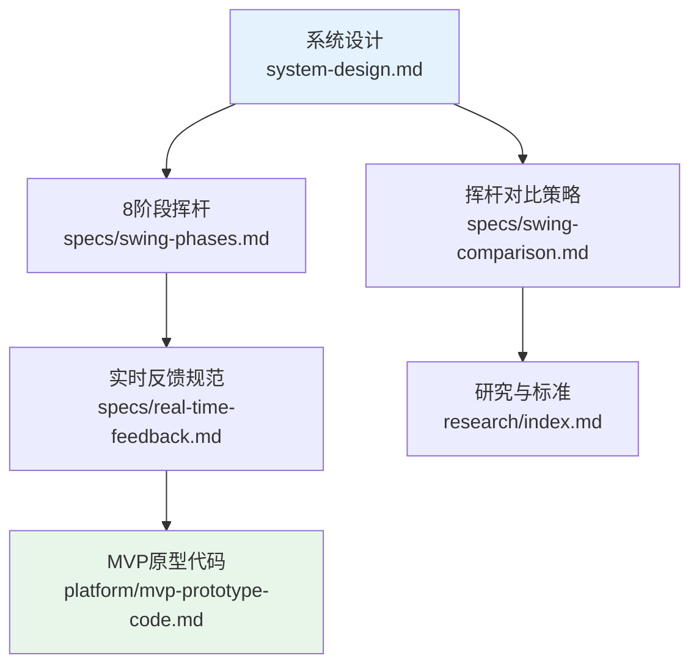

# 系统设计中心

> **一句话定位**: 三模态传感器融合的高尔夫挥杆分析系统

---

## 快速导航

### 核心架构

| 文档 | 内容 | 阅读时间 |
|------|------|---------|
| [系统设计](system-design.md) | MVP 管道架构、数据流、规则引擎 | 30分钟 |
| [8阶段挥杆](specs/swing-phases.md) | GolfDB 标准相位定义与检测方法 | 15分钟 |
| [实时反馈规范](specs/real-time-feedback.md) | 三种反馈模式与延迟要求 | 10分钟 |
| [挥杆对比策略](specs/swing-comparison.md) | DTW 与四种对比方法 | 10分钟 |

### 入门指南

| 文档 | 内容 | 阅读时间 |
|------|------|---------|
| [MVP 原型代码](../platform/mvp-prototype-code.md) | 无需硬件，Mock 数据测试 | 10分钟 |
| [ML 基础入门](guides/ml-basics.md) | 什么需要 ML，什么用物理公式 | 15分钟 |
| [SDK 选型指南](guides/sdk-selection.md) | 所有库的安装命令与选型理由 | 10分钟 |

### 研究与标准

| 文档 | 内容 |
|------|------|
| [研究索引](research/index.md) | 生物力学研究与基准值汇总 |
| [个性化规范](specs/personalization.md) | 按用户特征调整阈值 |

### 决策记录

| 文档 | 内容 |
|------|------|
| [ADR 决策记录](decisions/index.md) | 所有 ADR 概览、详解、贡献指南 |

---

## 阅读路径

---

## 文档版本

| 版本 | 日期 | 变更 |
|-----|------|-----|
| 1.1 | 2025-12-18 | 重构为 specs/ 和 guides/ 文件夹 |
| 1.0 | 2025-12-17 | 创建设计中心索引页 |

---

**下一步**: [阅读系统设计 →](system-design.md)
