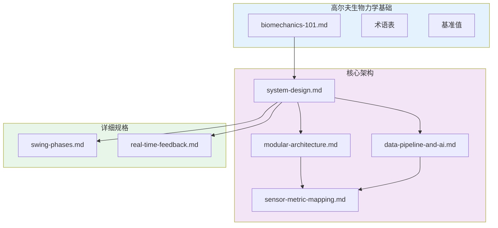

# 技术设计概览

> **一句话定位**: 三模态传感器融合的高尔夫挥杆分析系统

---

## 阅读路线图

```text
┌─────────────────────────────────────────────────────────────────────┐
│  LEVEL 1: 高尔夫生物力学基础 (2-3小时)                               │
│  └── 理解高尔夫挥杆的物理与生理                                       │
│                                                                      │
│  LEVEL 2: 核心架构 (2-3小时)                                         │
│  └── 理解 MVP 系统设计                                                │
│                                                                      │
│  LEVEL 3: 详细规格 (按需)                                            │
│  └── 参考具体功能规格                                                 │
└─────────────────────────────────────────────────────────────────────┘
```

---

## 快速导航

### 1️⃣ 高尔夫生物力学基础 (先读这里)

| 文档 | 内容 | 阅读时间 |
|------|------|---------|
| [入门教程](../prerequisites/foundations/biomechanics-101.md) | 7章从零开始学习高尔夫挥杆物理学 | ~90分钟 |
| [术语表](../prerequisites/foundations/biomechanics-glossary.md) | 140+ 专业术语定义 | 按需查阅 |
| [基准值](../prerequisites/foundations/biomechanics-benchmarks.md) | 职业/业余选手量化对比 | 按需查阅 |

> **新成员必读**: 先完成 [入门教程](../prerequisites/foundations/biomechanics-101.md)，再进入核心架构

### 2️⃣ 核心架构 (技术核心)

| 文档 | 内容 | 阅读时间 |
|------|------|---------|
| [系统设计](architecture/system-design.md) | MVP 全貌：4模块、12指标、6规则 | ~25分钟 |
| [模块化架构](architecture/modular-architecture.md) | LEGO 积木块设计 | ~25分钟 |
| [数据流与反馈](architecture/data-pipeline-and-ai.md) | 时间对齐、Kinematic Prompts | ~20分钟 |
| [传感器指标映射](architecture/sensor-metric-mapping.md) | Python 实现代码 | 按需查阅 |

### 3️⃣ 详细规格 (按需参考)

| 文档 | 内容 |
|------|------|
| [挥杆阶段](specs/swing-phases.md) | 8阶段定义与检测方法 |
| [实时反馈](specs/real-time-feedback.md) | 三种反馈模式与延迟要求 |
| [挥杆对比](specs/swing-comparison.md) | DTW 与四种对比方法 |
| [个性化](specs/personalization.md) | 按用户特征调整阈值 |

### 技术决策

| 文档 | 内容 |
|------|------|
| [技术决策索引](decisions/index.md) | 所有选型决策（按替换成本分层） |
| [SDK/库选型](decisions/sdk-selection.md) | MediaPipe、NeuroKit2 等库选型 |
| [可视化工具](decisions/visualization-tools-evaluation.md) | Rerun 调试工具选型 |

### 竞品研究

| 文档 | 内容 |
|------|------|
| [竞品指标对比](research/competitor-metrics-comparison.md) | OnForm/Sportsbox vs 我们 |

### 角色指南 (新成员入口)

| 角色 | Brief |
|------|-------|
| 软件工程师 | [software-engineer.md](briefs/software-engineer.md) |
| 移动开发者 | [mobile-developer.md](briefs/mobile-developer.md) |
| 硬件工程师 | [hardware-engineer.md](briefs/hardware-engineer.md) |
| 高尔夫顾问 | [golf-advisor.md](briefs/golf-advisor.md) |

---

## 文档关系图



---

## 版本历史

| 版本 | 日期 | 变更 |
|-----|------|-----|
| 2.1 | 2025-12-25 | 整合决策文档到 decisions/，删除 guides/ |
| 2.0 | 2025-12-20 | 重构为 foundations/ + architecture/ 结构 |
| 1.2 | 2025-12-18 | 添加角色指南导航 |
| 1.0 | 2025-12-17 | 创建设计中心索引页 |

---

**下一步**: [从生物力学入门开始 →](../prerequisites/foundations/biomechanics-101.md)
