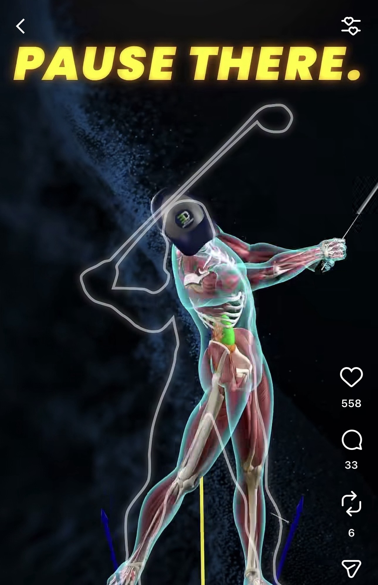
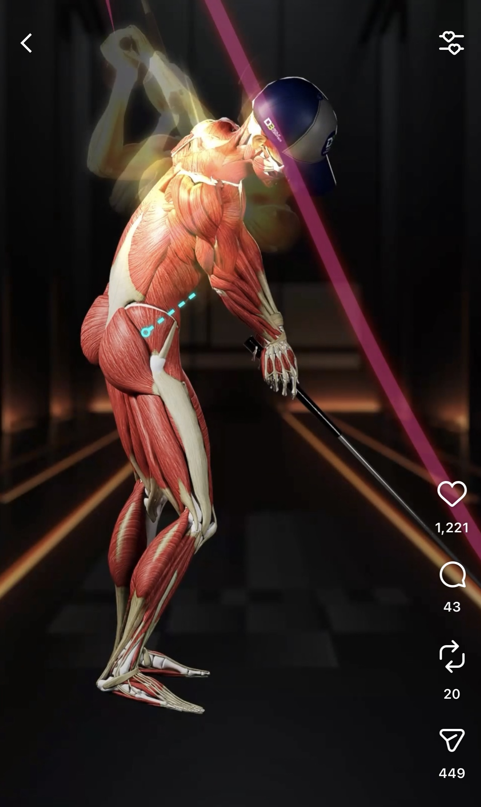
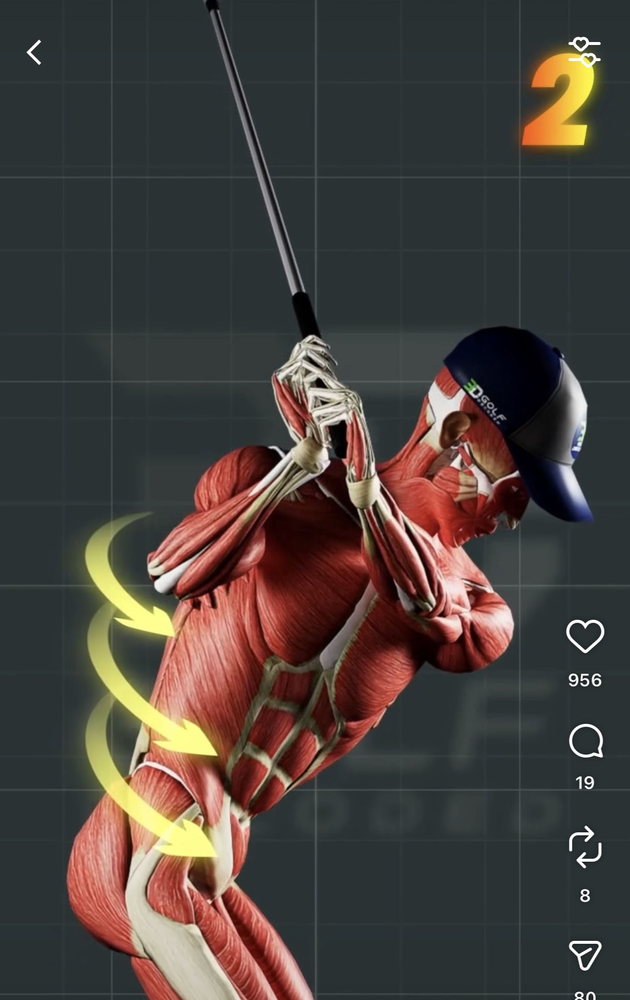
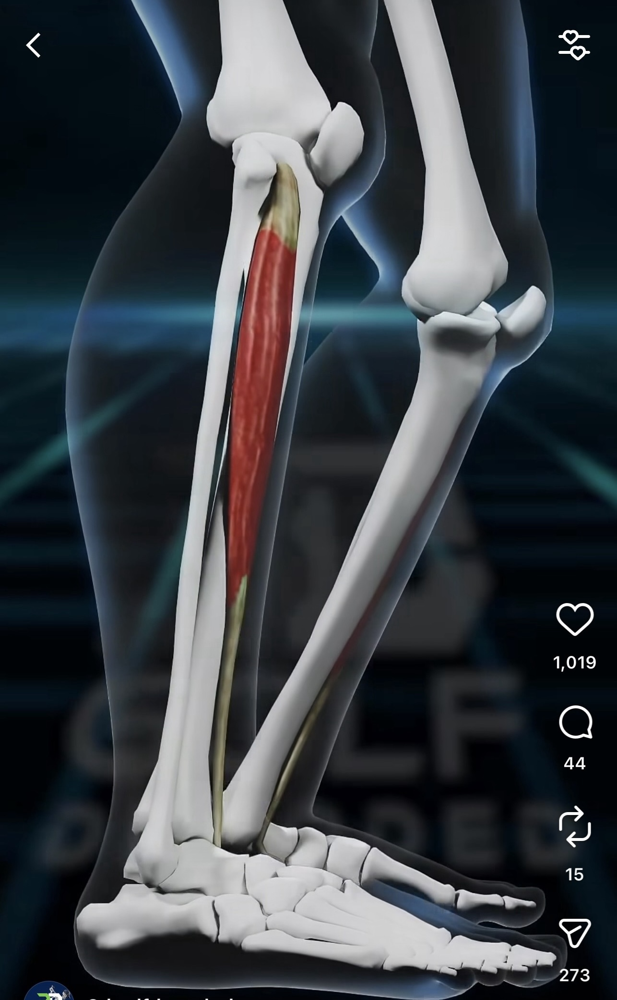
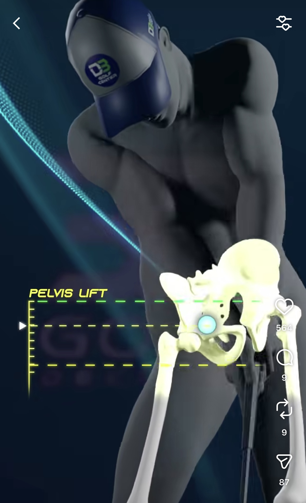
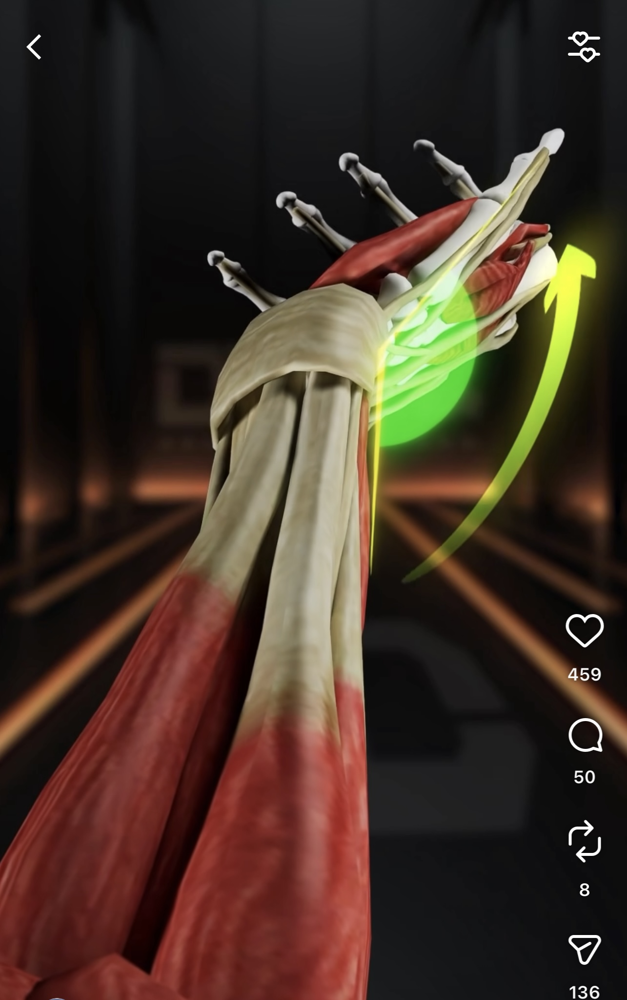
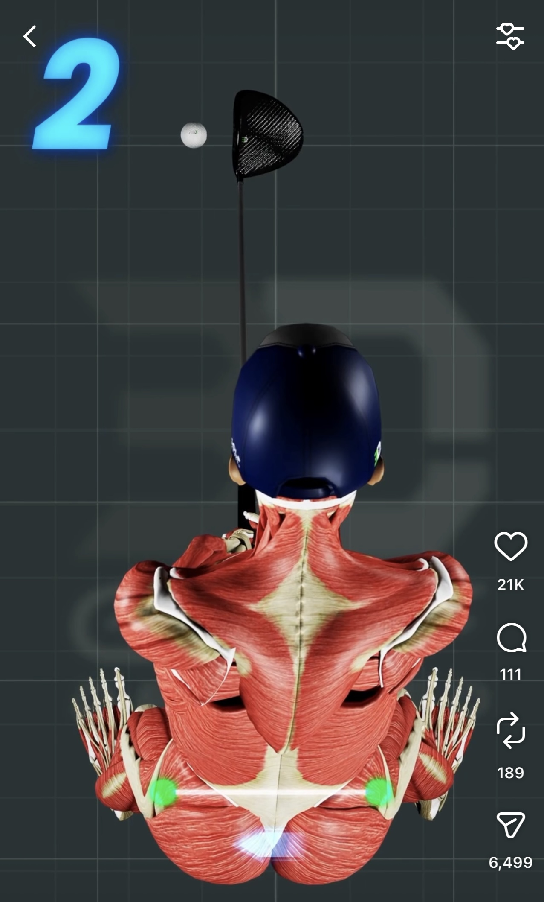
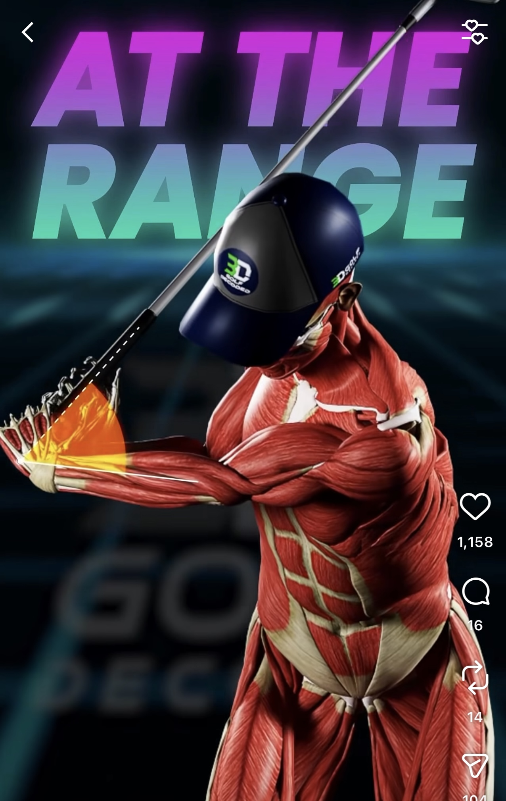

# 3D Golf Decoded 研究

> **研究日期**: 2025-01-07 | **类型**: 竞品/案例研究

---

## 基本信息

| 项目 | 内容 |
|------|------|
| **名称** | 3D Golf Decoded |
| **网站** | [3dgolfdecoded.com](https://3dgolfdecoded.com/) |
| **Instagram** | [@3dgolfdecoded](https://www.instagram.com/3dgolfdecoded/) |
| **关联机构** | DB Golf Center (新加坡) |
| **官网** | [dbgolfcenter.com](https://dbgolfcenter.com/) |
| **地址** | 6 Tampines Street 92, #01-03, Singapore 528893 |
| **创始人** | Davide Bertoli (@db.golfcoach / @dbprogolf) |

---

## 1. 背景信息

### 1.1 定位

**高尔夫培训机构 + 教练认证课程**（非软件公司）

- DB Golf Center: 新加坡室内高尔夫培训中心
- 3D Golf Decoded: 面向教练的 3D 生物力学认证课程
- 理念: "We don't guess, we measure"

**创始人**: Davide Bertoli - Elite Golf Coach, Swing Catalyst Ambassador, Cobra & Puma Ambassador

### 1.2 技术设备

| 设备 | 用途 |
|------|------|
| **Swing Catalyst** | 挥杆分析 + 压力板 |
| **Foresight** | 发球监测器 |
| **3D PuttView** | AR 推杆绿分析 |
| **Capto System** | 推杆动作分析 |

### 1.3 课程体系

| 级别 | 名称 | 形式 |
|------|------|------|
| 基础 | Foundation | 线上 + 线下 |
| 高级 | Master | 线上 + 线下 |

**对比 TPI**: TPI Level 1/2 各 $1,095，3D Golf Decoded 价格未公开。

### 1.4 服务与定价

| 服务 | 价格 |
|------|------|
| 室内模拟器 | SGD 15 起 |
| 90分钟挥杆评估 | 未公开 |
| 1对1教练 | 未公开 |

### 1.5 商业模式

```text
收入来源：
├── 培训中心 (DB Golf Center): 场地租赁、1对1教练、大师班
├── 认证课程 (3D Golf Decoded): Foundation/Master 课程
└── 品牌合作: Swing Catalyst/Cobra/Puma Ambassador
```

---

## 2. Instagram 3D 动画分析（重点）

### 2.1 两种动画类型

Instagram 上有**两种类型**的 3D 动画内容：

#### 2.1.1 肌肉人体动画（主要内容）

**带肌肉纹理的 3D 人体模型**动画，展示挥杆时的肌肉解剖结构。

| 项目 | 说明 |
|------|------|
| **模型来源** | 购买的 3D 解剖人体模型（Zygote Body、TurboSquid、DAZ 3D） |
| **制作工具** | Blender、Maya、Cinema 4D |
| **动作来源** | 手动关键帧动画 或 动捕数据导入 |
| **后期制作** | 添加文字标注、角度指示线、特效 |

**工作流程**:

```text
┌─────────────────────────────────────────────────────────────────┐
│  1. 准备素材                                                     │
│     └── 购买/下载带肌肉纹理的 3D 人体解剖模型                        │
│                                                                 │
│  2. 动画制作                                                     │
│     ├── 在 3D 软件中绑定骨骼（Rigging）                            │
│     ├── 制作挥杆关键帧动画 或 导入动捕数据                           │
│     └── 调整相机视角和渲染设置                                      │
│                                                                 │
│  3. 后期合成                                                     │
│     ├── 添加角度标注、运动轨迹线                                    │
│     ├── 添加文字说明（如 "Trail Hip Control"）                     │
│     └── 导出视频用于社交媒体                                       │
└─────────────────────────────────────────────────────────────────┘
```

**重要说明**:

- 肌肉**只是视觉效果**，不是实时采集的肌电数据
- 这是**通用教学动画**，不是针对具体球员的个性化分析
- 用途是展示"挥杆时哪些肌肉参与"的概念

#### 2.1.2 骨骼分析动画（辅助内容）

部分内容可能使用 **[Sportsbox AI](https://www.sportsbox.ai/)** 生成简化骨骼动画。

| 项目 | 说明 |
|------|------|
| **输入** | 单个 2D 慢动作视频（手机拍摄） |
| **技术** | Kinematic AI（深度学习姿态估计 + 3D 重建） |
| **输出** | 简化骨骼模型（火柴人风格），6 个视角 |
| **定价** | $799/年（教练版） |

#### 两种动画对比

| 对比项 | 肌肉人体动画 | Sportsbox 骨骼动画 |
|--------|-------------|-------------------|
| **视觉效果** | 高端、专业 | 简洁、技术感 |
| **制作成本** | 高（需 3D 建模技能） | 低（手机拍摄即可） |
| **个性化** | 通用动画 | 可分析具体球员 |
| **数据价值** | 纯演示 | 可提取生物力学数据 |
| **用途** | 营销、教学概念 | 实际挥杆分析 |

### 2.2 界面设计核心特点

#### 2.2.1 3D 立体呈现

3D 呈现让抽象的生物力学概念变得可触可感。

| | | | |
|:---:|:---:|:---:|:---:|
| { width="200" } | { width="200" } | { width="200" } | { width="200" } |

#### 2.2.2 丝滑动画展示

动画播放**流畅丝滑**，配合讲解节奏调整速度。关键动作点会**暂停或慢放**，配合文字和语音讲解，让学习者理解要点。**重点标注**在暂停时出现，用箭头、圆圈、高亮等方式指向需要关注的部位。**视图切换**在讲解过程中自然过渡，从正面切到侧面，或从全身切到局部放大。**重影（Ghost/Onion Skin）设计**保留前几帧的半透明残影，在单帧画面中展示动作的连续变化轨迹。整体观感像一个精心制作的教学视频，而不是枯燥的数据展示。

| | | | |
|:---:|:---:|:---:|:---:|
| { width="300" } | { width="300" } | { width="300" } | { width="300" } |
| { width="300" } | { width="300" } | | |


#### 2.2.3 肌肉与骨骼叠加

界面同时展示**肌肉层**和**骨骼层**，两者可以叠加或单独展示。骨骼层展示关节角度、旋转轴心、运动轨迹等几何信息。肌肉层展示哪些肌肉群在发力、肌肉的拉伸和收缩状态。这种双层设计帮助学习者理解"骨骼怎么动"和"肌肉怎么配合"的关系。每个动作要点都可以在对应的肌肉或骨骼上标注指标，比如髋部旋转角度标注在骨盆上，核心发力标注在腹肌群上。

| | | | |
|:---:|:---:|:---:|:---:|
| { width="300" } | { width="300" } | { width="300" } | { width="300" } |
| { width="300" } | { width="300" } | | |

#### 2.2.4 线条和数据标注设计

动画中的各种标注和指标采用**半透明设计**，不遮挡人体动作本身。重力线、力线、旋转线、角度标注等都是半透明的，既能看到指标信息，又能看清背后的肌肉和骨骼。文字标签和数值显示也采用半透明背景，确保信息清晰但不喧宾夺主。这种设计让界面信息丰富但不杂乱，学习者可以同时关注动作和数据。

线条和标注让学习者直观理解"重心转移"、"地面反作用力"、"旋转发力"和"动作幅度"这些抽象概念。

| | | | |
|:---:|:---:|:---:|:---:|
| { width="300" } | { width="300" } | { width="300" } | { width="300" } |
| { width="300" } | { width="300" } | { width="300" } | { width="300" } |
| { width="300" } | { width="300" } | | |

#### 2.2.5 实时对比

动画采用**左右分屏或叠加对比**的方式，多个画面**同步播放**，让学习者更容易理解动作细节。

**对错对比**：左边是正确动作，右边是常见错误，学习者可以清晰看到两者的差异。

例如展示"早伸展（Early Extension）"时，左边髋部保持稳定，右边髋部前冲，下杆过程中差距逐渐拉开。

**角度对比**：同一个动作从正面、侧面、俯视等不同角度同时展示。

例如髋部旋转，正面看是重心转移，侧面看是前后移动，俯视才能看清旋转幅度。

**画面对比**：肌肉视图和骨骼视图并排显示，或者全身视图和局部放大同时展示。

这些对比都是动态的、实时的，每一帧都能看到差异，比静态截图更直观。

#### 2.2.7 发力效果展示

动画通过**视觉特效**展示肌肉发力的强度和时机。

发力的肌肉群会**高亮显示**，颜色变化表示激活程度，越亮表示发力越大。

有些动画还会用**脉冲效果**或**光晕效果**来强调发力的瞬间。

例如下杆时，先是臀肌和核心高亮，然后是躯干旋转肌群，最后是手臂和手腕，清晰展示 Kinematic Sequence（动力链顺序）。

这种发力可视化让学习者理解"什么时候该发力"和"用哪里发力"。

### 2.3 可视化元素清单

他们的动画界面有很强的**教学直观性**：

| 可视化元素 | 说明 | 对学习者的价值 |
|-----------|------|---------------|
| **肌肉高亮** | 不同颜色标记参与的肌肉群 | 理解"该用哪些肌肉发力" |
| **角度标注圆** | 紫色圆圈标注髋部/肩部旋转角度 | 量化动作幅度，有具体目标 |
| **运动轨迹线** | 彩虹色轨迹线显示球/杆头路径 | 理解 Draw/Fade 的区别 |
| **对比视图** | 左右对比（正确 vs 错误） | 直观看到差异在哪 |
| **骨骼叠加** | 肌肉 + 骨骼线条同时显示 | 理解骨骼如何驱动肌肉 |
| **文字标签** | 大字标题如 "Trail Hip Control" | 快速理解动作要点 |
| **数值显示** | 角度、速度等具体数字 | 量化反馈，可追踪进步 |

### 2.4 教学主题和指标

从 Instagram 内容中观察到的教学主题：

**动作要点类**:

| 主题 | 英文 | 教学意义 |
|------|------|----------|
| 后髋控制 | Trail Hip Control | 下杆时后侧髋部的旋转控制 |
| 杆面控制 | Square Face / Open Face | 触球时杆面角度影响球路 |
| 杆身前倾 | Shaft Lean | 触球时杆身向目标倾斜程度 |
| 反弹激活 | Activate the Bounce | 沙坑/切球时的杆底角使用 |
| 球路控制 | Fades / Draws | 左曲球 vs 右曲球的动作区别 |

**生物力学指标类**:

| 指标 | 说明 | 典型值 |
|------|------|--------|
| **X-Factor** | 肩髋分离角（上身-下身旋转差） | 顶点约 45°-60° |
| **X-Factor Stretch** | 下杆初期肩髋分离角的增加 | 比顶点多 10°-15° |
| **髋部旋转** | 骨盆相对目标线的旋转角度 | 顶点约 45°（闭合） |
| **肩部旋转** | 肩线相对目标线的旋转角度 | 顶点约 90°-100° |
| **Kinematic Sequence** | 下杆发力顺序：髋→躯干→手臂→杆头 | 峰值速度依次出现 |
| **O-Factor** | 骨盆倾斜角（侧倾） | 影响触球稳定性 |
| **S-Factor** | 肩部倾斜角（侧倾） | 影响挥杆平面 |

---

## 3. 对 Movement Chain AI 的启示

### 3.1 界面设计启示

| 他们做得好的 | 我们可以借鉴/超越 |
|-------------|-------------------|
| 肌肉可视化直观 | 结合 **sEMG 实时数据**，显示真实肌肉激活 |
| 角度标注清晰 | 用 **IMU 数据**提供更精确的实时角度 |
| 对比视图 | 提供 **与职业选手/个人最佳** 的叠加对比 |
| 文字标签醒目 | 用 **语音反馈** 实时播报，不需要看屏幕 |
| 通用教学动画 | **个性化 Avatar** 基于用户体型生成 |

### 3.2 差异化机会

| 他们 | 我们 |
|------|------|
| 使用现成工具 | **自研软件** |
| 需要专业设备 | **手机 + 可穿戴** |
| 固定场地 | **随时随地** |
| 需要教练解读 | **AI 自动分析** |
| 高价专业服务 | **大众化定价** |
| 肌肉只是视觉效果 | **sEMG 真实肌肉数据** |
| 事后分析 | **实时反馈** |

### 3.3 关键洞察

1. **市场验证**: 3D 生物力学分析在高尔夫教练市场有真实需求
2. **价格空间**: 专业服务定价较高，存在降维打击空间
3. **内容策略**: 3D 动画是极佳的营销素材
4. **认证模式**: B2B 教练认证是可行的商业模式
5. **可视化价值**: 直观的界面对学习者有很大帮助，值得重点投入

---

## 参考资料

- [3D Golf Decoded 官网](https://3dgolfdecoded.com/)
- [DB Golf Center 官网](https://dbgolfcenter.com/)
- [Swing Catalyst](https://swingcatalyst.com/)
- [Foresight Sports](https://www.foresightsports.com/)
- [3D PuttView](https://puttview.com/)
- [Capto Putting](https://capto.golf/)
- [TPI Certification](https://www.mytpi.com/certification)
- [Sportsbox AI](https://www.sportsbox.ai/)
- [Gears Golf Biomechanics](https://www.gearssports.com/golf-swing-biomechanics/)
- [K-Motion 3D Golf Swing Analysis](https://www.k-motion.com/)
