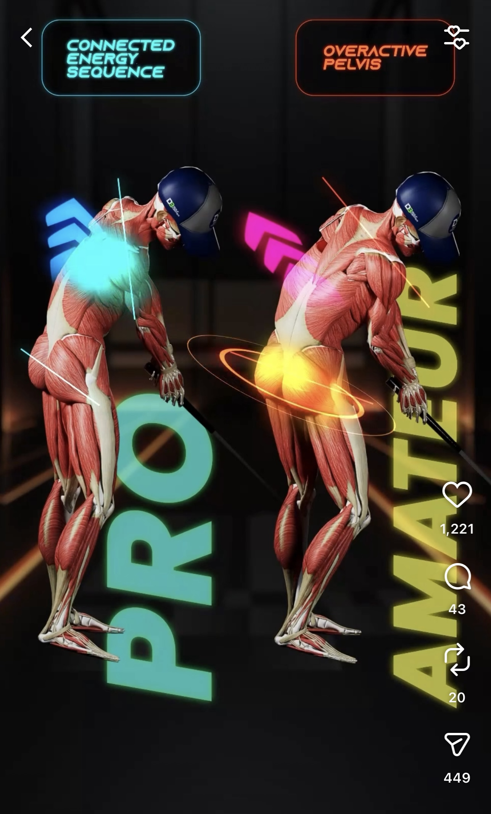
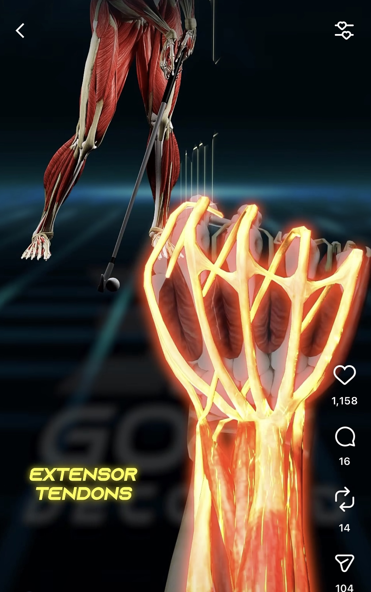
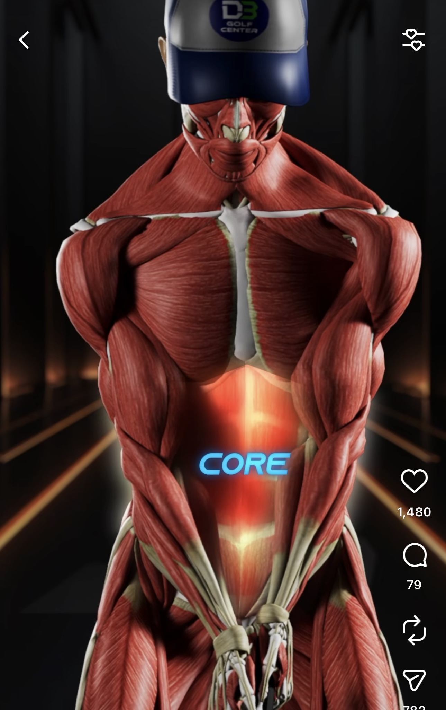
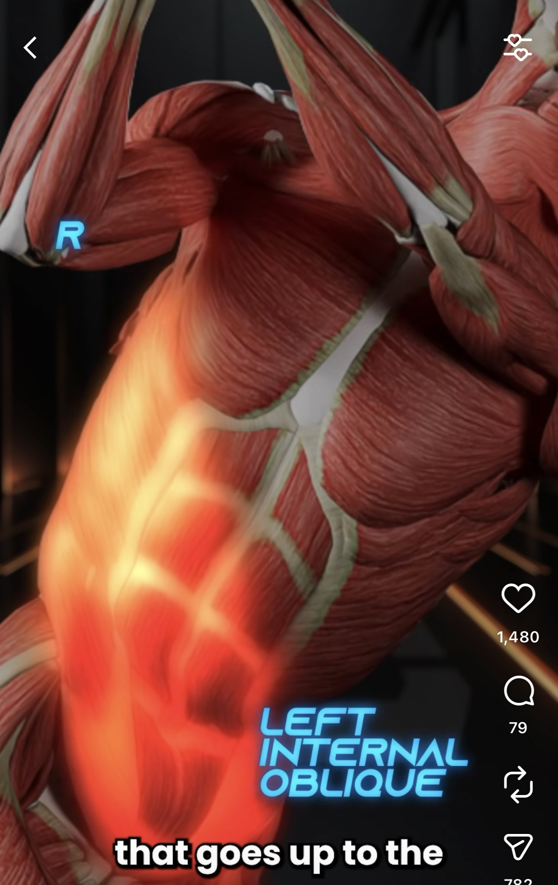

# 3D Golf Decoded 研究

> **研究日期**: 2025-01-07 | **类型**: 竞品/案例研究

---

## 基本信息

| 项目 | 内容 |
|------|------|
| **名称** | 3D Golf Decoded |
| **网站** | [3dgolfdecoded.com](https://3dgolfdecoded.com/) |
| **Instagram** | [@3dgolfdecoded](https://www.instagram.com/3dgolfdecoded/) |
| **关联机构** | DB Golf Center (新加坡) |
| **官网** | [dbgolfcenter.com](https://dbgolfcenter.com/) |
| **地址** | 6 Tampines Street 92, #01-03, Singapore 528893 |
| **创始人** | Davide Bertoli (@db.golfcoach / @dbprogolf) |

---

## 1. 背景信息

### 1.1 定位

**高尔夫培训机构 + 教练认证课程**（非软件公司）

- DB Golf Center: 新加坡室内高尔夫培训中心
- 3D Golf Decoded: 面向教练的 3D 生物力学认证课程
- 理念: "We don't guess, we measure"

**创始人**: Davide Bertoli - Elite Golf Coach, Swing Catalyst Ambassador, Cobra & Puma Ambassador

### 1.2 技术设备

| 设备 | 用途 |
|------|------|
| **Swing Catalyst** | 挥杆分析 + 压力板 |
| **Foresight** | 发球监测器 |
| **3D PuttView** | AR 推杆绿分析 |
| **Capto System** | 推杆动作分析 |

### 1.3 课程体系

| 级别 | 名称 | 形式 |
|------|------|------|
| 基础 | Foundation | 线上 + 线下 |
| 高级 | Master | 线上 + 线下 |

**对比 TPI**: TPI Level 1/2 各 $1,095，3D Golf Decoded 价格未公开。

### 1.4 服务与定价

| 服务 | 价格 |
|------|------|
| 室内模拟器 | SGD 15 起 |
| 90分钟挥杆评估 | 未公开 |
| 1对1教练 | 未公开 |

### 1.5 商业模式

```text
收入来源：
├── 培训中心 (DB Golf Center): 场地租赁、1对1教练、大师班
├── 认证课程 (3D Golf Decoded): Foundation/Master 课程
└── 品牌合作: Swing Catalyst/Cobra/Puma Ambassador
```

---

## 2. Instagram 3D 动画分析（重点）

### 2.1 3D 解剖动画技术分析

#### 2.1.1 多层解剖模型

Instagram 上的 3D 动画使用的是**多层解剖模型**，骨骼和肌肉是**同一个模型的不同渲染层**，而非两个独立模型。

**模型结构**：

```text
┌─────────────────────────────────────────┐
│           多层解剖模型                    │
├─────────────────────────────────────────┤
│  骨骼层 (Skeleton)  ─── 关节、骨骼结构     │
│         ↑                               │
│  肌肉层 (Muscles)   ─── 肌肉群、肌腱      │
│         ↑                               │
│  皮肤层 (Skin)      ─── 外观（可选）      │
└─────────────────────────────────────────┘
        ↓
   统一骨骼系统驱动，各层同步运动
```

**技术实现**：

| 项目 | 说明 |
|------|------|
| **模型来源** | 专业多层解剖模型（Zygote Body、TurboSquid、DAZ 3D） |
| **模型特点** | 包含骨骼层、肌肉层、皮肤层，可单独或组合渲染 |
| **制作工具** | Blender、Maya、Cinema 4D |
| **动作来源** | 手动关键帧动画 或 动捕数据导入 |
| **渲染方式** | 可选择显示单层或多层叠加（半透明） |

**工作流程**:

```text
┌─────────────────────────────────────────────────────────────────┐
│  1. 准备素材                                                     │
│     └── 购买多层解剖模型（含骨骼层 + 肌肉层）                        │
│                                                                 │
│  2. 动画制作                                                     │
│     ├── 骨骼系统驱动整个模型（各层同步运动）                         │
│     ├── 制作挥杆关键帧动画 或 导入动捕数据                           │
│     └── 选择渲染层：仅骨骼 / 仅肌肉 / 骨骼+肌肉叠加                   │
│                                                                 │
│  3. 后期合成                                                     │
│     ├── 添加角度标注、运动轨迹线                                    │
│     ├── 添加文字说明（如 "Trail Hip Control"）                     │
│     └── 导出视频用于社交媒体                                       │
└─────────────────────────────────────────────────────────────────┘
```

**重要说明**:

- 骨骼和肌肉**精确对齐**，因为是同一模型的不同层
- 肌肉**只是视觉效果**，不是实时采集的肌电数据
- 这是**通用教学动画**，不是针对具体球员的个性化分析
- 用途是展示"挥杆时哪些肌肉参与"的概念

#### 2.1.2 与 AI 骨骼分析的对比

部分内容可能使用 **[Sportsbox AI](https://www.sportsbox.ai/)** 生成简化骨骼动画，这是另一种技术路线。

| 对比项 | 多层解剖模型动画 | Sportsbox AI 骨骼动画 |
|--------|-----------------|---------------------|
| **技术原理** | 预制3D模型 + 动画渲染 | 2D视频 → AI姿态估计 → 3D重建 |
| **视觉效果** | 高端、专业、解剖细节丰富 | 简洁、技术感（火柴人风格） |
| **制作成本** | 高（需购买模型 + 3D建模技能） | 低（手机拍摄即可） |
| **个性化** | 通用动画 | 可分析具体球员 |
| **数据价值** | 纯演示 | 可提取生物力学数据 |
| **用途** | 营销、教学概念 | 实际挥杆分析 |
| **定价** | 一次性购买模型 | $799/年（教练版） |

### 2.2 界面设计核心特点

#### 2.2.1 3D 立体呈现

3D 呈现让抽象的生物力学概念变得可触可感。

| | | | |
|:---:|:---:|:---:|:---:|
| { width="200" } | { width="200" } | { width="200" } | { width="200" } |

#### 2.2.2 丝滑动画展示

动画播放**流畅丝滑**，配合讲解节奏调整速度。关键动作点会**暂停或慢放**，配合文字和语音讲解，让学习者理解要点。**重点标注**在暂停时出现，用箭头、圆圈、高亮等方式指向需要关注的部位。**视图切换**在讲解过程中自然过渡，从正面切到侧面，或从全身切到局部放大。**重影（Ghost/Onion Skin）设计**保留前几帧的半透明残影，在单帧画面中展示动作的连续变化轨迹。整体观感像一个精心制作的教学视频，而不是枯燥的数据展示。

| | | | |
|:---:|:---:|:---:|:---:|
| { width="300" } | { width="300" } | { width="300" } | { width="300" } |
| { width="300" } | { width="300" } | | |


#### 2.2.3 肌肉与骨骼叠加

界面同时展示**肌肉层**和**骨骼层**，两者可以叠加或单独展示。骨骼层展示关节角度、旋转轴心、运动轨迹等几何信息。肌肉层展示哪些肌肉群在发力、肌肉的拉伸和收缩状态。这种双层设计帮助学习者理解"骨骼怎么动"和"肌肉怎么配合"的关系。每个动作要点都可以在对应的肌肉或骨骼上标注指标，比如髋部旋转角度标注在骨盆上，核心发力标注在腹肌群上。

| | | | |
|:---:|:---:|:---:|:---:|
| { width="300" } | { width="300" } | { width="300" } | { width="300" } |
| { width="300" } | { width="300" } | | |

#### 2.2.4 线条、数据、颜色标注设计

动画中的各种标注和指标采用**半透明设计**，不遮挡人体动作本身。
重力线、力线、旋转线、角度标注等都是半透明的，既能看到指标信息，又能看清背后的肌肉和骨骼。文字标签和数值显示也采用半透明背景，确保信息清晰但不喧宾夺主。这种设计让界面信息丰富但不杂乱，学习者可以同时关注动作和数据。

线条和标注让学习者直观理解"重心转移"、"地面反作用力"、"旋转发力"、‘运动轨迹“和"动作幅度"这些抽象概念。

| | | | |
|:---:|:---:|:---:|:---:|
| { width="300" } | { width="300" } | { width="300" } | { width="300" } |
| { width="300" } | { width="300" } | { width="300" } | { width="300" } |
| { width="300" } | { width="300" } | { width="300" } | { width="300" } |
| { width="300" } | { width="300" } | | |

#### 2.2.5 实时对比

动画采用**对比**的方式，多个画面**同步播放**，让学习者更容易理解动作细节。

**对错对比**：左边是正确动作，右边是常见错误，学习者可以清晰看到两者的差异。

**角度对比**：同一个动作从正面、侧面、俯视等不同角度同时展示。

**画面对比**：肌肉视图和骨骼视图对比显示，或者全身视图和局部放大同时展示。

| | | | |
|:---:|:---:|:---:|:---:|
| { width="300" } | { width="300" } | { width="300" } | { width="300" } |
| { width="300" } | { width="300" } | { width="300" } | { width="300" } |

#### 2.2.7 发力效果展示

动画通过**视觉特效**展示肌肉发力的强度和时机。发力的肌肉群会**高亮显示**，颜色变化表示激活程度，越亮表示发力越大。有些动画还会用**脉冲效果**或**光晕效果**来强调发力的瞬间。这种发力可视化让学习者理解"什么时候该发力"和"用哪里发力"。

| | | | |
|:---:|:---:|:---:|:---:|
| { width="300" } | { width="300" } | { width="300" } | { width="300" } |
| { width="300" } | { width="300" } | | |

### 2.3 可视化元素清单

他们的动画界面有很强的**教学直观性**，以下是可供我们参考的标注元素：

#### 2.3.1 线条类型

| 线条类型 | 视觉样式 | 用途 | 我们可参考的场景 |
|---------|---------|------|-----------------|
| **角度弧线** | 紫色/蓝色圆弧 + 角度数值 | 标注关节旋转角度（髋、肩、膝） | 视频回放中标注IMU角度 |
| **运动轨迹线** | 彩虹渐变色曲线 | 显示杆头/手部运动路径 | 视频回放中叠加轨迹 |
| **力线/矢量线** | 箭头线条 | 显示力的方向和大小 | 标注发力方向 |
| **参考线** | 白色/灰色虚线 | 地面线、目标线、垂直线 | 对齐参考 |
| **连接线** | 细线连接关节点 | 骨骼简化显示 | 姿态骨架叠加 |
| **重心轨迹** | 点状轨迹线 | 显示重心移动路径 | 重心转移可视化 |

#### 2.3.2 数据标注

| 数据类型 | 显示方式 | 典型值 | 我们可标注的数据 |
|---------|---------|--------|-----------------|
| **角度值** | 数字 + 度数符号 | 45°、90° | IMU关节角度 |
| **速度值** | 数字 + 单位 | 120 mph | — |
| **百分比** | 数字 + % | 80% | 肌肉激活百分比（sEMG） |
| **时间戳** | 动作阶段标记 | Address、Top、Impact | 动作阶段划分 |

#### 2.3.3 视觉效果

| 效果类型 | 说明 | 用途 | 我们可参考的场景 |
|---------|------|------|-----------------|
| **肌肉高亮** | 颜色变化标记激活肌肉群 | 理解"该用哪些肌肉发力" | 指导视频中高亮目标肌群 |
| **脉冲/光晕** | 发力瞬间的视觉强调 | 突出发力时机 | 关键发力点提示 |
| **半透明叠加** | 骨骼在肌肉上方半透明显示 | 同时看到内外结构 | 数据叠加在视频上 |
| **颜色渐变** | 从冷色到暖色表示强度 | 量化显示程度差异 | sEMG激活强度 |
| **对比分屏** | 左右/上下分屏对比 | 正确vs错误、前后对比 | 用户动作vs标准动作 |

#### 2.3.4 文字标注

| 标注类型 | 样式 | 示例 | 用途 |
|---------|------|------|------|
| **动作标题** | 大字、醒目 | "Trail Hip Control" | 快速传达主题 |
| **数值标签** | 数字 + 单位 | "45°"、"120 mph" | 量化反馈 |
| **阶段标记** | 简短词汇 | "Address"、"Top"、"Impact" | 动作时间节点 |
| **提示文字** | 简短说明 | "保持后髋稳定" | 动作要点提示 |

### 2.4 教学主题和指标

从 Instagram 内容中观察到的教学主题：

**动作要点类**:

| 主题 | 英文 | 教学意义 |
|------|------|----------|
| 后髋控制 | Trail Hip Control | 下杆时后侧髋部的旋转控制 |
| 杆面控制 | Square Face / Open Face | 触球时杆面角度影响球路 |
| 杆身前倾 | Shaft Lean | 触球时杆身向目标倾斜程度 |
| 反弹激活 | Activate the Bounce | 沙坑/切球时的杆底角使用 |
| 球路控制 | Fades / Draws | 左曲球 vs 右曲球的动作区别 |

**生物力学指标类**:

| 指标 | 说明 | 典型值 |
|------|------|--------|
| **X-Factor** | 肩髋分离角（上身-下身旋转差） | 顶点约 45°-60° |
| **X-Factor Stretch** | 下杆初期肩髋分离角的增加 | 比顶点多 10°-15° |
| **髋部旋转** | 骨盆相对目标线的旋转角度 | 顶点约 45°（闭合） |
| **肩部旋转** | 肩线相对目标线的旋转角度 | 顶点约 90°-100° |
| **Kinematic Sequence** | 下杆发力顺序：髋→躯干→手臂→杆头 | 峰值速度依次出现 |
| **O-Factor** | 骨盆倾斜角（侧倾） | 影响触球稳定性 |
| **S-Factor** | 肩部倾斜角（侧倾） | 影响挥杆平面 |

---

## 3. 对 Movement Chain AI 的启示

### 3.1 产品定位差异

| 维度 | 3D Golf Decoded | Movement Chain AI |
|------|-----------------|-------------------|
| **产品类型** | 教学演示软件 | 辅助训练设备 |
| **核心场景** | 教练讲解、学员认知建立 | 用户自主练习、实时纠正 |
| **设备需求** | 专业设备 + 教练 | 手机 + 可穿戴 |
| **价格定位** | 高价专业服务 | 大众化定价 |
| **肌肉数据** | 视觉效果（非真实数据） | sEMG 真实肌肉激活数据 |

### 3.2 界面设计借鉴

根据 Fitts & Posner (1967) 的**运动技能习得三阶段理论**，学习者需要经历认知、联结、自动化三个阶段：

| 阶段 | 特点 | 3D Golf Decoded | Movement Chain AI |
|------|------|-----------------|-------------------|
| **认知阶段** | 理解动作要领，慢速、有意识执行 | ✅ 教学动画覆盖 | ❌ 未覆盖（机会点） |
| **联结阶段** | 减少错误，动作逐渐流畅 | ❌ 未覆盖 | ✅ 实时反馈辅助 |
| **自动化阶段** | 动作内化，全速无意识执行 | ❌ 未覆盖 | ✅ 持续训练监测 |

我们的产品重点在于联结和自动化阶段的辅助训练，但**认知阶段同样重要**——用户在练习时也需要理解"为什么要这样做"。

**我们的视觉反馈**（参考 [三个反馈通道](../specs/three-feedback-channels.md)）：

- **视频回放 + 标注**：评估后回放，叠加骨骼、角度、轨迹
- **动作演示视频**：Drill 的示范动作
- **评估报告**：问题卡片、数据图表
- **实时预览**：引导模式的实时叠加（Post-MVP）

他们在认知阶段的界面设计值得我们借鉴：

**动作演示视频**：

| 借鉴维度 | 他们的做法 | 我们可以做的 |
|---------|-----------|-------------|
| **肌肉可视化** | 3D动画、肌肉高亮 | 在指导视频中展示目标肌肉发力部位 |
| **关键点强调** | 暂停标注、高亮发力肌群 | 在关键动作点暂停并标注要点 |
| **对比展示** | 正确vs错误对比 | 正确动作 vs 常见错误对比 |

**视频回放 + 标注**：

| 借鉴维度 | 他们的做法 | 我们可以做的 |
|---------|-----------|-------------|
| **骨骼叠加** | 骨骼线条叠加在人体上 | 叠加检测到的骨骼关节点 |
| **角度标注** | 角度圆、数值显示 | 用 IMU 数据标注关节角度 |
| **轨迹可视化** | 轨迹线、运动路径 | 叠加运动轨迹线 |
| **对比展示** | 多角度同步播放 | 用户动作 vs 标准动作对比 |
| **信息层次** | 半透明叠加、不遮挡主体 | 数据叠加时保持视频可见 |
| **问题高亮** | 红色高亮问题区域 | 高亮问题关节/肌群 |

**评估报告**：

| 借鉴维度 | 他们的做法 | 我们可以做的 |
|---------|-----------|-------------|
| **数据图表** | — | sEMG、IMU 数据的可视化图表 |
| **颜色渐变** | 冷暖色表示强度 | sEMG 激活强度热力图 |
| **问题卡片** | — | 问题描述 + 改进建议 |

**通用标注元素**（参考上文 2.3 可视化元素清单）：

- 线条类型：角度弧线、轨迹线、力线、参考线
- 数据标注：角度值、百分比、时间戳
- 视觉效果：高亮、脉冲、半透明叠加、颜色渐变
- 文字标注：动作标题、数值标签、阶段标记、提示文字

### 3.3 关键洞察

1. **市场验证**: 3D 生物力学分析在高尔夫教练市场有真实需求
2. **价格空间**: 专业服务定价较高，存在降维打击空间
3. **内容策略**: 3D 动画是极佳的营销素材
4. **认证模式**: B2B 教练认证是可行的商业模式
5. **可视化价值**: 直观的界面对学习者有很大帮助，值得重点投入

---

## 参考资料

- [3D Golf Decoded 官网](https://3dgolfdecoded.com/)
- [DB Golf Center 官网](https://dbgolfcenter.com/)
- [Swing Catalyst](https://swingcatalyst.com/)
- [Foresight Sports](https://www.foresightsports.com/)
- [3D PuttView](https://puttview.com/)
- [Capto Putting](https://capto.golf/)
- [TPI Certification](https://www.mytpi.com/certification)
- [Sportsbox AI](https://www.sportsbox.ai/)
- [Gears Golf Biomechanics](https://www.gearssports.com/golf-swing-biomechanics/)
- [K-Motion 3D Golf Swing Analysis](https://www.k-motion.com/)
