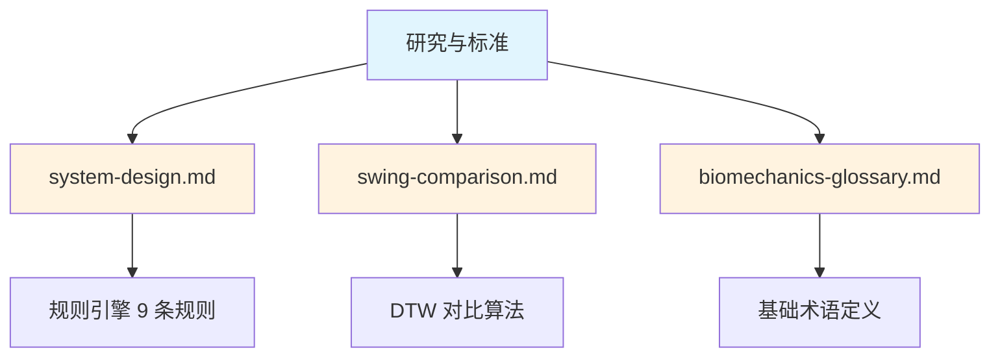

# 研究与标准 Research & Standards

> **文档目的**: 提供高尔夫挥杆分析的科学基础和研究验证的基准数据
>
> **价值**: 为 MVP 规则引擎提供学术支撑，确保分析指标有据可依

---

## 本节内容

| 文档 | 内容 | 用途 |
|------|------|------|
| [生物力学术语表](biomechanics-glossary.md) | 140+ 高尔夫生物力学术语定义 | 团队沟通标准、UI 翻译参考 |
| [生物力学基准值](biomechanics-benchmarks.md) | 职业/业余选手的研究验证基准 | 规则引擎阈值参考 |
| [传感器指标映射](sensor-metric-mapping.md) | 三模态系统可测量的指标 | 产品差异化定位 |
| [个性化规范](personalization-spec.md) | 按性别/年龄/体型调整阈值 | Phase 2+ 个性化功能 |

---

## 核心发现摘要

### 我们的独特优势

```text
┌─────────────────────────────────────────────────────────────────────┐
│  Vision + IMU + EMG 三模态系统独特能力                               │
├─────────────────────────────────────────────────────────────────────┤
│                                                                      │
│  ✅ 全身姿态 (Vision) - 所有竞品都有                                 │
│  ✅ 角速度/节奏 (IMU) - K-VEST/GEARS 有                              │
│  ✅✅ 肌肉激活检测 (EMG) - 无竞品具备                                │
│  ✅✅ 力量链验证 (EMG) - 无竞品具备                                  │
│  ✅✅ 疲劳检测 (EMG) - 无竞品具备                                    │
│                                                                      │
│  关键差异: EMG 让我们能回答 "为什么" 挥杆失败，而非仅仅 "什么" 错了  │
│                                                                      │
└─────────────────────────────────────────────────────────────────────┘
```

### 关键基准值速查

| 指标 | 业余 | 职业 | 我们的阈值 |
|------|------|------|-----------|
| **X-Factor** | 25-35° | 42-55° | >35° |
| **骨盆旋转速度** | 395°/s | 477°/s | - (Phase 2) |
| **节奏比** | 变化大 | 3:1 | 2.5-4.0 |
| **峰值角速度** | <1000°/s | 1500-2500°/s | >800°/s |
| **核心激活** | <50% | 60-80% | >50% |
| **运动链顺序** | 常错误 | 89% 正确 | 核心先于前臂 |

### 研究来源

本节内容基于以下权威来源:

- [TPI (Titleist Performance Institute)](https://www.mytpi.com) - 最大的高尔夫生物力学认证机构
- [Meister et al. (2011)](https://pubmed.ncbi.nlm.nih.gov/21844613/) - 职业挥杆基准研究
- [Cheetham et al.](https://www.philcheetham.com/) - 运动链顺序研究
- [PMC 系统性综述 (2022)](https://pmc.ncbi.nlm.nih.gov/articles/PMC9227529/) - 92 篇论文元分析

---

## 与其他文档的关系



| 文档 | 内容 | 本节提供 |
|------|------|---------|
| [系统设计](../system-design.md) | MVP 管道架构 | 规则阈值的科学依据 |
| [挥杆对比策略](../swing-comparison.md) | 四种对比方法 | 职业参考数据来源 |
| [术语表](biomechanics-glossary.md) | 生物力学术语 | 140+ 专业术语定义 |

---

## 使用建议

### 对于算法工程师

1. 先读 [术语表](biomechanics-glossary.md) 理解概念
2. 用 [基准值](biomechanics-benchmarks.md) 设置规则阈值
3. 参考 [传感器映射](sensor-metric-mapping.md) 确定可测量指标

### 对于产品经理

1. 用 [传感器映射](sensor-metric-mapping.md) 理解差异化优势
2. 用 [个性化规范](personalization-spec.md) 规划功能路线图

### 对于硬件工程师

1. 用 [传感器映射](sensor-metric-mapping.md) 理解采样率要求
2. 参考 [基准值](biomechanics-benchmarks.md) 中的数据采集说明

---

**最后更新**: 2025年12月17日
