# 评估模式

> **文档目的**: 定义三段式评估模式的延迟要求、触发条件和实现策略
>
> **核心洞察**: 不同评估模式有不同的延迟要求和反馈时机
>
---

## 1. 三段式评估设计

```text
┌─────────────────────────────────────────────────────────────────────────────┐
│                    THREE-STEP ASSESSMENT                                    │
├─────────────────────────────────────────────────────────────────────────────┤
│                                                                             │
│  Step 1: SETUP CHECK (站姿检查)                 延迟要求: <300ms               │
│  ─────────────────────────────────────────────────────────────────────────  │
│  用户静止准备 → 实时检测姿势 → 语音/视觉反馈                                      │
│  "肩膀有些紧张" / "站距偏窄"                                                    │
│                                                                             │
│  ⏱️ 用户有 2-5 秒反应时间 → 完全可行                                            │
│                                                                             │
├─────────────────────────────────────────────────────────────────────────────┤
│                                                                             │
│  Step 2: SLOW MOTION ANALYSIS (慢动作分析)      延迟要求: <500ms               │
│  ─────────────────────────────────────────────────────────────────────────  │
│  用户慢速挥杆 (1/4-1/2 速度) → 每阶段检测 → 阶段性反馈                            │
│  "肩膀转动幅度不够" / "手腕释放过早"                                             │
│                                                                             │
│  ⏱️ 慢动作挥杆 3-5 秒 → 有时间在每阶段给反馈                                     │
│                                                                             │
├─────────────────────────────────────────────────────────────────────────────┤
│                                                                             │
│  Step 3: FULL SPEED ANALYSIS (全速分析)         延迟要求: <500ms (挥杆后)       │
│  ─────────────────────────────────────────────────────────────────────────  │
│  正常速度挥杆 → 挥杆后即时分析 → 综合反馈                                         │
│  "节奏良好，核心发力时机偏晚"                                                    │
│                                                                             │
│  ⏱️ 挥杆只有 1.2 秒 → 只能事后反馈                                              │
│                                                                             │
└─────────────────────────────────────────────────────────────────────────────┘
```
---

## 2. Step 1: 站姿检查

### 2.1 设计原则

用户在挥杆前有 2-5 秒的准备时间，这是**最佳反馈窗口**：

- 用户静止，姿态稳定
- 有时间听取并调整
- 每次挥杆前都可以检查
- 这是教练最常做的事情

### 2.2 检测项目

| 检测项 | 传感器 | 阈值 | 反馈（客观描述） |
|-------|--------|-----|-----------------|
| 头部位置过高 | Vision | `nose.y < shoulder.y * 0.7` | "头部位置偏高" |
| 肩膀耸起 | Vision | `(shoulder.y - ear.y) < threshold` | "肩膀有些紧张" |
| 站距过窄 | Vision | `ankle_dist / shoulder_width < 0.9` | "站距偏窄" |
| 站距过宽 | Vision | `ankle_dist / shoulder_width > 1.3` | "站距偏宽" |
| 脊柱太直 | Vision | `spine_angle < 25°` | "上身较直" |
| 脊柱过弯 | Vision | `spine_angle > 45°` | "上身前倾较多" |
| 膝盖锁死 | Vision | `knee_angle > 175°` | "膝盖较直" |
| 重心偏移 | Vision | `hip_center.x` 偏离中心 | "重心偏左/右" |

!!! note "评估 vs 引导"
    评估模式只**告知问题**，不指导如何调整。用户自主决定是否修正。
    如需实时引导调整，请参考 [引导模式](guide-mode.md)。

### 2.3 实现代码

```python
class SetupChecker:
    """
    站姿实时检查器

    在用户准备挥杆时持续运行，检测并反馈姿态问题
    """

    def __init__(self, feedback_cooldown_ms=2000):
        self.feedback_cooldown = feedback_cooldown_ms
        self.last_feedback_time = {}

    def check_setup(self, landmarks, current_time):
        """
        检查站姿并返回需要反馈的问题

        Args:
            landmarks: MediaPipe 33 关键点
            current_time: 当前时间戳 (ms)

        Returns:
            issues: list of (issue_name, feedback_text, priority)
        """
        issues = []

        # 1. 检查头部位置
        if self._head_too_high(landmarks):
            issues.append(('head_high', '头部位置偏高', 2))

        # 2. 检查肩膀
        if self._shoulders_raised(landmarks):
            issues.append(('shoulders', '肩膀有些紧张', 2))

        # 3. 检查站距
        stance_ratio = self._get_stance_ratio(landmarks)
        if stance_ratio < 0.9:
            issues.append(('stance_narrow', '站距偏窄', 1))
        elif stance_ratio > 1.3:
            issues.append(('stance_wide', '站距偏宽', 1))

        # 4. 检查脊柱角度
        spine_angle = self._get_spine_angle(landmarks)
        if spine_angle < 25:
            issues.append(('spine_straight', '上身较直', 1))
        elif spine_angle > 45:
            issues.append(('spine_bent', '上身前倾较多', 1))

        # 5. 检查膝盖
        if self._knees_locked(landmarks):
            issues.append(('knees', '膝盖较直', 2))

        # 过滤冷却中的反馈
        filtered_issues = []
        for issue_name, text, priority in issues:
            last_time = self.last_feedback_time.get(issue_name, 0)
            if current_time - last_time > self.feedback_cooldown:
                filtered_issues.append((issue_name, text, priority))
                self.last_feedback_time[issue_name] = current_time

        # 按优先级排序，只返回最重要的 1-2 个
        filtered_issues.sort(key=lambda x: x[2])
        return filtered_issues[:2]

    def _get_stance_ratio(self, landmarks):
        """计算站距比例"""
        LEFT_ANKLE, RIGHT_ANKLE = 27, 28
        LEFT_SHOULDER, RIGHT_SHOULDER = 11, 12

        ankle_dist = np.linalg.norm(
            np.array([landmarks[LEFT_ANKLE].x, landmarks[LEFT_ANKLE].y]) -
            np.array([landmarks[RIGHT_ANKLE].x, landmarks[RIGHT_ANKLE].y])
        )
        shoulder_dist = np.linalg.norm(
            np.array([landmarks[LEFT_SHOULDER].x, landmarks[LEFT_SHOULDER].y]) -
            np.array([landmarks[RIGHT_SHOULDER].x, landmarks[RIGHT_SHOULDER].y])
        )

        return ankle_dist / shoulder_dist if shoulder_dist > 0 else 1.0

    def _get_spine_angle(self, landmarks):
        """计算脊柱前倾角度"""
        # 简化: 使用肩膀中点到髋部中点的角度
        LEFT_SHOULDER, RIGHT_SHOULDER = 11, 12
        LEFT_HIP, RIGHT_HIP = 23, 24

        shoulder_center = np.array([
            (landmarks[LEFT_SHOULDER].x + landmarks[RIGHT_SHOULDER].x) / 2,
            (landmarks[LEFT_SHOULDER].y + landmarks[RIGHT_SHOULDER].y) / 2
        ])
        hip_center = np.array([
            (landmarks[LEFT_HIP].x + landmarks[RIGHT_HIP].x) / 2,
            (landmarks[LEFT_HIP].y + landmarks[RIGHT_HIP].y) / 2
        ])

        # 计算与垂直线的夹角
        vertical = np.array([0, -1])
        spine_vec = shoulder_center - hip_center
        spine_vec_norm = spine_vec / np.linalg.norm(spine_vec)

        angle = np.arccos(np.dot(spine_vec_norm, vertical))
        return np.degrees(angle)

    def _head_too_high(self, landmarks):
        """检查头部是否过高"""
        NOSE = 0
        LEFT_SHOULDER, RIGHT_SHOULDER = 11, 12

        nose_y = landmarks[NOSE].y
        shoulder_y = (landmarks[LEFT_SHOULDER].y + landmarks[RIGHT_SHOULDER].y) / 2

        # 在归一化坐标中，y 越小表示越高
        return nose_y < shoulder_y * 0.7

    def _shoulders_raised(self, landmarks):
        """检查肩膀是否耸起"""
        LEFT_EAR, RIGHT_EAR = 7, 8
        LEFT_SHOULDER, RIGHT_SHOULDER = 11, 12

        ear_y = (landmarks[LEFT_EAR].y + landmarks[RIGHT_EAR].y) / 2
        shoulder_y = (landmarks[LEFT_SHOULDER].y + landmarks[RIGHT_SHOULDER].y) / 2

        # 肩膀和耳朵距离太近表示耸肩
        return (shoulder_y - ear_y) < 0.08  # 归一化坐标

    def _knees_locked(self, landmarks):
        """检查膝盖是否锁死"""
        # 简化: 检查膝盖是否几乎完全伸直
        LEFT_HIP, LEFT_KNEE, LEFT_ANKLE = 23, 25, 27

        hip = np.array([landmarks[LEFT_HIP].x, landmarks[LEFT_HIP].y])
        knee = np.array([landmarks[LEFT_KNEE].x, landmarks[LEFT_KNEE].y])
        ankle = np.array([landmarks[LEFT_ANKLE].x, landmarks[LEFT_ANKLE].y])

        # 计算膝盖角度
        vec1 = hip - knee
        vec2 = ankle - knee
        cos_angle = np.dot(vec1, vec2) / (np.linalg.norm(vec1) * np.linalg.norm(vec2))
        angle = np.degrees(np.arccos(np.clip(cos_angle, -1, 1)))

        return angle > 175
```

---

## 3. Step 2: 慢动作分析

### 3.1 设计原则

让用户以 1/4 或 1/2 速度练习，系统可以在每个阶段给出实时反馈。

```text
正常挥杆:  1.2 秒 (太快，无法实时反馈)
1/2 速度:  2.4 秒 (每阶段约 300ms，可以反馈)
1/4 速度:  4.8 秒 (每阶段约 600ms，充足反馈时间)
```

### 3.2 阶段性反馈设计

| 阶段 | 检测点 | 反馈内容 | 触发条件 |
|-----|-------|---------|---------|
| Address → Toe-Up | 起杆开始 | "好，慢慢起杆" | 检测到运动开始 |
| Toe-Up → Mid-Backswing | 手腕平行 | "继续转肩" | 手腕达到腰部高度 |
| Mid-Backswing → Top | 到顶点 | "转到位了" | 角速度接近零 |
| Top → Mid-Downswing | 下杆启动 | "从核心启动" | 检测到方向反转 |
| Mid-Downswing → Impact | 击球前 | "保持手腕" | 检测到加速 |
| Impact → Finish | 击球后 | "保持平衡" | 检测到击球 |

### 3.3 实现代码

```python
class SlowMotionCoach:
    """
    慢动作训练教练

    在用户慢速挥杆时，每个阶段给出引导反馈
    """

    PHASE_PROMPTS = {
        'address_start': '准备好了，慢慢起杆',
        'toe_up': '好，继续',
        'mid_backswing': '转肩，转肩',
        'top': '到顶了，准备下杆',
        'transition': '从核心启动',
        'mid_downswing': '保持手腕角度',
        'impact': '打到了！',
        'finish': '收杆，保持平衡',
    }

    def __init__(self, phase_detector, audio_player):
        self.phase_detector = phase_detector
        self.audio_player = audio_player
        self.current_phase = None
        self.phases_announced = set()

    def update(self, imu_data, vision_data, current_time):
        """
        每帧更新，检测阶段变化并给出反馈
        """
        # 检测当前阶段
        phases = self.phase_detector.detect_all_phases(imu_data, vision_data)

        new_phase = self._determine_current_phase(phases, current_time)

        if new_phase and new_phase != self.current_phase:
            if new_phase not in self.phases_announced:
                self._announce_phase(new_phase)
                self.phases_announced.add(new_phase)
            self.current_phase = new_phase

    def _announce_phase(self, phase):
        """播放阶段提示音"""
        prompt = self.PHASE_PROMPTS.get(phase)
        if prompt:
            self.audio_player.play(prompt)

    def reset(self):
        """重置状态，准备下一次挥杆"""
        self.current_phase = None
        self.phases_announced.clear()

    def _determine_current_phase(self, phases, current_time):
        """根据检测到的阶段时间确定当前阶段"""
        # 简化逻辑: 根据时间顺序判断
        if phases.get('finish') and current_time > phases['finish']:
            return 'finish'
        if phases.get('impact') and current_time > phases['impact']:
            return 'impact'
        if phases.get('top') and current_time > phases['top']:
            if current_time < phases['top'] + 200:
                return 'transition'
            return 'mid_downswing'
        if phases.get('address', {}).get('end') and current_time > phases['address']['end']:
            return 'mid_backswing'

        return 'address_start'
```

### 3.4 慢动作训练的核心价值

#### 3.4.1 还原真实高尔夫教学场景

慢动作训练（Mode 2）模拟了专业教练教学的核心环节：

| 真实教学场景 | Mode 2 实现 |
|------------|------------|
| 教练让你慢慢做，他在旁边看 | 系统实时监测每个阶段 |
| 教练在关键点喊"停，这里要发力" | 阶段性语音提示 |
| 教练说"对，就是这个感觉" | 正确模式确认反馈 |
| 反复练习直到形成肌肉记忆 | 重复训练 + 一致性追踪 |

#### 3.4.2 解决"知道但做不到"的问题

全速分析能告诉用户"核心发力太晚"，但用户下一杆还是一样——因为 1.2 秒的挥杆太快，来不及调整。

慢动作训练把动作拉长到 3-5 秒，用户可以在"下杆启动"的那个瞬间：
- 听到提示"从核心发力"
- 体会正确的发力感觉
- 重复 50 次建立肌肉记忆
- 全速挥杆时自动执行

#### 3.4.3 降低学习门槛

| 场景 | 没有 Mode 2 | 有 Mode 2 |
|-----|------------|----------|
| 初学者 | 全速打 → 反复出错 → 挫败放弃 | 慢练 → 逐步掌握 → 有成就感 |
| 技术纠正 | 知道问题但改不了 | 在慢动作中体会正确感觉 |
| 伤后恢复 | 不敢全速打 | 安全地重建动作模式 |

#### 3.4.4 与全速分析建立训练闭环

慢动作训练（Mode 2）和全速分析（Mode 3）共同构建了**验证 → 反馈 → 训练 → 实战**的完整学习闭环：

```text
┌─────────────────────────────────────────────────────────────┐
│              验证 → 反馈 → 训练 → 实战 闭环                    │
├─────────────────────────────────────────────────────────────┤
│                                                             │
│   ┌──────────────┐                    ┌──────────────┐      │
│   │    实战       │                    │     反馈     │      │
│   │  Mode 3 全速  │ ─── 发现问题 ────▶  │ "核心发力晚"  │      │
│   └──────────────┘                    └──────┬───────┘      │
│          ▲                                   │              │
│          │                                   ▼              │
│   ┌──────┴───────┐                    ┌──────────────┐      │
│   │    验证       │                    │    训练      │      │
│   │ "问题解决了"   │ ◀─── 建立记忆 ────  │ Mode 2 慢练   │      │
│   └──────────────┘                    └──────────────┘      │
│                                                             │
└─────────────────────────────────────────────────────────────┘
```

**四个环节**：

| 环节 | Mode | 作用 | 说明 |
|-----|------|------|------|
| **实战** | Mode 3 | 全速挥杆 | 真实表现，暴露问题 |
| **反馈** | Mode 3 | 诊断分析 | 告诉用户"哪里错了" |
| **训练** | Mode 2 | 慢动作纠正 | 在过程中体会"怎么做对" |
| **验证** | Mode 3 | 检验迁移 | 确认训练效果是否保持 |

**闭环运转示例**：

1. **实战**：用户全速挥杆
2. **反馈**：系统诊断"核心发力太晚"
3. **训练**：切换慢动作模式，在下杆启动阶段实时提示"从核心发力"，重复练习建立肌肉记忆
4. **验证**：回到全速挥杆，确认问题是否解决
5. **循环**：如果问题解决则进入下一个改进点，否则继续训练

!!! tip "一句话总结"
    Mode 2 是让用户**真正学会**的关键——不只是看到问题，而是在过程中体会正确的感觉，并通过 Mode 3 验证学习效果。

---

## 4. Step 3: 全速分析

### 4.1 设计原则

正常速度挥杆时，系统只能在**挥杆结束后**提供反馈。但反馈要足够快 (<500ms)，让用户在下一次挥杆前能消化。

### 4.2 反馈优先级

```text
┌─────────────────────────────────────────────────────────────────────────────┐
│                    FEEDBACK PRIORITY (POST-SWING)                           │
├─────────────────────────────────────────────────────────────────────────────┤
│                                                                             │
│  P0 (立即说): 严重问题，影响挥杆质量                                             │
│  ─────────────────────────────────────────────────────────────────────────  │
│  • 发力顺序错误 (EMG: 手臂先于核心) → "从核心启动"                                │
│  • 运动链断裂 (EMG: 核心激活不足) → "收紧腹部发力"                                │
│                                                                             │
│  P1 (其次): 重要问题，影响表现                                                  │
│  ─────────────────────────────────────────────────────────────────────────  │
│  • X-Factor 不足 → "肩膀再多转一点"                                            │
│  • 节奏过快 → "上杆慢一点"                                                     │
│  • 速度不足 → "再用力一些"                                                     │
│                                                                             │
│  P2 (最后): 优化建议，锦上添花                                                  │
│  ─────────────────────────────────────────────────────────────────────────  │
│  • 收杆平衡问题 → "注意收杆平衡"                                                │
│  • 细节调整 → 可以不说，留待详细分析                                             │
│                                                                             │
└─────────────────────────────────────────────────────────────────────────────┘
```

### 4.3 实现代码

```python
class PostSwingFeedback:
    """
    挥杆后即时反馈生成器

    在挥杆结束后 <500ms 内生成并播放反馈
    """

    def __init__(self, audio_player):
        self.audio_player = audio_player

    def generate_feedback(self, swing_analysis):
        """
        生成优先级排序的反馈

        Args:
            swing_analysis: dict with vision, imu, emg features and scores

        Returns:
            feedback_list: list of (priority, text, audio_file)
        """
        feedbacks = []

        # P0: EMG 独特洞察 (最高优先级)
        if swing_analysis.get('emg'):
            emg = swing_analysis['emg']

            if not emg.get('activation_sequence_correct', True):
                feedbacks.append((
                    0,
                    '发力顺序错了，从核心启动',
                    'core_first.mp3'
                ))

            if emg.get('core_activation', 100) < 50:
                feedbacks.append((
                    0,
                    '核心发力不够，收紧腹部',
                    'engage_core.mp3'
                ))

        # P1: Vision + IMU 分析
        vision = swing_analysis.get('vision', {})
        imu = swing_analysis.get('imu', {})

        if vision.get('x_factor', 100) < 35:
            feedbacks.append((
                1,
                '肩膀转不够，X因子只有{:.0f}度'.format(vision['x_factor']),
                'more_rotation.mp3'
            ))

        if imu.get('tempo_ratio', 3) < 2.5:
            feedbacks.append((
                1,
                '节奏太快，上杆慢一点',
                'slow_backswing.mp3'
            ))
        elif imu.get('tempo_ratio', 3) > 4.0:
            feedbacks.append((
                1,
                '节奏太慢，可以再流畅一些',
                'smoother_tempo.mp3'
            ))

        if imu.get('peak_angular_velocity', 1000) < 800:
            feedbacks.append((
                1,
                '速度不够，再用力一些',
                'more_power.mp3'
            ))

        # P2: 优化建议
        score = swing_analysis.get('score', 100)
        if score >= 80:
            feedbacks.append((
                2,
                '这一杆不错，{:.0f}分'.format(score),
                'good_swing.mp3'
            ))

        # 排序并返回前 2 个
        feedbacks.sort(key=lambda x: x[0])
        return feedbacks[:2]

    def play_feedback(self, feedbacks):
        """播放反馈"""
        for priority, text, audio_file in feedbacks:
            self.audio_player.play(audio_file)
            # 等待播放完成再说下一条
            break  # 只说最重要的一条
```

---

## 5. 反馈通道

反馈通道是指系统向用户传递信息的**形式**，与分析模式（场景 1/2/3）是正交的两个维度。

| 反馈通道 | 延迟 | 适用场景 | 优势 | 局限 |
|---------|------|---------|------|------|
| **语音反馈** | 50-100ms | 所有场景 | 信息量大，无需看屏幕 | 需要安静环境 |
| **视觉反馈** | <20ms | 所有场景 | 精确展示位置/角度 | 用户需看屏幕 |
| **触觉反馈** | <50ms | 慢动作训练 | 唯一能实时干预的方式 | 信息量有限 |

### 5.1 语音反馈

**预录制语音文件**

| 类别 | 文件名 | 文案 | 时长 |
|-----|-------|------|------|
| **核心问题 (P0)** | `core_first.mp3` | "从核心启动" | ~1s |
| | `engage_core.mp3` | "收紧腹部发力" | ~1.2s |
| | `sequence_wrong.mp3` | "发力顺序错了" | ~1s |
| **旋转问题 (P1)** | `more_rotation.mp3` | "肩膀再多转一点" | ~1.2s |
| | `hip_lead.mp3` | "髋部先转开" | ~1s |
| **节奏问题 (P1)** | `slow_backswing.mp3` | "上杆慢一点" | ~1s |
| | `faster_downswing.mp3` | "下杆再快一点" | ~1s |
| | `good_tempo.mp3` | "节奏不错" | ~0.8s |
| **站姿问题** | `shoulders_tense.mp3` | "肩膀有些紧张" | ~1s |
| | `stance_narrow.mp3` | "站距偏窄" | ~0.8s |
| | `knees_straight.mp3` | "膝盖较直" | ~0.8s |
| **正面反馈** | `good_swing.mp3` | "这一杆不错" | ~1s |
| | `great_power.mp3` | "力量很好" | ~0.8s |
| | `perfect.mp3` | "完美！" | ~0.6s |

**TTS 动态生成**

对于需要包含数据的反馈（如具体分数、角度），使用 TTS 动态生成：

```swift
import AVFoundation  // iOS 原生 TTS

class FeedbackSpeaker {
    private let synthesizer = AVSpeechSynthesizer()

    /// 动态生成语音反馈
    /// - Examples:
    ///   - generateFeedback("X因子\(xFactor)度，不够")
    ///   - generateFeedback("速度\(speed)，很不错")
    func generateFeedback(_ text: String, rate: Float = 0.5) {
        let utterance = AVSpeechUtterance(string: text)
        utterance.voice = AVSpeechSynthesisVoice(language: "zh-CN")
        utterance.rate = rate
        synthesizer.speak(utterance)
    }
}
```

### 5.2 触觉反馈

触觉反馈 (<50ms 延迟) 是唯一能在挥杆过程中实时干预的方式。

**硬件依赖**

触觉反馈需要**振动输出设备**，不是输入传感器：

| 设备 | 说明 | 优劣 |
|-----|------|------|
| **Apple Watch** | 通过 WatchKit 触发振动 | ✅ 贴近身体，感知明确；❌ 需额外开发 watchOS App |
| **iPhone Taptic Engine** | 通过 Core Haptics 控制 | ⚠️ 用户打球时不握手机，实用性有限 |
| **自定义可穿戴** | 手环/腰带上的振动马达 | ✅ 位置灵活；❌ 需要硬件开发 |

!!! note "MVP 不包含触觉反馈"
    触觉反馈需要额外硬件支持，列入 Post-MVP 阶段。

**振动模式**

| 模式 | 振动时长 | 含义 | 触发条件 |
|-----|---------|-----|---------|
| 短振 (50ms) | 1次 | 轻微提示 | 接近阈值边界 |
| 短振 (50ms) | 2次 | 需要注意 | 超出阈值 |
| 长振 (200ms) | 1次 | 严重问题 | 严重超出阈值 |
| 连续振 | 持续 | 停止动作 | 危险动作 |

**应用场景**

| 场景 | 触发条件 | 振动模式 |
|-----|---------|---------|
| 上杆过快 | 上杆时间 < 500ms | 短振 2次 |
| 上杆顶点不够 | X-Factor < 20° | 短振 1次 |
| 下杆过早释放 | 手腕角度过早变化 | 短振 2次 |
| 疲劳预警 | EMG 激活强度下降 30% | 长振 1次 |

### 5.3 分析模式 × 反馈通道

| 分析模式 | 语音反馈 | 视觉反馈 | 触觉反馈 |
|---------|---------|---------|---------|
| **Step 1: 站姿检查** | ✅ 主要 | ✅ 辅助 | ❌ 不适用 |
| **Step 2: 慢动作分析** | ✅ 主要 | ✅ 辅助 | ✅ 可选 |
| **Step 3: 全速分析** | ✅ 辅助 | ✅ 主要（事后回放） | ❌ 太快无法干预 |

---

## 6. 延迟预算

**延迟预算(Latency Budget)**是指：从用户做动作到系统给出反馈，整个过程需要多长时间，每个环节各分配多少时间。

就像做项目有时间预算一样，每个环节分配固定时间，不能超支。

**举例**：用户站好准备挥杆，系统要说"放松肩膀"：

```text
用户做动作 → 摄像头拍到 → 分析姿势 → 判断问题 → 播放语音 → 用户听到
            ↓            ↓          ↓          ↓
           33ms        30ms        5ms      100ms

           总共 = 33 + 30 + 5 + 100 = 约 170ms (0.17秒)
```

### 6.1 端到端延迟分解

```text
┌─────────────────────────────────────────────────────────────────────────────┐
│                    END-TO-END LATENCY BREAKDOWN                             │
├─────────────────────────────────────────────────────────────────────────────┤
│                                                                             │
│  传感器采集         特征提取          规则判断          反馈生成                  │
│  ────────────     ───────────      ──────────       ──────────              │
│                                                                             │
│  Vision: 33ms     MediaPipe: 30ms  规则引擎: <5ms   语音TTS: 50-100ms         │
│  IMU: <10ms       特征计算: <10ms                   视觉叠加: <20ms            │
│  EMG: <5ms        时间同步: <5ms                    触觉振动: <10ms            │
│                                                                             │
│  ────────────────────────────────────────────────────────────────────────── │
│                                                                             │
│  延迟预算:    33 + 30 + 5 + 100 = ~170ms                                     │
└─────────────────────────────────────────────────────────────────────────────┘
```

### 6.2 各场景延迟要求

| 场景 | 延迟要求 | 敏感环节 | 原因 | 优化策略 |
|-----|---------|---------|------|---------|
| Setup Check | <300ms | TTS 生成 | 用户静止等待，语音是主要反馈方式，TTS 占总延迟 60% | 预缓存常用语音 |
| Slow Motion | <500ms | Vision 帧率 | 需要追踪连续动作，30fps 每帧 33ms 会累积误差 | 提高到 60fps |
| Full Speed | <500ms (挥杆后) | 分析复杂度 | 挥杆后需综合多指标判断，规则越多耗时越长 | 规则引擎优先 |

---

## 7. 实施路线图

> 📐 **详细规格**: 完整的 MVP 开发阶段见 [MVP 开发计划](../architecture/mvp-plan.md)

| 阶段 | 内容 | 优先级 | 说明 |
|------|------|--------|------|
| **MVP** | Step 3: 全速分析 + 挥杆后反馈 | 🔴 必须 | MVP 核心功能 |
| **Post-MVP** | Step 1: 站姿检查 | 🟡 高 | 需要静态姿态检测 |
| **Post-MVP** | Step 2: 慢动作分析 | 🟡 高 | 实时处理复杂度高 |
| **Post-MVP** | 触觉振动反馈 | 🟡 中 | 需要 Apple Watch 联动 |
| **Post-MVP** | LLM 个性化反馈 | 🟢 可选 | 按用户特征定制 |

!!! info "为什么 MVP 只做 Step 3?"
    1. **无实时约束** — 可以反复回放同一录制，逐帧调试
    2. **完整数据** — 录制完成后数据完整，不会丢帧
    3. **优先验证核心价值** — 时间对齐是否正确比实时性更重要

---

---

## 8. 与其他文档的关系

```mermaid
graph TD
    A[three-step-assessment.md] --> B[system-design.md]
    A --> C[eight-swing-phases.md]
    A --> D[research/biomechanics-benchmarks.md]

    B --> E[规则引擎]
    C --> F[阶段检测]
    D --> G[阈值参考]

    style A fill:#e1f5fe
```



| 相关文档 | 内容 | 本文档使用 |
|---------|------|-----------|
| [系统架构](../architecture/system-design.md) | MVP 管道架构 | 规则引擎阈值 |
| [八个挥杆阶段](eight-swing-phases.md) | 阶段检测 | 阶段触发点 |
| [生物力学基准](../../prerequisites/foundations/biomechanics-benchmarks.md) | 指标阈值 | 问题判断标准 |
| [传感器映射](../architecture/sensor-data-processing.md) | 传感器能力 | 检测方法选择 |

**最后更新**: 2026-01-05
**维护者**: Movement Chain AI Team
