# 评估模式

> **文档目的**: 定义三段式评估模式的流程设计和评估报告生成
>
> **核心原则**: 评估过程只反馈流程提示，问题描述汇总在评估报告中
>
---

## 1.  三段式评估设计

```text
┌─────────────────────────────────────────────────────────────────────────────┐
│                    THREE-STEP ASSESSMENT                                    │
├─────────────────────────────────────────────────────────────────────────────┤
│                                                                             │
│  Step 1: SETUP CHECK (站姿检查)                                              │
│  ─────────────────────────────────────────────────────────────────────────  │
│  系统: "请站好，保持准备姿势"                                                   │
│  (静默采集数据)                                                               │
│  系统: "好的，站姿检查完成"                                                     │
│                                                                             │
├─────────────────────────────────────────────────────────────────────────────┤
│                                                                             │
│  Step 2: SLOW MOTION CHECK (慢动作检查)                                       │
│  ─────────────────────────────────────────────────────────────────────────  │
│  系统: "现在请慢速挥杆一次，大约 3-4 秒完成"                                      │
│  (静默采集数据)                                                               │
│  系统: "好的，慢动作检查完成"                                                   │
│                                                                             │
├─────────────────────────────────────────────────────────────────────────────┤
│                                                                             │
│  Step 3: FULL SPEED CHECK (全速检查)                                         │
│  ─────────────────────────────────────────────────────────────────────────  │
│  系统: "最后，请正常速度挥杆"                                                   │
│  (静默采集数据)                                                               │
│  系统: "评估完成，正在生成报告..."                                              │
│                                                                             │
├─────────────────────────────────────────────────────────────────────────────┤
│                                                                             │
│  📋 ASSESSMENT REPORT (评估报告)                                             │
│  ─────────────────────────────────────────────────────────────────────────  │
│                                                                             │
│  🎬 视频回放                         🔊 语音讲解                               │
│  ┌─────────────────────────┐        "这是你的上杆顶点位置，                     │
│  │    [挥杆视频回放]         │        可以看到肩膀转动了 32 度，                  │
│  │      ● 问题标注点         │        职业球员通常会转到 45 度以上..."            │
│  │  ▶━━━━●━━━━━━━━━━━━━━━━ │                                                │
│  │  [0.25x] [0.5x] [1x]    │        📝 问题列表 + 改进建议 + 推荐练习           │
│  └─────────────────────────┘                                                │
│                                                                             │
└─────────────────────────────────────────────────────────────────────────────┘
```

---

## 2. Step 1: 站姿检查

### 2.1 流程设计

```text
用户进入评估模式
    ↓
系统: "请站好，保持你平时的准备姿势"
    ↓
等待用户静止 (检测到稳定姿态)
    ↓
静默采集数据 (2-3 秒)
    ↓
系统: "好的，站姿检查完成，接下来进行慢动作检查"
```

### 2.2 检测项目

| 检测项 | 传感器 | 阈值 | 报告描述 |
|-------|--------|-----|---------|
| 头部位置过高 | Vision | `nose.y < shoulder.y * 0.7` | 头部位置偏高 |
| 肩膀耸起 | Vision | `(shoulder.y - ear.y) < threshold` | 肩膀紧张 |
| 站距过窄 | Vision | `ankle_dist / shoulder_width < 0.9` | 站距偏窄 |
| 站距过宽 | Vision | `ankle_dist / shoulder_width > 1.3` | 站距偏宽 |
| 脊柱太直 | Vision | `spine_angle < 25°` | 上身较直 |
| 脊柱过弯 | Vision | `spine_angle > 45°` | 上身前倾过多 |
| 膝盖锁死 | Vision | `knee_angle > 175°` | 膝盖未弯曲 |
| 重心偏移 | Vision | `hip_center.x` 偏离中心 | 重心偏左/右 |

### 2.3 实现代码

```python
class SetupAssessment:
    """
    站姿评估器

    静默采集站姿数据，问题汇总到评估报告
    """

    def __init__(self):
        self.issues = []
        self.measurements = {}

    def assess(self, landmarks_sequence):
        """
        评估站姿

        Args:
            landmarks_sequence: 2-3 秒内采集的关键点序列

        Returns:
            SetupAssessmentResult: 站姿评估结果
        """
        # 取稳定帧的平均值
        avg_landmarks = self._average_landmarks(landmarks_sequence)

        # 检测各项指标
        self._check_head_position(avg_landmarks)
        self._check_shoulders(avg_landmarks)
        self._check_stance_width(avg_landmarks)
        self._check_spine_angle(avg_landmarks)
        self._check_knee_angle(avg_landmarks)
        self._check_weight_distribution(avg_landmarks)

        return SetupAssessmentResult(
            issues=self.issues,
            measurements=self.measurements
        )

    def _check_stance_width(self, landmarks):
        """检测站距"""
        ratio = self._get_stance_ratio(landmarks)
        self.measurements['stance_ratio'] = ratio

        if ratio < 0.9:
            self.issues.append({
                'category': 'setup',
                'item': 'stance_width',
                'severity': 'medium',
                'description': '站距偏窄',
                'value': f'{ratio:.2f}',
                'benchmark': '0.9-1.3'
            })
        elif ratio > 1.3:
            self.issues.append({
                'category': 'setup',
                'item': 'stance_width',
                'severity': 'medium',
                'description': '站距偏宽',
                'value': f'{ratio:.2f}',
                'benchmark': '0.9-1.3'
            })

    # ... 其他检测方法类似
```

---

## 3. Step 2: 慢动作检查

### 3.1 流程设计

```text
系统: "现在请慢速挥杆一次，大约 3-4 秒完成整个动作"
    ↓
等待用户开始动作 (检测到运动启动)
    ↓
静默采集各阶段数据
    ↓
检测到动作结束
    ↓
系统: "好的，慢动作检查完成，最后进行全速挥杆"
```

### 3.2 检测项目

| 阶段 | 检测项 | 传感器 | 报告描述 |
|-----|-------|--------|---------|
| Address → Toe-Up | 起杆路径 | Vision | 起杆路径偏内/外 |
| Toe-Up → Mid-Backswing | 手臂位置 | Vision | 手肘未保持贴近身体 |
| Mid-Backswing → Top | 肩膀转动 | Vision + IMU | 上杆转肩不足 (X-Factor: XX°) |
| Top | 顶点位置 | Vision | 上杆未到位 |
| Top → Mid-Downswing | 启动顺序 | EMG | 下杆启动顺序错误 |
| Mid-Downswing → Impact | 手腕释放 | Vision | 手腕过早释放 |

### 3.3 实现代码

```python
class SlowMotionAssessment:
    """
    慢动作评估器

    分析慢速挥杆的各阶段动作质量
    """

    def __init__(self, phase_detector):
        self.phase_detector = phase_detector
        self.phase_data = {}
        self.issues = []

    def assess(self, swing_data):
        """
        评估慢动作挥杆

        Args:
            swing_data: 包含 vision, imu, emg 数据的挥杆记录

        Returns:
            SlowMotionAssessmentResult: 慢动作评估结果
        """
        # 检测各阶段
        phases = self.phase_detector.detect_all_phases(swing_data)

        # 分析各阶段
        self._analyze_takeaway(swing_data, phases)
        self._analyze_backswing(swing_data, phases)
        self._analyze_top_position(swing_data, phases)
        self._analyze_transition(swing_data, phases)
        self._analyze_downswing(swing_data, phases)

        return SlowMotionAssessmentResult(
            phases=phases,
            issues=self.issues,
            phase_data=self.phase_data
        )

    def _analyze_transition(self, swing_data, phases):
        """分析转换阶段的启动顺序"""
        if swing_data.get('emg'):
            emg = swing_data['emg']
            # 检查核心是否先于手臂激活
            core_activation_time = emg.get('core_onset')
            arm_activation_time = emg.get('arm_onset')

            if core_activation_time and arm_activation_time:
                if arm_activation_time < core_activation_time:
                    self.issues.append({
                        'category': 'transition',
                        'item': 'activation_sequence',
                        'severity': 'high',
                        'description': '下杆启动顺序错误（手臂先于核心）',
                        'recommendation': '应从核心/髋部先启动下杆'
                    })
```

---

## 4. Step 3: 全速检查

### 4.1 流程设计

```text
系统: "最后，请用你正常的速度挥杆"
    ↓
等待用户开始动作
    ↓
静默采集全速挥杆数据
    ↓
检测到动作结束
    ↓
系统: "评估完成，正在生成报告..."
    ↓
生成并展示评估报告
```

### 4.2 检测项目

| 类别 | 检测项 | 传感器 | 报告描述 |
|-----|-------|--------|---------|
| **发力** | 发力顺序 | EMG | 发力顺序正确/错误 |
| | 核心激活 | EMG | 核心激活充分/不足 |
| | 峰值速度 | IMU | 杆头速度 XX mph |
| **节奏** | 上杆/下杆比例 | IMU | 节奏比例 X:1 (理想 3:1) |
| | 总时长 | IMU | 挥杆时长 X.X 秒 |
| **旋转** | X-Factor | Vision | 肩髋分离角度 XX° |
| | 肩膀转动 | Vision | 肩膀转动 XX° |
| **平衡** | 收杆稳定性 | Vision + IMU | 收杆平衡良好/不稳 |

---

## 5. 评估报告

### 5.1 视频回放与语音讲解

评估报告的核心交互是**视频回放 + 语音讲解**，让用户直观理解自己的问题。

```text
┌─────────────────────────────────────────────────────────────────────────────┐
│                    VIDEO PLAYBACK + VOICE NARRATION                         │
├─────────────────────────────────────────────────────────────────────────────┤
│                                                                             │
│  ┌───────────────────────────────────────────────────────────────────────┐  │
│  │                                                                       │  │
│  │                     [挥杆视频回放区域]                                   │  │
│  │                                                                       │  │
│  │     ┌─────┐                                                           │  │
│  │     │ 🟢  │ ← 问题标注 (高亮显示问题时刻)                                 │  │
│  │     └─────┘                                                           │  │
│  │                                                                       │  │
│  │  ▶ ━━━━━━━━━━━━━━━━●━━━━━━━━━━━━━━━━━━━━━━━━━━━━━━━━━━━━━━━━━━━━━━━━  │  │
│  │  0:00                 ↑ 问题点                                 1:20    │  │
│  │                                                                       │  │
│  └───────────────────────────────────────────────────────────────────────┘  │
│                                                                             │
│  🔊 语音讲解:                                                                │
│  "这是你的上杆顶点位置。可以看到你的肩膀转动了 32 度，                              │
│   职业球员通常会转到 45 度以上。这会限制你的力量储备..."                            │
│                                                                             │
│  ─────────────────────────────────────────────────────────────────────────  │
│                                                                             │
│  播放控制:                                                                   │
│  [◀ 上一问题]  [▶ 播放/暂停]  [下一问题 ▶]  [🔄 0.5x / 1x / 2x]                 │
│                                                                             │
└─────────────────────────────────────────────────────────────────────────────┘
```

**回放模式**

| 模式 | 说明 | 使用场景 |
|-----|------|---------|
| **问题导航** | 按问题列表跳转到对应时间点 | 快速定位每个问题 |
| **阶段回放** | 按 8 个挥杆阶段逐段回放 | 理解完整动作流程 |
| **对比回放** | 左右分屏，用户 vs 基准 | 直观对比差距 |
| **慢放** | 0.25x / 0.5x 慢速播放 | 仔细观察细节 |

**语音讲解内容**

| 讲解类型 | 内容 | 示例 |
|---------|------|------|
| **问题描述** | 客观描述检测到的问题 | "你的站距比标准偏窄" |
| **数据对比** | 你的数值 vs 基准数值 | "你的值是 0.85，标准是 0.9-1.3" |
| **影响说明** | 这个问题会造成什么影响 | "这会影响你的旋转幅度" |
| **改进建议** | 怎么改进 | "试着把脚再分开一点" |

**实现代码**

```python
class VideoPlaybackNarrator:
    """
    视频回放语音讲解器

    配合视频回放生成语音讲解
    """

    def __init__(self, tts_engine):
        self.tts_engine = tts_engine
        self.narration_scripts = {}

    def generate_narration(self, issue, video_timestamp):
        """
        为问题生成语音讲解脚本

        Args:
            issue: 问题描述
            video_timestamp: 视频中的问题时间点

        Returns:
            NarrationScript: 讲解脚本
        """
        script = self._build_script(issue)
        audio = self.tts_engine.synthesize(script)

        return NarrationScript(
            timestamp=video_timestamp,
            text=script,
            audio=audio,
            duration=len(audio) / self.tts_engine.sample_rate
        )

    def _build_script(self, issue):
        """构建讲解脚本"""
        parts = []

        # 1. 问题描述
        parts.append(f"这里检测到{issue['description']}。")

        # 2. 数据对比 (如果有)
        if issue.get('value') and issue.get('benchmark'):
            parts.append(
                f"你的测量值是 {issue['value']}，"
                f"标准范围是 {issue['benchmark']}。"
            )

        # 3. 影响说明 (如果有)
        if issue.get('impact'):
            parts.append(issue['impact'])

        # 4. 改进建议
        if issue.get('recommendation'):
            parts.append(issue['recommendation'])

        return " ".join(parts)


class VideoPlaybackController:
    """
    视频回放控制器

    协调视频播放与语音讲解的同步
    """

    def __init__(self, video_player, narrator):
        self.video_player = video_player
        self.narrator = narrator
        self.issue_markers = []

    def load_assessment(self, video_path, assessment_result):
        """
        加载评估结果，准备回放

        Args:
            video_path: 录制的视频路径
            assessment_result: 评估结果
        """
        self.video_player.load(video_path)

        # 为每个问题生成标记点和语音
        for issue in assessment_result.all_issues:
            marker = IssueMarker(
                timestamp=issue['video_timestamp'],
                issue=issue,
                narration=self.narrator.generate_narration(
                    issue,
                    issue['video_timestamp']
                )
            )
            self.issue_markers.append(marker)

    def navigate_to_issue(self, issue_index):
        """跳转到指定问题"""
        marker = self.issue_markers[issue_index]
        self.video_player.seek(marker.timestamp)
        self.video_player.play()
        marker.narration.play()

    def play_all_issues(self):
        """按顺序播放所有问题讲解"""
        for marker in self.issue_markers:
            self.navigate_to_issue(marker)
            # 等待讲解完成
            time.sleep(marker.narration.duration + 1)
```

---

### 5.2 报告结构

```text
┌─────────────────────────────────────────────────────────────────────────────┐
│                         评估报告                                             │
│                    Assessment Report                                        │
├─────────────────────────────────────────────────────────────────────────────┤
│  评估时间: 2026-01-06 14:30                                                  │
│  评估类型: 完整三段式评估                                                       │
├─────────────────────────────────────────────────────────────────────────────┤
│                                                                             │
│  📊 总体评分: 72/100                                                         │
│                                                                             │
│  💬 总体评价                                                                  │
│  ───────────                                                                │
│  "整体动作框架不错！收杆平衡稳定，杆头速度也达到了 85 mph，                         │
│   说明你的基本功扎实。接下来我们重点改进发力顺序，                                  │
│   这会帮助你进一步提升击球距离。"                                                │
│                                                                             │
│  ─────────────────────────────────────────────────────────────────────────  │
│                                                                             │
│  ✅ 表现良好                                                                  │
│  ───────────                                                                │
│  • 收杆平衡稳定                                                               │
│  • 杆头速度良好 (85 mph)                                                      │
│  • 膝盖弯曲适度                                                               │
│                                                                             │
│  ─────────────────────────────────────────────────────────────────────────  │
│                                                                             │
│  🔴 需要优先改进 (高优先级)                                                     │
│  ───────────────────────────                                                │
│  1. 发力顺序错误                                                              │
│     问题: 下杆时手臂先于核心启动                                                 │
│     影响: 影响力量传导，降低杆头速度                                             │
│     建议: 练习骨盆先行动作                                                      │
│     推荐练习: → 骨盆旋转 Drill                                                 │
│                                                                             │
│  2. 站距偏窄                                                                  │
│     测量值: 0.85 (基准: 0.9-1.3)                                              │
│     影响: 影响旋转幅度和平衡稳定性                                               │
│     建议: 站距与肩同宽或略宽                                                    │
│                                                                             │
│  ─────────────────────────────────────────────────────────────────────────  │
│                                                                             │
│  🟡 可以改进 (中优先级)                                                        │
│  ─────────────────────                                                      │
│  3. X-Factor 不足                                                            │
│     测量值: 32° (职业基准: 45-55°)                                            │
│     影响: 限制力量储备                                                         │
│     建议: 增加肩髋分离角度                                                      │
│     推荐练习: → 分离转体 Drill                                                 │
│                                                                             │
│  4. 上杆节奏偏快                                                              │
│     测量值: 比例 2.2:1 (理想: 3:1)                                            │
│     影响: 上杆过快容易导致顶点位置不稳定                                          │
│     建议: 上杆时数"1-2-3"，下杆时数"1"                                          │
│     推荐练习: → 节奏训练 Drill                                                 │
│                                                                             │
│  ─────────────────────────────────────────────────────────────────────────  │
│                                                                             │
│  📈 下一步建议                                                                │
│  ─────────────                                                              │
│  1. 进入练习模式，完成推荐的练习                                                 │
│  2. 进入引导模式，在慢动作中体会正确发力顺序                                       │
│  3. 一周后再次评估，验证改进效果                                                 │
│                                                                             │
└─────────────────────────────────────────────────────────────────────────────┘
```

### 5.2 报告生成代码

```python
class AssessmentReportGenerator:
    """
    评估报告生成器

    综合三个阶段的评估结果，生成完整诊断报告
    """

    def __init__(self, drill_recommender):
        self.drill_recommender = drill_recommender

    def generate(self, setup_result, slow_motion_result, full_speed_result):
        """
        生成评估报告

        Args:
            setup_result: 站姿评估结果
            slow_motion_result: 慢动作评估结果
            full_speed_result: 全速评估结果

        Returns:
            AssessmentReport: 完整评估报告
        """
        # 汇总所有问题
        all_issues = (
            setup_result.issues +
            slow_motion_result.issues +
            full_speed_result.issues
        )

        # 去重和优先级排序
        prioritized_issues = self._prioritize_issues(all_issues)

        # 识别表现良好的方面
        strengths = self._identify_strengths(
            setup_result, slow_motion_result, full_speed_result
        )

        # 生成改进建议
        recommendations = self._generate_recommendations(prioritized_issues)

        # 推荐练习
        recommended_drills = self.drill_recommender.recommend(
            prioritized_issues[:3]  # 针对前 3 个主要问题
        )

        # 计算总分
        score = self._calculate_score(
            setup_result, slow_motion_result, full_speed_result
        )

        return AssessmentReport(
            timestamp=datetime.now(),
            score=score,
            high_priority_issues=[i for i in prioritized_issues if i['severity'] == 'high'],
            medium_priority_issues=[i for i in prioritized_issues if i['severity'] == 'medium'],
            strengths=strengths,
            recommendations=recommendations,
            recommended_drills=recommended_drills
        )

    def _prioritize_issues(self, issues):
        """问题优先级排序"""
        severity_order = {'high': 0, 'medium': 1, 'low': 2}
        return sorted(issues, key=lambda x: severity_order.get(x['severity'], 3))

    def _calculate_score(self, setup, slow_motion, full_speed):
        """计算综合评分"""
        # 基础分 100，每个问题扣分
        score = 100

        all_issues = setup.issues + slow_motion.issues + full_speed.issues

        for issue in all_issues:
            if issue['severity'] == 'high':
                score -= 15
            elif issue['severity'] == 'medium':
                score -= 8
            else:
                score -= 3

        return max(0, score)
```

---

## 6. 与其他模式的配合

评估模式是训练闭环的**起点和终点**：

```text
┌─────────────────────────────────────────────────────────────────────────────┐
│                    完整训练闭环                                               │
├─────────────────────────────────────────────────────────────────────────────┤
│                                                                             │
│   ┌──────────────┐                                                          │
│   │  1. 评估模式  │                                                          │
│   │   生成报告    │ ─── 诊断问题 ───▶ "核心发力顺序错误"                         │
│   └──────────────┘                                                          │
│          ▲                                    │                             │
│          │                                    ▼                             │
│   ┌──────┴───────┐                    ┌──────────────┐                      │
│   │  4. 评估模式  │                    │  2. 练习模式  │                       │
│   │   验证效果    │                    │  针对性 Drill │                      │
│   │ 对比前后报告   │                    │ 骨盆先行练习   │                      │
│   └──────────────┘                    └──────┬───────┘                      │
│          ▲                                   │                              │
│          │                                   ▼                              │
│          │                            ┌──────────────┐                      │
│          │                            │  3. 引导模式  │                      │
│          └─────── 建立肌肉记忆 ─────────│  慢动作内化   │                       │
│                                       │ 实时纠正动作   │                      │
│                                       └──────────────┘                      │
│                                                                             │
└─────────────────────────────────────────────────────────────────────────────┘
```

| 环节 | 模式 | 作用 | 输出 |
|-----|------|------|------|
| **1. 诊断** | 评估模式 | 采集数据，生成报告 | 评估报告 + 推荐练习 |
| **2. 训练** | 练习模式 | 针对性 Drill | 练习完成记录 |
| **3. 内化** | 引导模式 | 慢动作实时纠正 | 动作模式建立 |
| **4. 验证** | 评估模式 | 再次评估，对比报告 | 改进效果量化 |

---

## 7. 实施路线图

> 📐 **详细规格**: 完整的 MVP 开发阶段见 [MVP 开发计划](../architecture/mvp-plan.md)

| 阶段 | 内容 | 优先级 | 说明 |
|------|------|--------|------|
| **MVP** | Step 3: 全速检查 + 基础报告 | 🔴 必须 | MVP 核心功能 |
| **MVP** | 报告 UI 界面 | 🔴 必须 | 评分、评价、问题卡片展示 |
| **Post-MVP** | 视频回放 + 问题标注 | 🔴 必须 | 用户可回看挥杆并定位问题 |
| **Post-MVP** | 语音讲解 | 🔴 必须 | TTS 生成问题讲解 |
| **Post-MVP** | Step 1 + Step 2 完整评估 | 🟡 高 | 完整三段式评估 |
| **Post-MVP** | 对比回放 (用户 vs 基准) | 🟡 高 | 分屏对比职业选手 |
| **Post-MVP** | 报告历史对比 | 🟡 中 | 追踪进步 |
| **Post-MVP** | LLM 个性化报告 | 🟢 可选 | 自然语言诊断 |

!!! info "为什么 MVP 先做 Step 3?"
    1. **无实时约束** — 可以反复回放同一录制，逐帧调试
    2. **完整数据** — 录制完成后数据完整，不会丢帧
    3. **核心价值验证** — 先证明传感器融合分析的准确性

---

## 8. 与其他文档的关系

```mermaid
graph TD
    A[assessment-mode.md] --> B[drill-mode.md]
    A --> C[guide-mode.md]
    A --> D[eight-swing-phases.md]

    B --> E[推荐练习]
    C --> F[实时引导]
    D --> G[阶段检测]

    style A fill:#e1f5fe
```



| 相关文档 | 内容 | 本文档使用 |
|---------|------|-----------|
| [练习模式](drill-mode.md) | Drill 推荐 | 评估报告推荐练习 |
| [引导模式](guide-mode.md) | 实时引导 | 闭环第 3 步 |
| [八个挥杆阶段](eight-swing-phases.md) | 阶段检测 | 慢动作分析 |
| [生物力学基准](../../prerequisites/foundations/biomechanics-benchmarks.md) | 指标阈值 | 问题判断标准 |

**最后更新**: 2026-01-06
**维护者**: Movement Chain AI Team
