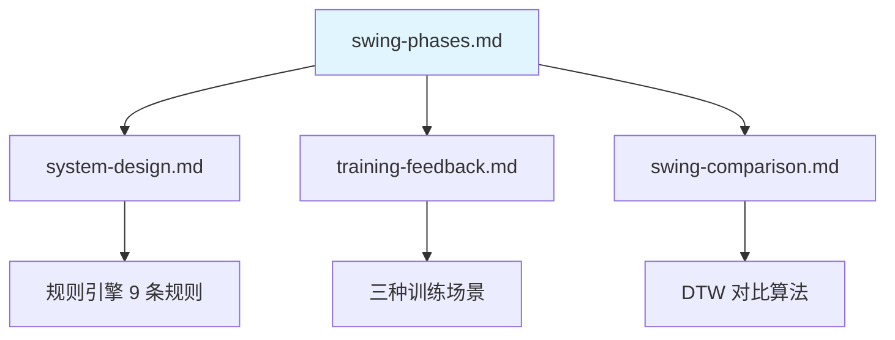

# 挥杆 8 阶段细分 Golf Swing 8-Phase Breakdown

> **文档目的**: 定义高尔夫挥杆的 8 个标准阶段及其检测方法
>
> **数据来源**: GolfDB/SwingNet (CVPR 2019), PMC7472298, 行业标准
>
> **用途**: 挥杆阶段检测算法设计、实时反馈触发点定义

---

## 1. 8 阶段总览 Phase Overview

```text
┌─────────────────────────────────────────────────────────────────────────────┐
│                    Golf Swing 8 Phases (GolfDB Standard)                    │
├─────────────────────────────────────────────────────────────────────────────┤
│                                                                              │
│  准备 SETUP        上杆 BACKSWING              下杆 DOWNSWING                │
│  ───────────      ──────────────────         ──────────────────────         │
│                                                                              │
│  1. Address       2. Toe-Up                  5. Mid-Downswing               │
│     站姿             杆头起                      下杆中段                     │
│                                                                              │
│                   3. Mid-Backswing           6. Impact                       │
│                      上杆中段                    击球                        │
│                                                                              │
│                   4. Top                     7. Mid-Follow-Through          │
│                      上杆顶点                   收杆中段                      │
│                                                                              │
│                                              8. Finish                       │
│                                                 收杆完成                      │
│                                                                              │
└─────────────────────────────────────────────────────────────────────────────┘
```

---

## 2. 各阶段详细定义 Phase Definitions

### Phase 1: Address (站姿)

| 属性 | 描述 |
|-----|------|
| **时间范围** | 挥杆开始前的静止期 |
| **持续时长** | 1-5 秒 (用户自主控制) |
| **检测条件** | IMU 角速度 < 50°/s 且持续 >500ms |
| **关键指标** | 脊柱角度、站距、膝盖弯曲、肩髋对齐 |

**检测代码**:

```python
def detect_address(gyro_z, timestamps, threshold=50, min_duration_ms=500):
    """检测站姿阶段"""
    static_mask = np.abs(gyro_z) < threshold  # deg/s

    # 找到连续静止期
    static_start = None
    for i, is_static in enumerate(static_mask):
        if is_static and static_start is None:
            static_start = i
        elif not is_static and static_start is not None:
            duration = timestamps[i] - timestamps[static_start]
            if duration >= min_duration_ms:
                return timestamps[static_start], timestamps[i]
            static_start = None

    return None, None
```

**可检测问题**:

| 问题 | Vision 检测 | 反馈 |
|-----|------------|------|
| 站距过窄 | `ankle_dist / shoulder_width < 0.9` | "脚站宽一点" |
| 脊柱太直 | `spine_angle < 25°` | "上身再前倾一些" |
| 膝盖锁死 | `knee_angle > 175°` | "膝盖稍微弯曲" |
| 肩膀耸起 | `shoulder_y - hip_y ratio` 异常 | "放松肩膀" |
| 头部过高 | `nose.y` 相对位置 | "下巴收一点" |

---

### Phase 2: Toe-Up (杆头起)

| 属性 | 描述 |
|-----|------|
| **时间范围** | 杆头离开球后 0-0.15s |
| **标志动作** | 杆头离地 6-12 英寸，与地面平行 |
| **检测条件** | IMU 开始检测到运动 + Vision 手腕位置变化 |
| **关键指标** | 一体起杆、杆面方正、手腕路径 |

**检测代码**:

```python
def detect_toe_up(gyro_z, timestamps, address_end, motion_threshold=100):
    """检测起杆阶段"""
    # 从 address 结束点开始
    post_address = gyro_z[address_end:]

    # 找到运动开始点
    motion_start_idx = np.where(np.abs(post_address) > motion_threshold)[0]
    if len(motion_start_idx) == 0:
        return None

    motion_start = address_end + motion_start_idx[0]

    # Toe-Up 约在运动开始后 150ms
    toe_up_time = timestamps[motion_start] + 150  # ms

    return toe_up_time
```

**可检测问题**:

| 问题 | 检测方法 | 反馈 |
|-----|---------|------|
| 手腕过早翻转 | Vision 手腕角度变化过快 | "保持手腕不动" |
| 不是一体起杆 | 肩膀和手腕运动不同步 | "肩膀带动手臂" |

---

### Phase 3: Mid-Backswing (上杆中段)

| 属性 | 描述 |
|-----|------|
| **时间范围** | 起杆后 0.15-0.40s |
| **标志动作** | 手腕与地面平行，杆身指向目标线 |
| **检测条件** | Vision 手腕高度 ≈ 腰部高度 |
| **关键指标** | 肩膀开始旋转、重心开始后移 |

**检测代码**:

```python
def detect_mid_backswing(landmarks, timestamps, toe_up_time):
    """检测上杆中段 - 基于 Vision"""
    LEFT_WRIST = 15
    LEFT_HIP = 23

    for i, t in enumerate(timestamps):
        if t < toe_up_time:
            continue

        wrist_y = landmarks[i][LEFT_WRIST].y
        hip_y = landmarks[i][LEFT_HIP].y

        # 手腕高度接近髋部
        if abs(wrist_y - hip_y) < 0.1:  # 归一化坐标
            return t

    return None
```

---

### Phase 4: Top (上杆顶点)

| 属性 | 描述 |
|-----|------|
| **时间范围** | 上杆完成时刻 (约 0.70-0.80s) |
| **标志动作** | 角速度由负转正 (方向反转) |
| **检测条件** | IMU gyro_z 过零点 (负→正) |
| **关键指标** | X-Factor、肩转90°、髋转45°、重心70-80%后脚 |

**检测代码 (最可靠)**:

```python
def detect_top_of_backswing(gyro_z, timestamps):
    """
    检测上杆顶点 - 基于 IMU 角速度过零点
    研究验证精度: ±9-15ms (PMC7472298)
    """
    # 找到角速度从负转正的零点交叉
    zero_crossings = np.where(
        (gyro_z[:-1] < 0) & (gyro_z[1:] > 0)
    )[0]

    if len(zero_crossings) == 0:
        return None

    # 第一个零点交叉即为上杆顶点
    top_idx = zero_crossings[0]

    return timestamps[top_idx]
```

**可检测问题**:

| 问题 | 检测方法 | 阈值 | 反馈 |
|-----|---------|-----|------|
| X-Factor 过小 | Vision 肩髋角度差 | < 20° | "肩膀再多转一点" |
| 肩转不足 | Vision 肩部旋转 | < 85° | "肩膀转到位" |
| 髋部过度旋转 | Vision 髋部旋转 | > 55° | "髋部控制住" |
| 重心没后移 | EMG 后脚激活 | < 60% | "重心移到后脚" |

---

### Phase 5: Mid-Downswing (下杆中段)

| 属性 | 描述 |
|-----|------|
| **时间范围** | 下杆开始后 0.05-0.15s |
| **标志动作** | 最大加速区，髋部领先启动 |
| **检测条件** | IMU 角速度快速增加，Vision 髋部开始旋转 |
| **关键指标** | 运动链顺序 (骨盆→躯干→手臂)、迟滞释放 |

**检测代码**:

```python
def detect_mid_downswing(gyro_z, timestamps, top_time, accel_threshold=500):
    """检测下杆中段 - 最大加速期"""
    # 从 Top 开始
    top_idx = np.searchsorted(timestamps, top_time)
    post_top = gyro_z[top_idx:]

    # 找到加速度达到阈值的时刻
    accel = np.diff(post_top) / np.diff(timestamps[top_idx:])
    high_accel_idx = np.where(np.abs(accel) > accel_threshold)[0]

    if len(high_accel_idx) == 0:
        return None

    return timestamps[top_idx + high_accel_idx[0]]
```

**可检测问题 (EMG 独特优势)**:

| 问题 | 检测方法 | 反馈 |
|-----|---------|------|
| 手臂先于核心发力 | EMG 激活时序 | "从核心启动" |
| 核心激活不足 | EMG 核心 < 50% | "收紧腹部" |
| 早释放 (Casting) | IMU 手腕角速度过早达峰 | "保持手腕角度" |

---

### Phase 6: Impact (峰值角速度时刻)

| 属性 | 描述 |
|-----|------|
| **时间范围** | 瞬间 (约 5ms 接触时间) |
| **标志动作** | **峰值角速度时刻** — 运动学定义，不依赖是否有球 |
| **检测条件** | IMU 峰值角速度 (主要方法) 或 加速度突变 (备用) |
| **关键指标** | 杆头速度、髋部打开、手在球前、杆身前倾 |

!!! info "为什么用"峰值角速度"而非"击球"？"
    **运动学定义 (Kinematic Definition)**:

    - Impact 定义为**峰值角速度时刻**，而非物理击球
    - 这样无论是否有球、是否击中，检测逻辑都一致
    - 空挥、打垫、练习挥杆都能正确检测

    详见: [信号处理入门 - IMU 相位检测](../../prerequisites/signal-processing-101.md#part2-imu)

**检测代码 (最可靠)**:

```python
def detect_impact(gyro_z, accel_z, timestamps):
    """
    检测 Impact 时刻 (峰值角速度)

    ⚠️ 重要: Impact 是运动学定义，不是物理击球
       - 峰值角速度时刻 = Impact
       - 无论是否有球、是否击中，检测逻辑一致

    方法 1: 峰值角速度 (推荐) — 最可靠，±9-15ms 精度
    方法 2: 加速度突变 (备选) — 更精确但需要更高采样率

    边缘情况处理:
        - 多个峰值 (double_peak): 取第一个超过阈值的峰
        - 无明显峰值: 返回 None + 触发 swing_abort
        - 峰值过低 (<300°/s): 可能是假挥杆，标记 low_confidence
    """
    # 方法 1: 峰值角速度
    peak_idx = np.argmax(np.abs(gyro_z))
    peak_velocity = gyro_z[peak_idx]

    # 边缘情况: 峰值过低
    MIN_PEAK_VELOCITY = 300  # deg/s
    if abs(peak_velocity) < MIN_PEAK_VELOCITY:
        # 可能是假挥杆或检测失败
        return None, None  # 调用方应处理 swing_abort

    # 方法 2: 加速度突变 (更精确但需要更高采样率)
    if accel_z is not None:
        accel_diff = np.abs(np.diff(accel_z))
        shock_idx = np.argmax(accel_diff)
        # 可用于交叉验证

    impact_time = timestamps[peak_idx]

    return impact_time, peak_velocity
```

**边缘情况处理**:

| 情况 | 检测条件 | 处理方式 |
|-----|---------|---------|
| `swing_abort` | 峰值角速度 < 300°/s | 返回 None，不计入分析 |
| `double_peak` | 检测到多个峰值 | 取第一个超过阈值的峰 |
| `phase_sequence_error` | Top 和 Impact 顺序异常 | 标记为无效挥杆 |
| `low_confidence` | 峰值 300-500°/s | 正常处理但标记置信度低 |

**可检测问题**:

| 问题 | 检测方法 | 阈值 | 反馈 |
|-----|---------|-----|------|
| 速度不足 | IMU 峰值角速度 | < 800°/s | "再用力一点" |
| 髋部没打开 | Vision 髋部角度 | < 30° | "髋部先转开" |
| 核心没发力 | EMG 核心激活 | < 50% | "用核心发力" |

---

### Phase 7: Mid-Follow-Through (收杆中段)

| 属性 | 描述 |
|-----|------|
| **时间范围** | 击球后 0.05-0.20s |
| **标志动作** | 手臂延伸，能量释放 |
| **检测条件** | IMU 角速度开始下降，Vision 手臂伸展 |
| **关键指标** | 手臂延伸、身体继续旋转、重心转移 |

---

### Phase 8: Finish (收杆完成)

| 属性 | 描述 |
|-----|------|
| **时间范围** | 挥杆结束静止 (约 0.95-1.10s) |
| **标志动作** | 平衡站立，胸朝目标 |
| **检测条件** | IMU 角速度再次低于阈值 |
| **关键指标** | 平衡、前脚重心90-100%、胸朝目标 |

**检测代码**:

```python
def detect_finish(gyro_z, timestamps, impact_time, threshold=100):
    """检测收杆完成"""
    impact_idx = np.searchsorted(timestamps, impact_time)
    post_impact = gyro_z[impact_idx:]

    # 找到角速度再次低于阈值的时刻
    static_idx = np.where(np.abs(post_impact) < threshold)[0]

    if len(static_idx) == 0:
        return None

    return timestamps[impact_idx + static_idx[0]]
```

---

## 3. 完整检测管道 Detection Pipeline

```python
class SwingPhaseDetector:
    """
    挥杆 8 阶段检测器

    融合 IMU + Vision 实现高精度阶段分割
    """

    def __init__(self, imu_sample_rate=200, vision_fps=30):
        self.imu_sample_rate = imu_sample_rate
        self.vision_fps = vision_fps

    def detect_all_phases(self, imu_data, vision_data=None, emg_data=None):
        """
        检测所有 8 个阶段

        Args:
            imu_data: dict with 'gyro_z', 'accel_z', 'timestamps'
            vision_data: optional, dict with 'landmarks', 'timestamps'
            emg_data: optional, dict with channel data

        Returns:
            phases: dict mapping phase name to timestamp
        """
        gyro_z = imu_data['gyro_z']
        timestamps = imu_data['timestamps']

        phases = {}

        # Phase 1: Address (静止期)
        addr_start, addr_end = detect_address(gyro_z, timestamps)
        phases['address'] = {'start': addr_start, 'end': addr_end}

        # Phase 4: Top (最可靠的锚点)
        top_time = detect_top_of_backswing(gyro_z, timestamps)
        phases['top'] = top_time

        # Phase 6: Impact (第二可靠的锚点)
        impact_time, peak_velocity = detect_impact(
            gyro_z, imu_data.get('accel_z'), timestamps
        )
        phases['impact'] = impact_time
        phases['peak_velocity'] = peak_velocity

        # Phase 8: Finish
        finish_time = detect_finish(gyro_z, timestamps, impact_time)
        phases['finish'] = finish_time

        # 其他阶段可通过插值或 Vision 辅助确定
        # Phase 2, 3: 介于 Address 和 Top 之间
        # Phase 5: 介于 Top 和 Impact 之间
        # Phase 7: 介于 Impact 和 Finish 之间

        # 计算节奏
        if phases['top'] and phases['address']:
            backswing_duration = phases['top'] - phases['address']['end']
            downswing_duration = phases['impact'] - phases['top']
            phases['tempo_ratio'] = backswing_duration / downswing_duration

        return phases
```

---

## 4. 检测精度对比 Detection Accuracy

| 阶段 | IMU 检测精度 | Vision 检测精度 | 推荐方法 |
|-----|-------------|----------------|---------|
| Address | ±50ms | ±33ms | IMU (静止检测可靠) |
| Toe-Up | ±69ms | ±66ms | Vision (需要看杆头) |
| Mid-Backswing | ±50ms | ±33ms | Vision (手腕位置) |
| **Top** | **±9-15ms** | ±33ms | **IMU (最可靠)** |
| Mid-Downswing | ±30ms | ±33ms | IMU + Vision |
| **Impact** | **±9-15ms** | ±33ms | **IMU (最可靠)** |
| Mid-Follow-Through | ±30ms | ±33ms | IMU + Vision |
| Finish | ±61-69ms | ±33ms | IMU (静止检测) |

**数据来源**: [Golf Swing Segmentation from IMU (PMC7472298)](https://www.ncbi.nlm.nih.gov/pmc/articles/PMC7472298/)

---

## 5. 与其他文档的关系



| 相关文档 | 内容 | 本文档提供 |
|---------|------|-----------|
| [系统设计](../architecture/system-design.md) | MVP 管道架构 | 阶段检测算法详情 |
| [训练反馈规范](training-feedback.md) | 反馈触发条件 | 阶段检测作为触发点 |
| [挥杆对比策略](swing-comparison.md) | 对比方法 | 阶段对齐基础 |
| [生物力学基准](../../prerequisites/foundations/biomechanics-benchmarks.md) | 各指标阈值 | 阶段内评估标准 |

---

## 6. 研究来源

1. **GolfDB/SwingNet (CVPR 2019)** - 8 阶段定义标准
   - [GitHub](https://github.com/wmcnally/golfdb)
   - [Paper](https://openaccess.thecvf.com/content_CVPRW_2019/papers/CVSports/McNally_GolfDB_A_Video_Database_for_Golf_Swing_Sequencing_CVPRW_2019_paper.pdf)

2. **Golf Swing Segmentation from IMU (2020)** - IMU 检测精度验证
   - [PMC7472298](https://www.ncbi.nlm.nih.gov/pmc/articles/PMC7472298/)

3. **Wrist IMU Swing Tracking (2024)** - 单腕部 IMU 方案
   - [Nature Scientific Reports](https://www.nature.com/articles/s41598-024-59949-w)

---

**最后更新**: 2025-12-17
**维护者**: Movement Chain AI Team
