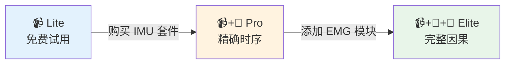

# 三个产品版本 Three Product Tiers

> **文档角色**: 功能规格 - 定义不同硬件配置下的产品能力边界
>
> **目标读者**: 产品经理、销售团队、技术团队
>
> **阅读时间**: 5分钟

---

## 1. 产品版本概览

Movement Chain AI 提供三个产品版本，满足不同用户需求：

| 版本 | 配置 | 目标用户 | 核心价值 |
|------|------|----------|----------|
| **Lite** | 📹 单摄像头 (iPhone) | 入门体验、试用 | 基础姿态分析 |
| **Pro** | 📹 摄像头 + 4× IMU | 进阶用户 | 精确时序 + 节奏分析 |
| **Elite** | 📹 摄像头 + 4× IMU + 2× EMG | 专业用户、教练 | 完整因果分析 (WHY) |

```text
┌─────────────────────────────────────────────────────────────────────────────┐
│                         产品版本能力递进                                       │
├─────────────────────────────────────────────────────────────────────────────┤
│                                                                             │
│   Lite (Video-Only)        Pro (+ IMU)              Elite (+ EMG)           │
│   ─────────────────        ──────────────           ────────────────        │
│                                                                             │
│   📹 单摄像头               📹 + 🔄×4                📹 + 🔄×4 + 💪×2        │
│                                                                             │
│   ┌─────────────┐          ┌─────────────┐          ┌─────────────┐         │
│   │  WHAT       │    +     │  WHEN       │    +     │  WHY        │         │
│   │  发生了什么   │          │  何时发生    │          │  为什么发生   │         │
│   └─────────────┘          └─────────────┘          └─────────────┘         │
│                                                                             │
│   • X-Factor               • 精确击球时刻           • 肌肉激活序列              │
│   • 身体姿态                • 挥杆节奏               • 力链因果分析              │
│   • 基础对比                • 相位检测               • 疲劳检测                 │
│                            • 速度曲线               • 假性蓄力检测             │
│                                                                             │
│   竞品同等水平              超越竞品                 独家差异化                  │
│   (OnForm/Sportsbox)                                                        │
│                                                                             │
└─────────────────────────────────────────────────────────────────────────────┘
```

---

## 2. 硬件配置详情

### 2.1 Lite 版 (Video-Only)

| 组件 | 规格 | 说明 |
|------|------|------|
| **摄像头** | iPhone (30fps) | 用户自有设备 |
| **姿态估计** | MediaPipe 33 关键点 | 端侧推理 |

**适用场景**: 免费试用、入门体验、无硬件用户

### 2.2 Pro 版 (摄像头 + 4× IMU)

| 组件 | 规格 | 说明 |
|------|------|------|
| **摄像头** | iPhone (30fps) | 用户自有设备 |
| **IMU** | 4× LSM6DSV16X | 1666Hz 采样率 |
| **位置** | 双前臂 + 双大腿 | 捕捉四肢运动 |
| **MCU** | 2× ESP32-S3 | Arm Hub + Leg Hub |
| **连接** | BLE 5.0 | <30ms 延迟 |

**适用场景**: 进阶高尔夫爱好者、追求精确数据

### 2.3 Elite 版 (摄像头 + 4× IMU + 2× EMG)

| 组件 | 规格 | 说明 |
|------|------|------|
| **摄像头** | iPhone (30fps) | 用户自有设备 |
| **IMU** | 4× LSM6DSV16X | 1666Hz 采样率 |
| **EMG** | 2× MyoWare 2.0 | 1000Hz 采样率 |
| **位置** | IMU: 双前臂 + 双大腿<br/>EMG: 核心 + 前臂 | 肌肉激活检测 |
| **MCU** | 2× ESP32-S3 | Arm Hub + Core Hub |
| **连接** | BLE 5.0 | <30ms 延迟 |

**适用场景**: 专业球手、教练、追求根因分析

---

## 3. 能力对比矩阵

### 3.1 检测能力

| 能力 | Lite | Pro | Elite | 说明 |
|------|:----:|:---:|:-----:|------|
| **X-Factor** | ✅ ±3° | ✅ ±3° | ✅ ±3° | Vision 足够 |
| **身体姿态角度** | ✅ ±5° | ✅ ±5° | ✅ ±5° | Vision 足够 |
| **挥杆节奏** | ⚠️ ±66ms | ✅ <10ms | ✅ <10ms | IMU 更精确 |
| **精确击球时刻** | ❌ ±33ms | ✅ ±0.6ms | ✅ ±0.6ms | 相机帧率限制 |
| **杆头速度** | ❌ 无法测量 | ⚠️ 间接推断 | ⚠️ 间接推断 | 高速运动模糊 |
| **相位检测 (8阶段)** | ⚠️ 粗略 | ✅ 精确 | ✅ 精确 | IMU 零交叉检测 |
| **肌肉激活序列** | ❌ 不可能 | ❌ 不可能 | ✅ 直接测量 | 需要 EMG |
| **力链因果分析** | ❌ 不可能 | ❌ 不可能 | ✅ 直接验证 | 需要 EMG |
| **疲劳检测** | ❌ 不可能 | ❌ 不可能 | ✅ 振幅衰减 | 需要 EMG |
| **假性蓄力检测** | ❌ 不可能 | ❌ 不可能 | ✅ Vision+EMG | 交叉验证 |

### 3.2 诊断规则覆盖

| 规则 | 优先级 | Lite | Pro | Elite | 数据源 |
|------|:------:|:----:|:---:|:-----:|--------|
| 倒序运动链 | P0 | ❌ | ❌ | ✅ | EMG |
| 过度手臂挥杆 | P0 | ❌ | ❌ | ✅ | EMG |
| X-Factor 不足 | P1 | ✅ | ✅ | ✅ | Vision |
| 节奏过快 | P1 | ⚠️ | ✅ | ✅ | IMU |
| 节奏过慢 | P1 | ⚠️ | ✅ | ✅ | IMU |
| 早释放 | P1 | ⚠️ | ✅ | ✅ | IMU |

**图例**: ✅ 完整支持 | ⚠️ 部分支持 (精度受限) | ❌ 不支持

---

## 4. 价值定位

### 4.1 与竞品对比

| 产品 | 配置 | 能力 |
|------|------|------|
| **OnForm** | Video-Only | WHAT (发生了什么) |
| **Sportsbox AI** | Video-Only | WHAT (发生了什么) |
| **Movement Chain Lite** | Video-Only | WHAT ≈ 竞品同等 |
| **Movement Chain Pro** | + 4× IMU | WHAT + WHEN (超越竞品) |
| **Movement Chain Elite** | + 4× IMU + 2× EMG | WHAT + WHEN + **WHY** (独家) |

### 4.2 核心差异化

!!! success "Elite 版独家能力"

    **只有 Elite 版能回答 "为什么"**:

    - 竞品: "你的 X-Factor 不足"
    - 我们: "你的核心肌群在下杆时未激活，导致 X-Factor 不足"

    这是 EMG 带来的**因果归因能力**，竞品无法复制。

---

## 5. 升级路径



**软件统一**: 三个层级使用同一个 App，根据检测到的硬件自动启用对应功能。

---

## 6. 版本历史

| 版本 | 日期 | 修改内容 |
|------|------|----------|
| 1.0 | 2025-12-27 | 初始版本，定义三个产品版本 |

---

**最后更新**: 2025-12-27
**维护者**: Movement Chain AI Team
