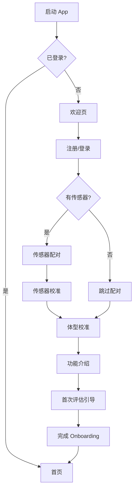
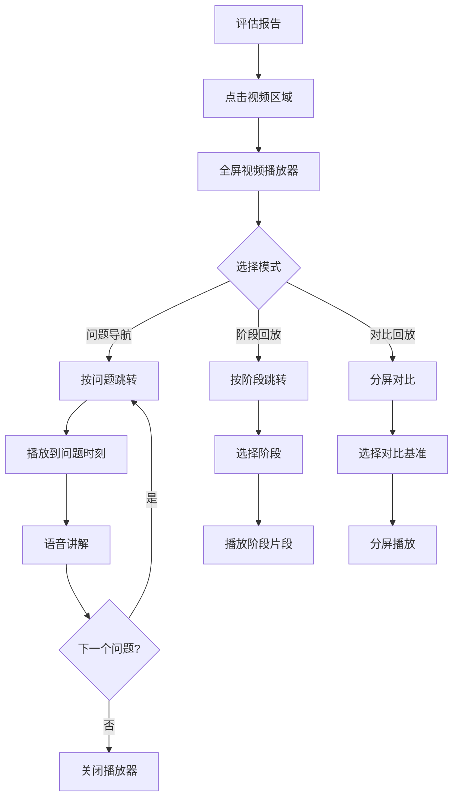
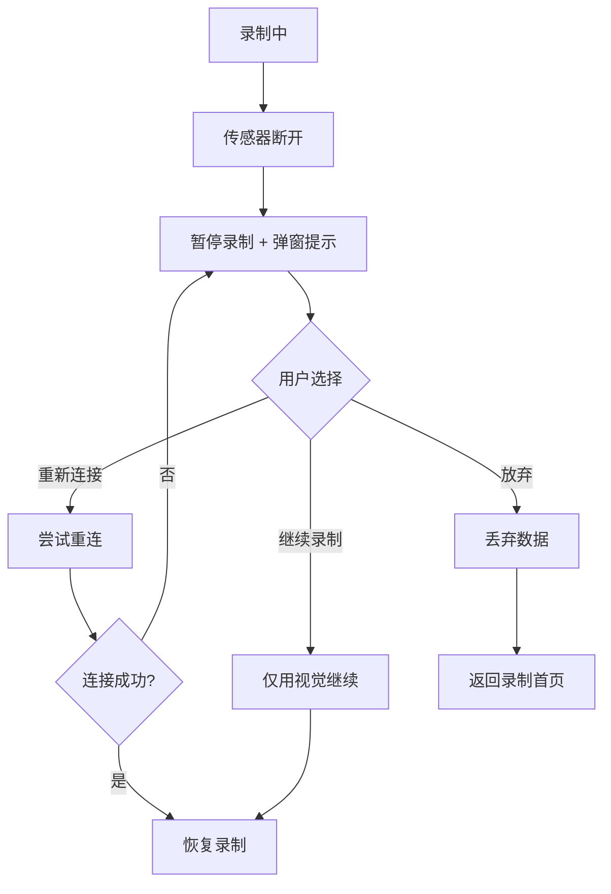

# 用户流程

> **文档目的**: 定义核心用户场景的完整交互流程
>
> **目标读者**: UI/UX 设计师、产品经理、iOS 开发工程师

---

## 1. 核心流程概览

```text
┌─────────────────────────────────────────────────────────────────────────────┐
│                           核心用户流程                                        │
├─────────────────────────────────────────────────────────────────────────────┤
│                                                                             │
│   首次使用                                                                   │
│   ────────                                                                  │
│   注册 → 传感器配对 → 体型校准 → 首次评估 → 查看报告                            │
│                                                                             │
│   日常评估                                                                   │
│   ────────                                                                  │
│   选择模式 → 录制挥杆 → 分析处理 → 查看报告 → 开始练习                          │
│                                                                             │
│   练习改进                                                                   │
│   ────────                                                                  │
│   选择 Drill → 观看演示 → 练习 → 验证效果                                     │
│                                                                             │
│   引导训练                                                                   │
│   ────────                                                                  │
│   选择引导 → 站姿检查 → 慢动作引导 → 实时反馈                                   │
│                                                                             │
└─────────────────────────────────────────────────────────────────────────────┘
```

---

## 2. 首次使用流程 (Onboarding)

### 2.1 流程图



### 2.2 详细步骤

| 步骤 | 屏幕 | 用户操作 | 系统行为 |
|-----|------|---------|---------|
| 1 | 欢迎页 | 滑动浏览 | 展示 3-4 张功能介绍 |
| 2 | 注册/登录 | 输入手机号/邮箱 | 发送验证码 |
| 3 | 传感器配对 | 点击"开始配对" | 蓝牙扫描 + 配对 |
| 4 | 传感器校准 | 按提示放置传感器 | 静态校准 |
| 5 | 体型校准 | 站立 T-Pose | 摄像头采集体型比例 |
| 6 | 功能介绍 | 滑动浏览 | 展示核心功能 |
| 7 | 首次评估 | 跟随语音引导挥杆 | 录制 + 分析 |

### 2.3 欢迎页内容

| 页码 | 标题 | 内容 |
|-----|------|------|
| 1 | 科学分析你的挥杆 | IMU + Vision + EMG 三模态融合 |
| 2 | 知道为什么，而不只是什么 | EMG 揭示发力顺序 |
| 3 | 个性化训练推荐 | 针对你的问题推荐 Drill |
| 4 | 开始你的进步之旅 | 注册按钮 |

---

## 3. 日常评估流程

### 3.1 流程图

```mermaid
flowchart TD
    A[首页] --> B[点击"评估"]
    B --> C{传感器已连接?}

    C -->|否| D[传感器连接提示]
    C -->|是| E[摄像头预览]
    D -->|连接| E
    D -->|跳过| E

    E --> F[放置手机提示]
    F --> G[点击"开始录制"]
    G --> H[倒计时 3-2-1]

    H --> I[Step 1: 站姿检查]
    I --> J[Step 2: 慢速挥杆]
    J --> K[Step 3: 全速挥杆]

    K --> L[录制结束]
    L --> M[分析处理中]
    M --> N[评估报告]

    N --> O{查看详情?}
    O -->|是| P[问题详情]
    O -->|否| Q{开始练习?}

    P --> Q
    Q -->|是| R[练习流程]
    Q -->|否| S[返回首页]
```

### 3.2 评估三步流程

```text
┌─────────────────────────────────────────────────────────────────────────────┐
│                         三步评估流程                                          │
├─────────────────────────────────────────────────────────────────────────────┤
│                                                                             │
│  Step 1: 站姿检查 (5-10秒)                                                   │
│  ─────────────────────────────────────────────────────────────────────────  │
│  🔊 "请站好，保持你平时的准备姿势"                                             │
│  📹 静默采集站姿数据                                                         │
│  🔊 "好的，站姿检查完成"                                                      │
│                                                                             │
│  Step 2: 慢速挥杆 (3-5秒)                                                    │
│  ─────────────────────────────────────────────────────────────────────────  │
│  🔊 "现在请慢速挥杆一次，大约 3-4 秒完成"                                       │
│  📹 采集慢动作挥杆                                                           │
│  🔊 "好的，慢动作检查完成"                                                    │
│                                                                             │
│  Step 3: 全速挥杆 (1-2秒)                                                    │
│  ─────────────────────────────────────────────────────────────────────────  │
│  🔊 "最后，请用正常速度挥杆"                                                   │
│  📹 采集全速挥杆                                                             │
│  🔊 "评估完成，正在生成报告..."                                                │
│                                                                             │
└─────────────────────────────────────────────────────────────────────────────┘
```

### 3.3 录制界面状态流转

| 状态 | UI 表现 | 用户操作 | 持续时间 |
|-----|---------|---------|---------|
| 预览中 | 摄像头预览 + 开始按钮 | 调整位置 | 用户控制 |
| 倒计时 | 3-2-1 大字 + 音效 | 准备 | 3 秒 |
| 站姿检查 | 进度条 Step 1/3 | 保持静止 | 5-10 秒 |
| 慢速挥杆 | 进度条 Step 2/3 | 慢速挥杆 | 3-5 秒 |
| 全速挥杆 | 进度条 Step 3/3 | 全速挥杆 | 1-2 秒 |
| 处理中 | 加载动画 + 进度 % | 等待 | 5-15 秒 |

---

## 4. 练习改进流程

### 4.1 流程图

```mermaid
flowchart TD
    A[评估报告] --> B[点击"开始练习"]
    B --> C[推荐 Drill 列表]

    C --> D[选择一个 Drill]
    D --> E[Drill 详情页]
    E --> F[观看演示视频]

    F --> G[设置练习参数]
    G --> H[点击"开始练习"]

    H --> I[练习进行中]
    I --> J{完成一组?}

    J -->|否| I
    J -->|是| K{还有更多组?}

    K -->|是| L[组间休息]
    L --> I
    K -->|否| M[练习完成]

    M --> N{验证效果?}
    N -->|是| O[快速评估]
    N -->|否| P[返回首页]

    O --> Q[对比报告]
    Q --> P
```

### 4.2 练习进行中界面

```text
┌─────────────────────────────────────────────────────────────────────────────┐
│  [×]                   骨盆先行练习                              第 2/3 组   │
├─────────────────────────────────────────────────────────────────────────────┤
│                                                                             │
│                                                                             │
│                              ┌─────────┐                                    │
│                              │         │                                    │
│                              │   12    │  ← 当前次数                        │
│                              │  ────   │                                    │
│                              │  / 15   │  ← 目标次数                        │
│                              │         │                                    │
│                              └─────────┘                                    │
│                                                                             │
│                                                                             │
│  ┌─────────────────────────────────────────────────────────────────────┐   │
│  │                                                                     │   │
│  │                      [ 摄像头预览区域 ]                              │   │
│  │                                                                     │   │
│  │                        实时姿态反馈                                  │   │
│  │                                                                     │   │
│  └─────────────────────────────────────────────────────────────────────┘   │
│                                                                             │
│                                                                             │
│  ┌─────────────────────────────────────────────────────────────────────┐   │
│  │  💡 提示: 下杆时先启动骨盆，感受核心带动手臂                           │   │
│  └─────────────────────────────────────────────────────────────────────┘   │
│                                                                             │
│                                                                             │
│  ████████████████████████████████████████░░░░░░░░░░░░░░░░░░░░ 80%          │
│                                                                             │
│                     [暂停]              [完成这组]                          │
│                                                                             │
└─────────────────────────────────────────────────────────────────────────────┘
```

---

## 5. 引导训练流程

### 5.1 流程图

```mermaid
flowchart TD
    A[首页/报告] --> B[选择"引导模式"]
    B --> C{传感器已连接?}

    C -->|否| D[传感器连接]
    C -->|是| E[摄像头预览]
    D --> E

    E --> F[开始引导]
    F --> G[站姿引导]

    G --> H{站姿正确?}
    H -->|否| I[实时语音纠正]
    I --> G
    H -->|是| J[确认站姿 OK]

    J --> K[慢动作引导]
    K --> L[分阶段语音提示]

    L --> M{完成一次?}
    M -->|是| N{继续练习?}
    M -->|否| L

    N -->|是| K
    N -->|否| O[引导结束]
    O --> P[练习总结]
```

### 5.2 引导模式界面

```text
┌─────────────────────────────────────────────────────────────────────────────┐
│  [×]                     引导模式                           第 5 / 10 次    │
├─────────────────────────────────────────────────────────────────────────────┤
│                                                                             │
│  ┌─────────────────────────────────────────────────────────────────────┐   │
│  │                                                                     │   │
│  │                      [ 摄像头预览区域 ]                              │   │
│  │                                                                     │   │
│  │                          ● ─ ●                                      │   │
│  │                         /│   │\                                     │   │
│  │                     🟢 / │   │ \ 🟢    ← 肌肉激活指示                 │   │
│  │                       ●  │   │  ●                                   │   │
│  │                          │   │                                      │   │
│  │                         / \  / \                                    │   │
│  │                        ●   ●    ●                                   │   │
│  │                                                                     │   │
│  └─────────────────────────────────────────────────────────────────────┘   │
│                                                                             │
│  ┌─── 当前阶段 ────────────────────────────────────────────────────────┐   │
│  │                                                                     │   │
│  │   [准备] → [上杆] → [●顶点●] → [下杆] → [击球] → [收杆]               │   │
│  │                                                                     │   │
│  └─────────────────────────────────────────────────────────────────────┘   │
│                                                                             │
│  ┌─────────────────────────────────────────────────────────────────────┐   │
│  │  🔊 "到顶了，准备下杆... 从核心启动！"                                 │   │
│  └─────────────────────────────────────────────────────────────────────┘   │
│                                                                             │
│                     [暂停]              [结束引导]                          │
│                                                                             │
└─────────────────────────────────────────────────────────────────────────────┘
```

---

## 6. 传感器连接流程

### 6.1 流程图

```mermaid
flowchart TD
    A[设置/录制] --> B[传感器管理]
    B --> C[点击"添加设备"]

    C --> D{蓝牙已开启?}
    D -->|否| E[提示开启蓝牙]
    D -->|是| F[扫描设备]
    E --> F

    F --> G[显示发现的设备]
    G --> H[选择设备]

    H --> I[配对中...]
    I --> J{配对成功?}

    J -->|否| K[配对失败提示]
    K --> F
    J -->|是| L[命名设备]

    L --> M[校准提示]
    M --> N[静态校准]
    N --> O[校准完成]
    O --> P[返回设备列表]
```

### 6.2 扫描设备界面

```text
┌─────────────────────────────────────────────────────────────────────────────┐
│  [←]                    扫描设备                                 [刷新]     │
├─────────────────────────────────────────────────────────────────────────────┤
│                                                                             │
│  ┌─────────────────────────────────────────────────────────────────────┐   │
│  │  💡 请确保传感器已开机，并靠近手机                                    │   │
│  └─────────────────────────────────────────────────────────────────────┘   │
│                                                                             │
│  ┌─── 发现的设备 ──────────────────────────────────────────────────────┐   │
│  │                                                                     │   │
│  │  ┌───────────────────────────────────────────────────────────┐     │   │
│  │  │  📡 MC-IMU-001                                      [连接] │     │   │
│  │  │     信号强度: ████░  ·  未配对                              │     │   │
│  │  └───────────────────────────────────────────────────────────┘     │   │
│  │                                                                     │   │
│  │  ┌───────────────────────────────────────────────────────────┐     │   │
│  │  │  📡 MC-IMU-002                                      [连接] │     │   │
│  │  │     信号强度: ███░░  ·  未配对                              │     │   │
│  │  └───────────────────────────────────────────────────────────┘     │   │
│  │                                                                     │   │
│  │  ┌───────────────────────────────────────────────────────────┐     │   │
│  │  │  📡 MC-IMU-003                                      [连接] │     │   │
│  │  │     信号强度: ██░░░  ·  未配对                              │     │   │
│  │  └───────────────────────────────────────────────────────────┘     │   │
│  │                                                                     │   │
│  └─────────────────────────────────────────────────────────────────────┘   │
│                                                                             │
│                          ○ 扫描中...                                        │
│                                                                             │
└─────────────────────────────────────────────────────────────────────────────┘
```

---

## 7. 视频回放流程

### 7.1 流程图



### 7.2 视频播放器控件

```text
┌─────────────────────────────────────────────────────────────────────────────┐
│                                                                    [×]      │
├─────────────────────────────────────────────────────────────────────────────┤
│                                                                             │
│                                                                             │
│                                                                             │
│                       [ 全屏视频播放区域 ]                                   │
│                                                                             │
│                          ● ─ ●                                              │
│                         /│   │\                                             │
│                        / │   │ \                                            │
│                       ●  │ 🔴│  ●    ← 问题区域高亮                          │
│                          │   │                                              │
│                         / \  / \                                            │
│                        ●   ●    ●                                           │
│                                                                             │
│                                                                             │
│                                                                             │
├─────────────────────────────────────────────────────────────────────────────┤
│                                                                             │
│  🔊 "这里检测到发力顺序错误，手臂先于核心启动了..."                            │
│                                                                             │
│  ▶ ━━━━━━━━━━━━━━━━●━━━━━━━━━━━━━━━━━━━━━━━━━━━━━━━━━━━━━━━━━━━━━━━━━ 0:45 │
│           ▲                                                                 │
│        问题点                                                                │
│                                                                             │
│  [◀ 上一问题]    [▶ 播放]    [下一问题 ▶]    [0.25x] [0.5x] [1x]             │
│                                                                             │
│  ─────────────────────────────────────────────────────────────────────────  │
│  问题列表:                                                                   │
│  [🔴 发力顺序错误]  [🟡 X-Factor 不足]  [🟡 节奏偏快]                         │
│                                                                             │
└─────────────────────────────────────────────────────────────────────────────┘
```

---

## 8. 错误处理流程

### 8.1 传感器断开



### 8.2 分析失败

```text
┌─────────────────────────────────────────────────────────────────────────────┐
│                                                                             │
│                                                                             │
│                          ┌─────────────────┐                                │
│                          │                 │                                │
│                          │   [错误插画]     │                                │
│                          │                 │                                │
│                          └─────────────────┘                                │
│                                                                             │
│                           分析失败                                           │
│                                                                             │
│                   视频质量不足，请确保光线充足                                 │
│                   且人物完整出现在画面中                                      │
│                                                                             │
│                          ┌───────────────┐                                  │
│                          │   重新录制    │                                  │
│                          └───────────────┘                                  │
│                                                                             │
│                          查看录制技巧 →                                      │
│                                                                             │
└─────────────────────────────────────────────────────────────────────────────┘
```

---

## 9. 相关文档

| 相关文档 | 内容 | 本文档使用 |
|---------|------|-----------|
| [屏幕列表](screens.md) | 屏幕结构定义 | 流程节点对应 |
| [评估模式](../modes/assessment-mode.md) | 三步评估流程 | 评估流程设计 |
| [引导模式](../modes/guide-mode.md) | 实时引导逻辑 | 引导流程设计 |
| [练习模式](../modes/drill-mode.md) | Drill 推荐 | 练习流程设计 |
| [三个反馈通道](../three-feedback-channels.md) | 反馈时机 | 界面反馈设计 |

---

**最后更新**: 2026-01-08
**维护者**: Movement Chain AI Team
