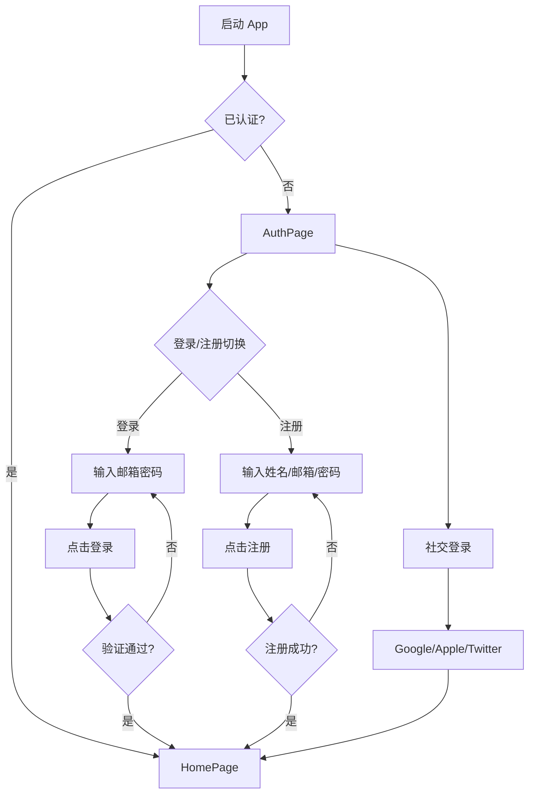
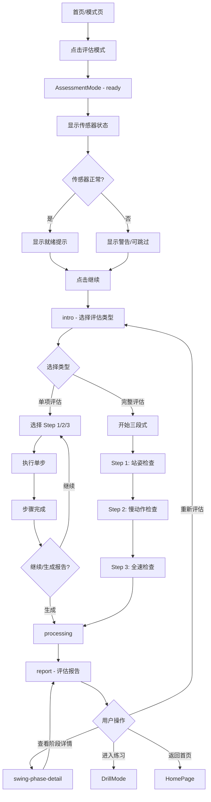
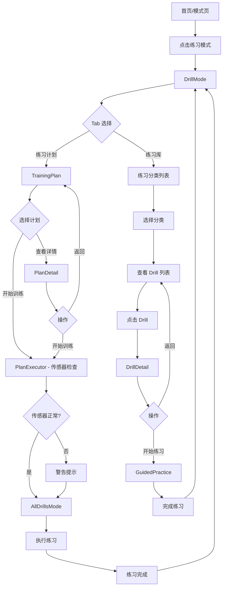
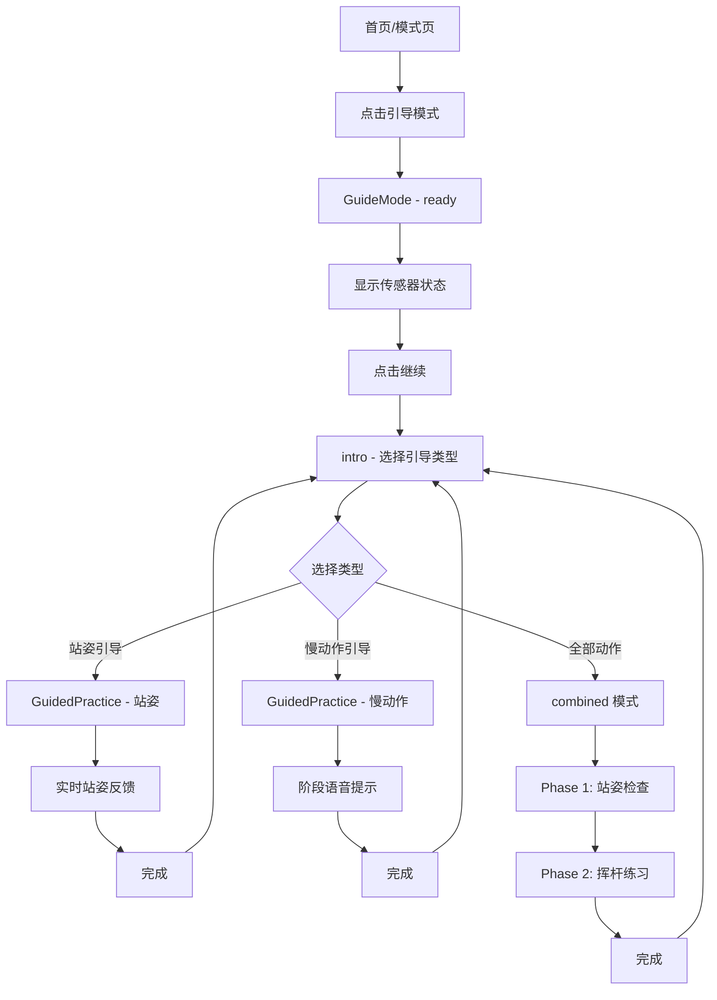
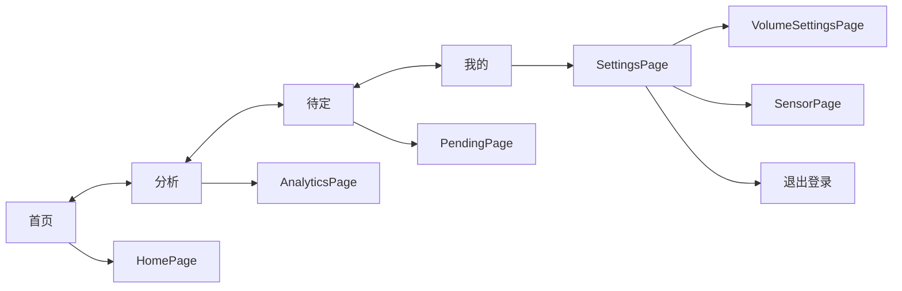

# 用户流程

> **文档目的**: 定义核心用户场景的完整交互流程
>
> **目标读者**: UI/UX 设计师、产品经理、前端开发工程师
>
> **设计主题**: 金稻绿野 (Golden Harvest)

---

## 1. 核心流程概览

```text
┌─────────────────────────────────────────────────────────────────────────────┐
│                           核心用户流程                                        │
├─────────────────────────────────────────────────────────────────────────────┤
│                                                                             │
│   用户认证                                                                   │
│   ────────                                                                  │
│   启动 App → 登录/注册 → 首页                                                │
│                                                                             │
│   评估模式                                                                   │
│   ────────                                                                  │
│   选择评估 → 传感器检查 → 选择类型 → 三步评估 → 处理中 → 报告                  │
│                                                                             │
│   练习模式                                                                   │
│   ────────                                                                  │
│   选择练习 → 练习库/训练计划 → 传感器检查 → 执行练习 → 完成                    │
│                                                                             │
│   引导模式                                                                   │
│   ────────                                                                  │
│   选择引导 → 传感器检查 → 站姿/慢动作引导 → 实时反馈 → 完成                    │
│                                                                             │
└─────────────────────────────────────────────────────────────────────────────┘
```

---

## 2. 用户认证流程

### 2.1 流程图



### 2.2 页面状态

| 状态 | 文件 | 说明 |
|-----|------|------|
| 登录表单 | `AuthPage.tsx` | 默认显示，包含邮箱、密码输入 |
| 注册表单 | `AuthPage.tsx` | 切换后显示，增加姓名输入 |
| 社交登录 | `AuthPage.tsx` | Google / Apple / Twitter 快捷登录 |

### 2.3 界面元素

```typescript
// 认证表单字段
interface AuthForm {
  isLogin: boolean;      // 登录/注册切换
  email: string;         // 邮箱
  password: string;      // 密码 (最少6位)
  name?: string;         // 姓名 (仅注册)
}
```

---

## 3. 评估模式流程

### 3.1 流程图



### 3.2 评估步骤状态

```typescript
type AssessmentStep =
  | 'intro'           // 选择评估类型
  | 'ready'           // 传感器检查
  | 'step1'           // 站姿检查进行中
  | 'step1-complete'  // 站姿检查完成
  | 'step2'           // 慢动作检查进行中
  | 'step2-complete'  // 慢动作检查完成
  | 'step3'           // 全速检查进行中
  | 'step3-complete'  // 全速检查完成
  | 'processing'      // 生成报告中
  | 'report'          // 显示报告
  | 'swing-phase-detail';  // 挥杆阶段详情
```

### 3.3 三步评估流程

```text
┌─────────────────────────────────────────────────────────────────────────────┐
│                         三步评估流程                                          │
├─────────────────────────────────────────────────────────────────────────────┤
│                                                                             │
│  Step 1: 站姿检查 (3秒)                                                      │
│  ─────────────────────────────────────────────────────────────────────────  │
│  📊 进度: Step 1/3 - 33%                                                    │
│  🧍 提示: 请站好，保持准备姿势                                                │
│  🎯 状态: 正在采集数据...                                                    │
│                                                                             │
│  Step 2: 慢动作检查 (3秒)                                                    │
│  ─────────────────────────────────────────────────────────────────────────  │
│  📊 进度: Step 2/3 - 66%                                                    │
│  🏌️ 提示: 请慢速挥杆一次，大约 3-4 秒完成                                     │
│  🎯 状态: 正在采集数据...                                                    │
│                                                                             │
│  Step 3: 全速检查 (3秒)                                                      │
│  ─────────────────────────────────────────────────────────────────────────  │
│  📊 进度: Step 3/3 - 100%                                                   │
│  ⚡ 提示: 正常速度挥杆，最后一步                                              │
│  🎯 状态: 正在采集数据...                                                    │
│                                                                             │
└─────────────────────────────────────────────────────────────────────────────┘
```

### 3.4 评估报告数据结构

```typescript
interface AssessmentData {
  score: number;          // 综合评分 (0-100)
  date: string;           // 评估日期
  problems: Problem[];    // 发现的问题
  strengths: string[];    // 优势项
}

interface Problem {
  id: string;
  title: string;          // 问题标题
  description: string;    // 问题描述
  priority: 'high' | 'medium' | 'low';  // 优先级
}

// 示例数据
const assessmentData = {
  score: 72,
  date: '2026-01-09 14:30',
  problems: [
    { id: '1', title: '发力顺序错误', description: '下杆时手臂先于核心启动', priority: 'high' },
    { id: '2', title: 'X-Factor 不足', description: '上杆转肩幅度偏小', priority: 'medium' },
    { id: '3', title: '站距偏窄', description: '建议调整为肩宽的1.2倍', priority: 'low' }
  ],
  strengths: [
    '握杆姿势标准，符合中性握法',
    '头部保持稳定，目视球位置良好',
    '收杆动作完整，身体平衡性良好'
  ]
};
```

---

## 4. 练习模式流程

### 4.1 流程图



### 4.2 练习分类

```typescript
const categoryMap = {
  warmup: '热身',              // 8 个练习
  mobility: '灵活性',          // 髋部、胸椎等
  balance: '平衡',             // 8 个练习
  strength: '力量',            // 12 个练习
  motor_pattern: '动作模式',   // 12 个练习
  rotation_resistance: '旋转对抗',  // 10 个练习
  power: '爆发力',             // 10 个练习
  deceleration: '减速'         // 8 个练习
};
```

### 4.3 练习数据结构

```typescript
interface Drill {
  id: string;                // 唯一标识 (如 PFD001)
  name: string;              // 英文名称
  nameZh: string;            // 中文名称
  category: DrillCategory;   // 分类
  targetProblem: string;     // 针对问题
  difficulty: 'beginner' | 'intermediate' | 'advanced';
  sets: number;              // 组数
  reps: number;              // 次数
  duration?: string;         // 时长描述
  description: string;       // 练习说明
}

// 难度显示
const difficultyMap = {
  beginner: { label: '初级', color: 'var(--color-success)' },
  intermediate: { label: '中级', color: 'var(--color-priority-medium)' },
  advanced: { label: '高级', color: 'var(--color-priority-high)' }
};
```

### 4.4 练习模式界面流转

```text
┌─────────────────────────────────────────────────────────────────────────────┐
│                         练习模式界面流转                                       │
├─────────────────────────────────────────────────────────────────────────────┤
│                                                                             │
│   [练习计划] [练习库]  ← Tab 切换                                            │
│                                                                             │
│   练习计划 Tab:                                                              │
│   ├── TrainingPlan 组件                                                     │
│   │   ├── 我的计划列表                                                       │
│   │   ├── 开始训练按钮 → PlanExecutor (传感器检查)                           │
│   │   └── 查看详情 → PlanDetail                                             │
│   │                                                                         │
│   └── PlanDetail:                                                           │
│       ├── 计划概览 (时长、频率、进度)                                         │
│       ├── 动作列表                                                           │
│       └── 开始训练 → PlanExecutor → AllDrillsMode                           │
│                                                                             │
│   练习库 Tab:                                                                │
│   ├── 8 个分类按钮 (4x2 网格)                                                │
│   ├── Drill 卡片列表                                                         │
│   │   ├── 中文名 + 英文名                                                    │
│   │   ├── 针对问题                                                           │
│   │   └── 组数 × 次数 + 难度标签                                             │
│   └── 点击 → DrillDetail → GuidedPractice                                   │
│                                                                             │
└─────────────────────────────────────────────────────────────────────────────┘
```

---

## 5. 引导模式流程

### 5.1 流程图



### 5.2 引导类型状态

```typescript
type GuideType =
  | 'intro'       // 选择引导类型
  | 'ready'       // 传感器检查
  | 'detail'      // 练习详情
  | 'practice'    // 引导练习中
  | 'setup'       // 站姿引导
  | 'slowmotion'  // 慢动作引导
  | 'combined'    // 综合引导
  | 'allDrills';  // 全部练习模式

type CombinedPhase = 'stance' | 'slowmotion';
```

### 5.3 引导练习项目

```typescript
const drills = [
  {
    id: 'setup-stance',
    nameZh: '站姿引导',
    name: 'Setup & Stance',
    description: '实时检测并纠正站姿，建立正确的准备姿势'
  },
  {
    id: 'slow-motion',
    nameZh: '慢动作引导',
    name: 'Slow Motion Guide',
    description: '分解每个动作阶段，慢速建立正确的挥杆模式'
  }
];
```

### 5.4 实时反馈系统

```typescript
// 站姿反馈
const setupFeedbacks = [
  { text: '站姿良好！', type: 'success' },
  { text: '脚再宽一点', type: 'warning' },
  { text: '肩膀放松', type: 'warning' },
  { text: '膝盖弯曲适度', type: 'success' },
  { text: '重心保持中间', type: 'success' }
];

// 慢动作阶段提示
const slowMotionPhases = [
  { phase: '准备好了，慢慢起杆', icon: '🏌️' },
  { phase: '好，继续转肩', icon: '🔄' },
  { phase: '到顶了，准备下杆', icon: '⏸️' },
  { phase: '从核心启动', icon: '💪' },
  { phase: '保持手腕角度', icon: '✋' },
  { phase: '收杆，保持平衡', icon: '✅' }
];

// 肌肉激活数据
const muscleGroups = [
  { id: 'core', nameZh: '核心肌群', activation: 56, level: '中等', color: '#f59e0b' },
  { id: 'back', nameZh: '背部', activation: 42, level: '中等', color: '#f59e0b' },
  { id: 'shoulder', nameZh: '肩部', activation: 38, level: '放松', color: '#ef4444' },
  { id: 'deltoid', nameZh: '三角肌', activation: 61, level: '中等', color: '#f59e0b' }
];
```

---

## 6. 传感器管理流程

### 6.1 传感器状态

```typescript
interface Sensor {
  id: string;
  name: string;
  type: 'EMG' | 'IMU';
  status: 'connected' | 'disconnected';
  battery: number;    // 0-100
  signal: number;     // 0-100
  position?: string;  // 佩戴位置
}

// 默认传感器配置
const defaultSensors: Sensor[] = [
  {
    id: 'emg-001',
    name: 'EMG 主传感器',
    type: 'EMG',
    status: 'connected',
    battery: 87,
    signal: 95,
    position: '左臂'
  },
  {
    id: 'imu-001',
    name: 'IMU 动作传感器',
    type: 'IMU',
    status: 'connected',
    battery: 92,
    signal: 88,
    position: '腰部'
  }
];
```

### 6.2 传感器检查流程

```text
┌─────────────────────────────────────────────────────────────────────────────┐
│                         传感器检查流程                                        │
├─────────────────────────────────────────────────────────────────────────────┤
│                                                                             │
│   1. 显示传感器列表                                                          │
│      ├── 已连接传感器 → 绿色状态指示                                         │
│      ├── 电量显示 (低于 20% 警告)                                            │
│      └── 信号强度 (低于 60% 警告)                                            │
│                                                                             │
│   2. 状态判断                                                                │
│      ├── 全部正常 → 显示"传感器状态良好，已准备就绪"                          │
│      ├── 有警告 → 显示具体警告信息                                           │
│      └── 无传感器 → 显示"未检测到传感器，可不使用传感器继续"                   │
│                                                                             │
│   3. 准备提示                                                                │
│      ├── 📱 将手机放置在正面或侧面位置                                       │
│      ├── 🏌️ 确保全身在画面中                                                │
│      ├── 💡 选择光线充足的环境                                              │
│      └── 🎯 准备好后点击开始                                                 │
│                                                                             │
└─────────────────────────────────────────────────────────────────────────────┘
```

---

## 7. 底部导航流程

### 7.1 导航结构

```typescript
const navItems = [
  { id: 'home', label: '首页', page: 'home' },
  { id: 'analytics', label: '分析', page: 'analytics-training' },
  { id: 'pending', label: '待定', page: 'pending' },
  { id: 'profile', label: '我的', page: 'settings' }
];
```

### 7.2 导航流程



---

## 8. 页面导航映射

### 8.1 路由定义

```typescript
type Page =
  | 'home'               // 首页
  | 'modes'              // 模式选择
  | 'assessment'         // 评估模式
  | 'drill'              // 练习模式
  | 'guide'              // 引导模式
  | 'realplay'           // 实战模式
  | 'history'            // 历史记录
  | 'history-detail'     // 历史详情
  | 'settings'           // 设置
  | 'sensor'             // 传感器管理
  | 'swing-phase-detail' // 挥杆阶段详情
  | 'analytics-training' // 分析页
  | 'pending'            // 待定页
  | 'volume-settings';   // 音量设置
```

### 8.2 页面文件映射

| 路由 | 页面文件 | 说明 |
|-----|---------|------|
| `home` | `HomePage.tsx` | 首页仪表盘 |
| `modes` | `ModesPage.tsx` | 四种模式选择 |
| `assessment` | `AssessmentMode.tsx` | 评估模式完整流程 |
| `drill` | `DrillMode.tsx` | 练习模式完整流程 |
| `guide` | `GuideMode.tsx` | 引导模式完整流程 |
| `realplay` | `RealPlayMode.tsx` | 实战模式 (即将推出) |
| `history` | `HistoryPage.tsx` | 历史记录列表 |
| `history-detail` | `HistoryDetailPage.tsx` | 单条记录详情 |
| `settings` | `SettingsPage.tsx` | 应用设置 |
| `sensor` | `SensorPage.tsx` | 传感器管理 |
| `analytics-training` | `AnalyticsPage.tsx` | 数据分析 |

---

## 9. 错误处理流程

### 9.1 传感器异常

```text
┌─────────────────────────────────────────────────────────────────────────────┐
│                         传感器异常处理                                        │
├─────────────────────────────────────────────────────────────────────────────┤
│                                                                             │
│   电量低于 20%:                                                              │
│   ├── 显示电量警告图标                                                       │
│   ├── 建议充电后继续                                                         │
│   └── 允许继续使用 (用户确认)                                                 │
│                                                                             │
│   信号低于 60%:                                                              │
│   ├── 显示信号警告图标                                                       │
│   ├── 建议靠近手机                                                           │
│   └── 影响数据质量提示                                                       │
│                                                                             │
│   传感器断开:                                                                │
│   ├── 状态变为 'disconnected'                                               │
│   ├── 可选择重新连接                                                         │
│   └── 可选择仅用视觉模式继续                                                  │
│                                                                             │
│   无传感器:                                                                  │
│   ├── 显示"未检测到传感器"                                                   │
│   ├── 提示可不使用传感器继续                                                  │
│   └── 功能正常，数据精度降低                                                  │
│                                                                             │
└─────────────────────────────────────────────────────────────────────────────┘
```

### 9.2 状态判断逻辑

```typescript
// 传感器状态检查
const hasSensors = connectedSensors.length > 0;
const hasLowBattery = connectedSensors.some(s => s.battery < 20);
const hasWeakSignal = connectedSensors.some(s => s.signal < 60);

// 显示逻辑
if (hasSensors && !hasLowBattery && !hasWeakSignal) {
  // 显示: "传感器状态良好，已准备就绪"
} else if (hasSensors) {
  // 显示警告信息，但允许继续
} else {
  // 显示: "未检测到传感器，可不使用传感器继续"
}
```

---

## 10. 相关文档

| 相关文档 | 内容 | 本文档使用 |
|---------|------|-----------|
| [屏幕列表](screens.md) | 屏幕结构定义 | 流程节点对应 |
| [设计系统](design-system.md) | 设计规范 | 界面设计参考 |
| [数据可视化](data-visualization.md) | 图表规范 | 报告展示设计 |

---

**最后更新**: 2026-01-17
**维护者**: Movement Chain AI Team
**基于**: Movement-chain-mobile-figma 项目代码
