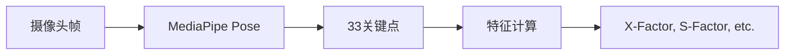
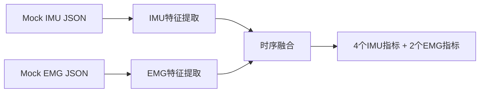
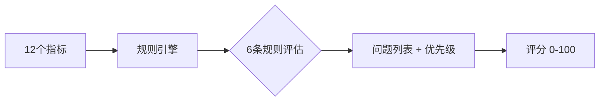
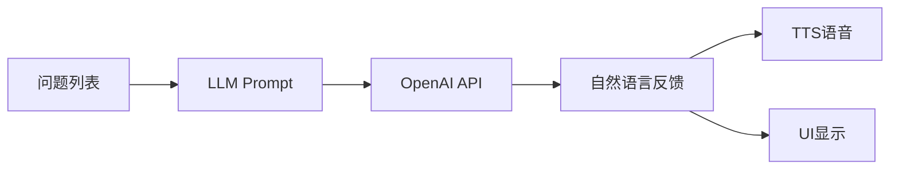

# 系统设计 System Design

> **文档角色**: 总纲 (Hub) - 系统核心设计文档，所有详细规格文档的入口
>
> **目标读者**: 技术负责人、新加入的团队成员、投资者
>
> **阅读时间**: 25分钟

---

## 0. 背景知识 (阅读前提)

在深入系统设计前，建议先了解高尔夫生物力学基础：

| 文档 | 内容 | 阅读时间 |
|------|------|----------|
| **[📖 生物力学入门](research/biomechanics-101.md)** | 7章从零开始学习高尔夫生物力学 | ~90分钟 |
| **[📚 生物力学术语表](research/biomechanics-glossary.md)** | 140+ 专业术语定义，团队沟通标准 | 按需查阅 |
| **[📊 生物力学基准值](research/biomechanics-benchmarks.md)** | 职业/业余选手研究验证的基准数据 | ~15分钟 |

> 💡 **快速入口**: 如果时间有限，至少读完 [生物力学入门](research/biomechanics-101.md) 的第1-3章。

---

## 1. MVP 定义

### 1.1 产品愿景

**一句话**: 基于 Vision + IMU + EMG 三模态融合的高尔夫挥杆分析系统，通过 AI 教练提供可执行的改进建议。

**核心差异化**: EMG 肌肉激活检测 — 竞品只能告诉你"什么错了"，我们能告诉你"为什么错了"。

### 1.2 MVP 范围

> 📐 **架构决策**: 4模块架构设计详见 [ADR-0004](decisions/0004-simplified-4-module-architecture.md)

| 功能 | MVP Phase 1 | Phase 2 | Phase 3 | 备注 |
|------|:-----------:|:-------:|:-------:|------|
| **Mode 1: Setup Check** | ✅ | - | - | 站位检测，<300ms |
| **Mode 2: Slow Motion** | ✅ | - | - | 慢动作实时反馈 |
| **Mode 3: Full Speed** | ✅ | - | - | 正常挥杆后分析 |
| MediaPipe 骨架叠加 | ✅ | - | - | 33关键点 |
| 8阶段挥杆检测 | ✅ | - | - | GolfDB标准 |
| 6条核心规则 | ✅ | - | - | P0-P1优先级 |
| Mock IMU 数据 | ✅ | - | - | 模拟100Hz |
| Mock EMG 数据 (Core+Forearm) | ✅ | - | - | 模拟500Hz，2通道 |
| LLM 反馈生成 | ✅ | - | - | OpenAI API |
| TTS 语音反馈 | ✅ | - | - | 系统TTS |
| Ghost Overlay (静态) | ⚠️ | ✅ | - | 可简化版 |
| Ghost Overlay (动态) | - | ✅ | - | 需DTW对齐 |
| 真实 IMU 硬件 | - | ✅ | - | LSM6DSV16X |
| 真实 EMG 硬件 (Core+Forearm) | - | ✅ | - | 2通道 DFRobot |
| 骨盆 IMU | - | ✅ | - | 运动链完整分析 |
| 臀肌 EMG (Gluteus) | - | ✅ | - | 下杆启动、髋部旋转 |
| 大腿内侧 EMG (Adductors) | - | ✅ | - | 下盘稳定、重心转移 |
| 背阔肌 EMG (Lats) | - | - | ✅ | 肩部旋转、拉杆动作 |
| 三角肌 EMG (Deltoids) | - | - | ✅ | 手臂举起、顶点位置 |

### 1.3 成功标准

| 指标 | 目标值 | 测量方法 |
|------|--------|----------|
| 8阶段检测准确率 | >70% | GolfDB视频测试 |
| 阶段检测误差 | <100ms | 与标注对比 |
| 端到端延迟 | <500ms | 从帧捕获到反馈 |
| 规则引擎准确率 | >80% | 教练人工验证 |
| 用户可理解反馈 | >80% 满意 | 用户测试 |

### 1.4 目标用户

**MVP 首批用户**: 15-25差点的业余球手，愿意使用科技改善挥杆，年龄25-55岁。

**非目标用户**: 职业球手（需求过专业）、完全初学者（需要更基础的教学）。

---

## 2. 核心指标清单

### 2.1 MVP 测量指标 (12个)

基于 [传感器指标映射](research/sensor-metric-mapping.md) 和 [生物力学基准值](research/biomechanics-benchmarks.md)。

> 🔍 **竞品对比**: 与 OnForm/Sportsbox 的指标差异见 [竞品指标对比](research/competitor-metrics-comparison.md)

#### Vision 指标 (MediaPipe 33关键点)

| 指标 | 检测方法 | 阈值 | 来源 |
|------|----------|------|------|
| **X-Factor** | 肩髋角度差 | >35° 良好 | TPI |
| **X-Factor Stretch** | 下杆期增量 | >5% | Meister |
| **Shoulder Turn** | 侧视角骨架 | 85-100° | TPI |
| **Hip Turn** | 侧视角骨架 | 40-55° | TPI |
| **S-Factor** | 肩部倾斜 | 30-40° | Meister |
| **Sway/Lift** | 3D轨迹 | <3" 侧移 | Research |

#### Mock IMU 指标

| 指标 | 检测方法 | 阈值 | 来源 |
|------|----------|------|------|
| **Peak Angular Velocity** | 直接测量 | >800°/s | Research |
| **Tempo Ratio** | 时序计算 | 2.5-3.5 (3:1) | Novosel |
| **Backswing Duration** | 事件检测 | 0.70-0.85s | Tour avg |
| **Downswing Duration** | 事件检测 | 0.25-0.30s | Tour avg |

#### Mock EMG 指标 (差异化能力)

| 指标 | 检测方法 | 阈值 | 来源 |
|------|----------|------|------|
| **Core Activation %** | RMS包络 | >50% MVC | Research |
| **Core-Forearm Timing** | onset差 | >20ms (核心先) | Cheetham |

### 2.2 MVP 规则引擎 (6条)

> 📋 **详细规格**: 规则的完整触发逻辑、反馈模式、延迟要求见 [实时反馈规格](real-time-feedback-spec.md)

#### P0 - 严重问题 (必须修正)

| # | 规则 | 条件 | 反馈示例 |
|---|------|------|----------|
| 1 | **倒序运动链** | EMG: 前臂先于核心激活 (gap < -20ms) | "你的手臂比身体先动了，试着让身体带动手臂" |
| 2 | **过度手臂挥杆** | EMG: Forearm/Core ratio > 1.3 | "感觉核心在发力，不是手臂在甩" |

#### P1 - 重要改进 (中等影响)

| # | 规则 | 条件 | 反馈示例 |
|---|------|------|----------|
| 3 | **差异角过小** | Vision: X-Factor < 20° | "肩膀再多转一点，感觉左肩对准下巴" |
| 4 | **节奏过快** | IMU: Downswing < 0.20s | "上杆再慢一点，心里数'1-2-3'" |
| 5 | **节奏过慢** | IMU: Downswing > 0.40s | "下杆可以更果断一点" |
| 6 | **早释放** | IMU: Wrist release < 40% downswing | "保持手腕角度到击球瞬间才释放" |

---

## 3. 构建顺序

> **相关文档**:
>
> - [8阶段挥杆检测](swing-phases.md) - 阶段划分算法与代码实现
> - [挥杆对比策略](swing-comparison.md) - 4种对比方法 (Pro/Personal Best/Statistical/Learned)
> - [实时反馈规格](real-time-feedback-spec.md) - 3种反馈模式详细规格
> - [MVP 原型代码](../platform/mvp-prototype-code.md) - 无硬件测试指南

### 3.1 Phase 1: Vision Pipeline (Week 1-2)

**任务清单**:

- [ ] MediaPipe 集成 (ThinkSys Flutter plugin)
- [ ] 33关键点提取 → 6个Vision指标计算
- [ ] 8阶段检测算法实现
- [ ] GolfDB视频测试 (准确率 >70%)

**验收标准**: 能在GolfDB视频上检测8阶段，误差 <100ms。

### 3.2 Phase 2: Mock Sensor Integration (Week 3)

**任务清单**:

- [ ] Mock IMU 数据生成 (基于研究数据)
- [ ] Mock EMG 数据生成 (基于研究数据)
- [ ] IMU 特征提取: 峰值角速度、节奏比、时长
- [ ] EMG 特征提取: 核心激活%、时序差
- [ ] 时间同步对齐

**验收标准**: Mock数据能产生合理的12个指标值。

### 3.3 Phase 3: Rule Engine + Scoring (Week 4)

**任务清单**:

- [ ] 6条规则实现 (IF-THEN)
- [ ] 优先级排序 (P0 > P1)
- [ ] 评分算法 (基于规则违反程度)
- [ ] 教练人工验证 (准确率 >80%)

**验收标准**: 规则引擎输出与教练判断一致率 >80%。

### 3.4 Phase 4: Feedback System (Week 5)

**任务清单**:

- [ ] LLM Prompt 模板设计 (规则判断 → 自然语言)
- [ ] OpenAI API 集成
- [ ] TTS 集成 (flutter_tts)
- [ ] 反馈语言用户测试

**验收标准**: 用户理解并认可反馈内容 >80%。

### 3.5 Phase 5: Mobile App Shell (Week 6-7)

**任务清单**:

- [ ] 摄像头实时预览 + 骨架叠加
- [ ] 3种反馈模式 UI 切换
- [ ] 历史记录存储
- [ ] BLE 框架 (为硬件准备)

**验收标准**: 60 FPS骨架叠加，内存 <500MB。

### 3.6 Phase 6: User Testing (Week 8)

**任务清单**:

- [ ] 招募 5-10 名目标用户
- [ ] 定义测试场景
- [ ] 收集反馈
- [ ] 迭代修复

---

## 4. 技术栈

> **相关文档**:
>
> - [SDK 选型](sdk-selection.md) - MediaPipe/NeuroKit2/imufusion 等 SDK 对比
> - [机器学习基础](ml-basics.md) - 挥杆分析 ML 模型入门

### 4.1 确认的技术选型

| 层级 | 技术 | 决策依据 |
|------|------|----------|
| **项目结构** | 多仓库 (5 repos) | [ADR-0001](decisions/0001-multi-repo-structure.md) |
| **移动端** | Flutter 3.x | [ADR-0003](decisions/0003-flutter-mobile.md) |
| **姿态估计** | MediaPipe Pose (ThinkSys plugin) | iOS可用，33关键点 |
| **MCU** | ESP32-S3 | [ADR-0005](decisions/0005-esp32-s3-microcontroller.md) |
| **IMU** | LSM6DSV16X | [ADR-0002](decisions/0002-lsm6dsv16x-imu.md) |
| **ML推理** | ONNX Runtime Mobile | [ADR-0006](decisions/0006-onnx-runtime-deployment.md) |
| **LLM** | OpenAI GPT-4o-mini | 成本低，速度快 |
| **TTS** | flutter_tts (系统) | 开箱即用 |

### 4.2 MVP 简化策略

| 组件 | MVP方案 | 后期升级 |
|------|---------|----------|
| 姿态估计 | MediaPipe Pose | RTMPose → ViTPose++ |
| EMG处理 | NeuroKit2 | 自定义滤波 |
| 分析引擎 | 规则引擎 IF-THEN | ML分类器 |
| 可视化 | OpenCV + MediaPipe | Unity 3D |
| 语音反馈 | 系统TTS | OpenAI TTS |

---

## 5. 测试策略

### 5.1 单元测试

| 模块 | 测试内容 | 工具 |
|------|----------|------|
| 特征计算 | X-Factor计算正确性 | pytest |
| 阶段检测 | 8阶段边界识别 | pytest + GolfDB |
| 规则引擎 | 每条规则触发条件 | pytest |

### 5.2 集成测试

| 场景 | 输入 | 预期输出 |
|------|------|----------|
| 正常挥杆 | GolfDB视频 | 8阶段 + 评分 |
| 问题挥杆 | 模拟问题数据 | 正确诊断 + 反馈 |

### 5.3 用户验证

| 阶段 | 参与者 | 验证内容 |
|------|--------|----------|
| Alpha | 3名内部 | 功能完整性 |
| Beta | 5-10名用户 | 反馈可理解性 |
| Golf Advisor | 1-2名教练 | 规则阈值准确性 |

### 5.4 基准数据

- **GolfDB**: 1400个标注挥杆视频
- **研究数据**: 职业/业余基准值 (见 [biomechanics-benchmarks.md](research/biomechanics-benchmarks.md))

---

## 6. 文档索引

### 推荐阅读顺序

#### 第一步: 理解总体架构

- **[本文档]** system-design.md ← 你在这里

#### 第二步: 理解核心算法

- **[8阶段检测](swing-phases.md)** - 挥杆阶段识别算法，含代码
- **[挥杆对比](swing-comparison.md)** - 4种对比方法，DTW算法
- **[实时反馈](real-time-feedback-spec.md)** - 3种反馈模式规格

#### 第三步: 理解数据来源

- **[传感器映射](research/sensor-metric-mapping.md)** - 哪个传感器测什么
- **[生物力学基准](research/biomechanics-benchmarks.md)** - 阈值数据来源
- **[生物力学术语](research/biomechanics-glossary.md)** - 140+术语定义

#### 角色专属入口

| 角色 | Brief | 主要任务 |
|------|-------|----------|
| 软件工程师 | [briefs/software-engineer.md](briefs/software-engineer.md) | 算法管道实现 |
| 移动开发者 | [briefs/mobile-developer.md](briefs/mobile-developer.md) | Flutter App |
| 硬件工程师 | [briefs/hardware-engineer.md](briefs/hardware-engineer.md) | 传感器原型 |
| 高尔夫顾问 | [briefs/golf-advisor.md](briefs/golf-advisor.md) | 规则验证 |

---

## 7. 未来路线图 (Phase 2+)

MVP 完成后的技术储备和扩展方向：

| 方向 | 文档 | 内容 |
|------|------|------|
| **个性化调优** | [个性化规格](personalization-spec.md) | 按性别/年龄/体型调整阈值 |
| **调试可视化** | [可视化工具评估](research/visualization-tools-evaluation.md) | Rerun 多模态调试、TAPIR 球杆追踪 |

> 💡 **亮点发现**: [Rerun.io](https://rerun.io) 支持 Vision+IMU+EMG 同时间轴可视化，是我们的首选调试工具。[TAPIR](https://github.com/google-deepmind/tapnet) 可实现球杆头追踪，用软件替代 $5000+ 的 Trackman 雷达。

---

## 8. 待解决问题

### 8.1 需要验证的假设

| 假设 | 验证方法 | 负责人 |
|------|----------|--------|
| MediaPipe 33关键点足够计算X-Factor | GolfDB测试 | 软件工程师 |
| Mock EMG数据能代表真实模式 | 与研究数据对比 | 软件工程师 |
| 用户能理解LLM生成的反馈 | 用户测试 | 产品 |
| 6条规则覆盖主要问题 | 教练评审 | 高尔夫顾问 |

### 8.2 需要做的决策

| 决策 | 选项 | 截止日期 |
|------|------|----------|
| Ghost Overlay 是否在MVP | Yes (简化版) / No | Week 2 |
| LLM Provider | OpenAI / Claude / 本地 | Week 4 |
| 是否支持录制保存 | Yes / No | Week 5 |

### 8.3 已知风险

| 风险 | 影响 | 缓解措施 |
|------|------|----------|
| MediaPipe iOS性能不足 | 帧率低 | 降低分辨率，使用GPU |
| EMG真实数据与Mock差异大 | 规则需重调 | Phase 2验证 |
| 用户不接受穿戴设备 | 产品定位失败 | 先验证纯Vision版本 |

---

## 9. 版本历史

| 版本 | 日期 | 修改内容 |
|------|------|----------|
| 1.0 | 2025-12-18 | 初始版本，整合所有详细规格 |

---

**最后更新**: 2025-12-18
**维护者**: Movement Chain AI Team
