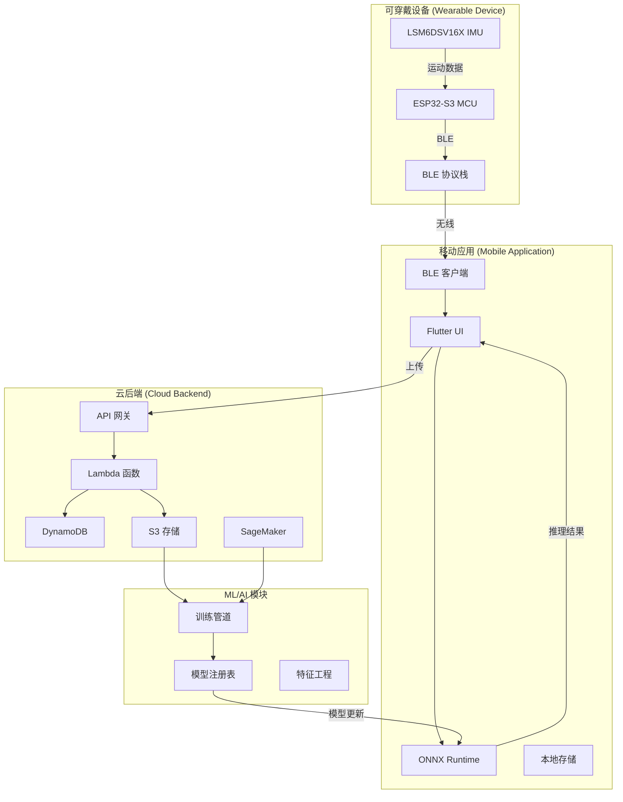

# Movement Chain AI 文档

## 系统愿景 (System Vision)

Movement Chain AI 是一个全面的多模态运动训练系统，旨在为运动动作提供实时、智能的反馈。系统最初针对高尔夫挥杆分析和健身动作纠正，结合了前沿的可穿戴传感器技术和先进的机器学习，提供即时、可操作的洞察，帮助用户改进技术和表现。

### 核心能力 (Core Capabilities)

- **实时运动分析 (Real-time Movement Analysis)**: 对运动模式提供即时反馈，延迟小于100毫秒
- **多模态 AI 处理 (Multimodal AI Processing)**: 结合 IMU 传感器数据与视频和音频输入
- **个性化训练 (Personalized Training)**: 从个人运动模式中学习的自适应机器学习模型
- **跨平台体验 (Cross-Platform Experience)**: iOS 和 Android 上的无缝移动应用集成
- **可扩展架构 (Scalable Architecture)**: 支持数千并发用户的云原生设计

---

## 系统架构概览 (System Architecture Overview)

Movement Chain AI 采用 **4 模块架构**，专为可扩展性、可维护性和性能而设计：

### 模块分解 (Module Breakdown)

#### 1. 可穿戴设备模块 (Wearable Device Module)

**目的**: 以最小延迟捕获高频运动数据

- **MCU**: ESP32-S3 (双核, BLE 5.0)
- **IMU 传感器**: LSM6DSV16X (6轴, 最高 8kHz 采样)
- **通信**: 蓝牙低功耗 5.0
- **电池续航**: 8+ 小时连续使用
- **外形尺寸**: 腕戴设备 (<50g)

[查看硬件决策记录 →](design/decisions/0002-lsm6dsv16x-imu.md)

#### 2. 移动应用模块 (Mobile Application Module)

**目的**: 提供直观的用户界面和边缘 AI 推理

- **框架**: Flutter (跨平台 iOS/Android)
- **ML 运行时**: ONNX Runtime Mobile
- **功能**: 实时可视化、离线模式、训练跟踪
- **推理**: 设备端机器学习，反馈延迟 <100ms
- **存储**: 本地 SQLite + 云同步

[查看移动框架决策 →](design/decisions/0003-flutter-mobile.md)

#### 3. 云后端模块 (Cloud Backend Module)

**目的**: 可扩展的数据处理和长期存储

- **架构**: AWS Serverless (API Gateway + Lambda + DynamoDB)
- **存储**: 原始传感器数据使用 S3，元数据使用 DynamoDB
- **API**: REST + GraphQL 灵活数据访问
- **认证**: Cognito 用户管理
- **扩展性**: 自动扩展以处理 10k+ 并发用户

[查看集成模式 →](design/03-integration-patterns.md)

#### 4. ML/AI 模块

**目的**: 训练和优化运动分析模型

- **训练**: AWS SageMaker 分布式训练
- **框架**: PyTorch → ONNX 导出管道
- **模型**: 基于 Transformer 的序列模型 + CNN
- **注册表**: 集中式模型版本控制和 A/B 测试
- **管道**: 基于新标注数据的自动重训练

[查看 ONNX Runtime 决策 →](design/decisions/0006-onnx-runtime-deployment.md)

---

## 导航指南 (Navigation Guide)

### 系统架构师 (For System Architects)

从 **系统设计** 部分开始了解整体系统设计：

- [系统概览](design/01-system-overview.md) - 组件交互和职责
- [数据流](design/02-data-flow.md) - 数据如何在系统中流动
- [性能目标](design/04-performance-targets.md) - SLA 和可扩展性目标

### 开发人员 (For Developers)

查看 **架构决策** 了解关键技术选择：

- [ADR-0004: 4 模块架构](design/decisions/0004-simplified-4-module-architecture.md) - 为什么选择这种结构
- [ADR-0001: 多仓库结构](design/decisions/0001-multi-repo-structure.md) - 代码组织策略
- [ADR-0006: ONNX Runtime](design/decisions/0006-onnx-runtime-deployment.md) - ML 部署方法

### 硬件工程师 (For Hardware Engineers)

探索 **硬件组件** 部分获取详细信息：

- [IMU 硬件](components/imu/hardware.md) - 惯性测量单元
- [MCU 硬件](components/mcu/hardware.md) - 微控制器选型
- [硬件对比](research/comparisons/hardware-comparison.md) - MCU 和 IMU 评估

### 机器学习工程师 (For ML Engineers)

关注 ML 特定架构和决策：

- [视觉软件](components/vision/software.md) - 姿态估计和 RTMPose
- [ML 训练](platform/ml-training/datasets.md) - 数据集与基准测试
- [模型部署策略](design/decisions/0006-onnx-runtime-deployment.md) - 为什么选择 ONNX Runtime

---

## 快速链接 (Quick Links)

### 关键架构文档 (Key Architecture Documents)

- [系统概览](design/01-system-overview.md)
- [数据流图](design/02-data-flow.md)
- [集成模式](design/03-integration-patterns.md)

### 关键设计决策 (Critical Design Decisions)

- [4 模块架构理由](design/decisions/0004-simplified-4-module-architecture.md)
- [ESP32-S3 选型](design/decisions/0005-esp32-s3-microcontroller.md)
- [Flutter 移动框架](design/decisions/0003-flutter-mobile.md)

### 技术比较 (Technical Comparisons)

- [MCU 比较矩阵](research/comparisons/hardware-comparison.md)
- [ML 框架分析](research/comparisons/ml-frameworks-comparison.md)
- [移动框架评估](research/comparisons/mobile-frameworks-comparison.md)

---

## 项目状态 (Project Status)

!!! info "文档状态"
    本文档正在积极维护，反映了 2025 年 12 月的当前系统架构。

**当前阶段**: 架构设计与文档编写

**已完成里程碑**:

- [x] 高层系统架构
- [x] 硬件组件选型
- [x] 移动框架评估
- [x] ML 部署策略
- [x] 云基础设施设计

**进行中**:

- [ ] 详细 API 规范
- [ ] 安全与合规文档
- [ ] 部署运维手册
- [ ] 性能基准测试

**即将开始**:

- [ ] 开发者入门指南
- [ ] API 参考文档
- [ ] 故障排查指南

---

## 贡献 (Contributing)

我们欢迎贡献以改进本文档。请参阅仓库 README 了解贡献指南。

**快速贡献检查清单**:

1. Fork 仓库
2. 创建功能分支
3. 使用 `mkdocs serve` 本地测试
4. 提交清晰描述的 Pull Request

---

## 支持 (Support)

如果您对架构或文档有疑问：

- 查看现有的 [架构决策记录 (Architectural Decision Records)](design/decisions/index.md)
- 查看 [FAQ 部分](research/comparisons/hardware-comparison.md) (即将推出)

---

**Movement Chain AI** | [GitHub](https://github.com/movement-chain-ai)

*构建智能运动训练的未来*

