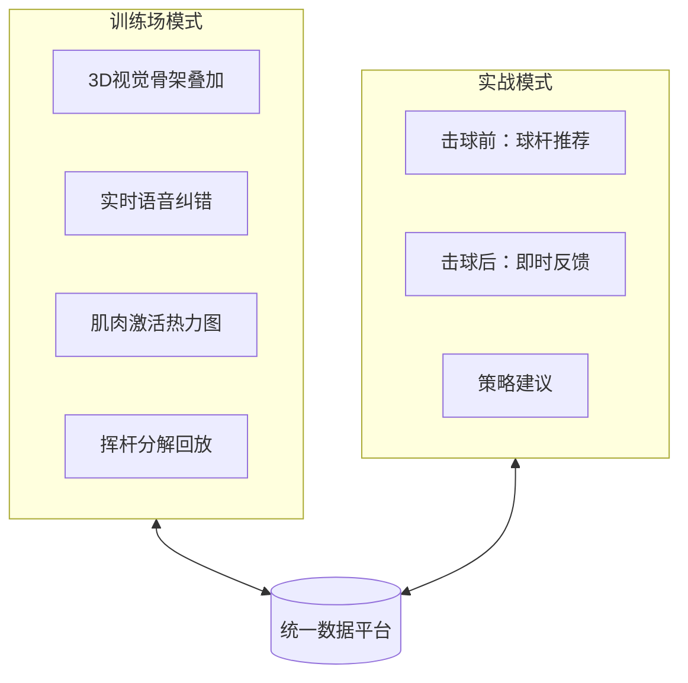
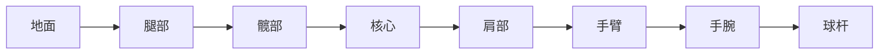
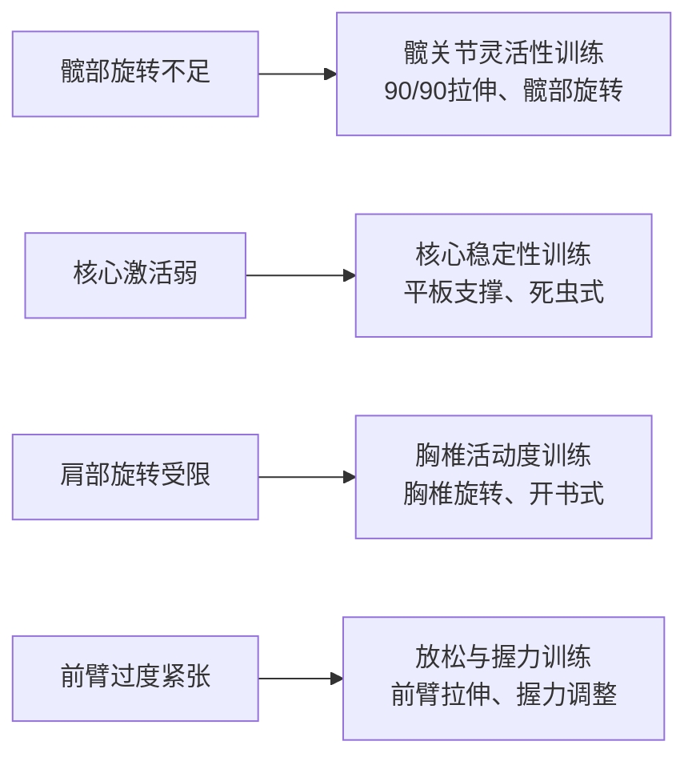
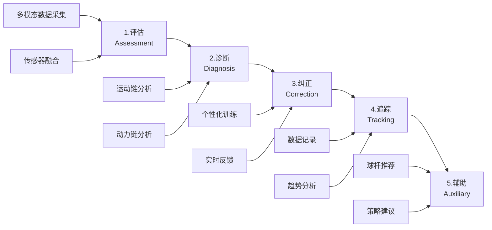

# 产品战略：从市场缺口到设计决策

> **核心命题**: 每一个产品决策都必须对应一个真实的市场痛点

---

## 决策导航

| # | 决策 | 解决痛点 |
|---|------|----------|
| 1 | [双模式架构](#决策1双模式架构) | 练习场和球场数据孤岛，无产品能打通两者 |
| 2 | [三模态传感融合](#决策2三模态传感融合) | 只知道"错了"，不知道"为什么错" |
| 3 | [多模态反馈系统](#决策3多模态反馈系统) | 实战时无法看手机，需要免视觉反馈 |
| 4 | [AI教练 + AI球童](#决策4ai教练--ai球童) | 50个数据点看不懂，需要可执行建议 |
| 5 | [场下训练理念](#决策5场下训练理念) | "转肩不够"但不知道如何改善身体条件 |
| 6 | [借用优先策略](#决策6借用优先策略) | MVP快速验证，3-4个月上线 |

---

## 决策1：双模式架构

!!! warning "市场缺口"
    没有产品能同时覆盖训练场和球场，更没有数据打通。

| 竞品 | 训练场 | 实战 | 数据打通 |
|------|--------|------|----------|
| HackMotion | ✅ | ❌ | - |
| Sportsbox AI | ✅ | ❌ | - |
| Arccos | ❌ | ✅ | - |
| **我们** | ✅ | ✅ | ✅ |

!!! quote "用户原话"
    "There's next to nothing that connects what happens in your personal hitting bay with what happens on the golf course." — MyGolfSpy

### 双模式对比



| 组件 | 训练场模式 | 实战模式 |
|------|------------|----------|
| 视觉系统 | 手机摄像头 + RTMPose | 可选 |
| IMU系统 | 全量数据采集 | 精简采集 |
| EMG系统 | 肌肉时序分析 | 疲劳监测 |
| 反馈延迟 | <500ms | <200ms |
| 电池优化 | 标准模式 | 低功耗模式 |

---

## 决策2：三模态传感融合

!!! tip "关键洞察"
    EMG 是市场上**唯一未被开发**的数据维度，0家竞品提供肌肉激活数据。

| 竞品 | IMU | EMG | Vision | 数据维度 |
|------|-----|-----|--------|----------|
| HackMotion | ✅ | ❌ | ❌ | 手腕角度 |
| SwingMotion | ✅ | ❌ | ❌ | 挥杆速度 |
| Sportsbox AI | ❌ | ❌ | ✅ | 全身姿态 |
| K-Motion | ✅ | ❌ | ❌ | 运动链 |
| **我们** | ✅ | ✅ | ✅ | **全维度** |

### 三模态价值

| 指标 | IMU (怎么动) | EMG (怎么用力) | Vision (动作形态) |
|------|--------------|----------------|-------------------|
| 速度/角度 | ⭐⭐⭐ | ⭐ | ⭐⭐ |
| 力量时序 | ⭐ | ⭐⭐⭐ | ❌ |
| 肌肉激活 | ❌ | ⭐⭐⭐ | ❌ |
| 全身姿态 | ⭐ | ⭐ | ⭐⭐⭐ |
| 发力顺序 | ⭐ | ⭐⭐⭐ | ⭐ |

### EMG 运动链分析



!!! info "EMG 监测肌群"
    - **下肢**: 臀大肌、股四头肌 (启动旋转、重心转移)
    - **核心**: 腹斜肌、竖脊肌 (力量传递枢纽)
    - **上肢**: 背阔肌、三角肌 (转体和挥杆)
    - **前臂**: 屈腕肌群、伸腕肌群 (球杆控制)

| 场景 | 无EMG | 有EMG (全身运动链) |
|------|-------|-------------------|
| 力量过大 | 只知道"挥太快" | 诊断"核心激活弱导致手臂代偿" |
| 发力顺序错 | 只知道"不协调" | 精确显示"髋→核心→肩→臂"时序 |
| 疲劳累积 | 无法检测 | 识别"核心疲劳导致全身代偿" |
| 受伤风险 | 事后才知道 | 预测"髋部活动度不足导致腰部过载" |

---

## 决策3：多模态反馈系统

!!! quote "用户原话"
    "I don't want to look at my phone between shots. Just tell me what I did wrong." — Reddit r/golf

| 竞品 | 视觉 | 语音 | 触觉 | 实时性 |
|------|------|------|------|--------|
| HackMotion | ✅ | ❌ | ✅ | ⭐⭐ |
| Sportsbox AI | ✅ | ❌ | ❌ | ❌ |
| deWiz | ✅ | ✅ | ✅ | ⭐⭐⭐ |
| **我们** | ✅ | ✅ | ✅ | ⭐⭐⭐ |

### 反馈设计原则

| 原则 | 说明 |
|------|------|
| **场景决定模态** | 训练场→视觉为主，实战→语音为主，静默→触觉为主 |
| **信息密度递减** | 视觉(高) → 语音(中) → 触觉(低) |
| **认知负荷最小化** | ❌ "挥杆速度102mph..." → ✅ "太快了，放慢20%" |

| 反馈类型 | 触发时机 | 示例 |
|----------|----------|------|
| 即时纠正 | 检测到问题 | "手腕太紧了" |
| 鼓励 | 动作改善时 | "很好，保持" |
| 策略 | 击球前 | "这个距离建议7号铁" |
| 总结 | 回合结束 | "今天前臂发力时机改善明显" |

---

## 决策4：AI教练 + AI球童

!!! warning "市场缺口"
    用户有50个数据点，但不知道该怎么办。

| 功能 | 现有产品 | 用户期望 | 缺口 |
|------|----------|----------|------|
| 数据展示 | ✅ 都有 | 理解数据含义 | 🔴 |
| 问题诊断 | 部分有 | 知道如何改正 | 🔴 |
| 个性化建议 | 很少 | 针对我的情况 | 🔴 |
| 球场策略 | Arccos有 | 结合挥杆数据 | 🔴 |

### AI 双角色设计

| 维度 | AI 教练 (训练场) | AI 球童 (实战) |
|------|------------------|----------------|
| **职责** | 动作诊断、训练计划、实时纠正 | 球杆选择、场地策略、击球复盘 |
| **交互风格** | 详细解释、鼓励为主 | 简洁直接、信心建设 |
| **数据使用** | 完整挥杆数据、肌肉激活分析 | 历史击球统计、环境因素 |
| **示例输出** | "你的下杆启动时，右肩提前打开，试试保持背对目标更久一点" | "135码逆风，根据你的7铁均距，建议打6铁80%力量" |

---

## 决策5：场下训练理念

!!! tip "关键洞察"
    在练习场挥杆练习是不够的，要真正进步需要场下训练来改善身体条件。

| 现有产品做法 | 问题 |
|--------------|------|
| 只分析挥杆动作 | 无法解决身体限制问题 |
| 建议"转肩不够" | 用户不知道如何改善 |
| 输出数据报告 | 缺乏可执行的训练计划 |

### 场下训练推荐



| 维度 | 竞品做法 | 我们的方案 |
|------|----------|------------|
| 分析范围 | 只看挥杆 | 挥杆 + 身体条件评估 |
| 输出内容 | 数据报告 | 数据 + 可执行训练计划 |
| 改进路径 | "多练习" | 针对性场下训练 |

---

## 决策6：借用优先策略

!!! info "MVP 技术哲学"
    **Phase 1**: 能借用的就借用 → 快速验证产品价值
    **Phase 2+**: 做精的时候替换 → 根据需求升级组件

### MVP 组件选型

| 组件 | MVP 方案 | 可用性 | 后期升级 |
|------|----------|--------|----------|
| 姿态估计 | MediaPipe Pose | ✅ 开箱即用 | RTMPose → ViTPose++ |
| EMG 处理 | NeuroKit2 | ✅ 开箱即用 | 自定义滤波 |
| 分析引擎 | 规则引擎 IF-THEN | 🛠️ 简单代码 | ML 分类器 |
| 可视化 | OpenCV + MediaPipe | ✅ 开箱即用 | Unity 3D |
| 语音反馈 | 系统 TTS | ✅ 开箱即用 | OpenAI TTS |
| LLM 教练 | OpenAI/Claude API | ✅ API 调用 | 微调模型 |

### 借用 vs 自建原则

| 能力类型 | 策略 | 示例 |
|----------|------|------|
| **通用能力** | 借用成熟方案 | 姿态估计、EMG处理 |
| **差异化能力** | 自己开发 | 融合逻辑、规则引擎 |

!!! tip "战略意义"
    "借用优先" 策略让我们可以在 **3-4 个月内发布 MVP**，快速验证市场。

---

## 系统架构



### 模块职责

| 模块 | 功能 | 输入 | 输出 |
|------|------|------|------|
| **评估** | 多模态数据采集+融合 | IMU/EMG/Vision | 统一时序数据 |
| **诊断** | 运动链+动力链分析 | 融合数据 | 问题列表+优先级 |
| **纠正** | 个性化训练+实时反馈 | 诊断结果 | 语音/视觉/触觉反馈 |
| **追踪** | 数据记录+趋势分析 | 历史数据 | 进步曲线+洞察 |
| **辅助** | 球杆推荐+策略建议 | 环境+历史 | AI球童输出 |

---

## 定价策略

### 竞品定价

| 竞品 | 硬件价格 | 订阅 |
|------|----------|------|
| SwingMotion | $358 | - |
| HackMotion | $345-995 | $99/年 |
| Sportsbox AI | - | $200/年 |
| K-Motion | $3,000+ | - |

### 我们的定价

**硬件 (一次性)**:

| 版本 | 价格 | 包含内容 |
|------|------|----------|
| 标准版 | $99 | IMU + Vision |
| 专业版 | $149 | IMU + Vision + EMG |

**订阅 (软件)**:

| 服务 | 年费 | 内容 |
|------|------|------|
| 基础版 | 免费 | 基础数据记录、挥杆回放 |
| Pro版 | $99/年 | AI实时分析、个性化训练、云同步 |
| 教练版 | $188/年 | Pro + 多学员管理 |

!!! info "价值对比"
    **我们**: 硬件 $99-149 + 订阅 $99/年 = **$198-248 第一年**
    **HackMotion**: 硬件 $345 + 订阅 $99/年 = $444 第一年

---

## 差异化总结

| 维度 | 竞品现状 | 我们的方案 | 用户价值 |
|------|----------|------------|----------|
| 数据维度 | 单一 (IMU或Vision) | 三模态融合 | 全面了解挥杆 |
| 使用场景 | 训练 OR 实战 | 训练 AND 实战 | 一个设备全覆盖 |
| 反馈方式 | 视觉为主 | 视觉+语音+触觉 | 场景最优反馈 |
| EMG数据 | 0家有 | ✅ 有 | 了解肌肉发力 |
| 价格 | $345-3000 | $99-149 | 高性价比 |

### 竞争壁垒

!!! success "三重壁垒"
    **技术壁垒**: EMG传感器集成 (1年+研发)、三模态融合算法、边缘AI部署
    **数据壁垒**: 用户训练数据积累、挥杆-成绩关联、个性化模型
    **市场壁垒**: 先发优势、教练网络、用户社区

---

## 产品路线图

> **核心原则**: 每个阶段都要产出可验证价值的产品

### 路线图概览

```text
┌─────────────────────────────────────────────────────────────────────────────┐
│                        Movement Chain AI 产品路线图                          │
├─────────────────────────────────────────────────────────────────────────────┤
│                                                                              │
│  Phase 1                Phase 2                Phase 3                       │
│  MVP                    增强版                  完整版                        │
│  ────────               ────────               ────────                      │
│                                                                              │
│  ┌─────────┐           ┌─────────┐           ┌─────────┐                   │
│  │训练场模式│           │+ 实战模式│           │+ AI球童 │                   │
│  │IMU+Vision│     →    │+ EMG传感│      →    │+ 社区   │                   │
│  │基础反馈  │           │+ 触觉反馈│           │+ B2B    │                   │
│  └─────────┘           └─────────┘           └─────────┘                   │
│                                                                              │
│  验证:                  扩展:                  规模化:                        │
│  • 核心价值             • 差异化               • 商业化                       │
│  • 技术可行性           • 用户留存             • 市场份额                      │
│                                                                              │
└─────────────────────────────────────────────────────────────────────────────┘
```

### Phase 1: MVP

**目标**: 验证核心价值主张 — 实时挥杆反馈能帮助用户改善动作

| 功能 | 描述 | 优先级 |
|-----|------|-------|
| **训练场模式** | 固定摄像头 + 可穿戴IMU | P0 |
| **实时骨架** | 3D骨架叠加到视频 | P0 |
| **语音反馈** | 基础问题即时纠正 | P0 |
| **挥杆评分** | 综合评分 + 分项指标 | P0 |
| **历史记录** | 本地挥杆存储和回顾 | P1 |
| **简单对比** | 与上次挥杆对比 | P1 |

**硬件配置**: ESP32-S3 + ICM-42688-P 6轴IMU + 250mAh电池 + BLE 5.0 (~$15 BOM, 售价 ¥699)

**关键里程碑**:

| 里程碑 | 交付物 | 验收标准 |
|-------|-------|---------|
| M1.1 | IMU原型 | BLE稳定传输100Hz数据 |
| M1.2 | 姿态估计 | 17关键点, <50ms延迟 |
| M1.3 | 挥杆检测 | >95%准确率 |
| M1.4 | Alpha版 | 5人内测通过 |
| M1.5 | Beta版 | 30人测试满意度>4.0 |
| M1.6 | 正式发布 | App Store上架 |

**成功指标**:

| 指标 | 目标 | 测量方法 |
|-----|------|---------|
| 技术可行性 | 端到端<500ms | 实测 |
| 用户满意度 | >4.0/5.0 | Beta调研 |
| 核心功能使用 | >80%用户使用 | 埋点 |
| 7日留存 | >50% | 分析 |

### Phase 2: 增强版

**目标**: 建立差异化壁垒 — EMG数据 + 双模式 + 触觉反馈

| 功能 | 描述 | 市场差异化 |
|-----|------|-----------|
| **EMG传感** | 肌肉激活检测 | 市场唯一 |
| **实战模式** | 球场简化反馈 | 竞品缺失 |
| **触觉反馈** | 振动马达提示 | 增强体验 |
| **3D挥杆** | 单目3D姿态估计 | 技术升级 |
| **训练计划** | AI个性化建议 | 增值服务 |
| **数据同步** | 云端存储 | 跨设备 |

**防弃用功能 (Anti-abandonment)**:

> 研究发现高尔夫训练设备普遍在购买后2-4周被用户闲置。这些功能旨在提高长期使用率，但不是MVP核心。

| 功能 | 描述 | 说明 |
|-----|------|------|
| 每日挑战 | "今天完成10次挥杆" | 类似健身App |
| 连续打卡 | Duolingo streak机制 | 习惯养成 |
| 进步徽章 | "本周进步最大"等成就 | 正向激励 |
| 朋友排行榜 | 社交比较和激励 | 病毒传播 |
| 周报总结 | 每周推送进步报告 | 保持关注 |

**EMG模块**: ADS1299 8通道EMG AFE + 干电极 (新增成本 ~$25, 售价 ¥1,499)

**实战模式设计**:

```text
击球前 (可选): "135码，根据你的数据，建议7铁"
击球后 (自动): "外挥，下次从内侧下杆" (仅语音/振动)
回合结束: 完整数据同步，详细复盘
```

### Phase 3: 完整版

**目标**: 规模化与商业化 — AI球童 + 社区 + B2B

| 功能 | 描述 | 商业价值 |
|-----|------|---------|
| **AI球童** | 场上策略建议 | 核心差异化 |
| **智能球杆推荐** | 基于历史数据 | 用户粘性 |
| **社区功能** | 排行榜、挑战赛 | 病毒传播 |
| **教练版** | 多学员管理 | B2B收入 |
| **Android版** | 扩大用户基础 | 市场覆盖 |
| **多语言** | 英语、日语、韩语 | 国际化 |

**AI球童功能**:

| 功能 | 输入 | 输出示例 |
|-----|------|---------|
| 球杆推荐 | 距离 + 风向 + 地形 + 个人历史 | "建议6铁，80%力量" |
| 策略规划 | 球道布局 + 障碍物 + 能力评估 | "第一杆打到这里最安全" |
| 心理辅导 | 连续失误检测 | "放轻松，深呼吸" |
| 实时复盘 | 刚才的挥杆数据 | "刚才那杆外挥了" |

**B2B产品线**:

| 产品 | 目标客户 | 定价 |
|-----|---------|------|
| 教练版 | 个人教练 | ¥299/月 |
| 学院版 | 高尔夫学校 | ¥999/月 + 设备 |
| 球场版 | 高尔夫球场 | 定制 |

---

## 技术演进路线

### 算法演进

```text
Phase 1          Phase 2           Phase 3
────────          ────────          ────────

姿态估计:
RTMPose 2D   →   RTMPose 3D    →   多视角融合
17关键点         + 深度估计         高精度3D

挥杆分析:
规则引擎     →   规则 + ML      →   端到端DL
基础诊断         混合诊断           自动诊断

个性化:
无           →   简单个性化     →   完整用户画像
                 历史数据           AI推荐引擎
```

### 硬件演进

```text
Phase 1          Phase 2           Phase 3
────────          ────────          ────────

传感器:
6轴 IMU      →   + 2ch EMG      →   + 更多通道
($15 BOM)        ($40 BOM)          ($50 BOM)

形态:
腕带/手套    →   腕带+臂带      →   智能手套
                 (分体式)           (一体式)

反馈:
无           →   振动马达       →   多点触觉
                 (1个)              (阵列)
```

---

## 风险评估

### Phase 1 风险

| 风险 | 概率 | 影响 | 缓解措施 |
|-----|------|------|---------|
| 姿态估计精度不足 | 中 | 高 | 备选方案: MediaPipe |
| IMU漂移严重 | 低 | 中 | 增加校准频率 |
| 用户不理解数据 | 中 | 高 | 简化指标 + 语音解释 |
| App审核被拒 | 低 | 中 | 提前了解政策 |

### Phase 2 风险

| 风险 | 概率 | 影响 | 缓解措施 |
|-----|------|------|---------|
| EMG信号噪声大 | 中 | 高 | 干电极优化 + 滤波算法 |
| 实战模式无人用 | 中 | 中 | 用户调研验证 |
| 成本上升过多 | 低 | 中 | 供应链优化 |

### Phase 3 风险

| 风险 | 概率 | 影响 | 缓解措施 |
|-----|------|------|---------|
| AI球童不准确 | 中 | 高 | 大量数据训练 |
| B2B销售困难 | 中 | 中 | 种子客户 + 案例积累 |
| 国际化本地化 | 低 | 中 | 本地团队/合作伙伴 |

---

## 资源规划

### 团队配置

| 阶段 | 硬件 | 软件 | 算法 | 产品 | 运营 | 总计 |
|-----|------|------|------|------|------|------|
| Phase 1 | 1 | 2 | 1 | 1 | 0 | 5人 |
| Phase 2 | 2 | 3 | 2 | 1 | 1 | 9人 |
| Phase 3 | 2 | 5 | 3 | 2 | 3 | 15人 |

### 预算估算

| 阶段 | 研发 | 硬件 | 运营 | 总计 |
|-----|------|------|------|------|
| Phase 1 | ¥80万 | ¥20万 | ¥10万 | ¥110万 |
| Phase 2 | ¥150万 | ¥50万 | ¥50万 | ¥250万 |
| Phase 3 | ¥300万 | ¥100万 | ¥200万 | ¥600万 |

---

## 决策节点

### Phase 1 → Phase 2 决策

| 条件 | 阈值 | 说明 |
|-----|------|------|
| 用户满意度 | >4.0/5.0 | 核心价值验证 |
| 7日留存 | >40% | 产品粘性 |
| 技术可行性 | 全部通过 | 无阻塞问题 |
| 资金到位 | >¥200万 | 融资或收入 |

### Phase 2 → Phase 3 决策

| 条件 | 阈值 | 说明 |
|-----|------|------|
| 付费用户 | >1000人 | 商业化验证 |
| 月收入 | >¥50万 | 财务可持续 |
| NPS | >30 | 用户推荐意愿 |
| EMG功能使用 | >50% | 差异化验证 |

---

## 相关文档

- [用户痛点分析](market-landscape/pain-points.md)
- [系统设计](../design/system-design.md)

---

**最后更新**: 2025年12月14日
