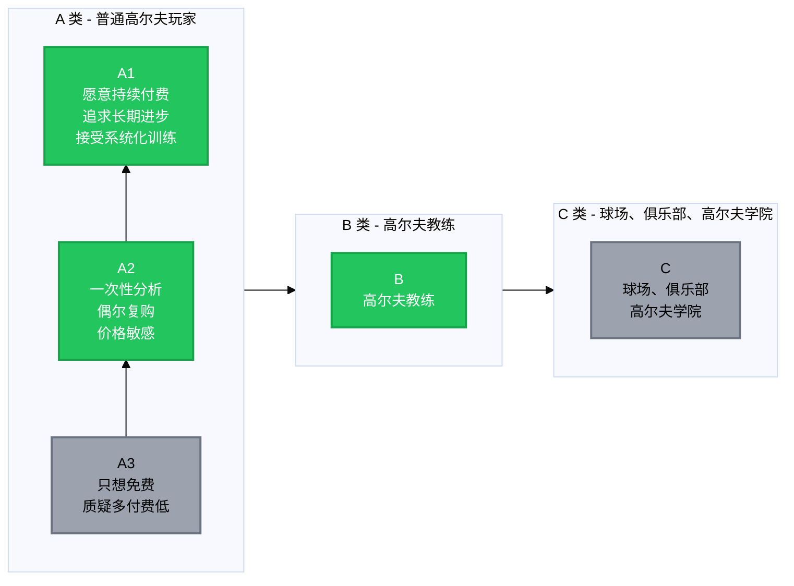

# 用户画像

## 一、用户分层

### 1.1 用户分层图

**核心逻辑：**

| 用户类型 | 关系 | 策略 |
|---------|------|------|
| **A 类** | 目标用户 | A1 重点服务（赚钱） → A2 标准化（赚钱） → A3 不服务（不赚钱） |
| **B 类** | 战略用户（不一定赚钱但重要） | 让教练"不反对"即可 |
| **C 类** | 暂不考虑 | 未来机会 |

### 1.2 用户分层详情

#### A 类用户 - 普通高尔夫玩家

| 分类 | 特征 | 策略 |
|------|------|------|
| **A1 类用户（核心利润）** | 愿意持续付费、追求长期进步、接受系统化训练 | 重点服务，重点打磨体验，适合订阅/高价方案 |
| **A2 类用户（可以要）** | 一次性分析、偶尔复购、对价格有点敏感 | 标准化产品，不要花太多人工 |
| **A3 类用户（要主动挡掉）** | 只想要免费建议、不断质疑专业性、要求多付费低 | 不服务，就是最好的服务 |

#### B 类用户 - 高尔夫教练

战略用户, 要的是他们"不反对 + 偶尔推荐"

作为：

- 课后辅助
- 观察工具
- 沟通工具

特点：

- 不需要他们每天用
- 不需要他们深度依赖

#### C 类用户（暂时不考虑）

- 球场
- 俱乐部
- 高尔夫学院

### 1.3 结论

!!! success "核心用户"
    **A1 - 非教练的认真玩家**

---

## 二、核心用户画像

### 2.1 基本背景

| 维度 | 描述 |
|------|------|
| **年龄** | 28–45 岁 |
| **性别** | 以男性为主（但女性比例在上升） |
| **地区** | 北美 / 一线城市 |
| **收入** | 年收入 $80k–$200k+，有稳定现金流 |
| **职业** | 科技、金融、咨询、创业者、管理层 |
| **高尔夫经验** | 初中级为主（handicap 10–25），想进阶但卡住了 |

### 2.2 心理活动

**在练习场：**

- "这球是运气还是对了？"
- "刚才那个感觉能不能复制？"
- "我是不是又在骗自己？"

**在比赛/下场后：**

- 反复回放某几个失误
- 明明知道哪一杆不该冒险
- 回家还在想

!!! tip "关键洞察"
    👉 他是会把高尔夫"带回家"的人

### 2.3 心理动机

#### 动机一：「我不想再靠运气打球了」

- 今天好，明天差
- 上场像开盲盒
- 对自己没有掌控感

> **他渴望的是"可复制的好表现"**

#### 动机二：「我不想再当傻子一样乱练」

- 花时间了
- 花钱了
- 但不知道自己在干嘛

> **我们 App 本质是在给他"尊严感"**

#### 动机三：「我想知道我是不是已经到天花板了」

这是一个很多人不敢说的心理：

> "如果我真的就这样了，那我至少想知道为什么。"

-  他在寻找一个理性答案
-  不是幻想破 70，而是确认边界

### 2.4 行为特征

**已经：**

- 请过教练（或请过但不满意）
- 买过 TrackMan / launch monitor / swing app

**会：**

- 看 YouTube 教学
- 看数据
- 看对比分析

**但：**

- 信息过载
- 不知道该信谁
- 数据一堆，但没人告诉他"下一步该怎么练"

!!! warning "核心痛点"
    **"不缺信息，缺判断"** 是他们的真实状态。

### 2.5 对价格的态度

| ❌ 不喜欢 | ✅ 可以接受 |
|----------|------------|
| 被"宰" | 不便宜 |
| 不透明 | 值、清楚、稳定 |
| 隐形成本 |  |

---

## 三、为这类人解决什么问题？

### 3.1 卖的不是

- 设备
- App
- 报告

### 3.2 卖的是

!!! quote "核心价值主张"
    "我帮你把复杂的高尔夫动作问题，转化成 **3 个你今天就能执行的训练重点**。"

### 3.3 定位

**我们不是在教高尔夫，而是在"替认真玩家把混乱的练习变成可理解的路径"。**

---

## 四、所以高尔夫是怎么被真正学会的？

### 4.1 具体怎么研究

#### 第一步：拆 5–10 个真实教学场景

比如：

- 新手 Slice
- 中级距离不稳定
- 上场后节奏崩
- 长铁恐惧
- 发力用手过多

!!! note "研究重点"
    👉 不要总结"方法"，
    👉 总结教练怎么决策

#### 第二步：把教练的话"翻译成可执行指令"

- 80% 的教学语言 AI 可以做得更好
- 20% 的"感觉类语言"必须被重新设计

#### 第三步：用"如果–那么"逻辑写出来

- 如果 pelvis rotation 延迟 → 不说肩
- 如果节奏乱 → 不给技术细节

👉 这是产品未来的"隐形大脑"

### 4.2 目标

!!! success "核心目标"
    **一个真人教练 60 分钟的决策过程，拆成 10 个 AI 能执行的节点**
