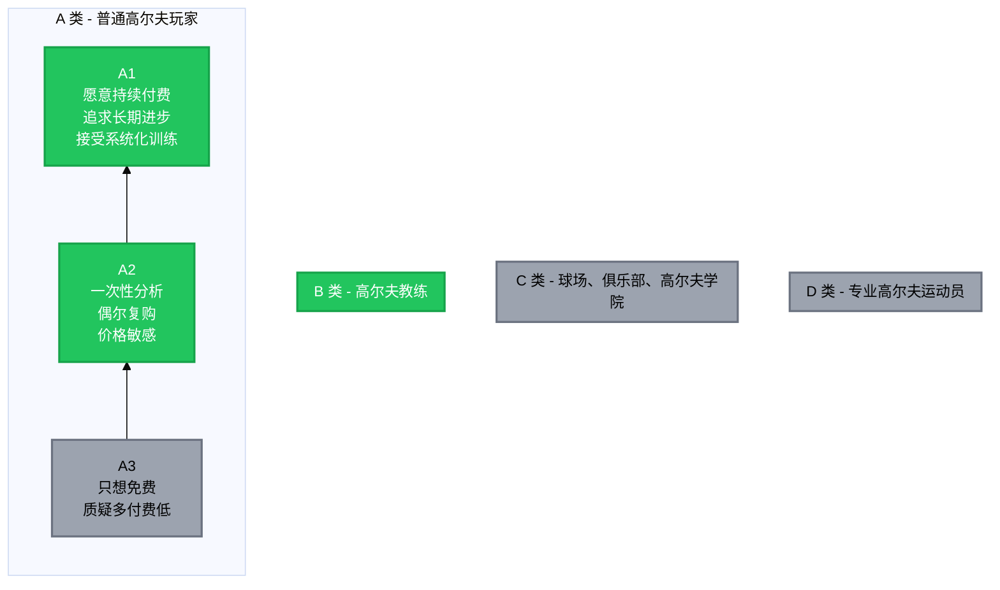

# 用户画像

---

## 一、用户分类

### 1.1 按身份和付费意愿分类

**策略：**

| 用户类型 | 关系 | 策略 |
|---------|------|------|
| **A 类** | 目标用户 | A1 重点服务（赚钱） → A2 标准化（赚钱） → A3 不服务（不赚钱） |
| **B 类** | 战略用户（不一定赚钱但重要） | 让教练"不反对"即可 |
| **C 类** | 暂不考虑 | 未来机会 |
| **D 类** | 暂不考虑 | 未来机会 |

#### (1) A 类用户 - 普通高尔夫玩家

| 分类 | 特征 | 策略 |
|------|------|------|
| **A1 类用户（核心利润）** | 愿意持续付费、追求长期进步、接受系统化训练 | 重点服务，重点打磨体验，适合订阅/高价方案 |
| **A2 类用户（可以要）** | 一次性分析、偶尔复购、对价格有点敏感 | 标准化产品，不要花太多人工 |
| **A3 类用户（要主动挡掉）** | 只想要免费建议、不断质疑专业性、要求多付费低 | 不服务，就是最好的服务 |

#### (2) B 类用户 - 高尔夫教练

**为什么是战略用户而非目标用户？**

- 市场规模小 — 教练数量远少于玩家
- 付费动力弱 — 他们靠教学赚钱，不是靠工具
- 替代威胁敏感 — 可能把 AI 工具视为竞争对手

**为什么必须重视？**

1. **影响力杠杆** — 1 个教练影响 20-50 个学员，教练推荐 = 高质量获客
2. **专业背书** — "我的教练也用这个" → 用户信任度大增
3. **降低用户流失** — 教练说"可以参考" → 留存；教练说"不准" → 卸载

**策略：让他们"不反对 + 偶尔推荐"**

| 要做的 | 不要做的 |
|--------|----------|
| 定位为"课后辅助工具" | 定位为"AI 教练" |
| 帮教练观察学员问题 | 替代教练的判断 |
| 让教练用我们的数据沟通 | 直接给学员"诊断" |

**具体做法：**

- 不抢饭碗 — 明确说"辅助工具，不替代真人教练"
- 提供价值 — 给教练学员的挥杆数据，帮他们备课
- 低门槛 — 不需要他们深度学习或每天使用
- 偶尔推荐就够 — "你可以试试这个 App 记录一下"

!!! tip "结论"
    教练是**口碑传播节点**，不是收入来源。花 20% 精力让他们不反对，比花 100% 精力让他们付费，ROI 更高。

#### (3) C 类用户（暂时不考虑）

- 球场
- 俱乐部
- 高尔夫学院

#### (4) D 类用户（暂时不考虑）

- 专业高尔夫运动员

### 1.2 按用户技术水平分类

#### 1.2.1 聚焦中阶用户

高尔夫用户可分为三层，**中阶是真正的付费密集区**：

| 用户层级 | 特征 | 市场适合度 | 原因 |
|---------|------|-----------|------|
| **新手** | 完全不会打 | ❌ 不适合 | 高依赖真人教练，低判断力，低留存 |
| **中阶** | 能打但不稳定 | ✅ **最适合** | 有判断力，愿意付费，需要验证 |
| **高阶** | 稳定低差点 | ⚠️ 小众 | 需求高度专业化，市场小 |

#### 1.2.2 中阶用户画像

典型中阶高尔夫用户：

- ✅ 能打到球
- ✅ 能下场
- ✅ 有固定挥杆
- ❌ 但结果极不稳定
- 💬 常说："我知道我哪里不对，但我改不了 / 不确定"

#### 1.2.3 中阶用户的 5 个核心痛点

| 痛点 | 描述 | 付费意愿 |
|------|------|---------|
| **① 感觉 vs 数据不一致** | 感觉 inside-out，数据显示 over-the-top。"我到底信感觉，还是信结果？" | ⭐⭐⭐⭐⭐ |
| **② 不知道问题出在哪一环** | 手？髋？胸？地面反作用力？高尔夫是典型的链式问题（kinetic chain） | ⭐⭐⭐⭐⭐ |
| **③ 教练说法前后不一致** | 上一个教练说"转多点"，下一个教练说"别转那么多" | ⭐⭐⭐⭐ |
| **④ 改动作 = 短期变差** | 改 2 周，成绩下降，怀疑一切。"我是不是在走对的方向？" | ⭐⭐⭐⭐⭐ |
| **⑤ 受伤 & 身体限制** | 腰、肘、肩问题多，但医学和教学严重脱节 | ⭐⭐⭐⭐ |

#### 1.3 结论

!!! success "核心用户"
    **非教练的认真中阶玩家**

---

## 二、核心用户画像

### 2.1 基本背景

| 维度 | 描述 |
|------|------|
| **年龄** | 28–45 岁 |
| **性别** | 以男性为主（但女性比例在上升） |
| **地区** | 北美 / 一线城市 |
| **收入** | 年收入 $80k–$200k+，有稳定现金流 |
| **职业** | 科技、金融、咨询、创业者、管理层 |
| **高尔夫经验** | 初中级为主（[handicap](../reference/golf-glossary.md) 10–25），想进阶但卡住了 |

### 2.2 心理活动

**在练习场：**

- "这球是运气还是对了？"
- "刚才那个感觉能不能复制？"
- "我是不是又在骗自己？"

**在比赛/下场后：**

- 反复回放某几个失误
- 明明知道哪一杆不该冒险
- 回家还在想

!!! tip "关键洞察"
    👉 他是会把高尔夫"带回家"的人

### 2.3 心理动机

#### 动机一：「我不想再靠运气打球了」

- 今天好，明天差
- 上场像开盲盒
- 对自己没有掌控感

> **他渴望的是"可复制的好表现"**

#### 动机二：「我不想再当傻子一样乱练」

- 花时间了
- 花钱了
- 但不知道自己在干嘛

> **我们 App 本质是在给他"尊严感"**

#### 动机三：「我想知道我是不是已经到天花板了」

这是一个很多人不敢说的心理：

> "如果我真的就这样了，那我至少想知道为什么。"

-  他在寻找一个理性答案
-  不是幻想破 70，而是确认边界

### 2.4 行为特征

**已经：**

- 请过教练（或请过但不满意）
- 买过 TrackMan / launch monitor / swing app

**会：**

- 看 YouTube 教学
- 看数据
- 看对比分析

**但：**

- 信息过载
- 不知道该信谁
- 数据一堆，但没人告诉他"下一步该怎么练"

!!! warning "核心痛点"
    **"不缺信息，缺判断"** 是他们的真实状态。

### 2.5 对价格的态度

| ❌ 不喜欢 | ✅ 可以接受 |
|----------|------------|
| 被"宰" | 不便宜 |
| 不透明 | 值、清楚、稳定 |
| 隐形成本 |  |

---

## 三、我们为核心用户解决什么问题？

### 3.1 卖的不是

- 设备
- App
- 报告

### 3.2 卖的是

!!! quote "一套完整的系统性解决方案"
    "我帮你把复杂的高尔夫动作问题，转化成 **3 个你今天就能执行的训练重点**。"

### 3.3 定位

**我们不是在教高尔夫，而是在"替认真玩家把混乱的练习变成可理解的路径"。**

---

## 四、所以高尔夫是怎么被真正学会的？

### 4.1 具体怎么研究

#### 第一步：拆 5–10 个真实教学场景

比如：

- 新手 Slice
- 中级距离不稳定
- 上场后节奏崩
- 长铁恐惧
- 发力用手过多

!!! note "研究重点"
    👉 不要总结"方法"，
    👉 总结教练怎么决策

#### 第二步：把教练的话"翻译成可执行指令"

- 80% 的教学语言 AI 可以做得更好
- 20% 的"感觉类语言"必须被重新设计

#### 第三步：用"如果–那么"逻辑写出来

- 如果 pelvis rotation 延迟 → 不说肩
- 如果节奏乱 → 不给技术细节

👉 这是产品未来的"隐形大脑"

### 4.2 目标

!!! success "核心目标"
    **一个真人教练 60 分钟的决策过程，拆成 10 个 AI 能执行的节点**
