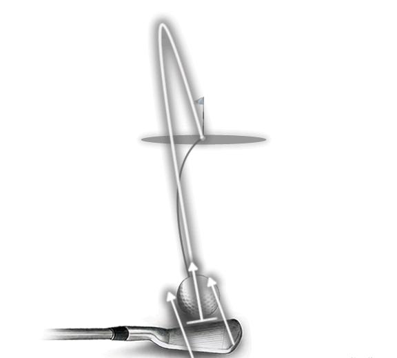

# 高尔夫术语表

> 本文档包含 Movement Chain AI 产品相关的高尔夫术语定义

---

## 术语索引

| # | 术语 | 英文 | 简要说明 |
|---|------|------|----------|
| 1 | [差点](#1-差点-handicap) | Handicap | 球员水平指标，数字越小越好 |
| 2 | [节奏比](#2-节奏比-tempo-ratio) | Tempo Ratio | 上杆/下杆时间比值，职业标准 3:1 |
| 3 | [引导侧与后侧](#3-引导侧与后侧-lead-trail-side) | Lead Side & Trail Side | 避免左右混淆的通用命名 |
| 4 | [杆头速度](#4-杆头速度-clubhead-speed) | Clubhead Speed | 击球瞬间球杆速度，决定距离的关键 |
| 5 | [X-Factor Stretch](#5-x-factor-stretch) | X-Factor Stretch | 转换期额外蓄力，爆发力的关键 |
| 6 | [峰值速度](#6-峰值速度-peak-velocity) | Peak Velocity | 各身体部位的最大角速度 |
| 7 | [峰值间隔](#7-峰值间隔-time-between-peaks) | Time Between Peaks | 相邻部位达峰的时间差，运动链效率的关键 |
| 8 | [球路](#8-球路-ball-flight) | Ball Flight | 球的飞行弯曲方向，由杆面和挥杆路径决定 |

---

## 1. 差点 (Handicap) {#1-差点-handicap}

**一句话定义：** 差点就是你比标准杆多打的杆数，数字越小水平越高。

---

### 基本概念

| 术语 | 含义 |
|------|------|
| **标准杆 (Par)** | 球场设计的"理想"杆数，通常 18 洞 = 72 杆 |
| **差点 (Handicap)** | 你的平均成绩与标准杆的差距 |

**每洞标准杆：**

- **Par 3** — 短洞（1 杆上果岭 + 2 推杆）
- **Par 4** — 中洞（2 杆上果岭 + 2 推杆）
- **Par 5** — 长洞（3 杆上果岭 + 2 推杆）

典型 18 洞组合：4 个 Par 3 + 10 个 Par 4 + 4 个 Par 5 = **72 杆**

---

### 水平对照

| 差点范围 | 水平 | 描述 | 18洞预期成绩 |
|---------|------|------|-------------|
| 0-5 | 高阶 | 接近职业水平，稳定低差点 | 72-77 杆 |
| 5-10 | 中高阶 | 认真爱好者，成绩稳定 | 77-82 杆 |
| **10-18** | **中阶** | **能下场，有固定挥杆，但不稳定** | **82-90 杆** |
| **18-25** | **中低阶** | **能打到球，但失误多** | **90-97 杆** |
| 25-36 | 初学者 | 刚开始学习 | 97-108 杆 |
| 36+ | 新手 | 完全初学 | 108+ 杆 |

> **目标用户：** 差点 10-25 的中阶/中低阶球员是我们的核心用户群

---

### 计算方式

**简化版：**

```
差点 ≈ (平均成绩 - 球场标准杆) × 0.96
```

例：平均打 90 杆 → (90-72) × 0.96 ≈ **差点 17**

**官方计算（USGA/WHS 世界差点系统）：**

1. 取最近 **20 轮成绩中最好的 8 轮**
2. 每轮计算差点差异：
   ```
   差点差异 = (实际成绩 - Course Rating) × (113 ÷ Slope Rating)
   ```
   - **Course Rating**：该球场对标准杆球员的难度评分
   - **Slope Rating**：球场对业余球员的相对难度（113 为标准值）
3. 取 8 轮平均值 × 0.96 = **Handicap Index**

**举例：**

- 球场 Course Rating 72.0，Slope Rating 125
- 你打了 90 杆
- 差点差异 = (90 - 72) × (113 ÷ 125) = **16.3**

---

### 作用

让不同水平的球员可以**公平竞技**——比赛时低差点球员让高差点球员若干杆。

---

## 2. 节奏比 (Tempo Ratio) {#2-节奏比-tempo-ratio}

**一句话定义：** 节奏比是上杆时间与下杆时间的比值，职业球手通常为 3:1。

---

### 计算公式

$$
\text{节奏比} = \frac{\text{上杆时间}}{\text{下杆时间}}
$$

### 标准数值

| 水平 | 节奏比 | 上杆时间 | 下杆时间 |
|------|--------|----------|----------|
| **职业球手** | 3:1 | ~0.75s | ~0.25s |
| **业余球手** | 2:1 ~ 2.5:1 | 变化大 | 变化大 |

### 为什么重要

- **一致性**：节奏稳定的球手，击球更稳定
- **力量传递**：正确的节奏让运动链顺畅发力
- **压力下表现**：节奏是抗压的锚点，紧张时容易乱

### 关键认知

!!! tip "节奏比是诊断工具，不是训练目标"
    - 3:1 是参考值，不是绝对标准
    - 每个人有自己的自然节奏（快如 Nick Price，慢如 Ernie Els）
    - **关键是保持一致**，而不是追求某个数字

### 常见问题

| 问题 | 表现 | 后果 |
|------|------|------|
| **节奏比过低** (如 2:1) | 上杆太快 | 没有充分蓄力，力量不足 |
| **节奏比过高** (如 4:1) | 下杆太慢 | 挥杆不够果断，失去爆发力 |

### 训练方法

- **Tour Tempo 方法**：使用节拍器，常用节拍 21/7（上杆21拍，下杆7拍）
- **关注过渡区**：上杆顶点到下杆启动的转换，最容易打乱节奏

> 详细生物力学分析见：[生物力学入门 - 节奏比](../design/foundations/biomechanics-101.md#节奏比-tempo-ratio)

---

## 3. 引导侧与后侧 (Lead Side & Trail Side) {#3-引导侧与后侧-lead-trail-side}

**一句话定义：** 高尔夫中用"引导侧"和"后侧"代替"左右"，避免左右手球员的混淆。

---

### 基本定义

| 术语 | 右手球员 | 左手球员 | 作用 |
|------|----------|----------|------|
| **引导侧 (Lead Side)** | 左侧 | 右侧 | 面向目标，承受击球冲击 |
| **后侧 (Trail Side)** | 右侧 | 左侧 | 背向目标，提供旋转动力 |

### 为什么不用"左右"

- **通用性**：同一套术语适用于左右手球员
- **功能描述**：名称本身说明了该侧在挥杆中的角色
- **国际标准**：全球高尔夫教学的通用语言

### 各阶段的角色

| 挥杆阶段 | 引导侧作用 | 后侧作用 |
|----------|------------|----------|
| **上杆** | 保持稳定，抵抗侧移 | 主导旋转，蓄积能量 |
| **转换期** | 启动下杆，引导重心转移 | 保持蓄力，准备释放 |
| **下杆** | 拉动身体，承受冲击 | 推动旋转，释放能量 |
| **收杆** | 支撑身体，保持平衡 | 完成旋转，自然跟随 |

### 常见问题

| 问题 | 表现 | 后果 |
|------|------|------|
| **引导侧塌陷** | 引导侧髋部/膝盖向目标侧移 | 击球不实，力量损失 |
| **后侧过早释放** | 后侧手臂/手腕提前释放 | 早释放，失去距离 |
| **引导侧阻断** | 引导侧髋部旋转受阻 | 挥杆被卡住，方向失控 |

### 对传感器项目的意义

!!! tip "Movement Chain AI 的应用"
    1. **IMU 命名规范**：传感器位置使用 lead/trail 而非 left/right
    2. **算法复用**：动作分析只需一套逻辑，通过配置切换左右手模式
    3. **数据通用性**：标注和指标报告对两种球员通用，无需维护两套术语

> 详细生物力学分析见：[生物力学入门 - 引导侧与后侧](../design/foundations/biomechanics-101.md#14-引导侧与后侧-lead-side--trail-side)

---

## 4. 杆头速度 (Clubhead Speed) {#4-杆头速度-clubhead-speed}

**一句话定义：** 杆头速度是击球瞬间球杆头部的移动速度，是决定击球距离的最关键因素。

---

### 计算公式

$$
\text{球速} \approx \text{杆头速度} \times \text{Smash Factor}
$$

- **Smash Factor（击球效率）**：典型值 1.45-1.50（一号木）
- 例：杆头速度 100 mph × 1.48 = 球速 148 mph

### 不同水平参考值

| 水平 | 杆头速度 (一号木) | 预期开球距离 |
|------|------------------|-------------|
| **PGA 巡回赛** | 113-125 mph | 280-320 码 |
| **低差点 (0-5)** | 100-110 mph | 250-280 码 |
| **中差点 (10-18)** | 85-95 mph | 200-240 码 |
| **高差点 (25+)** | 70-85 mph | 160-200 码 |
| **LPGA 巡回赛** | 94-100 mph | 240-270 码 |

### 影响因素

杆头速度由以下公式决定：

$$
v_{杆头} = \omega \times r
$$

#### 1. 角速度 ω（主要因素）

角速度受**两个机制**影响：

##### 机制 A：角动量传递效率

$$
\omega = \frac{L}{I}
$$

| 因素 | 如何影响 ω | 物理原理 |
|------|-----------|----------|
| **运动链时序** | I 依次减小 → ω 增大 | 骨盆→躯干→手臂→杆头，每传递一次 I 减小 |
| **近端减速** | 加速角动量传递 | 躯干刹车 → 手臂加速 |
| **肌肉放松** | 减少传递损耗 | 紧张会"锁住"关节，阻碍传递 |

##### 机制 B：能量输入

$$
\omega = \sqrt{\frac{2E}{I}}
$$

| 因素 | 如何影响 E | 物理原理 |
|------|-----------|----------|
| **X-Factor** | 储存弹性势能 | $E = \frac{1}{2}k\theta^2$，躯干扭紧 |
| **X-Factor Stretch** | 额外 +20% 能量 | 转换期再蓄力 + SSC 效应 |
| **肌肉做功** | 持续输入能量 | 下杆过程中肌肉发力 |
| **地面反作用力** | 启动能量来源 | 脚蹬地产生初始力矩 |

#### 2. 旋转半径 r（次要因素）

$$
v = \omega \times r
$$

| 因素 | 如何影响 r | 注意 |
|------|-----------|------|
| **手臂伸展** | r 增大 → v 增大 | 但过度伸展会增加 I，降低 ω |
| **球杆长度** | 固定值 | 一号木 r 最大 |
| **身高/臂长** | 个体差异 | 高个子有天然优势 |

#### 综合公式

$$
v_{杆头} = \sqrt{\frac{2(E_{弹性} + W_{肌肉})}{I_{杆头}}} \times r
$$

#### 各因素影响程度

| 因素 | 影响对象 | 重要程度 | 可训练性 |
|------|----------|:--------:|:--------:|
| **运动链时序** | I 减小效率 | ⭐⭐⭐⭐⭐ | 高 |
| **X-Factor Stretch** | E 储存量 | ⭐⭐⭐⭐⭐ | 高 |
| **地面反作用力** | L 产生量 | ⭐⭐⭐⭐ | 中 |
| **X-Factor** | E 储存量 | ⭐⭐⭐ | 中 |
| **核心力量** | E 输入量 | ⭐⭐⭐ | 高 |
| **手臂半径 r** | 杆头速度 | ⭐⭐ | 低 |

#### 为什么职业球手更快？

```
职业球手                          业余球手
─────────────────────────────────────────────
地面反作用力：充分利用              利用不足
    ↓ 产生更多 L                     ↓ L 较少
X-Factor Stretch：15-25%          5-10%
    ↓ 储存更多 E                     ↓ E 较少
运动链时序：精准                   混乱
    ↓ I 高效减小                     ↓ 传递损耗
肌肉：适时发力+放松                全程紧张
    ↓ 能量顺畅传递                   ↓ 能量被"锁住"
─────────────────────────────────────────────
结果：120+ mph                     85-95 mph
```

**核心结论**：杆头速度 = 角动量传递效率 × 能量输入 × 旋转半径。三者中，**传递效率**最关键，也最可训练。

> 详细物理概念见：[物理学术语表](physics-glossary.md)

### 与 Movement Chain AI 的关系

!!! tip "我们的系统如何帮助提升杆头速度"
    我们不直接测量杆头速度（需要雷达如 TrackMan），但通过分析：

    - **运动链时序** — 是否按正确顺序发力
    - **节奏比** — 是否有足够的蓄力和爆发
    - **X-Factor** — 躯干拧紧程度

    这些指标帮助球手优化挥杆效率，间接提升杆头速度。

> 详细生物力学分析见：[生物力学入门 - 杆头速度](../design/foundations/biomechanics-101.md#杆头速度-线速度)

---

## 5. X-Factor Stretch {#5-x-factor-stretch}

**一句话定义：** X-Factor Stretch 是转换期（下杆启动瞬间）X-Factor 的额外增量，是爆发力的关键来源。

---

### 与 X-Factor 的区别

| 概念 | 定义 | 类型 |
|------|------|------|
| **X-Factor** | 肩膀角度 − 骨盆角度 | 瞬时值（某一时刻的角度差） |
| **X-Factor Stretch** | 转换期 X-Factor − 顶点 X-Factor | 变化量（两个时刻的差值） |

### 计算示例

```
时刻              肩膀     骨盆     X-Factor
─────────────────────────────────────────────
上杆顶点 (Top)     90°      45°      45°  ← X-Factor at Top
转换期峰值         92°      37°      55°  ← X-Factor 峰值

X-Factor Stretch = 55° − 45° = 10°（或 +22%）
```

### 为什么会产生 Stretch？

转换期发生了一个**反直觉的动作**：

1. 髋部已经开始向目标转动（主动启动下杆）
2. 肩膀还在继续向后（惯性滞后）
3. 躯干被**进一步拧紧**，储存额外弹性势能

```
普通挥杆：上杆蓄力 → 下杆释放
职业挥杆：上杆蓄力 → 转换期再蓄力 → 下杆释放
                      ↑
                这就是 Stretch
```

### 物理原理

把躯干想象成一根**扭转弹簧**：

$$
E = \frac{1}{2} k \theta^2
$$

- k = 躯干扭转刚度（核心力量）
- θ = 扭转角度（X-Factor）

**关键**：能量与角度的**平方**成正比。角度增加 10%，能量增加约 23%。

这就是为什么 Stretch 虽然只有几度，但对爆发力贡献很大——它发生在能量即将释放的临界点。

### 基准值

| 水平 | X-Factor Stretch | 解读 |
|------|-----------------|------|
| 初学者 | < 5% | 没有"蓄力"动作 |
| 业余球手 | 5-10% | 有一定分离 |
| 低差点 | 10-15% | 较好的转换时机 |
| **职业球手** | **15-25%** | 明显的肩髋分离增量 |

### 为什么 Stretch 比 X-Factor 更重要？

研究发现：

| 指标 | 与杆头速度相关性 |
|------|-----------------|
| X-Factor (顶点) | r = 0.60（中等） |
| **X-Factor Stretch** | **r = 0.85（强）** |

> "X-Factor Stretch 在高水平球手中**显著大于**低水平球手，而 X-Factor 本身没有显著差异"

### 拉伸-缩短循环 (SSC)

X-Factor Stretch 利用了运动生物力学中的核心原理：

```
肌肉先被拉长（离心收缩）→ 快速缩短（向心收缩）= 更大爆发力
```

这个机制存在于几乎所有爆发力运动中：

| 运动 | 预拉伸阶段 | 类似"Stretch"的动作 |
|------|-----------|-------------------|
| 跳高 | 下蹲 | 起跳前膝盖再弯一点 |
| 投掷 | 手臂后引 | 躯干先转，手臂滞后 |
| 拳击 | 收拳蓄力 | 髋部先转，拳头滞后 |
| 网球发球 | 背弓 | 腿蹬地时背部进一步拉伸 |

### 与 Movement Chain AI 的关系

!!! tip "我们如何检测 X-Factor Stretch"
    - **视觉分析**：测量肩髋角度变化
    - **IMU 传感器**：捕捉精确的转换时机（毫秒级）
    - **结合两者**：计算 Stretch 值和时序质量

    这是区分业余与职业挥杆的**核心指标之一**。

> 详细生物力学分析见：[生物力学入门 - X-Factor Stretch](../design/foundations/biomechanics-101.md#23-x-factor-stretch职业球手的秘密武器)

---

## 6. 峰值速度 (Peak Velocity) {#6-峰值速度-peak-velocity}

**一句话定义：** 峰值速度是某个身体部位在挥杆过程中达到的**最大角速度**。

---

### 基本概念

每个身体部位在挥杆中都有一个速度曲线，峰值是曲线的最高点：

```
角速度
 ↑
    ┌──●── 峰值 (Peak)
   /       \
  /         \
 /           \
────────────────→ 时间
            达峰时刻
```

### 各部位峰值速度基准

| 身体部位 | 职业球手 | 业余球手 | 差距 |
|----------|----------|----------|------|
| **骨盆 Pelvis** | 477°/s | 395°/s | -17% |
| **躯干 Thorax** | 552°/s | 450°/s | -18% |
| **手臂 Arms** | 1200°/s | 900°/s | -25% |
| **球杆 Club** | 2500°/s | 1800°/s | -28% |

### 峰值速度递增原理

从骨盆到球杆，峰值速度**逐级递增**：

$$
\omega_{骨盆} < \omega_{躯干} < \omega_{手臂} < \omega_{球杆}
$$

这是因为：

1. **角动量守恒**：$L = I \times \omega$，当 I 减小时 ω 增大
2. **转动惯量递减**：骨盆 > 躯干 > 手臂 > 球杆
3. **能量传递**：每传递一次，速度被"放大"

```
骨盆 (大I, 小ω)
    ↓ 角动量传递
躯干 (中I, 中ω)
    ↓ 角动量传递
手臂 (小I, 大ω)
    ↓ 角动量传递
球杆 (最小I, 最大ω) ← 速度最大化
```

### 达峰时机

以转换期开始为 0ms：

| 身体部位 | 达峰时间 | 峰值速度 |
|----------|----------|----------|
| 骨盆 | 50-70ms | 477°/s |
| 躯干 | 70-90ms | 552°/s |
| 手臂 | 100-120ms | 1200°/s |
| 球杆 | 130-150ms | 2500°/s |

### 与 Movement Chain AI 的关系

!!! tip "我们如何测量峰值速度"
    - **IMU 传感器**：直接测量各部位角速度
    - **视觉分析**：通过姿态变化计算角速度
    - **融合算法**：结合两者提高精度

    峰值速度是评估**运动链效率**的核心指标。

---

## 7. 峰值间隔 (Time Between Peaks) {#7-峰值间隔-time-between-peaks}

**一句话定义：** 峰值间隔 (TBP) 是相邻两个身体部位**达到峰值速度**之间的时间差。

---

### 基本概念

```
时间轴示意：

骨盆峰值         躯干峰值         手臂峰值         球杆峰值
    ↓               ↓               ↓               ↓
────●───────────────●───────────────●───────────────●──→ 时间
    |←───TBP₁───→|←───TBP₂───→|←───TBP₃───→|
         ~40ms          ~40ms          ~20ms
```

### 最佳范围

| TBP 范围 | 状态 | 后果 |
|----------|------|------|
| **<10ms** | 间隔太小 | 几乎同时达峰，能量传递不充分 |
| **20-50ms** | 最佳范围 | 充分传递，速度叠加 |
| **>60ms** | 间隔太大 | 能量在等待中泄漏 |

### 物理意义

TBP 反映了**角动量传递的时机**：

```
骨盆达峰 → 骨盆开始减速 → 角动量传给躯干
    ↓
躯干加速 → 躯干达峰 → 躯干开始减速 → 角动量传给手臂
    ↓
手臂加速 → 手臂达峰 → 手臂开始减速 → 角动量传给球杆
    ↓
球杆加速 → 球杆达峰 → 击球！
```

**关键**：近端必须先减速，远端才能加速。TBP 就是这个"交接"的时间窗口。

### 常见时机错误

#### 错误 1：同步达峰 (TBP ≈ 0)

```
问题：骨盆和躯干同时达到峰值

后果：
- 失去 10-20% 杆头速度
- 能量无法有效传递
- 常见于 25% 的业余球手
```

#### 错误 2：延迟传递 (TBP > 60ms)

```
问题：各部位达峰间隔过大

后果：
- 失去 5-15% 杆头速度
- 能量在传递过程中泄漏
- 常见于 20% 的业余球手
```

#### 错误 3：顺序颠倒

```
问题：手臂在骨盆之前达到峰值

错误模式：手臂 → 躯干 → 骨盆 (完全颠倒)

后果：
- 失去 20-30% 杆头速度
- "手臂挥杆" 的典型特征
- 常见于 30% 的业余球手
```

### 职业 vs 业余对比

```
┌─────────────────────────────────────────────────────────────────┐
│                  职业 vs 业余 运动链对比                          │
├─────────────────────────────────────────────────────────────────┤
│                                                                  │
│  【职业球手】75% 呈现正确模式                                      │
│                                                                  │
│  达峰顺序:  ① 骨盆 → ② 躯干 → ③ 手臂 → ④ 球杆                    │
│  时间间隔:     ~40ms     ~40ms     ~20ms                         │
│  特点: 清晰的"阶梯式"传递，每段减速时下一段加速                     │
│                                                                  │
│  ════════════════════════════════════════════════════════════   │
│                                                                  │
│  【业余球手】常见错误模式                                          │
│                                                                  │
│  错误 A: ① 骨盆 → ②③ 躯干+手臂同时 → ④ 球杆                       │
│          （躯干和手臂"一起动"，能量传递断裂）                       │
│                                                                  │
│  错误 B: ②① 躯干先于骨盆 → ③ 手臂 → ④ 球杆                        │
│          （"上身主导"，俗称 over the top）                         │
│                                                                  │
│  错误 C: ①②③④ 几乎同时达峰                                        │
│          （没有顺序，"用手打球"）                                  │
│                                                                  │
└─────────────────────────────────────────────────────────────────┘
```

| 对比维度 | 职业球手 | 业余球手 |
|----------|----------|----------|
| 顺序正确率 | 89% | ~50% |
| 骨盆峰值速度 | 477°/s | 395°/s |
| 峰值间隔 TBP | 20-40ms | <10ms 或 >60ms |
| 杆头速度 | 110-125 mph | 85-95 mph |

### 鞭子类比

```
甩鞭子时：
手腕达峰 → 手腕减速 → 鞭身加速 → 鞭身达峰 → 鞭身减速 → 鞭尖加速

如果手腕和鞭身同时达峰（TBP=0）：
- 鞭尖根本不会发出响声
- 能量没有"传"出去

正确的时序（TBP=20-50ms）：
- 能量像波浪一样传递
- 鞭尖获得超音速速度
```

### 与 Movement Chain AI 的关系

!!! tip "我们如何检测峰值间隔"
    - **IMU 传感器**：精确捕捉各部位达峰时刻（毫秒级）
    - **算法分析**：自动计算 TBP 并与基准值对比
    - **反馈建议**：针对具体的时序错误给出训练建议

    TBP 是诊断**运动链时序问题**的核心指标。

> 详细生物力学分析见：[生物力学入门 - 运动链时序](../design/foundations/biomechanics-101.md)

---

## 8. 球路 (Ball Flight) {#8-球路-ball-flight}

**一句话定义：** 球路是指高尔夫球在空中飞行时的弯曲方向，由杆面角度和挥杆路径的相对关系决定。

---

### 基本球路类型

以下针对**右手球员**（左手球员方向相反）：

| 球路 | 英文 | 弯曲方向 | 程度 | 评价 |
|------|------|----------|------|------|
| **右曲球** | Slice | 向右弯 | 严重 | ❌ 最常见的业余问题 |
| **小右曲** | Fade | 向右弯 | 轻微可控 | ✅ 职业球员常用 |
| **小左曲** | Draw | 向左弯 | 轻微可控 | ✅ 能增加距离 |
| **左曲球** | Hook | 向左弯 | 严重 | ❌ 不可控 |
| **直球** | Straight | 不弯 | - | 理想但难以实现 |

### 球路示意图

```text
        目标 🏁
          ↑
  Hook ← | → Slice
  Draw ← | → Fade
          |
         ⚪ 球
          |
         🧍 你（右手球员）


Slice (大右曲):          Fade (小右曲):           Draw (小左曲):          Hook (大左曲):
       🏁                     🏁                      🏁                      🏁
        \                      \                     /                      /
         \                      \                   /                      /
          \  严重向右弯           \ 轻微右弯        / 轻微左弯              / 严重向左弯
           \                      \               /                      /
            ⚪                      ⚪             ⚪                      ⚪
```

### 物理原理

球的弯曲由**杆面角度**与**挥杆路径**的相对关系决定：

```text
杆面角度 (Face Angle): 击球时杆面指向的方向
挥杆路径 (Swing Path): 杆头移动的方向

侧旋 = 杆面角度 − 挥杆路径
```

| 情况 | 杆面 vs 路径 | 侧旋方向 | 球路 |
|------|-------------|----------|------|
| 杆面朝右于路径 | 杆面开放 | 顺时针 | 右曲 (Slice/Fade) |
| 杆面朝左于路径 | 杆面关闭 | 逆时针 | 左曲 (Hook/Draw) |
| 杆面=路径 | 方正 | 无 | 直球 |

### 常见原因

#### Slice (右曲球) 的原因

```text
1. Outside-In 挥杆路径（从外向内切球）
2. 握杆太弱（杆面无法关闭）
3. 早释放（手腕过早打开）
4. Over-the-Top（从外侧下杆）
```

#### Hook (左曲球) 的原因

```text
1. Inside-Out 挥杆路径过度（从内向外推球）
2. 握杆太强（杆面过度关闭）
3. 手腕翻转过度
4. 下杆时手臂过于主动
```

### 可控 vs 不可控

| 类型 | 可控性 | 特点 | 使用场景 |
|------|:------:|------|----------|
| **Fade** | ✅ 高 | 轻微右弯，落地后滚动少 | 打向右侧障碍时安全 |
| **Draw** | ✅ 高 | 轻微左弯，落地后滚动多 | 增加距离 |
| **Slice** | ❌ 低 | 严重右弯，距离损失大 | 应该纠正 |
| **Hook** | ❌ 低 | 严重左弯，难以控制 | 应该纠正 |

### 如何打出 Draw (小左曲)

**特点**：球开始向右飞，然后左拐回到目标，弹道通常较低。

| Draw 设置示意 | | |
|:--:|:--:|:--:|
| { width="250" } | { width="250" } | { width="250" } |

| 设置项 | 方法 |
|--------|------|
| **握杆** | 更强势握杆（双手向右转，左手在杆面上的位置更靠右） |
| **球位** | 球位略微前移 |
| **杆面** | 击球瞬间，杆面略微关闭（相对挥杆路径） |
| **站位** | 关闭式站位（身体略微向右对准） |
| **挥杆路径** | 由内向外（Inside-out），产生左旋侧旋 |

### 如何打出 Fade (小右曲)

**特点**：球开始向左飞，然后右拐回到目标，弹道通常偏高并且滚动更少。

| Fade 设置示意 | | |
|:--:|:--:|:--:|
| { width="250" } | { width="250" } | { width="250" } |

| 设置项 | 方法 |
|--------|------|
| **握杆** | 更弱势握杆（双手向左转，左手在杆面上的位置更靠左） |
| **球位** | 球位略微后移 |
| **杆面** | 击球瞬间，杆面略微开放（相对挥杆路径） |
| **站位** | 开放式站位（身体略微向左对准） |
| **挥杆路径** | 由外向内（Outside-in），产生右旋侧旋 |

### Draw/Fade vs Slice/Hook 的区别

!!! warning "可控球路 vs 失控球路"
    - **Draw/Fade**：刻意打出的可控弹道，需要配合握杆、站位、杆面角度
    - **Slice/Hook**：失控的球路，通常是技术错误导致

    初学者常见的 Slice 是由于杆面大幅打开和外向内挥杆造成的**失控**，与 Fade 完全不同。

**练习要点**：

- 根据希望的弯曲弧度调整瞄准点
- 练习关闭式/开放式站位与杆面配合的挥杆
- 保持一致性比追求完美更重要

### 职业球员的选择

```text
Fade 派: Jack Nicklaus, Lee Trevino, Colin Montgomerie
Draw 派: Tiger Woods, Rory McIlroy, Ben Hogan

关键: 不是哪种更好，而是选择一种并保持一致
```

### 与 Movement Chain AI 的关系

!!! tip "我们如何帮助改善球路"
    - **视觉分析**：检测挥杆平面和路径
    - **Over-the-Top 检测**：识别导致 Slice 的下杆问题
    - **手腕动作分析**：检测早释放等问题

    通过纠正挥杆动作，间接改善球路问题。

---

## 相关文档

- [商业术语表](business-glossary.md) - 商业相关术语
- [生物力学入门](../design/foundations/biomechanics-101.md) - 挥杆生物力学基础
- [生物力学术语表](../design/foundations/biomechanics-glossary.md) - 专业生物力学术语

---

**最后更新**: 2025年12月20日
